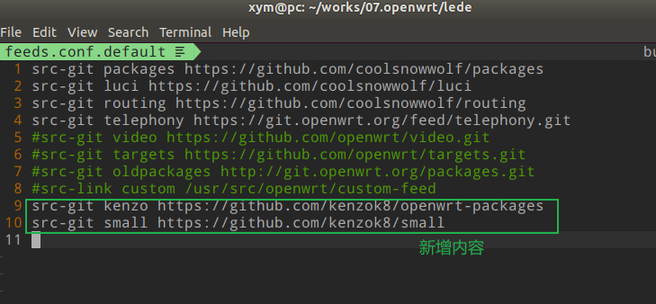
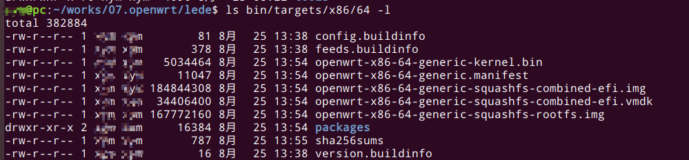

# OperWrt 环境搭建

## 首次编译

1. openwrt源代码下载(lede为例说明)

   ```bash
   #Lean 大佬的源码仓库 需要访问github 可能速度不行 
   git clone https://github.com/coolsnowwolf/lede
   
   # 或者 使用下面的国内镜像源 下载比较快
   git clone https://gitee.com/robot-open-source/lede.git
   ```

2. 修改部分代理 否则编译的时候有肯能会报错

   参见https://github.com/goproxy/goproxy.cn/blob/master/README.zh-CN.md 説明

   ```bash
   export GO111MODULE=on
   export GOPROXY=https://goproxy.cn
   ```

   或者全局生效

   ```bash
   echo "export GO111MODULE=on" >> ~/.profile
   echo "export GOPROXY=https://goproxy.cn" >> ~/.profile
   source ~/.profile
   ```

3. 添加部分软件源

   ```bash
   cd lede
   vim eeds.conf.default
   #最后行添加下面两句
   src-git kenzo https://github.com/kenzok8/openwrt-packages
   src-git small https://github.com/kenzok8/small
   ```

   修改后如下：

   

4. 安装编译依赖

   ```bash
   sudo apt update -y
   sudo apt full-upgrade -y
   sudo apt install -y ack antlr3 asciidoc autoconf automake autopoint binutils bison build-essential \
   bzip2 ccache cmake cpio curl device-tree-compiler fastjar flex gawk gettext gcc-multilib g++-multilib \
   git gperf haveged help2man intltool libc6-dev-i386 libelf-dev libglib2.0-dev libgmp3-dev libltdl-dev \
   libmpc-dev libmpfr-dev libncurses5-dev libncursesw5-dev libreadline-dev libssl-dev libtool lrzsz \
   mkisofs msmtp nano ninja-build p7zip p7zip-full patch pkgconf python2.7 python3 python3-pip libpython3-dev qemu-utils \
   rsync scons squashfs-tools subversion swig texinfo uglifyjs upx-ucl unzip vim wget xmlto xxd zlib1g-dev
   ```

   

5. 更新feeds，feeds是扩展的软件包，独立于 Open­Wrt 源码之外，所以需要单独进行拉取和更新

   ```bash
   ./scripts/feeds update -a     # 更新
   ./scripts/feeds install -a    # 安装
   ```

6. 配置

   ```bash
   #使用默认配置
   make defconfig
   #或者使用自己的配置
   make menuconfig
   ```

   

7. 下载dl库

   ```bash
   make download -j8
   ```

   注意：此时有可能下载文件有问题，使用下面的命令看看下载的文件有没有小于1kb的

   ```bash
   # 列出dl目录下 大小小于1kb的文件
   find dl -size -1024c -exec ls -l {} \;
   
   #如果有小于1kb的文件请执行下面的命令，把下载不完全的文件删除掉，然后重新下载
   find dl -size -1024c -exec rm -f {} \;
   make download
   
   #直到dl目录下没有小于1kb的文件即可，否则请重复执行该步骤，如果重复了很多次还是不行，请放弃吧，你被墙的太狠了
   ```

   **注意**：在编译时需要连接互联网，因为OpenWrt采用补丁包方式来管理代码，第三方的代码不放在它自己的代码库中，仅在编译前从第三方服务器下载（编译时首先从Internet 上下载软件模块代码，因为OpenWrt 仅有编译及配置指令，各种依赖的代码包在上游网站及代码仓库里面。 OpenWrt 网站也有第三方的代码包镜像，在上游网站不可用时将使用 OpenWrt 自己的服 务器地址，下载地址为： http://downloads.openwrt.org/sources/

8. 编译

   ```bash
   # 第一次的时候请使用 -j1  否则可能出错
   make V=s -j1
   ```

9. 编译完成后查看生成的文件

   ```bash
   ls bin/targets/x86/64
   ```

   結果如下：

   

10. todo

## 第二次编译

如果第一次已經编译通过，现在想同步源代码，并重新编译的时候，请执行下面的操作，此时应该比首次的时候要快很多

```bash
cd lede
git pull
./scripts/feeds update -a
./scripts/feeds install -a
make defconfig
make download -j8
make V=s -j$(nproc)
```

## 重新配置

如果第一次已经编译通过，不使用默认配置，自己根据需求配置的话，请执行下面的操作

```bash
rm -rf ./tmp && rm -rf .config
make menuconfig
make V=s -j$(nproc)
```

## 知识点

1. 单独编译模块

   - `make package/tcpdump/clean`：清除编译生成的文件，包含安装包及编译过程生成的 临时文件
   - `make package/tcpdump/prepare`：进行编译准备，包含下载软件代码包、并解压缩和 打补丁
   - `make package/tcpdump/configure`：根据设置选项进行配置并生成 Makefile
   - `make package/tcpdump/compile`：根据生成的 Makefile 进行编译
   - `make package/tcpdump/install`：生成安装包

   注意：上面是一個軟件包单独编译的步骤，且均可以使用`-j -V`参数

   

2. 其他全局编译命令

   - `make download`：下载所有已选择的软件代码压缩包

   - `make clean`：清理bin目录下生成的烧录镜像文件

     ```bash
     clean: FORCE
       rm -rf $(BUILD_DIR) $(STAGING_DIR) $(BIN_DIR) $(OUTPUT_DIR)/packages/$(ARCH_PACKAGES) $(BUILD_LOG_DIR) $(TOPDIR)/staging_dir/packages
     
     ```

     

   - `make dirclean`：make clean+清除交叉编译工具及工具链目录

     ```bash
     dirclean:clean                  
       rm -rf $(STAGING_DIR_HOST) $(STAGING_DIR_HOSTPKG) $(TOOLCHAIN_DIR) $(BUILD_DIR_BASE)/host $(BUILD_DIR_BASE)/hostpkg $(BUILD_DIR_TOOLCHAIN)
       rm -rf $(TMP_DIR)
     
     ```

   - `make distclean`: 清除所有相关的东西，包括下载的软件包，配置文件，feed内容等，一夜回到解放前

   - `git clean -xdf`：还原 Open­Wrt 源码到初始状态

     如果把源码改坏了，想恢复为最初下载的样子

   - `make printdb`：输出所有的编译变量定义

   - `make kernel_menuconfig`：内核配置

3. todo