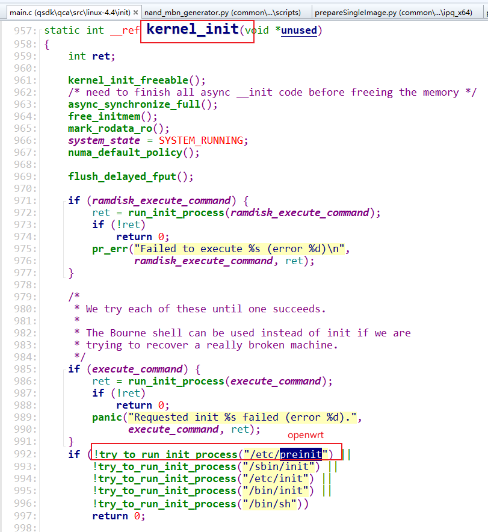
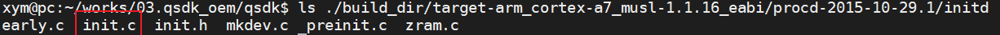
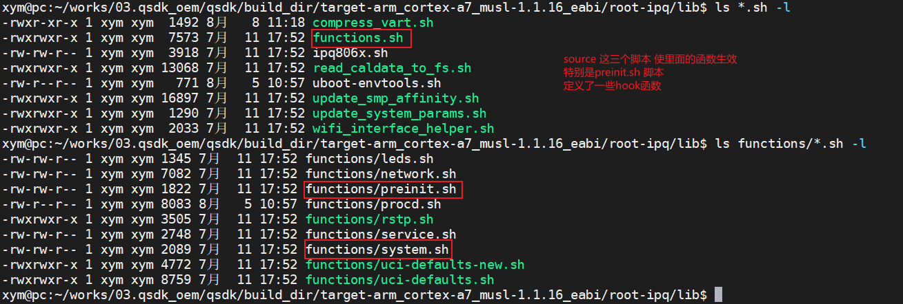
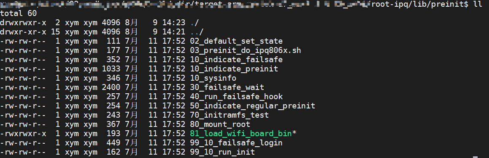
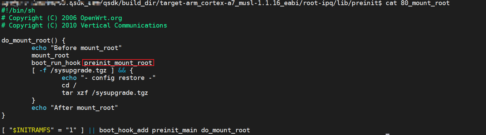
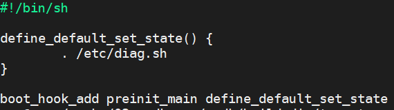
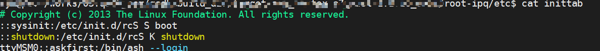
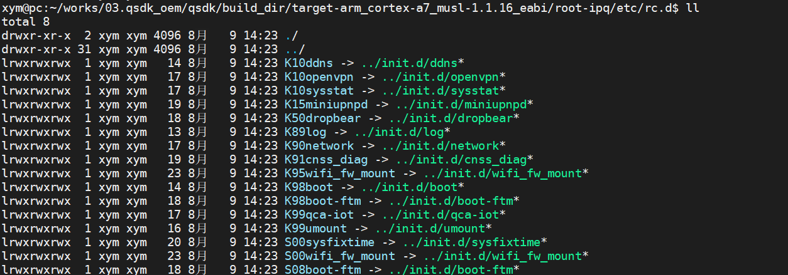

# OperWrt 启动过程

## OpenWrt启动脚本分析

1. 内核代码`start_kernel`函数执行的最后会调用`kernel_init`函数来启动用户空间的一号进程，标准linux默认是的`/etc/init`进程，但在OpenWRT里面会执行`/etc/preinit`，代码如下图992行：

   

2. 下面分析`/etc/preinit`脚本

   `/etc/preinit`脚本内容如下：

   ```bash
   #!/bin/sh
   # Copyright (C) 2006 OpenWrt.org
   # Copyright (C) 2010 Vertical Communications
   
   [ -z "$PREINIT" ] && exec /sbin/init
   
   export PATH=/usr/sbin:/usr/bin:/sbin:/bin
   
   pi_ifname=
   pi_ip=192.168.1.1
   pi_broadcast=192.168.1.255
   pi_netmask=255.255.255.0
   
   fs_failsafe_ifname=
   fs_failsafe_ip=192.168.1.1
   fs_failsafe_broadcast=192.168.1.255
   fs_failsafe_netmask=255.255.255.0
   
   fs_failsafe_wait_timeout=0
   
   pi_suppress_stderr="y"
   pi_init_suppress_stderr="y"
   pi_init_path="/usr/sbin:/usr/bin:/sbin:/bin"
   pi_init_cmd="/sbin/init"
   
   . /lib/functions.sh
   . /lib/functions/preinit.sh
   . /lib/functions/system.sh
   
   boot_hook_init preinit_essential
   boot_hook_init preinit_main
   boot_hook_init failsafe
   boot_hook_init initramfs
   boot_hook_init preinit_mount_root
   
   for pi_source_file in /lib/preinit/*; do
           . $pi_source_file
   done
   
   boot_run_hook preinit_essential
   
   pi_mount_skip_next=false
   pi_jffs2_mount_success=false
   pi_failsafe_net_message=false
   
   boot_run_hook preinit_main
   ```

   拆解上面的脚本，逐步分析如下：

   1. 步骤1

      ```bash
      [ -z "$PREINIT" ] && exec /sbin/init
      ```

      分析：
      `PREINIT`变量当前没有值，所以执行`exec /sbin/init`，使用`exec`，表明`/sbin/init`替换进程上下文，`pid`保持不变，应该为1。

      下面分析`/sbin/init`干了什么，即分析函数`init.c`

      源码位于

      

      ```c
      int  main(int argc, char **argv)  
      {  
          pid_t pid;  
        
          sigaction(SIGTERM, &sa_shutdown, NULL);  
          sigaction(SIGUSR1, &sa_shutdown, NULL);  
          sigaction(SIGUSR2, &sa_shutdown, NULL);  
        
      	/*  early
           *   |->early_mounts
           *   |      |-> mount
           *   |      |->early_dev 设置环境变量
           *   |->LOG("Console is alive")
           */
      	early();
          
          /*  cmdline
           *      |-> get init_debug 获取init_debug等级
           */
      	cmdline();
          
          /*  watchdog_init
           *      |->LOG("- watchdog -")
           */
      	watchdog_init(1); 
        
          pid = fork();  
          if (!pid) {  
              /*  /sbin/kmodloader
               *      |-> /etc/modules-boot.d 加载驱动
               */
              char *kmod[] = { "/sbin/kmodloader", "/etc/modules-boot.d/", NULL };  
        
              if (debug < 3) {  
                  int fd = open("/dev/null", O_RDWR);  
        
                  if (fd > -1) {  
                      dup2(fd, STDIN_FILENO);  
                      dup2(fd, STDOUT_FILENO);  
                      dup2(fd, STDERR_FILENO);  
                      if (fd > STDERR_FILENO)  
                          close(fd);  
                  }  
              }  
              execvp(kmod[0], kmod);  
              ERROR("Failed to start kmodloader\n");  
              exit(-1);  
          }  
          if (pid <= 0)  
              ERROR("Failed to start kmodloader instance\n");  
          uloop_init();  
          /*  preinit
           *      |-> LOG("- preinit -")
           *      |-> fork->procd
           *      |-> setenv("PREINIT"， "1"， 1)
           *      |-> fork->sh /etc/preinit
           */
          preinit();    //-------------->watchdog.c  
          uloop_run();  
        
          return 0;  
      } 
      
      ```

      - `early()`函數：主要四个功能：

        - early_mounts()： mount /proc， /sysfs， /dev， /tmp
        - early_env()： 使用/usr/sbin：/sbin：/usr/bin：/bin设置 PATH参数
        - 初始化`/dev/console`
        - 从init打印第一条消息：`"init: Console is alive"`

        

      - `cmdline()`函数

        它从`/proc/cmdline`读取内核引导命令行并解析init_debug参数

      - `watchdog_init(1)`函数

        初始化监视程序 `/dev/watchdog` 并打印第二条消息 `"init: - watchdog -"`

      - `fork` 一个新线程，让`/sbin/kmodloader`加载`/etc/modules-boot.d`下的设备驱动程序

        下面看下`kmodloader.c`内容：

        ```c
            if (scan_loaded_modules())
                return -1;
        
            if (scan_module_folders())
                return -1;
                
            while (getline(&mod, &mod_len, fp) > 0) {
                char *nl = strchr(mod, '\n');
                struct module *m;
                char *opts;
        
                if (nl)
                    *nl = '\0';
        
                opts = strchr(mod, ' ');
                if (opts)
                    *opts++ = '\0';
        
                m = find_module(get_module_name(mod));
                if (!m || (m->state == LOADED))
                    continue;
        
                if (opts)
                    m->opts = strdup(opts);
                m->state = PROBE;
                if (basename(gl.gl_pathv[j])[0] - '0' <= 9)
                    load_modprobe();
        
            }
        
        ```

        

        1. 从`/proc/modules`里面遍历所有已经安装的模块，包括模块名称和大小等信息，插入到avl树中，同时将节点状态设置为`LOADED`；
        2. 将`/lib/modules/x.x.x`路径保存到二维指针`module_folders`，遍历`/lib/modules/x.x.x/*.ko`，查看是否在avl树中，如果不在，添加到avl树中，同时将节点状态设置为`SCANNED`;
        3. 遍历`/etc/modules-boot.d`下所有文件并打开，判断当前模块是否在avl树中，如果存在且节点状态不为LOADED，则将此节点状态设置为PROBE，如果文件名第一个字符是0~9之间，则装载此模块，同时将此节点状态设置为LOADED;

      - `uloop_init()` 初始化`uloop`，这是一个事件循环。后来的`sh /sbin/procd`和`sh /etc/preinit`将由`uloop`管理

      - `preinit()`函数：有四个主要任务,`preinit()`函数如下:

        ```c
        void
        preinit(void)
        {
            char *init[] = { "/bin/sh", "/etc/preinit", NULL };
            char *plug[] = {"/sbin/procd", "-h","/etc/hotplug-preinit.json",NULL };
        
            // 步骤1： 打印日志
            LOG("- preinit -\n");
            
            // 步骤2：fork一个新进程 执行/sbin/procd -h /etc/hotplug-preinit.json 
            // 进程结束后，回调 plugd_proc_cb 函数
            plugd_proc.cb = plugd_proc_cb;
            plugd_proc.pid = fork();
            if (!plugd_proc.pid) {
                execvp(plug[0], plug);
                ERROR("Failed to start plugd\n");
                exit(-1);
            }
            if (plugd_proc.pid <= 0) {
                ERROR("Failed to start new plugd instance\n");
                return;
            }
            uloop_process_add(&plugd_proc);
            // 步骤3：设置环境比变量
            setenv("PREINIT", "1", 1);
        
            // 步骤4：fork一个新进程 执行 /bin/sh /etc/preinit 脚本
            // 进程结束后，回调 spawn_procd 函数
            preinit_proc.cb = spawn_procd;
            preinit_proc.pid = fork();
            if (!preinit_proc.pid) {
                execvp(init[0], init);
                ERROR("Failed to start preinit\n");
                exit(-1);
            }
            if (preinit_proc.pid <= 0) {
                ERROR("Failed to start new preinit instance\n");
                return;
            }
            uloop_process_add(&preinit_proc);
        
            DEBUG(4, "Launched preinit instance, pid=%d\n", (int) preinit_proc.pid);
        }
        
        ```

        分析过后可以发现`preinit`函数分别`fork`了两个进程`procd`和`/etc/preinit`下面分析这两个进程

        - `/sbin/procd`进程

          ```bash
          /sbin/procd -h /etc/hotplug-preinit.json
          ```

          `/sbin/procd`程序源码如下：可以看到由于`-h`作用，肯定会执行`hotplug_run(optarg)`

          ```c
          int main(int argc, char **argv)
          {
              int ch;
              char *dbglvl = getenv("DBGLVL");
              int ulog_channels = ULOG_KMSG;
          
              if (dbglvl) {
                  debug = atoi(dbglvl);
                  unsetenv("DBGLVL");
              }
          
              while ((ch = getopt(argc, argv, "d:s:h:S")) != -1) {
                  switch (ch) {
                  case 'h':
                      /*  建立netlink通讯机制，完成内核的交互，监听uevent事件
                       */
                      return hotplug_run(optarg);
                  case 's':
                      ubus_socket = optarg;
                      break;
                  case 'd':
                      debug = atoi(optarg);
                      break;
                  case 'S':
                      ulog_channels = ULOG_STDIO;
                      break;
                  default:
                      return usage(argv[0]);
                  }
              }
          
              ulog_open(ulog_channels, LOG_DAEMON, "procd");
          
              setsid();
              uloop_init();
              procd_signal();
              if (getpid() != 1)
                  procd_connect_ubus();
              else
                  /* 状态机处理，实际效果如下
                   * [ 6.596450] procd: - early -
                   * [ 6.599817] procd: - watchdog -
                   * [ 7.301153] procd: - ubus -
                   * [ 7.362047] procd: - init -
                   */
                  procd_state_next();
              uloop_run();
              uloop_done();
          
              return 0;
          }
          
          ```

          `procd_state_next`处理完状态之后设备设备会执行到`rcS.c`

          ```c
          int rcS(char *pattern, char *param, void (*q_empty)(struct runqueue *))
          {
              runqueue_init(&q);
              q.empty_cb = q_empty;
              q.max_running_tasks = 1;
              // 这里便是我们常见的自启动脚本的地方
          	// 需要知道的是K开头的文件为stop，S开头的文件为start
          	return _rc(&q, "/etc/rc.d", pattern, "*", param);
          }
          ```

          

          **注意**：由于通过 `uloop_process_add(&plugd_proc)`函数将`plugd_proc`加入`uloop`中，当线程执行完后回调`plugd_proc_cb`函数

          

        - `/etc/preinit`进程

          ```
           /bin/sh /etc/preinit
          ```

          可以看到这里又回到了`/etc/preinit`脚本，不过此时`PREINIT`已经为1

          **注意**：通过 `uloop_process_add(&preinit_proc)`函数将`preinit_proc`加入`uloop`中，当线程执行完后回调`spawn_procd`函数，`spawn_procd()`将从`/tmp/debuglevel`读取系统调试级别，并将其设置为`setenv DBGLVL`。它还将看门狗`fd`设置为`setenv WDTFD`。

          最后，它将分叉真正的`/sbin/procd`作为`deamon`。

   2. 步骤2

      步骤1最终回到了`/etc/preinit`脚本，不过此时`PREINIT`已经为1，所以继续执行`/etc/preinit`下面的内容，如下代碼，沒什麽好分析的

      ```bash
      export PATH=/usr/sbin:/usr/bin:/sbin:/bin
      
      pi_ifname=
      pi_ip=192.168.1.1
      pi_broadcast=192.168.1.255
      pi_netmask=255.255.255.0
      
      fs_failsafe_ifname=
      fs_failsafe_ip=192.168.1.1
      fs_failsafe_broadcast=192.168.1.255
      fs_failsafe_netmask=255.255.255.0
      
      fs_failsafe_wait_timeout=0
      
      pi_suppress_stderr="y"
      pi_init_suppress_stderr="y"
      pi_init_path="/usr/sbin:/usr/bin:/sbin:/bin"
      pi_init_cmd="/sbin/init"
      ```

      

   3. 步骤3

      注意`.`和`/`之间是有空格的，这里的点相当与`souce`命令，但`souce`是bash特有的，并不在POSIX标准中，`.`是通用的用法。使用`.`的意思是在当前shell环境下运行，并不会在子shell中运行。这几个shell脚本主要定义了shell函数，特别是`preinit.sh`中，定义了`hook`相关操作的函数

      ```bash
      . /lib/functions.sh
      . /lib/functions/preinit.sh
      . /lib/functions/system.sh
      ```

      

      我们需要重点看下`/lib/functions/preinit.sh`里面的三个函数

      ```bash
      boot_hook_init() {
              local hook="${1}_hook"
              export -n "PI_STACK_LIST=${PI_STACK_LIST:+$PI_STACK_LIST }$hook"
              export -n "$hook="
      }
      
      boot_hook_add() {
              local hook="${1}_hook${PI_HOOK_SPLICE:+_splice}"
              local func="${2}"
      
              [ -n "$func" ] && {
                      local v; eval "v=\$$hook"
                      export -n "$hook=${v:+$v }$func"
              }
      }
      boot_run_hook() {
              local hook="$1"
              local func
      
              while boot_hook_shift "$hook" func; do
                      local ran; eval "ran=\$PI_RAN_$func"
                      [ -n "$ran" ] || {
                              export -n "PI_RAN_$func=1"
                              $func "$1" "$2"
                      }
              done
      }
      
      ```

      函数功能如下：

      - boot_hook_init()：初始化一个函数队列
      - boot_hook_add()：往函数队列上增加函数
      - boot_run_hook()：遍历函数队列上的所有函数，找到对应的函数然后运行

   4. 步驟4

      ```bash
      boot_hook_init preinit_essential
      boot_hook_init preinit_main
      boot_hook_init failsafe
      boot_hook_init initramfs
      boot_hook_init preinit_mount_root
      ```

      可以看到，openwrt一共初始化了5类函数队列如下：

      - preinit_essential
      - preinit_main
      - failsafe
      - initramfs
      - preinit_mount_root

      那又哪些函数分别挂载到这五类队列上呢？继续往下分析

   5. 步骤5

      依次执行`/lib/preinit/`下面的所有脚本，其实仔细分析这些脚本，你会发现并没真的执行，只是将函数添加到步骤4上说的5类函数队列上

      ```bash
      for pi_source_file in /lib/preinit/*; do
          . $pi_source_file
      done
      ```

      这些脚本如下：

      

      **注意**：`80_mount_root` 会对overlay目录进行挂载

      

      

      我们举例分析：`lib/preinit/02_default_set_state`

      
      可以看到

      把`define_default_set_state()`函数挂载到`preinit_main`函数列表中

      而`define_default_set_state()`函数的内容是

      ```bash
      define_default_set_state() {
              . /etc/diag.sh
      }
      ```

      所以可以看到，這裏仅仅只是把函数挂载到5类函数队列中，并为真正执行，那么问题来了，到底什么时候执行？接着往下分析。

      先总结下这五类函数队列下都挂载了什么

      1. preinit_essential

         - 

      2. preinit_main

         - 【`lib/preinit/02_default_set_state`】脚本下的`define_default_set_state()`函数

           ```bash
           . /etc/diag.sh
           ```

         - 【`lib/preinit/10_sysinfo`】脚本下的`do_sysinfo_generic()`函数

           ```bash
           do_sysinfo_generic() {
                   [ -d /proc/device-tree ] || return
                   mkdir -p /tmp/sysinfo
                   [ -e /tmp/sysinfo/board_name ] || \
                           echo "$(strings /proc/device-tree/compatible | head -1)" > /tmp/sysinfo/board_name
                   [ -e /tmp/sysinfo/model ] || \
                           echo "$(cat /proc/device-tree/model)" > /tmp/sysinfo/model
           }
           ```

         - 【`lib/preinit/40_run_failsafe_hook`】脚本下的`run_failsafe_hook()`函数

           ```bash
           run_failsafe_hook() {
               if [ "$FAILSAFE" = "true" ]; then
                   boot_run_hook failsafe
                   lock -w /tmp/.failsafe
               fi
           }
           
           ```

           

         - 【`lib/preinit/70_initramfs_test`】脚本下的`initramfs_test()`函数

           ```bash
           initramfs_test() {
                   if [ -n "$INITRAMFS" ]; then
                           boot_run_hook initramfs
                           preinit_ip_deconfig
                           break
                   fi
           }
           
           ```

         - 【`lib/preinit/81_load_wifi_board_bin`】脚本下的`do_load_ipq4019_board_bin()`函数

           ```
           
           #!/bin/sh
           #
           # Copyright (c) 2015 The Linux Foundation. All rights reserved.
           # Copyright (C) 2011 OpenWrt.org
           
           . /lib/read_caldata_to_fs.sh
           
           boot_hook_add preinit_main do_load_ipq4019_board_bin
           ```

           **注意**：这里会先执行`. /lib/read_caldata_to_fs.sh`脚本,`do_load_ipq4019_board_bin()`函数暂时不知在哪？

           `/lib/read_caldata_to_fs.sh`脚本内容如下：

           ```bash
           #!/bin/sh
           #
           # Copyright (c) 2015 The Linux Foundation. All rights reserved.
           # Copyright (C) 2011 OpenWrt.org
           
           . /lib/ipq806x.sh
           
           do_load_ipq4019_board_bin()
           {
               local board=$(ipq806x_board_name)
               local mtdblock=$(find_mtd_part 0:ART)
           
               local apdk="/tmp"
           
               if [ -z "$mtdblock" ]; then
                   # read from mmc
                   mtdblock=$(find_mmc_part 0:ART)
               fi
           
               [ -n "$mtdblock" ] || return
           
               # load board.bin
               case "$board" in
                       ap-dk0*)
                               mkdir -p ${apdk}
                               dd if=${mtdblock} of=${apdk}/wifi0.caldata bs=32 count=377 skip=128
                               dd if=${mtdblock} of=${apdk}/wifi1.caldata bs=32 count=377 skip=640
                       ;;
                       ap16* | ap148*)
                               mkdir -p ${apdk}
                               dd if=${mtdblock} of=${apdk}/wifi0.caldata bs=32 count=377 skip=128
                               dd if=${mtdblock} of=${apdk}/wifi1.caldata bs=32 count=377 skip=640
                               dd if=${mtdblock} of=${apdk}/wifi2.caldata bs=32 count=377 skip=1152
                       ;;
                       ap-hk14 | ap-hk01-c6)
                               FILESIZE=131072
                               mkdir -p ${apdk}/IPQ8074
                               dd if=${mtdblock} of=${apdk}/IPQ8074/caldata.bin bs=1 count=$FILESIZE skip=4096
                               ln -s ${apdk}/IPQ8074/caldata.bin /lib/firmware/IPQ8074/caldata.bin
           
                               mkdir -p ${apdk}/qcn9000
                               dd if=${mtdblock} of=${apdk}/qcn9000/caldata_1.bin bs=1 count=$FILESIZE skip=157696
                               ln -s ${apdk}/qcn9000/caldata_1.bin /lib/firmware/qcn9000/caldata_1.bin
                       ;;
                       ap-hk01-*)
                               HK_BD_FILENAME=/lib/firmware/IPQ8074/bdwlan.bin
                               mkdir -p ${apdk}/IPQ8074
                               if [ -f "$HK_BD_FILENAME" ]; then
                                   FILESIZE=$(stat -Lc%s "$HK_BD_FILENAME")
                               else
                                   FILESIZE=131072
                               fi
                               dd if=${mtdblock} of=${apdk}/IPQ8074/caldata.bin bs=1 count=$FILESIZE skip=4096
                               [ -L /lib/firmware/IPQ8074/caldata.bin ] || \
                               ln -s ${apdk}/IPQ8074/caldata.bin /lib/firmware/IPQ8074/caldata.bin
                       ;;
                       ap-hk10-*)
                               FILESIZE=131072
                               mkdir -p ${apdk}/IPQ8074
                               dd if=${mtdblock} of=${apdk}/IPQ8074/caldata.bin bs=1 count=$FILESIZE skip=4096
                               ln -s ${apdk}/IPQ8074/caldata.bin /lib/firmware/IPQ8074/caldata.bin
           
                               mkdir -p ${apdk}/qcn9000
                               dd if=${mtdblock} of=${apdk}/qcn9000/caldata_1.bin bs=1 count=$FILESIZE skip=157696
                               dd if=${mtdblock} of=${apdk}/qcn9000/caldata_2.bin bs=1 count=$FILESIZE skip=311296
                               ln -s ${apdk}/qcn9000/caldata_1.bin /lib/firmware/qcn9000/caldata_1.bin
                               ln -s ${apdk}/qcn9000/caldata_2.bin /lib/firmware/qcn9000/caldata_2.bin
                       ;;
                       ap-hk* | ap-ac* | ap-oa*)
                               HK_BD_FILENAME=/lib/firmware/IPQ8074/bdwlan.bin
                               mkdir -p ${apdk}/IPQ8074
                               dd if=${mtdblock} of=${apdk}/wifi1.caldata bs=1 count=12064 skip=208896
                               if [ -f "$HK_BD_FILENAME" ]; then
                                   FILESIZE=$(stat -Lc%s "$HK_BD_FILENAME")
                               else
                                   FILESIZE=131072
                               fi
                               dd if=${mtdblock} of=${apdk}/IPQ8074/caldata.bin bs=1 count=$FILESIZE skip=4096
                               [ -L /lib/firmware/IPQ8074/caldata.bin ] || \
                               ln -s ${apdk}/IPQ8074/caldata.bin /lib/firmware/IPQ8074/caldata.bin
                       ;;
                       ap-cp01-c3*)
                               CP_BD_FILENAME=/lib/firmware/IPQ6018/bdwlan.bin
                               mkdir -p ${apdk}/IPQ6018
                               if [ -f "$CP_BD_FILENAME" ]; then
                                   FILESIZE=$(stat -Lc%s "$CP_BD_FILENAME")
                               else
                                   FILESIZE=65536
                               fi
                               dd if=${mtdblock} of=${apdk}/IPQ6018/caldata.bin bs=1 count=$FILESIZE skip=4096
                               [ -L /lib/firmware/IPQ6018/caldata.bin ] || \
                               ln -s ${apdk}/IPQ6018/caldata.bin /lib/firmware/IPQ6018/caldata.bin
           
                               mkdir -p ${apdk}/qcn9000
                               FILESIZE=131072
                               dd if=${mtdblock} of=${apdk}/qcn9000/caldata_1.bin bs=1 count=$FILESIZE skip=157696
                               ln -s ${apdk}/qcn9000/caldata_1.bin /lib/firmware/qcn9000/caldata_1.bin
                       ;;
                       ap-mp02.1* | db-mp02.1*)
                               mkdir -p ${apdk}/IPQ5018
                               FILESIZE=131072
           
                               #FTM Daemon compresses the caldata and writes the lzma file in ART Partition
                               dd if=${mtdblock} of=${apdk}/virtual_art.bin.lzma
                               lzma -fdv --single-stream ${apdk}/virtual_art.bin.lzma || {
                               # Create dummy virtual_art.bin file of size 512K
                               dd if=/dev/zero of=${apdk}/virtual_art.bin bs=1024 count=512
                               }
           
                               dd if=${apdk}/virtual_art.bin of=${apdk}/IPQ5018/caldata.bin bs=1 count=$FILESIZE skip=4096
           
                               mkdir -p ${apdk}/qcn6122
                               # Read after 154KB
                               dd if=${apdk}/virtual_art.bin of=${apdk}/qcn6122/caldata_1.bin bs=1 count=$FILESIZE skip=157696
                               # Read after 304KB
                               dd if=${apdk}/virtual_art.bin of=${apdk}/qcn6122/caldata_2.bin bs=1 count=$FILESIZE skip=311296
           
                               ln -s ${apdk}/IPQ5018/caldata.bin /lib/firmware/IPQ5018/caldata.bin
                               # To Remove later
                               ln -s ${apdk}/qcn6122/caldata_1.bin /lib/firmware/qcn9100/caldata_1.bin
                               ln -s ${apdk}/qcn6122/caldata_2.bin /lib/firmware/qcn9100/caldata_2.bin
           
                               ln -s ${apdk}/qcn6122/caldata_1.bin /lib/firmware/qcn6122/caldata_1.bin
                               ln -s ${apdk}/qcn6122/caldata_2.bin /lib/firmware/qcn6122/caldata_2.bin
                       ;;
                       ap-mp03.1)
                               mkdir -p ${apdk}/IPQ5018
                               FILESIZE=131072
           
                               if [ -e /sys/firmware/devicetree/base/compressed_art ]
                               then
                                   #FTM Daemon compresses the caldata and writes the lzma file in ART Partition
                                   dd if=${mtdblock} of=${apdk}/virtual_art.bin.lzma
                                   lzma -fdv --single-stream ${apdk}/virtual_art.bin.lzma || {
                                   # Create dummy virtual_art.bin file of size 512K
                                   dd if=/dev/zero of=${apdk}/virtual_art.bin bs=1024 count=512
                                   }
           
                                   dd if=${apdk}/virtual_art.bin of=${apdk}/IPQ5018/caldata.bin bs=1 count=$FILESIZE skip=4096
           
                                   mkdir -p ${apdk}/qcn9000
                                   # Read after 154KB
                                   dd if=${apdk}/virtual_art.bin of=${apdk}/qcn9000/caldata_1.bin bs=1 count=$FILESIZE skip=157696
                               else
                                   dd if=${mtdblock} of=${apdk}/IPQ5018/caldata.bin bs=1 count=$FILESIZE skip=4096
           
                                   mkdir -p ${apdk}/qcn9000
                                   dd if=${mtdblock} of=${apdk}/qcn9000/caldata_1.bin bs=1 count=$FILESIZE skip=157696
                               fi
           
                               ln -s ${apdk}/IPQ5018/caldata.bin /lib/firmware/IPQ5018/caldata.bin
                               ln -s ${apdk}/qcn9000/caldata_1.bin /lib/firmware/qcn9000/caldata_1.bin
                       ;;
                       ap-mp03.1-* | db-mp03.1-* | ap-mp03.6*)
                               MP_BD_FILENAME=/lib/firmware/IPQ5018/bdwlan.bin
                               mkdir -p ${apdk}/IPQ5018
                               if [ -f "$MP_BD_FILENAME" ]; then
                                   FILESIZE=$(stat -Lc%s "$MP_BD_FILENAME")
                               else
                                   FILESIZE=131072
                               fi
                               dd if=${mtdblock} of=${apdk}/IPQ5018/caldata.bin bs=1 count=$FILESIZE skip=4096
                               ln -s ${apdk}/IPQ5018/caldata.bin /lib/firmware/IPQ5018/caldata.bin
           
                               mkdir -p ${apdk}/qcn9000
                               dd if=${mtdblock} of=${apdk}/qcn9000/caldata_1.bin bs=1 count=$FILESIZE skip=157696
                               ln -s ${apdk}/qcn9000/caldata_1.bin /lib/firmware/qcn9000/caldata_1.bin
                       ;;
                       ap-mp03.5*)
                               MP_BD_FILENAME=/lib/firmware/IPQ5018/bdwlan.bin
                               mkdir -p ${apdk}/IPQ5018
                               if [ -f "$MP_BD_FILENAME" ]; then
                                   FILESIZE=$(stat -Lc%s "$MP_BD_FILENAME")
                               else
                                   FILESIZE=131072
                               fi
                               dd if=${mtdblock} of=${apdk}/IPQ5018/caldata.bin bs=1 count=$FILESIZE skip=4096
                               ln -s ${apdk}/IPQ5018/caldata.bin /lib/firmware/IPQ5018/caldata.bin
           
                               mkdir -p ${apdk}/qcn6122
                               dd if=${mtdblock} of=${apdk}/qcn6122/caldata_1.bin bs=1 count=$FILESIZE skip=157696
                               # To remove later
                               ln -s ${apdk}/qcn6122/caldata_1.bin /lib/firmware/qcn9100/caldata_1.bin
           
                               ln -s ${apdk}/qcn6122/caldata_1.bin /lib/firmware/qcn6122/caldata_1.bin
           
                               dd if=${mtdblock} of=${apdk}/qcn6122/caldata_2.bin bs=1 count=$FILESIZE skip=311296
                               # To remove later
                               ln -s ${apdk}/qcn6122/caldata_2.bin /lib/firmware/qcn9100/caldata_2.bin
                               ln -s ${apdk}/qcn6122/caldata_2.bin /lib/firmware/qcn6122/caldata_2.bin
                       ;;
                       ap-mp03.3* | db-mp03.3* | tb-mp04*)
                               MP_BD_FILENAME=/lib/firmware/IPQ5018/bdwlan.bin
                               mkdir -p ${apdk}/IPQ5018
                               if [ -f "$MP_BD_FILENAME" ]; then
                                   FILESIZE=$(stat -Lc%s "$MP_BD_FILENAME")
                               else
                                   FILESIZE=131072
                               fi
                               dd if=${mtdblock} of=${apdk}/IPQ5018/caldata.bin bs=1 count=$FILESIZE skip=4096
                               ln -s ${apdk}/IPQ5018/caldata.bin /lib/firmware/IPQ5018/caldata.bin
           
                               mkdir -p ${apdk}/qcn6122
                               dd if=${mtdblock} of=${apdk}/qcn6122/caldata_1.bin bs=1 count=$FILESIZE skip=157696
                               # To remove later
                               ln -s ${apdk}/qcn6122/caldata_1.bin /lib/firmware/qcn9100/caldata_1.bin
           
                               ln -s ${apdk}/qcn6122/caldata_1.bin /lib/firmware/qcn6122/caldata_1.bin
           
                               mkdir -p ${apdk}/qcn9000
                               dd if=${mtdblock} of=${apdk}/qcn9000/caldata_2.bin bs=1 count=$FILESIZE skip=311296
                               ln -s ${apdk}/qcn9000/caldata_2.bin /lib/firmware/qcn9000/caldata_2.bin
                       ;;
                       ap-mp03.4*)
                               MP_BD_FILENAME=/lib/firmware/IPQ5018/bdwlan.bin
                               mkdir -p ${apdk}/IPQ5018
                               if [ -f "$MP_BD_FILENAME" ]; then
                                   FILESIZE=$(stat -Lc%s "$MP_BD_FILENAME")
                               else
                                   FILESIZE=131072
                               fi
                               dd if=${mtdblock} of=${apdk}/IPQ5018/caldata.bin bs=1 count=$FILESIZE skip=4096
                               ln -s ${apdk}/IPQ5018/caldata.bin /lib/firmware/IPQ5018/caldata.bin
           
                               mkdir -p ${apdk}/qcn9000
                               dd if=${mtdblock} of=${apdk}/qcn9000/caldata_1.bin bs=1 count=$FILESIZE skip=157696
                               ln -s ${apdk}/qcn9000/caldata_1.bin /lib/firmware/qcn9000/caldata_1.bin
           
                               mkdir -p ${apdk}/qcn9000
                               dd if=${mtdblock} of=${apdk}/qcn9000/caldata_2.bin bs=1 count=$FILESIZE skip=311296
                               ln -s ${apdk}/qcn9000/caldata_2.bin /lib/firmware/qcn9000/caldata_2.bin
                       ;;
                       ap-mp*)
                               MP_BD_FILENAME=/lib/firmware/IPQ5018/bdwlan.bin
                               mkdir -p ${apdk}/IPQ5018
                               if [ -f "$MP_BD_FILENAME" ]; then
                                   FILESIZE=$(stat -Lc%s "$MP_BD_FILENAME")
                               else
                                   FILESIZE=131072
                               fi
                               dd if=${mtdblock} of=${apdk}/IPQ5018/caldata.bin bs=1 count=$FILESIZE skip=4096
                               [ -L /lib/firmware/IPQ5018/caldata.bin ] || \
                               ln -s ${apdk}/IPQ5018/caldata.bin /lib/firmware/IPQ5018/caldata.bin
                       ;;
                       ap-cp*)
                               CP_BD_FILENAME=/lib/firmware/IPQ6018/bdwlan.bin
                               mkdir -p ${apdk}/IPQ6018
                               if [ -f "$CP_BD_FILENAME" ]; then
                                   FILESIZE=$(stat -Lc%s "$CP_BD_FILENAME")
                               else
                                   FILESIZE=65536
                               fi
                               dd if=${mtdblock} of=${apdk}/IPQ6018/caldata.bin bs=1 count=$FILESIZE skip=4096
                               [ -L /lib/firmware/IPQ6018/caldata.bin ] || \
                               ln -s ${apdk}/IPQ6018/caldata.bin /lib/firmware/IPQ6018/caldata.bin
                       ;;
              esac
           }
           
           ```

           

         - 【`lib/preinit/99_10_run_init`】脚本下的`run_init()`函数

           ```bash
           run_init() {
                   preinit_ip_deconfig
           }
           ```

           

         - 【`lib/preinit/03_preinit_do_ipq806x.sh`】脚本下的`do_ipq806x()`函数

           ```bash
           do_ipq806x() {
                   . /lib/ipq806x.sh
           
                   ipq806x_board_detect
           }
           ```

         - 【`lib/preinit/30_failsafe_wait`】脚本下的`failsafe_wait()` 函數和

           ```bash
           failsafe_wait() {
                   FAILSAFE=
                   grep -q 'failsafe=' /proc/cmdline && FAILSAFE=true && export FAILSAFE
                   if [ "$FAILSAFE" != "true" ]; then
                           pi_failsafe_net_message=true
                           preinit_net_echo "Please press button now to enter failsafe"
                           pi_failsafe_net_message=false
                           fs_wait_for_key f 'to enter failsafe mode' $fs_failsafe_wait_timeout && FAILSAFE=true
                           [ -f "/tmp/failsafe_button" ] && FAILSAFE=true && echo "- failsafe button "`cat /tmp/failsafe_button`" was pressed -"
                           [ "$FAILSAFE" = "true" ] && export FAILSAFE && touch /tmp/failsafe
                   fi
           }
           
           ```

           

         - 【`lib/preinit/50_indicate_regular_preinit`】脚本下的`indicate_regular_preinit()` 函数

           ```bash
           indicate_regular_preinit() {
                   preinit_net_echo "Continuing with Regular Preinit\n"
                   set_state preinit_regular
           }
           ```

           

         - 【`lib/preinit/80_mount_root`】脚本下的`do_mount_root()` 函數

           ```bash
           do_mount_root() {
                   echo "Before mount_root"
                   mount_root
                   boot_run_hook preinit_mount_root
                   [ -f /sysupgrade.tgz ] && {
                           echo "- config restore -"
                           cd /
                           tar xzf /sysupgrade.tgz
                   }
                   echo "After mount_root"
           }
           
           ```

         - 【`lib/preinit/10_indicate_preinit`】脚本下的`preinit_ip()` 函數和`pi_indicate_preinit()`函數

           ```bash
           preinit_ip() {
                   # if the preinit interface isn't specified and ifname is set in
                   # preinit.arch use that interface
                   if [ -z "$pi_ifname" ]; then
                           pi_ifname=$ifname
                   fi
           
                   [ -n "$pi_ifname" ] && grep -q "$pi_ifname" /proc/net/dev && {
                           ifconfig $pi_ifname $pi_ip netmask $pi_netmask broadcast $pi_broadcast up
                   }
           }
           
           
           
           pi_indicate_preinit() {
                   preinit_net_echo "Doing OpenWrt Preinit\n"
                   set_state preinit
           }
           
           ```

           

      3. failsafe

         - 【`lib/preinit/10_indicate_failsafe`】脚本下的`indicate_failsafe()` 函數

           ```bash
           indicate_failsafe() {
                   echo "- failsafe -"
                   preinit_net_echo "Entering Failsafe!\n"
                   indicate_failsafe_led
           }
           
           ```

           

         - 【`lib/preinit/99_10_failsafe_login`】脚本下的`failsafe_netlogin()` 函數和`failsafe_shell()`函數

           ```bash
           failsafe_netlogin () {
                   dropbearkey -t rsa -s 1024 -f /tmp/dropbear_failsafe_host_key
                   dropbear -r /tmp/dropbear_failsafe_host_key <> /dev/null 2>&1
           }
           
           failsafe_shell() {
                   lock /tmp/.failsafe
                   ash --login
                   echo "Please reboot system when done with failsafe network logins"
           }
           
           ```

           

         - 

      4. initramfs

      5. preinit_mount_root

      总结：可以看出目前只用了`preinit_main`和`failsafe`两个函数队列

      1. preinit_main
         - 【`lib/preinit/02_default_set_state`】       
         - 【`lib/preinit/40_run_failsafe_hook `】       
         - 【`lib/preinit/10_sysinfo `】
         - 【` lib/preinit/70_initramfs_test `】
         - 【` lib/preinit/81_load_wifi_board_bin`】
         -  【`lib/preinit/99_10_run_init`】
         - 【`lib/preinit/03_preinit_do_ipq806x.sh  `】
         - 【`lib/preinit/10_indicate_preinit `】  
         - 【`lib/preinit/30_failsafe_wait`】 
         - 【` lib/preinit/50_indicate_regular_preinit`】 
         - 【` lib/preinit/80_mount_root`】      
      2. failsafe
         - 【`lib/preinit/99_10_failsafe_login`】
         - 【` lib/preinit/10_indicate_failsafe`】  

      

   6. 步骤6 

      继续分析`/etc/perinit` 脚本

      ```
      boot_run_hook preinit_essential # 执行preinit_essential队列下的所有函数，这里应该是空
      boot_run_hook preinit_main      # 执行preinit_main队列下的所有函数 如步骤5中所述，所有的中注册的函数
      
      ```

   7. 步骤7 

      `/etc/perinit` 脚本执行完毕结束。

3. 按照`/etc/inittab`文件执行其他的启动项

   Linux原生系统`/etc/inittab`是有是有busybox下的`/sbin/init`在下面这个地方调用

   

   来来解释的，但是openwrt是有`/sbin/procd`来解释的，目的是为了初始化文件系统。

   新看下`/etc/inittab`内容

   

   从图中内容可以看出：`/etc/inittab`会执行`/etc/init.d/rcS`脚本，但是吧，openwrt把这个脚本去掉，了，所以我们在etc目录下根本找不到这个脚本。取而代之的如下：

   1. `::sysinit:/etc/init.d/rcS S boot`

      功能：开机的时候按照`etc/rc.d`目录下`S`开头的数值顺序，执行脚本

   2. `::shutdown:/etc/init.d/rcS K shutdown`

      功能：关机的时候按照`etc/rc.d`目录下`K`开头的数值顺序，执行脚本

   

4. 所以下面肯定要分析`etc/rc.d/S*`开头的启动脚本

   重点分析：

   1. S10boot

      调用uci_apply_defaults 执行第一次开机时候的UCI配置初始化，该函数执行/etc/uci-defaults下的所有脚本，执行成功后就删除掉了，因此该目录下的脚本只有在第一次开机的时候才会执行。

   2. S10system

      根据UCI配置文件/etc/confing/system 配置系统

   3. S11sysctl

      根据/etc/sysctl.cofig 设置系统配置（[-f /etc/sysctl.conf] && sysctl -p -e >&-)）

   4. S19firewall

      启动防火墙fw3 该工具在Openwrt工具包 packgae/network/config/firewall

   5. S20network

      根据UCI配置文件/etc/config/network ,使用守护进程/sbin/netifd 来配置网络

5. 
