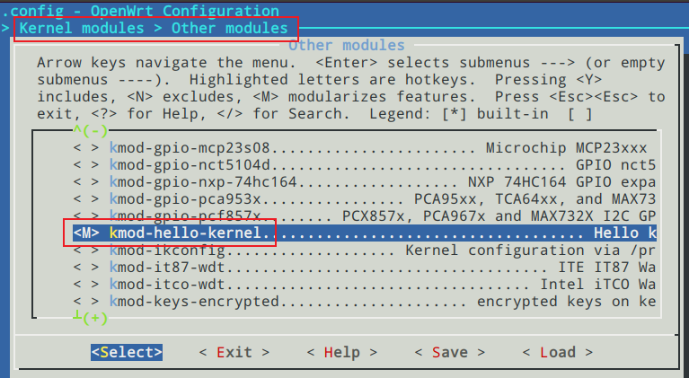

# OpenWrt 内核驱动模块

## 新增内核驱动目录

```bash
cd lede/package/kernel
mkdir hello-kernel
cd hello-kernel
touch Makefile 
mkdir src 
cd src
touch hello-kernel.c
touch Makefile
touch Kconfig
cd ../
tree

#执行后结果如下
#.
#├── Makefile
#└── src
#    ├── hello-kernel.c
#    ├── Kconfig
#    └── Makefile

```

## 修改文件内容

1. 顶层Makefile

   `hello-kernel/Makefile` 文件代码如下：

   ```bash
   
   include $(TOPDIR)/rules.mk
   include $(INCLUDE_DIR)/kernel.mk
   
   PKG_NAME:=hello-kernel 
   PKG_RELEASE:=1
   
   include $(INCLUDE_DIR)/package.mk
   
   EXTRA_CFLAGS:= \
       $(patsubst CONFIG_%, -DCONFIG_%=1, $(patsubst %=m,%,$(filter %=m,$(EXTRA_KCONFIG)))) \
       $(patsubst CONFIG_%, -DCONFIG_%=1, $(patsubst %=y,%,$(filter %=y,$(EXTRA_KCONFIG))))  \
   
   MAKE_OPTS:=ARCH="$(LINUX_KARCH)" \
       CROSS_COMPILE="$(TARGET_CROSS)" \
       SUBDIRS="$(PKG_BUILD_DIR)" \
       EXTRA_CFLAGS="$(EXTRA_CFLAGS)" \
       $(EXTRA_KCONFIG)
   
   define KernelPackage/hello-kernel
       SUBMENU:=Other modules
       TITLE:=Hello kernel drive 
       FILES:=$(PKG_BUILD_DIR)/hello-kernel.ko
       AUTOLOAD:=$(call AutoProbe,81,hello-kernel)
   endef
   
   define Build/Prepare
       mkdir -p $(PKG_BUILD_DIR)/
       $(CP) -R ./src/*  $(PKG_BUILD_DIR)/
   endef
   
   define Build/Compile
       $(MAKE) -C "$(LINUX_DIR)" \
           $(MAKE_OPTS) CONFIG_HELLO-KERNEL=m \
           modules
   endef
   $(eval $(call KernelPackage,hello-kernel))
   
   ```

   

2. 源码目录下的Makefile

   `hello-kernel/src/Makefile` 文件代码如下：

   ```bash
   obj-${CONFIG_HELLO-KERNEL} += hello-kernel.o
   
   ```

   

3. 源码目录下的Kconfig

   `hello-kernel/src/Kconfig` 文件代码如下：

   ```bash
   config HELLO-KERNEL
       tristate "Test kernel driver"
       help
           This is an Kernel Driver Test
           if unsure ,delete it ,just for Test
   
   ```

   

4. 源码目录下的hello-kernel.c

   `hello-kernel/src/hello-kernel.c` 文件代码如下：

   ```bash
   #include <linux/init.h>
   #include <linux/module.h>
   
   static int __init hello_init(void)
   {
     printk(KERN_INFO "Hello World enter\n");
     return 0;
   }
   module_init(hello_init);
   
   static void __exit hello_exit(void)
   {
     printk(KERN_INFO "Hello World exit\n ");
   }
   module_exit(hello_exit);
   
   MODULE_AUTHOR("xym");
   MODULE_LICENSE("GPL v2");
   MODULE_DESCRIPTION("A simple Hello World Module");
   MODULE_ALIAS("a simplest module");
   
   ```

## 编译

1. 配置

   ```bash
   # 进入operwrt的顶级目录
   cd lede
   make menuconfig
   ```

   选中新增的内核模块 

   

2. 编译

   ```bash
   make package/kernel/hello-kernel/compile V=s
   ```

   

3. 查看编译结果

   

4. 测试

   ```bash
   #拷贝编译固件到板子 安装模块
   insmod hello-kernel.ko
   
   #卸载模块
   rmmod hello-kernel
   
   ```


## 顶层Makefile分析

```bash

include $(TOPDIR)/rules.mk
include $(INCLUDE_DIR)/kernel.mk

PKG_NAME:=hello-kernel 
PKG_RELEASE:=1

include $(INCLUDE_DIR)/package.mk

EXTRA_CFLAGS:= \
    $(patsubst CONFIG_%, -DCONFIG_%=1, $(patsubst %=m,%,$(filter %=m,$(EXTRA_KCONFIG)))) \
    $(patsubst CONFIG_%, -DCONFIG_%=1, $(patsubst %=y,%,$(filter %=y,$(EXTRA_KCONFIG))))  \

MAKE_OPTS:=ARCH="$(LINUX_KARCH)" \
    CROSS_COMPILE="$(TARGET_CROSS)" \
    SUBDIRS="$(PKG_BUILD_DIR)" \
    EXTRA_CFLAGS="$(EXTRA_CFLAGS)" \
    $(EXTRA_KCONFIG)

define KernelPackage/hello-kernel
    SUBMENU:=Other modules
    TITLE:=Hello kernel drive 
    FILES:=$(PKG_BUILD_DIR)/hello-kernel.ko
    AUTOLOAD:=$(call AutoProbe,81,hello-kernel)
endef

define Build/Prepare
    mkdir -p $(PKG_BUILD_DIR)/
    $(CP) -R ./src/*  $(PKG_BUILD_DIR)/
endef

define Build/Compile
    $(MAKE) -C "$(LINUX_DIR)" \
        $(MAKE_OPTS) CONFIG_HELLO-KERNEL=m \
        modules
endef
$(eval $(call KernelPackage,hello-kernel))
```

1. 包含openwrt通用的文件

   ```bash
   include $(TOPDIR)/rules.mk
   include $(INCLUDE_DIR)/kernel.mk
   ```

   

2. 定义驱动模块的名称和版本号

   ```bash
   PKG_NAME:=hello-kernel 
   PKG_RELEASE:=1
   ```

   

3. 编译时一些选项

   ```bash
   EXTRA_CFLAGS:= \
       $(patsubst CONFIG_%, -DCONFIG_%=1, $(patsubst %=m,%,$(filter %=m,$(EXTRA_KCONFIG)))) \
       $(patsubst CONFIG_%, -DCONFIG_%=1, $(patsubst %=y,%,$(filter %=y,$(EXTRA_KCONFIG))))  \
   ```

   

4. 定义一些变量

   ```bash
   define KernelPackage/hello-kernel
       SUBMENU:=Other modules
       TITLE:=Hello kernel drive 
       FILES:=$(PKG_BUILD_DIR)/hello-kernel.ko
       AUTOLOAD:=$(call AutoProbe,81,hello-kernel)
       
   endef
   ```

   - `SUBMENU` :内核模块放置Other modules，在`make menuconfig`时，可以在Kernel modules/other modules菜单下找到这个模块

   - `TITLE`：标题，驱动模块的简短描述。

   - `FILES`：生成的驱动模块的存放位置，此处为设置为在编译目录下（就是编译过程中的临时目录build_dir）。

   - `AUTOLOAD`：代表是否在系统启动时自动装载到内核中，后面括号内有3个参数

     - `AutoProbe`：保持不变
     - `81` ：驱动模块的装载顺序(可以省略这个参数，省略后系统自动分配状态顺序)
     - `hello-kernel` ：驱动模块名称

   - `DEPENDS`：如果驱动模块还需要依赖，则此变量设置为依赖文件名（此处没有依赖所以就未设置）。

     

5. 定义如何编译模块

   ```bash
   define Build/Compile
       $(MAKE) -C "$(LINUX_DIR)" \
           $(MAKE_OPTS) CONFIG_HELLO-KERNEL=m \
           modules
   endef
   ```

   

6. 将驱动模块的名称作为参数传递给KernelPackage

   ```bash
   $(eval $(call KernelPackage,hello-kernel))
   ```

   