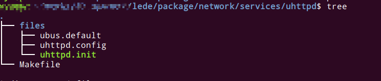
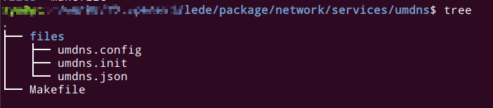
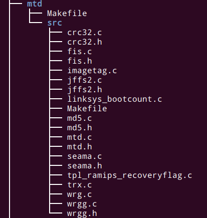
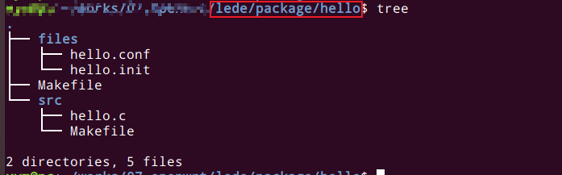
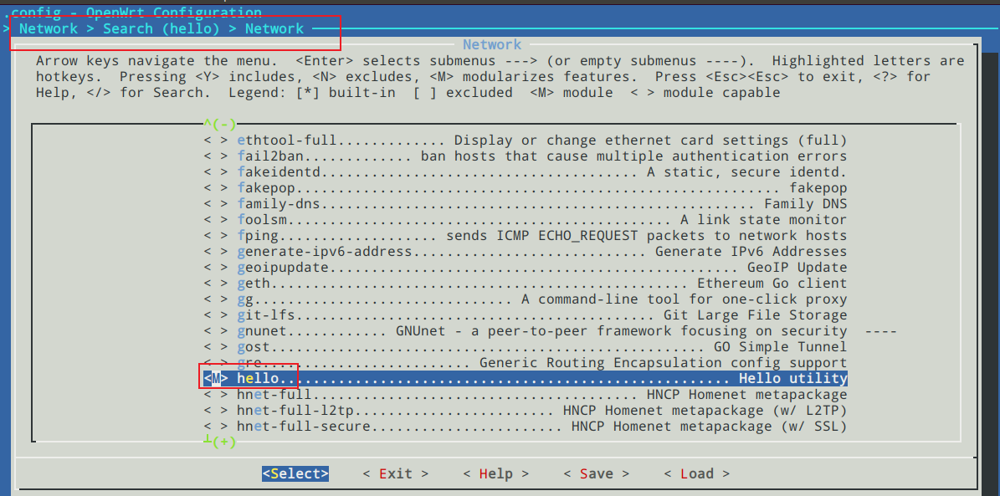

# OpenWrt 制作软件包

## 软件包目录结构分析

如下图所示 ：







一般软件包会下面几个文件

- files目录：可选的，它一般用于保存默认配置文件和初始化启动脚本
- patches目录：可选的，典型包含缺陷修改或者用于优化可执行程序大小的补丁文件
- src目录：可选的，如果软件包是OpenWrt本身项目所包含的软件模块，因为代码将完全受到自己控制，这时将不会patches 目录存在，而是会有一个 src 目录，代码直接放在src目录下
- Makefile文件：必须的，提供下载、编译、安装以及生成 OPKG 安装包的功能，这个文件是必须有的

## 软件包顶层Makefile分析

OpenWrt下的Makefile，与标准Linux的Makefile不同，OpenWrt没有遵守传统的Makefile格式风格，而是将Makefile写成面向对 象格式，这样就简化了多平台移植过程。下面分析一个系统自带的Makefile。

下面以`lede/package/network/utils/iwinfo`为例说明：

```bash
#
# Copyright (C) 2010-2016 Jo-Philipp Wich <jo@mein.io>
#
# This is free software, licensed under the GPL 2 license.
#
# 软件包makefile尽量隐藏和系统相关的东西，所以这里关于系统的一些东西基本在rules.mk中
include $(TOPDIR)/rules.mk

# 定义 软件包名字 libiwinfo 版本3
PKG_NAME:=libiwinfo
PKG_RELEASE:=3

# 下载方式git 
# 下载地址为 $(PROJECT_GIT)/project/iwinfo.git
# 还有hash值 协议等等
PKG_SOURCE_PROTO:=git
PKG_SOURCE_URL=$(PROJECT_GIT)/project/iwinfo.git
PKG_SOURCE_DATE:=2021-06-28
PKG_SOURCE_VERSION:=c9b1672f5a83c8dcb14fdbaee651f775a7defe52
PKG_MIRROR_HASH:=f33779035153da6bd0b2f100f402f62f1554ab87ed6fbbd938d41df6b9947a1f
PKG_MAINTAINER:=Jo-Philipp Wich <jo@mein.io>
PKG_LICENSE:=GPL-2.0

PKG_FLAGS := nonshared

# 定义变量 编译时候的依赖的模块
PKG_CONFIG_DEPENDS := \
	CONFIG_PACKAGE_kmod-brcm-wl \
	CONFIG_PACKAGE_kmod-brcm-wl-mini \
	CONFIG_PACKAGE_kmod-brcm-wl-mimo \
	CONFIG_PACKAGE_kmod-mt7615d_dbdc \
	CONFIG_PACKAGE_kmod-cfg80211

IWINFO_ABI_VERSION:=20210430

# 注意：上面变量定义完后再包含 package.mk 不要问为什么，模块规则 否则编译可能会出现很多问题 
include $(INCLUDE_DIR)/package.mk


# 第一个软件包libiwinfo宏定义
define Package/libiwinfo
  SECTION:=libs # 说明是个库
  CATEGORY:=Libraries
  TITLE:=Generalized Wireless Information Library (iwinfo)
  DEPENDS:=+PACKAGE_kmod-cfg80211:libnl-tiny +libuci +libubus
  ABI_VERSION:=$(IWINFO_ABI_VERSION)
endef

# 一些简单描述
define Package/libiwinfo/description
  Wireless information library with consistent interface for proprietary Broadcom,
  nl80211 and wext driver interfaces.
endef

# 第二个软件包libiwinfo-lua宏定义
define Package/libiwinfo-lua
  SUBMENU:=Lua  # 存放目录
  SECTION:=lang
  CATEGORY:=Languages
  TITLE:=libiwinfo Lua binding
  DEPENDS:=+libiwinfo +liblua # 依赖
endef
# 一些简单描述
define Package/libiwinfo-lua/description
  This is the Lua binding for the iwinfo library. It provides access to all enabled
  backends.
endef

# 第三个个软件包iwinfo宏定义
define Package/iwinfo
  SECTION:=utils 		
  CATEGORY:=Utilities
  TITLE:=Generalized Wireless Information utility
  DEPENDS:=+libiwinfo
endef
#一些简单的描述
define Package/iwinfo/description
  Command line frontend for the wireless information library.
endef


# 编译前的配置，这里为空
define Build/Configure
endef


# 编译参数相关 不过多介绍
IWINFO_BACKENDS := \
	$(if $(CONFIG_PACKAGE_kmod-brcm-wl),wl) \
	$(if $(CONFIG_PACKAGE_kmod-brcm-wl-mini),wl) \
	$(if $(CONFIG_PACKAGE_kmod-brcm-wl-mimo),wl) \
	$(if $(CONFIG_PACKAGE_kmod-mt7615d_dbdc),ra) \
	$(if $(CONFIG_PACKAGE_kmod-cfg80211),nl80211)

TARGET_CFLAGS += \
	-I$(STAGING_DIR)/usr/include/libnl-tiny \
	-I$(STAGING_DIR)/usr/include \
	-D_GNU_SOURCE

MAKE_FLAGS += \
	FPIC="$(FPIC)" \
	CFLAGS="$(TARGET_CFLAGS)" \
	LDFLAGS="$(TARGET_LDFLAGS)" \
	BACKENDS="$(IWINFO_BACKENDS)" \
	SOVERSION="$(IWINFO_ABI_VERSION)"


# 定义编译完成后操作的宏 可以看到会把头文件 so文件拷贝到安装目录下
define Build/InstallDev
	$(INSTALL_DIR) $(1)/usr/include/iwinfo
	$(CP) $(PKG_BUILD_DIR)/include/iwinfo.h $(1)/usr/include/
	$(CP) $(PKG_BUILD_DIR)/include/iwinfo/* $(1)/usr/include/iwinfo/
	$(INSTALL_DIR) $(1)/usr/lib
	$(CP) $(PKG_BUILD_DIR)/libiwinfo.so* $(1)/usr/lib/
	$(INSTALL_DIR) $(1)/usr/lib/lua
	$(INSTALL_BIN) $(PKG_BUILD_DIR)/iwinfo.so $(1)/usr/lib/lua/iwinfo.so
endef

# 定义第一个软件包libiwinfo 安装时候执行的操作的宏
define Package/libiwinfo/install
	$(INSTALL_DIR) $(1)/usr/lib
	$(INSTALL_BIN) $(PKG_BUILD_DIR)/libiwinfo.so.$(IWINFO_ABI_VERSION) $(1)/usr/lib/libiwinfo.so.$(IWINFO_ABI_VERSION)
	$(INSTALL_DIR) $(1)/usr/share/libiwinfo
	$(INSTALL_DATA) $(PKG_BUILD_DIR)/hardware.txt $(1)/usr/share/libiwinfo/hardware.txt
endef

# 定义第二个软件包libiwinfo-lua 安装时候执行的操作的宏
define Package/libiwinfo-lua/install
	$(INSTALL_DIR) $(1)/usr/lib/lua
	$(INSTALL_BIN) $(PKG_BUILD_DIR)/iwinfo.so $(1)/usr/lib/lua/iwinfo.so
endef

# 定义第三个软件包iwinfo 安装时候执行的操作的宏
define Package/iwinfo/install
	$(INSTALL_DIR) $(1)/usr/bin
	$(INSTALL_BIN) $(PKG_BUILD_DIR)/iwinfo $(1)/usr/bin/iwinfo
endef

# 调用BuildPackage 编译三个软件包 libiwinfo  ibiwinfo-lua iwinfo
$(eval $(call BuildPackage,libiwinfo))
$(eval $(call BuildPackage,libiwinfo-lua))
$(eval $(call BuildPackage,iwinfo))

```

## OpenWrt一些常用的变量

### 一些默认的变量

- `INCLUDE_DIR`：源代码目录下的 include 目录
- `BUILD_DIR`：代码编译的根目录，通常为`build_dir/target-`*目录
- `TARGET_CFLAGS`：指定目标平台的 C 语言编译选项
- `TARGET_LDFLAGS`：指定目标平台的编译链接选项
- `INSTALL_DIR`：创建目录，并设置目录权限
- `INSTALL_DATA`：安装数据文件，即复制并设置权限为 0644
- `INSTALL_CONF`：安装配置文件，即复制并设置权限为 0600
- `INSTALL_BIN`：安装可执行程序，即复制并增加执行权限，设置权限表示为 0777

| 变量               | 含义                                                         | 示例                              |
| ------------------ | ------------------------------------------------------------ | --------------------------------- |
| PKG_NAME           | 软件包的名称，可以通过 menuconfig 和 ipkg 查看到             | PKG_NAME:=libiwinfo               |
| PKG_VERSION        | 上游软件的版本号，为 2.73                                    | 2.73                              |
| PKG_RELEASE        | Makefile 的版本号                                            | PKG_RELEASE:=3                    |
| PKG_SOURCE         | 原始的源代码文件名                                           |                                   |
| PKG_SOURCE_URL     | 用于下载源码的地址                                           | $(PROJECT_GIT)/project/iwinfo.git |
| PKG_MD5SUM         | 软件包的 MD5 值，用于验证下载的文件 是否正确                 |                                   |
| PKG_LICENSE        | 这个软件的许可协议，开源软件的许可证 以 GPL 家族最多         |                                   |
| PKG_LICENSE_FILES  | 许可协议文件，是指代码目录下的文件名， 一般均为 COPYING      |                                   |
| PKG_BUILD_DIR      | 软件包的编译目录（就是编译过程中的临时目录build_dir          |                                   |
| PKG_INSTALL        | 设置为 1 将调用软件包自己的“make install”，安装目录前缀为 PKG_INSTALL_ DIR |                                   |
| PKG_BUILD_PARALLEL | 是否可以并行编译                                             |                                   |
| PKG_CONFIG_DEPENDS | 编译依赖，指定哪些选项依赖本软件包                           |                                   |
| PKG_INSTALL_DIR    | 当调用原始软件包“make install”时的安 装目录                  |                                   |
| PKG_SOURCE_PROTO   | 用于下载的传输协议（git、svn），如果为 压缩包则不用指定      |                                   |
| PKG_SOURCE_SUBDIR  | 下载目录，如果下载传输协议为“svn”或 “git”时必须指定。例如："PKG_SOURCE_ SUBDIR:=$(PKG_NAME)-$(PKG_VERSI ON)" |                                   |
| PKG_SOURCE_VERSION | 下载协议为git时必须指定，指定的提 交哈希点将会被检出         |                                   |
| PKG_MAINTAINER     | 维护者的姓名和邮件地址                                       |                                   |
| PKG_BUILD_DEPENDS  | 软件包编译依赖，即在这个包编译之前编 译，但是在运行时不需要，和 DEPENDS 有相同的语法 |                                   |

### Package宏定义

可以将一个源代码包分割为多个安装包。 如下面所示

```bash
# 第一个软件包libiwinfo宏定义
define Package/libiwinfo
  SECTION:=libs # 说明是个库
  CATEGORY:=Libraries
  TITLE:=Generalized Wireless Information Library (iwinfo)
  DEPENDS:=+PACKAGE_kmod-cfg80211:libnl-tiny +libuci +libubus
  ABI_VERSION:=$(IWINFO_ABI_VERSION)
endef


# 第二个软件包libiwinfo-lua宏定义
define Package/libiwinfo-lua
  SUBMENU:=Lua  # 存放目录
  SECTION:=lang
  CATEGORY:=Languages
  TITLE:=libiwinfo Lua binding
  DEPENDS:=+libiwinfo +liblua # 依赖
endef


# 第三个个软件包iwinfo宏定义
define Package/iwinfo
  SECTION:=utils 		
  CATEGORY:=Utilities
  TITLE:=Generalized Wireless Information utility
  DEPENDS:=+libiwinfo
endef

```


| 安装包选项                     | 是否必需 | 含 义                                                        |
| ------------------------------ | -------- | ------------------------------------------------------------ |
| Package/<软件包名称>           | 是       | 定义软件包的描述信息：例如`define Package/libiwinfo-lua`     |
| Package/<软件包名>/Default     | 可选     | 软件包的默认选项                                             |
| Package/<软件包名>/description | 是       | 软件包的详细描述                                             |
| Package/<软件包名>/install     | 是       | 复制文件到 ipkg 目录中，<br/>使用$(1)代表 ipkg 的目录，在源代码中使 用相对目录。<br/>编译生成的安装文件由$(PKG_INSTALL_ DIR)目录下 复制到 ipkg 的目录下 |
| Package/<软件包名>/config      | 可选     | 根据软件包的选择对编译选项进行定义                           |
| Package/<软件包名>/conffiles   | 可选     | 定义本软件包的运行配置文件列表，一行一个文件                 |
| Package/<软件包名>/preinst     | 可选     | 这是在安装之前实际执行的脚本，不要忘了包含#!/bin/sh。<br/>如果 你需要中止安装就返回 false |
| Package/<软件包名>/postinst    | 可选     | 在安装完成后执行的脚本，例如启动程序。不要忘了包含 #!/bin/sh |
| Package/<软件包名>/prerm       | 可选     | 在删除之前执行的脚本，例如停止程序的执行。不要忘了包含 #!/bin/sh。如果需要中止删除就返回 false |
| Package/<软件包名>/postrm      | 可选     | 在删除之后执行的脚本，不要忘了包含#!/bin/sh。<br/>如果需要中止 删除就返回 false |

这里面的一些常变量说明

- `SECTION`： 软件包的类型，如 Lua、libs、Utilities 或 Multimedia等
- `CATEGORY `： 在 `make menuconfig` 中显示到菜单分类中
- `TITLE `： 标题，是软件包的简短描述
- `URL`： 软件包的原始网站地址，可以在这里找到该软件
- `MAINTAINER`： 维护者的姓名和邮件地址。一般为这个软件包作者的邮件地址
- `DEPENDS`： （可选）依赖项，需要在本软件包之前编译和安装的软件包

### Build宏定义

比如上面介绍的代碼

```bash
# 定义编译完成后操作的宏 可以看到会把头文件 so文件拷贝到安装目录下
define Build/InstallDev
	$(INSTALL_DIR) $(1)/usr/include/iwinfo
	$(CP) $(PKG_BUILD_DIR)/include/iwinfo.h $(1)/usr/include/
	$(CP) $(PKG_BUILD_DIR)/include/iwinfo/* $(1)/usr/include/iwinfo/
	$(INSTALL_DIR) $(1)/usr/lib
	$(CP) $(PKG_BUILD_DIR)/libiwinfo.so* $(1)/usr/lib/
	$(INSTALL_DIR) $(1)/usr/lib/lua
	$(INSTALL_BIN) $(PKG_BUILD_DIR)/iwinfo.so $(1)/usr/lib/lua/iwinfo.so
endef
```

一些常用的Build宏定义 安装执行的顺序介绍如下：

- `Build/Prepare`

  - 可选
  - 一组用于解压缩及打补丁的命令，也可以不使用

- `Build/Configure`

  - 可选

  - 如果源代码不需要configure来生成Makefile或者是通用的configure脚本， 就不需要这部分。

    否则就需要你自己的命令脚本或者使用`$(call Build/Configure/Default, FOO=bar)`增加额外的参数传递给 configure 脚本

- `Build/Compile`

  - 可选
  - 编译源代码，在大多数情况下应该不用定义而使用默认值。如果你想传递给 make 特定的参数，可以使用`$(call Build/Compile/Default, FOO=bar)`

- `Build/Install`

  - 可选
  - 安装编译后的文件，默认是调用 make install，如果需要传递指定的参 数，使用`$(call Build/Install/Default,install install-foo)`。注意你需要传递所有的参数，要增加在“install”参数后面，不要忘了“install”参数

  

- `Build/InstallDev`

  - 可选
  - 例如静态库和头文件等，但是不需要在目标设备上使用

## 构建自己的软件系统

程序实现的功能如下：

1. 实现一个在路由器启动后访问指定网站的功能，这样就可以统计路由器的启动次数。
   - 网站地址可以在配置文件中进行自定义配置，网址通过UCI编程接口读取配置文件来实现。
   - 访问指定网站功能通过命令行工具wget来实现。但如果其他人也使用wget来访问服务器，这样就不能区分是路由器行为还是其他应用软件的行为，因此我们修改了代理字符串来作为我们的自定义字符串（使用wget的--user-agent参数，参数如何使用见wget文章），这样就可以和默认的访问行为区分开来。
2. 为了防止某些小区在断电并自动启动后，全部一起立即访问服务器，对服务器产生瞬间流量冲击，因此路由器启动后产生一个随机延迟时间，然后再访问服务器。这个时间可以通过配置文件设置，假如设置为100秒，则访问服务器时间就为1～100秒的随机值。

### 软件包工程目录

- files目录包含配置文件和初始化脚本
  - files目录下的hello.conf为配置文件，在安装后放在/etc/config/目录下的 hello 文件夹中
  - files目录下hello.init用于控制进程启动的初始化脚本
- Makefile包含编译及安装指令，控制着代码在 OpenWrt 环境下的编译和生成安装包。
- src目录保存C语言源代码和一个hello.c文件的Makefile。
  - src目录下的hello.c为上面的程序C语言代码。
  - src目录下Makefile为hello.c的Makefile。



### 文件内容分析


### 编译

1. 配置

   ```bash
   # M 代表模块 会生成.ipk文件  y在系统编译的时候会自动安装 如下图：我们这里选择M
   make menuconfig
   ```

   

   

2. 编译

   ```bash
   make package/hello/compile V=s
   ```

3. 查看编译生成的文件

   ```
   
   ```

   

### 安装

```
opkg install .ipk
```

安裝后可以看到在/usr/sbin/hello目录下会有这个程序

配置文件在/etc/config目录下，开机自启动的程序在/etc/init.d目录下（Makefile脚本设计的）

在/etc.rc.d目录下也创建了我们的开机自启动脚本的软链接

样之后我们的软件就可以开机自启动了


### 卸载

```

```


