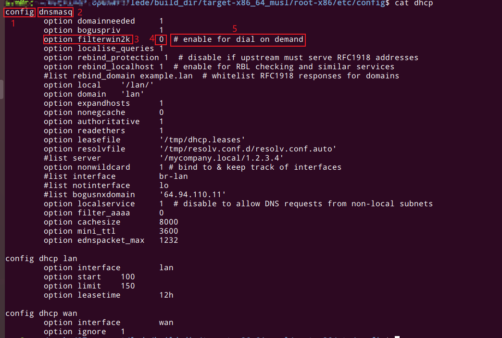
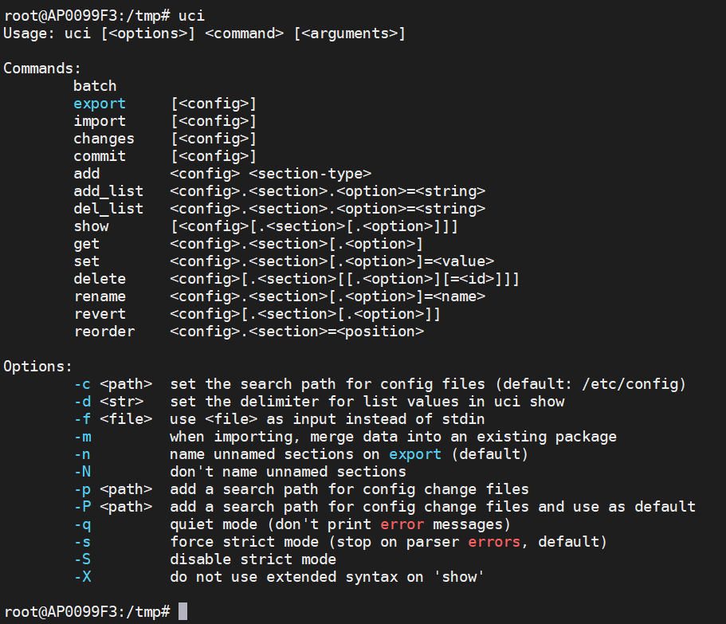
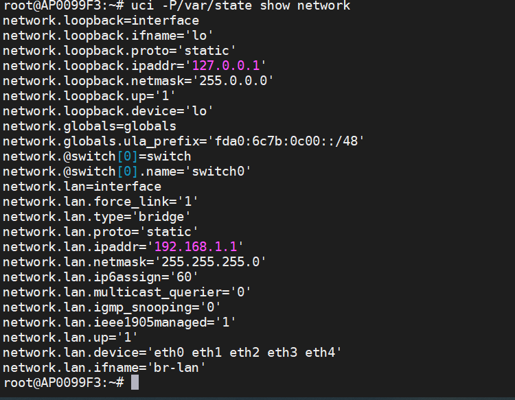
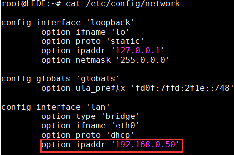
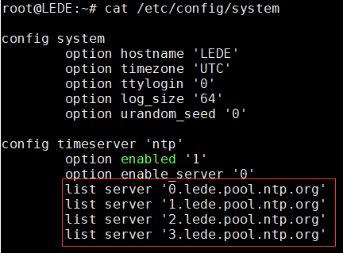
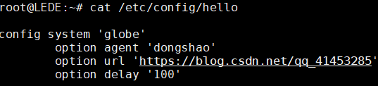

# OpenWrt UCI框架

## UCI简介

MVC（Model-View-Control）模式是经典的Web开发编程模式，OpenWrt也采用该设计模式，分层设计，模型层负责数据的持久化操作。OpenWrt 的模型层采用 统一配置接口（Unified Configuration Interface，UCI）。已经移植支持数千个软件，它采用纯文本文件来保存配置，并提供命令行和 C 语言编程调用接口进行管理。

## UCI配置文件格式

```bash
config	<type>	["<name>"]
	option <name> "<value>"
	
# 说明：
# []里面的内容是可以省略的
# "" 或者''都可以 ，并且可以省略， 如果字符串内容有空格 不可以省略引号
```

示例如下图所示：



1. 每个config 都称为一个配置节(section)，每个选项对(option)都有name和value，并写在配置节中
2. 图中1和2 是配置节的开始 ，3和4共同组成了一个选项对 ，用`#`注释

## UCI配置文件

1. UCI配置文件存放在`/etc/config/`目录下，当执行`/etc/init.d/`的配置脚本的时候，系统会读取`/etc/config/`对应的UCI配置文件，然后把UCI配置文件转换为软件包能识别的配置文件，存放在`/var`目录下，所以软件包能识别配置文件是UCI转换生成的，不需要存储在flash，在ram中即可，可以看到`/var`是`/tmp`的一个软链接

2. UCI配置文件修改方式

   - 直接vim 修改`/etc/config/`下对应的配置

     修改完后生效的方式，重启系统或者执行 `/etc/init.d/对应的程序 restart`

   - 通过UCI接口（shell、Lua、C）

     例如web界面就是通过Lua的UCI接口修改

3. 由于程序使用的配置文件是通过UCI配置文件经过`init.d`转换过来的，故而如果只修改了`/etc/config/`对应的配置文件，而没有通过`init.d`重启应用，或者人为的直接手动启动的应用（反正就是不通过`init.d`），都不会使用`/etc/config/`下的配置，切记这一点。

4. UCI配置文件一些说明

   |文 件 路 径				|含 义									 	|
   |------------------------|-------------------------------------------|
   |`/etc/config/dhcp`		|Dnsmasq 软件包配置，包含 DHCP 和 DNS 设置	|
   |`/etc/config/dropbear`	|SSH 服务器选项								|
   |`/etc/config/firewall`	|防火墙配置，包含网络地址转换、包过滤和端口转发等|
   |`/etc/config/network`	|网络配置，包含桥接、接口和路由配置			|
   |`/etc/config/system`	|系统设置，包含主机名称，网络时间同步等		|
   |`/etc/config/timeserver`|rdate 的时间服务列表						|
   |`/etc/config/luci`		|基本的 LuCI 配置							|
   |`/etc/config/wireless`	|无线设置和 Wi-Fi 网络定义					|
   |`/etc/config/uhttpd`	|Web 服务器选项配置							|
   |`/etc/config/upnpd`		|miniupnpd UPnP 服务设置					|
   |`/etc/config/qos`		|网络服务质量的配置文件定义					|


## UCI SHELL接口API

下面代码是修改`/etc/config/network`目录下 `config lan`节下的`ipaddr`选项的案例

```bash
uci set network.lan.ipaddr=192.168.6.1
uci commit network # 提交 会写文件
```

### UCI命令格式

```bash
uci [<options>] <command> [<arguments>]

options如下：
	-c <path>：set the search path for config files (default: /etc/config)
	-d <str>：set the delimiter for list values in uci show
	-f <file>：use <file> as input instead of stdin
	-m：when importing, merge data into an existing package
	-n：name unnamed sections on export (default)
	-N：don't name unnamed sections
	-p <path>：add a search path for config change files
	-P <path>：add a search path for config change files and use as default
	-q：quiet mode (don't print error messages)
	-s：force strict mode (stop on parser errors, default)
	-S：disable strict mode
	-X：do not use extended syntax on 'show'

command如下：
	-add：增加指定配置文件的类型为 section-type 的匿名区段。
	-add_list：对已存在的 list 选项增加字符串。
	-commit：对给定的配置文件写入修改，如果没有指定配置文件，则将所有的配置文件写入文件系统。uci set、uci add、uci rename和uci delete命令将配置写入一个临时位置， 在运行uci commit时写入实际的存储位置。
	-export：导出一个机器可读格式的配置。它是作为操作配置文件的 shell 脚本而在内部使用，导出配置内容时会在前面加“package”和文件名。
	-import：以 UCI 语法导入配置文件。
	-changes：列出配置文件分阶段修改的内容，即未使用uci commit提交的修改。如果没有指定配置文件，则指所有的配置文件的修改部分。
	-show：显示指定的选项、配置节或配置文件。以精简的方式输出，即 key=value 的方式输出。
	-get：获取指定区段选项的值。
	-set：设置指定配置节选项的值，或者是增加一个配置节，类型设置为指定的值。
	-delete：删除指定的配置节或选项。
	-rename：对指定的选项或配置节重命名为指定的名字。
	-revert：恢复指定的选项，配置节或配置文件。

```

如下图所示：




注意：有些配置的值并未在`/etc/config`中显示，而是保存在`/var/state`下，可以用`-P`选项查看：



### UCI命令使用案例

1. 修改ip

   ```bash
   #1：设置或者删除选项
   uci set    network.lan.ipaddr=192.168.0.50
   uci delete network.lan.ipaddr
   #2：提交修改
   uci commit network
   3:重启程序生效
   /etc/init.d/network restart
   
   #注：可以看到我们可以通过network.lan.ipaddr 即[配置文件名字].[name].[optionname] 来找到对应的option，进而对其修改。
   #访问option的方法还有如下两种：
   #方法2
   uci get network.@interface[0].ipaddr  # 值为127.0.0.1
   uci get network.@interface[1].ipaddr  # 值为192.168.0.50
   
   #方法3
   uci get network.@interface[-2].ipaddr   # 值为127.0.0.1
   uci get network.@interface[-1].ipaddr   # 值为192.168.0.50
   ```

   

2. 当文件文件中option为链表的时候如下图

   

   增加一个list的方法如下：

   ```
   uci add_list system.ntp.server='ntp.dongshao.net'
   
   uci commit system
   ```

   刪除一個链表

   ```
   uci del_list system.ntp.server='ntp.dongshao.net'
   
   uci commit system
   ```

   

3. 新增一个配置文件

   先创建一个文件`/etc/config/hello`，新增内容如下：

   ```bash
   uci set hello.globe=system
   uci set hello.globe.agent=dongshao                           //用户代理属性
   uci set hello.globe.url='https://blog.csdn.net/qq_41453285'  //访问URL
   uci set hello.globe.delay=100                                //启动延迟时间
   
   uci commit  //提交配置修改
   ```

   修改后内如如下

   

## UCI脚本

### uci.sh

脚本介绍：UCI模块提供了一个 shell 脚本（`/lib/config/uci.sh`）并封装了UCI命令行工具的功能， 这样方便了其他软件包在将UCI配置文件转换为自己格式的配置文件时使用。主要的函数如下所示：

- `uci_load`：从UCI文件中加载配置并设置到环境变量中，可以通过env命令来查看。该命令需要和 functions.sh 中的定义共同使用。
- `uci_get`：从配置文件中获取值。至少需要一个参数，指明要获取的配置信息。例如获取系统主机名称：`uci_get system.@system[0].hostname`。
- `uci_get_state`：指定从`/var/state`中获取状态值。

如果自己的脚本需要使用这些函数的时候，需要自行导入该`/lib/config/uci.sh`脚本，最好一起导入`/lib/functions.sh`脚本，因为`/lib/config/uci.sh`里面有些函数依赖`/lib/functions.sh`。

### functions.sh

`/lib/functions.sh`主要原理是将配置文件中的配置选项设置到环境变量中，然后提供接口函数在环境变量中获取。调用`uci_load`函数将配置设置到环境变量中时，`uci_load`函数又调用了 `functions.sh` 定义的 `config()`、`option()`、`list()`等函数。在使用这些函数时，以点开头来将这些函数加载到执行空间中，注意点和执行文件中间有 一个空格。例如：

```bash
. /lib/functions.sh     # 装载函数 以 . 开头 注意点后面有个空格
```

- `config`：供`uci.sh`调用，将配置节设置到环境变量中。
- `option`：供`uci.sh`调用，将配置节中的选项设置到环境变量中。
- `list`：供`uci.sh`调用，将配置节中的链表配置设置到环境变量中。
- `config_load`：调用`uci_load`函数来从配置文件中读取配置选项，并设置到环境变量中。
- `config_get`：从当前设置环境变量中获取配置值。
- `config_get_bool`：从当前设置的环境变量中获取布尔值，并将它进行格式转换，如果为真，转换为1，否则转换为0。因为 UCI 的布尔值有多种类型均支持。
  - on、true、enabled 和 1 表示真
  - off、false、disable 和0表示假。
- config_set：将变量设置到环境变量中以便后续读取。注意：仅设置到环境变量中并没有设置到配置文件中。
- config_foreach：对于未命名的配置进行遍历调用函数。共两个参数，第一个参数为回调函数，第 二个参数为配置节类型，这个函数适用于匿名配置节的转换处理。

###  配置文件选项的写入与读取

`functions.sh`的主要原理是将配置文件中的配置选项设置到环境变量中，然后提供接口函数在环境变量中获取，下面我们以`config_load`与`config_get`函数为例，介绍一下执行过程:

1. 首先通过调用`config_load`函数将UCI配置读入当前环境变量中，默认从`/etc/config`目录下读取配置，并设置到环境变量中。
2. 然后使用`config_get`等函数进行读取和转换配置。
3. 我们以`config_get`函数为例来说明执行流程。`config_get`函数从环境变量中读取配置值并赋值给变量。该函数至少要3个参数。
   - 第1个参数为存储返回值的变量。
   - 第2个参数为所要读取的配置节的名称。
   - 第3个参数是所有读取的选项名称。
   - 第4个参数是为默认值，如果配置文件没有该选项则返回该默认值，是一个可选的参数。

### uci_和config_函数区别

`uci_`开头的函数是`/lib/config/uci.sh`脚本提供的，`config_`开头得函数是`/lib/functions.sh`脚本提供的。

- 相同点

  以`uci_`开头的函数和以`config_`开头的函数大多数功能完全相同。

- 不同点

  - `uci_get`等函数直接从文件中获取，而`config_get`函数从环境变量中读取。
  - 性能差异：`config_get`函数使用`config_load`一次从配置文件中读取设置到环境变量中，以后均不再进行磁盘操作。而`uci_get`每次均从文件中读取。
  - 如果调用多次，两者性能差距就会显现，实际测试中两者相差10倍以上。因此在OpenWrt中大多使用以`config_`开头的`config_get`等函数进行配置文件转换。

## UCI C接口API

uci c接口的api需要依赖Libubox库，Libubox是OpenWrt的一个必备的基础库，包含大小端转换、链表、MD5等实用工具基础库，采用Cmake来编译。库的交叉编译省略，自行查资料。

### C接口常用的函数

- UCI接口命名非常规范，统一以小写的uci开头并放在`uci.h`头文件中。
  大多数函数的第一个参数均为`uci_context`的指针变量。这个变量在程序初始化时调用uci_alloc_context函数分配空间并设置初始值。在程序执行结束时调用uci_free_context函数释放空间。
- UCI接口有设置函数`uci_set`，但没有相应的获取函数`uci_get`，UCI使用`uci_lookup_ptr`来提供查询功能，如果查到则通过获取ptr变量的值来获取配置的值。


|函 数				|含 义                  |
|-------------------|-----------------------|
|`uci_alloc_context`|分配UCI上下文环境对象。|
|`uci_free_context`	|释放UCI上下文环境对象。|
|`uci_load`			|解析UCI配置文件，并存储到UCI对象中。@name:配置文件名，相对于配置目录。@package:在这个变量中存储装载的配置包。|
|`uci_unload`		|从UCI上下文环境对象中unload配置文件。|
|`uci_lookup_ptr`	|分割字符串并查找。@ptr:查找的结果。@str:待查找的字符串，但 str 不能为常量， 因为将被修改赋值，在 ptr 变量内部会被使用到，因此 str 的寿命必须至少和 ptr 一样长。@extended 是否允许扩展查找。|
|`uci_set`			|设置元素值，如果必要将创建一个元素。更新或创建的元素将存储在ptr-> last中。|
|`uci_delete`		|删除一个元素，配置节或选项。|
|`uci_save`			|保存一个package修改的delta。|
|`uci_commit`		|提交更改package，提交将重新加载整个uci_package。|
|`uci_set_confdir`	|修改UCI配置文件的存储位置，默认为/etc/config。|

1. 分割字符串查找

   配置文件`/etc/config/hello`内如

   ```bash
   config globals 'globe'
     option agent 'openwrt'
     option url 'http://192.168.43.20:8080'
     option delay '10'
   ```

   

   ```c
   struct Hello
   {
       char agent[50]; 
       char url[256];  
       int delay;
   };
   static int _getValue(struct uci_context *ctx, char *key, char*value, int n)
   {
       char strKey[100];
       struct uci_ptr ptr;
       //将hello.globe.agent/url/delay 写入strKey中
       snprintf(strKey, sizeof(strKey), "hello.globe.%s",key); 
    
       //参数1：UCI上下文环境对象 
       //参数2：查找的结果保存到ptr中 
       //参数3：待查找的字符串
       //参数4：是否允许扩展查找
       //从/etc/config/hello配置文件中找（备注：默认从/etc/config目录下读取）
       //uci_lookup_ptr：分割字符串并查找
       if (uci_lookup_ptr(ctx, &ptr, strKey, true) == UCI_OK){
           printf("%s\n", ptr.o->v.string);
           strncpy(value, ptr.o->v.string, n-1); //将查找的字符串保存到value中
       }
       return 0;
   }
   
   int read_conf( struct Hello *hello)
   {
       char delay[20];
       struct uci_context *ctx = uci_alloc_context(); //分配UCI上下文环境对象
       if (!ctx){
           fprintf(stderr, "No memory\n");
           return 1;
       }
       //将配置文件中agent的值读取到hello->agent中
       _getValue(ctx, "agent", hello->agent, sizeof(hello->agent));
       //将配置文件中url的值读取到hello->url中
       _getValue(ctx, "url", hello->url, sizeof(hello->url)); 
       //将配置文件中delay的值读取到hello->delay中
       _getValue(ctx, "delay", delay, sizeof(delay)); 
       hello->delay = atoi(delay); //字符串转换为整型
       uci_free_context(ctx); 		//释放UCI上下文环境对象
       return 0;
   }
   ```

   

2. 第二种查找方式

   ```c
   // UCI上下文: struct uci_context *
   // 包(Package): 一个包对应一个UCI格式的文件.类型是 struct uci_package *
   // 节(Section): 一个配置文件的节点. 类型是 struct uci_list *
   // 值(Value):一个节下面可能包含多个值 一个值具有一个名字.
    
   #include <unistd.h>
   #include <stdio.h>
   #include <string.h>
   #include <uci.h>     // 引入uci的头文件
    
    
   static struct uci_context * ctx = NULL; //定义一个UCI上下文的静态变量.
   /*********************************************
   * 载入配置文件,并遍历Section.
   */
   bool load_config()
   {
       struct uci_package * pkg = NULL;
       struct uci_element *e;
        
        
       ctx = uci_alloc_context(); 	// 申请一个UCI上下文.
       if (UCI_OK != uci_load(ctx, UCI_CONFIG_FILE, &pkg))
       	goto cleanup; 			//如果打开UCI文件失败,则跳到末尾 清理 UCI 上下文.
        
        
       /*遍历UCI的每一个节*/
       uci_foreach_element(&pkg->sections, e)
       {
           struct uci_section *s = uci_to_section(e);
           // 将一个 element 转换为 section类型, 如果节点有名字,则 s->anonymous 为 false.
           // 此时通过 s->e->name 来获取.
           // 此时 您可以通过 uci_lookup_option()来获取 当前节下的一个值.
           if (NULL != (value = uci_lookup_option_string(ctx, s, "ipaddr")))
           {
               //如果您想持有该变量值，一定要拷贝一份。当 pkg销毁后value的内存会被释放。
           	ip = strdup(value) 
           }
           // 如果您不确定是 string类型 可以先使用 uci_lookup_option() 函数得到Option 然后再判断.
           // Option 的类型有 UCI_TYPE_STRING 和 UCI_TYPE_LIST 两种.
        
        
       }
       uci_unload(ctx, pkg); // 释放 pkg
   
   cleanup:
       uci_free_context(ctx);
       ctx = NULL;
   }
    
    
   
    
   ```

   遍历一个UCI_TYPE_LIST 类型，假如现在有一个如下的配置文件:

   ```bash
   config "server" "webserver"
          list "index" "index.html"
          list "index" "index.php"
          list "index" "default.html"
   ```


   代码片:

   ```c
   // s 为 section.
   struct uci_option * o = uci_lookup_option(ctx, s, "index");
   if ((NULL != o) && (UCI_TYPE_LIST == o->type)) //o存在 且 类型是 UCI_TYPE_LIST则可以继续.
   {
       struct uci_element *e;
       uci_foreach_element(&o->v.list, e)
       {
           //这里会循环遍历 list
           // e->name 的值依次是 index.html, index.php, default.html
       }
   }
   ```

   写配置
   UCI提供了一个简洁的办法来操作配置信息,例如有一个配置文件

   ```bash
   #文件名: testconfig
   config 'servver'
       option 'value' '123' # 我们想修改 'value' 的值为 '456'
   ```


   代码如下:

   ```c
   struct uci_context * ctx = uci_alloc_context(); //申请上下文
   struct uci_ptr ptr ={
                       .package = "config",
                       .section = "servver",
                       .option = "value",
                       .value = "256",
   };
   uci_set(_ctx,&ptr); //写入配置
   uci_commit(_ctx, &ptr.p, false); //提交保存更改
   uci_unload(_ctx,ptr.p); //卸载包
   
   uci_free_context(ctx); //释放上下文
   ```

   


   依照上面的例子，我们可以举一反三, `uci_ptr` 用来指定信息，而是用`uci_set`则是写入信息.同类的函数有如下几个: 针对list的操作:

   ```c
   uci_add_list() // 添加一个list 值
   uci_del_list() // 删除一个list 值
   uci_delete()   // 删除一个option值
   ```


## UCI Lua接口API

1. cursor的几种初始化方式

   - 不带参数初始化，默认/etc/config

     ```lua
     x = uci.cursor()
     ```

   - 包含状态值

     ```lua
     x = uci.cursor(nil, "/var/state")
     ```

   - 指定配置的目录

     ```lua
     x = uci.cursor("/etc/mypackage/config", "/tmp/mypackage/.uci")
     ```

2. Lua常用的uci接口

   |lua接口                                                     |说明                            |
   |----------------------------------------------------------- |--------------------------------|
   |`x:get("config", "sectionname", "option")` 					|返回字符串 或 nil(没找到数据时)|
   |`x:set("config", "sectionname", "option", "value")` 			|设置简单的字符串变量|
   |`x:set("config", "sectionname", "option", { "foo", "bar" })` 	|设置列表变量|
   |`x:delete("config", "section", "option")` 					|删除选项|
   |`x:delete("config", "section")` 								|删除段|
   |`x:add("config", "type")` 									|添加一个匿名section（段）|
   |`x:set("config", "name", "type")` 							|添加一个类型为 “type”的section（段），名称为”name”|
   |`x:foreach("config", "type", function(s) ... end)` 			|遍历所有类型为的"type"段,并以每个"s"为参数调用回调函数. s 是一个包含所有选型和两个特有属性的列表<br>s['.type'] 段类型<br/>s['.name']段名称 <br>如果回调函数返回 false [NB: not nil!], foreach()在这个点会终止,不再继续遍历任何剩余的段. 如果至少存在一个段且回调函数没有产生错误,foreach() 会返回 true; 否则返回false. 			|
   |`x:revert("config")`											|取消修改的值|
   |`x:commit("config")`											|保存修改的值到配置目录文件，默认目录/etc/config|


### Lua操作uci示例

```lua
#!/usr/bin/lua
require("uci")
x = uci.cursor()
function show_test_config()
    name = x:get("test", "global", "name")
    id = x:get("test", "global", "id")
    addr_list = x:get("test", "global", "address")
    print("name="..name)
    print("id="..id)
for key, value in ipairs(addr_list) 
do 
print("address["..key.."]----"..value) 
end
end
 
print("==========before change=========")
show_test_config()
x:set("test", "global", "name", "xxxxxxx")
x:set("test", "global", "id", "8888888")
 
x:set("test","global","address",{"1111","2222","33333","4444","5555"})
x:commit("test")
print("==========after change=========")
show_test_config()
```


```lua
#!/usr/bin/lua
require("uci")
x=uci.cursor()
conf=x:get_all("test", "global")
 
print(conf["name"]);
print(conf["id"]);
for key, value in ipairs(conf["address"])
do
    print(value);
end
```

