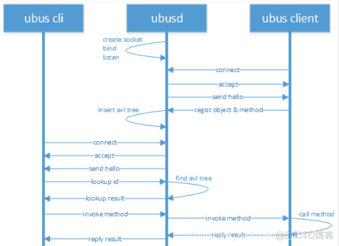
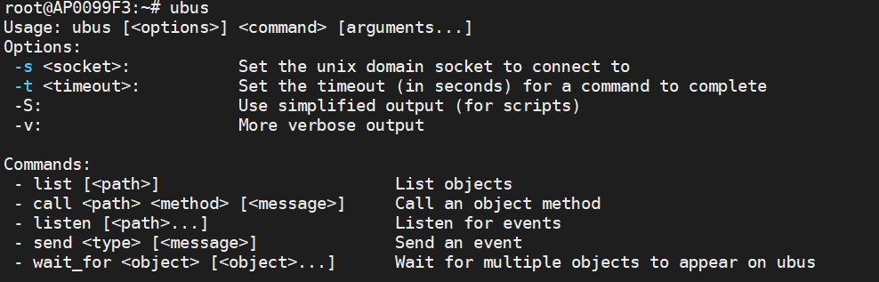
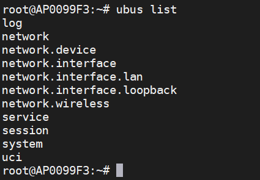
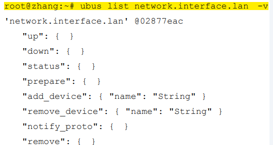
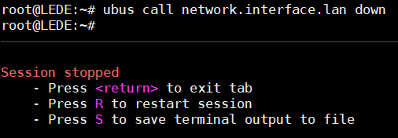
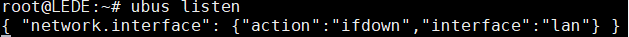
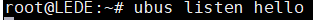
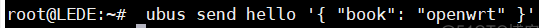
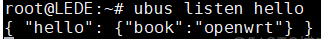

# OpenWrt Ubus总线框架

## ubus模块介绍

OpenWrt 提供了一个系统总线ubus，它类似于Linux桌面操作系统的d-Bus，目标是提供系统级的进程间通信（IPC）功能。ubus在设计理念上与d-Bus基本保持一致，提供了系统级总线功能，与d-Bus相比减少了系统内存占用空间，这样可以适应于嵌入式Linux操作系统的低内存和低端CPU性能的特殊环境。ubus代码基于LGPL2.1发布，代码地址为http://git.openwrt.org/project/ubus.git，在OpenWrt 12.09版开始正式使用。

ubus是OpenWrt的RPC工具，是OpenWrt的微系统总线架构，是在2011年加入OpenWrt中的。为了提供各种后台进程和应用程序之间的通信机制。ubus模块由3部分组成：

- ubusd守护进程。
- ubus接口库（libubus.so）。
- ubus命令行工具。

## ubusd守护进程

1. ubus模块的核心是ubusd守护进程，它提供了一个总线层，在系统启动时运行，负责进程间的消息路由和传递。其他进程注册到 ubusd进程进行消息的发送和接收。这个接口是用Linux文件socket和TLV（类型-长度-值）收发消息来实现的。
2. 每一个进程在指定命名空间下注册自己的路径。每一个路径都可以提供带有各种参数的多个函数处理过程，函数处理过程程序可以在完成处理后返回消息。
   `/etc/init.d/ubus`：ubusd守护进程是由`/etc/init.d/ubus`启动的，ubusd守护进程在系统进程启动完成之后立即启动。它是在网络进程 netifd之前启动的，该进程监听一个文件套接字接口和其他应用程序通信。
3. 当ubusd守护进程启动之后：其他应用程序可基于libubus提供的接口或使用ubus命令行程序来和ubusd进程进行通信。ubus是为进程间发送消息而设计的，不适合传输大量数据（进程间传输大量数据应采用共享内存）。
   



ubus是一个总线型消息服务器，任何消息均通过ubusd进程传递，因此多个进程在相互通信时，均通过ubus收发消息。

ubus提供的功能主要有以下4个方面

1. 提供注册对象和方法供其他实体调用

2. 调用其他应用程序提供的注册对象的控制接口

3. 在特定对象上注册监听事件

4. 向特定对象发送事件消息


## 对象与方法

ubus将消息处理抽象为对象（object）和方法（method）的概念。一个对象中包含多个方法。对象和方法都有自己的名字，发送请求方在消息中指定要调用的对象和方法名字即可，这和d-bus如出一辙。

## 订阅的概念

ubus的另外一个概念是订阅（subscriber）。客户端需要向服务器注册收到特定消息时的处理方法。这样当服务器在状态发生改变时会通过ubus总线来通知给客户端。

## 传递的消息格式TLV

ubus可用于两个进程之间的通信，进程之间以TLV格式传递消息，用户不用关心消息的实际传输格式。ubus能够以JSON格式和用户进行数据交换。

## ubusd守护进程的两种应用场景

1. 客户端/服务器模式：即进程A提供一些逻辑较复杂的记忆状态的服务，并且常 驻内存中。进程 B 以命令行工具或函数 API 形式调用这些服务。
2. 订阅通知模式：即设计模式中的观察者模式。定义了对象间的一种一对多的依赖 关系，以便当一个对象的状态发生改变时，所有依赖于它的对象都得到通知并自动更新。 即进程 A 作为服务器，当对象状态改变时通知给它所有的订阅者。

## ubus接口库（libubus.so）

libubus提供的接口函数如表：
|函数						|含义|
|---------------------------|--------------------------------------------|
|ubus_add_object			|将对象加入的ubus空间中，即客户端可以访问对象。|
|ubus_register_subscriber	|增加订阅通知。|
|ubus_connect				|连接指定的路径，创建并返回路径所代表的ubus上下文。|
|ubus_send_reply			|执行完成方法调用后发送响应。|
|ubus_notify				|给对象所有的订阅者发送通知。|
|ubus_lookup				|查找对象，参数path为对象的路径，如果为空则查找所有的对象。cb为回调函数，对查找结果进行处理。|
|ubus_lookup_id				|查找对象的id，并将id参数在指针中返回。|
|ubus_invoke				|调用对象的方法。|
|ubus_register_event_handler|注册事件处理句柄。|
|ubus_send_event			|发送事件消息。|

例如：netifd模块就是通过libubus动态链接库提供的API接口向ubus总线注册了很多对象和方法。

## ubus命令行工具

ubus命令行工具也使用libubus提供的API接口来和ubusd服务器交互。这在调试注册的命名空间对象和编写shell、脚本时非常有用。ubus调用参数和返回响应都使用非常友好的JSON格式。ubus提供5种命令来进行消息通信。
命令格式如下：



- list命令

  - list命令在默认情况下，输出所有注册到ubus RPC服务器的对象。

  - list命令是通过调用ubus_lookup接口函数来列出所有的服务器对象的。返回信息由传入ubus_lookup函数的第三个参数receive_list_result处理，这个参数是一个回调函数，负责将结果输出到屏幕上。

  - 如果使用-v参数：指定对象（命名空间路径）的所有方法和参数将全部输出屏幕中。

  - 下面输出所有注册到ubus RPC服务器的对象。

    

  - 下面列出了局域网接口对象的所有方法和参数

    ```
    ubus list network.interface.lan -v 
    ```

    

  

- call命令

  - Call命令在指定对象里调用指定的方法并传递消息参数。
  - Call命令首先调用ubus_ lookup_id函数找到指定对象的ID，然后通过ubus_invoke函数调用来请求服务器，返回的结果使用 receive_call_result_data来处理。
  - 消息格式必须是合法的JSON字符串格式，根据函数签名来传递正确的JSON字符串作为方法参数。
    案例：
  - ubus call network.device status '{"name":"eth0"}'listen
    

- listen命令设置一个监听套接字来接收服务器发出的消息。

  - listen 命令是通过ubus_register_event_handler函数来注册事件回调处理函数的。

  - 所示的代码是在一 个终端窗口启动监听，在另外一个窗口执行调用down和up方法，然后就会在第一个窗口上观察到对象状态发生改变。

    - 第一步：设置一个监听套接字，之后窗口属于阻塞。

      

    - 第二步：我们开启另一个窗口来用ubus的call命令来设置`network.interface.lan`对象属性为down，设置完成之后因为lan网络接口的服务关闭了，因此我们的SSH服务也断开了。但是在另一个窗口仍然可以接收到提示信息。

      

    - 第三步：因为SSH服务断开，因此我们来到源主机中使“network.interface.lan”对象属性为up。此时，在监听端可以看到，又接收到了一条信息。

      

- send命令

  - send命令用于发出一个通知事件，这个事件可以使用listen命令监听到。

  - send 命令是 通过调用ubus_send_event函数来实现的。

  - 命令行的发送数据格式必须为JSON格式，在程序中通过调用 blobmsg_add_json_from_string函数转换为ubus的TLV格式。

  - 如果有多个监听客户端，多个监听客户端会同时收到事件。

  - 发送通知事件通常需要两个参数，第一个参数为指定对象，第二个参数为事件消息内容。

  - 下面首先在第一个终端启动监听hello对象的事件消息，然后在第二个终端使用send命令向hello对象发送通知消息。

    - 第一步：一个窗口监听。

      

    - 第二步：另一个窗口发送通知消息。

      

    - 第三步：可以看到监听窗口收到了消息。

      

- wait_for命令

  wait_for 命令用于等待多个对象注册到ubus中，当等待的对象注册成功后即退出。


## C语言编程接口

todo