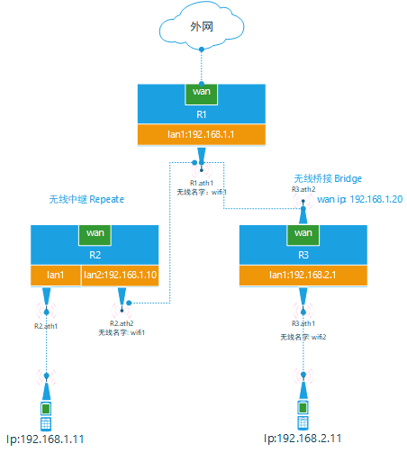
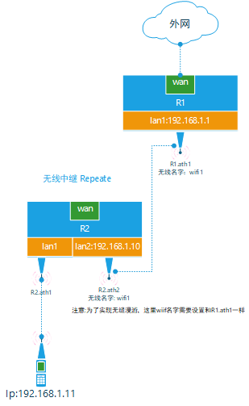
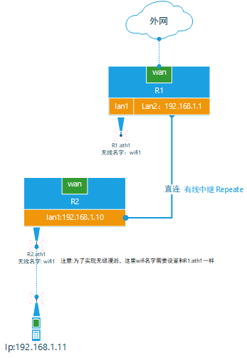
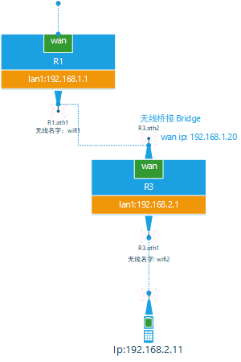

# Wifi WDS介绍

## WDS 简介

WDS是Wireless Distribution System，即无线网络部署延展系统的简称，是指用多个无线网络相互联结的方式构成一个整体的无线网络。

## WDS作用

- 连接距离较远的有线网

  AB两栋楼间很难用有线组成一个网络，所以A栋楼装一个AP并开启WDS桥接模式，B栋楼也装一个AP并开启WDS桥接模式，这样AB两栋组成一个网络.

  该使用场景为WDS的桥接模式（Bridge），两栋楼的AP连接上，但是不能再连接其他的AP，且不允许别的设备连接，其实就是点对点。

- 扩展无线网络的范围

  A栋楼上AP无线范围有线，需要在该AP无线范围的边缘，再家加上一个AP，使得A栋楼上的AP的无线信号能通过新增的AP 让别的sta连上它。

  该使用场景为WDS(Repeater)的中继模，该模式下，原来A栋楼上的AP和新增的AP都能允许其他的设备连上它，也就是还允许接收别的设备的信号

弄清楚了桥接和中继两种模式的用途和区别，设置WDS就很容易了。不同路由器设置菜单中对这两种模式的命名不一样，这往往是造成大家困惑的主要原因。但无论是如何命名的，只要弄清楚哪个是指桥接模式，哪个是指中继模式，并按照需求进行设置即可实现WDS。

无论是用那种模式，要达成WDS模式还有以下必要条件，在无线设置时必须遵循。

1. 两个无线路由器/AP都要支持WDS功能
2. 两个无线路由器/AP的SSID必须相同（无加密或者用wep加密情况下SSID相同不是必要条件，wpa,wpa2加密情况下SSID必须相同。）
3. 两个无线路由器/AP的无线网频道必须相同。默认值通常是“自动”，建议手动设置，确保相同的频道。
4. 两个无线路由器/AP都启动WDS功能，并相互注册对方AP的Wireless MAC address，以此作为组建WDS的身份识别。注意MAC地址通常是有线/无线各一个，即“Lan MAC Address”和“Wireless MAC Address”是不一样的。在WDS功能中需要注册的是对方AP的“Wireless MAC Address”，注意不要混淆。
5. 两个AP的安全设置必须相同，关键是安全机制和密码都必须相同。对于两台不同品牌的无线路由器，建议先用不加密方式把WDS调试好，然后再根据需要设置加密，避免因为加密不兼容造成WDS设置不通的问题。

具体来说，我们可以按照以下步骤来一步步地完成WDS设置。

1. 将两台无线路由器的IP地址分别设置为192.168.1.1和192.168.1.2。
2. 将DHCP服务的起始地址设置为192.168.1.3，避免和两个无线路由器发生IP冲突。
3. 设置无线SSID，两个路由器设置相同的SSID。
4. 设置无线频道（Channel），笔者的两台路由器都设置为Channel 5。
5. 在路由器设置菜单中打开WDS，设置正确的WDS模式，由于笔者建立WDS的目的是为了扩大无线的覆盖范围，是采用WDS中继模式。因此，在 Buffalo WHR-G54S的WDS设置中应选“Enable”，在LinkSYS WRT54g的WDS设置中应选“LAN”。
6. 打开WDS功能后，会出现MAC地址的输入框，是要求捆绑对方AP的无线MAC地址，将两个路由器的无线MAC地址写下来，输入到对方的MAC地址输入框中即可。
7. 设置加密方式，笔者都设置为不加密，这样在设备接入无线网的时候比较方便。
8. 设置完成后就可以把路由器安装到位了，在两个路由器的WDS设置菜单中察看WDS状态，如果能看到对方，表明WDS设置成功，也可以通过两台路由器互相Ping对方的IP来确认两台路由器是否已成功建立WDS。

## 中继和桥接介绍

### 网络拓扑图

### 功能介绍

#### 无线中继

  无线中继，即无线分布系统(WDS)组网，其工作原理是将无线信号从上一个中继点接力传递到下一个中继点（下一个点可以在不同信道上接收和转发），等同于将上一个WiFi配置不变但信号扩大出来，让同一个WiFi覆盖面积变大。

- 路由器R2.ath2关联R2.lan2口，wifi名字为wifi1，用来和主路由R1.ath1连接；

  R2.lan2口ip需要需要和主路由R1.lan1口设置为同一个网段，且需要关闭R2.lan2口的DHCP，确保手机能够正常获取到主路由器LAN网络

- 路由器R2.ath1关联lan1口，用作wifi热点

  若要实现无缝漫游，将R2.ath2 wifi的名称、密码设置和主路由器R1.ath1相同。这样手机在在两个路由器范围内移动过程可以实现wifi无缝连接。该网络适用于家庭网络实现wifi无缝漫游。

#### 有线中继

- R2.lan1和R1.lan2网线直连，设置相同网段IP且关闭DHCP；
- R2.ath1关联R2.lan1，若要实现无线漫游则将 R2.ath1名称和密码设置与主路由器R1.ath1相同。

#### 无线桥接

- R3.ath2关联Wan口，作为客户端主动去链接主路由R1.ath1
- R3.ath1关联R3.lan1，设置R3.lan1和R3.Wan口不同网段，R3.lan1 开启DHCP，

   该网络适用于重新组网，主路由器无法检测到从路由器LAN局域网设备，也不能实现wifi无缝漫游。

#### 总结

中继网络网段不变，将wifi信号扩大使用；桥接网络网段改变，重新建立新的局域网。

中继和桥接会将原本有线的带宽资源层层递减，甚至在末端将面临有网无速的状况；而且由于是这种单链结构，其中一个路由坏了，后续的网络则全部瘫痪。

## OpenWri路由器中继配置

