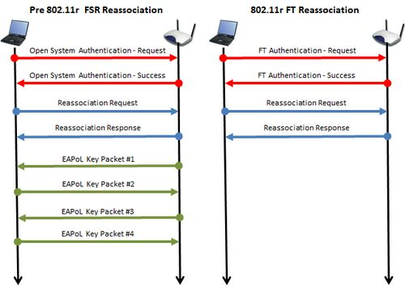
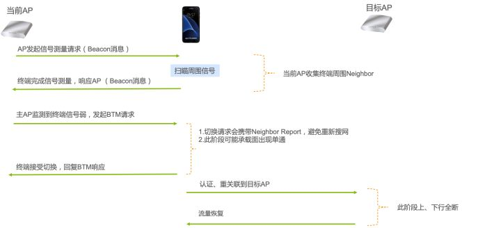

# 无线漫游

## 定义

在WiFi网络中，AP负责接入无线终端并转发流量，无线终端要进行相互通信就必须先与AP建立关联。由于无线终端具有可移动性，当其逐渐移动出正在关联AP的覆盖范围时，则必然会和此关联的AP断开连接，终端在不同的AP之间进行漫游切换存在较长的时间延迟现象，必然会造成用户体验变差。

针对WiFi终端在AP之间切换存在的时间延迟问题，无线漫游技术应运而生。

- 需要强调的是，无缝切换技术均是在同一SSID、同一频率下的行为。对于跨SSID、跨频率，不属于无线漫游范畴。
- 传统多AP组网，如无线路由、桥接、中继、AP模式等组网，均不具备无线漫游属性，即使其使用同一SSID热点，但漫游过程仍然是`脱网->搜网->注册`的行为，与在两个不同热点切换并无不同。

目前支持无线漫游的组网方式就是Mesh组网和AC+AP组网。

## 802.11KVR协议

802.11kvr是目前无线漫游最重要的三个协议标准。

### k协议

 主要解决**往哪里切**问题。

其主要原理是协议通过制定无线电**测量**管理标准，协助终端提前选择备选目标AP，减少重新扫描过程，即解决**往哪里切**。其一般过程是：

1. 终端向当前AP发起Neighbor Report Request，询问当前SSID信息
2. 当前AP回应Neighbor Report Response，将邻居AP信息发送给终端，便于终端知晓切换可以候选AP信息，避免重新搜网。

### v协议

主要解决**切换时机**问题。

其主要原理是是建议客户端可以漫游出当前BSS，接入更合适的AP，即**预警切换**，避免当信号已经劣化到中断才切，其主要过程如下（以AP主动发起举例）：

1. AP向客户端发送切换请求，提供建议切换的AP列表。根据发起方可以分为主动请求和被动请求（主动请求是AP发起，被动请求是终端发起）。
2. 客户端接收到切换请求后，决定是否接受切换请求。

### r协议

主要解决**快速切换**（FT，Fast Basic Service Set Transition）。

其主要原理是将下图中标准切换流程（左边）中的8个消息减少到右边4个消息，从而提升切换速度。

## Mesh漫游切换流程

1. AP发起信号测量请求
2. 终端开始测量附近同热点其它AP信息
3. 当前AP监测到终端信号强度低于门限或者有更好的信号，发起切换请求建议。请求携带邻近候选AP信息（信息来自1、2步探测）
4. 终端根据自身判断决定是否切换并回应消息
5. 若终端决定切换，将遵循AP建议候选AP，完成认证、重关联等过程

## 异频组网切换

目前绝大多数AP都支持双频，即2.4G和5G。在双频情况下，SSID设置有两种方式：

1. 双频独立：2.4G和5G各自一个SSID，需要人为选择热点。
2. 双频合一：2.4G和5G共用一个SSID，避免人为选择热点。
   在双频独立的情况下，2.4G和5G是单独两个热点，跨热点切换等于重新注网，这个过程的时间在秒级。

在双频合一的情况下，虽然2.4G和5G共用一个SSID，但是使用两个独立的BSSID，逻辑上仍然可视为两个热点，因此其本质和双频独立并无区别，只是避免了人为选择的热点的繁琐。

综上所述，在目前Wi-Fi技术下，无缝切换技术还不具备支持跨频率和热点切换，其切换过程仍然是“脱网—扫瞄-认证注册“。