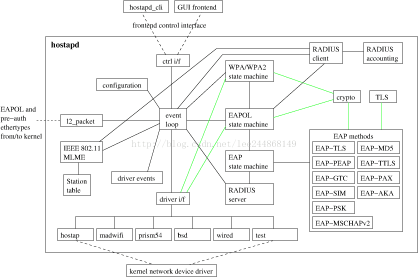
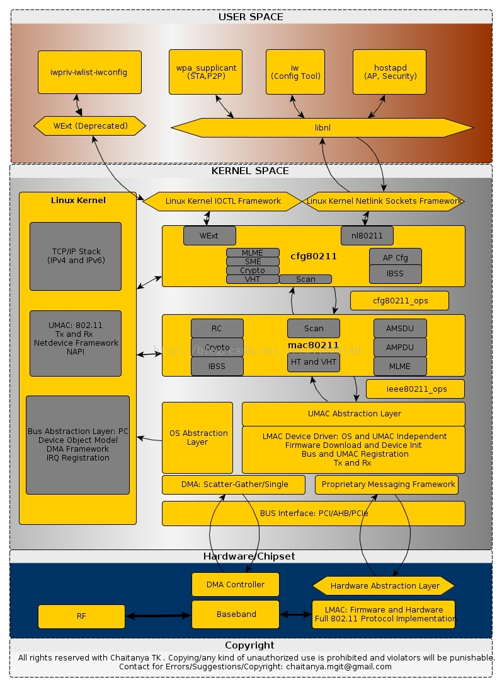

# hostapd

## 简介

hostapd能够使得无线网卡切换为master模式，模拟AP功能，作为AP的认证服务器，负责控制管理stations（带无线网卡的pc或能连wifi的手机等）的接入和认证。

简单的说，我们买回来一个无线网卡，默认情况下是STA模式的，在这种模式下，可以用它来连接到其他路由器、AP上，所以从被连接的master端看来，这个网卡就是client端。

自己做一个ap，让其他设备能够连接上来，并进行管理，那么就要将这个无线网卡切换成AP/master模式，hostapd就是实现这个切换过程，可以通过修改它的配置文件，编译好来管理我们的无线网卡，以建立一个开放式的或者加密（WEP、WPA、WPA2等）的无线网络。修改配置文件hostapd.conf，可以设置无线网络的各种参数，包括频率、信号、beacon包时间间隔、mac地址过滤条件等。

hostapd在我看来主要实现两个功能：

- 将无线网卡切换成AP模式
- 通过EAP/RADIUS管理加密方式。

上图是hostapd的一个代码框架：

- hostapd是一个后台程序，

- hostapd_cli是跟hostapd对应的前台命令行程序，hostapd_cli是与hostapd进行交互的前台程序，通过hostapd_cli可以查看当前无线的认证状态、 .11和.1x的MIBS等。

  hostapd_cli有两种模式：

  - 交互模式：没输入参数时，将进入交互模式，help可以查看可用的命令。
  - 命令行模式

下图是配置一个无线网络涉及到的命令和工具，以及无线工作的流程

