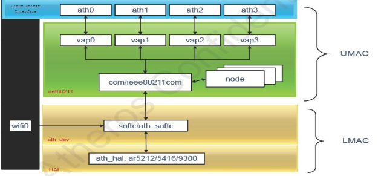

# iwconfig命令

在QCA Atheros驱动中，up起来的AP会创建两种设备类型：

- radio层，也叫ATH/HAL层：对应的是WiFiN设备，N是以0开始的编号，比如wifi0，wifi1；
- 协议层或802.11层：对应的是athN设备，通常我们叫这些接口为虚拟AP接口（vaps）。多个vap可以关联到同一个wifi设备上。每一层都控制着驱动系统中的某一部分，所以每一层都对应着不同的无线命令。

无线工具集中最重要的两命令是iwconfig和iwpriv。这些命令用来配置或修改驱动中的运行参数，很多命令都是在AP接口up以后才能工作的，iwconfig命令是用在协议层的，也就是用在ATH层，所以iwconfig命令必须用于athN这些接口，它不会影响到radio层

在最新的驱动中有两种可以选择的运行模式：Direct Attach (DA) and Offload (OL)

DA模式是指整个驱动都运行在主平台上，而且WLAN硬件的接口是直接挂在主机的总线接口上的（比如PCI，PCIe，AHB总线等），这种类型的芯片包括AR928x, AR938x, AR939x, AR958x, AR959x, AR934x,
AR935x, QCA953x and QCA955x等。

Offload (OL) model卸载模式是指无线驱动的组件运行在目标上（也就是网卡），而thin interface layer的部分即运行在host主机上也运行在目标板上，两者通过thin interface layer进行交互。

下面将的命令将会和这两个模式相关，带有“DA”标示的命令表示该命令支持该种模式，而带有“OL”标示的命令表示该命令支持OL模式

## iwconfig参数

iwconfig命令包含一系列用于设置WLAN接口的参数，它的用法和ifconfig很相似，但是iwconfig是专门用于配置802.11设备接口的，所以他一般用来配置vaps接口（注：radio层不支持iwconfig）。

|参数    |命令格式                           |支持DA模式 |支持OL模式 |描述|
|--------|-----------------------------------|-----------|-----------|----|
|freq    |`iwconfig athN freq opfreq`          |Y          | Y         |和信道命令相似，这个参数是用来修改运行频率的，注意这个频率应该是该设备所支持的频率。信道和频率是相对应的，不同的信道对应不同频率。 设置频率时，K,M,G表示单位（KHz,MHz,GHz）,比如2.412G=2412M=2412000k。 如果频率设置为0，就会触发Auto Channel选项，那么驱动就会根据判断给接口选择最适合的信道。如果设置的频率时无效的，那么就会返回错误信息。 `# iwconfig ath0 freq 5.2G #iwconfig ath0 freq 40`|
|rate    |`iwconfig athN rate rateval/auto`    |Y          | Y         |设置一个固定的传输速率，或者启动内部速率控制逻辑。 rateval：那么就会修改成想要的速率。M和k表示单位（Mbit/s或者kbit/s）。 auto：默认配置。 设置802.11n和802.11ac的固定速率会更复杂，设置MCS速率不能完全用这个命令完成： 802.11n速率——使用命令iwpriv 的Set11NRates和Set11NRetries选项 802.11ac速率——使用iwpriv命令的nss and vhtmcs选项 不支持QCA955x芯片 `#iwconfig ath0 rate 36M`|
|retry   |——                                 |N          | N         |软件retry不支持|
|rts     |`iwconfig athN rts minpktsize`       |Y          | Y         |在RTS/CTS保护中用来设置包的最小值，这个设置用来减少在小包的传输中仲裁的数量，改善throughput。如果将值设成0，RTS/CTS将全部关闭握手，在802.11n中，RTS/CTS是同时由速率表和其他设置共同完成的，所以在使用802.11n速率时，这个命令未必能得到想要的结果。阈值应该大于256B #iwconfig ath0 rts 256|
|txpower |`iwconfig athN txpower pwrsetting`   |Y          | Y         |为该设备所有的包设置Txpower，这个功率限制可以通过设置country code（查看iwpriv setCountry）来调整，pwrsetting的单位是dBm，将它设置成off将启动自动功率控制逻辑。默认的Tx功率等级依赖于调整表 #iwconfig ath0 txpower 30|
