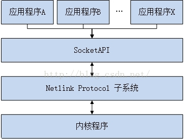
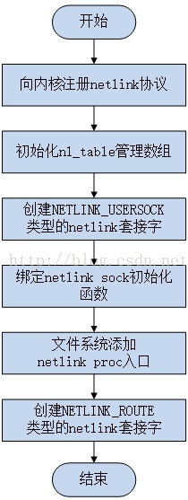
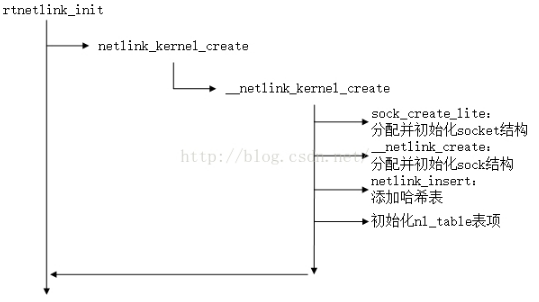
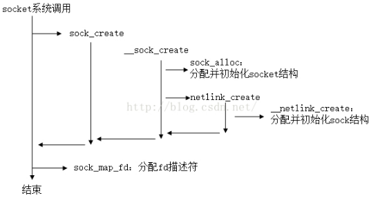
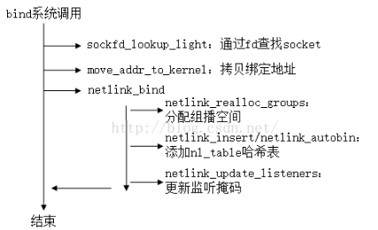
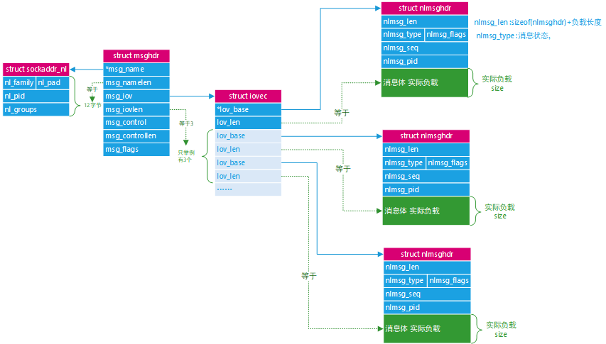
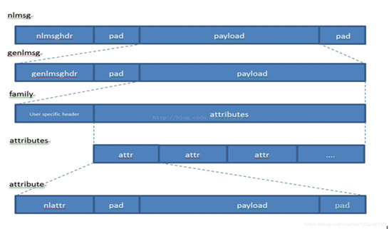
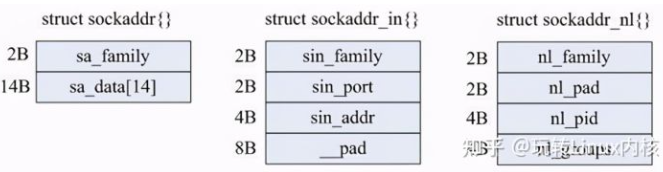

# Netlink 协议

## Netlink简介

Netlink 是一种IPC（Inter Process Commumicate）机制：

- 内核与用户空间通信的机制，也是Netlink使用最广泛的的情景
- 进程间通信（较少），进程之间通信更多使用Unix域套接字

在一般情况下，用户态和内核态通信会传统的三种方式：

- Ioctl
- sysfs属性文件
- procfs属性文件

二者差别

传统的3种通信方式都是同步通信方式，由用户态主动发起向内核态的通信，内核无法主动发起通信。

而Netlink是一种异步全双工的通信方式，它支持由内核态主动发起通信，内核为Netlink通信提供了一组特殊的API接口，用户态则基于socket API，内核发送的数据会保存在接收进程socket 的接收缓存中，由接收进程处理。

## Netlink的优点

1. 双向全双工异步传输，支持由内核主动发起传输通信，而不需要用户空间出发，如此用户空间在等待内核某种触发条件满足时就无需不断轮询，而异步接收内核消息即可。
2. 支持组播传输，即内核态可以将消息发送给多个接收进程，这样就不用每个进程单独来查询了。

## Netlink框架



## Netlink协议类型

目前在Linux 4.1.x 的主线内核版本中，已经有许多内核模块使用netlink 机制，其中驱动模型中使用的uevent 就是基于netlink 实现。目前 netlink 协议族支持32种协议类型，它们定义在 `include/uapi/linux/netlink.h` 中

```c
#define NETLINK_ROUTE        0    /* 用于设置和查询路由表等网络核心模块*/
#define NETLINK_UNUSED       1    /* Unused number                */
#define NETLINK_USERSOCK     2    /* Reserved for user mode socket protocols,保留用于用户态进程间通信     */
#define NETLINK_FIREWALL     3    /* Unused number, formerly ip_queue        */
#define NETLINK_SOCK_DIAG    4    /* socket monitoring                */
#define NETLINK_NFLOG        5    /* netfilter/iptables ULOG */
#define NETLINK_XFRM         6    /* ipsec */
#define NETLINK_SELINUX      7    /* SELinux event notifications */
#define NETLINK_ISCSI        8    /* Open-iSCSI */
#define NETLINK_AUDIT        9    /* auditing */
#define NETLINK_FIB_LOOKUP   10
#define NETLINK_CONNECTOR    11
#define NETLINK_NETFILTER    12    /* netfilter subsystem */
#define NETLINK_IP6_FW       13
#define NETLINK_DNRTMSG      14    /* DECnet routing messages */
#define NETLINK_KOBJECT_UEVENT 15    /* Kernel messages to userspace 用于uevent消息通信*/
#define NETLINK_GENERIC        16  //generic netlink netlink复用器
/* leave room for NETLINK_DM (DM Events) */
#define NETLINK_SCSITRANSPORT  18    /* SCSI Transports */
#define NETLINK_ECRYPTFS       19
#define NETLINK_RDMA           20
#define NETLINK_CRYPTO         21    /* Crypto layer */
#define NETLINK_INET_DIAG NETLINK_SOCK_DIAG
#define MAX_LINKS 32
```

现在4.1.x 的内核版本中已经定义了22种协议类型，其中`NETLINK_ROUTE`是用于设置和查询路由表等网络核心模块的，`NETLINK_KOBJECT_UEVENT`是用于uevent消息通信的......

对于在实际的项目中，可能会有一些定制化的需求，以上这几种专用的协议类型无法满足，这时可以在不超过最大32种类型的基础之上自行添加。但是一般情况下这样做有些不妥，于是内核开发者就设计了一种通用netlink 协议类型（Generic Netlink）`NETLINK_GENERIC`，它就是一个Netlink复用器，便于用户自行扩展子协议类型（后面我会使用该Generic Netlink 编写一个示例程序用于演示内核和用户空间的通信）

## 内核态Netlink

### 内核下Netlink的具体创建和通信流

内核Netlink的初始化在系统启动阶段完成，初始化代码在af_netlink.c的netlink_proto_init()函数中，整个初始化流程如下：




```c
static int __init netlink_proto_init(void)
{
    int i;
    int err = proto_register(&netlink_proto, 0);//向内核注册netlink协议

    if (err != 0)
        goto out;

    BUILD_BUG_ON(sizeof(struct netlink_skb_parms) > FIELD_SIZEOF(struct sk_buff, cb));
	//创建并初始化了nl_table表数组  --------- 详解1
    nl_table = kcalloc(MAX_LINKS, sizeof(*nl_table), GFP_KERNEL);
    if (!nl_table)
        goto panic;

    for (i = 0; i < MAX_LINKS; i++) {
        if (rhashtable_init(&nl_table[i].hash,
                    &netlink_rhashtable_params) < 0) {
            while (--i > 0)
                rhashtable_destroy(&nl_table[i].hash);
            kfree(nl_table);
            goto panic;
        }
    }

    INIT_LIST_HEAD(&netlink_tap_all);

    netlink_add_usersock_entry();//初始化应用层使用的NETLINK_USERSOCK协议类型的netlink（用于应用层进程间通信）---单独初始化,维持用户态进程间通信
	//-------------- 详解2
    sock_register(&netlink_family_ops); 
    //------------------ 详解3
    register_pernet_subsys(&netlink_net_ops); 
    /* The netlink device handler may be needed early. */
    //----------- 详解4
    rtnetlink_init(); 
out:
    return err;
panic:
    panic("netlink_init: Cannot allocate nl_table\n");
}

core_initcall(netlink_proto_init);//内核初始化时调用
```

- 详解1：

  ```c
  nl_table = kcalloc(MAX_LINKS, sizeof(*nl_table), GFP_KERNEL);
  ```

  本初始化函数首先向内核注册netlink协议；然后创建并初始化了nl_table表数组，这个表是整个netlink实现的最关键的一步，每种协议类型占数组中的一项，后续内核中创建的不同种协议类型的netlink都将保存在这个表中，由该表统一维护，来简单看一些它的定义，有一个大概的印象

  ```c
  struct netlink_table {
      struct rhashtable    hash;　　　　　　　　　　//hash（哈希表）用来索引同种协议类型的不同netlink套接字实例
      struct hlist_head    mc_list;　　　　　　　　//为多播使用的sock散列表
      struct listeners __rcu    *listeners;　　　//监听者掩码
      unsigned int        flags;
      unsigned int        groups;　　　　　　　　　//协议支持的最大多播组数量
      struct mutex        *cb_mutex;
      struct module        *module;
      /*定义了一些函数指针，它们会在内核首次创建netlink时被赋值，后续应用层创建和绑定socket时调用到*/
      int            (*bind)(struct net *net, int group);
      void            (*unbind)(struct net *net, int group);
      bool            (*compare)(struct net *net, struct sock *sock);
      int            registered;
  };
  ```

  

- 详解2：

  ```c
  sock_register(&netlink_family_ops);
  ```

  调用sock_register向内核注册协议处理函数，即将netlink的socket创建处理函数注册到内核中，如此以后应用层创建netlink类型的socket时将会调用该协议处理函数，其中netlink_family_ops函数的定义如下：

  ```c
  static const struct net_proto_family netlink_family_ops = {
       .family = PF_NETLINK,
       .create = netlink_create,
       .owner    = THIS_MODULE,    /* for consistency 8) */
  };
  ```

  这样以后应用层创建PF_NETLINK(AF_NETLINK)类型的socket()系统调用时将由netlink_create()函数负责处理

- 详解3：

  ```c
  register_pernet_subsys(&netlink_net_ops);   
  ```

  调用register_pernet_subsys向内核所有的网络命名空间注册”子系统“的初始化和去初始化函数，这里的"子系统”并非指的是netlink子系统，而是一种通用的处理方式，在网络命名空间创建和注销时会调用这里注册的初始化和去初始化函数，当然对于已经存在的网络命名空间，在注册的过程中也会调用其初始化函数。netlink_net_ops定义如下：

  ```c
  static struct pernet_operations __net_initdata netlink_net_ops = {
      .init = netlink_net_init,
      .exit = netlink_net_exit,
  };
  ```

  其中netlink_net_init()会在文件系统中位每个网络命名空间创建一个proc入口，而netlink_net_exit()不用时销毁。

- 详解4

  ```c
  rtnetlink_init();
  ```

  调用rtnetlink_init()创建NETLINK_ROUTE协议类型的netlink，该种类型的netlink才是当初内核设计netlink的初衷，它用来传递网络路由子系统、邻居子系统、接口设置、防火墙等消息。至此整个netlink子系统初始化完成。

### 内核Netlink套接字

下面首先来看一下内核netlink使用到的几个关键数据结构：

1. 内核netlink配置结构：`struct netlink_kernel_cfg`

   该结构包含了内核netlink的可选参数

   ```c
   /* optional Netlink kernel configuration parameters */
   struct netlink_kernel_cfg {
       unsigned int    groups;
       unsigned int    flags;
       void        (*input)(struct sk_buff *skb);
       struct mutex    *cb_mutex;
       int        (*bind)(struct net *net, int group);
       void        (*unbind)(struct net *net, int group);
       bool        (*compare)(struct net *net, struct sock *sk);
   };
   ```

   - `groups`用于指定最大的多播组；
   - `flags`成员可以为`NL_CFG_F_NONROOT_RECV`或`NL_CFG_F_NONROOT_SEND`，这两个符号前者用来限定非超级用户是否可以绑定到多播组，后者用来限定非超级用户是否可以发送组播；
   - `*input`函数指针用于指定回调函数，该回调函数用于接收和处理来自用户空间的消息（若无需接收来自用户空间的消息可不指定），
   - 最后的三个函数指针实现sock的绑定和解绑定等操作，会添加到`nl_table`对应的项中去。

2. netlink属性头：`struct nlattr`

   ```c
   struct nlattr {
       __u16           nla_len;  // 长度
       __u16           nla_type; // 类型
   };
   ```

   netlink的消息头后面跟着的是消息的有效载荷部分，它采用的是格式为TLV（即：类型-长度-值）。

   其中类型和长度使用属性头nlattr来表示。其中nla_len表示属性长度；nla_type表示属性类型，它可以取值为以下几种类型（定义在`include\net\netlink.h`中)：

   ```c
   enum {
       NLA_UNSPEC,
       NLA_U8,
       NLA_U16,
       NLA_U32,
       NLA_U64,
       NLA_STRING,
       NLA_FLAG,
       NLA_MSECS,
       NLA_NESTED,
       NLA_NESTED_COMPAT,
       NLA_NUL_STRING,
       NLA_BINARY,
       NLA_S8,
       NLA_S16,
       NLA_S32,
       NLA_S64,
       __NLA_TYPE_MAX,
   };
   ```

   比较常用的

   - `NLA_UNSPEC`：表示类型和长度未知
   - `NLA_U32`：表示无符号32位整形数
   - `NLA_STRING`：表示变长字符串
   - `NLA_NESTED`：表示嵌套属性（即包含一层 新的属性）

3. netlink有效性策略：`struct nla_policy`

   ```c
   struct netlink_sock {
       /* struct sock has to be the first member of netlink_sock */
       struct sock        sk;
       u32            portid;
       u32            dst_portid;
       u32            dst_group;
       u32            flags;
       u32            subscriptions;
       u32            ngroups;
       unsigned long        *groups;
       unsigned long        state;
       size_t            max_recvmsg_len;
       wait_queue_head_t    wait;
       bool            bound;
       bool            cb_running;
       struct netlink_callback    cb;
       struct mutex        *cb_mutex;
       struct mutex        cb_def_mutex;
       void            (*netlink_rcv)(struct sk_buff *skb);
       int            (*netlink_bind)(struct net *net, int group);
       void            (*netlink_unbind)(struct net *net, int group);
       struct module        *module;
   #ifdef CONFIG_NETLINK_MMAP
       struct mutex        pg_vec_lock;
       struct netlink_ring    rx_ring;
       struct netlink_ring    tx_ring;
       atomic_t        mapped;
   #endif /* CONFIG_NETLINK_MMAP */
    
       struct rhash_head    node;
       struct rcu_head        rcu;
   };
   ```

   本结构用于描述一个netlink套接字，其中：
   
   - `portid`：表示本套接字自己绑定的id号，对于内核来说它就是0
   - `dst_portid`：表示目的id号
   - `ngroups`：表示协议支持多播组数量
   - `groups`：保存组位掩码
   - `netlink_rcv`：保存接收到用户态数据后的处理函数
   - `netlink_bind`和`netlink_unbind`：用于协议子协议自身特有的绑定和解绑定处理函数。

### 创建内核Netlink套接字

内核中各种协议类型的netlink分别在不同的模块中进行创建和初始化，我以文中的`NETLINK_ROUTE`为例来分析一下内核中netlink套接字的创建流程。

首先回到子系统初始化函数`netlink_proto_init()`的最后，来查看`rtnetlink_init()`函数的执行流程：



```c
void __init rtnetlink_init(void)
{
    //将rtnetlink的init函数和exit函数注册到内核的每个网络命名空间中 ------- 详解5
    if (register_pernet_subsys(&rtnetlink_net_ops))　　
        panic("rtnetlink_init: cannot initialize rtnetlink\n");

    register_netdevice_notifier(&rtnetlink_dev_notifier);

    rtnl_register(PF_UNSPEC, RTM_GETLINK, rtnl_getlink,
              rtnl_dump_ifinfo, rtnl_calcit);
    rtnl_register(PF_UNSPEC, RTM_SETLINK, rtnl_setlink, NULL, NULL);
    rtnl_register(PF_UNSPEC, RTM_GETSTATS, rtnl_stats_get, rtnl_stats_dump,
              NULL);
}
```

- 详解5

  `register_pernet_subsys(&rtnetlink_net_ops)`

  ```c
  
  static struct pernet_operations rtnetlink_net_ops = {
  	//NETLINK_ROUTE入口函数 ------- 详解6
      .init = rtnetlink_net_init,　　　　　　　　　　　　　　
      .exit = rtnetlink_net_exit,
  };
  ```

  这里将rtnetlink的init函数(rtnetlink_net_init)和exit函数(rtnetlink_net_exit)注册到内核的每个网络命名空间中，对于已经存在的网络命名空间会调用其中的init函数，这里就是rtnetlink_net_init()函数了。

- 详解6

  `rtnetlink_net_init`函数会直接调用`__net_init`

  ```c
  static int __net_init rtnetlink_net_init(struct net *net)
  {
      struct sock *sk;
      struct netlink_kernel_cfg cfg = {
          .groups        = RTNLGRP_MAX,
          .input        = rtnetlink_rcv,　　　　　　 //指定消息接收处理函数为rtnetlink_rcv
          .cb_mutex    = &rtnl_mutex,
          .flags        = NL_CFG_F_NONROOT_RECV,　　//这表明非超级用户可以绑定到多播组,可以接收消息
      };
     //创建NETLINK_ROUTE类型套接字------详解7
      sk = netlink_kernel_create(net, NETLINK_ROUTE, &cfg);　　
      if (!sk)
          return -ENOMEM;
      net->rtnl = sk;
      return 0;
  }
  ```

  首先这里定义了一个 `netlink_kernel_cfg`结构体实例，设置groups为RTNLGRP_MAX后指定消息接收处理函数为rtnetlink_rcv，并设置flag为NL_CFG_F_NONROOT_RECV，这表明非超级用户可以绑定到多播组，但是没有设置NL_CFG_F_NONROOT_SEND，这表明非超级用户将不能发送组播消息。

  随后init函数调用`netlink_kernel_create()`向当前的网络命名空间创建`NETLINK_ROUTE`类型的套接字，并指定定义的那个配置结构`cfg`。

- 详解7 

  ```c
  netlink_kernel_create(struct net *net, int unit, struct netlink_kernel_cfg *cfg)
  {
      return __netlink_kernel_create(net, unit, THIS_MODULE, cfg);
  }
  ```

  它其实就是__netlink_kernel_create()的一个封装而已， __netlink_kernel_create函数比较长：

  ```c
  struct sock *
  __netlink_kernel_create(struct net *net, int unit, struct module *module,
              struct netlink_kernel_cfg *cfg)
  {
      struct socket *sock;
      struct sock *sk;
      struct netlink_sock *nlk;struct listeners *listeners = NULL;
      struct mutex *cb_mutex = cfg ? cfg->cb_mutex : NULL;
      unsigned int groups;
  
      BUG_ON(!nl_table);
  
      if (unit < 0 || unit >= MAX_LINKS)//简单的参数判断
          return NULL;
  
      if (sock_create_lite(PF_NETLINK, SOCK_DGRAM, unit, &sock))//创建了一个以PF_NETLINK为地址族的SOCK_DGRAM类型的 socket 套接字，其协议类型就是作为参数传入的NETLINK_ROUTE
          return NULL;
  
      if (__netlink_create(net, sock, cb_mutex, unit, 1) < 0)//向内核初始化netlink套接字  --------- 详解8
          goto out_sock_release_nosk;
  
      sk = sock->sk;
  
      if (!cfg || cfg->groups < 32)//---------------- 详解9
          groups = 32;
      else
          groups = cfg->groups;
  
      listeners = kzalloc(sizeof(*listeners) + NLGRPSZ(groups), GFP_KERNEL);//分配listeners内存空间，这里边保存了监听者（监听套接字）的信息
      if (!listeners)
          goto out_sock_release;
  
      sk->sk_data_ready = netlink_data_ready;
      if (cfg && cfg->input)
          nlk_sk(sk)->netlink_rcv = cfg->input;//------- 详解10
  
      if (netlink_insert(sk, 0)) //------------ 详解11
          goto out_sock_release;
  
      nlk = nlk_sk(sk);
      nlk->flags |= NETLINK_F_KERNEL_SOCKET;//设置标识NETLINK_KERNEL_SOCKET表明这个netlink套接字是一个内核套接字
  
      netlink_table_grab();// -------- 详解12
      if (!nl_table[unit].registered) {
          nl_table[unit].groups = groups;
          rcu_assign_pointer(nl_table[unit].listeners, listeners);
          nl_table[unit].cb_mutex = cb_mutex;
          nl_table[unit].module = module;
          if (cfg) {
              nl_table[unit].bind = cfg->bind;
              nl_table[unit].unbind = cfg->unbind;
              nl_table[unit].flags = cfg->flags;
              if (cfg->compare)
                  nl_table[unit].compare = cfg->compare;
          }
          nl_table[unit].registered = 1;
      } else {
          kfree(listeners);
          nl_table[unit].registered++;
      }
      netlink_table_ungrab();
      return sk;  //------- 详解13
  
  out_sock_release:
      kfree(listeners);
      netlink_kernel_release(sk);
      return NULL;
  
  out_sock_release_nosk:
      sock_release(sock);
      return NULL;
  }
  ```

  

- 详解8

  最核心的 __netlink_create()函数向内核初始化netlink套接字 （其实在下文中将会看到用户态创建netlink套接字也是间接调用到该函数）

  ```c
  static int __netlink_create(struct net *net, struct socket *sock,
                  struct mutex *cb_mutex, int protocol,
                  int kern)
  {
      struct sock *sk;
      struct netlink_sock *nlk;
  
      sock->ops = &netlink_ops;//将sock的操作函数集指针设置为netlink_ops
  
      sk = sk_alloc(net, PF_NETLINK, GFP_KERNEL, &netlink_proto, kern);//分配sock结构并进行初始化
      if (!sk)
          return -ENOMEM;
  
      sock_init_data(sock, sk);//初始化发送接收消息队列
  
      nlk = nlk_sk(sk);//初始化数据缓存
      if (cb_mutex) {
          nlk->cb_mutex = cb_mutex;
      } else {
          nlk->cb_mutex = &nlk->cb_def_mutex;
          mutex_init(nlk->cb_mutex);//初始化互斥锁
          lockdep_set_class_and_name(nlk->cb_mutex,
                         nlk_cb_mutex_keys + protocol,
                         nlk_cb_mutex_key_strings[protocol]);
      }
      init_waitqueue_head(&nlk->wait);//初始化等待队列
  
      sk->sk_destruct = netlink_sock_destruct;//设置sk_destruct回调函数
      sk->sk_protocol = protocol;//设置协议类型
      return 0;
  }
  ```

  其中netlink_ops静态变量赋值如下：

  ```c
  static const struct proto_ops netlink_ops = {
      .family =    PF_NETLINK,
      .owner =    THIS_MODULE,
      .release =    netlink_release,
      .bind =        netlink_bind,
      .connect =    netlink_connect,
      .socketpair =    sock_no_socketpair,
      .accept =    sock_no_accept,
      .getname =    netlink_getname,
      .poll =        datagram_poll,
      .ioctl =    netlink_ioctl,
      .listen =    sock_no_listen,
      .shutdown =    sock_no_shutdown,
      .setsockopt =    netlink_setsockopt,
      .getsockopt =    netlink_getsockopt,
      .sendmsg =    netlink_sendmsg,
      .recvmsg =    netlink_recvmsg,
      .mmap =        sock_no_mmap,
      .sendpage =    sock_no_sendpage,
  };
  ```

  

- 详解9

  ```c
      if (!cfg || cfg->groups < 32)
          groups = 32;
      else
          groups = cfg->groups;
  ```

  校验groups，默认最小支持32个组播地址（因为后文会看到用户层在绑定地址时最多绑定32个组播地址），但内核也有可能支持大于32个组播地址的情况（Genetlink就属于这种情况）

- 详解10 

  ```c
  nlk_sk(sk)->netlink_rcv = cfg->input;
  ```

  初始化函数指针，这里将前文详解6中定义的rtnetlink_rcv注册到了nlk_sk(sk)->netlink_rcv中，这样就设置完了内核态的消息处理函数

- 详解11

  ```c
   netlink_insert(sk, 0)
  ```


  调用netlink_insert()函数将本次创建的这个套接字添加到nl_table中去（其核心是调用__netlink_insert()），注册的套接字是通过nl_table中的哈希表来管理的。

- 详解12

  ```c
  netlink_table_grab
  ```

  接下来继续初始化nl_table表中对应传入 NETLINK_ROUTE协议类型的数组项，首先会判断是否已经先有同样协议类型的已经注册过了，如果有就不再初始化该表项了，直接释放刚才申请的listeners内存空间然后递增注册个数并返回。这里假定是首次注册NETLINK_ROUTE协议类型的套接字，这里依次初始化了nl_table表项中的groups、listeners、cb_mutex、module、bind、unbind、flags和compare字段。

  ```c
  netlink_table_grab(); 
  if (!nl_table[unit].registered) {
          nl_table[unit].groups = groups;
          rcu_assign_pointer(nl_table[unit].listeners, listeners);
          nl_table[unit].cb_mutex = cb_mutex;
          nl_table[unit].module = module;
          if (cfg) {
              nl_table[unit].bind = cfg->bind;
              nl_table[unit].unbind = cfg->unbind;
              nl_table[unit].flags = cfg->flags;
              if (cfg->compare)
                  nl_table[unit].compare = cfg->compare;
          }
          nl_table[unit].registered = 1;
      } else {
          kfree(listeners);
          nl_table[unit].registered++;
      }
      netlink_table_ungrab();
  ```

  通过前文中cfg的实例分析，这里的初始化的值分别如下：

  ```c
  nl_table[NETLINK_ROUTE].groups = RTNLGRP_MAX;
  nl_table[NETLINK_ROUTE].cb_mutex = &rtnl_mutex;
  nl_table[ NETLINK_ROUTE ].module = THIS_MODULE;
  nl_table[NETLINK_ROUTE].bind = NULL;
  nl_table[NETLINK_ROUTE].unbind = NULL;
  nl_table[NETLINK_ROUTE].compare = NULL;
  nl_table[NETLINK_ROUTE].flags= NL_CFG_F_NONROOT_RECV;
  ```

  这些值在后面的通信流程中就会使用到。

- 详解13

  ```c
  return sk = sock->sk;
  ```

  在函数的最后返回成功创建的netlink套接字中的sock指针，它会在最先前的rtnetlink_net_init()函数中被保存到net->rtnl中去，注意只有NETLINK_ROUTE协议类型的套接字才会执行这个步骤，因为网络命名空间中专门为其预留了一个sock指针。

## 用户态下Netlink

在用户态模式下Netlink具体创建和通信流程

应用层通过标准的sock API即可使用Netlink完成通信功能（如socket()、sendto()、recv()、sendmsg()和recvmsg()等）,这些都是系统调用，内核中对应的定义为sys_xxx。用户层netlink套接字创建流程如下图所示:



首先来看一些基本的数据结构及创建流程：

1. 套接字地址数据结构sockaddr_nl

   ```c
   struct sockaddr_nl {
       __kernel_sa_family_t    nl_family;    　　/* AF_NETLINK    */
       unsigned short    nl_pad;   　　     　　　/* zero        */
       __u32        nl_pid;        　　　　　　　　/* port ID    */
       __u32        nl_groups;    　　　　 　　　　/* multicast groups mask */
   };
   ```

   - nl_family始终为AF_NETLINK；
   - nl_pad始终为0；
   - nl_pid为netlink套接字的单播地址，在发送消息时用于表示目的套接字的地址，在用户空间绑定时可以指定为当前进程的PID号（对于内核来说这个值为0）或者干脆不设置（在绑定bind时由内核调用netlink_autobind()设置为当前进程的PID），但需要注意的是当用户同一个进程中需要创建多个netlink套接字时则必须保证这个值是唯一的（一般在多线程中可以使用”pthread_self() << 16 | getpid()“这样的方法进行设置）；
   - nl_groups表示组播组。在发送消息时用于表示目的多播组，在绑定地址时用于表示加入的多播组。这里nl_groups为一个32位无符号数，其中的每一位表示一个 多播组，一个netlink套接字可以加入多个多播组用以接收多个多播组的多播消息（最多支持32个）。

2. 创建Netlink套接字

   应用层通过socket()系统调用创建Netlink套接字，socket系统调用的第一个参数可以是AF_NETLINK或PF_NETLINK（在Linux系统中它俩实际为同一种宏），第二个参数可以是SOCK_RAW或SOCK_DGRAM（原始套接字或无连接的数据报套接字），最后一个参数为netlink.h中定义的协议类型，用户可以按需求自行创建上述不同种类的套接字。

   例如:调用socket(AF_NETLINK, SOCK_RAW, NETLINK_ROUTE) 即创建了一个NETLINK_ROUTE类型的Netlink套接字。

   下面跟进这个系统调用，查看内核是如何为用户层创建这个套接字然后又做了哪些初始化动作,net\socket.c：

   ```c
   SYSCALL_DEFINE3(socket, int, family, int, type, int, protocol)
   {
       int retval;
       struct socket *sock;
       int flags;
    
       /* Check the SOCK_* constants for consistency.  */
       BUILD_BUG_ON(SOCK_CLOEXEC != O_CLOEXEC);
       BUILD_BUG_ON((SOCK_MAX | SOCK_TYPE_MASK) != SOCK_TYPE_MASK);
       BUILD_BUG_ON(SOCK_CLOEXEC & SOCK_TYPE_MASK);
       BUILD_BUG_ON(SOCK_NONBLOCK & SOCK_TYPE_MASK);
    
       flags = type & ~SOCK_TYPE_MASK;
       if (flags & ~(SOCK_CLOEXEC | SOCK_NONBLOCK))
           return -EINVAL;
       type &= SOCK_TYPE_MASK;
    
       if (SOCK_NONBLOCK != O_NONBLOCK && (flags & SOCK_NONBLOCK))
           flags = (flags & ~SOCK_NONBLOCK) | O_NONBLOCK;
    
       retval = sock_create(family, type, protocol, &sock);
       if (retval < 0)
           goto out;
    
       retval = sock_map_fd(sock, flags & (O_CLOEXEC | O_NONBLOCK));
       if (retval < 0)
           goto out_release;
    
   out:
       /* It may be already another descriptor 8) Not kernel problem. */
       return retval;
    
   out_release:
       sock_release(sock);
       return retval;
   }
   ```

   该函数首先做了一些参数检查之后就调用sock_create()函数创建套接字，在创建完成后向内核申请描述符并返回该描述符。

   ```c
   int sock_create(int family, int type, int protocol, struct socket **res)
   {
       return __sock_create(current->nsproxy->net_ns, family, type, protocol, res, 0);
   }
   ```

   进入sock_create()函数内部，它是`__sock_create()`的一层封装（内核中往往前面带两个下划线的函数才是做事实的，嘿嘿），这里要注意的是调用时又多了两个个参数，一是当前进程绑定的网络命名空间，而是最后一个kern参数，这里传入0表明是从应用层创建的套接字。__sock_create()函数比较长：

   ```c
   int __sock_create(struct net *net, int family, int type, int protocol,
                struct socket **res, int kern)
   {
       int err;
       struct socket *sock;
       const struct net_proto_family *pf;
           //参数判断
       /*
        *      Check protocol is in range
        */
       if (family < 0 || family >= NPROTO)
           return -EAFNOSUPPORT;
       if (type < 0 || type >= SOCK_MAX)
           return -EINVAL;
   
       /* Compatibility.
          This uglymoron is moved from INET layer to here to avoid
          deadlock in module load.
        */
       if (family == PF_INET && type == SOCK_PACKET) {
           static int warned;
           if (!warned) {
               warned = 1;
               pr_info("%s uses obsolete (PF_INET,SOCK_PACKET)\n",
                   current->comm);
           }
           family = PF_PACKET;
       }
       err = security_socket_create(family, type, protocol, kern);//---------- 详解1
       if (err)
           return err;
   
       /*
        *    Allocate the socket and allow the family to set things up. if
        *    the protocol is 0, the family is instructed to select an appropriate
        *    default.
        */
       sock = sock_alloc();//分配socket实例，它会为其创建和初始化索引节点
       if (!sock) {
           net_warn_ratelimited("socket: no more sockets\n");
           return -ENFILE;    /* Not exactly a match, but its the
                      closest posix thing */
       }
   
       sock->type = type;//将sock->type赋值为传入的SOCK_RAW
           #ifdef CONFIG_MODULES
       /* Attempt to load a protocol module if the find failed.
        *
        * 12/09/1996 Marcin: But! this makes REALLY only sense, if the user
        * requested real, full-featured networking support upon configuration.
        * Otherwise module support will break!
        */
       if (rcu_access_pointer(net_families[family]) == NULL)//-------- 详解2
           request_module("net-pf-%d", family);
   #endif
   
       rcu_read_lock();
       pf = rcu_dereference(net_families[family]);
       err = -EAFNOSUPPORT;
       if (!pf)
           goto out_release;
           /*
        * We will call the ->create function, that possibly is in a loadable
        * module, so we have to bump that loadable module refcnt first.
        */
       if (!try_module_get(pf->owner))//获取模块的引用计数
           goto out_release;
   
       /* Now protected by module ref count */
       rcu_read_unlock();
   
       err = pf->create(net, sock, protocol, kern);//--------- 详解3
       if (err < 0)
           goto out_module_put;
   
       /*
        * Now to bump the refcnt of the [loadable] module that owns this
        * socket at sock_release time we decrement its refcnt.
        */
       if (!try_module_get(sock->ops->owner))
           goto out_module_busy;
   
       /*
        * Now that we're done with the ->create function, the [loadable]
        * module can have its refcnt decremented
        */
       module_put(pf->owner);
       err = security_socket_post_create(sock, family, type, protocol, kern);
       if (err)
           goto out_sock_release;
       *res = sock;
   
       return 0;
   }
   ```

   - 详解4

     ```
     if (protocol < 0 || protocol >= MAX_LINKS)
     ```

     接着判断该协议类型的netlink是否已经注册了，由于前文中内核在初始化netlink子系统时已经初始化了NETLINK_ROUTE内核套接字并向nl_table注册，所以这里的几个赋值结果如下：

     ```c
     cb_mutex = nl_table[NETLINK_ROUTE].cb_mutex = &rtnl_mutex; 
     module = nl_table[NETLINK_ROUTE].module = THIS_MODULE;
     bind = nl_table[NETLINK_ROUTE].bind = NULL;
     unbind = nl_table[NETLINK_ROUTE].unbind = NULL;
     ```

     

   - 详解5

     ```c
     __netlink_create(net, sock, cb_mutex, protocol, kern)
     ```


     调用__netlink_create()完成核心的创建初始化.上文详解8.

3. 绑定套接字系统调用

   在创建完成套接字后需要调用bind()函数进行绑定，将该套接字绑定到一个特定的地址或者加入一个多播组中，以后内核或其他应用层套接字向该地址单播或向该多播组发送组播消息时即可通过recv()或recvmsg()函数接收消息了。绑定地址时需要使用到sockaddr_nl地址结构，如果使用使用单播则需要将地址本地地址信息填入nl_pid变量并设置nl_groups为0，如果使用多播则将nl_pid设置为0并填充nl_groups为多播地址，如下可将当前进程的PID号作为单播地址进行绑定：

   ```c
   struct sockaddr_nl local;
    
   fd = socket(AF_NETLINK, SOCK_RAW, NETLINK_ROUTE);
   memset(&local, 0, sizeof(local));
   local.nl_family = AF_NETLINK;
   local.nl_pid = getpid();
    
   bind(fd, (struct sockaddr *) &local, sizeof(local));
   ```

   bind()系统调用分析整个绑定的过程如下

   

   

```c
bind(fd, (struct sockaddr *) &local, sizeof(local));
```

其中bind()的第一个参数：为刚创建的Netlink套接字描述符；

第二个参数：需要绑定的套接字地址；

最后一个参数：地址的长度。这个绑定操作同创建TCP套接字类似，需要制定绑定的端口。

套接字的绑定是由系统调用bind()实现：

```c
SYSCALL_DEFINE3(bind, int, fd, struct sockaddr __user *, umyaddr, int, addrlen)
{
    struct socket *sock;
    struct sockaddr_storage address;
    int err, fput_needed;

    sock = sockfd_lookup_light(fd, &err, &fput_needed);//根据用户传入的fd文件描述符向内核查找对应的socket结构
    if (sock) {
        err = move_addr_to_kernel(umyaddr, addrlen, &address);//将用户空间传入的地址struct sockaddr拷贝到内核中（会使用到copy_from_user()）
        if (err >= 0) {
            err = security_socket_bind(sock,
                           (struct sockaddr *)&address,
                           addrlen);//空函数，跳过安全检查
            if (!err)
                err = sock->ops->bind(sock,
                              (struct sockaddr *)
                              &address, addrlen);//------ 详解6
        }
        fput_light(sock->file, fput_needed);
    }
    return err;
}
```

- 详解6 

  ```c
  sock->ops->bind(sock, (struct sockaddr *) &address, addrlen)
  ```

  然后调用sock->ops->bind()。在创建套接字时调用的__netlink_create()函数中已经将sock->ops赋值为netlink_ops了，如上文详解8所示，为netlink_bind函数。

  ```c
  static int netlink_bind(struct socket *sock, struct sockaddr *addr,
              int addr_len)
  {
      struct sock *sk = sock->sk;
      struct net *net = sock_net(sk);
      struct netlink_sock *nlk = nlk_sk(sk);
      struct sockaddr_nl *nladdr = (struct sockaddr_nl *)addr;//将用户传入的地址类型强制转换成了sockaddr_nl类型的地址结构
      int err;
      long unsigned int groups = nladdr->nl_groups;
      bool bound;
  
      if (addr_len < sizeof(struct sockaddr_nl))
          return -EINVAL;
  
      if (nladdr->nl_family != AF_NETLINK)
          return -EINVAL;
  
      /* Only superuser is allowed to listen multicasts */
      if (groups) {//如果用户设定了需要绑定的多播地址  -------- 详解7
          if (!netlink_allowed(sock, NL_CFG_F_NONROOT_RECV))
              return -EPERM;
          err = netlink_realloc_groups(sk);//-------- 详解8
          if (err)
              return err;
      }
  
      bound = nlk->bound;
      if (bound) {//如果已绑定
          /* Ensure nlk->portid is up-to-date. */
          smp_rmb();
  
          if (nladdr->nl_pid != nlk->portid)//检查新需要绑定的id号是否等于已经绑定的id号
              return -EINVAL;//若不相等则返回失败
      }
  
      if (nlk->netlink_bind && groups) { //----- 详解9
          int group;
  
          for (group = 0; group < nlk->ngroups; group++) {
              if (!test_bit(group, &groups))
                  continue;
              err = nlk->netlink_bind(net, group + 1);
              if (!err)
                  continue;
              netlink_undo_bind(group, groups, sk);
              return err;
          }
      }
  
      /* No need for barriers here as we return to user-space without
       * using any of the bound attributes.
       */
      if (!bound) {//-------- 详解10
          err = nladdr->nl_pid ?
              netlink_insert(sk, nladdr->nl_pid) :
              netlink_autobind(sock);//------ 详解11
          if (err) {
              netlink_undo_bind(nlk->ngroups, groups, sk);
              return err;
          }
      }
  
      if (!groups && (nlk->groups == NULL || !(u32)nlk->groups[0]))//--------- 详解12
          return 0;
  
      netlink_table_grab();
      netlink_update_subscriptions(sk, nlk->subscriptions +
                       hweight32(groups) -
                       hweight32(nlk->groups[0]));
      nlk->groups[0] = (nlk->groups[0] & ~0xffffffffUL) | groups;
      netlink_update_listeners(sk);
      netlink_table_ungrab();
  
      return 0;
  }
  ```

  

- 详解7 

  ```c
   if (groups)
  ```

  如果用户设定了需要绑定的多播地址，这里会去检擦nl_table中注册的套接字是否已经设置了NL_CFG_F_NONROOT_RECV标识，如果没有设置将拒绝用户绑定到组播组，显然在前文中已经看到了NETLINK_ROUTE类型的套接字是设置了这个标识的，所以这里会调用netlink_realloc_groups分配组播空间。

- 详解8 

  ```
  err = netlink_realloc_groups(sk)
  ```


  这里会比较验证一下当前套接字中指定的组播地址上限是否大于NETLINK_ROUTE套接字支持的最大地址（这里为RTNLGRP_MAX），由于这个套接字是前面刚刚创建的，所以nlk->ngroups = 0。

  然后为其分配内存空间，分配的空间大小为NLGRPSZ(groups)（这是一个取整对齐的宏），分配完成后将新分配的空间清零，

  首地址保存在nlk->groups中，最后更新nlk->ngroups变量。

  ```c
  static int netlink_realloc_groups(struct sock *sk)
  {
      struct netlink_sock *nlk = nlk_sk(sk);
      unsigned int groups;
      unsigned long *new_groups;
      int err = 0;
  
      netlink_table_grab();
  
      groups = nl_table[sk->sk_protocol].groups;
      if (!nl_table[sk->sk_protocol].registered) {
          err = -ENOENT;
          goto out_unlock;
      }
  
      if (nlk->ngroups >= groups)
          goto out_unlock;
  
      new_groups = krealloc(nlk->groups, NLGRPSZ(groups), GFP_ATOMIC);
      if (new_groups == NULL) {
          err = -ENOMEM;
          goto out_unlock;
      }
      memset((char *)new_groups + NLGRPSZ(nlk->ngroups), 0,
             NLGRPSZ(groups) - NLGRPSZ(nlk->ngroups));
  
      nlk->groups = new_groups;
      nlk->ngroups = groups;
   out_unlock:
      netlink_table_ungrab();
      return err;
  }
  ```

  

- 详解9 

  ```c
  if (nlk->netlink_bind && groups)
  ```

  如果netlink套接字子协议存在特有的bind函数且用户指定了需要绑定的组播地址，则调用之为其绑定到特定的组播组中去。现由于NETLINK_ROUTE套接字并不存在nlk->netlink_bind()函数实现，所以这里并不会调用。

- 详解10

  ```c
  if (!bound) 
  ```

  如果本套接字并没有被绑定过（目前就是这种情况），这里会根据用户是否指定了单播的绑定地址来调用不同的函数。首先假定用户空间指定了单播的绑定地址，这里会调用netlink_insert()函数将这个套接字插入到nl_table[NETLINK_ROUTE]数组项的哈希表中去，同时设置nlk_sk(sk)->bound = nlk_sk(sk)->portid = nladdr->nl_pid。我们再假定用户空间没有设置单播的绑定地址，这里会调用netlink_autobind()动态的绑定一个地址。

- 详解11

  ```c
  netlink_autobind(sock);
  ```

  函数netlink_autobind()动态的绑定一个地址

  ```c
  static int netlink_autobind(struct socket *sock)
  {
      struct sock *sk = sock->sk;
      struct net *net = sock_net(sk);
      struct netlink_table *table = &nl_table[sk->sk_protocol];
      s32 portid = task_tgid_vnr(current);
      int err;
      s32 rover = -4096;
      bool ok;
  
  retry:
          /*先尝试选用当前的进程ID作为端口地址，如果当前进程ID已经绑定过其他的相同protocol套接字则会选用一个负数作为ID号（查找直到存在可用的）*/
      cond_resched();
      rcu_read_lock();
      ok = !__netlink_lookup(table, portid, net);
      rcu_read_unlock();
      if (!ok) {
          /* Bind collision, search negative portid values. */
          if (rover == -4096)
              /* rover will be in range [S32_MIN, -4097] */
              rover = S32_MIN + prandom_u32_max(-4096 - S32_MIN);
          else if (rover >= -4096)
              rover = -4097;
          portid = rover--;
          goto retry;
      }
  
      err = netlink_insert(sk, portid);
      if (err == -EADDRINUSE)
          goto retry;
  
      /* If 2 threads race to autobind, that is fine.  */
      if (err == -EBUSY)
          err = 0;
  
      return err;
  }
  ```

  

- 详解12

  ```c
  if (!groups && (nlk->groups == NULL || !(u32)nlk->groups[0]))
  ```


  如果没有指定组播地址且没有分配组播的内存，绑定工作到这里就已经结束了，可以直接返回了。现假定用户指定了需要绑定的组播地址，这里首先调用netlink_update_subscriptions绑定sk->sk_bind_node到nl_table[sk->sk_protocol].mc_list中，同时将加入的组播组数目记录到nlk->subscriptions中，并将组播地址保存到nlk->groups[0]中，最后更新netlink监听位掩码。至此绑定操作结束


## 应用层向内核发送netlink消息

首先看下几个重要的结构体关系，如下图所示，这里只列举了假如有三个消息需要发送的情况：



如上图所示：当用户态通过netlink套接字发送消息到内核需要下面几个步骤

1. 创建并填充netlink消息头`struct nlmsghdr`，例如我们创建了三个消息需要发送：

   ```c
   struct nlmsghdr 	*nlhdr[3];
   nlhdr[0] = (struct nlmsghdr *)malloc(NLMSG_SPACE(strlen("hello kernel word1")));
   nlhdr[1] = (struct nlmsghdr *)malloc(NLMSG_SPACE(strlen("hello kernel word2")));
   nlhdr[2] = (struct nlmsghdr *)malloc(NLMSG_SPACE(strlen("hello kernel word2")));
   
   nlhdr[0]->nlmsg_len   = NLMSG_LENGTH(strlen("hello kernel word1"));
   nlhdr[0]->nlmsg_flags = NLM_F_REQUEST;
   nlhdr[0]->nlmsg_pid   = get_pid();	/* 当前套接字所绑定的ID号（此处为本进程的PID） */
   nlhdr[0]->nlmsg_seq   = 0;
   strcpy(NLMSG_DATA(nlhdr[0]), "hello kernel word1");
   
   nlhdr[1]->nlmsg_len   = NLMSG_LENGTH(strlen("hello kernel word2"));
   nlhdr[1]->nlmsg_flags = NLM_F_REQUEST;
   nlhdr[1]->nlmsg_pid   = get_pid();	/* 当前套接字所绑定的ID号（此处为本进程的PID） */
   nlhdr[1]->nlmsg_seq   = 1;
   strcpy(NLMSG_DATA(nlhdr[1]), "hello kernel word2");
   
   nlhdr[2]->nlmsg_len   = NLMSG_LENGTH(strlen("hello kernel word3"));
   nlhdr[2]->nlmsg_flags = NLM_F_REQUEST;
   nlhdr[2]->nlmsg_pid   = get_pid();	/* 当前套接字所绑定的ID号（此处为本进程的PID） */
   nlhdr[2]->nlmsg_seq   = 2;
   strcpy(NLMSG_DATA(nlhdr[2]), "hello kernel word3");
   
   
   ```

   netlink消息报头`struct nlmsghdr`一些重要成员变量说明：

   ```c
   struct nlmsghdr {
   	__u32		nlmsg_len;	/* Length of message including header */
   	__u16		nlmsg_type;	/* Message content */
   	__u16		nlmsg_flags;	/* Additional flags */
   	__u32		nlmsg_seq;	/* Sequence number */
   	__u32		nlmsg_pid;	/* Sending process port ID */
   };
   ```

   - `nlmsg_len`：整个消息长度即sizeof(struct nlmsghdr)+负载长度，上面结构体仅仅是报头，所以没有体现负载部分的指针

   - `nlmsg_type`：消息类型，`include/uapi/linux/netlink.h`

     ```c
     NLMSG_NOOP     // 不执行任何动作 必须将该消息丢弃 有点类似空消息什么也不做
     NLMSG_ERROR    // 消息发生错误
     NLMSG_DONE     // 如果内核通过Netlink队列返回了多个消息，那么队列的最后一条消息的类型为NLMSG_DONE，其余所有消息的nlmsg_flags属性都被设置NLM_F_MULTI位有效
     NLMSG_OVERRUN  // 缓存溢出 表示某些消息已经丢失
     ```

     除了这4种，不同的netlink协议也可以自行添加所特有的消息类型，但是内核定义了类型保留宏

     `#define NLMSG_MIN_TYPE 0x10` ,即小于该值的消息为内核使用，用户不可用

   - `nlmag_flg`：附加在消息上的额外说明信息，例如上面提到的`NLM_F_MULTI`

     在`include/linux/uapi/netlink.h`中定义

     ```c
     #define NLM_F_REQUEST		1	/* It is request message. 	*/
     #define NLM_F_MULTI		2	/* Multipart message, terminated by NLMSG_DONE */
     #define NLM_F_ACK		4	/* Reply with ack, with zero or error code */
     #define NLM_F_ECHO		8	/* Echo this request 		*/
     #define NLM_F_DUMP_INTR		16	/* Dump was inconsistent due to sequence change */
      
     /* Modifiers to GET request */
     #define NLM_F_ROOT	0x100	/* specify tree	root	*/
     #define NLM_F_MATCH	0x200	/* return all matching	*/
     #define NLM_F_ATOMIC	0x400	/* atomic GET		*/
     #define NLM_F_DUMP	(NLM_F_ROOT|NLM_F_MATCH)
      
     /* Modifiers to NEW request */
     #define NLM_F_REPLACE	0x100	/* Override existing		*/
     #define NLM_F_EXCL	0x200	/* Do not touch, if it exists	*/
     #define NLM_F_CREATE	0x400	/* Create, if it does not exist	*/
     #define NLM_F_APPEND	0x800	/* Add to end of list		*/
     ```

   - `nlmsg_seq`：消息序列号，用于消息排队，这个字段可选的，不强制使用

   - `nlmsg_pid`：发送端口id，对于内核来说就是0，对于用户进程来说，就是socket所绑定的ID号

   对于`struct nlmsghdr`  里面的消息内容如下：

   

2. 创建iov，并填充

   ```c
   struct iovec 		iov[3];
   iov[0].iov_base = (void *)nlhdr[0];		// 指向消息首地址
   iov[0].iov_len  = nlhdr[0]->nlmsg_len;  // 消息实际负荷长度
   
   iov[1].iov_base = (void *)nlhdr[1];
   iov[1].iov_len  = nlhdr[1]->nlmsg_len;
   
   iov[2].iov_base = (void *)nlhdr[1];
   iov[2].iov_len  = nlhdr[1]->nlmsg_len;
   ```

   `struct iovec`结构体详解

   ```c
   struct iovec
   {
   	void *iov_base;	/* BSD uses caddr_t (1003.1g requires void *) */
   	__kernel_size_t iov_len; /* Must be size_t (1003.1g) */
   };
    
   //iov_base：消息包实际载荷的首地址；
   //iov_len：消息实际载荷的长度。
   ```

   

3. 创建`struct sockaddr_nl`结构体，并填充内容

   ```c
   struct sockaddr_nl 	sockaddr; 
    
   /* 填充sock目的地址结构 */
   memset(&sockaddr, 0, sizeof(sockaddr));
   sockaddr.nl_family = AF_NETLINK;
   sockaddr.nl_pid    = 0;					/* 地址为内核 */
   sockaddr.nl_groups = 0;					/* 单播 */
   
   ```

   `struct sockaddr_nl`结构

   ```
   
   struct sockaddr_nl {
       sa_family_t nl_family; 	/*AF_NETLINK*/
       unsigned short nl_pad; 	/* 0 */
       pid_t nl_pid; 			/* 进程pid */
       u_32 nl_groups; 		/* 多播组掩码*/
   }nl;
   ```

   我們在socket编程的时候使用bind函数传入的参数就是该类型，下面第6步会介绍

   `sockaddr_nl`和我们日常使用的socket编程中的socket_in作用是一样的，他们的结构对比如下：

   

4. 创建sock消息体`struct msghdr` 结构体，并填充内容

   ```c
   struct msghdr 		msg;
   memset(&msg, 0, sizeof(msg));
   msg.msg_name    = (void *)&(sockaddr);
   msg.msg_namelen = sizeof(sockaddr);
   msg.msg_iov     = &iov;
   msg.msg_iovlen  = 3;  // 这里填3个
   ```

   `struct msghdr` 结构体介绍

   ```
   struct user_msghdr {
   	void		__user *msg_name;	/* ptr to socket address structure */
   	int		msg_namelen;		/* size of socket address structure */
   	struct iovec	__user *msg_iov;	/* scatter/gather array */
   	__kernel_size_t	msg_iovlen;		/* # elements in msg_iov */
   	void		__user *msg_control;	/* ancillary data */
   	__kernel_size_t	msg_controllen;		/* ancillary data buffer length */
   	unsigned int	msg_flags;		/* flags on received message */
   };
   ```

   - `*msg_name`：指向数据包目的地址
   - `msg_namelen`：数据包目的地址长度
   - `*msg_iov`：指向数据包实际数据块
   - `msg_iovlen`：多少个数据块，例如上面介绍的有3个
   - `*msg_control`：消息辅助数据
   - `msg_controllen`：消息辅助数据大小
   - `msg_flags`：消息标识

5. 创建sockt得到sockfd

   ```
   int sockfd = socket(AF_NETLINK, SOCK_RAW, NETLINK_TEST);
   ```

   

6. 绑定

   ```c
   bind(sockfd, (struct sockaddr*) &sockaddr, sizeof(sockaddr));
   ```

7. 发送

   ```c
   sendmsg (sockfd, &msg, 0);
   //也可以用sendto sendmsg需要用户手动封装struct msghdr消息结构，而sendto则有函数自己封装，无需用户实现
   ```

8. 結束

**注意**：linux为了处理netlink消息，在`inlcude/uapi/linux/netlink.h`目錄下定义了一些方便使用的宏如下：

```c
#define NLMSG_ALIGNTO	4U
#define NLMSG_ALIGN(len) ( ((len)+NLMSG_ALIGNTO-1) & ~(NLMSG_ALIGNTO-1) )			/* 对len执行4字节对齐 */
#define NLMSG_HDRLEN	 ((int) NLMSG_ALIGN(sizeof(struct nlmsghdr)))				/* netlink消息头长度 */
#define NLMSG_LENGTH(len) ((len) + NLMSG_HDRLEN)									/* netlink消息载荷len加上消息头 */
#define NLMSG_SPACE(len) NLMSG_ALIGN(NLMSG_LENGTH(len))								/* 对netlink消息全长执行字节对齐 */
#define NLMSG_DATA(nlh)  ((void*)(((char*)nlh) + NLMSG_LENGTH(0)))					/* 获取netlink消息实际载荷位置 */
#define NLMSG_NEXT(nlh,len)	 ((len) -= NLMSG_ALIGN((nlh)->nlmsg_len), \
				  (struct nlmsghdr*)(((char*)(nlh)) + NLMSG_ALIGN((nlh)->nlmsg_len)))/* 取得下一个消息的首地址，同时len也减少为剩余消息的总长度 */
#define NLMSG_OK(nlh,len) ((len) >= (int)sizeof(struct nlmsghdr) && \
			   (nlh)->nlmsg_len >= sizeof(struct nlmsghdr) && \
			   (nlh)->nlmsg_len <= (len))											/* 验证消息的长度 */
#define NLMSG_PAYLOAD(nlh,len) ((nlh)->nlmsg_len - NLMSG_SPACE((len)))				/* 返回PAYLOAD的长度 */
```


