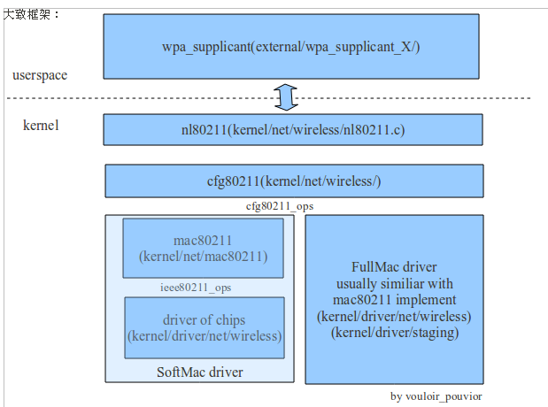

# Wireless Network 驱动框架

## 驱动框架整体


上图是MLME基于SoftMAC的基本框架，从用户空间到内核空间需要关注的几个点：

- 用户空间常用的应用程序

  - wireless-tools：走wext那老一套
    1. 编译后生成库：libiw.so
    2. 编译后生成应用程序：
       - iwlist
       - iwconfig
       - iwspy
       - iwpriv
       - ifrename
       - iwevnent
       - iwgetid
  - iw：走libnl新的一套
    1. 依赖libnl库
    2. 是iwconfig的替代者
    3. 编译生成应用程序
       - iw
  - wpa_supplicant：走libnl新的一套
    1. 依赖libnl库和libopenssl库
    2. 前面wireless-tools和iw工具都只能连接OPEN和WEP加密方式的WiFi，而wpa_supplicant除了以上两种加密方式，还支持WPA/WPA2加密方式的WiFi
    3. 编译后生成应用程序
       - wpa_cli wpa_supplicant
       - wpa_passphrase
  - hostapd：走libnl新的一套
    1. 依赖libopenssl和 libnl库
    2. 编译后生成应用程序
       - hostapd 
       - hostapd_cli
  - cfg80211tool：高通开发了基于nl80211的CFG80211工具，用于配置的专用命令，高通专用
  - wifitool：高通开发专用于QSDK，也是基于nl80211

- libnl是对Netlink的一个封装库，用用用户空间和内核空间消息数据交互

- nl80211: 用于对无线设备进行配置管理，往下对接cfg80211

- cfg80211:首先介绍下MLME

  MLME: 即MAC(Media Access Control ) Layer Management Entity，它管理物理层MAC状态机。

  实现MLME有两种方式：

  - SoftMAC：即MLME由软件实现，mac80211为SoftMAC实现提供了一个driver API，SoftMAC允许对硬件执行更好地控制，允许用软件实现对802.11的帧管理，包括解析和产生802.11无线帧。目前大多数802.11设备为SoftMAC，正如上图所示：MLME是SoftMAC实现，所以下面还要对接mac80211层，

    - mac80211: 是一个driver开发者可用于为SoftMAC无线设备写驱动的框架 (Kernel态)。

    

  - FullMAC：即MLME由硬件管理，当写FullMAC无线驱动时，不需要使用mac80211。这种方式使用比较少，如果是该种方式的话上cfg80211下面对接的就不是mac80211了，应该是FullMAC那一套东西，这里不做过多说明。如下图：二者大致框架的结构对比

    

总结：按照【用户空间（wpa_supplicant、iw、hostapd)】-》【nl80211】-》【cfg80211】-》【mac80211】路径一直到无线底层，中间都是:使用netlink接口消息机制进行通信，而wext那一套东西，现在基本已经被内核舍弃，不再更新，如果需要通过wext操作，则需要内核开启CONFIG_CFG80211_WEXT。

**注意**：上面介绍的libnl是基于netlink的开源库，OpenWrt 的开发者创建了一个libnl的缩小版libnl tiny。其中只包含genl，不包括rtnetlink或任何netfilter的东西，并编译成小于30K二进制大小。 你可以在这里找到它：https://dev.openwrt.org/browser/trunk/package/libs/libnl-tiny

## 用户空间应用程序

### wireless-tools下命令

#### iwlist

```bash
iwlist wlan0 scan[ning]					# 列出WiFi扫描结果
iwlist wlan0 freq[uency]/channel		# 列出当前地区可用频率
iwlist wlan0 rate/bit[rate]		 		# 列出支持的连接速度
iwlist wlan0 keys/enc[ryption]			# 列出所支持的加密密钥大小
iwlist wlan0 power						# 列出电源模式
iwlist wlan0 txpower					# 列出传输功耗
iwlist wlan0 retry						# 列出重连限制与次数
iwlist wlan0 ap/accesspoint/peers		# 列出热点信息
iwlist wlan0 event						# 列出设备支持的无线事件
iwlist wlan0 auth						# 列出当前设置的WPA认证参数
iwlist wlan0 wpa[keys]					# 列出设备中设置的所有WPA加密密钥
iwlist wlan0 genie						# 列出设置的通用信息元素
iwlist wlan0 modu[lation]				# 列出设备支持的调制和当前启用的调制
iwlist --version						# 列出版本信息
iwlist --help							# 列出帮助信息
```

#### iwconfig

```bash
iwconfig wlan0 freq 2422000000			设置频率
iwconfig wlan0 freq 2.422G				设置频率
iwconfig wlan0 channel 3				设置信道
iwconfig wlan0 channel auto				设置信道
iwconfig wlan0 modu 11g					强制设置调制方式
iwconfig wlan0 modu CCK OFDMa			强制设置调制方式
iwconfig wlan0 modu auto				强制设置调制方式
iwconfig wlan0 txpower 15				设置发射功率为15dBm
iwconfig wlan0 txpower 30mW				设置发射功率：dBm=30+log(W)
iwconfig wlan0 txpower auto				设置自动选择发射功率
iwconfig wlan0 txpower off				关闭发射单元
iwconfig wlan0 sens -80					负数为接收灵敏度下限，低则表信号差，网卡会采取措施
iwconfig wlan0 sens 2					正数表示百分比
iwconfig wlan0 retry 16					设置最大重传次数
iwconfig wlan0 retry lifetime 300m		设置最长重试时间，默认单位为秒
iwconfig wlan0 retry min limit 8		若支持自动模式，min和max指定上下限
iwconfig wlan0 rts 250					设置握手最小包的大小，等于最大值表禁止该机制
iwconfig wlan0 rts off					auto/off/fixed禁止RTS/CTS握手方式
iwconfig wlan0 frag 512					设置发送数据包的分片大小
iwconfig wlan0 frag off					auto/fixed/off允许Burst模式
iwconfig wlan0 power period 2			指定唤醒的周期，默认单位为秒
iwconfig wlan0 power 500m unicast		all/unicast/multicast指定允许唤醒的数据包类型
iwconfig wlan0 power timeout 300u all	all/unicast/multicast指定允许唤醒的数据包类型
iwconfig wlan0 power off				off/on参数指定是否允许电源管理
iwconfig wlan0 power min period 2 power max period 4 指定唤醒的周期

```

#### iwspy

todo

#### iwpriv

todo

#### ifrename

todo

#### iwevnent

todo

#### iwgetid

todo

### iw

```
iw --debug												使能netlink调试
iw --version											查看版本信息
iw help													显示帮助信息
iw event [-t] [-r] [-f]									监听内核事件
iw list/phy												列出设备性能
iw dev													列出无线硬件的所有网络接口
iw dev wlan0 scan										搜索周围WiFi信息
iw dev wlan0 link										获得连接状态
iw dev wlan0 info										显示接口信息
iw dev wlan0 station dump								列出所有STA信息
iw dev wlan0 connect wifi名称							连接至OPEN方式的AP
iw dev wlan0 connect wifi名称 2432						有同名热点AP时指定特定频段
iw dev wlan0 connect wifi名称 key 0:密码 d:1:默认密码	连接至WEP加密方式的AP
iw dev wlan0 disconnect									断开连接

```

### wpa_supplicant

#### wpa_supplicant  连接AP热点

前面iwlist、iwconfig属于wireless tools的程序，iw是iwconfig的替代者，都仅支持连接OPEN与WEP加密方式的WiFi；而wpa_supplicant支持在802.11规范中定义的各种安全连接和WPS。

```bash
wpa_supplicant -Dnl80211 -iwlan0 -c/etc/wpa_supplicant.conf -B
```

配置文件`/etc/wpa_supplicant.conf`内容参考

1. OPEN模式

   ```
   ctrl_interface=/var/run/wpa_supplicant
   
   network={
    ssid="WiFi-1"
    key_mgmt=NONE
   }
   
   ```

2. WEP模式

   ```
   ctrl_interface=/var/run/wpa_supplicant
   
   network={
    ssid="WiFi-1"
    key_mgmt=NONE
    wep_key0="abcde"
    wep_key1=0102030405
    wep_tx_keyidx=0
   }
   
   ```

   

3. WPA模式

   ```
   ctrl_interface=/var/run/wpa_supplicant
   
   network={
    ssid="WiFi-1"
    key_mgmt=WPA-PSK
    proto=WPA
    pairwise=TKIP
    group=TKIP
    psk="123123123"
   }
   
   ```

   

4. WPA2模式

   ```
   ctrl_interface=/var/run/wpa_supplicant
   
   network={
    ssid="WiFi-1"
    psk="123123123"
   }
   
   ```

   

#### wpa_cli wpa_supplicant的客户端

wpa_cli程序的运行需要依赖于wpa_supplicant的后台运行，属于服务器端和客户端的关系

```
wpa_cli help											打印帮助信息
wpa_cli -i wlan0 status									显示当前连接信息
wpa_cli -i wlan0 scan									搜索周围WiFi信息
wpa_cli -i wlan0 scan_result							显示上一次的搜索结果
wpa_cli -i wlan0 list_networks							显示已配置的网络与信息
wpa_cli -i wlan0 add_network							添加一个网络返回一个数字n
wpa_cli -i wlan0 set_network n ssid '"name"'			输入要连接的WiFi名称
wpa_cli -i wlan0 set_network n key_mgmt NONE			输入加密方式OPEN/WEP
wpa_cli -i wlan0 set_network n wep_key0 '"psk"'			输入加密方式WEP的密码
wpa_cli -i wlan0 set_network n psk '"psk"'				输入加密方式WPA/WPA2的密码
wpa_cli -i wlan0 enable_network n						设置后需要启用WiFi
wpa_cli -i wlan0 save_config							保存WiFi配置
wpa_cli -i wlan0 select_network n						有多个WiFi时选择其中一个
wpa_cli -i wlan0 reconfigure							重新加载配置文件
wpa_cli -i wlan0 disconnect								断开WiFi连接
wpa_cli -i wlan0 reconnect								重新连接
wpa_cli -i wlan0 remove_network n						移除WiFi配置
wpa_cli -i wlan0 terminate								关闭后台服务器程序
wpa_cli [-i wlan0]										进入交互模式，命令可以为status等

```


### hostapd

 #### hostapd 创建AP热点

```
hostapd /etc/myhostapd.conf -B
```

hostapd依赖于dhcpd后台运行给连接的设备动态分配IP地址，配置文件/etc/myhostapd.conf内容如下：

1. OPEN模式

   ```
   ctrl_interface=/var/run/hostapd
   #change wlan0 to your wireless device
   interface=wlan0
   driver=nl80211
   ssid=WiFi-1
   channel=1
   macaddr_acl=0
   auth_algs=1
   ignore_broadcast_ssid=0
   
   ```

   

2. WEP模式

   ```
   ctrl_interface=/var/run/hostapd
   #change wlan0 to your wireless device
   interface=wlan0
   driver=nl80211
   ssid=WiFi-1
   channel=1
   macaddr_acl=0
   auth_algs=2
   ignore_broadcast_ssid=0
   wep_key0="123123123"
   wep_default_key=0
   
   ```

   

3. WPA/WPA2模式

   ```
   ctrl_interface=/var/run/hostapd
   #change wlan0 to your wireless device
   interface=wlan0
   driver=nl80211
   ssid=WiFi-1
   channel=1
   macaddr_acl=0
   auth_algs=1
   ignore_broadcast_ssid=0
   wpa=3
   wpa_passphrase=123123123
   wpa_key_mgmt=WPA-PSK
   wpa_pairwise=TKIP
   rsn_pairwise=CCMP
   
   ```


#### hostapd_cl hostapd的客户端

```
hostapd_cli -h									显示帮助信息
hostapd_cli -v									显示版本信息
hostapd_cli -p <path>							指定socket的路径						
hostapd_cli -i wlan0 all_sta					显示所有连接设备
hostapd_cli -i wlan0 sta <addr>					查看某个设备信息
hostapd_cli -i wlan0 interface					显示网卡接口
hostapd_cli -i wlan0 interface [ifname]			指定网卡接口
hostapd_cli -i wlan0 get_config					获得配置
hostapd_cli -i wlan0 disassociate <addr>		断开某个设备的连接
hostapd_cli -i wlan0 level n					设置打印级别
hostapd_cli -i wlan0 license					显示证书
hostapd_cli [-i wlan0]							进入交互模式，命令可以为all_sta等

```

### 其它应用程序

#### 动态获取ip

1. udhcpc

   busybox自带的udhcpc工具

   ```
   udhcpc -i wlan0 -b
   ```

2. dhclient

   ```
   dhclient wlan0					获取IP地址
   dhclient -r						释放IP地址
   dhclient -s 192.168.1.123		从指定的服务器获取ip地址
   
   ```


#### 动态分配ip

1. udhcpd

   busybox自带的udhcpd工具（推荐)

   ```
   # 提示没有哪些文件就去给它创建
   touch /etc/udhcpd.leases
   udhcpd -f /etc/dhcpd.conf &
   
   ```

   配置文件/etc/dhcpd.conf内容如下：

   ```
   start 192.168.1.100
   end 192.168.1.199
   interface wlan0
   max_leases 32
   remaining yes
   auto_time 7200
   decline_time 3600
   conflict_time 3600
   offer_time 60
   min_lease 60
   pidfile /etc/dhcpd_wlan0_pid.txt
   lease_file /etc/udhcpd.leases
   opt dns 192.168.1.1
   opt subnet 255.255.255.0
   opt router 192.168.1.1
   opt wins 192.168.1.1
   opt domain local
   opt lease 3600
   
   ```

   

2. dhcpd

   ```
   touch /var/db/dhcpd.leases
   ifconfig wlan0 192.168.1.1
   dhcpd -cf /etc/dhcpd.conf wlan0
   
   ```

   其中，dhcpd.conf 添加内容实现分配IP范围：

   ```
   subnet 192.168.1.0 netmask 255.255.255.0 {                       
     range 192.168.1.10 192.168.1.100;                              
     option domain-name-servers 192.168.1.1;                        
     option routers 192.168.1.1;                                    
   }  
   
   ```

   


## 内核空间

### nl80211


### cfg80211


### mac80211


