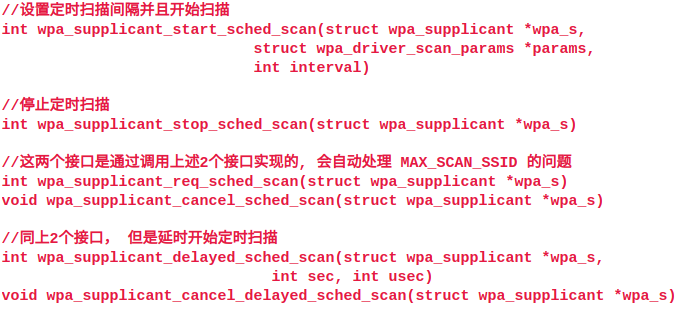
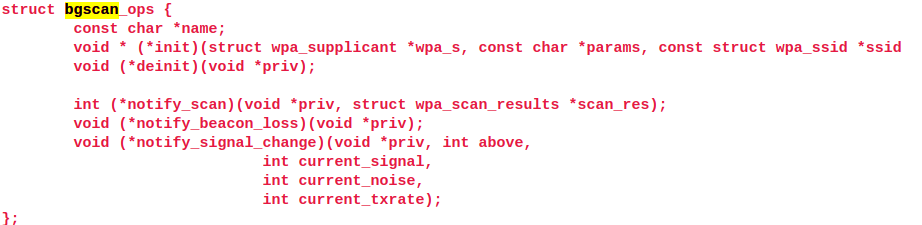
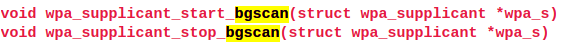
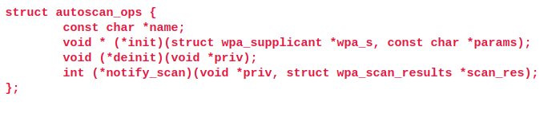
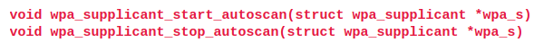
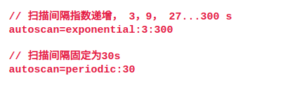

# wpa_supplicant 扫描方式简介

WPAS 中， 扫描任务由 `wpa_supplicant_scan()` 来完成，通过向 eloop 核心注册timeout事件，到期后触发 `wpa_supplicant_scan()`执行， 实现了定时扫描， 若循环触发定时扫描， 则还可以实现周期扫描。

WPAS 中有4个接口来控制 wpa_supplicant_scan 任务：

- `wpa_supplicant_update_scan_int()` 更新扫描间隔时间
- `wpa_supplicant_req_scan()` 开始调度扫描任务
- `wpa_supplicant_cancel_scan()` 停止调度扫描任务
- `wpas_scan_scheduled()` 扫描任务是否被调度

## WPAS 周期性扫描

- 扫描发起时机

  若当前未连接到AP， 且 WPAS 不处于DISCONNECTED的状态， 并且保存了未被disable的AP， 则WPAS会发起周期扫描。

  周期扫描的间隔时间存储在 `struct wpa_supplicant.scan_interval` 成员中，初始值为10秒
  可以通过 wpa_cli 的 `SCAN_INTERVAL`命令来设置间隔时间 

- 终止周期扫描

  在连接上AP后， 会停止周期扫描

## sched scan

如果wifi driver支持sched scan的话， WPAS可以使用sched scan来进行定时扫描。

sched scan 的扫描间隔存储在 `struct wpa_supplicant.sched_scan_interval` 中，默认值为10s
可以在wpa_supplicant.conf中使用 `sched_scan_interval` 项来配置

WPAS中的 sched scan 的接口为：



## background scan

当STA在ESS(有多个BSS)中移动时，在信号不好的情况下， 需要要从一个BSS漫游到另一个BSS，但是此时有没有完全断开，这个时候可以发出扫描请求，得到比较好信号的BSS，从而 为了增强漫游的无缝体验(在扫描过程中， STA不能收发数据帧)， STA可以采用background scan(定时扫描一小段时间， 或者空闲时才扫描)

### 函数接口

WPAS使用模块的形式来实现bgscan, 每一种bgscan的实现都需要实现如下的接口：



wpas使用如下的接口 来开启/停止bgscan



### 配置方式

wpas当前支持两种bgscan的实现，修改对应的网络配置接口：

```bash
network={

        scan_ssid=1
        ssid="STA0"
        key_mgmt=WPA-PSK FT-PSK
        psk="password"
        bgscan="simple:30:-45:300" # 新增内容
}
```

下面介绍配置方式说明

- bgscan simple : 需要配置编译选项 :`CONFIG_BGSCAN_SIMPLE`

  ```bash
  # 说明
  simple - Periodic background scans based on signal strength
  # 格式
  bgscan="simple:<short bgscan interval in seconds>:<signal strength threshold>:<long interval>"
  # 举例
  bgscan="simple:30:-45:300"
  ```

- bgscan learn : 需要配置编译选项 :`CONFIG_BGSCAN_LEARN`

  ```bash
  # 说明
  learn - Learn channels used by the network and try to avoid bgscans on other channels (experimental)
  # 格式
  bgscan="learn:<short bgscan interval in seconds>:<signal strength threshold>:<long interval>[:<database file name>]"
  # 举例
  bgscan="learn:30:-45:300:/etc/wpa_supplicant/network1.bgscan"
  ```

- 还可以禁能该功能

  ```bash
  bgscan=""
  ```

  

若打开了 bgscan， WPAS 在进入 COMPLETED 状态后开启 bgscan， 小于 ASSOCIATED 状态后， 关闭 bgscan，wifi roaming可以在WPAS中实现， 也可以在 wifi driver 或者 wifi firmware中实现，因此要根据需要来配置bgscan。

## autoscan

autoscan 类似于 bgscan， 但是 autoscan 是在 DISCNONECT 和 INACTIVE 状态下工作，WPAS 以模块的方式来实现autoscan。

### 函数接口

每一种autoscan的实现需要提供如下的接口：



WPAS使用如下的接口来 开启/停止 autoscan



### 配置方式

WPAS 当前支持2种autoscan的实现:

- exponential : 扫描间隔指数递增， 编译时需要打开 `CONFIG_AUTOSCAN_EXPONENTIAL`
- periodic : 扫描间隔固定， 编译时需要打开`CONFIG_AUTOSCAN_PERIODIC`

使用 autoscan 还需要在 wpa_supplicant.conf 中进行配置， 例如



若开启了autoscan， 则在进入 DISCONNECT 或者 INACTIVE 状态后， 开启 autoscan， 进入 AUTHENTICATING 状态后停止 autoscan