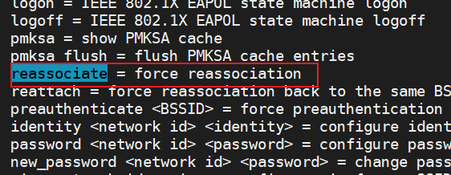

# wpa_supplicant reassociate过程分析

当我们执行下面的命令时候




```bash
wpa_cli -p /var/run/wpa_supplicant-ath2 -i ath2 reassociate

```

```c
char * wpa_supplicant_ctrl_iface_process(struct wpa_supplicant *wpa_s,
					 char *buf, size_t *resp_len)
{
    if (os_strcmp(buf, "REASSOCIATE") == 0) {
                wpas_request_connection(wpa_s);
    }
}
```

接下来分析`wpas_request_connection`函数

```c
void wpas_request_connection(struct wpa_supplicant *wpa_s)
{
	wpa_s->normal_scans = 0;
	wpa_s->scan_req = NORMAL_SCAN_REQ;
	wpa_supplicant_reinit_autoscan(wpa_s);
	wpa_s->extra_blacklist_count = 0;
	wpa_s->disconnected = 0;
	wpa_s->reassociate = 1;
	wpa_s->last_owe_group = 0;
    //这里如果不为1，说明需要扫描，因为太老了
	if (wpa_supplicant_fast_associate(wpa_s) != 1)
		wpa_supplicant_req_scan(wpa_s, 0, 0);
	else
		wpa_s->reattach = 0;
}
```

接下来分析`wpa_supplicant_fast_associate`函数

```c
int wpa_supplicant_fast_associate(struct wpa_supplicant *wpa_s)
{
	struct os_reltime now;

	wpa_s->ignore_post_flush_scan_res = 0;

	if (wpa_s->last_scan_res_used == 0)
		return -1;

	os_get_reltime(&now);
	if (os_reltime_expired(&now, &wpa_s->last_scan,
			       SCAN_RES_VALID_FOR_CONNECT)) { 
        // 默认5s 连接时机如果是在最新的一次扫描结果5s之后下发，就被认为是旧的扫描结果，不继续下发连接指令，也就是说扫描结果的有效性是5s。所以如果返回-1 就是结果太老了
		log_d("setp2:now=%ld.%ld  last=%ld.%ld diff=%ld\n",now.sec,now.usec,wpa_s->last_scan.sec,wpa_s->last_scan.usec,(now.sec*1000000+now.usec)-(wpa_s->last_scan.sec*1000000+wpa_s->last_scan.usec));
		wpa_printf(MSG_DEBUG, "Fast associate: Old scan results");
		return -1;
	}
	// 下面这个函数很熟悉了吧 直接就是选择个最好的roam漫游
	return wpas_select_network_from_last_scan(wpa_s, 0, 1);

}
```

