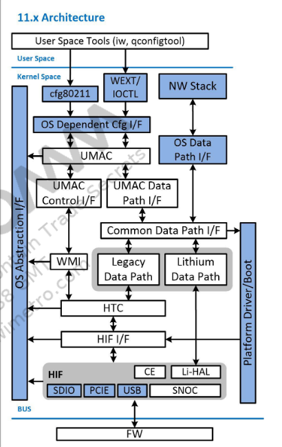
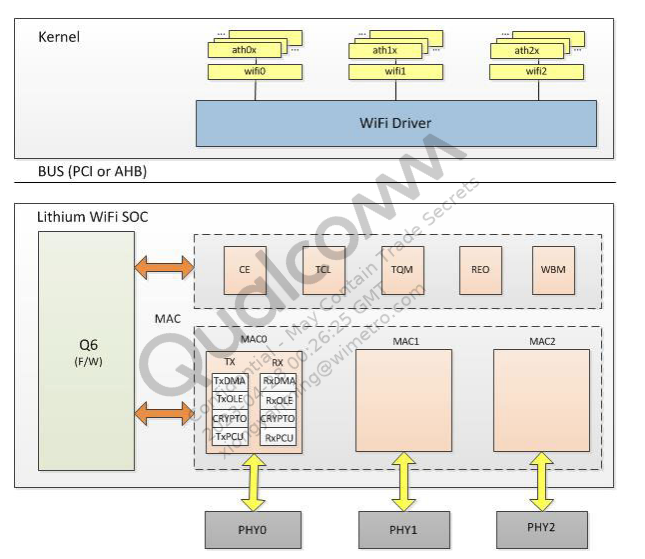
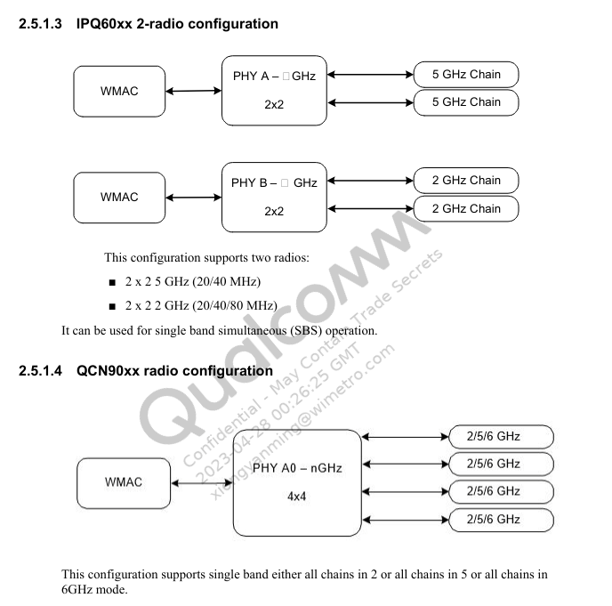
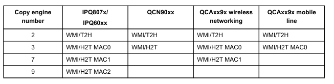

## qsdk 11.x 架构




## OS interface layer (OSIF)

## Universal MAC (UMAC)

UMAC协议层允许802.11状态机管理AP和clients

## Offload wrapper layer (OL)


# 初始化流程

```
 
	

ol_ath_pci_probe
ol_ath_ahb_probe
	ol_hif_open
		hif_open
			 hif_bus_open
				{
					switch (bus_type) {
					case QDF_BUS_TYPE_PCI:
						status = hif_initialize_pci_ops(hif_sc);
						break;
					case QDF_BUS_TYPE_IPCI:
						status = hif_initialize_ipci_ops(hif_sc);
						break;
					case QDF_BUS_TYPE_SNOC:
						status = hif_initialize_snoc_ops(&hif_sc->bus_ops);
						break;
					case QDF_BUS_TYPE_AHB:
						status = hif_initialize_ahb_ops(&hif_sc->bus_ops);
						break;
					case QDF_BUS_TYPE_SDIO:
						status = hif_initialize_sdio_ops(hif_sc);
						break;
					case QDF_BUS_TYPE_USB:
						status = hif_initialize_usb_ops(&hif_sc->bus_ops);
						break;
					default:
						status = QDF_STATUS_E_NOSUPPORT;
						break;
					}
					
					return hif_sc->bus_ops.hif_bus_open(hif_sc, bus_type);
				}
			hif_enable
				hif_enable_bus
				hif_hal_attach
				hif_bus_configure
				
	__ol_ath_attach	
	ol_ath_soc_attach
		wmi_handle = wmi_unified_attach(soc, &wmi_params)		


QDF_STATUS hif_initialize_pci_ops(struct hif_softc *hif_sc)
{
	bus_ops->hif_bus_open = &hif_pci_open;
	bus_ops->hif_bus_close = &hif_pci_close;
	bus_ops->hif_bus_prevent_linkdown = &hif_pci_prevent_linkdown;
	bus_ops->hif_reset_soc = &hif_pci_reset_soc;
	bus_ops->hif_bus_suspend = &hif_pci_bus_suspend;
	bus_ops->hif_bus_resume = &hif_pci_bus_resume;
	bus_ops->hif_bus_suspend_noirq = &hif_pci_bus_suspend_noirq;
	bus_ops->hif_bus_resume_noirq = &hif_pci_bus_resume_noirq;
	bus_ops->hif_bus_configure = &hif_pci_bus_configure;
}
	
	
int hif_pci_bus_configure(struct hif_softc *hif_sc)
{
	hif_wlan_enable
	hif_config_ce
	{
		hif_config_ce_by_id(scn, pipe_num)
			ce_init
			ce_tasklet_init
				tasklet_init(&hif_ce_state->tasklets[i].intr_tq,ce_tasklet,(unsigned long)&hif_ce_state->tasklets[i]);
			ce_register_irq
			init_tasklet_worker_by_ceid
	}
	hif_configure_irq

}
	
	


	
	
```


## 硬件映射





- Soc interface name

  Soc 设备的网络接口名字在驱动程序加载期间按照顺序分配。

  例如：`soc0 soc1 soc2`

- Radio interface name

  在驱动程序加载期间radio 设备网络接口名称在Soc 之间顺序分配。

  例如：`wifi0 wifi1 wifi2 wifi3 wifi4`

- VAP interface name

  VAP接口名称没有更改，与以前一样，由脚本在创建接口的时候在创建分配

- WMI interface

  每个pdev的WMI命令应该使用separate Copy engine and endpoint id。下表中给出了分配表

  WMI命令应使用不同的CE发送到固件。下表显示了CE到MAC的分配：

  


## wifi_3_0.ko

`if_ath_pci.c`

```c
static int __init init_ath_pci_3_0(void)
{
#ifdef ATH_AHB
    int pciret = 0, ahbret = 0;
    int init_ath_ahb_3_0(void);
#endif
    
    qdf_debug("WIFI3.0 Registration");
    /* If ahb not enabled then initialize offload ops for 3.0 */
    ol_if_register_wifi3_0();
    wmi_tlv_init();
    ce_service_srng_init();
    
    
#if QCA_NSS_WIFILI_OFFLOAD_SUPPORT
    osif_nss_register_module(OL_WIFI_3_0, &nss_wifili_soc_ops);
#endif
#ifdef ATH_AHB
    ahbret = init_ath_ahb_3_0();
    if(ahbret < 0 ) {
        qdf_info("ath_ahb: Error while registering ath wlan ahb driver");
    }
#endif

    qdf_info(KERN_INFO "%s : %s", dev_info, version);
}
module_init(init_ath_pci_3_0);
```

## qca_ol.ko

`qca_ol_module.c`

```c

static int __init qca_ol_mod_init(void)
{
    QDF_STATUS status;

    /* Create target interface global context */
    status = create_target_if_ctx();

    /* Register legacy WMI service ready event callback */
    if (status == QDF_STATUS_SUCCESS) {
        register_legacy_wmi_service_ready_callback();
    } else {
        qdf_print("%s Failed ",__func__);
    }

    /* Assign OL callback to tx ops registeration handler */
    wlan_global_lmac_if_set_txops_registration_cb(WLAN_DEV_OL, target_if_register_tx_ops);
    wlan_lmac_if_set_umac_txops_registration_cb(olif_register_umac_tx_ops);

    pld_init();

#ifdef QCA_NSS_WIFI_OFFLOAD_SUPPORT
    /* Initialize wifi mac database object */
    osif_nss_wifi_mac_db_obj_init();
#endif
	return 0;
}
module_init(qca_ol_mod_init);

```

