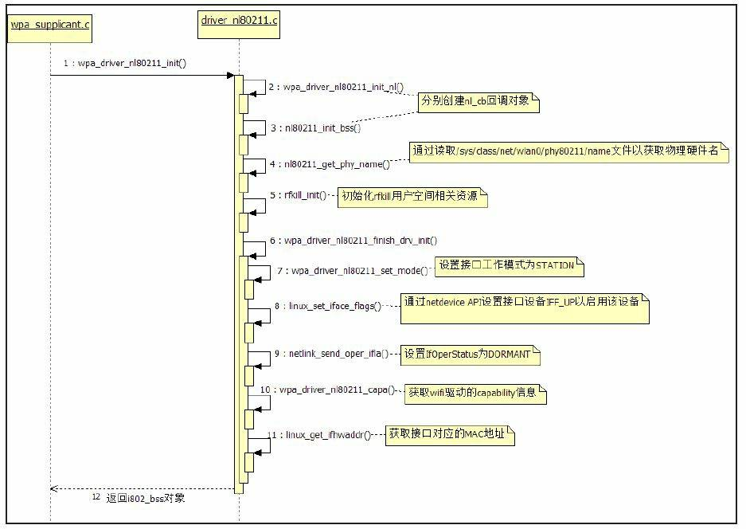

[TOC]

# wpa_supplicant

## 概述

1. `wpa_supplicant`是wifi客户端（client）加密认证工具，
2. 和`iwconfig`不同，`wpa_supplicant`支持wep、wpa、wpa2等完整的加密认证，而`iwconfig`只能支持wep。和`wpa_supplocant`相对应的，ap端的加密认证工具为`hostapd`。
3. `wpa_supplicant`运行于后台，它需要借助控制台工具`wpa_cli`来进行交互连接wifi

## 常用命令

### wpa_supplicant 命令

```bash
#wpa_supplicant --help
usage:
  wpa_supplicant [-BddhKLqqtuvW] [-P<pid file>] [-g<global ctrl>] \
        [-G<group>] \
        -i<ifname> -c<config file> [-C<ctrl>] [-D<driver>] [-p<driver_param>] \
        [-b<br_ifname>] [-e<entropy file>] \
        [-o<override driver>] [-O<override ctrl>] \
        [-N -i<ifname> -c<conf> [-C<ctrl>] [-D<driver>] \
        [-p<driver_param>] [-b<br_ifname>] [-I<config file>] ...]
 
drivers:
  nl80211 = Linux nl80211/cfg80211
  wext = Linux wireless extensions (generic)
  hostap = Host AP driver (Intersil Prism2/2.5/3)
  wired = Wired Ethernet driver
options:
  -b = optional bridge interface name
  -B = run daemon in the background
  -c = Configuration file
  -C = ctrl_interface parameter (only used if -c is not)
  -i = interface name
  -I = additional configuration file
  -d = increase debugging verbosity (-dd even more)
  -D = driver name (can be multiple drivers: nl80211,wext)
  -e = entropy file
  -g = global ctrl_interface
  -G = global ctrl_interface group
  -K = include keys (passwords, etc.) in debug output
  -t = include timestamp in debug messages
  -h = show this help text
  -L = show license (BSD)
  -o = override driver parameter for new interfaces
  -O = override ctrl_interface parameter for new interfaces
  -p = driver parameters
  -P = PID file
  -q = decrease debugging verbosity (-qq even less)
  -u = enable DBus control interface
  -v = show version
  -W = wait for a control interface monitor before starting
  -N = start describing new interface
 	
#example:
 
wpa_supplicant -Dnl80211 -iath0 -c /etc/wpa_supplicant.conf -B
```

### wpa_cli 命令

1. 扫描附近热点

   ```bash
   wpa_cli -p /var/run/wpa_supplicant-ath0 -i ath0 scan
   ```

   执行结果：

   

2. 显示上步扫描的ap热点的结果

   ```bash
   wpa_cli -p /var/run/wpa_supplicant-ath0 -i ath0 scan_result
   ```

   执行结果：

   

3. 当前网络状态

   ```bash
   wpa_cli -p /var/run/wpa_supplicant-ath0 -i ath0  status
   ```

   未连接ap时候执行结果：

   

   连接上ap后的执行结果

   

4. 添加一个网络，会返回networ id，比如下面的執行

   ```bash
   wpa_cli -p /var/run/wpa_supplicant-ath0 -i ath0 add_network
   ```

   执行结果：返回`<network id>`为1，下面要用

   

   当然对应的还有删除一个网络，如下

   ```
   wpa_cli -p /var/run/wpa_supplicant-ath0 -i ath0 remove_network 1 
   ```

   

5. 设置网络密码和加密方式

   下面統一的`<network id>`为1。下面三种加密方式选择一种即可，

      - open(开放式认证方式) 
   
          **注意**：ap360是无线的ssid号，外面是一对双引号，然后再外面是一对单引号
   
        上面只是不加密的设置方式，不同的加密方式命令如下：
   
        ```bash
        wpa_cli -p /var/run/wpa_supplicant-ath0  -i ath0 set_network 1 ssid '"ap360"' 
        wpa_cli -p /var/run/wpa_supplicant-ath0  -i ath0 set_network 1 key_mgmt NONE
        ```
   
         执行结果：
   
         
   
      - wep（分为开放式和共享式）:
   
        ```bash
          wpa_cli -p /var/run/wpa_supplicant-ath0  -i ath0 set_network 1 ssid '"ap360"'
        
        wpa_cli -p /var/run/wpa_supplicant-ath0  -i ath0 set_network 1 key_mgmt NONE
        
        wpa_cli -p /var/run/wpa_supplicant-ath0  -i ath0 set_network 1 wep_key0 '"wlan_key"'
        
        #如果是共享式,还需要配置,(默认是开放式，所以该项默认可以不配置)
        wpa_cli -p /var/run/wpa_supplicant-ath0  -i ath0 set_network 1 auth_alg SHARED
        ```
   
        
   
      - WPA/WPA2-Personal认证方式
   
        ```bash
          wpa_cli -p /var/run/wpa_supplicant-ath0  -i ath0 set_network 1 ssid '"ap360"'
        
        wpa_cli -p /var/run/wpa_supplicant-ath0  -i ath0 set_network 1 key_mgmt WPA-PSK
        
        wpa_cli -p /var/run/wpa_supplicant-ath0  -i ath0 set_network 1 proto WPA(WPA2)
        
        wpa_cli -p /var/run/wpa_supplicant-ath0  -i ath0 set_network 1 pairwise TKIP(CCMP)
        
        wpa_cli -p /var/run/wpa_supplicant-ath0  -i ath0 set_network 1 group TKIP(CCMP)
        
        wpa_cli -p /var/run/wpa_supplicant-ath0  -i ath0 set_network 1 psk '"wlan_password"'
        ```
   
        
   
      - WPA/WPA2-Enterprise认证方式
   
        ```bash
          wpa_cli -iwlan0 set_network 1 ssid '"ap360"'
        wpa_cli -iwlan0 set_network 1 key_mgmt WPA-EAP
        wpa_cli -iwlan0 set_network 1 pairwise TKIP(CCMP)
        wpa_cli -iwlan0 set_network 1 group TKIP(CCMP)
        wpa_cli -iwlan0 set_network 1 eap PEAP
        wpa_cli -iwlan0 set_network 1 identity '"username"'
        wpa_cli -iwlan0 set_network 1 password '"password"'
        #如果是WPA2-Enterprise认证：需要设置proto：
        wpa_cli -iwlan0 set_network 1 protoWPA2 
        ```
   
        

 

6. 设置优先级，可以不执行该步操作

   这个优先级是指如果sta添加了多个ap 那么优先连接哪个，优先级越大，sta优先连接

   ```bash
   wpa_cli -p /var/run/wpa_supplicant-ath0 -i ath0 set_network 1 priority  1   
   ```

7. 设置ssid默认为1即可  ,可以不加 有人说隐藏的ssid链接不上的时候可以设置下

   ```bash
   wpa_cli -p /var/run/wpa_supplicant-ath0 -i ath0 set_network 1 scan_ssid 1   
   ```

8. 启动`<network id>` 为1的网络

   ```bash
   wpa_cli -p /var/run/wpa_supplicant-ath0 -i ath0  enable_network 1
   ```

   执行结果：

   

   当然对应的也有禁能网络如下:

   ```bash
   wpa_cli -p /var/run/wpa_supplicant-ath0 -i ath0  disable_network 1 
   ```

   如果此时sta已经连接上网络id为1的ip，调用`disable_network`的时候，会断开这个链接。

9. 选择`<network id>` 为1的网络(这样做的好处在于,可以取消先前的其它网络连接)

   选择一个已经配置的AP进行连接，这个命令用的比较多

   ```bash
   wpa_cli -p /var/run/wpa_supplicant-ath0 -i ath0 select_network 1
   ```

   执行结果：

   

10. 保存上面的配置

    ```bash
    # 信息保存到默认的配置文件中
    wpa_cli -p /var/run/wpa_supplicant-ath0 -i ath0  save_config   
    
    ```

    

11. 自动获取ip，这一步可以不用要

    ```bash
    #请求自动分配IP地址,-b:后台(back) –i:指定接口 –q:获得续约后退出,如果想尽在前台运行,则去掉-b,加上-f
    udhcpc -b -i ath0 -q
    ```

    

12. 重新导入配置文件

    ```bash
    wpa_cli -p /var/run/wpa_supplicant-ath0 -i ath0 reconfigure
    ```

    

13. 其他命令

    - 列举保存过的连接

      ```bash
      wpa_cli -p /var/run/wpa_supplicant-ath0 -i ath0 list_networks
      ```

      

    - 断开连接

      ```bash
      wpa_cli -p /var/run/wpa_supplicant-ath0 -i ath0 disable_network <network id> 
      
      ```

      

    - ping 测试指令，看service端是否有响应

      ```bash
      wpa_cli -p /var/run/wpa_supplicant-ath0 -i ath0 ping
      
      ```

      

    - 其他未验证

      ```bash
      reassociate 设置连接标签，开启扫描，查找可用的AP进行连接，如果当前是连接状态，只会扫描一次。
      password 设置密码
      disconnect断开连接，并且会告知wpa_supplicant 不在连接其他AP
      reconnect重新连接，在运行上面的过程后，运行此命令
      reconfigure重新导入配置文件，可以在调试时，修改配置文件后运行此命令，使配置文件生效
      bss获取扫描结果 某一个热点的具体信息
      add_network添加一个AP配置，在framework还没调通之前，可以用此命令进行配置
      set_network 设置ap的属性，用set_network 不接参数，可以看到所有可用信息。
      select_network 选择一个已经配置的AP进行连接，这个命令用的比较多。上面set_n 命令进行配置后，可以用这命令进行连接
      enable_network将network 的标志位
      disable 置0，该位为1时，wifi在断开连接状态，不会去主动连接该热点。如果wifi不主动连接任何热点，可以查看配置文件。
      disable_network 对应上面disable_network network_id
      remove_network id 会删除对应network配置
      get_network 获取network的属性对应之前的set_network
      save_config 保存信息到配置文件中，每次修改配置后记得用
      ```

      


## wpa_supplicant代码分析


### epool工作原理分析

分析epool前需知select工作原理，参见[select机制](#select机制)。epool相对独立，所以本章节分析的时候不牵扯到wpa_s相关内容，只是着重介绍epool工作原理，和使用方法。

#### eloop.c::epool_init 函数

首先介紹全局变量`static struct eloop_data eloop`

```c
struct eloop_data {
	int max_sock;

	size_t count; /* sum of all table counts */
#ifdef CONFIG_ELOOP_POLL
	size_t max_pollfd_map; /* number of pollfds_map currently allocated */
	size_t max_poll_fds; /* number of pollfds currently allocated */
	struct pollfd *pollfds;
	struct pollfd **pollfds_map;
#endif /* CONFIG_ELOOP_POLL */
#if defined(CONFIG_ELOOP_EPOLL) || defined(CONFIG_ELOOP_KQUEUE)
	int max_fd;
	struct eloop_sock *fd_table;
#endif /* CONFIG_ELOOP_EPOLL || CONFIG_ELOOP_KQUEUE */
#ifdef CONFIG_ELOOP_EPOLL
	int epollfd;
	size_t epoll_max_event_num;
	struct epoll_event *epoll_events;
#endif /* CONFIG_ELOOP_EPOLL */
#ifdef CONFIG_ELOOP_KQUEUE
	int kqueuefd;
	size_t kqueue_nevents;
	struct kevent *kqueue_events;
#endif /* CONFIG_ELOOP_KQUEUE */
	struct eloop_sock_table readers; 	// 读事件表
	struct eloop_sock_table writers; 	// 写事件表
	struct eloop_sock_table exceptions;	// 异常事件表

/*    
*    结构体类型如下
*    struct eloop_sock_table {
*        size_t count;
*        struct eloop_sock *table;
*        eloop_event_type type;
*        int changed;
*	};
*/
	struct dl_list timeout;				// 超时事件链表

	size_t signal_count;				// 信号事件个数
	struct eloop_signal *signals;		// 信号事件表
	int signaled;
	int pending_terminate;

	int terminate;
};

static struct eloop_data eloop;
```

从事件角度来看，wpa_s 的事件驱动机制支持5种类型的event。

- read event：读事件，例如来自socket的可读事件。
- write event：写事件，例如socket的可写事件。
- exception event：异常事件，如果socket操作发生错误，则由错误事件处理。
- timeout event：定时事件，通过select的等待超时机制来实现定时事件。
- signal：信号事件，信号事件来源于Kernel。WPAS允许为一些特定信号设置处理函数。

下面是`eloop_init`函数原型

```c
int eloop_init(void)
{
	os_memset(&eloop, 0, sizeof(eloop));
	dl_list_init(&eloop.timeout);
#ifdef CONFIG_ELOOP_EPOLL
	eloop.epollfd = epoll_create1(0);
	if (eloop.epollfd < 0) {
		wpa_printf(MSG_ERROR, "%s: epoll_create1 failed. %s",
			   __func__, strerror(errno));
		return -1;
	}
#endif /* CONFIG_ELOOP_EPOLL */
#ifdef CONFIG_ELOOP_KQUEUE
	eloop.kqueuefd = kqueue();
	if (eloop.kqueuefd < 0) {
		wpa_printf(MSG_ERROR, "%s: kqueue failed: %s",
			   __func__, strerror(errno));
		return -1;
	}
#endif /* CONFIG_ELOOP_KQUEUE */
#if defined(CONFIG_ELOOP_EPOLL) || defined(CONFIG_ELOOP_KQUEUE)
	eloop.readers.type = EVENT_TYPE_READ;
	eloop.writers.type = EVENT_TYPE_WRITE;
	eloop.exceptions.type = EVENT_TYPE_EXCEPTION;
#endif /* CONFIG_ELOOP_EPOLL || CONFIG_ELOOP_KQUEUE */
#ifdef WPA_TRACE
	signal(SIGSEGV, eloop_sigsegv_handler);
#endif /* WPA_TRACE */
	return 0;
}
```

从代码中可以看到，主要就是对全局变量`static struct eloop_data eloop`进行赋值和初始化

#### eloop.h::API 函数

```c
/*
*  注册socket读事件处理函数，参数sock代表一个socket句柄。一旦该句柄上有读事件发生，则handler函数将被  *  事件处理循环（见下文eloop_run函数）调用
*/

int eloop_register_read_sock(int sock,
                             eloop_sock_handler handler,
							 void *eloop_data, 
                             void *user_data);
/*
* 注册socket事件处理函数，具体是哪种事件（只能是读、写或异常）由type参数决定
*	typedef enum {
*		EVENT_TYPE_READ = 0,
*		EVENT_TYPE_WRITE,
*		EVENT_TYPE_EXCEPTION
*	} eloop_event_type;
*/
int eloop_register_sock(int sock, 
                        eloop_event_type type,
						eloop_sock_handler handler,
                        void *eloop_data,
                        void *user_data);
/*
* 注册超时事件处理函数
*/
int eloop_register_timeout(unsigned int secs, 
                           unsigned int usecs,
						   eloop_timeout_handler handler,
                           void *eloop_data, void *user_data);

/*
* 注册信号事件处理函数，具体要处理的信号由sig参数指定
*/
int eloop_register_signal(int sig, 
                          eloop_signal_handler handler, 
                          void *user_data);
```

#### eloop.c::eloop_run 函数介绍

```c
void eloop_run(void)
{
	fd_set *rfds, *wfds, *efds; // fd_set是select中用到的一种参数类型
	struct timeval _tv;
	int res;
	struct os_time tv, now;
	// 事件驱动循环
	while (!eloop.terminate &&
	(!dl_list_empty(&eloop.timeout) || eloop.readers.count > 0 ||
	eloop.writers.count > 0 || eloop.exceptions.count > 0)) {
		struct eloop_timeout *timeout;
		// 判断是否有超时事件需要等待
		timeout = dl_list_first(&eloop.timeout, struct eloop_timeout,list);
		if (timeout) {
			os_get_time(&now);
			if (os_time_before(&now, &timeout->time))
			os_time_sub(&timeout->time, &now, &tv);
			else
			tv.sec = tv.usec = 0;
			_tv.tv_sec = tv.sec;
			_tv.tv_usec = tv.usec;
		}
		// 将外界设置的读事件添加到对应的fd_set中
		eloop_sock_table_set_fds(&eloop.readers, rfds);
		// ......设置写、异常事件到fd_set中
		// 调用select函数
		res = select(eloop.max_sock + 1, rfds, wfds, efds,timeout ? &_tv : NULL);
		if(res &lt; 0) {
			// ......错误处理
		}
		// 先处理信号事件
		eloop_process_pending_signals();
		// 判断是否有超时事件发生
		timeout = dl_list_first(&eloop.timeout, struct eloop_timeout,list);
		if (timeout) {
			os_get_time(&now);
			if (!os_time_before(&now, &timeout->time)) {
				void *eloop_data = timeout->eloop_data;
				void *user_data = timeout->user_data;
				eloop_timeout_handler handler = timeout->handler;
				eloop_remove_timeout(timeout); // 注意，超时事件只执行一次
				handler(eloop_data, user_data); // 处理超时事件
			}
		}
		// ......处理读/写/异常事件。方法和下面这个函数类似
		eloop_sock_table_dispatch(&eloop.readers, rfds);
		//...... 处理wfds和efds
	}
	out:
	return;
}
```

### 启动wpa_supplicant后台程序后会干哪些事情

当我们启动`wpa_supplicant` 后台守护进程的时候使用命令如下，

```bash
wpa_supplicant -g /var/run/wpa_supplicantglobal  -P /var/run/wpa_supplicant-global.pid -B
```

那么应用程序main函数干了些什么事情呢？往下分析。

#### main函数分析


如上图所示：大致功能就是解析`wpa_supplicant -g /var/run/wpa_supplicantglobal  -P /var/run/wpa_supplicant-global.pid -B`参数 并调用

`global = wpa_supplicant_init(&params);`创建一个全局的`global`，接下来重点分析`wpa_supplicant_init`函数。

#### wpa_supplicant_init函数分析

`wpa_supplicant.c::wpa_supplicant_init`函数内容如下：


总结如下：


- 说明1：

  

  如上图所示：

  `wpa_debug.c`中有两个全局函数指针

  - wpa_msg_cb：通过wpa_msg_register_cb来注册

    用法举例：

    ```
    wpa_supplicant_global_ctrl_iface_init
    		wpa_msg_register_cb(wpa_supplicant_ctrl_iface_msg_cb);
    			wpa_msg_cb = wpa_supplicant_ctrl_iface_msg_cb; // 全局指针赋值
    
    //当别的函数调用wpa_debug.c::wpa_msg时候，会调用wpa_msg_cb(……)
    scan.c::wpas_trigger_scan_cb(struct wpa_radio_work *work, int deinit)
    	wpa_msg(wpa_s, MSG_INFO, WPA_EVENT_SCAN_FAILED "ret=-1");
            wpa_msg_cb(ctx, level, WPA_MSG_PER_INTERFACE, buf, len);
                wpa_supplicant_ctrl_iface_msg_cb(……)
    
    所以最终还是要看
    wpa_supplicant_ctrl_iface_msg_cb函数干了什么
    ```

    

  - `wpa_msg_ifname_cb`：通过wpa_msg_register_ifname_cb来注册

    用法举例

    ```
    wpa_supplicant_init
    	wpa_msg_register_ifname_cb(wpa_supplicant_msg_ifname_cb);
    		wpa_msg_ifname_cb=wpa_supplicant_msg_ifname_cb
    
    //当别的函数调用wpa_debug.c::wpa_msg时候，会调用wpa_msg_cb(……)
    scan.c::wpas_trigger_scan_cb(struct wpa_radio_work *work, int deinit)
    	wpa_msg(wpa_s, MSG_INFO, WPA_EVENT_SCAN_FAILED "ret=-1");
            const char *ifname = wpa_msg_ifname_cb(ctx); 
            等价于
            const char *ifname=wpa_supplicant_msg_ifname_cb(ctx)
            也就是获取ifname
    ```

    

- 说明2：

  该函数本身非常简单，它主要根据编译时的配置项来初始化不同的eap方法

  ```
  int eap_register_methods(void)
  {
  	int ret = 0;
  	#ifdef EAP_MD5 // 作为supplicant端，编译时将定义EAP_MD5
  	if (ret == 0)
  	ret = eap_peer_md5_register();
  	#endif /* EAP_MD5 */
  	......
  	#ifdef EAP_SERVER_MD5 // 作为Authenticator端，编译时将定义EAP_SERVER_MD5
  	if (ret == 0)
  	ret = eap_server_md5_register();
  	#endif /* EAP_SERVER_MD5 */
  	......
  	return ret;
  }
  ```

  

- 说明3

  如下图所示：这里重点根据配置`-g /var/run/wpa_supplicantglobal`选项，创建一个sockt接口，通过eloop接管，注册`wpa_supplicant_global_ctrl_iface_receive`回调函数，也就是，只要wpa_cli 发送命令到`wpa_supplicant`, 处理命令的函数即是`wpa_supplicant_global_ctrl_iface_receive`

  

  

- 说明4：

  主要是dbus相关，暂时不做说明

- 说明5：

  `wpa_drivers[]`是一个全局数组变量，它通过`extern`方式声明于`main.c`中，其定义却在`drivers.c`中，如下所示:`drivers.c::wpa_drivers`

  ```c
  const struct wpa_driver_ops *const wpa_drivers[] =
  {
  #ifdef CONFIG_DRIVER_NL80211
  	&wpa_driver_nl80211_ops,
  #endif /* CONFIG_DRIVER_NL80211 */
  #ifdef CONFIG_DRIVER_MACSEC_QCA
  	&wpa_driver_macsec_qca_ops,
  #endif /* CONFIG_DRIVER_MACSEC_QCA */
  }
  ```
  
`wpa_drivers`数组成员指向一个`wpa_driver_ops`类型的对象。wpa_driver_ops是driver i/f模块的核心数据结构，其内部定义了很多函数指针。而正是通过定义函数指针的方法，wpa_s能够隔离上层使用者和具体的【driver】，这里的driver并不是内核驱动而是属于应用层的东西，类似wpa_s、【driver】、内核驱动间的一层封装，还是属于用户态。
  
下面这个是`driver_nl80211.c::wpa_driver_nl80211_ops`的部分定义：
  
```c
  const struct wpa_driver_ops wpa_driver_nl80211_ops = {
  	.name = "nl80211", // driver wrapper的名称
  	.desc = "Linux nl80211/cfg80211", // 描述信息
  	.get_bssid = wpa_driver_nl80211_get_bssid, // 用于获取bssid
  	
  	.scan2 = wpa_driver_nl80211_scan, // 扫描函数
  	
  	.get_scan_results2 = wpa_driver_nl80211_get_scan_results,
  	// 获取扫描结果
  	
  	.disassociate = wpa_driver_nl80211_disassociate, // 触发disassociation操作
  	.authenticate = wpa_driver_nl80211_authenticate, // 触发authentication操作
  	.associate = wpa_driver_nl80211_associate, // 触发association操作
  	// driver wrapper全局初始化函数，该函数的返回值保存在wpa_global成员变量drv_pri数组中
  	.global_init = nl80211_global_init,
  	
  	.init2 = wpa_driver_nl80211_init, // driver wrapper初始化函数
  	
  	#ifdef ANDROID // Android平台定义了该宏
  	.driver_cmd = wpa_driver_nl80211_driver_cmd,// 该函数用于处理和具体驱动相关的命令
  	#endif
  };
  ```
  

  
- 说明6

  这里仅仅分配一段函数指针空间，并没有初始化内容

  
  
  


==从上面的分析可知：==

> 所有的`wpa_cli`命令会跑到`wpa_supplicant_global_ctrl_iface_receive`函数中处理。


### 执行wpa_cli  interface_add 接口后后台程序会干哪些事情

启动后台程序后，我们需要添加`interface`接口，命令如下：

```bash
wpa_cli -g /var/run/wpa_supplicantglobal interface_add ath0 /var/run/wpa_supplicant-ath0.conf nl80211 /var/run/wpa_supplicant-ath0 ""

wpa_cli -g /var/run/wpa_supplicantglobal interface_add ath2 /var/run/wpa_supplicant-ath2.conf nl80211 /var/run/wpa_supplicant-ath2 ""
```

wpa_cli的`interface_add` 命令格式如下：

```bash
interface_add 
	- <ifname> 			# 类似于ath0接口
	- <confname>		# 配置文件
	- <driver> 			# 驱动类型，例如 nl80211
	- <ctrl_interface>  # 控制接口 例如 /var/run/wpa_supplicant-ath0
	- <driver_param>	# todo 没有用过
	- <bridge_name> 	# todo 没有用过
	- <create> 			# todo 没有用过
	- <type> 			# sta 或者 ap 

#adds new interface, all parameters but<ifname> are optional. Supported types are station ('sta') and AP ('ap')
```

上面提到，后台处理wpa_cli的命令函数是`wpa_supplicant_global_ctrl_iface_receive`，接下来看后台如何处理`interface_add`命令。


如上图所示，最终调用到了`wpa_supplicant_global_iface_add`函数。接下来分析该函数。

### wpa_supplicant_add_iface函数分析

`wpa_supplicant.c::wpa_supplicant_add_iface`函数如下：


通过上面分析可知，

- 会创建一个`wpa_s` 且加入`global->ifaces`链表，最终效果如下：

  ```c
  /*
  *   插入前
  *    wpa_s       wpa_s      global
  *  |-------| 	|-------|	|-------|
  *  | next  |->  | next  |-> | ifaces|--|
  *  |-------| 	|-------|	|-------|  |
  *     ^                                |
  *     |________________________________|
  *  
  *  插入后
  *    新的
  *    wpa_s       wpa_s       wpa_s      global
  *  |-------| 	|-------|	|-------|	|-------|
  *  | next  |->  | next  |-> | next  |-> | ifaces|--|
  *  |-------| 	|-------|	|-------|	|-------|  |
  *     ^                                            |
  *     |____________________________________________|
  */
  ```

  

- 还有一个重要函数`wpa_supplicant_init_iface`

  该函数在[下个章节介绍](#wpa_supplicant_init_iface 函数分析)

- 三个重要结构体

  1. `struct wpa_supplicant`

     

     1. `drv_priv`和`global_drv_priv`：WPAS为driver wrapper一共定义了两个上下文信息。这是因为driver i/f接口定义了两个初始化函数（以nl80211 driver为例，它们分别是global_init和init2）。其中，global_init返回值为driver wrapper全局上下文信息，它将保存在wpa_global的drv_priv数组中（见图4-7）。每个wpa_supplicant都对应有一个driver wrapper对象，故它也需要保存对应的全局上下文信息。init2返回值则是driver wrapper上下文信息，它保存在wpa_supplicant的driv_priv中。

     2. `current_bss`：该变量类型为wpa_bss。wpa_bss是无线网络在wpa_supplicant中的代表。wpa_bss中的成员主要描述了无线网络的bssid、ssid、频率（freq，以MHz为单位）、Beacon心跳时间（以TU为单位）、capability信息、信号强度等。wpa_bss的作用很重要，不过其数据结构相对比较简单，此处不介绍。以后用到它时再来介绍。

     3. `sched_scan_timeout`：该变量和计划扫描（scheduled scan）功能有关。计划扫描即定时扫描，需要Kernel（版本必须大于3.0）的Wi-Fi驱动支持。启用该功能时，需要为驱动设置定时扫描的间隔（以毫秒为单位）。

     4. `bgscan`：该变量和后台扫描及漫游（background scan and roaming）技术有关。当STA在ESS（假设该ESS由多个AP共同构成）中移动时，有时候因为信号不好（例如STA离之前所关联的AP距离过远等），它需要切换到另外一个距离更近（即信号更好）的AP。这个切换AP的工作就是所谓的漫游。为了增强切换AP时的无缝体验（扫描过程中，STA不能收发数据帧。从用户角度来看，相当于网络不能使用），STA可采用background scan（定时扫描一小段时间或者当网络空闲时才扫描，这样可减少对用户正常使用的干扰）技术来监视周围AP的信号强度等信息。一旦之前使用的AP信号强度低于某个阈值，STA则可快速切换到某个信号更强的AP。除了background scan外，还有一种on-roam scan也能提升AP切换时的无缝体验。关于background scan和roaming。

     5. `gas`：该变量是GAS（Generic Advertisement Service，通用广告服务）的小写，和802.11u协议有关。该协议规定了不同网络间互操作的标准，其制定的初衷是希望Wi-Fi网络能够像运营商的蜂窝网络一样，方便终端设备接入。例如，人们用智能手机可搜索到数十个、甚至上百个无线网络。在这种情况下如何选择正确的无线网络呢？802.11u协议使用GAS和ANQP（AccessNetwork Query Protocol，接入网络查询协议）来帮助设备自动选择合适的无线网络。其中，GAS是MLME SAP中的一种，它使得STA在通过认证前（prior to authentication）就可以向AP发送和接收ANQP数据包。STA则使用ANQP协议向AP查询无线网络运营商的信息，然后STA根据这些信息来判断自己可以加入哪一个运营商的无线网络（例如中国移动手机卡用户可以连接中国移动架设的无线网络）。802.11u现在还不是特别完善。

     6. `CONFIG_SME`：该变量是一个编译宏，用于设置WPAS是否支持SME

     7. wpa_states的取值

        - `WPA_DISCONNECTED`：表示当前未连接到任何无线网络。

        - `WPA_INTERFACE_DISABLED`：代表当前此wpa_supplicant所使用的网络设备被禁

        - `WPA_INACTIVE`：代表当前此wpa_supplicant没有可连接的无线网络。这种情况包括周围没有无线网络，以及有无线网络，但是因为没有配置信息（如没有设置密码等）而不能发起认证及关联请求的情况。

        - `WPA_SCANNING`、`WPA_AUTHENTICATING`、`WPA_ASSOCIATING`：分别表示当前wpa_supplicant正处于扫描无线网络、身份验证、关联过程中。

        - `WPA_ASSOCIATED`：表明此wpa_supplicant成功关联到某个AP。

        - `WPA_4WAY_HANDSHAKE`：表明此wpa_supplicant处于四次握手处理过程中。当使用PSK（

          （即WPA/WPA2-Personal）策略时，STA收到第一个EAPOL-Key数据包则进入此状态。当使用

          WPA/WPA2-Enterprise方法时，当STA完成和RAIDUS身份验证后则进入此状态。

        - WPA_GROUP_HANDSHAKE：表明STA处于组密钥握手协议处理过程中。当STA完成四次握手协议并收到组播密钥交换第一帧数据后即进入此状态（或者四次握手协议中携带了GTK信息，也会进入此状态）。

        - WPA_COMPLETED：所有认证过程完成，wpa_supplicant正式加入某个无线网络。

  2. `struct wpa_interface``

  3. ``struct wpa_ssid`

     wpa_ssid用于存储某个无线网络的配置信息（如所支持的安全类型、优先级等），其实就是配置文件`wpa_supplicant.conf`无线网络配置项在代码中的反映

     

     重要成员变量分析

     1. 安全相关

        - `passphrase`：该变量只和WPA/WPA2-PSK模式有关，用于存储我们输入的字符串密码。而实际上，规范要求使用的却是上图中的psk变量。用户一般只设置字符串形式的password，而WPAS将根据它和ssid进行一定的计算以得到最终使用的PSK。具体可参考PSK算法相关知识

        - `pairwise_cipher`和`group_cipher`：这两个变量和规范中的cipher suite（加密套件）定义有关。cipher suite用于指明数据收发两方使用的数据加密方法。pairwise_cipher和group_cipher分别代表为该无线网络设置的单播和组播数据加密方法。标准说明请参考无线协议相关资料。

          WPAS中的定义如下：

          ```c
          // 位于defs.h中
          #define WPA_CIPHER_NONE BIT(0) // 不保护。BIT(N)是一个宏，代表1左移N位后的值
          #define WPA_CIPHER_WEP40 BIT(1) // WEP40（即5个ASCII字符密码）
          #define WPA_CIPHER_WEP104 BIT(2) // WEP104（即13个ASCII字符密码）
          #define WPA_CIPHER_TKIP BIT(3) // TKIP
          #define WPA_CIPHER_CCMP BIT(4) // CCMP
          // 系统还定义了两个宏用于表示默认支持的加密套件类型：（位于config_ssid.h中）
          #define DEFAULT_PAIRWISE (WPA_CIPHER_CCMP | WPA_CIPHER_TKIP)
          #define DEFAULT_GROUP (WPA_CIPHER_CCMP | WPA_CIPHER_TKIP | \
          WPA_CIPHER_WEP104 | WPA_CIPHER_WEP40)
          ```

          

        - `key_mgmt`：该成员和802.11中的AKM suite相关。AKM（Authentication and Key Managment，身份验证和密钥管理）suite定义了一套算法用于在Supplicant和Authenticator之间交换身份和密匙信息。

          WPAS中定义的key_mgmt可取值如下：

          ```c
          // 位于defs.h中
          #define WPA_KEY_MGMT_IEEE8021X BIT(0) // 不同的AKM suite有对应的流程与算法。不详细介绍
          #define WPA_KEY_MGMT_PSK BIT(1)
          #define WPA_KEY_MGMT_NONE BIT(2)
          #define WPA_KEY_MGMT_IEEE8021X_NO_WPA BIT(3)
          #define WPA_KEY_MGMT_WPA_NONE BIT(4)
          #define WPA_KEY_MGMT_FT_IEEE8021X BIT(5) // FT（Fast Transition）用于ESS中快速切换BSS
          #define WPA_KEY_MGMT_FT_PSK BIT(6)
          #define WPA_KEY_MGMT_IEEE8021X_SHA256 BIT(7) // SHA256表示key派生时使用SHA256做算法
          #define WPA_KEY_MGMT_PSK_SHA256 BIT(8)
          #define WPA_KEY_MGMT_WPS BIT(9)
          // 位于config_ssid.h中
          #define DEFAULT_KEY_MGMT (WPA_KEY_MGMT_PSK | WPA_KEY_MGMT_IEEE8021X)
          // 默认的AKM suite
          ```

          

        - `proto`：代表该无线网络支持的安全协议类型。其可取值如下：

          ```c
          // 位于defs.h中
          #define WPA_PROTO_WPA BIT(0)
          #define WPA_PROTO_RSN BIT(1) // RSN其实就是WPA2
          // 位于config_ssid.h中
          #define DEFAULT_PROTO (WPA_PROTO_WPA | WPA_PROTO_RSN) // 默认支持两种协议
          ```

          

        - `auth_alg`：表示该无线网络所支持的身份验证算法，其可取值如下：

          ```c
          // 位于defs.h中
          #define WPA_AUTH_ALG_OPEN BIT(0) // Open System，如果要使用WPA或RSN，必须选择它
          #define WPA_AUTH_ALG_SHARED BIT(1) // Shared Key算法
          #define WPA_AUTH_ALG_LEAP BIT(2) // LEAP算法，LEAP是思科公司提出的身份验证方法
          #define WPA_AUTH_ALG_FT BIT(3) // 和FT有关，此处不详细介绍，读者可阅读参考资料[6]
          ```

          

        - `eapol_flags`：和动态WEP Key有关 其取值如下：

          ```
          // 位于config_ssid.h中
          #define EAPOL_FLAG_REQUIRE_KEY_UNICAST BIT(0)
          #define EAPOL_FLAG_REQUIRE_KEY_BROADCAST BIT(1)
          ```

        上述变量的取值将影响wpa_supplicant的处理逻辑。

  4. 其他变量

     - `proactive_key_caching`：该变量和OPC（Opportunistic PMK Caching）技术有关。该技术虽还未正式被标准所接受，但很多无线设备厂商都支持它。其背景情况是，一组AP和一个中心控制器（central controller）共同组建一个所谓的mobility zone（移动区域）。zone中的所有AP都连接到此控制器上。当STA通过zone中的某一个AP（假设是AP_0）加入到无线网络后，STA和AP0完成802.1X身份验证时所创建的PMKSA（假设是PMKSA_0）将由controller发送到zone中的其他AP。其他AP将根据此PMSKA_0来生成PMKSA_i。当STA切换到zone中的AP_i时，它将根据PMKSA_0计算PMKID_i），并试图和AP_i重新关联（Reassociation）。如果此AP_i属于同一个zone，因为之前它已经由controller发送的PMKSA_0计算出了PMKSA_i，所以STA可避过802.1X认证流程而直接进入后续的处理流程。802.1X验证的目的就是得到PMKSA，所以，如果AP_i已经有PMKSA_i，就无须费时费力开展802.1X认证工作了。proactive_key_caching默认值为0，即不支持此功能。另外，OPC功能需要AP支持。
     - `disable`：该变量取值为0（代表该无线网络可用）、1（代表该无线网络被禁止使用，但可通过命令来启用它）、2（表示该无线网络和P2P有关）。
     - `mode`：wpa_ssid结构体内部还定义了一个枚举型变量，此处要特别指出的是，基础结构型网络中，如果STA和某个AP成功连接的话，STA也称为Managed STA（对应枚举值为WPAS_MODE_INFRA）。

#### wpa_supplicant_init_iface 函数分析

该函数比较复杂，故而分开分析

#### 代码片段1

```c
static int wpa_supplicant_init_iface(struct wpa_supplicant *wpa_s,
struct wpa_interface *iface)
{
	const char *ifname, *driver;
	struct wpa_driver_capa capa;
    // wpa_s->confname 指向用户自己设置的wpa_supplicant.conf文件
	if (iface->confname) {
		// ......CONFIG_BACKEND_FILE处理，此宏指明WPAS使用的配置项信息来源于文件
		// Android定义了它
		wpa_s->conf = wpa_config_read(wpa_s->confname);
	}
//......
```

分析如下：

`wpa_config_read`函数负责把` /var/run/wpa_supplicant-ath2.conf`配置文件解析，

这个参数是执行下面的命令的时候添加了

```bash
wpa_cli -g /var/run/wpa_supplicantglobal interface_add ath2 /var/run/wpa_supplicant-ath2.conf nl80211 /var/run/wpa_supplicant-ath2 ""

```


```c
struct wpa_config * wpa_config_read(const char *name)
{
	FILE *f;
	char buf[256], *pos;
	int errors = 0, line = 0;
	struct wpa_ssid *ssid, *tail = NULL, *head = NULL;
	struct wpa_config *config; // 配置文件在代码中对应的数据结构
	int id = 0;
	config = wpa_config_alloc_empty(NULL, NULL);
	//......
	f = fopen(name, "r");
	//......
	while (wpa_config_get_line(buf, sizeof(buf), f, &line, &pos)) {
	if (os_strcmp(pos, "network={") == 0) {
			// 读取配置文件中的network项，并将其转化成一个wpa_ssid类型的对象
			ssid = wpa_config_read_network(f, &line, id++);
			//......
			// wpa_ssid通过next成员变量构成了一个单向链表
			if (head == NULL) { head = tail = ssid;}
			else { tail->next = ssid; tail = ssid;}
			// network项属于配置文件的一部分，故wpa_ssid对象也包含在wpa_config对象中
			if (wpa_config_add_prio_network(config, ssid)) {}
			//......
            // CONFIG_NO_CONFIG_BLOBS，blob是配置文件中的一个字段，用于存储有些身
			// 份认证算法需要用的证书之类的信息。本例没有使用blob配置项
			// 解析其他项
		} else if (wpa_config_process_global(config, pos, line) < 0) {}
	}
	fclose(f);
	config->ssid = head;
	//......
	return config;
}
```

`wpa_config`和`wpa_ssid`这两个数据结构都是配置文件中的信息在代码中的反映。读者可查看`wpa_supplicant.conf`配置模板文件来了解各个配置项的含义。

#### 代码片段2

```c
//......
// 接wpa_supplicant_init_iface代码段一
if (os_strlen(iface->ifname) >= sizeof(wpa_s->ifname)) {}
// 将wpa_interface中的ifname复制到wpa_supplicant的ifname变量中
	os_strlcpy(wpa_s->ifname, iface->ifname, sizeof(wpa_s->ifname));
//......
// 下面这两个函数和EAPOL状态机相关
eapol_sm_notify_portEnabled(wpa_s->eapol, FALSE);
eapol_sm_notify_portValid(wpa_s->eapol, FALSE);
driver = iface->driver;
next_driver:
if (wpa_supplicant_set_driver(wpa_s, driver) < 0) return -1;
```

`wpa_supplicant_set_driver`将根据driver wrapper名（本例是"nl80211"）找到wpa_driver数组中nl80211指定的driver wrapper对象`wpa_driver_nl80211_ops`，然后调用其`global_init`函数。直接来看`global_init`函数的实现。

1. `global_init`函数分析

   `global_init`是wpa_driver_ops结构体中的一个类型为函数指针的成员变量。nl80211对应的
   driver wrapper将其设置为`nl80211_global_init`，代码如下所示:

   `driver_nl80211.c::nl80211_global_init`

   ```c
   static void * nl80211_global_init(void)
   {
   	struct nl80211_global *global;
   	struct netlink_config *cfg;
   	global = os_zalloc(sizeof(*global));
   	global->ioctl_sock = -1;
   	dl_list_init(&global->interfaces);
   	global->if_add_ifindex = -1;
   	cfg = os_zalloc(sizeof(*cfg));
   	//......
   	cfg->ctx = global;
   	/*
   	下面这三条语句用于创建 netlink socket 来接收来自内核的网卡状态变化事件（如UP、DORMANT、
   	REMOVED），然后通过 eloop_register_read_sock 注册一个 netlink_recv 函数用于处理接收
   	到的socket消息。
   	netlink_recv函数内部将根据消息的类别来调用newlink_cb和dellink_cb以处理网卡状态变
   	化事件。这两个回调函数处理比较简单，读者可在阅读完本章后再自行研究它们。
   	*/
   	cfg->newlink_cb = wpa_driver_nl80211_event_rtm_newlink;
   	cfg->dellink_cb = wpa_driver_nl80211_event_rtm_dellink;
   	global->netlink = netlink_init(cfg);
   	// 将加入netlink中AF_NETLINK协议中的RTMGRP_LINK组播组
   	//......
   	// nl80211利用netlink机制和wlan driver交互
   	if (wpa_driver_nl80211_init_nl_global(global) < 0) 
           //..... 错误处理
           
   	global->ioctl_sock = socket(PF_INET, SOCK_DGRAM, 0);
   	//......
   	return global;
   }
   ```

   该部分代码主要工作如下：

   - 创建一个和内核通信的sockt，用来监听网卡的状态事件，
   - 然后通过eloop机制注册`netlink_recv`函数处理内核上报的socket消息，
   - 当netlink_recv接收消息后根据消息类型，调用newlink_cb和dellink_cb处理网卡状态变迁的事件。

   该段代码有个重要结构体`struct nl80211_global` 内容如下：

   ```c
   struct nl80211_global {
   	void *ctx;
   	struct dl_list interfaces;
   	int if_add_ifindex;
   	u64 if_add_wdevid;
   	int if_add_wdevid_set;
   	struct netlink_data *netlink;
   	struct nl_cb *nl_cb;
   	struct nl_sock *nl;	// 该变量比较重要用于发送netlink消息
   	int nl80211_id;
   	int ioctl_sock; /* socket for ioctl() use */
   
   	struct nl_sock *nl_event; // 该变量比较重要，用于接收netlink消息
   };
   ```

   上述代码`struct nl_sock *nl`和`struct nl_sock *nl_event`均在`wpa_driver_nl80211_init_nl_global`函数初始化，继续往下分析

2. `wpa_driver_nl80211_init_nl_global`:`global_init`的核心函数，其代码如下所示：

   ```c
   static int wpa_driver_nl80211_init_nl_global(struct nl80211_global *global)
   {
   	int ret;
   	// 创建一个netlink回调对象
   	global->nl_cb = nl_cb_alloc(NL_CB_DEFAULT);
   	/*
   	nl_create_handle返回值的类型为nl_handle*，而nl_handle在driver_nl802.11c中
   	就是nl_socket（代码中的定义：#define nl_handle nl_sock）。
   	nl_create_handle内部调用genl_connect连接到内核对应的模块。注意，该函数最后的字符串参数
   	（如此处的"nl"）仅用于输出调试信息。
   	*/
   	global->nl = nl_create_handle(global->nl_cb, "nl");
   	/*
   	向netenlink中的"nl"模块查询"nl80211"模块的编号。注意，genl_ctrl_resolve函数本
   	来由libnl2定义，但driver_nl80211.c通过
   	#define genl_ctrl_resolve android_genl_ctrl_resolve
   	宏将其指向android_genl_ctrl_resolve。该函数内部通过发送查询消息来获取"nl80211"
   	模块的family值。请读者自行阅读android_genl_ctrl_resolve函数。
   	*/
   	global->nl80211_id = genl_ctrl_resolve(global->nl, "nl80211");
   	//......
   	// 创建另外一个nl_sock对象，其用途是接收netlink消息
   	global->nl_event = nl_create_handle (global->nl_cb, "event");
   	//......
   	/*
   	下面这几个函数的作用如下。
   	nl_get_multicast_id：先从nl80211模块中获得对应的组播组编号，如"scan"、"mlme"以及
   	"regulatory"组播组的编号。
   	nl_socket_add_membership:加入某个组播组。这样，当某个组播有消息发送时，nl_event就能收到了。
   	*/
   	ret = nl_get_multicast_id(global, "nl80211", "scan");
   	ret = nl_socket_add_membership(global->nl_event, ret);
   	ret = nl_get_multicast_id(global, "nl80211", "mlme");
   	ret = nl_socket_add_membership(global->nl_event, ret);
   	ret = nl_get_multicast_id(global, "nl80211", "regulatory");
   	ret = nl_socket_add_membership(global->nl_event, ret);
   	nl_cb_set(global->nl_cb, NL_CB_SEQ_CHECK, NL_CB_CUSTOM,
   	no_seq_check, NULL);// 设置序列号检查函数为no_seq_check
   	nl_cb_set(global->nl_cb, NL_CB_VALID, NL_CB_CUSTOM,
   	process_global_event, global);// 设置netlink消息回调处理函数
   	/*
   	将nl_event对应的socket注册到eloop中，回调函数为wpa_driver_nl80211_event_receive，
   	该函数内部将调用nl_recv_msg，而nl_recv_msg又会调用process_global_event。所以，我们只
   	要关注process_global_event就可以了。
   	*/
   	nl_cb_set(global->nl_cb, NL_CB_SEQ_CHECK, NL_CB_CUSTOM,
   		  no_seq_check, NULL);
   	nl_cb_set(global->nl_cb, NL_CB_VALID, NL_CB_CUSTOM,
   		  process_global_event, global);
   
   	nl80211_register_eloop_read(&global->nl_event,
   				    wpa_driver_nl80211_event_receive,
   				    global->nl_cb, 0);
   	return 0;
   
   }
   ```

   分析如下：

   - 创建了两个nl_handle对象：等同于两个socket句柄

     - `global->nl`
     - `gobal->event`

   - nl80211定义了几个组播组，此处选择加入其的`scan`、`mlme`和`regulatory`三个组播组，它们分别对应于扫描信息、mlme信息及管制信息。wlan driver内部会往这三个组播发送相关的消息。这样，`global->event`就能收到它们。

   - `global->even`t对应的socket注册到eloop读事件队列中。如此，内核发送的netlink消息就能被`wpa_driver_nl80211_event_receive`处理。`wpa_driver_nl80211_event_receive`内部将调用libnl API中的`nl_recv_msg`来接收消息，而它又会触发最重要的`process_global_event`函数被调用。

     ```c
     static void wpa_driver_nl80211_event_receive(int sock, void *eloop_ctx,
     					     void *handle)
     {
     	struct nl_cb *cb = eloop_ctx;
     	int res;
     
     	res = nl_recvmsgs(handle, cb);
     
     }
     
     ```

     所以接收部分重点是下面程序清单中的`do_process_drv_event`函数

     ```c
     int process_global_event(struct nl_msg *msg, void *arg)
     	do_process_drv_event(bss, gnlh->cmd, tb);
     		switch (cmd) {
     		case NL80211_CMD_TRIGGER_SCAN:
     		case NL80211_CMD_START_SCHED_SCAN:
     		}
     ```

     

   - `global->nl`用来向wlan driver发送netlink消息。根据genlmsg的介绍，其内部有一个变量用于指明family，而nl80211对应的family编号则保存在`global->nl80211_id`中。
     提示　根据笔者的心得，读者大可不必对libnl等进行深入细致的源码分析。对WPAS的来说，仅了解libnl2 API的用法即可。

#### 代码片段3

```c
//......
// 接wpa_supplicant_set_driver代码段
// 又是一个关键函数
wpa_s->drv_priv = wpa_drv_init(wpa_s, wpa_s->ifname);
//......
// 设置driver参数，本例没有使用这一项功能
if (wpa_drv_set_param(wpa_s, wpa_s->conf->driver_param) &lt; 0) { }
// 从driver中获取网卡名
ifname = wpa_drv_get_ifname(wpa_s);
if (ifname && os_strcmp(ifname, wpa_s->ifname) != 0) {
	// 如果不一致则替换配置文件中设置的网卡设备名
	os_strlcpy(wpa_s->ifname, ifname, sizeof(wpa_s->ifname));
}
```

上一节初始化driver wrapper的全局上下文信息后（通过调用`global_init`来完成），接着要处理的就是单个driver wrapper了。该工作由`wpa_drv_init`函数完成。其内部将调用driver wrapper的`init2`函数（注意，如果driver wrapper定义了`init2`函数，`init2`将唯一被调用，否则将调用其定义的`init`函数）。
直接来看driver_nl80211实现的`init2`函数，其代码如下所示。
`driver_nl80211.c::wpa_driver_nl80211_init`

```c
static void * wpa_driver_nl80211_init(void *ctx, const char *ifname, void *global_priv)
{
	struct wpa_driver_nl80211_data *drv;
	struct rfkill_config *rcfg; struct i802_bss *bss;
	//......
	drv = os_zalloc(sizeof(*drv));
	//......
	drv->global = global_priv;
	drv->ctx = ctx; // ctx的真正类型是wpa_supplicant
	bss = &drv->first_bss; bss->drv = drv;
	os_strlcpy(bss->ifname, ifname, sizeof(bss->ifname));
	drv->monitor_ifidx = -1; drv->monitor_sock = -1; drv->eapol_tx_sock = -1;
	// ap_scan_as_station变量和hostapd有关
	drv->ap_scan_as_station = NL80211_IFTYPE_UNSPECIFIED;
	// ①下面两个关键函数见后文解释
	if (wpa_driver_nl80211_init_nl(drv)) {}
	if (nl80211_init_bss(bss)) goto failed;
	/*
	下面这个函数将读取/sys/class/net/wlan0/phy80211/name文件的内容，并将其保存到
	wpa_driver_nl80211_data->phyname变量中。该文件存储了Wi-Fi物理设备的名称，如phy0等。
	它由wifi wlan注册时动态生成，所以其值有可能变化。
	注意,/sys/class/net/wlan0中的wlan0为无线网络设备名，它由wpa_supplicant -i参数指明。
	*/
	nl80211_get_phy_name(drv);
	rcfg = os_zalloc(sizeof(*rcfg));
	rcfg->ctx = drv;
	os_strlcpy(rcfg->ifname, ifname, sizeof(rcfg->ifname));
	// 和rfkill相关，见下文解释
	rcfg->blocked_cb = wpa_driver_nl80211_rfkill_blocked;
	rcfg->unblocked_cb = wpa_driver_nl80211_rfkill_unblocked;
	drv->rfkill = rfkill_init(rcfg);
	//......
	// 关键函数②
	if (wpa_driver_nl80211_finish_drv_init(drv)) goto failed;
	// 见下文关于PF_PACKET的解释
	drv->eapol_tx_sock = socket(PF_PACKET, SOCK_DGRAM, 0);
	if (drv->data_tx_status) {}
	if (drv->global) {
		// 把自己加到nl80211_global中的interfaces链表中去
		dl_list_add(&drv->global->interfaces, &drv->list);
		drv->in_interface_list = 1;
	}
	return bss; // wpa_driver_nl80211_init返回的是一个i802_bss结构体对象
	//......
}
```

关键知识点

1. rfkill ：参见[rfkill章节内容](#rfkill)
2. PF_PACKET：参见[PF_PACKET章节内容](#PF_PACKET)

关键函数接口

1. `wpa_driver_nl80211_init_nl`和`nl80211_init_bss`函数

   ```c
   /*
   * socket函数的第二个参数叫socket_type。AP_PACKET中可以使用SOCK_DGRAM和SOCK_RAW，二者
   * 略有区别，主要体现在如何处理物理层地址信息上。使用AP_PACKET时，需要为数据包设置物理层地址，
   * 它由结构体struct sockaddr_ll来表达。当socket_type设置为：
   * SOCK_RAM：用户接收到的数据包也将包含物理层地址，并且发送数据时，驱动将使用用户指定的物理层
   * 地址来填充数据包。
   * SOCK_DGRAM：它比SOCK_RAW要高级一点。用户接收的数据包将不包括物理层地址信息，而用户发送时
   * 指定的物理层地址也仅是一个参考，kernel会根据实际情况来填充一个更为合适的物理层地址。
   * 另外，程序可以通过bind函数指定接收某个网卡设备上的数据包。
   */
   int fd = socket(PF_PACKET, SOCK_DGRAM,htons(ETH_P_EAPOL));
   // 最后一个参数代表EAPOL协议类型
   struct sockaddr_ll ll; // sockaddr_ll结构体代表地址信息
   memset(&ll, 0, sizeof(ll));
   ll.sll_family = PF_PACKET; // 该变量必须被设置成AF_PACKET
   ll.sll_ifindex = ifindex; // 网络设备的索引号
   ll.sll_protocol = htons(ETH_P_EAPOL);
   bind(fd, (struct sockaddr *) &ll, sizeof(ll));// 绑定到指定的网络设备
   //......// 其他处理
   // 发送数据
   struct sockaddr_ll ll2;// 目标地址
   memset(&ll2, 0, sizeof(ll2));
   ll.sll_family = AF_PACKET;
   ll.sll_ifindex = ifindex
   ll.sll_protocol = htons(ETH_P_EAPOL); // 帧类型，此处代表EAPOL帧
   ll.sll_halen = ETH_ALEN; // 目标MAC地址长度
   memcpy(ll.sll_addr, dst_addr, ETH_ALEN);// sll_addr用于表示目标物理层地址（即MAC地址）
   // 发送EAPOL帧
   ret = sendto(fd, buf, len, 0, (struct sockaddr *) &ll2,sizeof(ll2));
   //......
   // 接收数据
   struct sockaddr_ll ll3;
   socklen_t fromlen;
   memset(&ll3, 0, sizeof(ll3));
   fromlen = sizeof(ll3);
   int res = recvfrom(fd, buf, sizeof(buf), 0, (struct sockaddr *) &ll3, &fromlen);static int wpa_driver_nl80211_init_nl(struct wpa_driver_nl80211_data *drv)
   {
   	drv->nl_cb = nl_cb_alloc(NL_CB_DEFAULT);
   	//......
   	nl_cb_set(drv->nl_cb, NL_CB_SEQ_CHECK, NL_CB_CUSTOM,no_seq_check, NULL);
   	nl_cb_set(drv->nl_cb, NL_CB_VALID, NL_CB_CUSTOM, process_drv_event, drv);
   	return 0;
   } 
   static int nl80211_init_bss(struct i802_bss *bss)
   {
   	bss->nl_cb = nl_cb_alloc(NL_CB_DEFAULT);
   	//......
   	nl_cb_set(bss->nl_cb, NL_CB_SEQ_CHECK, NL_CB_CUSTOM,no_seq_check, NULL);
   	nl_cb_set(bss->nl_cb, NL_CB_VALID, NL_CB_CUSTOM, process_bss_event, bss);
   	return 0;
   }
   ```

   不过，它们仅创建了nl_cb对象，却并未创建nl_handle（即没有创建nl socket）。没有和socket绑定，这些回调对象就不可能真正被用上。它们什么时候用呢？此处先提前介绍一下使用它们的代码

   `driver_nl80211.c::nl80211_alloc_mgmt_handle`

   ```c
   static int nl80211_alloc_mgmt_handle(struct i802_bss *bss)
   {
   	struct wpa_driver_nl80211_data *drv = bss->drv;
   	if (bss->nl_mgmt) {
          // ......
              /*重复注册*/
              return -1; }
   	bss->nl_mgmt = nl_create_handle(drv->nl_cb, "mgmt"); // 注意该函数的第一个参数
   	eloop_register_read_sock(nl_socket_get_fd(bss->nl_mgmt),
   	wpa_driver_nl80211_event_receive, bss->nl_cb, bss->nl_mgmt);
   	return 0;
   } 
   static void wpa_driver_nl80211_event_receive(int sock, void *eloop_ctx, void *handle)
   {
   	struct nl_cb *cb = eloop_ctx;
   	nl_recvmsgs(handle, cb); // cb是bss->nl_cb
   }
   ```

   注意，上述代码有一个非常奇怪的地方。`bss->nl_mgmt`创建时使用了`drv->nl_cb`对象，该回调对象由`wpa_driver_nl80211_init_nl`创建，其对应的回调函数是`process_drv_event`。`nl_create_handle`返回的实际上是一个`nl_socket`对象，其内部有一个`s_cb`变量指向`nl_create_handle`的第一个参数（本例中即是`drv->nl_cb`）。注册到eloop模块中的
   `wpa_driver_nl80211_event_receive`函数，在处理回调的时候却使用了`bss->nl_cb`，该回调对象对应的是`process_bss_event`函数。

   也就是说，上述函数一共使用了两个回调对象，一个是`drv->nl_cb`，另外一个是`bss->nl_cb`。什么时候调用`drv->nl_cb`，什么时候调用`bss->nl_cb`呢？

   根据笔者对比Android中libnl2和libnl2官方代码的结果，`nl_recvmsgs`将使用指定的`nl_cb`对象进行回调（即它的第二个参数，本例中的`bss->nl_cb`），而`nl_recvmsgs_default`将使用`nl_socket`中`s_cb`指定的回调对象（即本例中的`drv->nl_cb`）。不过，Android的libnl2并没有`nl_recvmsgs_default`函数。所以，`drv->nl_cb`实际上永远不会被用到。

   注意　综合对`wpa_driver_nl80211_init_nl_global`的分析，WPAS中实际上真正使用到的回调对象就是两个：一个是`bss->nl_cb`，对应的回调函数是`process_bss_event`，另一个是`global->nl_cb`，对应的回调函数是`process_global_event`。

   

2. `wpa_driver_nl80211_finish_drv_init`

   ```c
   static int wpa_driver_nl80211_finish_drv_init(struct wpa_driver_nl80211_data *drv)
   {
   	struct i802_bss *bss = &drv->first_bss;
   	int send_rfkill_event = 0;
   	drv->ifindex = if_nametoindex(bss->ifname);// 获取网卡设备的索引，属于netdevice编程范畴
   	drv->first_bss.ifindex = drv->ifindex;
   	#ifndef HOSTAPD // hostapd是另外一个程序，本书不讨论
   	if (drv->ifindex != drv->global->if_add_ifindex &&
   	/*
   	①设置接口类型为NL80211_IFTYPE_STATION，见下文解释。注意，这个函数内容非常丰富，
   	其中包含很多和P2P相关的信息。本章暂时不考虑它。另外，此函数内部会调用到上一节提到的
   	nl80211_alloc_mgmt_handle。
   	*/
   	wpa_driver_nl80211_set_mode(bss, NL80211_IFTYPE_STATION) < 0) {}
   	/*
   	linux_set_iface_flags通过ioctl方式启动ifname对应的网卡设备。
   	该函数使用了netdevice API，请读者回顾表2-2。
   	其使用的参数为SIOCSIFFLAGS和IFF_UP。
   	*/
   	if (linux_set_iface_flags(drv->global->ioctl_sock, bss->ifname, 1)) {
   		// 注意，如果linux_set_iface_flags返回非0值（即启动设备失败）
   		// 要判断是不是rfkill禁止了该设备
   		if (rfkill_is_blocked(drv->rfkill)) {
   			// 如果是因为rfkill原因导致设备被禁止，则需要通知wpa_supplicant
   			drv->if_disabled = 1;// 设置if_disabled为1，表示该设备被rfkill禁止了
   			send_rfkill_event = 1; // 该值表示需要设置WPAS的状态
   		} else {}
   	}
   	// ②设置Wi-Fi设备工作状态为,IF_OPER_DORMANT，见下文解释
   	netlink_send_oper_ifla(drv->global->netlink, drv->ifindex,1, IF_OPER_DORMANT);
   	#endif /* HOSTAPD */
   	// ③获取Wi-Fi设备的capability，见下文解释
   	if (wpa_driver_nl80211_capa(drv)) return -1;
   	// 通过ioctl方式获取指定网卡的MAC地址，也属于netdeivce编程范畴，回顾表2-2
   	if (linux_get_ifhwaddr(drv->global->ioctl_sock, bss->ifname,bss->addr)) return -1;
   	if (send_rfkill_event) {
   		/*
   		添加一个超时任务，超时时间为0秒。超时处理函数为wpa_driver_nl80211_send_rfkill，该
   		函数内部将设置wpa_states为WPA_INTERFACE_DISABLED。
   		可参考4.3.3节了解WPA_INTER FACE_DISABLED状态。
   		*/
   		eloop_register_timeout(0, 0, wpa_driver_nl80211_send_rfkill,drv, drv->ctx);
   	}
   	return 0;
   }
   ```

   `wpa_driver_nl80211_finish_drv_init`代码不长，但内容却比较丰富，先简单总结一下其工作流程。

   1. 调用`wpa_driver_nl80211_set_mode`函数设置Wi-Fi设备类型为`NL80211_IFTYPE_STATION`。下文将详细介绍Wi-Fi设备类型的知识。

   2. 调用`linux_set_iface_flags`通过`netdevice API`启用该Wi-Fi设备。如果失败，则需要判断该设备是否被rfkill block。

   3. 调用`netlink_send_oper_ifla`函数设置网卡的工作状态（Interface Operational Status，IfOperStatus）为IF_OPER_DORMANT。关于IfOperStatus详情见下文解释。

   4. 调用`wpa_driver_nl80211_capa`获取Wi-Fi设备的处理能力（capability）。

      ```c
      //driver_nl80211.c::wpa_driver_nl80211_capa
      static int wpa_driver_nl80211_capa(struct wpa_driver_nl80211_data *drv)
      {
      	struct wiphy_info_data info;
      	// 发送netlink命令NL80211_CMD_GET_WIPHY来获取Wi-Fi设备的信息。下文将单独用一节来介绍此函数
      	if (wpa_driver_nl80211_get_info(drv, &info)) return -1;
      	drv->has_capability = 1;
      	/*
      	drv->capa变量的类型是struct wpa_driver_capa，用于表示设备的capability，这些capa如下。
      	key_mgmt：该设备支持的密钥管理类型。默认支持WPA、WPA-PSK、WPA2和WPA2-PSK。
      	enc：支持的加密算法类型。默认支持WEP40、WEP104、TKIP和CCMP。
      	auth：支持的身份验证类型：默认支持Open System、Shared和LEAP。
      	*/
      	drv->capa.key_mgmt = WPA_DRIVER_CAPA_KEY_MGMT_WPA | WPA_DRIVER_CAPA_KEY_MGMT_WPA_PSK |
      	WPA_DRIVER_CAPA_KEY_MGMT_WPA2 | WPA_DRIVER_CAPA_KEY_MGMT_WPA2_PSK;
      	drv->capa.enc = WPA_DRIVER_CAPA_ENC_WEP40 | WPA_DRIVER_CAPA_ENC_WEP104 |
      	WPA_DRIVER_CAPA_ENC_TKIP | WPA_DRIVER_CAPA_ENC_CCMP;
      	drv->capa.auth = WPA_DRIVER_AUTH_OPEN | WPA_DRIVER_AUTH_SHARED | WPA_DRIVER_AUTH_LEAP;
      	/*
      	WPA_DRIVER_FLAGS_SANE_ERROR_CODES选项主要针对associate操作。当关联操作失败后，
      	如果driver支持该选项，则表明driver能处理失败之后的各种收尾工作（key、timeout等工作）。
      	否则，WPAS需要自己处理这些事情。
      	*/
      	drv->capa.flags |= WPA_DRIVER_FLAGS_SANE_ERROR_CODES;
      	/*
      	WPA_DRIVER_FLAGS_SET_KEYS_AFTER_ASSOC_DONE标志标明association成功后，Kernel
      	driver需要设置WEP key。这个标志出现的原因是由于Kernel API发生了变动，使得只能在关联
      	成功后才能设置key。
      	*/
      	drv->capa.flags |= WPA_DRIVER_FLAGS_SET_KEYS_AFTER_ASSOC_DONE;
      	/*
      	下面这两个标志表示Kernel中的driver是否能反馈EAPOL数据帧发送情况以及Deauthentication/
      	Disassociation帧发送情况（TX Report）。
      	*/
      	drv->capa.flags |= WPA_DRIVER_FLAGS_EAPOL_TX_STATUS;
      	drv->capa.flags |= WPA_DRIVER_FLAGS_DEAUTH_TX_STATUS;
      	/*
      	以下几个选项都和设备做AP使用有关，也就是和hostapd相关。此处简单介绍一下它们。
      	device_ap_sme表示AP集成了SME。读者还记得SME吗？3.3.6节曾介绍过。
      	*/
      	drv->device_ap_sme = info.device_ap_sme;
      	/*
      	poll_command_supported：hostapd需要判断STA是否还活跃，即心跳检测。检测方法是发送
      	null数据帧（即不带任何数据的无线MAC数据帧），如果STA还活跃的话，一定会回复ACK给AP（读
      	者还记得CSMA/CA机制吗？）。发送null数据帧的工作可以由Kernel driver完成，也可以由
      	hostapd来完成。如果Kernel driver支持poll_command_supported，hostapd只要发送
      	netlink命令NL80211_CMD_PROBE_CLIENT给Kernel驱动，所有工作就由Kernel驱动完成。
      	否则，hostapd需要自己构造一个null数据帧，然后再发送出去。
      	*/
      	drv->poll_command_supported = info.poll_command_supported;
      	/*
      	和WPA_DRIVER_FLAGS_EAPOL_TX_STATUS有关。如果wlan驱动支持的话，EAPOL帧TX
      	Report将通知给用户空间的driver wrapper，即此处的driver_nl80211。
      	*/
      	drv->data_tx_status = info.data_tx_status;
      	/*
      	use_monitor也和AP心跳检测STA有关。如果Kernel driver不支持poll_command_
      	supported的话，hostapd可通过创建一个NL80211_IFTYPE_MONITOR类型的接口设备用于监控
      	STA的活跃情况。
      	*/
      	drv->use_monitor = !info.poll_command_supported;
      	if (drv->device_ap_sme && drv->use_monitor) {
      		// monitor_supported表示kernel driver是否支持创建NL80211_IFTYPE_MONITOR类
      		// 型的接口设备
      		if (!info.monitor_supported) 
      			drv->use_monitor = 0;
      	}
      	/*
      	经过测试，Galaxy Note 2机器中上述变量取值情况如下。
      	device_ap_sme为1，poll_command_supported为0，data_tx_status为0，use_monitor为1，
      	capa.flags取值情况见下文。
      	*/
      	if (!drv->use_monitor && !info.data_tx_status)
      		drv->capa.flags &= ~WPA_DRIVER_FLAGS_EAPOL_TX_STATUS;
      	return 0;
      }
      ```

      `driver_nl80211.c::wpa_driver_nl80211_get_info`

      ```c
      static int wpa_driver_nl80211_get_info(struct wpa_driver_nl80211_data *drv,struct wiphy_info_data *info)
      {
      	struct nl_msg *msg;
      	os_memset(info, 0, sizeof(*info));
      	info->capa = &drv->capa;
      	msg = nlmsg_alloc();
      	//......
      	// 构造一个NL80211_CMD_GET_WIPHY命令以获取设备信息
      	nl80211_cmd(drv, msg, 0, NL80211_CMD_GET_WIPHY);
      	// NL80211_CMD_GET_WIPHY命令需要携带ifindex参数以指明要查询哪个设备
      	NLA_PUT_U32(msg, NL80211_ATTR_IFINDEX, drv->first_bss.ifindex);
      	// 发送命令并等待回复，回复消息将由wiphy_info_handler函数处理
      	if (send_and_recv_msgs(drv, msg, wiphy_info_handler, info) == 0) 
      		return 0;
      	//......
      }
      ```

      `driver_nl80211.c`中，`wpa_driver_nl80211_get_info`函数非常具有典型性。当driverwrapper和wlan driver通信时，需要构造一个nl_msg消息，然后往其中填写对应的参数。发送该消息时，如果需要等待driver的回复，还可以设置一个回复消息处理函数用于解析接收到的回复消息。

      上述代码中，`wiphy_info_handler`就是这个回调函数。其内容非常长。不过，绝大部分代码都是在解析netlink消息。因此，我们仅看其中与接口类型解析相关的代码片段即可窥斑见豹。

      ```c
      static int wiphy_info_handler(struct nl_msg *msg, void *arg)
      {
      	struct nlattr *tb[NL80211_ATTR_MAX + 1];
      	struct genlmsghdr *gnlh = nlmsg_data(nlmsg_hdr(msg));
      	struct wiphy_info_data *info = arg;
      
      	struct wpa_driver_capa *capa = info->capa;
      	static struct nla_policy
      	// 其他信息解析
      	if (tb[NL80211_ATTR_SUPPORTED_IFTYPES]) {
      		struct nlattr *nl_mode;
      		int i;
      		nla_for_each_nested(nl_mode, // 遍历netlink attribute信息
      		tb[NL80211_ATTR_SUPPORTED_IFTYPES], i) {
      			switch (nla_type(nl_mode)) {
      				case NL80211_IFTYPE_AP:// wlan driver支持设置接口类型为AP
      					capa->flags |= WPA_DRIVER_FLAGS_AP; // Galaxy Note 2支持此项
      					break;
      			
      				case NL80211_IFTYPE_MONITOR:
      					info->monitor_supported = 1;
      					break;
      			}
      		}
      	}
      	// 其他信息解析
      	return NL_SKIP;
      }
      ```

      

   5. 最后，调用`linux_get_ifhwaddr`获取Wi-Fi设备的MAC地址，并判断是否需要设置超时函数`wpa_driver_nl80211_send_rfkill`。

#### 小结

通过上面内容可知，`wpa_supplicant_init_iface`代码段三中最主要的函数是`wpa_drv_init`，下面总结它的相关知识。

本节对`wpa_drv_init`函数进行了详细分析，其中涉及的两个重要数据结构如图所示：


- wpa_driver_nl80211_data通过first_bss成员包含一个i802_bss结构体对象，而i802_bss内部通过next指针构成一个单向链表。
- wpa_driver_nl80211_init最后返回的是一个i802_bss对象，它就是driver wrapper上下文信息。i802_bss通过drv变量指向一个wpa_driver_nl80211_data对象。

根据前文的分析，global_init函数返回的是全局driver wrapper上下文信息。对于nl80211 driver wrapper来说，这个全局上下文信息就是一个nl80211_global对象。

下图所示为wpa_drv_init中一些重要函数的调用流程



#### 代码片段4

```c
// 接wpa_drv_init
// ①初始化wpa上下文信息。见下文解释
if (wpa_supplicant_init_wpa(wpa_s) < 0) 
	return -1;
// 设置wpa_s->wpa指向一个wpa_sm对象，下面这两个函数用于设置wpa_sm中的一些成员变量
wpa_sm_set_ifname(wpa_s->wpa, wpa_s->ifname,
wpa_s->bridge_ifname[0] ? wpa_s->bridge_ifname : NULL);
wpa_sm_set_fast_reauth(wpa_s->wpa, wpa_s->conf->fast_reauth);
/*
如果运行时配置文件(即wpa_supplicant.conf)设置了dot11RSNAConfigPMKLifetime、
dot11RSNAConfigPMKReauthThreshold和dot11RSNAConfigSATimeout，则使用配置文件中的值
来替换wpa_sm中的默认值。下文将详细介绍这个三个变量的含义。
*/
if (wpa_s->conf->dot11RSNAConfigPMKLifetime &&
wpa_sm_set_param(wpa_s->wpa, RSNA_PMK_LIFETIME,
wpa_s->conf->dot11RSNAConfigPMKLifetime)) {}
// 处理dot11RSNAConfigPMKReauthThreshold和dot11RSNAConfigSATimeout
// ②获取Wi-Fi设备的hardware特性
wpa_s->hw.modes = wpa_drv_get_hw_feature_data(wpa_s,&wpa_s->hw.num_modes,
&wpa_s->hw.flags);
// wpa_drv_get_capa函数已经见识过了，但这里出现了上一节没有介绍的新成员
if (wpa_drv_get_capa(wpa_s, &capa) == 0) {
	// ③capability信息，见下文解释
	wpa_s->drv_capa_known = 1;
	// 笔者的Note 2中，capa.flags的值为0x2c0c0
	wpa_s->drv_flags = capa.flags;
	wpa_s->probe_resp_offloads = capa.probe_resp_offloads;
	wpa_s->max_scan_ssids = capa.max_scan_ssids;
	wpa_s->max_sched_scan_ssids = capa.max_sched_scan_ssids;
	wpa_s->sched_scan_supported = capa.sched_scan_supported;
	wpa_s->max_match_sets = capa.max_match_sets;
	wpa_s->max_remain_on_chan = capa.max_remain_on_chan;
	wpa_s->max_stations = capa.max_stations;
}
if (wpa_s->max_remain_on_chan == 0)
	wpa_s->max_remain_on_chan = 1000;
```

上述代码片段共有三个关键点，分别如下。

- `wpa_supplicant_init_wpa`函数用于初始化wpa_sm相关的资源。

  ```
  int wpa_supplicant_init_wpa(struct wpa_supplicant *wpa_s)
  { 
  	#ifndef CONFIG_NO_WPA
  	struct wpa_sm_ctx *ctx;
  	ctx = os_zalloc(sizeof(*ctx));
  	//......
  	ctx->ctx = wpa_s;
  	ctx->msg_ctx = wpa_s;
  	ctx->set_state = _wpa_supplicant_set_state;
  	//......
    // 其他成员变量设置
  	wpa_s->wpa = wpa_sm_init(ctx);
  	#endif /* CONFIG_NO_WPA */
  	return 0;
  }
  ```

  主要完成两件事：

  - 创建一个wpa_sm_ctx对象并填充其中的函数指针成员。

  - 初始化wpa_sm状态机

    ```c
    struct wpa_sm * wpa_sm_init(struct wpa_sm_ctx *ctx)
    {
    	struct wpa_sm *sm;
    	sm = os_zalloc(sizeof(*sm));
    	dl_list_init(&sm->pmksa_candidates);
    	sm->renew_snonce = 1;
    	sm->ctx = ctx;
    	// 下面这三个MIB相关成员变量的解释见下文
    	sm->dot11RSNAConfigPMKLifetime = 43200;
    	sm->dot11RSNAConfigPMKReauthThreshold = 70;
    	sm->dot11RSNAConfigSATimeout = 60;
    	// 创建PMKSA缓存，用于存储PMKSA
    	sm->pmksa = pmksa_cache_init(wpa_sm_pmksa_free_cb, sm, sm);
    	//......
    	return sm;
    }
    ```

  上述两段代码中涉及的函数指针暂且先略过，先介绍其中的几个重要数据结构，它们如图所示

  

  上图显示了四个重要数据结构的内容。

  - `struct wpa_sm_ctx`定义一些函数指针。这些函数的作用留待后续用到时再介绍。
  - `struct wpa_sm`结构体名为状态机（SM代表State Machine），但和WPAS中其他状态机比起来，它更像是一个存储状态的上下文信息。该结构体内部通过eapol变量指向一个`struct eapol_sm`对象。4.4节将详细分析eapol_sm。
  - `struct rsn_pmksa_cache`、`struct rsn_pmksa_cache_entry`与PMKSA缓存有关。每一个rsn_pmksa_cache_entry代表一个PMKSA条目。注意，rsn_pmksa_cache_entry中有一个名为aa的数组，其存储的是Authenticator的Address。一般情况下它和AP的bssid相同。
    PMKSA还和几个MIB选项有关，它们被定义成wpa_sm中的同名成员变量（数据类型都是unsigned in），分别如下。
    - `dot11RSNAConfigPMKLifetime`：表示每一个PMKSA条目的有效时间（单位为秒），默认是43200秒。过了有效时间后，需要重新计算PMKSA。
    - `dot11RSNAConfigPMKReauthThreshold`：用于指明PMKSA条目有效时间过去百分之多少后，需要重新进行身份认证。默认是70%。
    - `dot11RSNAConfigSATimeout`：指明supplicant和Authenticator双方进行身份验证的最长时间。默认是60秒。在此时间内没有完成身份验证，则认为验证失败
    - `dot11RSNA4WayHandshakeFailures`：用于保存4-Way Handshake失败的次数。

  

- `wpa_drv_get_hw_feature_data`函数用于获取hw特性。其中一些变量涉及较深的背景知识。

  函数内部将通过wpa_driver_ops结构体中的get_hw_feature_data指针调用driver_nl80211实现的wpa_driver_nl80211_get_hw_feature_data函数以获取wifi hw特性。此处不讨论其函数实现，而是看看hw特性都有哪些内容。hw特性由数据结构hostapd_hw_modes来表达

  

- `wpa_drv_get_capa`是获取driver的capability。这个函数在上一节已经介绍过了，但本节出现了一些新的capability信息及含义
  wpa_supplicant_init_wpa代码片段最后还显示了一些capability信息，它们的含义如下。

  - probe_resp_offloads：当设备做AP使用时（即运行hostapd），它需要发送Probe Response帧以回复其他STA的Probe Request帧。Probe Response帧（或者AP发送的Beacon帧）的内容需要hostapd来填充。这个变量用于指明哪些vendor specific的内容将由Wi-Fi驱动或者硬件去填充。目前NL80211.h通过枚举类型nl80211_probe_resp_offload_support_attr来定义所能支持的协议，包括WPSv1、WPSv2、P2P和802.11u。
  - max_scan_ssids：一个Probe Request要么指定wildcard ssid以扫描周围所有的无线网络，要么指定某个ssid以扫描特定无线网络。为了方便wpa_supplicant的使用，driver新增了一个功能，使得上层可通过一次scan请求来扫描多个不同ssid的无线网络。注意，此功能只是方便了WPAS内部的使用。由于规范定义的Probe Request帧只能携带一个ssid参数。所以，上层即使想一次scan多个ssid，硬件实际上还是要为每一个ssid发送一个Probe Request帧。
  - max_sched_scan_ssids和sched_scan_supported：与计划扫描有关。
  - max_sched_scan_ssids max_scan_ssids作用类似，是方便wpa_supplicant同时扫描多个ssid而设置的。
    max_match_sets：使用计划扫描时，可以给驱动指定一个ssid过滤列表。只有扫描结果符合ssid过滤列表的那些无线网络才会通知wpa_supplicant以开展后续处理。由于该过滤功能可由Wi-Fi硬件来完成，所以它可以节省一部分电力（即无须软件去执行过滤功能）。
  - max_remain_on_chan：该变量和off-channel transmition功能有关。该功能使得Wi-Fi硬件能在某个特定信道（channel）上保持awake状态一定时间用于传输某些MAC帧（例如管理帧中的一种名为Action的帧）。该功能叫off-channel的原因是，STA实际上在另一个信道（此channel叫on-channel）上和AP保持连接。举一个简单的例子，假设STA和所关联的AP工作在2.4GHz第6频段。在某些时候，STA会转移到2.4GHz其他频段以接收或处理其他STA（P2P的情况）或AP发送的MAC帧。上述例子中，6频段就是on-channel，而其他频段则是off-channel。max_remain_on_chan变量用于指明STA在off-channel中工作的最长时间，以毫秒为单位。为什么要限制off-channel时间呢？还是以上述例子为例，STA和AP工作在第6频段，二者数据传输也是在第6频段。当STA转移到其他频段时，它将无法接收第6频段所发送的数据。如max_remain_on_chan时间过长，用户将发现数据传输率大幅降低②。
  - max_stations：当手机做AP使用时（即无线网络接口设备的类型为NL80211_IFTYPE_AP），该变量表示最多支持多少个STA与之关联。

#### 代码片段5

```c
// ①初始化driver wrapper模块最后一部分内容
if (wpa_supplicant_driver_init(wpa_s) < 0) 
	return -1;
//......// TDLS相关，本书不讨论
//......// 设置country
// 初始化WPS相关模块，本章不讨论
if (wpas_wps_init(wpa_s)) return -1;
// ②初始化EAPOL模块。这部分内容4.4节介绍
if (wpa_supplicant_init_eapol(wpa_s) < 0) 
	return -1;
wpa_sm_set_eapol(wpa_s->wpa, wpa_s->eapol);
// ③初始化ctrl i/f模块
wpa_s->ctrl_iface = wpa_supplicant_ctrl_iface_init(wpa_s);
//......
wpa_s->gas = gas_query_init(wpa_s); // GAS相关，本书不讨论
#ifdef CONFIG_P2P
if (wpas_p2p_init(wpa_s->global, wpa_s) < 0) { // P2P模块初始化，见第7章分析}
#endif /* CONFIG_P2P */
// ④bss相关，详情见下文
if (wpa_bss_init(wpa_s) < 0) 
	return -1;
return 0;// wpa_supplicant_init_iface终于成功返回
```

1. `wpa_supplicant.c::wpa_supplicant_driver_init`

   ```c
   int wpa_supplicant_driver_init(struct wpa_supplicant *wpa_s)
   {
   	static int interface_count = 0;
   	// 关键函数,见下文代码分析
   	if (wpa_supplicant_update_mac_addr(wpa_s) < 0) return -1;
   	if (wpa_s->bridge_ifname[0]) {//......
   		// 桥接相关内容，本书不讨论
   	}
   	// 清除driver中保存的key相关的信息
   	wpa_clear_keys(wpa_s, NULL);
   	// 设置TKIP countermeasure值为0
   	wpa_drv_set_countermeasures(wpa_s, 0);
   	// 清空drive wrapper及driver中保存的pmkid信息。
   	wpa_drv_flush_pmkid(wpa_s);
   	// 设置wpa_supplicant结构体中的一些变量的初值
   	wpa_s->prev_scan_ssid = WILDCARD_SSID_SCAN;
   	wpa_s->prev_scan_wildcard = 0;
   	// 判断wpa_conf中是否有使能的网络
   	if (wpa_supplicant_enabled_networks(wpa_s->conf)) {
   		//......// 当前配置文件中没有使能任何一个网络，故此段代码略去
   	} else // 设置状态为WPA_INACTIVE。该函数比较简单，请读者自行阅读
   		wpa_supplicant_set_state(wpa_s, WPA_INACTIVE);
   	return 0;
   }
   ```

   `l2_packet_init`内部就是创建一个PF_PACKET域的socket。注意，`l2_packet_init`最后一个参数为0，这样，socket的类型将是SOCK_DGRAM。l2_packet_init返回值类型为`l2_packet_data`，其成员如图所示

   

   `l2_packet_init`通过`eloop_register_read_sock`函数为上图中的socket句柄fd注册一个读事件回调函数`l2_packet_receive`，而该函数将接收socket数据，然后回调`rx_callback`。该函数对于4-Way Handshake非常重要，后文将详细介绍此处设置的回调函数`wpa_supplicant_rx_eapol`

2. `wpa_supplicant_ctrl_iface_init`

3. 该函数内部将创建一个unix域socket，然后向eloop注册一个读事件处理函数。Android平台对此函数进行了定制，主要是利用init配置文件中wpa_supplicant的socket选项。init在fork出一个wpa_supplicant子进程时将创建一个socket，并通过环境变量传给wpa_supplicant子进程。

   `ctrl_iface_unix.c：：wpa_supplicant_ctrl_iface_init`

   ```c
   wpa_supplicant_ctrl_iface_init(struct wpa_supplicant *wpa_s)
   {
   	struct ctrl_iface_priv *priv;
   	struct sockaddr_un addr;
   	//......
   	priv = os_zalloc(sizeof(*priv));
   	dl_list_init(&priv->ctrl_dst);
   	priv->wpa_s = wpa_s;
   	priv->sock = -1;
   	buf = os_strdup(wpa_s->conf->ctrl_interface);
   	//......
   	#ifdef ANDROID // Android平台定义了此编译宏
   	// addr.sun_patch的值为wpa_wlan0。该值和图4-5中socket选项指定的值一样
   	os_snprintf(addr.sun_path, sizeof(addr.sun_path), "wpa_%s",
   	wpa_s->conf->ctrl_interface);
   	priv->sock = android_get_control_socket(addr.sun_path);// 获取socket句柄
   	if (priv->sock >= 0)
   	goto havesock; // 直接跳转
   	#endif /* ANDROID */
   	//......
   	havesock:
   	#endif /* ANDROID */
   	// 客户端发送命令都由wpa_supplicant_ctrl_iface_receive处理
   	eloop_register_read_sock(priv->sock, wpa_supplicant_ctrl_iface_receive,
   	wpa_s, priv);
   	// 读者还记得4.3.2节wpa_supplicant_init分析中提到的消息全局回调函数吗
   	wpa_msg_register_cb(wpa_supplicant_ctrl_iface_msg_cb);
   	os_free(buf);
   	return priv;
   }
   ```

   客户端发送的命令将由`wpa_supplicant_ctrl_iface_receive`函数处理。提示后文分析线路二中用户发送的WPAS命令时，就将直接分析此函数。

4. `wpa_bss_init`

   ```c
   int wpa_bss_init(struct wpa_supplicant *wpa_s)
   {
   	// bss和bss_id是wpa_supplicant结构体中的成员变量，它们通过链表的方式来保存wpa_bss信息
   	dl_list_init(&wpa_s->bss);
   	dl_list_init(&wpa_s->bss_id);
   	// 注册一个超时任务，超时时间为WPA_BSS_EXPIRATION_PERIOD，值为10秒
   	eloop_register_timeout(WPA_BSS_EXPIRATION_PERIOD, 0,wpa_bss_timeout, wpa_s, NULL);
   	return 0;
   }
   ```

   wpa_supplicant注册了一个定时任务用于定时更新其保存的wpa_bss信息，一旦某个无线网络在一定时间内没有更新或使用，则需要从链表中把它去掉。
   超时任务的函数代码如下。

   ```c
   static void wpa_bss_timeout(void *eloop_ctx, void *timeout_ctx)
   {
   	struct wpa_supplicant *wpa_s = eloop_ctx;
   	// bss_expiration_age默认是1800秒
   	// 下面这个函数将更新wpa_bss链表以删除一些无用的wpa_bss对象
   	wpa_bss_flush_by_age(wpa_s, wpa_s->conf->bss_expiration_age);
   	eloop_register_timeout(WPA_BSS_EXPIRATION_PERIOD, 0,wpa_bss_timeout, wpa_s, NULL);
   }
   ```

   

#### wpa_supplicant_add_iface流程总结


### wpa_supplicant连接无线网络分析

根据前文所述，所有来自客户端的命令都由`wpa_supplicant_ctrl_iface_receive`函数处理，该函数代码非常简单，就是根据客户端发送的命令进行对应处理

**ctrl_iface_unix.c::wpa_supplicant_ctrl_iface_receive**

```c
static void wpa_supplicant_ctrl_iface_receive(int sock, void *eloop_ctx,void *sock_ctx)
{
    struct wpa_supplicant *wpa_s = eloop_ctx;
    struct ctrl_iface_priv *priv = sock_ctx;
    char buf[4096]; int res; struct sockaddr_un from;
    socklen_t fromlen = sizeof(from);
    char *reply = NULL; size_t reply_len = 0; int new_attached = 0;
 
    res = recvfrom(sock, buf, sizeof(buf) - 1, 0,(struct sockaddr *) &from, &fromlen);
     //.....
    buf[res] = '\0';
    //客户端第一次和WPAS连接时，需要发送"ATTACH"命令
    if (os_strcmp(buf, "ATTACH") == 0) {
        //......//略过相关处理
    } //.....//"DETACH"和"LEVEL"命令处理
	else {
		#if defined(CONFIG_P2P) && defined(ANDROID_P2P)
		//......//P2P处理。虽然WPAS编译时打开了CONFIG_P2P和ANDROID_P2P，但本章不讨论P2P相关的内容
		#endif
        //大部分的命令处理都在wpa_supplicant_ctrl_iface_process函数中
        reply = wpa_supplicant_ctrl_iface_process(wpa_s, buf,&reply_len);
    }
   
    if (reply) {//回复客户端
        sendto(sock, reply, reply_len, 0, (struct sockaddr *) &from,fromlen);
        os_free(reply);
    } 
    //......
	/*
    Client成功ATTACH后，将通知EAPOL模块。因为有些认证流程需要用户的参与（例如输入密码之类的），
    所以当客户端连接上后，EAPOL模块将判断是否需要和客户端交互。读者可阅读
     eapol_sm_notify_ctrl_attached函数。
	*/
   if (new_attached)
        eapol_sm_notify_ctrl_attached(wpa_s->eapol);
}
```

下面将顺理成章的分析下面三个函数的处理流程

- ADD_NETWORK
- SET_NETWORK
- ENABLE_NETWORK

#### ADD_NETWORK

**ctrl_iface.c::wpa_supplicant_ctrl_iface_process**

```c
char * wpa_supplicant_ctrl_iface_process(struct wpa_supplicant *wpa_s,char *buf,size_t *resp_len)
{
    char *reply;
    const int reply_size = 4096;
    int ctrl_rsp = 0;
    int reply_len;
   // ......
    reply = os_malloc(reply_size);
  // .....
    //开始命令处理
   // ......
    else if (os_strcmp(buf, "ADD_NETWORK") == 0) {
        reply_len = wpa_supplicant_ctrl_iface_add_network( wpa_s, reply, reply_size);
    }else if
    //......//其他命令处理
   
    if (reply_len < 0) {//命令处理出错
        os_memcpy(reply, "FAIL\n", 5);
        reply_len = 5;
    }
    //......
    *resp_len = reply_len;
    return reply;
```

ADD_NETWORK的真正处理在`wpa_supplicant_ctrl_iface_add_network`函数中，其代码如下所示。
**ctrl_iface.c::wpa_supplicant_ctrl_iface_add_network**

```C
static int wpa_supplicant_ctrl_iface_add_network(struct wpa_supplicant *wpa_s,
                  char *buf, size_t buflen)
{
    struct wpa_ssid *ssid;
    int ret;
    //wpa_config_add_network返回一个wpa_ssid对象，读者还记得它吗？wpa_ssid是无线网络配置项在
   //WPAS中的反映（）。wpa_config_add_network内部就是
   //分配一个wpa_ssid对象，然后将其保存到一个链表中。注意，wpa_config是wpa_supplicant.conf
   //在代码中的代表。所以，此处添加的无线网络信息将会保存到配置文件中，以备下次使用。
    ssid = wpa_config_add_network(wpa_s->conf);
  // ......
    wpas_notify_network_added(wpa_s, ssid);
    ssid->disabled = 1; //disabled为1表示该无线网络未启用，需要通过ENABLE_NETWORK来启动它
    //设置该无线网络的默认配置项
    wpa_config_set_network_defaults(ssid);
   //返回该网络的编号（由wpa_ssid的id变量表示。它在wpa_config_add_network函数中被赋值）
    ret = os_snprintf(buf, buflen, "%d\n", ssid->id);
    //......
    return ret;
}
```

上述代码比较简单，无非就是分配一个wpa_ssid对象，然后设置它的一些默认属性。整个函数返回该wpa_ssid对象的id，即它在链表中的顺序。wpa_ssid的默认属性对后续流程有一些影响，那么默认属性都是什么呢？不妨来看看`wpa_config_set_network_defaults`函数，代码如下所示:

```c
void wpa_config_set_network_defaults(struct wpa_ssid *ssid)
{
   //设置proto、pairwise_cipher、group_cipher以及key_mgmt的信息，读者还记得这些变量的含义吗？
   //请参考4.3.3中“安全相关成员变量及背景知识介绍”一节
    ssid->proto = DEFAULT_PROTO;
    ssid->pairwise_cipher = DEFAULT_PAIRWISE;
    ssid->group_cipher = DEFAULT_GROUP;
    ssid->key_mgmt = DEFAULT_KEY_MGMT;
#ifdef IEEE8021X_EAPOL
    ssid->eapol_flags = DEFAULT_EAPOL_FLAGS;//EAP相关变量，见下文解释
    ssid->eap_workaround = DEFAULT_EAP_WORKAROUND;
    ssid->eap.fragment_size = DEFAULT_FRAGMENT_SIZE;
#endif /* IEEE8021X_EAPOL */
#ifdef CONFIG_HT_OVERRIDES
    //......//和802.11n有关，本书不涉及
#endif /* CONFIG_HT_OVERRIDES */
}
```

上述代码中出现了三个和EAPOL相关的变量，此处简单介绍一下：

1. eapol_flags：它和动态WEP key有关。只适用于非WPA安全环境中，可取值有三个，
   - 1（代码中定义为BIT(0)，表示需要为单播数据传输使用动态WEP Key，对应宏为EAPOL_FLAG_REQUIRE_KEY_UNICAST）
   - 2（代码中定义为BIT(1)，表示需要为组播数据传输使用动态WEP Key，对应宏为EAPOL_FLAG_REQUIRE_KEY_BROADCAST）
   - 3（单播和组播都使用动态WEP Key，对应宏为DEFAULT_EAPOL_FLAGS）
2. eap_workaround：身份认证方法多种多样，而有些Authenticator服务器（缩写为AS）并不严格遵守规范。该变量表示碰到这种情况时，WPAS是否可以采取“绕”（workaround本意是“变通”）过去的方式来对待这些AS。由于这种不严格的情况非常普遍，所以该值默认是1，
3. fragment_size：该变量和EAPOL消息分片大小有关。默认的DEFAULT_FRAGMENT_SIZE大小为1398，表示EAPOL消息只要不超过这个大小，就不用对其进行分片。

#### SET_NETWORK

SET_NETWORK对应的命令处理函数为wpa_supplicant_ctrl_iface_set_network，其代码如
下所示:

```c
static int wpa_supplicant_ctrl_iface_set_network(
					struct wpa_supplicant *wpa_s, char *cmd)
{
	int id;
	struct wpa_ssid *ssid;
	char *name, *value;
	// SET_NETWORK的参数是: "<network id> <variable name> <value>"
	name = os_strchr(cmd, ' '); *name++ = '\0'; // 获取name
	value = os_strchr(name, ' '); *value++ = '\0'; // 获取value
	id = atoi(cmd); // 获取id
	//......
	// 从wpa_config中的无线网络配置列表中找到对应编号的无线网络配置项
	ssid = wpa_config_get_network(wpa_s->conf, id);
	//......
	/*
	为该网络设置对应的配置值。wpa_config_set函数的具体实现与4.3.4节"wpa_supplicant_
	init_iface分析之一"介绍的wpa_config_process_global函数类似，其内部也是通过定义
	一些宏和数组来完成配置项的设置，不讨论其细节。就本例而言，当三个SET_NETWORK命令处理
	完毕时，wpa_ssid的
	ssid="Test"、key_mgmt=WPA_KEY_MGMT_PSK、passphrase="12345Test"。
	注意：虽然在命令行中设置的是psk="12345Test"，但实际上密码值将保存在passphrase变量中。
	*/
	if (wpa_config_set(ssid, name, value, 0) < 0) {}
		// 清空对应的PMKSA缓存信息。wpa_s->wpa指向一个wpa_sm对象
		wpa_sm_pmksa_cache_flush(wpa_s->wpa, ssid);
	if (wpa_s->current_ssid == ssid || wpa_s->current_ssid == NULL)
		eapol_sm_invalidate_cached_session(wpa_s->eapol);
	if ((os_strcmp(name, "psk") == 0 && value[0] == '"' && ssid->ssid_len) ||
								(os_strcmp(name, "ssid") == 0 && ssid->passphrase))
		wpa_config_update_psk(ssid);// 将字符串形式的passphrase转成key，见下文介绍
	else if (os_strcmp(name, "priority") == 0)
			wpa_config_update_prio_list(wpa_s->conf);
	return 0;
}
```

一般而言，Passphrase（也叫Password）表现为human-readable的字符串，而Key则一般是二进制或十六进制的数据。STA和AP交互的是Key，而用户设置的是Passphrase。所以上述代码中需要将Passphrase转换成Key，

这是通过wpa_config_update_psk函数来完成的。其代码如下所示。
**config.c::wpa_config_update_psk**

```
void wpa_config_update_psk(struct wpa_ssid *ssid)
{ 
	#ifndef CONFIG_NO_PBKDF2 // 本例支持该宏，如果没有它的话，用户只能输入十六进制的Key
	// 对用户设置的psk和ssid进行hash计算，最终的结果作为真正的Pre-Shared Key
	pbkdf2_sha1(ssid->passphrase,(char *) ssid->ssid, ssid->ssid_len,4096,ssid->psk, PMK_LEN);
	ssid->psk_set = 1;
	#endif /* CONFIG_NO_PBKDF2 */
}
```


#### ENABLE_NETWORK

ENABLE_NETWORK命令由`wpa_supplicant_ctrl_iface_enable_network`进行处理，其代码如下所示。
**ctrl_iface.c::wpa_supplicant_ctrl_iface_enable_network**

```c
static int wpa_supplicant_ctrl_iface_enable_network(struct wpa_supplicant *wpa_s,char *cmd)
{
	int id;
	struct wpa_ssid *ssid;
	if (os_strcmp(cmd, "all") == 0) { // 使能所有无线网络
		ssid = NULL;
	} else {
		id = atoi(cmd); // 本例中的id为0
		ssid = wpa_config_get_network(wpa_s->conf, id); // 找到id为0的无线网络配置对象
		//......
		// 在前面ADD_NETWORK中，disabled为1，表示还没有使能它。disable为2的情况和P2P有关
		if (ssid->disabled == 2) {}
	}
	wpa_supplicant_enable_network(wpa_s, ssid);
	return 0;
}
```

分析`wpa_supplicant_enable_network`

```c
void wpa_supplicant_enable_network(struct wpa_supplicant *wpa_s, struct wpa_ssid *ssid)
{
	struct wpa_ssid *other_ssid;
	int was_disabled;
	if (ssid == NULL) {
	//......// 处理ENABLE_NETWORK all的情况
	} else if (ssid->disabled && ssid->disabled != 2) {
		if (wpa_s->current_ssid == NULL) {// WPAS当前没有活跃的无线网络，所以current_ssid为空
			wpa_s->reassociate = 1; // 注意这个变量的值
			// ADD_NETWORK只是添加了一个无线网络配置项
			// 接下来要发起扫描工作以和对应的无线网络进行交互
			// 下面这个函数将发起scan操作。后面两个0代表时间。详情见下节分析
			wpa_supplicant_req_scan(wpa_s, 0, 0);
		}
		was_disabled = ssid->disabled;
		ssid->disabled = 0; // 设置disabled为0
		if (was_disabled != ssid->disabled)
			wpas_notify_network_enabled_changed(wpa_s, ssid);
	}
}
```

正如代码中注释所说，ADD_NETWORK不过是为WPAS添加了一个无线网络配置项罢了。该无线网络是否存在？通过SET_NETWORK配置的信息是否正确？这些问题的解答首先从无线网络扫描开始

##### 无线网络扫描流程分析

ENABLE_NETWORK将发起无线网络扫描请求，这是由`wpa_supplicant_req_scan`完成的，其代码如下所示。
**scan.c::wpa_supplicant_req_scan**

```c
void wpa_supplicant_req_scan(struct wpa_supplicant *wpa_s, int sec, int usec)
{
	int res;

	if (wpa_s->p2p_mgmt) {
		wpa_dbg(wpa_s, MSG_DEBUG,
			"Ignore scan request (%d.%06d sec) on p2p_mgmt interface",
			sec, usec);
		return;
	}

	res = eloop_deplete_timeout(sec, usec, wpa_supplicant_scan, wpa_s,
				    NULL);
	//……
	eloop_register_timeout(sec, usec, wpa_supplicant_scan, wpa_s, NULL);

}
```

`wpa_supplicant_scan`是无线网络扫描的核心函数，其代码比较复杂，我们分段来看。

###### wpa_supplicant_scan函数分析

1. 代码段1

   ```c
   static void wpa_supplicant_scan(void *eloop_ctx, void *timeout_ctx)
   {
   	struct wpa_supplicant *wpa_s = eloop_ctx;
   	struct wpa_ssid *ssid;
   	int ret, p2p_in_prog;
   	struct wpabuf *extra_ie = NULL;
   	struct wpa_driver_scan_params params;
   	struct wpa_driver_scan_params *scan_params;
   	size_t max_ssids;
   	int connect_without_scan = 0;
   
   	wpa_s->ignore_post_flush_scan_res = 0;
   	//......
   	/*
   	搜索wpa_config中所有的无线网络配置项，看其中是否有使能的无线网络。本例中，在扫描之前，
   	已经将目标wpa_ssid的disabled变量置为0，这样，下面这个函数调用将返回非0值，使得整个if判断为假。
   	*/
   	if (!wpa_supplicant_enabled_networks(wpa_s->conf) && !wpa_s->scan_req) {}
   	/*
   	ap_scan是一个很有意思的参数，它和AP扫描和选择有关，默认值为1。值为1：表示WPAS来完成
   	AP扫描和选择的绝大部分工作（包括关联、EAPOL认证等工作）。值为0：表示驱动完成AP扫描和选
   	择的工作。这种驱动比较少见，笔者未能找到关于WPA_DRIVER_FLAGS_WIRED标志的合理解释，有
   	知晓的读者不妨和大家分享一下相关知识。值为2：和0类似，不过在NDIS（Windows上的网络设备
   	驱动）中用得较多。
   	*/
   	if (wpa_s->conf->ap_scan != 0 && (wpa_s->drv_flags & WPA_DRIVER_FLAGS_WIRED)){}
   	if (wpa_s->conf->ap_scan == 0) {// 如果驱动能完成大部分工作的话，WPAS的工作量将大大减少
   		wpa_supplicant_gen_assoc_event(wpa_s);
   		return; // 无须后面的流程
   	}
   	//...... CONFIG_P2P：P2P相关，本章不讨论
   	if (wpa_s->conf->ap_scan == 2)
   		max_ssids = 1;
   	else {
   		max_ssids = wpa_s->max_scan_ssids; // 一个scan请求能包含多少个ssid
   	if (max_ssids > WPAS_MAX_SCAN_SSIDS)
   		max_ssids = WPAS_MAX_SCAN_SSIDS;
   	}
   	scan_req = wpa_s->scan_req; // scan_req为1
   	wpa_s->scan_req = 0; // scan_req被置为0
   	os_memset(&params, 0, sizeof(params));
   	// 初始化scan请求的参数，其类型为wpa_driver_scan_params
   }
   ```

   一个Probe Request要么指定wildcard ssid以扫描周围所有的无线网络，要么指定某个ssid以扫描特定无线网络。为了方便WPAS的使用，wlandriver新增了一个功能，使得上层可通过一次scan请求来扫描多个不同ssid的无线网络。一个scan请求在代码中对应的数据结构就是`wpa_driver_scan_params`。而`wpa_supplicant_scan`最重要的工作就是准备好这个请求。

2. 代码段2

   ```c
   // 接上段代码
   prev_state = wpa_s->wpa_state; // 此时的wpa_state是WPA_INACTIVE
   if (wpa_s->wpa_state == WPA_DISCONNECTED || wpa_s->wpa_state == WPA_INACTIVE)
   	wpa_supplicant_set_state(wpa_s, WPA_SCANNING);// 设置WPAS状态为WPA_SCANNING
   /*
   connect_without_scan指向一个wpa_ssid对象。它对应的应用场景是：WPAS事先通过某种方
   式（例如后续章节将要介绍的WPS）已经知道要连接的无线网络了，所以此处就无须扫描，仅关联它即可。
   */
   if (scan_req != MANUAL_SCAN_REQ && wpa_s->connect_without_scan) {
   	for (ssid = wpa_s->conf->ssid; ssid; ssid = ssid->next) {
   		if (ssid == wpa_s->connect_without_scan) 
   			break;
   	}
   	wpa_s->connect_without_scan = NULL;
   	if (ssid) {
   		wpa_supplicant_associate(wpa_s, NULL, ssid); // 关联到目标网络
   		return;
   	}
   }
   // 搜索wpa_config中的所有无线网络配置项，看看哪些需要包含到这次scan请求中
   ssid = wpa_s->conf->ssid;
   /*
   prev_scan_ssid用于记录上一次scan请求的最后一个ssid。它对应了如下的应用场景。
   假设scan请求一次只能携带2个ssid，如果要扫描wpa_config中配置的全部网络项（假设是4个），
   则需要发起两次scan请求。所以，当prev_scan_ssid上一次扫描的并非全部无线网络的话（由
   wildcardssid来判断），则此处要接着扫描之前没有扫描的那些无线网络。
   以本例而言，prev_scan_ssid初始值是WILDCARD_SSID_SCAN（其值为1）。
   */
   if (wpa_s->prev_scan_ssid != WILDCARD_SSID_SCAN) {
   	while (ssid) {
   		if (ssid == wpa_s->prev_scan_ssid) {
   			ssid = ssid->next;
   			break;
   		}
   		ssid = ssid->next;
   	}
   }
   if (scan_req != 2 && wpa_s->conf->ap_scan == 2) {
   ......// 不考虑这种情况
   #ifndef ANDROID
   ......
   #endif
   } else {
   	struct wpa_ssid *start = ssid, *tssid;
   	int freqs_set = 0;
   	if (ssid == NULL && max_ssids > 1)
   		ssid = wpa_s->conf->ssid;
   	while (ssid) {
   		/*
   		有一些AP被设置为hidden ssid。即它不响应wildcard ssid扫描的Probe Request，
   		同时，自己发送的Beacon帧也不携带ssid信息。这样，只有知道ssid的STA才能和这
   		些AP连接上，其安全性略有提高。scan_ssid就是用来判断此无线网络是否需要指明ssid。
   		本例中的"Test"无线网络没有隐藏 ssid，所以scan_ssid值为0。否则需要通过SET_
   		NETWORK 0 scan_ssid 1来设置它。
   		*/
   		if (!ssid->disabled && ssid->scan_ssid) {
   			// 把ssid信息加到params的ssids数组中
   			params.ssids[params.num_ssids].ssid = ssid->ssid;
   			params.ssids[params.num_ssids].ssid_len = ssid->ssid_len;
   			params.num_ssids++;
   			// 如果本次scan请求的ssid个数已经达到driver能支持的最大数，则跳出循环
   			if (params.num_ssids + 1 >= max_ssids) break;
   		}
   		ssid = ssid->next;
   		if (ssid == start)
   			break;
   		if (ssid == NULL && max_ssids > 1 && start != wpa_s->conf->ssid)
   			ssid = wpa_s->conf->ssid;
   	}
   	/*
   	处理扫描时的频率选择。如果已经知道目标无线网络的工作信道，可以直接设定频率参数以
   	优化扫描过程。否则，无线网卡将尝试在各个信道上搜索目标无线网络。本例没有使用频率参数。
   	*/
   	for (tssid = wpa_s->conf->ssid; tssid; tssid = tssid->next) {
   		if (tssid->disabled) continue;
   		if ((params.freqs || !freqs_set) && tssid->scan_freq) {
   			int_array_concat(&params.freqs,tssid->scan_freq);
   		} else {
   			os_free(params.freqs);
   			params.freqs = NULL;
   		}
   		freqs_set = 1;
   	}
   	int_array_sort_unique(params.freqs); // 对所有频率参数进行升序排序
   }
   if (ssid && max_ssids == 1) { // 如果scan请求最多只能包含一个ssid
   	if (!wpa_s->prev_scan_wildcard) {
   		params.ssids[0].ssid = NULL; // 扫描wildcast ssid
   		params.ssids[0].ssid_len = 0;
   		wpa_s->prev_scan_wildcard = 1;
   	} else {
   		wpa_s->prev_scan_ssid = ssid;
   		wpa_s->prev_scan_wildcard = 0;
   	}
   } else if (ssid) {
   	wpa_s->prev_scan_ssid = ssid;
   	params.num_ssids++;
   } else {
   	wpa_s->prev_scan_ssid = WILDCARD_SSID_SCAN;
   	params.num_ssids++;
   }
   // 对频率参数进行修改，和P2P以及WPS有关，本章略过它们
   wpa_supplicant_optimize_freqs(wpa_s, &params);
   // 是否需要携带附件的IE信息。主要用在WPS等情况，本章略过它们
   extra_ie = wpa_supplicant_extra_ies(wpa_s, &params);
   if (params.freqs == NULL && wpa_s->next_scan_freqs) {
   	params.freqs = wpa_s->next_scan_freqs;
   } else os_free(wpa_s->next_scan_freqs);
   wpa_s->next_scan_freqs = NULL;
   /*
   scan请求可以设置一个过滤条件，扫描完毕后，driver wrapper会过滤掉那些不符合条件的无线
   网络。注意，filter_ssids用来保存那些不能被过滤的无线网络ssid。即，扫描到的无线网络不在
   filter_ssids中时，它将被过滤掉。过滤的代码在driver_nl80211.c nl80211_scan_filtered
   函数中，其调用之处在同一文件里的bss_info_handler函数中。
   */
   params.filter_ssids = wpa_supplicant_build_filter_ssids(wpa_s->conf,
   &params.num_filter_ssids);
   if (extra_ie) {
   	params.extra_ies = wpabuf_head(extra_ie);
   	params.extra_ies_len = wpabuf_len(extra_ie);
   }
   
   ```

   

3. 代码段3


#### SELECT_NETWORK


## 知识点复习

### select机制

如果对linux select机制比较熟悉，请忽略该章节。pool和select都是基内核sys_poll实现的，不同点如下：

- pool：从System V Unix系统继承而来
- select：从BSD Unix系统继承而来

具体参见Linux IPC相关资料，下面着重介绍wpa_s中用到的select函数。

#### select函数作用

select可以对文件描述符fd进行监听。通常我们把需要监听的fd放入到一个集合fd_set，select就可以对集合fd_set中的数据是否发生可读、可写、异常等行为进行监听，以达到在同一个进程中实时处理多个IO的目的。

#### select的用法

```c
/*
 * 函数原型：
 */
int select(int maxfdp, fd_set *readfds, fd_set *writefds, fd_set *errorfds, struct timeval *timeout);
/*
* 参数说明：
* maxfdp：集合中所有文件描述符的范围，需设置为所有文件描述符中的最大值加1。
* readfds：要进行监听的是否可以读文件的文件描述符集合。
* writefds：要进行监听的是否可以写文件的文件描述符集合。
* errorfds：要进行监听的是否发生异常的文件描述符集合。
* timeval：select的超时时间，它可以使select处于三种状态：
*
* 1、若将NULL以形参传入，即不传入时间结构，就是将select至于阻塞状态，一定要等到监视的文件描述符集合中某个文件描述符发生变化为止。
* 2、若将时间值设为0秒0毫秒，就变成一个纯粹的非阻塞函数，不管文件描述符是否发生变化，都立刻返回继续执行，文件无变化返回0，有变化返回一个正值。
* 3、timeout的值大于0，这就是等待的超时时间，即select在timeout时间内阻塞，超时时间之内有事件到来就返回，否则在超时后不管怎样一定返回。
* 返回值：
* 	>0：表示被监视的文件描述符有变化。
* 	-1：表示select出错。
* 	0：表示超时。
```

重要参数说明：三个参数 readset, writset, exceptset,指向描述符集


select函数的使用还涉及到一些对fd_set操作的函数，这里说明如下

```
fd_set：可以理解为一个集合，这个集合中存放的时文件描述符fd。
 
FD_ZERO:
用法：FD_ZERO(fd_set *);
作用：用来清空fd_set集合，即让fd_set集合不再包含任何文件句柄。
FD_SET:
用法：FD_SET(int, fd_set *);
作用：用来将一个给定的文件描述符加入集合之中。
FD_CLR:
用法：FD_CLR(int, fd_set *);
作用：用来将一个给定的文件描述符从集合中删除。
FD_ISSET:
用法：FD_ISSET(int, fd_set *);
作用：检测fd在fdset集合中的状态是否发生变化，当检测到fd状态变化时返回真，否则，返回假（也可以认为集合中指定的文件描述符是否可以读写）。
```

### select 模型


#### select 函数用例

下面实例介绍了select实现并发服务器，接收客户端发送内容并显示的例子

##### 服务端 server.c

```c
#include <sys/types.h>  
#include <sys/socket.h>  
#include <stdio.h>  
#include <stdlib.h>  
#include <string.h>  
#include <sys/time.h>  
#include <sys/ioctl.h>  
#include <unistd.h>  
#include <netinet/in.h> 
#include <arpa/inet.h>
 
#define PORT 8888
#define RT_ERR (-1)
#define RT_OK 0
#define SERVERIP "192.168.0.200"
#define LISTEN_QUEUE 10
#define BUFFER_SIZE 1024
 
int main(int argc, char *argv[])
{
    int listenfd, connsockfd, fd;
    char readbuf[BUFFER_SIZE];
    listenfd = socket(AF_INET, SOCK_STREAM, 0);
    if(listenfd < 0)
    {
            fprintf(stderr, "socket function failed.\n");
            exit(RT_ERR);
    }
    
    struct sockaddr_in serveraddr, clientaddr;
    bzero(&serveraddr, sizeof(serveraddr));
    serveraddr.sin_family = AF_INET;
    serveraddr.sin_port = htons(PORT);
    serveraddr.sin_addr.s_addr = inet_addr(SERVERIP);
    
    unsigned int client_len = sizeof(struct sockaddr_in);
    if(bind(listenfd, (struct sockaddr *)&serveraddr, sizeof(struct sockaddr_in)) < 0)
    {
            fprintf(stderr, "bind function failed.\n");
            close(listenfd);
            exit(RT_ERR);
    }
   
    if(listen(listenfd,LISTEN_QUEUE) < 0)
    {
            fprintf(stderr, "listen function failed.\n");
            close(listenfd);
       exit(RT_ERR);
    }
    fprintf(stdout, "The server IP is %s, listen on port: %d\n", inet_ntoa(serveraddr.sin_addr), ntohs(serveraddr.sin_port));
   
    fd_set readfdset, writefdset, currentset;
    FD_ZERO(&readfdset);
    FD_SET(listenfd, &readfdset);
    while(1)
    {
        currentset = readfdset;
        bzero(readbuf, sizeof(readbuf));
        // 监听
        if(!(select(FD_SETSIZE, readfdset, NULL, NULL, NULL) > 0))
        {
            fprintf(stderr, "select function failed.\n");
            close(listenfd);
            exit(RT_ERR);
        }
     for(fd = 0; fd < FD_SETSIZE; fd++)
     {
         if(FD_ISSET(fd, currentset))
         {
             fprintf(stdout, "fd is %d, listenfd is %d\n", fd, listenfd);
             if(fd == listenfd)
             {
                 if((connsockfd = accept(listenfd, (struct sockaddr*)&clientaddr, &client_len)) < 0)
                 {
                     fprintf(stderr, "accept function failed.\n");
                     exit(RT_ERR);
                  }
                 FD_SET(connsockfd, &readfdset);
                      fprintf(stdout, "It is a new session from IP:%s port:%d\n",inet_ntoa(clientaddr.sin_addr), ntohs(clientaddr.sin_port));
             }
             else
             {
                 if(recv(fd, readbuf, BUFFER_SIZE, 0) > 0)
                 {
                     fprintf(stdout, "recv message: %s\n", readbuf);
                 }
                 else
                 {
                     close(fd);
                     FD_CLR(fd, &readfdset);
                     fprintf(stdout, "client socket %d close\n", fd);
                 }
             }
         }//end of if(FD_ISSET(fd, ¤tset))
     }//end of for
    }//end of while
    close(listenfd);
    return 0;
}
```

##### 客戶端 clent.c

```c
#include <sys/types.h>  
#include <sys/socket.h>  
#include <stdio.h>  
#include <stdlib.h>  
#include <string.h>  
#include <sys/time.h>  
#include <sys/ioctl.h>  
#include <unistd.h>  
#include <netinet/in.h> 
#include <arpa/inet.h>
 
#define SERVERIP "192.168.0.200"
#define PORT 8888
#define BUFFER_SIZE 512
 
int main(int argc, char *argv[])
{
    int sockfd;
    struct sockaddr_in server;
    char sendbuf[BUFFER_SIZE];
    bzero(&sendbuf,sizeof(sendbuf));
    sockfd = socket(AF_INET,SOCK_STREAM,0);
    bzero(&server,sizeof(server));
    server.sin_family = AF_INET;
    server.sin_port = htons(PORT);
    server.sin_addr.s_addr = inet_addr(SERVERIP);
    
 
    if(connect(sockfd,(struct sockaddr *)&server,sizeof(struct sockaddr)) < 0)
    {
            perror("connect failed.\n");
            return -1;
    }
    while(1)
    { 
        fgets(sendbuf, sizeof(sendbuf), stdin);
        send(sockfd, sendbuf, sizeof(sendbuf), 0);
        bzero(&sendbuf,sizeof(sendbuf));
        }
    close(sockfd);
    return 0;
}
```

### rfkill

rfkill代表radio frequency（RF）connector kill switch support，它是Kernel中的一个子系统（subsystem）。其功能是控制系统中射频设备的电源（包括Wi-Fi、GPS、BlueTooth、FM等设备。注意，这些设备驱动只有把自己注册到rfkill子系统中后，rfkill才能对它们起作用）的工作以避免浪费电力。rfkill有软硬两种方式来禁止（block）RF设备。

- hard block：不能通过软件来重新启用RF设备。据观察，Android手机还没有hard block功能。不过笔者猜测某些笔记本有这个功能。例如，笔者的Dell笔记本上有一个特殊的开关，一旦把它关上，Wi-Fi模块就不能工作。
- soft block：可以用软件来重新启用RF设备。

rfkill对用户空间提供了相应的控制接口，主要是通过`/dev/rfkill`设备文件来完成相关操作。我们通过wpa_driver_nl80211_init中调用的一个名为`rfkill_init`的函数来认识如何使用rfkill。该函数代码如下所示。
`rfkill.c::rfkill_init`

```
struct rfkill_data * rfkill_init(struct rfkill_config *cfg)
{
	/*
	rfkill_data 是WPAS自定义的一个数据结构，主要用于设置两个回调函数用于处理block
	和unblock的情况。
	由上面一段代码可知，这两个回调函数分别是wpa_driver_nl80211_rfkill_blocked和
	wpa_driver_nl80211_rfkill_unblocked。
	*/
	struct rfkill_data *rfkill;
	struct rfkill_event event; // rfkill_event代表rfkill事件
	ssize_t len;
	rfkill = os_zalloc(sizeof(*rfkill));
	rfkill->cfg = cfg;
	// O_RDONLY标志表示driver_nl80211只读取rfkill事件，而不会去操作rfkill模块
	rfkill->fd = open("/dev/rfkill", O_RDONLY);

	// 设置I/O操作为非阻塞式
	if (fcntl(rfkill->fd, F_SETFL, O_NONBLOCK) < 0) {}
	for (;;) {// 读者知道为什么这里是一个for无限循环吗？
		// 读取/dev/rfkill中已有的事件信息。rfkill事件信息保存在rfkill_event结构体中
		len = read(rfkill->fd, &event, sizeof(event));
		if (len &lt; 0) {
			if (errno == EAGAIN) break; // 无数据可读，则跳出循环
			break; // 其他错误也跳出循环
		}
		
		/*
		rfkill_event的op变量代表rfkill事件的类型，目前可取值有RFKILL_OP_ADD（代表一
		个设备添加到了rfkill子系统）、RFKILL_OP_DEL等。
		rfkill_event的type变量代表该rfkill事件所对应设备的类型。目前可取值有RFKILL_
		TYPE_WLAN（无线网卡设备）、RFKILL_TYPE_BLUETOOTH（蓝牙设备）等。
		*/
		if (event.op != RFKILL_OP_ADD || event.type != RFKILL_TYPE_WLAN)
			continue;
		if (event.hard) { // 表示是否为hard block
			rfkill->blocked = 1;
		} else if (event.soft) { // 表示是否为soft block
			rfkill->blocked = 1;
		} // 如果hard和soft均未被设置，则表示该设备属于unblock状态，即设备允许被使用
	}
	// 为eloop注册一个读事件，一旦rfkill有新的事件到来，则eloop会触发rfkill_receive函数被调用
	eloop_register_read_sock(rfkill->fd, rfkill_receive, rfkill, NULL);
	return rfkill;
	// 错误处理
}
```

从上述代码可知，WPAS只是监控rfkill设备以获取发生在其上的rfkill_event，而它并不操作rfkill以关闭或启用无线设备。

### PF_PACKET

PF_PACKET有时也被称为AF_PACKET，是socket域（domain）中的一种，用于直接在OSI/RM的数据链路层（Data Link Layer）上收发数据。所以，通过AF_PACKET，用户空间可直接实现在物理层之上的协议，如EAP和EAPOL等。
下面将通过一些具体代码段来展示PF_PAKCET的使用。

AF_PACKET用法示例

```c
/*
socket函数的第二个参数叫socket_type。AP_PACKET中可以使用SOCK_DGRAM和SOCK_RAW，二者
略有区别，主要体现在如何处理物理层地址信息上。使用AP_PACKET时，需要为数据包设置物理层地址，
它由结构体struct sockaddr_ll来表达。当socket_type设置为：
SOCK_RAM：用户接收到的数据包也将包含物理层地址，并且发送数据时，驱动将使用用户指定的物理层
地址来填充数据包。
SOCK_DGRAM：它比SOCK_RAW要高级一点。用户接收的数据包将不包括物理层地址信息，而用户发送时
指定的物理层地址也仅是一个参考，kernel会根据实际情况来填充一个更为合适的物理层地址。
另外，程序可以通过bind函数指定接收某个网卡设备上的数据包。
*/
int fd = socket(PF_PACKET, SOCK_DGRAM,htons(ETH_P_EAPOL));
// 最后一个参数代表EAPOL协议类型
struct sockaddr_ll ll; // sockaddr_ll结构体代表地址信息
memset(&ll, 0, sizeof(ll));
ll.sll_family = PF_PACKET; // 该变量必须被设置成AF_PACKET
ll.sll_ifindex = ifindex; // 网络设备的索引号
ll.sll_protocol = htons(ETH_P_EAPOL);
bind(fd, (struct sockaddr *) &ll, sizeof(ll));// 绑定到指定的网络设备
// 其他处理
// 发送数据
struct sockaddr_ll ll2;// 目标地址
memset(&ll2, 0, sizeof(ll2));
ll.sll_family = AF_PACKET;
ll.sll_ifindex = ifindex
ll.sll_protocol = htons(ETH_P_EAPOL); // 帧类型，此处代表EAPOL帧
ll.sll_halen = ETH_ALEN; // 目标MAC地址长度
memcpy(ll.sll_addr, dst_addr, ETH_ALEN);// sll_addr用于表示目标物理层地址（即MAC地址）
// 发送EAPOL帧
ret = sendto(fd, buf, len, 0, (struct sockaddr *) &ll2,sizeof(ll2));

// 接收数据
struct sockaddr_ll ll3;
socklen_t fromlen;
memset(&ll3, 0, sizeof(ll3));
fromlen = sizeof(ll3);
int res = recvfrom(fd, buf, sizeof(buf), 0, (struct sockaddr *) &ll3, &fromlen);
```

