# wifi链接过程

## 802.11 x 过程

如下图所示，是802.11x链接wifi的过程，其中秘钥计算是有802.11i规定细则。

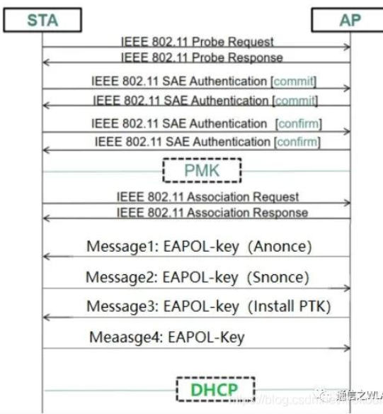

1. 认证（Authentication）:STA和AP互相认证对方是不是802.11设备

2. 关联（Association）：关联总是由STA发起，实际就是STA和AP间无线链路服务协商过程

   - AP这时候已经将连接数量+1 后续如果握手失败，再-1
   - 由STA发出请求包（STA支持速率、信道、QOS能力等）以及接入认证的加密算法
   - 关联后，STA和AP之间已经建立好了无线链路，如果STA没有安全机制，STA在获取IP之后就可以直接进行数据交互了，无需后面的四次握手

3. 四次握手

   1. 概念：

      - STA：就是客户端

      - AP：热点

      - PSK：STA和AP根据自己的SSID和wifi密码，生成各自的PSK

      - SNonce：STA生成的随机数

      - Anonce：AP生成的随机数

      - PRF：一个随机数

      - PMK：STA和AP根据ESSID+PSK 通过SHA-1算法 计算出来

      - PTK：Pairwise Transit Key 用来加密AP和STA通信的单播数据包，AP和每个STA通信的PTK都是唯一的

        ```
        PTK=PRF(PSK+ANonce+SNonce+AMac+SMac) 
        #PTK有三部分组成 PTK根据加密方式不同，分为512或者384两种格式，
        PTK=KCK+KEK+TK
        KCK:Key Confirmation Key 完整性校验码
        KEK:Key Encryption Key 用于加密Key的Key
        TK:Temporal Key 数据加密的Key
        
        PRF：伪随机数算法
        
        ```

      - MIC：Message Integrity Check ,PTK的前16位即KCK通过Hash算法得出，用于校验消息的完整性

   2. 四次握手过程如下：

      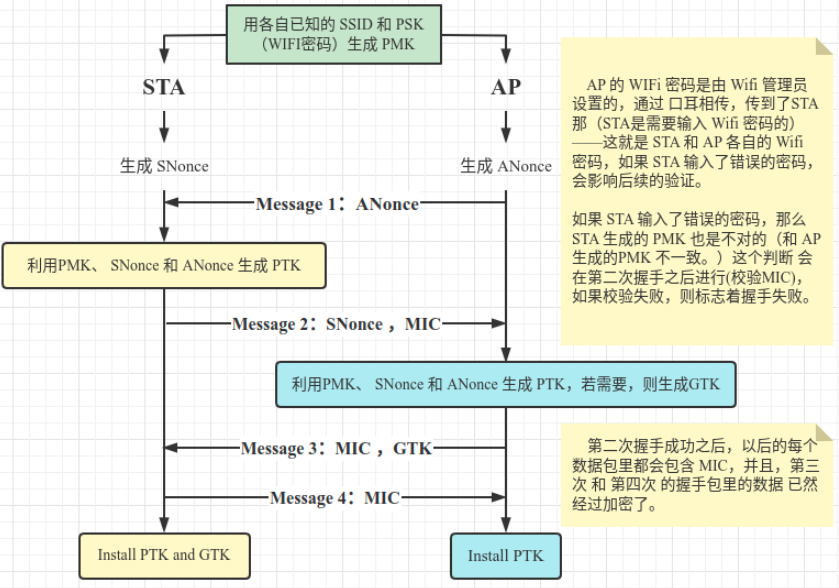

      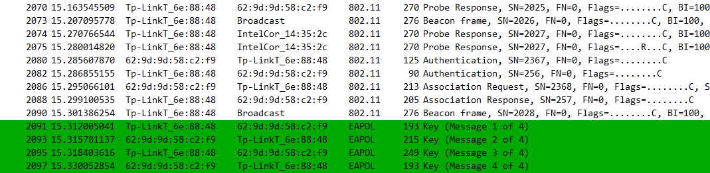

      1. 第一次握手

         - STA和AP都知道wifi的密码和SSID，故而，自己可以直接生成**PSK**。

         - AP生成ANnoce， 组包Message1=ANnoce+AMac，发送给STA进行第一次握手

         - 报文分析如下：

           通过报文可知，Message1，除了ANonce(即下图的WPA Key Nonce)不为0，其它字段均为0

           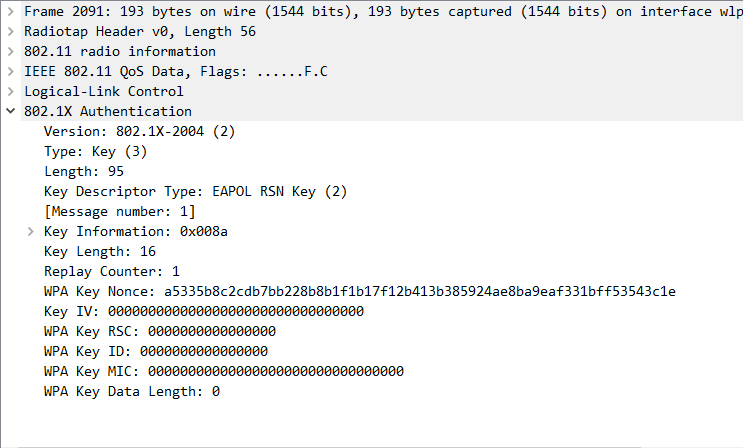

         

      2. 第二次握手

         当STA收到Message1后：

         - 会产生随机数SNonce，生成PTK=ANonce+SNonce+AMac+SMac+PSK

         - 根据PTK的前16位即KCK 生成MIC

         - 组包Message2= SNonce+SMac+MIC 发送给AP进行第二次握手

         - 报文分析如下：

           此时MIC已经有值了

           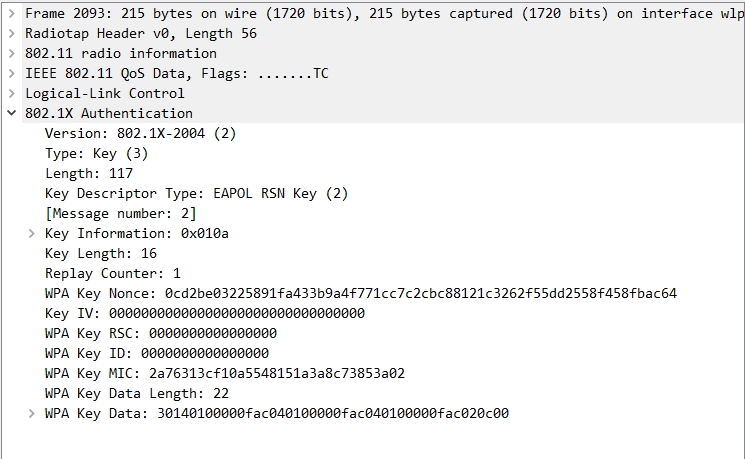

         

   3. 第三次握手

      AP收到Message2报文后：

      - 校验报文中的MIC是否通过

        - 生成AP端的PTK=ANonce+SNonce+AMac+SMac+PSK
        - AP会使用KEK将生成GTK加密，然后发送给STA，还有数据的MIC，即第三次握手，Message3

        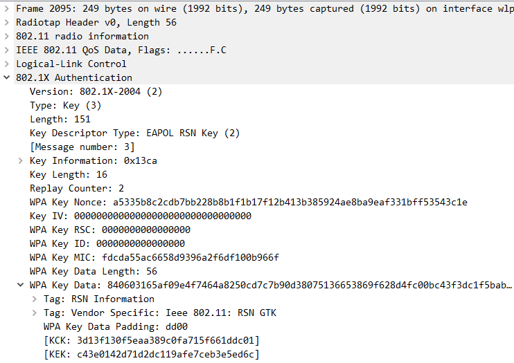

      4. 第四次握手

         - STA收到后，校验MIC，成功后进行第四次握手，告知AP可以安装PTK和GTK了，即第四次握手，Message4，同时，STA端安装自己的PTK和GTK，

         - AP端收到Message4后，会校验MIC，成功后安装PTK和GTK

         - 报文如下

           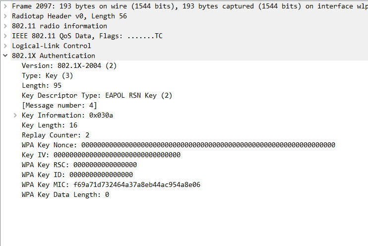

## 802.11r 快速漫游过程

### 名词解释

- MD：Mobility Domain 移动域
- MSK：Master Session Key 主会话秘钥
- PMK：Pairwise Master Key 成对主密钥
- RSN：Robust Security Network 健壮安全网络
- PRF：伪随机数
- KDF：Key Derivation Function 秘钥导出函数

### 协议解读

1. 802.11r(Fast BSS Transition)定义了STA在同一个移动域（即MD）的各个AP间的交互规则，提供快速BSS切换标准。根据协议标准定义，802.11r快速漫游包括如下两种方式：

   1. Over-the-Air方式：STA直接与FAP（AP_2）进行FT认证，STA和目标AP间交互。下图展示了802.11r快速漫游过程示意（Over-the-Air方式）：

      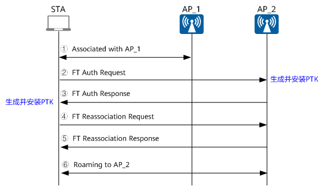

   2. Over-the-DS方式：STA通过HAP（AP_1）与FAP（AP_2）进行FT认证，该种情况两个AP间交互

2. 802.11r快速漫游实现方法

   - STA首次首次和AP认证的时候获取主会话秘钥（MSK）

     注意：由于该MSK是STA和AP共享，所以成对秘钥PMK和MSK相同

   - 根据MD内的各个AP的MSK加AP的R1KH_ID计算出PMK_R1,分发给MD内的其它AP

   - STA切换AP时，STA直接利用之前发送到目标AP上的PMK_R1协商出临时的秘钥（PTK）和组秘钥（GTK），以此缩短漫游时间，避免再重复进行耗时的802.11x认证

3. 802.11r主要四个部分：

   - 秘钥管理、FT初始化关联、快速切换和新增信息元素，下面会介绍

### 秘钥管理

在RSN（802.11i）的基础上，802.11r提出三层秘钥结构，而RSN则是两层秘钥结构。

#### 基础概念

1. 认证者
   - 对于自治的WLAN而言就是AP，为了便于理解，下面统一用该方式说明，即**认证者为AP**
   - 对于分布式WLAN而言就是AC
2. 申请者：无线STA
3. R0KH-ID是R0KH的标识（即NAS_ID），是STA当前关联AP的标识，一般会设置为MAC地址
4. R1KH_ID为目标AP的标识，一般也会设置为MAC地址
5. S0KH_ID和S1KH_ID都为STA的MAC地址。

#### 秘钥结构

- RSN通过申请者和认证者通过PMK进而获取PTK和GTK，故RSN为两层秘钥结构

- 802.11r则分为三层：PMK_R0、PMK_R1和PTK

  可以看出PMK_R0、PMK_R1是802.11r特有的。PTK的计算方式与802.11i的计算方式也有所不同

  - 80211i是通过伪随机函数（PRF）获取PMK，进而来获得PTK
  - 80211r则是通过密钥派生函数（KDF）来获取PMK，KDF函数实际上是PRF的变种

下面对三层秘钥解释：

1. PMK_R0为第一层密钥，它由MSK（PMK）或PSK推演出来，由PMK_R0密钥持有者保存（即R0_KH和S0_KH）
2. PMK_R1为第二层密钥，它由R0KH和S0KH共同推演而来，由PMK_R1密钥持有者保存（即R1KH和S1KH）
3. PTK为第三层密钥，它是由R1KH和S1KH共同推演而来。R0KH和R1KH为AP端结构，S0KH和S1KH为STA端

802.11r三层秘钥结构：

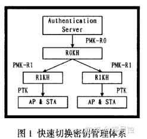


#### 密钥的分发和索取

为了实现STA切换AP时的快速漫游，802.11r规定，在STA初次与MD域进行初始化关联后，认证者在合适的时候（对此802.11r文档没有明确说明，从状态机上看应该是计算出PTK之后，再为其他R1KH计算分发PMK_R1），需要遍历MD中的所有R1KH_ID（检查MD中有记录的认证者MAC）并计算出相关的PMK_R1发往MD内的所有R1KHs，此后STA在进行漫游时，可以通过事先配发的PMK_R1计算出PTK，避免再进行费时的802.1x认证。


### FT初始化关联

FT初始化关联是指STA要接入MD域中AP的第一次关联，是后面进行快速漫游切换的前提。如果STA支持802.11r，它就会在(Re)Association_Requese帧中加入移动区域信息单元(MDIE)；如果支持IEEE802.11i就会加入健壮安全网络信息单元(RSNIE)。当IEEE802.1x认证通过后(如果是PSK方式则没有这一步)，STA和AP就会进行4次握手。握手完毕后IEEE 802.1x的受控端口打开，FT的三层密钥结构建立。

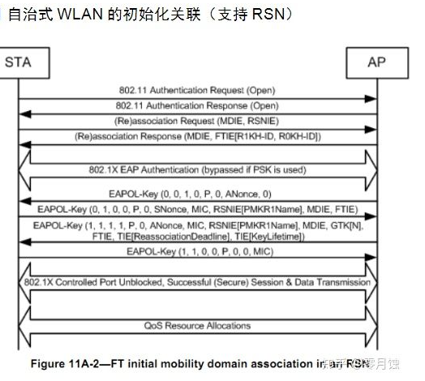

初始化关联中4次握手过程如下：

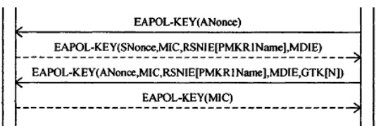

1. R1KH进入FT-PTK-START阶段后，向STA发出EAPOL_Key帧，内含随机值Anonce，这一帧不加密，但不用担心被篡改，因为一旦Anonce被篡改，那么STA和AP上计算出的PTK一定不一样。

2. STA接收该帧时，S1KH已经计算出PMK_R1，随后S1KH计算出本地随机值Snonce，并计算出PTK，计算完毕后，STA向AP发送一个EAPOL-KEY帧，附带自己的Snonce，PMKR1Name，MDIE，FTIE。这一帧也不加密，但附带了MIC校对，篡改内容会导致校验失败。同时MDIE，FTIE必须和Assoc response帧内的MDIE，FTIE相同。

3. AP根据STA发来的snonce计算出PTK。AP会在第三次握手中将组临时密钥（GTK）发过去，这一帧经过加密，因为此时双方拥有公共的PTK。第三次握手时附带的PMKR1Name和第二次握手时发送的PMKR1name必须相同。

4. STA解密后收到GTK，同时发送带MIC的确认帧，802.1x受控端口打开，STA可以正常访问网络了，如果PTKSA超期，STA需要重新进行FT初始化关联。

### 快速BSS切换（FT）

如上面介绍从切换方式来讲，FT可以分为Over_the_ds和Over_the_air方式。

- Over_the_air方式：STA直接和target AP通信。

- Over_the_ds方式：STA通过current AP与target AP通信。

从切换协议来讲，可以分为

- FT protocol：暂且叫FT协议
- FT resource request protocol：带资源请求的FT协议

Over_the_air快速切换流程

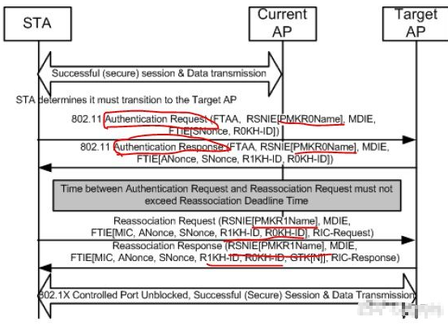


1. Authentication验证

   STA在和TargetAP进行FT时，首先进行auth验证交互：

   - 步骤一：Auth报文中的FTAA代表该验证请求帧的验证算法为FT，而不是Open和shared key；帧中的MDIE必须和Target AP自身的MDIE一致，否则会导致验证失败；同样的，如果PMKR0name不可用或者R0KH（这里的R0KH_ID必须是进行初始化关联阶段所获得的R0KH_ID）不可达，同样会报错。

     目标AP的R1KH利用PMKR0Name和帧中的其它信息计算出PMKR1Name。如果AP没有PMKR1Name标识的Key（PMK_R1），R1KH就会从STA指示的R0KH获得这个Key。目标AP收到一个新的PMK_R1后就会删除以前的PMK_R1安全关联以及它计算出的PTKSAs。STA和目标AP计算PTK和PTKName时需要用到PMK_R1，PMKR1Name，ANonce和SNonce。认证完成后，若是在TIE(Reassociate Deadline )时间到期前未收到重关联帧，那么目标AP就要将PTKSA删除。如果目标AP在重关联时间[TIE(Reassociate Deadline )]到期前没有从STA那里收到Reassociation Request帧，AP就将PTKSA删除。如果目标AP经过计算找不到PMK_R1，则向R0KH发送请求，R0KH计算出PMK_R1后，将PMK_R1SA发给R1KH。R1KH随后计算随机值Anonce，并通过3.7式计算出PTK，返回一个Auth response帧给工作站。

   - 步骤二：

     Auth response帧中的R0KH_ID必须和Auth request帧中的一样，都为初始化关联时的R0KH_ID。

     R1KH_ID为target AP的R1KH_ID；

     PMKR0name用于找到对应的PMK_R1，其余字段用于确认。

     收到auth response帧后，S1KH进入利用3.7式计算出PTK，如此一来，双方都有了共同的PTK。

     随后是重关联阶段:

     重关联请求帧里的PMKR1Name、ANonce、SNonce、MIC值、R1KH_ID和R0KH_ID都是为了与AP端确认，AP端会将自身的值与这些信息比较，如果发现不同，关联就会失败。

     Target AP收到请求帧并且验证无误的话，回复Reassoc response帧给STA，帧内带有加密后的GTK，STA可以用PTK解密获取GTK。

     重关联完成后，802.1x受控端口打开。

2. 


### 重要参数


## OpenWrt开启802.11r

1. 下面例子是开启了两个ap间的漫游配置界面的示例：

   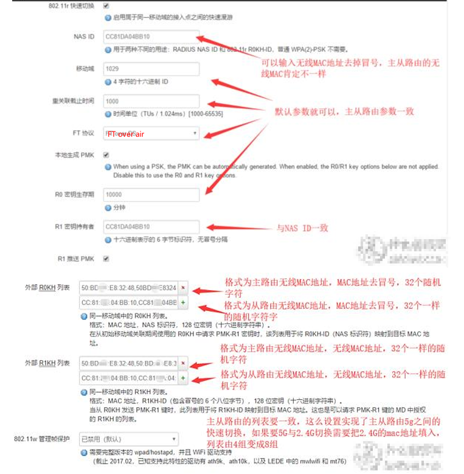

2. 下面是使用uci命令配置三个ap间的漫游的示例

   参见[UCI-help-802.11r](https://github.com/walidmadkour/OpenWRT-UCI-helper-802.11r)

   ```
   Configuration for AP with BSSID 11:22:33:44:55:00:
   
   uci set wireless.@wifi-iface[0].ieee80211r='1'
   uci set wireless.@wifi-iface[0].mobility_domain='67c5'
   uci set wireless.@wifi-iface[0].pmk_r1_push='1'
   uci set wireless.@wifi-iface[0].nasid='112233445500'
   uci set wireless.@wifi-iface[0].r1_key_holder='112233445500'
   uci set wireless.@wifi-iface[0].r0kh='11:22:33:44:55:00,112233445500,b0b1c207b44819544b07bdc523b2d6db 11:22:33:44:55:01,112233445501,b0b1c207b44819544b07bdc523b2d6db 11:22:33:44:55:02,112233445502,b0b1c207b44819544b07bdc523b2d6db'
   uci set wireless.@wifi-iface[0].r1kh='11:22:33:44:55:00,11:22:33:44:55:00,b0b1c207b44819544b07bdc523b2d6db 11:22:33:44:55:01,11:22:33:44:55:01,b0b1c207b44819544b07bdc523b2d6db 11:22:33:44:55:02,11:22:33:44:55:02,b0b1c207b44819544b07bdc523b2d6db'
   
   
   Configuration for AP with BSSID 11:22:33:44:55:01:
   
   uci set wireless.@wifi-iface[0].ieee80211r='1'
   uci set wireless.@wifi-iface[0].mobility_domain='67c5'
   uci set wireless.@wifi-iface[0].pmk_r1_push='1'
   uci set wireless.@wifi-iface[0].nasid='112233445501'
   uci set wireless.@wifi-iface[0].r1_key_holder='112233445501'
   uci set wireless.@wifi-iface[0].r0kh='11:22:33:44:55:00,112233445500,b0b1c207b44819544b07bdc523b2d6db 11:22:33:44:55:01,112233445501,b0b1c207b44819544b07bdc523b2d6db 11:22:33:44:55:02,112233445502,b0b1c207b44819544b07bdc523b2d6db'
   uci set wireless.@wifi-iface[0].r1kh='11:22:33:44:55:00,11:22:33:44:55:00,b0b1c207b44819544b07bdc523b2d6db 11:22:33:44:55:01,11:22:33:44:55:01,b0b1c207b44819544b07bdc523b2d6db 11:22:33:44:55:02,11:22:33:44:55:02,b0b1c207b44819544b07bdc523b2d6db'
   
   
   Configuration for AP with BSSID 11:22:33:44:55:02:
   
   uci set wireless.@wifi-iface[0].ieee80211r='1'
   uci set wireless.@wifi-iface[0].mobility_domain='67c5'
   uci set wireless.@wifi-iface[0].pmk_r1_push='1'
   uci set wireless.@wifi-iface[0].nasid='112233445502'
   uci set wireless.@wifi-iface[0].r1_key_holder='112233445502'
   uci set wireless.@wifi-iface[0].r0kh='11:22:33:44:55:00,112233445500,b0b1c207b44819544b07bdc523b2d6db 11:22:33:44:55:01,112233445501,b0b1c207b44819544b07bdc523b2d6db 11:22:33:44:55:02,112233445502,b0b1c207b44819544b07bdc523b2d6db'
   uci set wireless.@wifi-iface[0].r1kh='11:22:33:44:55:00,11:22:33:44:55:00,b0b1c207b44819544b07bdc523b2d6db 11:22:33:44:55:01,11:22:33:44:55:01,b0b1c207b44819544b07bdc523b2d6db 11:22:33:44:55:02,11:22:33:44:55:02,b0b1c207b44819544b07bdc523b2d6db'
   
   Do not forget to save your changes with 'uci commit wireless'
   
   Apply your settings with 'wifi restart'
   ```

   

3. 下面是直接修改/etc/config/wireless配置文件配置三个安排间漫游的示例

   ```
   ./helper.py 0 --ap 11:22:33:44:55:00 --ap 11:22:33:44:55:01 --ap 11:22:33:44:55:02 --format config
   
   
   Configuration for AP with BSSID 11:22:33:44:55:00:
   
   	option ieee80211r '1'
   	option mobility_domain '3780'
   	option pmk_r1_push '1'
   	option nasid '112233445500'
   	option r1_key_holder '112233445500'
   	list r0kh '11:22:33:44:55:00,112233445500,18880d5278d2eb37a744f5ab57bba6fb'
   	list r0kh '11:22:33:44:55:01,112233445501,18880d5278d2eb37a744f5ab57bba6fb'
   	list r0kh '11:22:33:44:55:02,112233445502,18880d5278d2eb37a744f5ab57bba6fb'
   	list r1kh '11:22:33:44:55:00,11:22:33:44:55:00,18880d5278d2eb37a744f5ab57bba6fb'
   	list r1kh '11:22:33:44:55:01,11:22:33:44:55:01,18880d5278d2eb37a744f5ab57bba6fb'
   	list r1kh '11:22:33:44:55:02,11:22:33:44:55:02,18880d5278d2eb37a744f5ab57bba6fb'
   
   
   Configuration for AP with BSSID 11:22:33:44:55:01:
   
   	option ieee80211r '1'
   	option mobility_domain '3780'
   	option pmk_r1_push '1'
   	option nasid '112233445501'
   	option r1_key_holder '112233445501'
   	list r0kh '11:22:33:44:55:00,112233445500,18880d5278d2eb37a744f5ab57bba6fb'
   	list r0kh '11:22:33:44:55:01,112233445501,18880d5278d2eb37a744f5ab57bba6fb'
   	list r0kh '11:22:33:44:55:02,112233445502,18880d5278d2eb37a744f5ab57bba6fb'
   	list r1kh '11:22:33:44:55:00,11:22:33:44:55:00,18880d5278d2eb37a744f5ab57bba6fb'
   	list r1kh '11:22:33:44:55:01,11:22:33:44:55:01,18880d5278d2eb37a744f5ab57bba6fb'
   	list r1kh '11:22:33:44:55:02,11:22:33:44:55:02,18880d5278d2eb37a744f5ab57bba6fb'
   
   
   Configuration for AP with BSSID 11:22:33:44:55:02:
   
   	option ieee80211r '1'
   	option mobility_domain '3780'
   	option pmk_r1_push '1'
   	option nasid '112233445502'
   	option r1_key_holder '112233445502'
   	list r0kh '11:22:33:44:55:00,112233445500,18880d5278d2eb37a744f5ab57bba6fb'
   	list r0kh '11:22:33:44:55:01,112233445501,18880d5278d2eb37a744f5ab57bba6fb'
   	list r0kh '11:22:33:44:55:02,112233445502,18880d5278d2eb37a744f5ab57bba6fb'
   	list r1kh '11:22:33:44:55:00,11:22:33:44:55:00,18880d5278d2eb37a744f5ab57bba6fb'
   	list r1kh '11:22:33:44:55:01,11:22:33:44:55:01,18880d5278d2eb37a744f5ab57bba6fb'
   	list r1kh '11:22:33:44:55:02,11:22:33:44:55:02,18880d5278d2eb37a744f5ab57bba6fb'
   
   Apply your settings with 'wifi restart'
   ```

   

