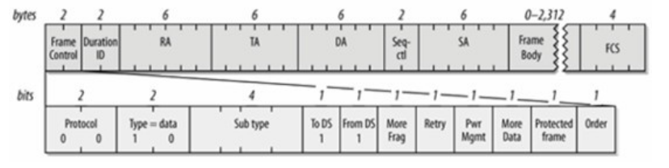

# 802.11协议

## 802.11协议简介

### 802.11b/a/g

2007年发布了正式版本《IEEE Std 802.11-2007》，主要的扩展有802.11a/b/g/i/e。

- 802.11b: 1999年，2.4GHz；物理层调制技术：DSSS，11Mbps
- 802.11a: 2000年，5GHz；物理层调制技术：OFDM，最高64QAM调制，54Mbps
- 802.11g: 2003年，2.4GHz；物理层调制技术：OFDM，最高64QAM调制，54Mbps
- 802.11i: 2004年，MAC层安全增强，WiFi加密相关的协议
- 802.11e: 2005年，MAC层QoS增强
- 802.11s：802.11 mesh


- 802.11k:无线局域网频谱资源测量协议，由AP扫描周围邻居ＡＰ信息，配合终端扫描潜在漫游目标信息，解决何时漫游问题。
- 802.11v:无线网络管理协议，终端请求漫游目标（非必要），AP建议终端漫游目标，解决漫游到何处问题。
- 802.11r:快速BSS转换协议，消除无线重关联过程中的握手开销，极大减少漫游时间，解决如何关重关联问题。

### 802.11n

2012年发布了正式版本《IEEE Std 802.11-2012》，主要扩展是802.11n，称为WiFi4

- 802.11n: 2009年，2.4GHz和5GHz；物理层技术：MIMO, OFDM; 最高64QAM调制，最高4条空间流，最大40MHz带宽。常用的双流40MHz带宽下，最高物理层速率是300Mbps。

### 802.11ac

2016年正式发布《IEEE Std 802.11-2016》，主要扩展是802.11ac，称为WiFi5

- 802.11ac: 2014年，2.4GHz和5GHz；物理层技术：MIMO, OFDM，最高256QAM调制，最高8条空间流，最大160MHz带宽。常用的双流80MHz带宽下，最高物理层速率是866Mbps

### 802.11ax

802.11ax于2019年推出主要扩展是802.11ax，称为WiFi6

- 802.11ax: 2018年；物理层技术：MIMO, OFDM, OFDMA，最高1024QAM调制，最高8条空间流，最大160MHz带宽。常用的双流80MHz带宽下，最高物理层速率是1201Mbps

## 网络拓扑结构


1. 一个AP和若干STA组成一个BSS，每个BSS由一个SSID(Service Set ID)来标识。
2. AP具有路由器功能，通过WAN口连接到Internet；STA通过无线连接AP。

多个SSID相同的BSS网络组成ESS网络。

ESS网络常见于企业、学校、机场等较大的物理空间场所，需要部署多个AP才能满足无线网络覆盖需求。STA在ESS下不同BSS之间的切换称为漫游。


## 帧格式

802.11协议规定帧格式如下：


- 24 Byte的 Mac Header
- FrameBody 可变长度的负载信息
- 4字节的FCS校验数据


针对2 字节的`Frame Control`字段定义如下：


其中Type和SubType决定该帧的类型是控制帧、管理帧和数据帧。

### 帧类型`Type`和`SubType`

#### 管理帧

|Type  | 描述                | Subtype  |描述|
| ---- | ------------------ | -------- |----|
|00	    |Management	|0000	|Association Request 关联请求 (0x0)|
|00	    |Management	|0001	|Association Response 关联请求应答 (0x1)|
|00	    |Management	|0100	|Probe Prequest (0x4)|
|00	    |Management	|0101	|Probe Response (0x5)|
|00	    |Management	|1000	|Beacon (0x8)|
|00	    |Management	|1010	|Disassociation 去关联 (0xa)|
|00	    |Management	|1011	|Authentication 认证 (0xb)|
|00	    |Management	|1100	|Deauthentication 去认证 (0xc)|
|00	    |Management	|1101	|Action (0xd)|

#### 控制帧


|Type |描述|Subtype|描述|
|-----|---|--------|----|
|01	|Control	|1000	|Block Ack Request|
|01	|Control	|1001	|Block Ack|
|01	|Control	|1011	|RTS|
|01	|Control	|1100	|CTS|
|01	|Control	|1101	|Ack|

#### 数据帧

|Type |描述|Subtype|描述|
|-----|---|--------|----|
|10	|Data	|0000	|Data|
|10	|Data	|0100	|Null Data|
|10	|Data	|1000	|QoS Data|
|10	|Data	|1100	|QoS Null Data|


## 连接过程

参见[16.wifi链接过程.md](./16.wifi链接过程.md)

## 常见的802.11帧分析

### 管理帧

#### Beacon

信标帧


#### Probe Request

Probe请求帧


#### Probe Response

Probe请求应答帧


#### ATIM


#### Authentication

身份认证帧


#### Disassocication和Deauthentication

解除关联帧和解除认证帧


#### Association Request

关联请求帧


#### Ressociation Request

重关联请求帧


```
1. 帧控制结构(Frame Control)
    1) Protocol Version: (协议版本)通常为0
    2) Type: 帧类型，管理帧: 00 
    3) Subtype: 进一步判断帧的子类型 
        3.1) Beacon(信标)帧
        3.2) Probe Request(探测请求)帧
        3.3) Probe Response(探测响应)帧
        3.4) ATIM帧
        3.5) Disassociation(解除关联)
        3.6) Deauthentication(解除认证)帧
        3.7) Association Request(关联请求)帧
        3.8) Reassociation Request(重新关联请求)帧
        3.9) Authentication(身份认证)帧
    4) To DS: 表明该帧是否是BSS向DS发送的帧 
    5) From DS: 表明该帧是否是DS向BSS发送的帧 
    6) More Fragment: 用于说明长帧被分段的情况，是否还有其它的帧，如果有则该值设置为1
    7) Retry(重传域): 表示该分段是先前传输分段的重发帧。 
    8) Power Management: 表示传输帧以后，站所采用的电源管理模式
        8.1) 为1: STA处于power_save模式
        8.2) 为0: STA处于active模式
    9) More Data: 表示有很多帧缓存到站中。即至少还有一个数据帧要发送给STA是设置为1。 
    10) Protected Frame: 表示根据WEP(Wired Equivalent Privacy)算法对帧主体进行加密。如果帧体部分包含被密钥套处理过的数据，则设置为1，否则设置为0 
    11) Order(序号域): 在长帧分段传送时，该域设置为1表示接受者应该严格按照顺序处理该帧，否则设置为0
2. Duration/ID(持续时间/标识)
表明该帧和它的确认帧将会占用信道多长时间，Duration 值用于网络分配向量(NAV)计算 
3. Address Fields(地址域): 
    1) Destination Address
    2) Source Address
    3) BSS ID 
4. Sequence Control(序列控制域): 用于过滤重复帧
    1) MSDU(MAC Server Data Unit), 12位序列号(Sequence Number)
    2) MMSDU(MAC Management Server Data Unit), 4位片段号(Fragment Number)组成 
5. Frame Body(Data): 发送或接收的信息。对于不同类型的数据帧来说，这个域的格式差别较大
    1) Beacon(信标)帧
        1.1) Timestamp(时戳)位: 可用来同步 BSS 中的工作站 BSS 的主计时器会定期发送目前已作用的微秒数。当计数器到达最大值时，便会从头开始计数
        1.2) Beacon interval位: AP点每隔一段时间就会发出的Beacon(信标)信号，用来宣布 802.11网络的存在。我们打开无线连接的时候之所以能看到很多Wi-Fi点就是因为它
        1.3) Capability information位: 发送Beacon信号的时候，它被用来通知各方，该网络具备哪种性能
        1.4) SSID服务集标识(Service Set Identity): 由字节所形成的字串，用来标示所属网络的BSSID，即我们在Wi-Fi连接前看到的接入点名称
        1.5) 跳频参数组合(PH Parameter Set): 包含了加入 802.11跳频(frequency-hopping)网络所需要的参数
        1.6) 直接序列参数集合(DS Parameter Set): 指明网络所使用的信道数
        1.7) 免竞争参数集合(CF Parameter Set): 出现在支持免竞争接入点所发送的 Beacon帧中，并非必须
        1.8) IBSS 参数集合(IBSS Parameter Set): 指明ATIM window (数据待传指示通知信息间隔期间)
        1.9) TIM数据待传信息(Traffic Indication Map): 指示有哪些工作站需要接收待传数据
        1.10) Country: 国家识别码
        1.11) 功率限制(Power Constraint): 让网络得以向工作站传达其所允许的最大传输功率
        1.12) 信道切换宣告(Channel Switch Announcement): 为了警告网络中的工作站即将变换信道
        1.13) 禁声(Quiet): 为了避免与特定的军事雷达技术彼此干扰
        1.14) 发射功率控制报告(TPC Report): 指明链路的衰减情况，可以帮助工作站了解该如何调整传输功率
        1.15) 扩展物理层(ERP)
        1.16) 支持速率(Supported Rates): 无线局域网络支持数种标准速率。当移动工作站试图加入网络，会先检视该网络所使用的数据速率。有些速率是强制性的，每部工作站都必须支持　　　　 ，有些则是选择性的
        1.17) RSN强健安全网络(Robust Security Network)
    2) Probe Request(探测请求)帧
        2.1) SSID服务集标识(Service Set Identity): 由字节所形成的字串，用来标示所属网络的BSSID，即我们在Wi-Fi连接前看到的接入点名称
        2.2) Supported Rate(支持速率)
        2.3) 扩展支持速率(Extended Supported Rate)
    3) Probe Response(探测响应)帧
        3.1) Timestamp(时戳)位: 可用来同步 BSS 中的工作站 BSS 的主计时器会定期发送目前已作用的微秒数。当计数器到达最大值时，便会从头开始计数
        3.2) Beacon interval位: AP点每隔一段时间就会发出的Beacon(信标)信号，用来宣布 802.11网络的存在。我们打开无线连接的时候之所以能看到很多Wi-Fi点就是因为它
        3.3) Capability information位: 发送Beacon信号的时候，它被用来通知各方，该网络具备哪种性能
        3.4) SSID服务集标识(Service Set Identity): 由字节所形成的字串，用来标示所属网络的BSSID，即我们在Wi-Fi连接前看到的接入点名称
        3.5) 支持速率(Supported Rates): 无线局域网络支持数种标准速率。当移动工作站试图加入网络，会先检视该网络所使用的数据速率 
        3.6) 跳频参数组合(PH Parameter Set): 包含了加入 802.11跳频(frequency-hopping)网络所需要的参数
        3.7) 直接序列参数集合(DS Parameter Set): 指明网络所使用的信道数
        3.8) 免竞争参数集合(CF Parameter Set): 出现在支持免竞争接入点所发送的 Beacon帧中，并非必须
        3.9) IBSS 参数集合(IBSS Parameter Set): 指明ATIM window (数据待传指示通知信息间隔期间)
        3.10) Country: 国家识别码
        3.11) FH Hopping Parameters
        3.12) FH Pattern Table
        3.13) 功率限制(Power Constraint): 让网络得以向工作站传达其所允许的最大传输功率
        3.13) 信道切换宣告(Channel Switch Announcement): 为了警告网络中的工作站即将变换信道
        3.14) 禁声(Quiet): 为了避免与特定的军事雷达技术彼此干扰
        3.15) IBSS 动态选项(IBSS DFS):在 IBSS 中负责动态选频的工作站可以在管理帧中传递 IBSS DFS 信息元素
        3.16) 发射功率控制报告(TPC Report): 指明链路的衰减情况，可以帮助工作站了解该如何调整传输功率
        3.17) 扩展物理层(ERP)
        3.18) 扩展支持速率(Extended Supported Rate) 
        3.19) RSN强健安全网络(Robust Security Network)
    4) ATIM帧
    5) Disassociation(解除关联)
        5.1) Beacon Code
    6) Deauthentication(解除认证)帧
        6.1) Beacon Code
    7) Association Request(关联请求)帧
        7.1) Capability information位: 发送Beacon信号的时候，它被用来通知各方，该网络具备哪种性能
        7.2) Listen interval位: 为了节省电池的电力，工作站可以暂时关闭 802.11网络接口的天线。当工作站处于休眠状态，接入点必须为之暂存帧
        7.3) SSID服务集标识(Service Set Identity): 由字节所形成的字串，用来标示所属网络的BSSID，即我们在Wi-Fi连接前看到的接入点名称
        7.4) Supported Rate(支持速率)
    8) Reassociation Request(重新关联请求)帧
        8.1) Capability information位: 发送Beacon信号的时候，它被用来通知各方，该网络具备哪种性能
        8.2) Listen interval位: 为了节省电池的电力，工作站可以暂时关闭 802.11网络接口的天线。当工作站处于休眠状态，接入点必须为之暂存帧
        8.3) Current AP Address位: 使用Current AP Address(目前接入点的地址)位来表明目前所连接的接入点的 MAC地址
        8.4) SSID服务集标识(Service Set Identity): 由字节所形成的字串，用来标示所属网络的BSSID，即我们在Wi-Fi连接前看到的接入点名称
        8.5) Supported Rate(支持速率)
    9) Authentication(身份认证)帧
        9.1) Authentication Algorithm Number: 指明认证程序所使用的认证类型
        9.2) Authentication Transaction Sequence Number: 用以追踪身份认证的进度
        9.3) Status Code: 状态代码用来表示某项过程成功或失败
        9.4) 质询口令(Challenge Text): 802.11所定义的共享密钥身份认证系统。会要求移动工作站必须成功解码一段加密过的质询口令。这段质询口令的发送系通过 Challenge Text　　　　(质询口令)信息元素
6. FCS(CRC): 包括32位的循环冗余校验(CRC)，用于检错，注意是检错不是纠错
```

### 数据帧协议格式

#### IBSS 


#### From AP


#### To AP


#### WDS



```
1. 帧控制结构(Frame Control)
    1) Protocol Version: (协议版本)通常为0
    2) Type: 帧类型，数据帧: 10 
    3) Subtype: 进一步判断帧的子类型，不同类型的数据帧这个字段的格式是不同的
        3.1) IBSS帧
            3.1.1) 0000: Data
            3.1.2) 0010: Null
        3.2) From AP帧
            3.2.1) 0000: Data
            3.2.2) 1000: Data+CF+ASK
            3.2.3) 0100: Data+CF+Poll
            3.2.4) 1100: Data+CF+ACK+CF+Poll
            3.2.5) 1010: CF+ACK
            3.2.6) 0110: CF+Poll
            3.2.7) 1110: ACK+CF+Poll 
        3.3) To AP帧
            3.3.1) 0000: Data
            3.3.2) 1000: Data+CF+ACK
            3.3.3) 0010: Null
            3.3.4) 1010: CF+ACK(no data)
        3.4) WDS帧
            null
    4) To DS: 表明该帧是否是BSS向DS发送的帧时
        4.1) IBSS: 设置为0
        4.2) To AP: 设置为1
        4.3) From AP: 设置为0
        4.4) WDS: 设置为1
    5) From DS: 表明该帧是否是DS向BSS发送的帧时  
        5.1) IBSS: 设置为0
        5.2) To AP: 设置为0
        5.3) From AP: 设置为1
        5.4) WDS: 设置为1
    6) More Fragment: 用于说明长帧被分段的情况，是否还有其它的帧，如果有则该值设置为1
    7) Retry(重传域): 表示该分段是先前传输分段的重发帧。 
    8) Power Management: 表示传输帧以后，站所采用的电源管理模式
        8.1) 为1: STA处于power_save模式
        8.2) 为0: STA处于active模式
    9) More Data: 表示有很多帧缓存到站中。即至少还有一个数据帧要发送给STA是设置为1。 
    10) Protected Frame: 表示根据WEP(Wired Equivalent Privacy)算法对帧主体进行加密。如果帧体部分包含被密钥套处理过的数据，则设置为1，否则设置为0 
    11) Order(序号域): 在长帧分段传送时，该域设置为1表示接受者应该严格按照顺序处理该帧，否则设置为0
2. Duration/ID(持续时间/标识)
表明该帧和它的确认帧将会占用信道多长时间，Duration 值用于网络分配向量(NAV)计算 
3. Address Fields(地址域): 
这个域的具体格式和控制帧的子类型有关，不同的子类型会有一些微小的差别
    1) IBSS
        1.1) Destination Address
        1.2) Source Address
        1.3) BSSID 
        每个BSS都会被赋予一个BSSID，它是一个长度为48个bit的二进制识别码，用来辨识不同的BSS
    2) From AP
        2.1) Destination Address 
        2.2) BSSID
        2.3) Source Address
    3) To AP
        3.1) BSSID
        3.2) Source Address
        3.3) Destination Address  
    4) WDS 
        4.1) BSSID
        4.2) Source Address
        4.3) Destination Address
4. Sequence Control(序列控制域): 用于过滤重复帧
    1) MSDU(MAC Server Data Unit), 12位序列号(Sequence Number)
    2) MMSDU(MAC Management Server Data Unit), 4位片段号(Fragment Number)组成
[SA，只有WDS中的帧有这个字段]
5. Frame Body(Data): 发送或接收的信息。
6. FCS(CRC): 包括32位的循环冗余校验(CRC)，用于检错，注意是检错不是纠错
```


### 控制帧协议格式

#### RTS帧


#### CTS帧


#### ACK帧


#### PS-Poll帧


```
1. 帧控制结构(Frame Control)
    1) Protocol Version: (协议版本)通常为0
    2) Type: 帧类型，控制帧: 01 
    3) Subtype: 进一步判断帧的子类型:   
        控制帧
        3.1) 请求发送(Request To Send，RTS)数据包
        3.2) 清除发送(Clear To Send，CTS)数据包
        数据帧
        3.3) ACK确认(RTS/CTS) 
        3.4) PS-Poll: 当一部移动工作站从省电模式中苏醒，便会发送一个 PS-Poll 帧给基站，以取得任何暂存帧 
    4) To DS: 表明该帧是BSS向DS发送的帧时，该值设置为1
    5) From DS: 表明该帧是DS向BSS发送的帧时，该值设置为1
    控制帧负责处理无线介质的访问，因此只能够由无线工作站产生。传输系统并不会收送控制帧，因此这两个Bit必然为0 
    6) More Fragment: 用于说明长帧被分段的情况，是否还有其它的帧，如果有则该值设置为1。
    控制帧不可能被切割，这个Bit必然为0 
    7) Retry(重传域): 表示该分段是先前传输分段的重发帧。
    控制帧不像管理或数据帧那样，必须在序列中等候重送，因此这个 Bit必然为0 
    8) Power Management: 表示传输帧以后，站所采用的电源管理模式
        8.1) 为1: STA处于power_save模式
        8.2) 为0: STA处于active模式
    9) More Data: 表示有很多帧缓存到站中。即至少还有一个数据帧要发送给STA是设置为1。
    More Data bit只用于管理数据帧，在控制帧中此Bit必然为0
    10) Protected Frame: 表示根据WEP(Wired Equivalent Privacy)算法对帧主体进行加密。如果帧体部分包含被密钥套处理过的数据，则设置为1，否则设置为0。
    控制帧不会经过加密。因此对控制帧而言，Protected Frame bit必然为0。
    11) Order(序号域): 在长帧分段传送时，该域设置为1表示接受者应该严格按照顺序处理该帧，否则设置为0。
    控制帧是基本帧交换程序(atomic frame exchange operation)的组成要件，因此必须依序发送。所以这个Bit必然为0
2. Duration/ID(持续时间/标识)
表明该帧和它的确认帧将会占用信道多长时间，Duration 值用于网络分配向量(NAV)计算。
注意: 在PS-Poll帧中不包含Duration/ID这个字段
3. Address Fields(地址域): 
这个域的具体格式和控制帧的子类型有关，不同的子类型会有一些微小的差别
    3.1) RTS(请求发送帧)
        3.1.1) Receiver Address(接收端地址)
        接收大型帧的工作站的地址
        3.1.2) Transmitter Address(发送端地址)
        RTS帧的发送端的地址
    3.2) CTS(允许发送)
        3.2.1) Receiver Address(接收端地址)
    3.3) ACK(应答)
        3.3.1) Receiver Address(接收端地址)
    3.4) PS-Poll(省电模式一轮询) 
        3.4.1) AID(连接识别码 association ID)    
        连接识别码是接入点所指定的一个数值，用以区别各个连接。将此识别码置入帧，可让接入点找出为其(移动工作站)所暂存的帧
        3.4.2) BSSID
        此位包含发送端目前所在 BSS(AP)的BSSID ，此BSS 建立自目前所连接的AP
        3.4.3) Transmitter Address(发送端地址)
        此为PS-Poll帧之发送端的 MAC地址
4. FCS(CRC): 包括32位的循环冗余校验(CRC)，用于检错，注意是检错不是纠错
```


## 抓包常用

wlan.fc.subtype 或者wlan.fc.type_subtype

wlan.fc.type


