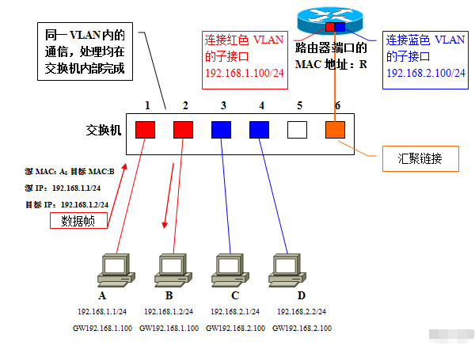

# OSI参考模型和TCP/IP参考模型


## TCP


TCP 报文段的报头有 20字节必需的和 4字节可选。所以报头至少为 20 字节。报头后面的数据是可选项。

- 源端口（16位）：标识发送报文的计算机端口或进程。一个 TCP 报文段必须包括源端口号，使目的主机知道应该向何处发送确认报文；

- 目的端口（16位）：标识接收报文的目的主机的端口或进程；

- 序号（也叫序列号）（32位）：用于标识每个报文段，使目的主机可确认已收到指定报文段中的数据。当源主机用于多个报文段发送一个报文时，即使这些报文到达目的主机的顺序不一样，序列号也可以使目的主机按顺序排列它们；

  在 SYN 标志未置位时，该字段指示了用户数据区中第一个字节的序号；在 SYN 标志置位时，该字段指示的是初始发送的序列号；在建立连接时发送的第一个报文段中，双方都提供一个初始序列号。TCP 标准推荐使用以 4ms 间隔递增 1 的计数器值作为这个初始序列号的值。使用计数器可以防止连接关闭再重新连接时出现相同的序列号。

  对于那些包含数据的报文段，报文段中第一个数据字节的数量就是初始序列号，其后数据字节按顺序编号。如果源主机使用同样的连接发送另一个报文段，那 么这个报文段的序列号等于前一个报文段的序列号与前一个报文段中数据字节的数量之和。例如，假设源主机发送 3 个报文段，每个报文段有 100 字节的数据，且第一个报文段的序列号是 1000，那么第二个报文段的序列号就是 1100（1000 + 100），第三个报文段的序列号就是 1200（1100 + 100）。如果序列号增大至最大值将复位为 0。

- 确认号（32位）

  目的主机返回确认号，使源主机知道某个或几个报文段已被接收。如果 ACK 控制位被设置为 1，则该字段有效。确认号等于顺序接收到的最后一个报文段的序号加 1，这也是目的主机希望下次接收的报文段的序号值。返回确认号后，计算机认为已接收到小于该确认号的所有数据。

   

  例如，序列号等于前一个报文段的序列号与前一个报文段中数据字节的数量之和。例如，假设源主 机发送 3 个报文段，每个报文段有 100 字节的数据，且第一个报文段的序列号是 1000，那么接收到第一个报文段后，目的主机返回含确认号1100 的报头。接收到第二个报文段（其序号为 1100 ）后，目的主机返回确认号 1200。接收到第三个报文段后，目的主机返回确认号 1300 。

   

  目的主机不一定在每次接收到报文段后都返回确认号。在上面的例子中，目的主机可能等到所有 3 个报文段都收到后，再返回一个含确认号 1300 的报文段，表示已接收到全部 1200 字节的数据。但是如果目的主机再发回确认号之前等待时间过长，源主机会认为数据没有到达目的主机，并自动重发。
  上面的例子中，如果目的主机接收到了报文段号为 1000 的第一个报文段以及报文段号为 1200 的最后一个报文段，则可返回确认号 1100，但是再返回确认号 1300 之前，应该等待报文段号为 1100 的中间报文段。

- 数据偏移（首部长度）（4位）：TCP 报文段的数据起始处距离 TCP 报文段的起始处有多远，即首部长度。 由于 TCP 报头的长度随 TCP 选项字段内容的不同而变化，因此报头中包含一个指定报头字段的字段。该字段以 32 比特为单位，所以报头长度一定是 32 比特的整数倍，有时需要在报头末尾补 0 。如果报头没有 TCP 选项字段，则报头长度值为 5 ，表示报头一个有 160 比特，即 20 字节。

- 保留位（6位）：由跟在数据偏移字段后的 6 位构成， 全部为 0 

- 控制位（6位）：

  - 紧急 URG：此位置 1，表明紧急指针字段有效，它告诉系统此报文段中有紧急数据，应尽快传送。
  - 确认 ACK：仅当 ACK = 1 时确认号字段才有效，TCP 规定，在连接建立后所有传达的报文段都必须把 ACK 置 1。
  - 推送 PSH： 当两个应用进程进行交互式的通信时，有时在一端的应用进程希望在键入一个命令后立即就能够收到对方的响应。在这种情况下，TCP 就可以使用推送（push）操作，这时，发送方 TCP 把 PSH 置 1 ，并立即创建一个报文段发送出去，接收方收到 PSH = 1 的报文段，就尽快地（即“推送”向前）交付给接收应用进程，而不再等到整个缓存都填满后再向上交付。
  - 复位 RST：用于复位相应的 TCP 连接
  - 同步 SYN：仅在三次握手建立 TCP 连接时有效。当 SYN = 1 而 ACK = 0 时，表明这是一个连接请求报文段，对方若同意建立连接，则应在相应的报文段中使用 SYN = 1 和 ACK = 1。因此，SYN 置 1 就表示这是一个连接请求或连接接受报文。
  - 终止 FIN：用来释放一个连接。当 FIN = 1 时，表明此报文段的发送方的数据已经发送完毕，并要求释放运输连接。

- 窗口（16位）：此字段用来进行流量控制，这个值是本机期望一次接收的字节数，即发送数据的窗口大小。告诉对方在不等待确认的情况下，可以发来多大的数据。这里表示的最大长度是2^16 – 1 = 65535，如需要使用更大的窗口大小，需要使用选项中的窗口扩大因子选项。指发送本报文段的一方的接收窗口（而不是自己的发送窗口）。

- 校验和（16位）：源主机和目的主机根据 TCP 报文段以及伪报头的内容计算校验和。在伪报头中存放着来自 IP 报头以及 TCP 报文段长度信息。与 UDP 一样，伪报头并不在网络中传输，并且在校验和中包含伪报头的目的是为了防止目的主机错误地接收存在路由的错误数据报。

  伪首部， 又称为伪包头（Pseudo Header）：是指在 TCP 的分段或 UDP 的数据报格式中，在数据报首部前面增加源 IP 地址、目的 IP 地址、IP 分组的协议字段、TCP 或 UDP 数据报的总长度等共12字节，所构成的扩展首部结构。此伪首部是一个临时的结构，它既不向上也不向下传递，仅仅只是为了保证可以校验套接字的正确性。

- 紧急指针（16位）：仅在 URG = 1 时才有意义，它指出本报文段中的紧急数据的字节数（紧急数据结束后就是普通数据），即指出了紧急数据的末尾在报文中的位置，注意：即使窗口为零时也可发送紧急数据。

  如果 URG 为 1 ，则紧急指针标志着紧急数据的结束。其值是紧急数据最后 1 字节的序号，表示报文段序号的偏移量。例如，如果报文段的序号是 1000，前 8 个字节都是紧急数据，那么紧急指针就是 8 。紧急指针一般用途是使用户可中止进程。

- 选项、填充字段：可能包括“窗口扩大因子”、“时间戳”等选项。长度可变，最长可达 40 字节，当没有使用选项时，TCP 首部长度是 20 字节。填充用于保证任选项为 32bit 的整数倍。

- 数据（长度可变）：TCP 首部结束之后的部分

## UDP


UDP首部由8个字节构成，每个字段都是两个字节。

- 源端口：源端口号，需要对方回信时选用，不需要时置0；
- 目标端口：目的端口号，在终点交付报文时需要用到；
- 头部长度：UDP的数据报长度（包含首部和数据），最小值为8字节（只有首部）；
- 校验和：检测UDP数据在传输中是否出错，有错则丢弃。该字段可选，当源主机不想计算校验和，则置0，当传输层从IP层收到UDP数据报时，根据首部中的目标端口，把UDP数据通过相应的端口交给应用进程。若接收方UDP发现收到的报文中目的端口号不正确，就丢弃该报文，由ICMP发送“端口不可达”报错给发送方。

在计算校验和时，在UDP数据报前加12字节的伪首部，并不是UDP真正的首部。只是在计算校验和时临时添加在UDP数据报的前面得到的临时数据报，后校验临时数据报。伪首部既不向下传送，也不向上递交，仅仅为了计算校验和。这样，即检查了UDP的数据报，又对IP数据报源IP地址和目标地址进行了校验。

UDP校验和的计算方法和IP数据报首部校验和的计算方法类似，都使用二进制反码运算求和再求和再取反。不同的是：IP数据报校验和只校验IP数据报的首部，但UDP校验和是把首部和数据一起校验。

## IP


IP 报头的最小长度为 20 字节，上图中每个字段的含义如下：

- 版本（version）:占 4 位，表示 IP 协议的版本。通信双方使用的 IP 协议版本必须一致。目前广泛使用的IP协议版本号为 4，即 IPv4；

- 首部长度（网际报头长度IHL）：占 4 位，可表示的最大十进制数值是 15。这个字段所表示数的单位是 32 位字长（1 个 32 位字长是 4 字节）。因此，当 IP 的首部长度为 1111 时（即十进制的 15），首部长度就达到 60 字节。当 IP 分组的首部长度不是 4 字节的整数倍时，必须利用最后的填充字段加以填充。

  数据部分永远在 4 字节的整数倍开始，这样在实现 IP 协议时较为方便。首部长度限制为 60 字节的缺点是，长度有时可能不够用，之所以限制长度为 60 字节，是希望用户尽量减少开销。最常用的首部长度就是 20 字节（即首部长度为 0101），这时不使用任何选项。

- 区分服务（tos）：也被称为服务类型，占 8 位，用来获得更好的服务。这个字段在旧标准中叫做服务类型，但实际上一直没有被使用过。1998 年 IETF 把这个字段改名为区分服务（Differentiated Services，DS）。只有在使用区分服务时，这个字段才起作用。

- 总长度（totlen）：首部和数据之和，单位为字节。总长度字段为 16 位，因此数据报的最大长度为 2^16-1=65535 字节。

- 标识（identification）：用来标识数据报，占 16 位。IP 协议在存储器中维持一个计数器。每产生一个数据报，计数器就加 1，并将此值赋给标识字段。当数据报的长度超过网络的 MTU，而必须分片时，这个标识字段的值就被复制到所有的数据报的标识字段中。具有相同的标识字段值的分片报文会被重组成原来的数据报。

-  标志（flag）：占 3 位。第一位未使用，其值为 0。第二位称为 DF（不分片），表示是否允许分片。取值为 0 时，表示允许分片；取值为 1 时，表示不允许分片。第三位称为 MF（更多分片），表示是否还有分片正在传输，设置为 0 时，表示没有更多分片需要发送，或数据报没有分片。

- 片偏移（offsetfrag）：占 13 位。当报文被分片后，该字段标记该分片在原报文中的相对位置。片偏移以 8 个字节为偏移单位。所以，除了最后一个分片，其他分片的偏移值都是 8 字节（64 位）的整数倍。

- 生存时间（TTL）：表示数据报在网络中的寿命，占 8 位。该字段由发出数据报的源主机设置。其目的是防止无法交付的数据报无限制地在网络中传输，从而消耗网络资源。

  路由器在转发数据报之前，先把 TTL 值减 1。若 TTL 值减少到 0，则丢弃这个数据报，不再转发。因此，TTL 指明数据报在网络中最多可经过多少个路由器。TTL 的最大数值为 255。若把 TTL 的初始值设为 1，则表示这个数据报只能在本局域网中传送。 

- 协议：表示该数据报文所携带的数据所使用的协议类型，占 8 位。该字段可以方便目的主机的 IP 层知道按照什么协议来处理数据部分。不同的协议有专门不同的协议号。

  例如，TCP 的协议号为 6，UDP 的协议号为 17，ICMP 的协议号为 1。

- 首部检验和（checksum）：用于校验数据报的首部，占 16 位。数据报每经过一个路由器，首部的字段都可能发生变化（如TTL），所以需要重新校验。而数据部分不发生变化，所以不用重新生成校验值。

- 源地址：表示数据报的源 IP 地址，占 32 位。

- 目的地址：表示数据报的目的 IP 地址，占 32 位。该字段用于校验发送是否正确。

- 可选字段：该字段用于一些可选的报头设置，主要用于测试、调试和安全的目的。这些选项包括严格源路由（数据报必须经过指定的路由）、网际时间戳（经过每个路由器时的时间戳记录）和安全限制。

- 填充：由于可选字段中的长度不是固定的，使用若干个 0 填充该字段，可以保证整个报头的长度是 32 位的整数倍。

- 数据部分：表示传输层的数据，如保存 TCP、UDP、ICMP 或 IGMP 的数据。数据部分的长度不固定。

#### 实例

下面是一个TCP的SYN数据包,大家可以分析一下:

```c
4500002C2A690000-4006B7580A616750-7CACAAAD24DE0E89-12DE958000000000-60023908EA4D0000-020405B4
```

- 版本:4,即IPv4;
- 首部长度:5,即5*8=20B,说明没有可变部分;
- 服务:00;
- 总长度:002C,44B;
- 标识:2A69;
- 标志+片偏移:0000;
- 生存时间:40,即64;
- 协议:06,传输控制协议,也就是TCP;
- 首部校验和:B758;
- 源地址:0A616750;
- 目的地址:7CACAAAD.

 

后面的数据时TCP的头部,这里先简单列出来,后面会详细分析:

 

- 源端口:24DE;
- 目的端口:0E89;
- 序号:12DE9580;
- 确认号:00000000;
- 数据偏移:6,即偏移24B.TCP的头部默认是20B,我们分析的数据包有一个TCP选项,占4B;
- 保留+控制位:002,表明这是一个SYN包;
- 窗口值:3908,14600,即发送者的接收窗口值;
- 校验和:EA4D;
- 紧急指针:0000;
- 选项类型:02,最大报文段长度;
- 选项长度:04;
- 选项数据:05B4,即1355.

 

## ARP 协议

### 引入

当网络设备要发送数据给另一台设备时，必须要知道对方的IP地址和MAC地址，IP地址由网络层来提供，因此发送端还必须获取到目的MAC地址。通过目的IP地址而获取目的MAC地址的过程是由ARP协议来实现的。
ARP协议是TCP/IP协议簇中的重要组成部分，ARP能够通过目的IP地址发现目标设备的MAC地址，从而实现数据链路层的可达性。

 


ARP 协议最总在物理层报文格式如图所示:


**以太网首部说明：**

| 字段     | 长度 | 默认值 | 备注                      |
| -------- | ---- | ------ | ------------------------- |
| 目的地址 | 6    |        | 广播时：ff-ff-ff-ff-ff-ff |
| 源地址   | 6    |        |                           |
| 类型     | 2    |        | *0x0806*是*ARP*帧的类型值 |

**ARP 报文部分说明**

总长度为 28 字节，其中，每个字段的含义如下:

| 字段         | 长度 | 默认值 | 备注                                                         |
| ------------ | ---- | ------ | ------------------------------------------------------------ |
| 硬件类型     | 2    | 0x1    | 以太网类型值                                                 |
| 协议类型     | 2    | 0x0800 | 上层协议为*IP*协议                                           |
| 硬件地址长度 | 1    | 0x6    | 以太网*MAC*地址长度为 *6*                                    |
| 协议地址长度 | 1    | 0x4    | *IP*地址长度为 *4*                                           |
| OP           | 2    |        | ARP 请求为 1 ARP 响应为 2 RARP 请求为 3 RARP 响应为 4        |
| 发送方MAC    | 6    |        |                                                              |
| 发送端IP     | 4    |        |                                                              |
| 目的MAC      | 6    |        |                                                              |
| 目的IP       | 4    |        |                                                              |
| 填充数据     | 18   |        | 因为物理帧最小长度为*64*字节*,*前面的*42*字节再加上*4*个*CRC*校验字节*,*还差*18*个字节 |


ARP 数据包分为请求包和响应包，对应报文中的某些字段值也有所不同。

- ARP 请求包报文的操作类型（op）字段的值为 request(1)，目的 MAC 地址字段的值为  00：00：00_00：00：00(00：00：00：00：00：00)（广播地址）。
- ARP 响应包报文中操作类型（op）字段的值为 reply(2)，目标 MAC 地址字段的值为目标主机的硬件地址。

### ARP工作过程

ARP简单请求应答，当两台计算机在同一局域网通信，我们以ping命令为例，该命令使用ICMP协议


PC1依据OSI模型①依次从上至下对数据进行封装，包括对ICMP Date加IP包头的封装，但是到了封装MAC地址的时候，②PC1首先查询自己的ARP缓存表，发现没有IP2和他的MAC地址的映射，这个时候MAC数据帧封装失败。我们使用ping命令的时候，是指定PC2的IP2的，计算机是知道目的主机的IP地址，能够完成网络层的数据封装，因为设备通信还需要对方的MAC地址，但是PC1的缓存表里没有，所以在MAC封装的时候填入不了目的MAC地址。

那么PC1为了获取PC2的MAC地址，③PC1要发送询问信息，询问PC2的MAC地址，询问信息包括PC1的IP和MAC地址、PC2的IP地址，这里我们想到一个问题，即使是询问信息，也是需要进行MAC数据帧的封装，那这个询问信息的目的MAC地址填什么呢，规定当目的MAC地址为ff-ff-ff-ff-ff-ff时，就代表这是一个询问信息，也即使后面我要说的广播。

PC2收到这个询问信息后，将这里面的IP1和MAC1（PC1的IP和MAC）添加到本地的ARP缓存表中，然后④PC2发送应答信息，对数据进行IP和MAC的封装，发送给PC2，因为缓存表里已经有PC1的IP和MAC的映射了呢。这个应答信息包含PC2的IP2和MAC2。PC1收到这个应答信息，理所应当的就获取了PC2的MAC地址，并添加到自己的缓存表中。

经过这样交互式的一问一答，PC1和PC2都获得了对方的MAC地址，值得注意的是，目的主机先完成ARP缓存，然后才是源主机完成ARP缓存。之后PC1和PC2就可以真正交流了。

```
上图面的图解是不完全的ARP协议，因为在局域网里边不会只有两台主机，这里就要考虑如何在局域网众多主机里获得目的主机的MAC。
```


和上面的一样，刚开始PC1并不知道PC2的MAC地址，同样需要发送ARP请求，但是这个局域网里主机很多，怎么唯独获取PC2的MAC呢，①我们想到和一群陌生人交流一样，可以挨着询问一遍，这就是我们要说的广播，首先PC1广播发送询问信息（信息和上一张图介绍的一样），在这个普通交换机上连接的设备都会受到这个PC1发送的询问信息。

接下来②需要做的是，所有在这个交换机上的设备需要判断此询问信息，如果各自的IP和要询问的IP不一致，则丢弃，如图PC3、Route均丢弃该询问信息，而对于PC2判断该询问信息发现满足一致的要求，则接受，同样的写入PC1的IP和MAC到自己的ARP映射表中。

最后，③PC2单播发送应答信息给PC1，告诉PC1自己的IP和MAC地址。

### ARP代理


上图中，主机A需要与主机B通信时，目的IP地址与主机的IP地址位于不同网络，但由于主机A未设置网关，所以他将会以广播的形式发送ARP Request报文，请求B的MAC地址，但是广播报文无法被路由器转发，所以主机B无法收到主机A的请求报文。
在路由器上启用代理ARP功能，就可以解决这个问题。启用代理后，路由器接收到这样的请求，会查找路由表，如果存在主机B的路由表项，路由器会将自己的G0/0/0接口的MAC地址回应该ARP Requestrian。主机A收到ARP Reply后，将一路有油漆的G0/0/0接口MAC地址作为目的MAC地址进行数据转发。
小结：1如果两台主机在同一个网段，则直接发送ARP Request报文就好。
2 如果在不同网段，（1）主机A设置了网关，ARP协议可以正常使用。
（2）主机A没有设置网关，这种情况下，我们要开启ARP代理，路由器来重新封装，转发报文

### 免费ARP


主机A将ARP Request 广播报文中的目的IP地址字段设置为自己的IP地址，该网络中的所有主机都会接受到此报文。当目的IP地址已经被某一个主机或网管室友是，该主机或网关就会回应ARP reply 报文，通过这种方式主机A就能探测到IP地址冲突了。

### ARP 示例分析

本机IP：192.168.0.1 (c0 a8 00 01)
 本机MAC：00-50-56-c0-00-01

 目标IP：192.168.0.2 (c0 a8 00 02)
 目标MAC：00-0c-29-0b-42-7e

 1、 Ping 目标主机192.168.0.2时，本机发送的ARP数据包为
 00000000 : ff ff ff ff ff ff 00 50 56 c0 00 01 08 06 00 01
 00000010 : 08 00 06 04 00 01 00 50 56 c0 00 01 c0 a8 00 01
 00000020 : 00 00 00 00 00 00 c0 a8 00 02

 以太网数据包发送目的地：ff ff ff ff ff ff（全网）
 以太网数据包发送源：00 50 56 c0 00 01（本机）
 以太网数据包数据包内容类型：08 06（ARP数据包）
 ARP数据包类型：00 01（Request）
 数据内容：告诉IP为c0 a8 00 02的目标主机，本机的IP为c0 a8 00 01，MAC为
 00 50 56 c0 00 01，请更新，并将你的MAC发送给我。

 目标主机回应本机的ARP数据包为
 00000000 : 00 50 56 c0 00 01 00 0c 29 0b 42 7e 08 06 00 01
 00000010 : 08 00 06 04 00 02 00 0c 29 0b 42 7e c0 a8 00 02
 00000020 : 00 50 56 c0 00 01 c0 a8 00 01

 以太网数据包发送目的地：00 50 56 c0 00 01
 以太网数据包发送源： 00 0c 29 0b 42 7e
 以太网数据包数据包内容类型：08 06（ARP数据包）
 ARP数据包类型：00 02（Reply）
 数据内容：告诉MAC为  00 50 56 c0 00 01 的主机，你的IP和MAC我已经收到，我的MAC和IP为00 0c 29 0b 42 7e 和c0 a8 00 02，请保存更新。

 

 2、 修改系统IP时（未发生IP冲突的情况下），发送的ARP数据包为
 00000000 : ff ff ff ff ff ff 00 0c 29 0b 42 7e 08 06 00 01
 00000010 : 08 00 06 04 00 01 00 0c 29 0b 42 7e c0 a8 00 03
 00000020 : 00 00 00 00 00 00 c0 a8 00 03

 以太网数据包发送目的地：ff ff ff ff ff ff（全网）
 以太网数据包发送源：00 0c 29 0b 42 7e（本机）
 以太网数据包数据包内容类型：08 06（ARP数据包）
 ARP数据包类型：00 01（Request）
 数据内容：告诉IP为c0 a8 00 03的主机，本机的MAC和IP为00 0c 29 0b 42 7e 和c0 a8 00 03。由于网络内没有c0 a8 00 03 主机，所以此数据包将不会有回应，此时，局域网交换机将会刷新缓存，使你的IP和MAC对应起来。

 3、 修改系统IP时（发生IP冲突的情况下），发送的ARP数据包为
 00000000 : ff ff ff ff ff ff 00 0c 29 0b 42 7e 08 06 00 01
 00000010 : 08 00 06 04 00 01 00 0c 29 0b 42 7e c0 a8 00 01
 00000020 : 00 00 00 00 00 00 c0 a8 00 01

 以太网数据包发送目的地：ff ff ff ff ff ff（全网）
 以太网数据包发送源：00 0c 29 0b 42 7e
 以太网数据包数据包内容类型：08 06（ARP数据包）
 ARP数据包类型：00 01（Request）
 数据内容：告诉IP为c0 a8 00 01的主机，本机的MAC和IP为00 0c 29 0b 42 7e 和c0 a8 00 01。由于网络内已经有c0 a8 00 01 主机，将会发生冲突。这时将收到ARP Reply数据包。

 接收的ARP数据包为
 00000000 : 00 0c 29 0b 42 7e 00 50 56 c0 00 01 08 06 00 01
 00000010 : 08 00 06 04 00 02 00 50 56 c0 00 01 c0 a8 00 01
 00000020 : 00 0c 29 0b 42 7e c0 a8 00 01

 以太网数据包发送目的地：00 0c 29 0b 42 7e
 以太网数据包发送源：00 50 56 c0 00 01
 以太网数据包数据包内容类型：08 06（ARP数据包）
 ARP数据包类型：00 02（Reply）
 数据内容：告诉MAC为00 0c 29 0b 42 7e的主机，本机的MAC和IP为00 50 56 c0 00 01和 c0 a8 00 01。这时MAC 为42 7e c0 a8 00 01的主机收到这个包后，并知道他的IP与其它主机冲突了。

 4、 伪造ARP数据包
 向目标MAC发送伪造的ARP Reply，告知一个假的信息，达到欺骗的目的。
 本机真实IP为：192.168.0.1(c0 a8 00 01)
 本机真实MAC为：00-50-56-c0-00-01
 伪造的MAC为：11-11-11-11-11-11

 欺骗目标：
 IP为：192.168.0.2(c0 a8 00 02)
 MAC：00-0c-29-0b-42-7e

 伪造的数据包如下：
 Packet length： 60
 00000000 : 00 0c 29 0b 42 7e 11 11 11 11 11 11 08 06 00 01
 00000010 : 08 00 06 04 00 02 11 11 11 11 11 11 c0 a8 00 01
 00000020 : 00 0c 29 0b 42 7e c0 a8 00 02（剩余部分用0填补）

ICMP 抓包过程如下：


## VLAN 虚拟局域网

### 基本概念

广播域：指的是广播帧（目标MAC地址ffffff）所能传递到的范围，亦即能够直接通信的范围。

### VLAN 出现的必要性

情景1：在一台未设置任何VLAN的二层交换机上，任何广播帧都会被转发给除接收端口外的所有其他端口（Flooding）。例如，计算机A发送广播信息后，会被转发给端口2、3、4。如下图。


情景2：下图是一个5台二层交换机（交换机1～5）连接了大量客户机构成的网络。假设这时，计算机A需要与计算机B通信。在基于以太网的通信中，必须在数据帧中指定目标MAC地址才能正常通信，因此计算机A必须先广播“ARP请求（ARP Request）信息”，来尝试获取计算机B的MAC地址。

交换机1收到广播帧（ARP请求）后，会将它转发给除接收端口外的其他所有端口，也就是Flooding了。接着，交换机2收到广播帧后也会Flooding。交换机3、4、5也还会Flooding。最终ARP请求会被转发到同一网络中的所有客户机上。


实际上广播帧会非常频繁地出现。利用TCP/IP协议栈通信时，除了前面出现的ARP外，还有可能需要发出DHCP、RIP等很多其他类型的广播信息ARP广播，是在需要与其他主机通信时发出的。

当客户机请求DHCP服务器分配IP地址时，就必须发出DHCP的广播。

而使用RIP作为路由协议时，每隔30秒路由器都会对邻近的其他路由器广播一次路由信息。RIP以外的其他路由协议使用多播传输路由信息，这也会被交换机转发（Flooding）。

除了TCP/IP以外，NetBEUI、IPX和Apple Talk等协议也经常需要用到广播。例如在Windows下双击打开“网络计算机”时就会发出广播（多播）信息。

总之，广播就在我们身边。下面是一些常见的广播通信：

 ■ ARP请求：建立IP地址和MAC地址的映射关系。

 ■ RIP：一种路由协议。

 ■ DHCP：用于自动设定IP地址的协议。

 ■ NetBEUI：Windows下使用的网络协议。

 ■ IPX：Novell Netware使用的网络协议。

 ■ Apple Talk：苹果公司的Macintosh计算机使用的网络协议。

如果整个网络只有一个广播域，比如情景1或者情景2，那么一旦发出广播信息，就会传遍整个网络，并且对网络中的主机带来额外的负担。因此，在设计LAN时，有效地分割广播域就显得尤为重要。

有人会说，我们可以通过路由器来实现分割，但是路由器上不会有太多的网络接口，其数目多在1～4个左右。随着宽带连接的普及，宽带路由器（或者叫IP共享器）变得较为常见，但是需要注意的是，它们上面虽然带着多个（一般为4个左右）连接LAN一侧的网络接口，但那实际上是路由器内置的交换机，并不能分割广播域。

况且使用路由器分割广播域的话，所能分割的个数完全取决于路由器的网络接口个数，使得用户无法自由地根据实际需要分割广播域。

与路由器相比，二层交换机一般带有多个网络接口。因此如果能使用它分割广播域，那么无疑运用上的灵活性会大大提高。

用于在二层交换机上分割广播域的技术，就是VLAN。通过利用VLAN，我们可以自由设计广播域的构成，提高网络设计的自由度。

### VLAN实现

比如上文情景1中介绍的，二层交换机只能构建单一的广播域，不过使用VLAN功能后，它能够将网络分割成多个广播域。

如下图，在交换机上生成红、蓝两个VLAN，同时设置端口1、2属于红色VLAN、端口3、4属于蓝色VLAN。再从A发出广播帧的话，交换机就只会把它转发给同属于一个VLAN的其他端口——也就是同属于红色VLAN的端口2，不会再转发给属于蓝色VLAN的端口。同属于红色VLAN的端口2，也不会再转发给属于蓝色VLAN的端口。

同样，C发送广播信息时，只会被转发给其他属于蓝色VLAN的端口D，不会被转发给属于红色VLAN的端口。


VLAN通过限制广播帧转发的范围分割了广播域。上图中为了便于说明，以红、蓝两色识别不同的VLAN，在实际使用中则是用“VLAN ID”来区分的。

### VLAN的访问链接

#### 交换机的端口

交换机的端口，可以分为以下两种：

- 访问链接（Access Link）
- 汇聚链接（Trunk Link）

接下来就让我们来依次学习这两种不同端口的特征。这一讲，首先学习“访问链接”。

#### 访问链接

访问链接：指的是“只属于一个VLAN，且仅向该VLAN转发数据帧”的端口。在大多数情况下，访问链接所连的是客户机。

通常设置VLAN的步骤是：

- 生成VLAN；

- 设定访问链接（决定各端口属于哪一个VLAN）。

  设定访问链接的手法，有两种：

  - 静态VLAN：可以是事先固定的；
  - 动态VLAN：根据所连的计算机而动态改变设定。

 

##### 静态VLAN

静态VLAN又被称为基于端口的VLAN（Port Based VLAN）。顾名思义，就是明确指定各端口属于哪个VLAN的设定方法


由于需要一个个端口地指定，因此当网络中的计算机数目超过一定数字（比如数百台）后，设定操作就会变得烦杂无比。并且，客户机每次变更所连端口，都必须同时更改该端口所属VLAN的设定——这显然静态VLAN不适合那些需要频繁改变拓补结构的网络。

##### 动态VLAN

另一方面，动态VLAN则是根据每个端口所连的计算机，随时改变端口所属的VLAN。这就可以避免上述的更改设定之类的操作。动态VLAN可以大致分为3类：

- 基于MAC地址的VLAN（MAC Based VLAN）

  就是通过查询并记录端口所连计算机上网卡的MAC地址来决定端口的所属。假定有一个MAC地址“A”被交换机设定为属于VLAN“10”，那么不论MAC地址为“A”的这台计算机连在交换机哪个端口，该端口都会被划分到VLAN10中去。计算机连在端口1时，端口1属于VLAN10；而计算机连在端口2时，则是端口2属于VLAN10。

  

- 基于子网的VLAN（Subnet Based VLAN）

  通过所连计算机的IP地址，来决定端口所属VLAN的。不像基于MAC地址的VLAN，即使计算机因为交换了网卡或是其他原因导致MAC地址改变，只要它的IP地址不变，就仍可以加入原先设定的VLAN。

  因此，与基于MAC地址的VLAN相比，能够更为简便地改变网络结构。IP地址是OSI参照模型中第三层的信息，所以我们可以理解为基于子网的VLAN是一种在OSI的第三层设定访问链接的方法。

- 基于用户的VLAN（User Based VLAN）

  根据交换机各端口所连的计算机上当前登录的用户，来决定该端口属于哪个VLAN。这里的用户识别信息，一般是计算机操作系统登录的用户，比如可以是Windows域中使用的用户名。这些用户名信息，属于OSI第四层以上的信息

总的来说，决定端口所属VLAN时利用的信息在OSI中的层面越高，就越适于构建灵活多变的网络。

##### 访问链接的总结

综上所述，设定访问链接的手法有静态VLAN和动态VLAN两种，其中动态VLAN又可以继续细分成几个小类。

其中基于子网的VLAN和基于用户的VLAN有可能是网络设备厂商使用独有的协议实现的，不同厂商的设备之间互联有可能出现兼容性问题；因此在选择交换机时，一定要注意事先确认。

下表总结了静态VLAN和动态VLAN的相关信息。

| 种类                       |                     | 注解                              |
| -------------------------- | ------------------- | --------------------------------- |
| 静态VLAN（基于端口的VLAN） |                     | 将交换机的各端口固定指派给VLAN    |
| 动态VLAN                   | 基于MAC地址动态VLAN | 根据各端口所连计算机的MAC地址设定 |
| 基于子网的VLAN             | 基于子网的动态VLAN  | 根据各端口所连计算机的IP地址设定  |
|                            | 基于用户的动态VLAN  | 根据端口所连计算机上登录用户设定  |

### VLAN的汇聚链接

#### 设置跨越多台交换机的VLAN

单台交换机设置VLAN时的情况。那么，如果需要设置跨越多台交换机的VLAN时又如何呢？

在规划企业级网络时，很有可能会遇到隶属于同一部门的用户分散在同一座建筑物中的不同楼层的情况，这时可能就需要考虑到如何跨越多台交换机设置VLAN的问题了。假设有如下图所示的网络，且需要将不同楼层的A、C和B、D设置为同一个VLAN。


**问题**：交换机1和交换机2该如何连接才好呢？

**回答**：最简单的方法，自然是在交换机1和交换机2上各设一个红、蓝VLAN专用的接口并互联了。


但是，这个办法从扩展性和管理效率来看都不好。例如，在现有网络基础上再新建VLAN时，为了让这个VLAN能够互通，就需要在交换机间连接新的网线。建筑物楼层间的纵向布线是比较麻烦的，一般不能由基层管理人员随意进行。并且，VLAN越多，楼层间（严格地说是交换机间）互联所需的端口也越来越多，交换机端口的利用效率低是对资源的一种浪费、也限制了网络的扩展。

为了避免这种低效率的连接方式，人们想办法让交换机间互联的网线集中到一根上，这时使用的就是汇聚链接（Trunk Link）

#### 汇聚链接（Trunk Link）概念

汇聚链接（Trunk Link）指的是能够转发多个不同VLAN的通信的端口。

汇聚链路上流通的数据帧，都被附加了用于识别分属于哪个VLAN的特殊信息。

现在再让我们回过头来考虑一下刚才那个网络如果采用汇聚链路又会如何呢？用户只需要简单地将交换机间互联的端口设定为汇聚链接就可以了。这时使用的网线还是普通的UTP线，而不是什么其他的特殊布线。图例中是交换机间互联，因此需要用交叉线来连接。

接下来，让我们具体看看汇聚链接是如何实现跨越交换机间的VLAN的。


1. A发送的数据帧从交换机1经过汇聚链路到达交换机2时，在数据帧上附加了表示属于红色VLAN的标记。
2. 交换机2收到数据帧后，经过检查VLAN标识发现这个数据帧是属于红色VLAN的。
3. 因此去除标记后根据需要将复原的数据帧只转发给其他属于红色VLAN的端口。

只有当数据帧是一个广播帧、多播帧或是目标不明的帧时，它才会被转发到所有属于红色VLAN的端口。

同理，蓝色VLAN发送数据帧时的情形也与此相同。

通过汇聚链路时附加的VLAN识别信息，有可能支持标准的**IEEE 802.1Q**协议，也可能是Cisco产品独有的**ISL（Inter Switch Link）**。如果交换机支持这些规格，那么用户就能够高效率地构筑横跨多台交换机的VLAN。

另外，汇聚链路上流通着多个VLAN的数据，自然负载较重。因此，在设定汇聚链接时，有一个前提就是必须支持100Mbps以上的传输速度。

另外，默认条件下，汇聚链接会转发交换机上存在的所有VLAN的数据。换一个角度看，可以认为汇聚链接（端口）同时属于交换机上所有的VLAN。由于实际应用中很可能并不需要转发所有VLAN的数据，因此为了减轻交换机的负载、也为了减少对带宽的浪费，我们可以通过用户设定限制能够经由汇聚链路互联的VLAN。

关于IEEE802.1Q和ISL的具体内容，将在下一讲中提到。

### VLAN的汇聚方式IEEE802.1Q与ISL

#### IEEE802.1Q

IEEE802.1Q，俗称“Dot One Q”，是经过IEEE认证的对数据帧附加VLAN识别信息的协议。在此，请大家先回忆一下以太网数据帧的标准格式。IEEE802.1Q所附加的VLAN识别信息，位于数据帧中**发送源MAC地址**与**类别域（Type Field）**之间。具体内容为2字节的**TPID**和2字节的**TCI**，共计**4**字节。

在数据帧中添加了4字节的内容，那么CRC值自然也会有所变化。这时数据帧上的CRC是插入TPID、TCI后，对包括它们在内的整个数据帧重新计算后所得的值。如下图。


而当数据帧离开汇聚链路时，TPID和TCI会被去除，这时还会进行一次CRC的重新计算。

TPID的值，固定为**0x8100**。交换机通过TPID，来确定数据帧内附加了基于IEEE802.1Q的VLAN信息。而实质上的VLAN ID，是**TCI中的12位元**。由于总共有12位，因此最多可供识别4096个VLAN。


基于IEEE802.1Q附加的VLAN信息，就像在传递物品时附加的标签。因此，它也被称作“标签型VLAN（Tagging VLAN）”。

#### ISL（Inter Switch Link）

ISL，是Cisco产品支持的一种与IEEE802.1Q类似的、用于在汇聚链路上附加VLAN信息的协议。

使用ISL后，每个数据帧头部都会被附加26字节的**ISL包头（ISL Header）**，并且在帧尾带上通过对包括ISL包头在内的整个数据帧进行计算后得到的4字节CRC值。换而言之，就是总共增加了30字节的信息。

在使用ISL的环境下，当数据帧离开汇聚链路时，只要简单地去除ISL包头和新CRC就可以了。由于原先的数据帧及其CRC都被完整保留，因此无需重新计算CRC。


ISL用ISL包头和新CRC将原数据帧整个包裹起来，因此也被称为封装型**VLAN（Encapsula**ted VLAN）。

需要注意的是，不论是IEEE802.1Q的Tagging VLAN，还是ISL的Encapsulated VLAN，都不是很严密的称谓。不同的书籍与参考资料中，上述词语有可能被混合使用，因此需要大家在学习时格外注意。并且由于ISL是Cisco独有的协议，因此只能用于Cisco网络设备之间的互联。

### VLAN间路由

#### VLAN间路由的必要性

根据目前为止学习的知识，我们已经知道两台计算机即使连接在同一台交换机上，只要所属的VLAN不同就无法直接通信。

接下来我们将要学习的就是如何在不同的VLAN间进行路由，使分属不同VLAN的主机能够互相通信。

首先，先来复习一下为什么不同VLAN间不通过路由就无法通信。在LAN内的通信，必须在数据帧头中指定通信目标的MAC地址。而为了获取MAC地址，TCP/IP协议下使用的是ARP。ARP解析MAC地址的方法，则是通过广播。也就是说，如果广播报文无法到达，那么就无从解析MAC地址，亦即无法直接通信。

计算机分属不同的VLAN，也就意味着分属不同的广播域，自然收不到彼此的广播报文。因此，属于不同VLAN的计算机之间无法直接互相通信。为了能够在VLAN间通信，需要利用OSI参照模型中更高一层——网络层的信息（IP地址）来进行路由。关于路由的具体内容，以后有机会再详细解说吧。

路由功能，一般主要由路由器提供。但在今天的局域网里，我们也经常利用带有路由功能的交换机：三层交换机（Layer 3 Switch）来实现。接下来就让我们分别看看使用路由器和三层交换机进行VLAN间路由时的情况。

#### 使用路由器进行VLAN间路由

在使用路由器进行VLAN间路由时，与构建横跨多台交换机的VLAN时的情况类似，我们还是会遇到**该如何连接路由器与交换机**这个问题。路由器和交换机的接线方式，大致有以下两种：

● 方法A：将路由器与交换机上的每个VLAN分别连接；

● 方法B：不论VLAN有多少个，路由器与交换机都只用一条网线连接。

最容易想到的，当然是方法A。将交换机上和路由器互联的端口设为访问链接，然后用网线与路由器上的独立端口互联。如下图所示，交换机上有2个VLAN，那么就需要在交换机上预留2个端口用于与路由器互联，路由器上同样需要有2个端口，两者之间用2条网线分别连接。


如果采用这个办法，大家应该不难想象它的扩展性很成问题。每增加一个新的VLAN，都需要消耗路由器的端口和交换机上的访问链接，而且还需要重新布设一条网线。而路由器，通常不会带有太多LAN接口的。新建VLAN时，为了对应增加的VLAN所需的端口，就必须将路由器升级成带有多个LAN接口的高端产品，这部分成本、还有重新布线所带来的开销，都使得这种接线法成为一种不受欢迎的办法。


那么，方法B呢？当使用一条网线连接路由器与交换机、进行VLAN间路由时，需要用到汇聚链接。

具体实现过程为：首先将用于连接路由器的交换机端口设为汇聚链接，而路由器上的端口也必须支持汇聚链路。双方用于汇聚链路的协议自然也必须相同。接着在路由器上定义对应各个VLAN的**子接口（Sub Interface）**。尽管实际与交换机连接的物理端口只有一个，但在理论上我们可以把它分割为多个虚拟端口。


VLAN将交换机从逻辑上分割成了多台，因而用于VLAN间路由的路由器，也必须拥有分别对应各个VLAN的虚拟接口。

采用这种方法的话，即使之后在交换机上新建VLAN，仍只需要一条网线连接交换机和路由器。用户只需要在路由器上新设一个对应新VLAN的子接口就可以了。

与前面的方法相比，这种方法扩展性要强得多，也不用担心需要升级LAN接口数不足的路由器或是重新布线。

#### 同一VLAN内的通信时数据的流程

接下来，我们继续学习使用汇聚链路连接交换机与路由器时，VLAN间路由是如何进行的。如下图所示，为各台计算机以及路由器的子接口设定IP地址。


红色VLAN（VLAN ID=1）的网络地址为192.168.1.0/24，蓝色VLAN（VLAN ID=2）的网络地址为192.168.2.0/24。各计算机的MAC地址分别为A/B/C/D，路由器汇聚链接端口的MAC地址为R。交换机通过对各端口所连计算机MAC地址的学习，生成如下的MAC地址列表：

| 端口 | MAC地址 | VLAN |
| ---- | ------- | ---- |
| 1    | A       | 1    |
| 2    | B       | 1    |
| 3    | C       | 2    |
| 4    | D       | 2    |
| 5    | －      | －   |
| 6    | R       | 汇聚 |

首先考虑计算机A与同一VLAN内的计算机B之间通信时的情形。

1. 计算机A发出ARP请求信息，请求解析B的MAC地址。
2. 交换机收到数据帧后，检索MAC地址列表中与收信端口同属一个VLAN的表项。
3. 结果发现，计算机B连接在端口2上，于是交换机将数据帧转发给端口2，最终计算机B收到该帧。

收发信双方同属一个VLAN之内的通信，一切处理均在交换机内完成。



#### 不同VLAN间通信时数据的流程

接下来是这一讲的核心内容，不同VLAN间的通信。让我们来考虑一下计算机A与计算机C之间通信时的情况。


1. 计算机A从通信目标的IP地址（192.168.2.1）得出C与本机不属于同一个网段。因此会向设定的默认网关（Default Gateway，GW）转发数据帧。在发送数据帧之前，需要先用ARP获取路由器的MAC地址。
2. 得到路由器的MAC地址R后，接下来就是按图中所示的步骤发送往C去的数据帧。①的数据帧中，目标MAC地址是路由器的地址R、但内含的目标IP地址仍是最终要通信的对象C的地址。这一部分的内容，涉及到局域网内经过路由器转发时的通信步骤，有机会再详细解说吧。
3. 交换机在端口1上收到①的数据帧后，检索MAC地址列表中与端口1同属一个VLAN的表项。由于汇聚链路会被看作属于所有的VLAN，因此这时交换机的端口6也属于被参照对象。这样交换机就知道往MAC地址R发送数据帧，需要经过端口6转发。从端口6发送数据帧时，由于它是汇聚链接，因此会被附加上VLAN识别信息。由于原先是来自红色VLAN的数据帧，因此如图中②所示，会被加上红色VLAN的识别信息后进入汇聚链路.
4. 路由器收到②的数据帧后，确认其VLAN识别信息，由于它是属于红色VLAN的数据帧，因此交由负责红色VLAN的子接口接收。接着，根据路由器内部的路由表，判断该向哪里中继。由于目标网络192.168.2.0/24是蓝色VLAN，且该网络通过子接口与路由器直连，因此只要从负责蓝色VLAN的子接口转发就可以了。这时，数据帧的目标MAC地址被改写成计算机C的目标地址；并且由于需要经过汇聚链路转发，因此被附加了属于蓝色VLAN的识别信息。这就是图中③的数据帧。
5. 交换机收到③的数据帧后，根据VLAN标识信息从MAC地址列表中检索属于蓝色VLAN的表项。由于通信目标——计算机C连接在端口3上、且端口3为普通的访问链接，因此交换机会将数据帧除去VLAN识别信息后（数据帧④）转发给端口3，最终计算机C才能成功地收到这个数据帧。

进行VLAN间通信时，即使通信双方都连接在同一台交换机上，也必须经过：“发送方——交换机——路由器——交换机——接收方”这样一个流程。

### 三层交换机

#### 使用路由器进行VLAN间路由时的问题

现在，我们知道只要能提供VLAN间路由，就能够使分属不同VLAN的计算机互相通信。

但是，如果使用路由器进行VLAN间路由的话，随着VLAN之间流量的不断增加，很可能导致路由器成为整个网络的瓶颈。

交换机使用被称为ASIC（Application Specified Integrated Circuit）的专用硬件芯片处理数据帧的交换操作，在很多机型上都能实现以缆线速度（Wired Speed）交换。而路由器，则基本上是基于软件处理的。

即使以缆线速度接收到数据包，也无法在不限速的条件下转发出去，因此会成为速度瓶颈。就VLAN间路由而言，流量会集中到路由器和交换机互联的汇聚链路部分，这一部分尤其特别容易成为速度瓶颈。

并且从硬件上看，由于需要分别设置路由器和交换机，在一些空间狭小的环境里可能连设置的场所都成问题。

#### 三层交换机（Layer 3 Switch）

为了解决上述问题，三层交换机应运而生。三层交换机，本质上就是“带有路由功能的（二层）交换机”。路由属于OSI参照模型中第三层网络层的功能，因此带有第三层路由功能的交换机才被称为“三层交换机”。

关于三层交换机的内部结构，可以参照下面的简图。


在一台本体内，分别设置了交换机模块和路由器模块；而内置的路由模块与交换模块相同，使用ASIC硬件处理路由。因此，与传统的路由器相比，可以实现高速路由。并且，路由与交换模块是汇聚链接的，由于是内部连接，可以确保相当大的带宽。

#### 使用三层交换机进行VLAN间路由（VLAN内通信）

在三层交换机内部数据究竟是怎样传播的呢？基本上，它和使用汇聚链路连接路由器与交换机时的情形相同。

假设有如下图所示的4台计算机与三层交换机互联。当使用路由器连接时，一般需要在LAN接口上设置对应各VLAN的子接口；而三层交换机则是在内部生成“VLAN接口（VLAN Interface）”。VLAN接口，是用于各VLAN收发数据的接口。

注：在Cisco的Catalyst系列交换机上，VLAN Interface被称为SVI——Switched Virtual Interface


为了与使用路由器进行VLAN间路由对比，让我们同样来考虑一下计算机A与计算机B之间通信时的情况。首先是目标地址为B的数据帧被发到交换机；通过检索同一VLAN的MAC地址列表发现计算机B连在交换机的端口2上；因此将数据帧转发给端口2。

#### 使用三层交换机进行VLAN间路由（VLAN间通信）

接下来设想一下计算机A与计算机C间通信时的情形。针对目标IP地址，计算机A可以判断出通信对象不属于同一个网络，因此向默认网关发送数据（Frame 1）。

交换机通过检索MAC地址列表后，经由内部汇聚链接，将数据帧转发给路由模块。在通过内部汇聚链路时，数据帧被附加了属于红色VLAN的VLAN识别信息（Frame 2）。

路由模块在收到数据帧时，先由数据帧附加的VLAN识别信息分辨出它属于红色VLAN，据此判断由红色VLAN接口负责接收并进行路由处理。因为目标网络192.168.2.0/24是直连路由器的网络、且对应蓝色VLAN；


整体的流程，与使用外部路由器时的情况十分相似——都需要经过“**发送方→交换模块→路由模块→交换模块→接收方**”这样的流程

### 加速VLAN间通信的手段

#### 流（Flow）

根据到此为止的学习，我们已经知道VLAN间路由，必须经过外部的路由器或是三层交换机的内置路由模块。但是，有时并不是所有的数据都需要经过路由器（或路由模块）。


只要将流最初的数据正确地路由以后，后继的数据理应也会被同样地路由。

据此，后继的数据不再需要路由器进行路由处理；通过省略反复进行的路由操作，可以进一步提高VLAN间路由的速度。

#### 加速VLAN间路由的机制

接下来，让我们具体考虑一下该如何使用三层交换机进行高速VLAN间路由。

首先，整个流的第一块数据，照常由交换机转发→路由器路由→再次由交换机转发到目标所连端口。这时，将第一块数据路由的结果记录到缓存里保存下来。需要记录的信息有：

● 目标IP地址

● 源IP地址

● 目标TCP/UDP端口号

● 源TCP/UDP端口号

● 接收端口号（交换机）

● 转发端口号（交换机）

● 转发目标MAC地址

...

等等。

同一个流的第二块以后的数据到达交换机后，直接通过查询先前保存在缓存中的信息查出“转发端口号”后就可以转发给目标所连端口了。

这样一来，就不需要再一次次经由内部路由模块中继，而仅凭交换机内部的缓存信息就足以判断应该转发的端口。

这时，交换机会对数据帧进行由路由器中继时相似的处理，例如改写MAC地址、IP包头中的TTL和Check Sum校验码信息等。


通过在交换机上缓存路由结果，实现了以缆线速度（Wired Speed）接收发送方传输来数据的数据、并且能够全速路由、转发给接收方。

需要注意的是，类似的加速VLAN间路由的手法多由各厂商独有的技术所实现，并且该功能的称谓也因厂商而异。例如，在Cisco的Catalyst系列交换机上，这种功能被称为“多层交换（Multi Layer Switching）”。

另外，除了三层交换机的内部路由模块，外部路由器中的某些机型也支持类似的高速VLAN间路由机制。