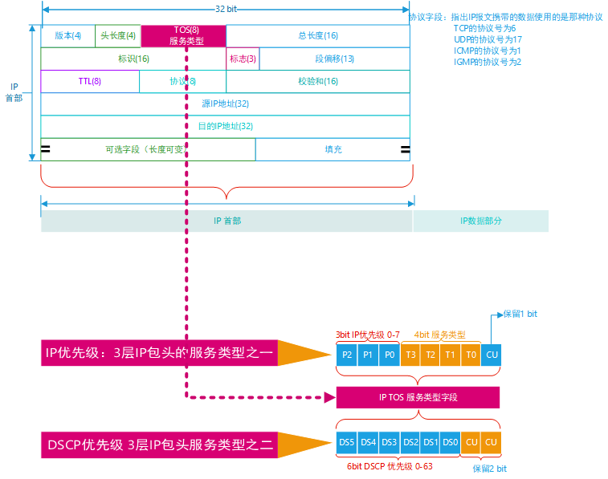
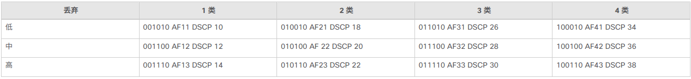

# Linux Qos

## 802.1p优先级

802.1p用户优先级定义在二层802.1Q 标签头中的TCI字段中，有时也称cos优先级，和VLAN ID一起使用，位于高位起16-18bit字段，长度3bit，取值范围0-7，0优先级最低，7优先级最高。


## IP优先级和DSCP优先级



### IPv4优先级


在IPv4的报文头中，TOS字段是1字节，根据RFC1122的定义，IP优先级（IPPrecedence）使用最高3Bit，可定义8个等级，8个优先级的定义如下：

- 111b 对应十进制为7：Network Control 网络控制
- 110b 对应十进制为6：Internetwork Control 网间控制
- 101b 对应十进制为5：Critic 关键
- 100b 对应十进制为4：FlashOverride 疾速
- 011b 对应十进制为3：Flash 闪速
- 010b 对应十进制为2：Immediate 快速
- 001b 对应十进制为1：Priority 优先
- 000b 对应十进制为0：Routine 普通

优先级6和7一般保留给网络控制数据使用，比如路由。
优先级5推荐给语音数据使用。
优先级4由视频会议和视频流使用。
优先级3给语音控制数据使用。
优先级1和2给数据业务使用。
优先级0为缺省标记值。
在标记数据时，既可以使用数值，也可以使用名称（英文名称）。

### DSCP优先级


- DiffServ 使用DS5、DS4和DS3 位进行优先级设置，但是相对于8种IP优先级名字进行了重新命名。

  如下图所示，DS5、DS4和DS3 位 重命名如下，其中优先级4中描述为4类，怎么解释呢？继续往下阅读。

  | 优先级 | 描述                                                |
  | ------ | --------------------------------------------------- |
  | 7      | 保持不变（链路层和路由协议保持活动）CS7 dscp56      |
  | 6      | 保持不变（用于 IP 路由协议）CS6 dscp48              |
  | 5      | 快速转发  EF  dscp 46                               |
  | 4      | 4 类   AF41dscp 34     AF42 dscp36     AF43 dscp 38 |
  | 3      | 3 类   AF41dscp 26     AF42 dscp28     AF33 dscp 30 |
  | 2      | 2 类   AF21dscp 18     AF22 dscp20     AF23 dscp 22 |
  | 1      | 1 类   AF11dscp 10     AF12 dscp12     AF13 dscp 14 |
  | 0      | 尽力 BE dscp 0                                      |

  

- DiffServ 使用DS2、DS1和DS0进一步澄清了定义，通过使用DSCP中的后三位，该定义提供了更精细的粒度。

如上介绍，使用DSCP系统，设备将首先根据类别划分流量的优先级。然后，它会区分同类流量并确定其优先级，并考虑丢弃概率。

DiffServ 标准不指定低、中和高这些丢弃概率的精确定义，但是根据DS2、DS1和DS0这三位，定义了更详细的优先级粒度。下面重点介绍AF和EF类的DSCP。

#### AF类介绍

有保证  Forwarding 

RFC 2597定义了  forwarding  ，有保证的  Forwarding 可保证为AF类提供一定数量的带宽，并允许访问额外的带宽（如果可用）。有 AF1x~ AF4x 这四个 AF 类别。每个类别中有三个丢弃概率。根据给定的网络策略，可以根据所需的吞吐量、延迟、抖动、丢失或访问网络服务的优先级为PHB选择数据包。

1 类到 4 类称为 AF 类别。下表说明了指定具有概率的AF类的DSCP代码。DS5、DS4 和 DS3 位定义了类别；DS2 和 DS1 位指定了丢弃概率；DS0 位始终为零。



下面解释上面提到的优先级4中描述为4类是什么意思？

优先级4即DS5、DS4 和 DS3的值为100b，DS2 、 DS1和DS0(始终为0) 值如下的时候，定义这样的DSCP值为4类DSCP。对，没错，就是一个定义而已。

- DS5~DS3为100b，DS2~DS0为010b 时：为AF41 DSCP值为34  为定义为4类 ，在优先级4中，丢弃概率为低
- DS5~DS3为100b，DS2~DS0为100b时：为AF42 DSCP值为36  为定义为4类，在优先级4中，丢弃概率为中
- DS5~DS3为100b，DS2~DS0为110b时：为AF413 DSCP值为38  为定义为4类 ，在优先级4中，丢弃概率为高

同理在优先级为3、2或者1的时候，后面的什么3类、2类、1类，也是如此解释。

#### EF类介绍

**加速  Forwarding**

RFC 2598定义了加速转发(EF)，可用于通过 DS (DiffServ) 域构建低损耗、低延时和低抖动的确保带宽端到端服务。此类服务对终端的影响类似于点对点连接或“虚拟租用线路”。 此服务也称为高级服务。建议将代码点 101110 用于 EF ，对应的 DSCP 值为 46。


### DSCP和IP优先级对照


从上面的图中也能看出

- AF11、AF21、AF31和AF41对应的`L`丢包率

- AF12、AF22、AF32和AF42对应M丢包率

- AF13、AF23、AF33和AF43对应H丢包率

- TOS=DSCP<<2

- 上表中列出来的是标准协议规定的一些DSCP值，所以0~63 其实没有用完，那些没有用到的值，比如DSCP值为11的时候，找不到对应的服务名字AF多少，那么抓包的时候也显示Unkown，如下：

  

  所以，当我们设置dscp值的时候，尽量按照上面列举出来的数值设置，不要超过这个范围，即使说是0~63，其实是没有用完的。那万一用户不小心设置了没有用的值，比如dscp值11，怎么处理呢，这就和每个交换机厂家有关系了，差异比较大的，所以不建议使用。 

  比如有些地方就是如下图这样规定的，dscp0~7 对应的是0，dscp8~15 对应的是1等等。

  

  


### 修改DSCP值的方式

1. iptables如何修改dscp值

   一般我们可以使用iptables工具修改dscp的值，命令如下：

   ```bash
   # --set-dscp 后面参数范围为0~63
   iptables -t mangle -I FORWARD   -d 192.168.50.140 -j DSCP --set-dscp 48
   ```

   

2. iperf发包的时候修改dscp

   iperf 发包的时候可以打dscp标签，但是是TOS整个字段值，所以如果想设置dscp值为36 必须使用下面的命令

   ```bash
   # 0x90 = 36<<2  要左移2bit
   iperf -c 192.168.50.140  -u -i1 -t9999 -p5001 -S 0x90
   ```

   有线端wireshark抓包的时候，显示的TOS整个字段的值，比如DSCP值为36的时候，抓包看到的数据如下：DSCP:36 TOS:0x90  对应服务为AF42 完全和上面的表对应起来。

   

## 802.11e空口优先级

802.11e协议规定无线端有四个优先级，如下图


802.11e一共可以提供4个不同的优先级，也可以称为接入类别（Access categories），从高到低排序分别是：

1. **语音服务**（Voice，AC_VO）：一般为VoIP流量类型，对延迟最为敏感，同时也是优先级最高的流量。
2. **视频服务**（Video，AC_VI）：视频流量的优先级低于语音服务，高于其他两项。视频服务也是延迟敏感类型的服务，所以具有一定的优先级。
3. **尽力传输**（Best-effort，AC_BE）：默认的无线流量类型就是best-effort类型，比如网页访问的数据流量类型。对于延迟有一定需求，但是没有那么敏感。
4. **背景流量**（Background，AC_BK）：对于延迟要求最不敏感的流量，比如文件传输，打印作业的流量。


## 有线端优先级和无线优先级对应关系

那么有线端数据dscp(或者cos)怎么和80.211e规定的数据队列，对应起来呢？


如上图所示DSCP数值为0~63，分别对应IPv4优先级 0~7 ，也就是下图中的`802.1d user priority`，然后再对应802.11e中规定的4个优先级队列，BK、BE、VI和VO 。


举例说明：

那么不同的有线端数据dscp值，在空口转发的时候，根据802.11e规定，参考上图，入的队列举例如下：

```bash
iptables -t mangle -I FORWARD   -d 192.168.50.140 -j DSCP --set-dscp 18
# 18-》2-》BK队列 
```

```bash
iptables -t mangle -I FORWARD   -d 192.168.50.140 -j DSCP --set-dscp 28
# 28-》3-》BE队列 
```

```bash
iptables -t mangle -I FORWARD   -d 192.168.50.140 -j DSCP --set-dscp 36
# 36-》4-》VI 队列 
```

```bash
iptables -t mangle -I FORWARD   -d 192.168.50.140 -j DSCP --set-dscp 48
# 48-》6-》VO队列 
```


## QoS开发策略


如上图所示，如果想实现Qos控制，有两种策略

### 有线端控制qos

站在STA端为例(AP端一样)，我们可以在数据进入eth1或者准备从eth1网卡出去的时候做文章，比如在Rx上做文章，如下图，我们在Rx方向建立4个优先级的队列，然后根据iptables 把Rx数据进行分类标记，指定他们走不通的队列。


建立队列的方式为tc工具，标记分类Rx数据包的工具为iptebles，大致过程如下：


该方案在openwrt中常用，对应的软件包为qos-scripts或者sqm-scripts

#### 验证测试

todo


### 无线端控制qos

如果不用tc qdisc建立队列，直接使用802.1Q协议，那么我们只需用iptables对有线端数据匹配端口、匹配ip等，然后使用iptables 修改包的dscp值，这样是不是就可以实现对空口包的优先级控制，修改dscp后的数据包，向空口转发，就会经过802.11e协议，匹配无线端的4个队列。比如使用下面命令修改dscp的值。

```bash
iptables -t mangle -I FORWARD   -d 192.168.50.140 -j DSCP --s
et-dscp 48
```

#### 验证试验

- STA 到AP端

  网络拓扑结构如下：

  

  - iperf 发包

    PC1端设置如下

    ```bash
    iperf -c 192.168.50.140  -u -i1 -t9999 -p5001 -b200m
    ```

    PC2端设置如下

    ```bash
    iperf -s  -u -i1 -t9999
    ```

  - STA修改防火墙

    ```
    iptables -t mangle -I FORWARD   -d 192.168.50.140 -j DSCP --set-dscp 18
    # 18-》2-》BK队列 
    ```

    修改完后在web端可以看到规则如下，并且Traffic 流量不断增加，说明iptables匹配成功了。

    

  - 在STA终端输入下面的命令查看，STA端802.11e队列的统计信息

    ```bash
    apstats -v -i ath2|grep "Tx Data Packets per AC" -A 20   # VAP 层面统计信息
    # 或者
    apstats -r -i wifi2|grep "Tx Data Packets per AC" -A 20  # RADIO 层面统计信息
    
    ```

    - 可以看到Background统计信息不断增加。

      

    - 同理修改dscp为28 可以看到Best effort 统计信息不断增加

      

    - 同理修改dscp为36 可以看到Video 统计信息不断增加

      

    - 同理修改dscp为48 可以看到Voice统计信息不断增加

      

  

- AP到STA端，灵活调整发包方向和查看统计信息就行。


