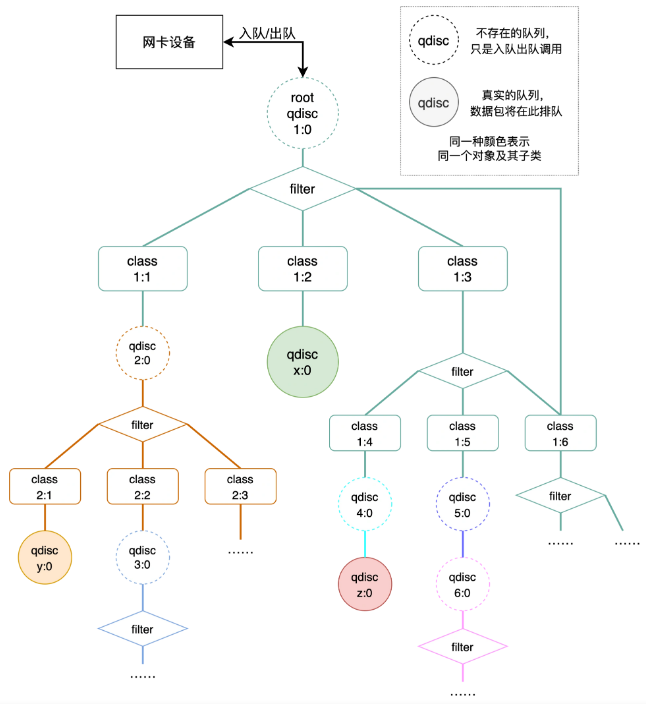

# OpenWrt 流量控制工具tc

## Linux TC(Traffic Control) 简介

### 背景

Linux 操作系统中的流量控制器 TC (Traffic Control) 用于Linux内核的流量控制，它规定建立处理数据包的队列，并定义队列中的数据包被发送的方式，从而实现对流量的控制。

每个网络接口会有一个入队列（ingress）和一个出队列（egress），入队列功能较少。Linux流量控制主要是在输出接口进行处理和实现的。

TC 模块实现流量控制功能使用的排队规则分为两类：无分类排队规则、分类排队规则。无分类排队规则相对简单，而分类排队规则则引出了分类和过滤器等概念，使其流量控制功能增强


### 常用术语

| 术语                                        | 注释                                                         | 其它 |
| ------------------------------------------- | ------------------------------------------------------------ | ---- |
| 队列规则（Queuing Discipline，qdisc）       | 管理设备输入(ingress)或输出(egress)的算法。                  |      |
| 管理设备输入(ingress)或输出(egress)的算法。 | 根队列规则就是直接依附于设备的队列规则                       |      |
| 无类的队列规则（Classless Qdisc）           | 一个内部不包含可配置子类的队列规则                           |      |
| 分类的队列规则（Classiful Qdisc）           | 一个分类的队列规则内可以包含更多的类。其中每个类又进一步地包含一个队列规则，这个队列规则可以是分类的，也可以是无类的。 |      |
| 类（Classes）                               | 一个分类的队列规则可以拥有很多类，类内包含队列规则。         |      |
| 分类器（Classifier）                        | 每个分类的队列规则都需要决定什么样的包使用什么类进行发送。分类器就是做这个用的。 |      |
| 过滤器（Filter）                            | 分类是通过过滤器完成的。一个过滤器包含若干的匹配条件，如果符合匹配条件，就按此过滤器分类。 |      |
| 调度（Scheduling）                          | 分类器的帮助下，一个队列规则可以裁定某些数据包可以排在其他数据包之前发送。这种处理叫做”调度”，比如此前提到的pfifo_fast就是这样的。 |      |
| 整形（Shaping）                             | 在一个数据包发送之前进行适当的延迟，以免超过事先规则好的最大速率，这种处理叫做”整形”。整形在egress处进行。习惯上，通过丢包来降速也经常被称为整形 |      |
| 策略（Policing）                            | 通过延迟或是丢弃数据包来保证流量不超过事先规则的带宽。在Linux中，策略总是规定丢弃数据包而不是延迟，即不存在ingress队列。 |      |
| Work-Conserving                             | 对于一个work-conserving队列规则，如果得到一个数据包，它总是立刻对它进行分发。换句话说，只要网卡(egress队列规则)允许，它就不会延迟数据包的发送 |      |
| non-Work-Conserving                         | 有些队列——比如令牌桶过滤器——可能需要暂时停止发包以实现限制带宽。也就是说它们有时候即使有数据包需要处理，也可能拒绝发送 |      |
|                                             |                                                              |      |

现在我们简单了解了一些术语，让我们看看它们的位置：

TC的整形一般情况下，只能对出口流量(egress)进行。

- 对于wan口来说：下载是ingress，上传是egress
- 对于lan口来说：下载是egress，上传是ingress
- 因此，常规做法是，在lan口做下载流控，在wan口做上传流控


1. 整个大方框表示内核。
2. 最左面的箭头表示从网络上进入计算机的数据包。它们进入Ingress队列规则，并有可能被某些过滤器丢弃即所谓策略（在进入内核之前丢弃数据有利于节约CPU时间）。
3. 数据包顺利通过的话，如果它是发往本地进程的，就会进入IP协议栈处理并提交给该进程。
4. 如果它需要转发而不是进入本地进程，就会发往egress。本地进程也可以发送数据，交给Egress分类器。
5. 然后经过审查，并放入若干队列规则中的一个进行排队。这个过程叫做“入队”。在不进行任何配置的情况下，只有一个egress队列规则——pfifo_fast——总是接收数据包。
6. 数据包进入队列后，就等待内核处理并通过某网卡发送。这个过程叫做“出队”。
7. 这张图仅仅表示了机器上只有一块网卡的情况，图中的箭头不能代表所有情况。每块网卡都有它自己的ingress和egress

### 流量控制组件

流量控制组件主要包括三个

- qdisc 排队规则
  - 无类排队规则
  - 有类排队规则
- class 分类
- filter 过滤器

#### qdisc 排队规则

1. 无类排队规则

   对进入网络设备（网卡）的数据流不加区分统一对待，能够接收数据包以及重新编排、延迟或丢弃数据包。可以对整个网络设备（网卡）的流量进行整形，但不能细分各种情况。

   - pfifo_fast：根据数据包的tos将队列划分到3个band，每个band内部先进先出
   - tbf：Token Bucket Filter，令牌桶过滤器，只允许以不超过事先设定的速率到来的数据包通过 , 但可能允许短暂突发流量朝过设定值
   - sfq：Stochastic Fairness Queueing，随机公平队列，按照会话对流量排序并循环发送每个会话的数据包
   - esfq
   - gred
   - 等等

2. 有类排队规则

   对进入网络设备的数据包根据不同的需求以分类的方式区分对待。对数据包进行分类的工具是过滤器，队列规定就根据过滤器的决定把数据包送入相应的类进行排队。每个子类都可以再次使用它们的过滤器进行进一步的分类。绝大多数分类的队列规定还能够对流量进行整形。这对于需要同时进行调度和流量控制的场合非常有用。

   - prio：分类优先算法并不进行整形 , 它仅仅根据你配置的过滤器把流量进一步细分。缺省会自动创建三个FIFO类。
   - cbq：Class Based Queueing，基于类别排队，借助EWMA(exponential weighted moving average, 指数加权移动均值 ) 算法确认链路的闲置时间足够长 , 以达到降低链路实际带宽的目的。如果发生越限 ,CBQ 就会禁止发包一段时间。
   - htb：Hierarchy Token Bucket，分层令牌桶，在tbf的基础上增加了分层
   - hfsc
   - imq
   - fq_codel
   - 等等

注意：Linux默认的排队规则是pfifo_fast，这是一种比FIFO稍微复杂一点的排队规则。一个网络接口上如果没有设置qdisc，pfifo_fast就作为缺省的qdisc。

#### class 分类

类（class）仅存在于可分类的 qdisc 之下，过滤器（filter）也只能附加在有分类排队规则上。

类组成一个树，理论上能无限扩展。一个类可以仅包含一个叶子qdisc（默认为pfifo_fast），也可以包含多个子类，子类又可以包含一个叶子qdisc或者多个子类。 这就给 Linux 流量控制系统予以了极大的可扩展性和灵活性。

每个 class 和有类 qdisc 都需要一个唯一的标识符，称为句柄（handle）。标识符由一个主编号和一个子编号组成，编号必须是数字。句柄仅供用户使用，内核会使用自己的一套编号来管理流量控制组件对象。习惯上，需要为有子类的qdisc显式的分配一个句柄。

qdisc 的子编号必须为0，而分类的子编号必须是非0值。同一个qdisc对象下所有子类对象的主编号必须相同。

例如 root qdisc句柄为 `1:0`（或者`1:`），它的子类句柄可以为 `1:1`、`1:2`、`1:3`等等。

特别地，ingress qdisc （入队列）的编号总是 `ffff:0`。

#### filter 过滤器

**过滤器（filter）**即根据数据包的某属性进行匹配，进行分类后送到不同的队列上。过滤器能与 有分类qdisc 相关联，也可以和 class 相关联。

过滤器使用**分类器（classifier）**进行数据包匹配，最常用的分类器是 u32 分类器，它可以根据数据包中的各个字段对数据包进行分类，例如源IP等。

**决策器（policer）**只能配合 filter 使用。当流量高于用户指定值时执行一种操作，反之执行另一种操作。在 Linux 流量控制系统中，想要丢弃数据包只能依靠决策器。决策器可以把进入队列的数据包流速限定在一个指定值之下。另外，它也可以配合分类器，丢弃特定类型的数据包。

### 树形结构

对于非叶子节点的qdisc，实际上是一个**不存在的队列**，数据包没有实际在此排队，只是递归调用子类的队列。只有在叶子节点上的队列才是真正能存放发出数据包的队列。



一般为有子类的qdisc显式的分配一个句柄，方便添加过滤器和子类。

root qdisc 只是一个抽象队列，句柄为`1:0`。一个类有且仅有一个叶子 qdisc（可不显示分配句柄），默认为pfifo_fast。这个qdisc也可自行设置，此时就与父节点不再是同一个 qdisc 对象，随后将进行递归调用。若这个类有其他子类，那数据包就会通过类的过滤器进行分类进入子类，如果没有被成功归类，就会被排到这个类的叶子 qdisc 中。

同一个 qdisc 对象中，父节点的 filter 可以直接作用于子孙类，例如图中 root qdisc 的过滤器直接调用句柄为 `1:6` 的类。

数据包流入过程如下：

1. 如上图所示，数据包从网卡进入后，首先经过 `root qdisc 1:0`，此处根上的是可分类队列，则会经过filter分到对应子类中。
2. 若进入 `class 1:2`，则此类的规则生效后，直接进入这个类的叶子 qdisc 排队（默认pfifo_fast）。
3. 若进入 `class 1:1`，则此类的规则生效后，进入一个新的 `qdisc 2:0`，这个qdisc 也是可分类队列，所以数据包会经过filter进入子类，后续过程即递归调用。
4. 若进入`class 1:3`，则规则生效后会经过filter进入此类的子类，注意这里和root qdisc属于同一个对象。如果没有满足的分类规则，数据包会进入此类的默认叶子qdisc排队。
5. 数据包进入 `class 1:4`，这里就会进入新的 `qdisc 4:0`，此qdisc 是无分类队列，所以没有过滤器和子类。这个队列下也可直接接新的无分类队列 `qdisc z:0`（此处是叶子队列，没有显式分配具柄），或者像 class 1:5 一样，`qdisc 5:0` 后接新的可分类队列 `qdisc 6:0`。


### TC工具

在Linux中，流量控制都是通过TC这个工具来完成的。通常，要对网卡进行流量控制的配置，需要进行如下的步骤：

- 为网卡配置一个队列；
- 在该队列上建立分类；
- 根据需要建立子队列和子分类；
- 为每个分类建立过滤器。

TC工具命令一般格式如下：


在Linux中，可以配置很多类型的队列，比如CBQ、HTB等，其中CBQ 比较复杂，不容易理解。HTB(Hierarchical Token Bucket)是一个可分类的队列， 与其他复杂的队列类型相比，HTB具有功能强大、配置简单及容易上手等优点。在TC中，使用`major:minor`这样的句柄来标识队列和类别，其中major和minor都是数字。

对于队列来说，minor总是为0，即`major:0`这样的形式，也可以简写为`major:` 比如，队列`1:0`可以简写为`1:`

需要注意的是：

- major在一个网卡的所有队列中必须是惟一的。
- 对于类别来说，其major必须和它的父类别或父队列的major相同，而minor在一个队列内部则必须是惟一的(因为类别肯定是包含在某个队列中的)。
- 举个例子，如果队列`2:`包含两个类别，则这两个类别的句柄必须是`2:x`这样的形式，并且它们的`x`不能相同，比如`2:1`和`2:2`。

**下面，将以HTB队列为主**，结合需求来讲述TC的使用。假设eth0出口有100mbit/s的带宽，分配给WWW、E-mail和Telnet三种数据流量，其中分配给WWW的带宽为40Mbit/s，分配给Email的带宽为40Mbit/s，分配给Telnet的带宽为20Mbit/S。

  需要注意的是，在TC 中使用下列的缩写表示相应的带宽:

  ◆ Kbps : kilobytes per second，千字节每秒 ;

  ◆ Mbps : megabytes per second，兆字节每秒 ，

  ◆ Kbit : kilobits per second，千比特每秒 ;

  ◆ Mbit : megabits per second， 兆比特每秒 。

#### HTB队列TC工具简单举例

1. 创建HTB队列

   有关队列的TC命令的一般形式为：

   ```bash
   tc qdisc [add | change | replace | link] dev DEV [parent qdisk-id |root] [handle qdisc-id] qdisc [qdisc specific parameters]
   ```

   首先，需要为网卡eth0配置一个HTB队列，使用下列命令：

   ```
   tc qdisc add dev eth0 root handle 1:htb default 11
   ```

   这里，命令中的

   - `add` 表示要添加
   - `dev eth0` 表示要操作的网卡为`eth0`
   - `root` 表示为网卡`eth0`添加的是一个根队列
   - `handle 1:` 表示队列的句柄为`1:` 
   - `htb` 表示要添加的队列为HTB队列。命令最后的`default 11`是htb特有的队列参数，意思是所有未分类的流量都将分配给类别`1:11`

2. 为根队列创建相应的类别

   有关类别的TC 命令的一般形式为:

   ```
   tc class [add | change | replace] dev DEV parent qdisc-id [classid class-id] qdisc [qdisc specific parameters]
   ```

   可以利用下面这三个命令为根队列1创建三个类别，分别是`1:11`、`1:12`和`1:13`，它们分别占用40、40和20mbit/s的带宽。

   ```bash
   tc class add dev eth0 parent 1: classid 1:11 htb rate 40mbit ceil 40mbit
   
   tc class add dev eth0 parent 1: classid 1:12 htb rate 40mbit ceil 40mbit
   
   tc class add dev eth0 parent 1: cllassid 1:13 htb rate 20mbit ceil 20mbit
   ```
   命令中参数解释如下：

   - `parent 1:` 表示类别的父亲为根队列`1:` 
   - `classid1:11` 表示创建一个标识为`1:11`的类别
   - `rate 40mbit` 表示系统将为该类别确保带宽40mbit
   - `ceil 40mbit` 表示该类别的最高可占用带宽为40mbit

   

3. 为各个类别设置过滤器

    有关过滤器的TC 命令的一般形式为：

   ```bash
   tc filter [add | change | replace] dev DEV [parent qdisc-id | root] protocol protocol prio priority filtertype [filtertype specific parameters] flowid flow-id
   ```

    由于需要将WWW、E-mail、Telnet三种流量分配到三个类别，即上述`1:11`、`1:12`和`1:13`，因此，需要创建三个过滤器，如下面的三个命令:

   ```bash
   tc filter add dev eth0 protocol ip parent 1:0 prio 1 u32 match ip dport 80 0xffff flowid 1:11
   
   tc filter add dev eth0 prtocol ip parent 1:0 prio 1 u32 match ip dport 25 0xffff flowid 1:12
   
   tc filter add dev eth0 protocol ip parent 1:0 prio 1 u32 match ip dport 23 oxffff flowid 1:13
   ```
   参数解释如下：

   - `protocol ip`表示该过滤器应该检查报文分组的协议字段。

   - `prio 1` 表示它们对报文处理的优先级是相同的，对于不同优先级的过滤器，系统将按照从小到大的优先级顺序来执行过滤器，对于相同的优先级，系统将按照命令的先后顺序执行。

   - 这几个过滤器还用到了u32选择器来匹配不同的数据流。

     以第一个命令为例，判断的是`dport`字段，如果该字段与Oxffff与操作的结果是80，则`flowid 1:11`表示将把该数据流分配给类别`1:11`

   

#### HTB队列TC工具复杂举例

在上面的例子中， 三种数据流(www、Email、Telnet)之间是互相排斥的。当某个数据流的流量没有达到配额时，其剩余的带宽并不能被其他两个数据流所借用。

下面介绍将涉及如何使不同的数据流可以共享一定的带宽。

首先需要用到HTB的一个特性， 即对于一个类别中的所有子类别，它们将共享该父类别所拥有的带宽，同时，又可以使得各个子类别申请的各自带宽得到保证。这也就是说，当某个数据流的实际使用带宽没有达到其配额时，其剩余的带宽可以借给其他的数据流。而在借出的过程中，如果本数据流的数据量增大，则借出的带宽部分将收回，以保证本数据流的带宽配额。

下面考虑这样的需求，同样是三个数据流WWW、E-mail和Telnet， 其中的Telnet独立分配20Mbit/s的带宽。另一方面，WWW 和SMTP各自分配40Mbit/s的带宽。同时，它们又是共享的关系，即它们可以互相借用带宽。如图所示：


 需要的TC命令如下:

```bash

#增加根队列，未标记数据默认走21
tc qdisc add dev eth0 root handle 1: htb default 21

#创建两个根类别 分别为 1:1 和 1:2 其中1:1 对应Telnet数据流    1:2 对应80Mbit的数据流
tc class add dev eth0 partent 1: classid 1:1 htb rate 20mbit ceil 20mbit
tc class add dev eth0 partent 1: classid 1:2 htb rate 80mbit ceil 80mbit


# 在1:2中创建两个子类别1:21和1:22 分别对应WWW和E-mail数据流，由于类别1:21和1:22是类别1:2的子类别，因此他们可以共享1:2分配的80Mbit带宽
tc class add dev eth0 parent 1:2 classid 1:21 htb rate 40mbit ceil 20mbit
tc class add dev eth0 parent 1:2 classid 1:22 htb rate 40mbit ceil 80mbit

#添加过滤规则 dport&0xffff == 80 的时候走 1:21 WWW协议数据流
tc filter add dev eth0 protocol parent 1:0 prio 1 u32 match ip dport 80 0xffff flowid 1:21

#添加过滤规则 dport&0xffff == 25 的时候走 1:22 E-mail数据流
tc filter add dev eth0 protocol parent 1:0 prio 1 u32 match ip dport 25 0xffff flowid 1:22

#添加过滤规则 dport&0xffff == 23 的时候走 1:1 Telnet数据流
tc filter add dev eth0 protocol parent 1:0 prio 1 u32 match ip dport 23 0xffff flowid 1:1
```


注意：关于Linux的[参考资料](https://openwrt.org/docs/guide-user/network/traffic-shaping/packet.scheduler)https://openwrt.org/docs/guide-user/network/traffic-shaping/packet.scheduler

## Linux TC 带宽管理队列规则

### 无类队列规则

 如前所述，利用队列，我们决定了数据被发送的方式。无类队列能够接收数据和重新编排、延迟或丢弃数据包。 这可以用作对于整个网卡的流量进行整形，而不细分各种情况。在我们进一步学习分类的队列规则之前，理解这部分是必不可少的！

最广泛应用的规则是pfifo_fast队列规则，因为它是缺省配置。还有其他队列规则，后面会有所介绍。每种队列都有它们各自的优势和弱点

#### pfifo_fast

这个队列的特点就像它的名字一样，先进先出（FIFO），也就是说没有任何数据包被特殊处理。

pfifo_fast队列规则作为硬性的缺省设置，不能对它进行配置。

这个队列有3个所谓的频道(band)，FIFO规则应用于每一个频道，

- 如果在0频道有数据包等待发送，1频道的包就不会被处理，1频道和2频道之间的关系也是如此。 内核遵照数据包的TOS标记，把带有**最小延迟标记**的包放进0频道。


内核规则如下：根据数据包的优先权情况，映射到相应的频道。这个映射过程是根据数据包的TOS字节进行的，数据包的TOS、Linux Priority和 Band的对应关系如下：

TOS是这样的：


#### TBF 令牌桶过滤器

##### 原理

令牌桶过滤器(TBF,Token Bucket Filter)是一个简单的队列规则：只允许以不超过事先设定的速率到来的数据包通过，但可能允许短暂突发流量超过设定值。TBF很精确，对于网络和处理器的影响都很小。所以如果您想对一个网卡限速，它应该是最好选择！

在流量整形中，令牌桶算法是一种很常用的整形方法。为了控制队列中数据包出队的速率，就需要精确计算单位时间内出队的数据包数或数据包总大小，而这通常是很复杂的。

为了进行简化，现在一般都使用另一种机制：系统以一定的速率产生令牌，每个数据包（或一个字节）对应一个令牌，只有当令牌充足的时候数据包才能出队。

工作原理如下：

- 系统以固定的速率产生令牌，存放在令牌桶中，令牌桶容量大小是固定的；

- 如果此时没有数据包要发送，那么令牌会慢慢的装满令牌桶，直到满为止；

- 如果此时有数据包发送，那么就从令牌桶中取出令牌，使得数据发送出去；

  这个时候会有三种情况

  - 数据流以等于令牌流的速率到达TBF。这种情况下，每个到来的数据包都能对应一个令牌，然后无延迟地通过队列
  - 数据流以小于令牌流的速度到达TBF。通过队列的数据包只消耗了一部分令牌，剩下的令牌会在桶里积累下来，直到桶被装满。剩下的令牌可以在需要以高于令牌流速率发送数据流的时候消耗掉，这种情况下会发生突发传输。
  - 数据流以大于令牌流的速率到达TBF。这意味着桶里的令牌很快就会被耗尽。导致TBF中断一段时间，称为”越限”（overlimit）。如果数据包持续到来，将发生丢包

  所以为了满足不同情况的数据包发送，一般对于比较恒定的网络流量适合使用较小的令牌桶。经常有突发数据传输的网络则比较适合使用大的令牌桶，除非流量整形的目的是为了限制突发数据传输。

  概括来说，系统会以恒定的速率产生令牌，直到令牌桶满了为止。令牌桶能够在保证较长一段时间内网络流量在限制值以下，又能处理大速率的突发数据传输。

##### TBF参数

| 参数                                                  | 说明                                                         |
| ----------------------------------------------------- | ------------------------------------------------------------ |
| limit/latency                                         | limit确定允许最多有多少数据（字节数）在队列中等待令牌。你也可以通过设置latency来指定这个参数，latency参数确定了一个包在TBF中等待传输的最长等待时间。两者计算决定桶的大小、速率和峰值速率 |
| burst/buffer/maxburst                                 | 桶的大小，以字节计。这个参数指定了最多可以有多少个令牌能够即刻被使用。通常，管理的带宽越大，需要的缓冲器就越大。在Intel体系上，10Mbit/s的速率需要至少10k字节的缓冲区才能达到期望的速率 |
| MPU                                                   | 一个零长度的包并不是不耗费带宽。比如以太网，数据帧不会小于64字节。MPU(Minimum Packet Unit，最小分组单元)决定了令牌的最低消耗 |
| rate                                                  | 速度操纵杆。参见上面的limit。如果桶里存在令牌而且允许没有令牌，相当于不限制速率（缺省情况）。如果不希望这样，可以调入以下参数 |
| peakrate（峰值速率）                                  | 如果有可用的令牌，数据包一旦到来就会立刻被发送出去，就像光速一样。那可能并不是你希望的，特别是你有一个比较大的桶的时候。峰值速率可以用来指定令牌以多快的速度被删除。用书面语言来说，就是：释放一个数据包，然后等待足够的时间后再释放下一个。我们通过计算等待时间来控制峰值速率。例如：UNIX定时器的分辨率是10毫秒，如果平均包长10kb，我们的峰值速率被限制在了1Mbps |
| MTU(Maximum Transmission Unit, 最大传输单元)/minburst | 但是如果你的常规速率比较高，1Mbps的峰值速率就需要调整。要实现更高的峰值速率，可以在一个时钟周期内发送多个数据包。最有效的办法就是：再创建一个令牌桶！这第二个令牌桶缺省情况下为一个单个的数据包，并非一个真正的桶。 |

##### 令牌桶配置范例

```bash
tc qdisc add dev eth0 root tbf rate 220kbit latency 50ms burst 1540
```

或者下面的操作

```
# cat tbf.tcc
/*
* 在 eth0 设备上创建一个令牌桶排队规则，将流量整形为 256kbit/s
*
*/
dev eth0 {
egress {
tbf( rate 256 kbps, burst 20 kB, limit 20 kB, mtu 1514 B );
}
}
# tcc < tbf.tcc
# ================================ Device eth0 ================================
tc qdisc add dev eth0 handle 1:0 root dsmark indices 1 default_index 0
tc qdisc add dev eth0 handle 2:0 parent 1:0 tbf burst 20480 limit 20480 mtu 1514 rate
32000bps
```

#### 随机公平队列SFQ

SFQ(Stochastic Fairness Queueing，随机公平队列)简单实现公平队列算法。它的精确性不如其它的方法，但是它在实现高度公平的同时，需要的计算量却很少。

SFQ的关键词是会话或流，主要针对一个TCP会话或者UDP流。流量被分成相当多数量的FIFO队列中，每个队列对应一个会话。数据按照简单轮转的方式发送，每个会话都按顺序得到发送机会。

这种方式非常公平，保证了每一个会话都不会没其它会话所淹没。SFQ之所以被称为“随机”，是因为它并不是真的为每一个会话创建一个队列，而是使用一个散列算法，把所有的会话映射到有限的几个队列中去。因为使用了散列，所以可能多个会话分配在同一个队列里，从而需要共享发包的机会，也就是共享带宽。为了不让这种效应太明显，SFQ会频繁地改变散列算法，以便把这种效应控制在几秒钟之内。

有很重要的一点需要声明：只有当你的输出网卡确实已经挤满了的时候，SFQ才会起作用！否则在你的Linux机器中根本就不会有队列，SFQ也就不会起作用。稍后我们会描述如何把SFQ与其它的队列规则结合在一起，以保证两种情况下都有比较好的结果。

特别地，在你使用DSL modem或者cable modem的以太网卡上设置SFQ而不进行任何进一步地流量整形是无谋的！

| 参数    | 说明                                                         |
| ------- | ------------------------------------------------------------ |
| perturb | 多少秒后重新配置一次散列算法。如果取消设置，散列算法将永远不会重新配置（不建议这样做）。10秒应该是一个合适的值 |
| quantum | 一个流至少要传输多少字节后才切换到下一个队列。缺省设置为一个最大包的长度(MTU的大小)。不要设置这个数值低于MTU |

如果你有一个网卡，它的链路速度与实际可用速率一致，比如一个电话Modem，如下配置可以提高公平性：

```bash
tc qdisc add dev eth0 root sfq perturb 10
tc -s -d qdisc ls

qdisc sfq 800c: dev ppp0 quantum 1514b limit 128p flows 12023年02月07日24 perturb 10sec
  Sent 4812 bytes 62 pkts (dropped 0, overlimits 0)

#“800c:”这个号码是系统自动分配的一个句柄号（handle），“limit”意思是这个队列中可以有128个数据包排队等待。一共可以有1024个散列目标可以用于速率审计，而其中128个可以同时激活。(no more packets fit in the queue!)每隔10秒种散列算法更换一次。
```

 #### 扩展的随机公平队列 ESFQ

从概念上来说，虽然这个排队规则给了用户比 SFQ 更多的可设定参数，但是它和 SFQ 没有本质上的区别。这个排队规则让用户能够调整散列算法的细节，以便更好地分配网络资源，弥补 SFQ 的不足。

```
esfq [ perturb 秒 ] [ quantum 字节 ] [ depth FLOWS ][ divisor 散列位 ] [ limit PKTS ] [ hash 散列类型]
Where:
散列类型 := { classic | src | dst }
```

todo：完善示例

#### GRED 早期随机丢包

todo：完善示例

### 分类的队列规则

如果你有多种数据流需要进行区别对待，分类的队列规则就非常有用了。其中一种叫CBQ(Class Based Queueing，基于类的队列)经常被提起，以至于大家认为CBQ就是鉴别队列是否分类的标准，这是不对的，CBQ不过是家族中年纪最大的孩子而已，同时也是最复杂的。它并不能为你做所有你想做的事情。


队列规则的句柄有两个部分：一个主号码和一个次号码。习惯上把根队列规则称为`1:` 等价于`1:0`，队列规则的次号码永远是0， 类的主号码必须与它们父辈的主号码一致。

下图给出一个典型的分层关系


  数据包是在根队列规则处入队和出队的，而内核只与“根”打交道。

 一个数据包可能是按照下面这个链状流程进行分类的：

```
  1: -> 1:1 -> 12: -> 12:2
```

数据包现在应该处于`12:2`下属的某个队列规则中的某个队列中。在这个例子中，树的每个节点都附带着一个过滤器，用来选择下一步进入哪个分支。这样比较直观。然而，这样也是允许的：

```
1: -> 12:2
```

也就是说，根所附带的一个过滤器要求把数据包直接交给`12:2`

#### PRIO队列规则

PRIO队列规则并不进行流量整形，它仅仅根据配置的过滤器把流量进一步细分。你可以认为PRIO队列规则是pfifo_fast的一种衍生物，区别在每个频道都是一个单独的类，而非简单的FIFO。

当数据包进入PRIO队列规则后，根据你给的过滤器设置选择一个类，缺省情况下有三个类。这些类仅包含纯FIFO队列规则而没有更多的内部结构。你可以把它们替换成你需要的任何队列规则。

每当有一个数据包需要出队时，首先处理:1类。只有当标号更小的类中没有需要处理的数据时，才会处理标号更大的类。

当你希望不仅仅依靠包的TOS，而是想使用TC所提供的更强大的功能来进行数据包的优先权划分时，可以使用这个队列规则。它也可以包含更多的队列规则，而pfifo_fast却只能包含简单的fifo队列规则。

因为它不进行整形，所以使用时与SFQ有相同的考虑：要么确保这个网卡的带宽确实已经占满，要么把它包含在一个能够整形的分类的队列规则的内部。严格地说，PRIO队列规则是一种Work-Conserving调度

| 参数    | 说明                                                         |
| ------- | ------------------------------------------------------------ |
| bands   | 创建频道的数目。每个频道实际上就是一个类。如果你修改了这个数值，你必须同时修改 |
| priomap | 如果你不给TC提供任何过滤器，PRIO队列规则将参考TC_PRIO的优先级来决定如何给数据包入队，它的行为就像前面提到过的pfifo_fast队列规则（先入先出） |

其实频道是类，缺省情况下命名为`主标号:1`到`主标号:3`。如果你的PRIO队列规则是`12:` ，把数据包过滤到`12:1`将得到最高优先级。注意：0频道的次标号是1；1频道的次标号是2，以此类推。

我们想创建这样一个树，大批量数据使用`30:`，交互数据使用`20:`或`10:`


```bash
#这个命令立即创建了类：1:1, 1:2, 1:3
tc qdisc add dev eth0 root handle 1: prio

tc qdisc add dev eth0 parent 1:1 handle 10: sfq

tc qdisc add dev eth0 parent 1:2 handle 20: tbf rate 20kbit buffer 1600 limit 3000

tc qdisc add dev eth0 parent 1:3 handle 30: sfq
```


测试如下：

使用tos标记的工具，用eth0发送一些低优先级的数据

```bash
#tc -s qdisc ls dev eth0

      qdisc sfq 30: quantum 1514b

      Sent 384228 bytes 274 pkts (dropped 0, overlimits 0)

 

      qdisc tbf 20: rate 20Kbit burst 1599b lat 667.6ms

      Sent 2640 bytes 20 pkts (dropped 0, overlimits 0)

 

      qdisc sfq 10: quantum 1514b

      Sent 2230 bytes 31 pkts (dropped 0, overlimits 0)

 

      qdisc prio 1: bands 3 priomap 1 2 2 2 1 2 0 0 1 1 1 1 1 1 1 1

      Sent 389140 bytes 326 pkts (dropped 0, overlimits 0)
```

如你所见，所有的流量都是经过`30:`处理的，优先权最低。

现在我们验证一下交互数据传输经过更高优先级的频道（使用tos标记工具发送一些高优先级的数据）

```bash
#tc -s qdisc ls dev eth0

      qdisc sfq 30: quantum 1514b

      Sent 384228 bytes 274 pkts (dropped 0, overlimits 0)

 

      qdisc tbf 20: rate 20Kbit burst 1599b lat 667.6ms

      Sent 2640 bytes 20 pkts (dropped 0, overlimits 0)

 

      qdisc sfq 10: quantum 1514b

      Sent 14926 bytes 193 pkts (dropped 0, overlimits 0)

 

      qdisc prio 1: bands 3 priomap 1 2 2 2 1 2 0 0 1 1 1 1 1 1 1 1

      Sent 401836 bytes 488 pkts (dropped 0, overlimits 0)
```

工作正常，所有额外的流量都是经`10:`这个更高优先级的队列规则处理的。与先前的测试不同，没有数据经过最低优先级的队列规则。

#### CBQ 基于类的队列

CBQ是最复杂、最琐碎、最难以理解、最刁钻的队列规则。这并不是因为其作者的恶毒或者不称职，而是因为CBQ算法本身的不精确，而且与Linux的内在机制不协调造成的。  除了可以分类之外，CBQ也是一个整形器，但是从表面上看来工作得并不好。它应该是这样的：如果你试图把一个10Mbps的连接整形成1Mbps的速率，就应该让链路90%的时间处于闲置状态，必要的话我们就强制，以保证90%的闲置时间。

但闲置时间的测量非常困难，所以CBQ就采用了它一个近似值，来自硬件层的两个传输请求之间的毫秒数来代替它。这个参数可以近似地表现这个链路的繁忙程度。

**CBQ整形的细节**

CBQ的工作机制是确认链路的闲置时间足够长，以达到降低链路实际带宽的目的。为此，它要计算两个数据包的平均发送间隔， 操作期间，有效闲置时间的测量使用EWMA(exponential weighted moving average，指数加权移动均值)算法，也就是说最近处理的数据包的权值比以前的数据包按指数增加。UNIX的平均负载也是这样算出来的。 计算出来的平均时间值减去EWMA测量值，得出的结果叫做“avgidle”。最佳的链路负载情况下，这个值应当是0：数据包严格按照计算出来的时间间隔到来。

在一个过载的链路上，avgidle值应当是负的。如果这个负值太严重，CBQ就会暂时禁止发包，称为”overlimit”(越限)。

相反地，一个闲置的链路应该有很大的avgidle值，这样闲置几个小时后，会造成链路允许非常大的带宽通过。为了避免这种局面，我们用maxidle来限制avgidle的值不能太大。

理论上讲，如果发生越限，CBQ就会禁止发包一段时间(长度就是事先计算出来的传输数据包之间的时间间隔)，然后通过一个数据包后再次禁止发包。但是最好参照下面的minburst参数。

**配置参数**

| 参数      | 说明                                                         |
| --------- | ------------------------------------------------------------ |
| avpkt     | 平均包大小，单位是字节。计算maxidle（最大闲置）时需要，maxidle从maxburst得出 |
| bandwidth | 网卡的物理带宽，用来计算闲置时间                             |
| cell      | 一个数据包被发送出去的时间可以是基于包长度而阶梯增长的。一个800字节的包和一个806字节的包可以认为耗费相同的时间。也就是说它用作设置时间力度。通常设置为8，必须是2的整数次幂 |
| maxburst  | 这个参数的值决定了计算maxidle所使用的数据包的个数。在avgidle跌落到0之前，这么多的数据包可以突发传输出去。这个值越高，越能够容纳突发传输。你无法直接设置maxidle的值，必须通过这个参数来控制 |
| minburst  | 如前所述，发生越限时CBQ会禁止发包。实现这个的理想方案是根据事先计算出的闲置时间进行延迟之后，发一个数据包。然而，UNIX的内核一般来说都有一个固定的调度周期(一般不大于10ms)，所以最好是这样：禁止发包的时间稍长一些，然后突发性地传输minburst个数据包,而不是一个一个地传输。等待的时间叫做offtime。从大的时间尺度上说，minburst值越大，整形越精确。但是，从毫秒级的时间尺度上说，就会有越多的突发传输 |
| minidle   | 如果avgidle值降到0，也就是发生了越限，就需要等待，直到avgidle的值足够大才发送数据包。为避免因关闭链路太久而引起的以外突发传输，在avgidle的值太低的时候会被强制设置为minidle的值。参数minidle的值是以负微秒记的。所以10代表avgidle被限制在-10us上 |
| mpu       | 最小分组大小——因为即使是0长度的数据包，在以太网上也要生成封装成64字节的帧，而需要一定时间去传输。为了精确计算闲置时间，CBQ需要知道这个值。 |
| rate      | 期望中的传输速率。也就是“速度操纵杆”！在CBQ的内部有很多的微调参数。比如，那些已知队列中没有数据的类就不参加计算、越限的类将被惩罚性地降低优先级等等。都非常巧妙和复杂。 |

CBQ还可以象PRIO队列那样，把各种类赋予不同的优先级，优先权数值小的类会比优先权值大的类被优先处理。每当网卡请求把数据包发送到网络上时，都会开始一个WRR(weighted round robin，加权轮转)过程，从优先权值小的类开始。那些队列中有数据的类就会被分组并被请求出队。在一个类收到允许若干字节数据出队的请求之后，再处理下一个相同优先权值的类。

下面是控制WRR过程的一些参数

| 参数   | 说明                                                         |
| ------ | ------------------------------------------------------------ |
| allot  | 当从外部请求一个CBQ发包的时候，它就会按照“priority（prio）”参数指定的顺序轮流尝试其内部的每一个类的队列规则。当轮到一个类发数据时，它只能发送一定量的数据。“allot”参数就是这个量的基值。更多细节请参照“weight”参数 |
| prio   | CBQ可以象PRIO设备那样工作。其中“prio”值较低的类只要有数据就必须先服务，其他类要延后处理 |
| weight | “weight”参数控制WRR过程。每个类都轮流取得发包的机会。如果其中一个类要求的带宽显著地高于其他的类，就应该让它每次比其他的类发送更多的数据（以字节为单位，可以理解为偏袒数量，例如weight 200Kbit就相当于每次处理优先级的数据比普通数据多处理200Kbit）。CBQ会把一个类下面所有的weight值加起来后归一化，所以数值可以任意定，只要保持比例合适就可以。人们常把“速率/10”作为参数的值来使用，实际工作得很好。归一化值后的值乘以“allot”参数后，决定了每次传输多少数据。 |

决定链路的共享和借用的CBQ参数，除了纯粹地对某种数据流进行限速之外，CBQ还可以指定哪些类可以向其它哪些类借用或者出借一部分带宽

| 参数             | 说明                                                         |
| ---------------- | ------------------------------------------------------------ |
| Isolated/Sharing | isolated字面意思：独立，单独的。凡是使用“isolated”选项配置的类，就不会向其兄弟类借出带宽。如果你的链路上同时存在着不友好的人，你就可以使用这个选项，选项“sharing”是“isolated”的反义选项 |
| Bounded/Borrow   | bounded字面意思：受限制的，有限的；borrow=借入。一个类也可以用“bounded”选项配置，意味着它不会向其兄弟类借入带宽。选项“borrow”是“bounded”的反义选项。一个典型的情况就是你的一个链路上有多个客户都设置成了“isolated”和“bounded”，那就是说他们都被限制在其要求的速率之下，且互相之间不会借用带宽（就是我们常说的带宽独享）。在这样的一个类的内部的子类之间是可以互相借用带宽的 |

**配置范例**


这个配置把WEB服务器的流量控制为5mbit、SMTP流量控制在3mbit上。而且二者一共不得超过6mbit，互相之间允许借用带宽。我们的网卡是100Mbps的。

```bash
#设置根队列
tc qdisc add dev eth0 root handle 1:0 cbq bandwidth 100Mbit avpkt 1000 cell 8

#创建类1:1 带宽不能超过6Mbps。
tc class add dev eth0 parent 1:0 classid 1:1 cbq bandwidth 100Mbit rate 6Mbit weight 0.6Mbit prio 8 allot 1514 cell 8 maxburst 20 avpkt 1000 bounded

#在1:1上创建 1:3 和 1:4
tc class add dev eth0 parent 1:1 classid 1:3 cbq bandwidth 100Mbit rate 5Mbit weight 0.5Mbit prio 5 allot 1514 cell 8 maxburst 20 avpkt 1000 # 最大5m 走WEB

tc class add dev eth0 parent 1:1 classid 1:4 cbq bandwidth 100Mbit rate 3Mbit weight 0.3Mbit prio 5 allot 1514 cell 8 maxburst 20 avpkt 1000 #最大3m 走 SMTP
```

我们建立了2个类`1:3`和`1:4`。注意如何根据带宽来调整weight参数的。

两个类都没有配置成`bounded`，但它们都连接到了类`1:1`上，而`1:1`设置了 `bounded`。所以两个类的总带宽不会超过6Mbps。别忘了，同一个CBQ下面的子类的主号码都必须与CBQ自己的号码相一致！

```bash
#缺省情况下，两个类都有一个FIFO队列规则。但是我们把它换成SFQ队列，以保证每个数据流都公平对待。
tc qdisc add dev eth0 parent 1:3 handle 30: sfq

tc qdisc add dev eth0 parent 1:4 handle 40: sfq
```


```bash
# 这些命令规则了根上的过滤器，保证数据流被送到正确的队列规则中去
tc filter add dev eth0 parent 1:0 protocol ip prio 1 u32 match ip sport 80 0xffff flowid 1:3 #  走WEB

tc filter add dev eth0 parent 1:0 protocol ip prio 1 u32 match ip sport 25 0xffff flowid 1:4 # 走 SMTP
```

你可能想知道，那些没有被那两条规则分类的数据流怎样处理了呢？从这个例子来说，它们被1:0直接处理，没有限制。

如果SMTP+web的总带宽需求大于6Mbps，那么这6M带宽将按照两个类的weight参数的比例情况进行分割：WEB服务器得到 5/8的带宽，SMTP得到3/8的带宽。从这个例子来说，可以这么认为：WEB数据流总是会得到5/8*6Mbps=3.75Mbps的带宽。

**其它CBQ参数**：split和defmap （split：分离、分裂）

如前所述，一个分类的队列规定需要调用过滤器来决定一个数据包应该发往哪个类去排队。除了调用过滤器，CBQ还提供了其他方式，defmap和split。很难掌握，但好在无关大局。但是现在是解释defmap和split的最佳时机，我会尽力解释。
因为你经常是仅仅需要根据TOS来进行分类，所以提供了一种特殊的语法。当CBQ需要决定了数据包要在哪里入队时，要检查这个节点是否为“split节 点”。如果是，子队列规定中的一个应该指出它接收所有带有某种优先权值的数据包，权值可以来自TOS字段或者应用程序设置的套接字选项。
数据包的优先权位与defmap字段的值进行“或”运算来决定是否存在这样的匹配。换句话说，这是一个可以快捷创建仅仅匹配某种优先权值数据包的过滤器的方法。如果defmap等于0xff，就会匹配所有包，0则是不匹配。下面的实例可以帮助理解：

```bash
tc qdisc add dev eth1 root handle 1: cbq bandwidth 10Mbit allot 1514 cell 8 avpkt 1000 mpu 64
tc class add dev eth1 parent 1:0 classid 1:1 cbq bandwidth 10Mbit rate 10Mbit allot 1514 cell 8 weight 1Mbit prio 8 maxburst 20 avpkt 1000

#注意这里的split 1:0 defmap c0 即11000000b
tc class add dev eth1 parent 1:1 classid 1:2 cbq bandwidth 10Mbit rate 1Mbit allot 1514 cell 8 weight 100Kbit prio 3 maxburst 20 avpkt 1000 split 1:0 defmap c0

#注意这里的split 1:0 defmap 3f 即00111111b
tc class add dev eth1 parent 1:1 classid 1:3 cbq bandwidth 10Mbit rate 8Mbit allot 1514 cell 8 weight 800Kbit prio 7 maxburst 20 avpkt 1000 split 1:0 defmap 3f
```

针对tos字段如下


上述代码split队列规定`1:0`，也就是做出选择的地方是`1:0`，即`1:0`的prio6和prio7 进`1:2`（11000000b bit6和bit7置位，对应tos的110和111匹配，和defmap值按位或的缘故），即`1:0`的prio0~5进`1:3`（00111111b 对应tos的其他优先级 ，同理和defmap值按位或的缘故），如下节点1:0现在应该有了这样一个表格：


#### HTB 分层令牌桶

Martin Devera 意识到CBQ太复杂，而且并没有按照多数常见情况进行优化。他的Hierarchical能够很好地满足这样一种情况：你有一个固定速率的链路，希望分割给多种不同的用途使用。为每种用途做出带宽承诺并实现定量的带宽借用。

HTB就象CBQ一样工作，但是并不靠计算闲置时间来整形。它是一个分类的令牌桶过滤器。它只有很少的参数，并且在它的网站能够找到很好的文档。

随着你的HTB配置越来越复杂，你的配置工作也会变得复杂。但是使用CBQ的话，即使在很简单的情况下配置也会非常复杂！HTB3 已经成了官方内核的一部分。然而，你可能仍然要为你的tc命令打上HTB3支持补丁，否则你的tc命令不理解HTB3。如果你已经有了一个新版内核或者已经打了补丁，请尽量考虑使用HTB。

**配置范例**

把WEB服务器的流量控制为5Mbps、SMTP流量控制在3Mbps上。而且二者一共不得超过6Mbps，互相之间允许借用带宽。我们的网卡是100Mbps的。

```
# tc qdisc add dev eth0 root handle 1: htb default 30
# tc class add dev eth0 parent 1: classid 1:1 htb rate 6mbit burst 15k
# tc class add dev eth0 parent 1:1 classid 1:10 htb rate 5mbit burst 15k
# tc class add dev eth0 parent 1:1 classid 1:20 htb rate 3mbit ceil 6mbit burst 15k
# tc class add dev eth0 parent 1:1 classid 1:30 htb rate 1kbit ceil 6mbit burst 15k
```

作者建议在那些类的下方放置SFQ：

```
# tc qdisc add dev eth0 parent 1:10 handle 10: sfq perturb 10
# tc qdisc add dev eth0 parent 1:20 handle 20: sfq perturb 10
# tc qdisc add dev eth0 parent 1:30 handle 30: sfq perturb 10
```

添加过滤器，直接把流量导向相应的类：

```
# U32="tc filter add dev eth0 protocol ip parent 1:0 prio 1 u32"
# $U32 match ip dport 80 0xffff flowid 1:10
# $U32 match ip sport 25 0xffff flowid 1:20
```

HTB完成得相当不错，如果`10:`和`20:`都得到了保证的速率，剩下的就是分割了，它们借用的比率是`5:3`，正如你期望的那样。未被分类的流量被送到了`30:`,仅有一点点带宽，但是却可以任意借用剩下的带宽。因为我们内部使用了SFQ，而可以公平发包。

#### HFSC 分层公平服务曲线

HFSC提供四种服务曲线

1. rt : 为实时服务曲线
2. ls : 为链接分享服务曲线
3. sc : rt+ls服务曲线（由rt与ls共同服务）
4. ul : 为上限服务曲线

**注意**：

- 一个叶类别可以同时指派rt及ls曲线，
- 子类别只能有一个ls曲线。
- 至少一个rt,ls或sc必须被指定，ul只能在ls或sc下使用


为了在各种情况下都能够确保最低延迟时间，分离成两个标准是必要的。以结果而言，这也表示即使已经短暂超过上层子类别link-sharing曲线之限制，仍然可以根据叶类别的即时保证继续发送封包。


tc命令关于hsfc一般格式:

1. 将 qdisc 分配给网络接口，以及默认类的可选规范

   ```
   tc qdisc add dev $dev root handle $ID: hfsc [default $classID ] 
   ```

   

2. 用连续的类添加来构建类层次结构

   ```
   tc add class dev $dev parent parentID classid $ID hfsc [ [ rt  SC ] [ ls  SC ] | [ sc  SC ] ]  [ ul  SC ]
   ```

   

3. 层次结构最底层的类可以分配一条实时曲线 (rt) 和一条链接共享曲线 (ls)，其中内部类只能有一条链接共享曲线。通过使用 ul 服务曲线，可以定义实际呈现给每个类的服务的上限。可以指定一条 sc 曲线，而不是指定两条相同的 rt 和 ls 曲线。服务曲线由其传输率描述，传输率与曲线的斜率相关。如果曲线由两部分组成，则可以用 dmax 指定特定传输速率下的最大延迟 umax。

   ```bash
   tc qdisc add ... hfsc [ default CLASSID ]
   
   tc class add ... hfsc [ [ rt SC ] [ ls SC ] | [ sc SC ] ] [ ul SC ]
   
   四种服务类型
   #rt : realtime service curve
   #ls : linkshare service curve(百分比)
   #sc : rt+ls service curve
   #ul : upperlimit service curve
   
   #注意
   # 在least下至少指定 rt, ls 或者 sc 其中一个
   # 只有ls或者 sc指定了 才可以使用ul参数
   
   
   #SC含义
   SC := [ [ m1 BPS ] d SEC ] m2 BPS
   #m1 : slope of the first segment   # 第一段的斜率
   #d  : x-coordinate of intersection # x轴为时间，单位us
   #m2 : slope of the second segment  # 第二段的斜率
   
   #替代格式
   SC := [ [ umax BYTE ] dmax SEC ] rate BPS
   #umax : maximum unit of work
   #dmax : maximum delay
   #rate : rate
   ```

   

**举例**

还是针对刚刚提到的图


```
tc qdisc add dev eth0 root handle 1: hfsc
tc class add dev eth0 parent 1: classid 1:1 hfsc sc rate 1000kbit ul rate 1000kbit
tc class add dev eth0 parent 1:1 classid 1:10 hfsc sc rate 500kbit ul rate 1000kbit
tc class add dev eth0 parent 1:1 classid 1:20 hfsc sc rate 500kbit ul rate 1000kbit
tc class add dev eth0 parent 1:10 classid 1:11 hfsc sc umax 1500b dmax 53ms rate 400kbit ul rate 1000kbit
tc class add dev eth0 parent 1:10 classid 1:12 hfsc sc umax 1500b dmax 30ms rate 100kbit ul rate 1000kbit
```

[参考](http://linux-ip.net/articles/hfsc.en/)http://linux-ip.net/articles/hfsc.en/

#### IMQ(Intermediate queueing device,中介队列设备)

中介队列设备不是一个队列规定，但它的使用与队列规定是紧密相连的。

就Linux而言，队列规定是附带在网卡上的，所有在这个网卡上排队的数据都排进这个队列规定。所以出现了两个局限：

1. 只能进行出口整形(虽然也存在入口队列规定，但在上面实现分类的队列规定的可能性非常小)。
2. 一个队列规定只能处理一块网卡的流量，无法设置全局的限速。

IMQ就是用来解决上述两个局限的。简单地说，你可以往一个队列规定中放任何东西。被打了**特定标记**的数据包在netfilter的`NF_IP_PRE_ROUTING` 和`NF_IP_POST_ROUTING`两个钩子函数处被拦截，并被送到一个队列规定中，该队列规定附加到一个IMQ设备上。对数据包打标记要用到`iptables`的处理方法。

这样你就可以对刚刚进入网卡的数据包打上标记进行入口整形，或者把网卡们当成一个个的类来看待而进行全局整形设置。你还可以做很多事情，比如：把http流量放到一个队列规定中去、把新的连接请求放到一个队列规定中去。

**配置范例**

我们首先想到的是进行入口整形，以便让你自己得到高保证的带宽?。就象配置其它网卡一样：

```
tc qdisc add dev imq0 root handle 1: htb default 20
tc class add dev imq0 parent 1: classid 1:1 htb rate 2mbit burst 15k
tc class add dev imq0 parent 1:1 classid 1:10 htb rate 1mbit
tc class add dev imq0 parent 1:1 classid 1:20 htb rate 1mbit
tc qdisc add dev imq0 parent 1:10 handle 10: pfifo
tc qdisc add dev imq0 parent 1:20 handle 20: sfq
tc filter add dev imq0 parent 10:0 protocol ip prio 1 u32 match ip dst 10.0.0.230/32 flowid 1:10
```

在这个例子中，使用了u32进行分类。其它的分类器应该也能实现。然后，被打上标记的包被送到imq0排队

```
iptables -t mangle -A PREROUTING -i eth0 -jIMQ --todev 0
ip link set imq0 up
```

iptables的IMQ处理方法只能用在PREROUTING和POSTROUTING链的mangle表中，语法如下：

```bash
IMQ [ --todev n ]
#n: imq设备的编号
```

**注意**：如果数据流是事后才匹配到IMQ处理方法上的，数据就不会入队。数据流进入imq的确切位置取决于这个数据流究竟是流进的还是流出的。下面是netfilter（也就是iptables）在内核中预先定义优先级

```c
enum nf_ip_hook_priorities {
    NF_IP_PRI_FIRST = INT_MIN,
    NF_IP_PRI_CONNTRACK = -200,
    NF_IP_PRI_MANGLE = -150,
    NF_IP_PRI_NAT_DST = -100,
    NF_IP_PRI_FILTER = 0,
    NF_IP_PRI_NAT_SRC = 100,
    NF_IP_PRI_LAST = INT_MAX,
};
```

- 对于流入的包，imq把自己注册为优先权等于`NF_IP_PRI_MANGLE+1`，也就是说数据包在经过了`PREROUTING`链的mangle表之后才进入imq设备。
- 对于流出的包，imq使用优先权等于`NF_IP_PRI_LAST`，也就是说不会白白处理本应该被filter表丢弃的数据包。

#### fq_codel

[参考](https://blog.csdn.net/weixin_39838362/article/details/116987267)http://www.taodudu.cc/news/show-4347372.html

[参考](https://blog.csdn.net/weixin_39838362/article/details/116987267)https://blog.csdn.net/weixin_39838362/article/details/116987267


### 使用过滤器对数据包进行分类

为了决定用哪个类处理数据包，必须调用所谓的`分类器链` 进行选择。这个链中包含了这个分类队列规则所需的所有过滤器。


当一个数据包入队的时候，每一个分支处都会咨询过滤器链如何进行下一步。典型的配置是在`1:1`处有一个过滤器把数据包交给`12:`，然后`12:`处的过滤器在把包交给`12:2`。
你可以把后一个过滤器同时放在`1:1`处，得到效率的提高。
另外，你不能用过滤器把数据包向“上”送。而且，使用HTB的时候应该把所有的规则放到根上！
再次强调：数据包只能向“下”进行入队操作！只有出队的时候才会上到网卡所在的位置来。他们不会落到树的最底层后送到网卡！

#### 过滤器的一些简单范例

 我们有一个PRIO队列规定，叫做`10:`，包含3个类，我们希望把去往22口的数据流发送到最优先的频道中去。应该这样设置过滤器：

```bash
#向eth0上的10:节点添加一个u32过滤规则，它的优先权是1：凡是去往22口（精确匹配）的IP数据包，发送到频道10:1。
tc filter add dev eth0 protocol ip parent 10: prio 1 u32 match ip dport 22 0xffff flowid 10:1
#向eth0上的10:节点添加一个u32过滤规则，它的优先权是1：凡是来自80口（精确匹配）的IP数据包，发送到频道10:1。
tc filter add dev eth0 protocol ip parent 10: prio 1 u32 match ip sport 80 0xffff flowid 10:1

#向eth0上的10:节点添加一个过滤规则，它的优先权是2：凡是上面未匹配的IP数据包，发送到频道10:2
tc filter add dev eth0 protocol ip parent 10: prio 2 flowid 10:2
```

想通过IP地址进行筛选的话，这么敲，

这个例子把去往4.3.2.1和来自1.2.3.4的数据包送到了最高优先的队列，其它的则送到次高权限的队列

```bash
# tc filter add dev eth0 parent 10:0 protocol ip prio 1 u32 match ip dst 4.3.2.1/32 flowid 10:1
# tc filter add dev eth0 parent 10:0 protocol ip prio 1 u32 match ip src 1.2.3.4/32 flowid 10:1
# tc filter add dev eth0 protocol ip parent 10: prio 2 flowid 10:2
```

你可以连续使用match，想匹配来自1.2.3.4的80口的数据包的话，就这么敲

```
# tc filter add dev eth0 parent 10:0 protocol ip prio 1 u32 match ip src 4.3.2.1/32 match ip sport 80 0xffff flowid 10:1
```

#### 常用到的过滤命令一览


```
# tc filter add dev eth0 parent 1:0 protocol ip prio 1 u32 这些是所谓的“u32”匹配，可以匹配数据包的任意部分
```

- 根据源/目的地址

  ```
  源地址段   match ip src 1.2.3.0/24
  目的地址段  match ip dst 4.3.2.0/24
  单个IP地址使用“/32”作为掩码即可
  ```

  

- 根据源/目的端口，所有IP协议

  ```
  源    match ip sport 80 0xffff
  目的   match ip dport 80 0xffff
  ```

  

- 根据IP协议(tcp, udp, icmp, gre, ipsec)

  用/etc/protocols所指定的数字。
  比如： icmp是 

  ```
  match ip protocol 1 0xff
  ```

- 根据fwmark（防火墙标记功能）你可以使用iptables给数据包做上标记，并且这个标记会在穿过网卡的路由过程中保留下来。如果你希望对来自eth0并从eth1发出的数据包做整形，这就很有用了。语法是这样的

  ```
  tc filter add dev eth1 protocol ip parent 1:0 prio 1 handle 6 fw flowid 1:1
  ```

  

  打包標記

  ```
  iptables -A PREROUTING -t mangle -i eth0 -j MARK --set-mark 6（数字6是可以任意指定的）
  ```

  

- 按TOS字段选择交互和最小延迟的数据流：

  ```
  tc filter add dev eth0 parent 1:0 protocol ip prio 10 u32 match iptos 0x10 0xff flowid 1:4
  ```

  

- 


### tc流量控制实例分析

1. 需求

   流量控制器上的以太网卡(eth0) 的IP地址为192.168.1.66，在其上建立一个CBQ队列。假设包的平均大小为1000字节，包间隔发送单元的大小为8字节，可接收冲突的发送最长包数目为20字节，假如有三种类型的流量需要控制：

   1. 是发往主机1的，其IP地址为192.168.1.24，其流量带宽控制在8Mbit，优先级为2；
   2. 是发往主机2的，其IP地址为192.168.1.26，其流量带宽控制在1Mbit，优先级为1；
   3. 是发往子网1的，其子网号为192.168.1.0，子网掩码为255.255.255.0，流量带宽控制在1Mbit，优先级为6。

   

2. 建立队列

   一般情况下，针对一个网卡只需建立一个队列。将一个cbq队列绑定到网络物理设备eth0上，其编号为`1:0`，网络物理设备eth0的实际带宽为10 Mbit，包的平均大小为1000字节；包间隔发送单元的大小为8字节，最小传输包大小为64字节。

   ```
   tc qdisc add dev eth0 root handle 1: cbq bandwidth 10Mbit avpkt 1000 cell 8 mpu 64
   ```

   

3. 建立分类

   分类建立在队列之上。一般情况下，针对一个队列需建立一个根分类，然后再在其上建立子分类。对于分类，按其分类的编号顺序起作用，编号小的优先；一旦符合某个分类匹配规则，通过该分类发送数据包，则其后的分类不再起作用。

   1. 创建根分类

      创建根分类`1:1`，分配带宽为10Mbit，优先级别为8

      ```
      tc class add dev eth0 parent 1:0 classid 1:1 cbq bandwidth 10Mbit rate 10Mbit maxburst 20 allot 1514 prio 8 avpkt 1000 cell 8 weight 1Mbit
      ```

      该队列的最大可用带宽为10Mbit，实际分配的带宽为10Mbit，可接收冲突的发送最长包数目为20字节；最大传输单元加MAC头的大小为 1514字节，优先级别为8，包的平均大小为1000字节，包间隔发送单元的大小为8字节，相应于实际带宽的加权速率为1Mbit

   2. 创建分类1:2，其父分类为1:1，分配带宽为8Mbit，优先级别为2

      ```
      tc class add dev eth0 parent 1:1 classid 1:2 cbq bandwidth 10Mbit rate 8Mbit maxburst 20 allot 1514 prio 2 avpkt 1000 cell 8 weight 800Kbit split 1:0 bounded
      ```

      该队列的最大可用带宽为10Mbit，实际分配的带宽为 8Mbit，可接收冲突的发送最长包数目为20字节；最大传输单元加MAC头的大小为1514字节，优先级别为1，包的平均大小为1000字节，包间隔发 送单元的大小为8字节，相应于实际带宽的加权速率为800Kbit，分类的分离点为1:0，且不可借用未使用带宽

   3. 创建分类1:3，其父分类为1:1，分配带宽为1Mbit，优先级别为1

      ```
      tc class add dev eth0 parent 1:1 classid 1:3 cbq bandwidth 10Mbit rate 1Mbit maxburst 20 allot 1514 prio 1 avpkt 1000 cell 8 weight 100Kbit split 1:0
      ```

      该队列的最大可用带宽为10Mbit，实际分配的带宽为 1Mbit，可接收冲突的发送最长包数目为20字节；最大传输单元加MAC头的大小为1514字节，优先级别为2，包的平均大小为1000字节，包间隔发 送单元的大小为8字节，相应于实际带宽的加权速率为100Kbit，分类的分离点为1:0

   4. 创建分类1:4，其父分类为1:1，分配带宽为1Mbit，优先级别为6

      ```
      tc class add dev eth0 parent 1:1 classid 1:4 cbq bandwidth 10Mbit rate 1Mbit maxburst 20 allot 1514 prio 6 avpkt 1000 cell 8 weight 100Kbit split 1:0
      ```

      该队列的最大可用带宽为10Mbit，实际分配的带宽为 1Mbit，可接收冲突的发送最长包数目为20字节；最大传输单元加MAC头的大小为1514字节，优先级别为1，包的平均大小为1000字节，包间隔 发送单元的大小为8字节，相应于实际带宽的加权速率为100Kbit，分类的分离点为1:0

   

4.  建立过滤器

   过滤器主要服务于分类。一般只需针对根分类提供一个过滤器，然后为每个子分类提供路由映射。

   1. 应用路由分类器到cbq队列的根，父分类编号为1:0；过滤协议为ip，优先级别为100，过滤器为基于路由表

      ```
      tc filter add dev eth0 parent 1:0 protocol ip prio 100 route
      ```

      

   2. 建立路由映射分类1:2, 1:3, 1:4

      ```
      tc filter add dev eth0 parent 1:0 protocol ip prio 100 route to 2 flowid 1:2
      tc filter add dev eth0 parent 1:0 protocol ip prio 100 route to 3 flowid 1:3
      tc filter add dev eth0 parent 1:0 protocol ip prio 100 route to 4 flowid 1:4
      ```

      

5. 建立路由

   该路由是与前面所建立的路由映射一一对应

   1. 发往主机192.168.1.24的数据包通过分类2转发(分类2的速率8Mbit)

      ```
      ip route add 192.168.1.24 dev eth0 via 192.168.1.66 realm 2
      ```

   2. 发往主机192.168.1.30的数据包通过分类3转发(分类3的速率1Mbit)

      ```
      ip route add 192.168.1.30 dev eth0 via 192.168.1.66 realm 3
      ```

   3. 发往子网192.168.1.0/24的数据包通过分类4转发(分类4的速率1Mbit)

      ```
      ip route add 192.168.1.0/24 dev eth0 via 192.168.1.66 realm 4
      ```

   注：一般对于流量控制器所直接连接的网段建议使用IP主机地址流量控制限制，不要使用子网流量控制限制。如一定需要对直连子网使用子网流量控制限制，则在建立该子网的路由映射前，需将原先由系统建立的路由删除，才可完成相应步骤

6. 监视

   主要包括对现有队列、分类、过滤器和路由的状况进行监视

   1. 显示队列的状况

      简单显示指定设备(这里为eth0)的队列状况

      ```
      tc qdisc ls dev eth0 
      qdisc cbq 1: rate 10Mbit (bounded,isolated) prio no-transmit
      ```

      详细显示指定设备(这里为eth0)的队列状况

      ```
      tc -s qdisc ls dev eth0
      qdisc cbq 1: rate 10Mbit (bounded,isolated) prio no-transmit
      Sent 7646731 bytes 13232 pkts (dropped 0, overlimits 0)
      borrowed 0 overactions 0 avgidle 31 undertime 0
      ```

      这里主要显示了通过该队列发送了13232个数据包，数据流量为7646731个字节，丢弃的包数目为0，超过速率限制的包数目为0

   2. 显示分类的状况

      简单显示指定设备(这里为eth0)的分类状况

      ```
      tc class ls dev eth0
      class cbq 1: root rate 10Mbit (bounded,isolated) prio no-transmit
      class cbq 1:1 parent 1: rate 10Mbit prio no-transmit #no-transmit表示优先级为8
      class cbq 1:2 parent 1:1 rate 8Mbit prio 2
      class cbq 1:3 parent 1:1 rate 1Mbit prio 1
      class cbq 1:4 parent 1:1 rate 1Mbit prio 6
      ```

      详细显示指定设备(这里为eth0)的分类状况

      ```
      tc -s class ls dev eth0
      class cbq 1: root rate 10Mbit (bounded,isolated) prio no-transmit
      Sent 17725304 bytes 32088 pkts (dropped 0, overlimits 0)
      borrowed 0 overactions 0 avgidle 31 undertime 0
      class cbq 1:1 parent 1: rate 10Mbit prio no-transmit
      Sent 16627774 bytes 28884 pkts (dropped 0, overlimits 0)
      borrowed 16163 overactions 0 avgidle 587 undertime 0
      class cbq 1:2 parent 1:1 rate 8Mbit prio 2
      Sent 628829 bytes 3130 pkts (dropped 0, overlimits 0)
      borrowed 0 overactions 0 avgidle 4137 undertime 0
      class cbq 1:3 parent 1:1 rate 1Mbit prio 1
      Sent 0 bytes 0 pkts (dropped 0, overlimits 0)
      borrowed 0 overactions 0 avgidle 159654 undertime 0
      class cbq 1:4 parent 1:1 rate 1Mbit prio 6
      Sent 5552879 bytes 8076 pkts (dropped 0, overlimits 0)
      borrowed 3797 overactions 0 avgidle 159557 undertime 0
      ```

      这里主要显示了通过不同分类发送的数据包，数据流量，丢弃的包数目，超过速率限制的包数目等等。其中根分类(class cbq 1:0)的状况应与队列的状况类似。

      例如，分类class cbq 1:4发送了8076个数据包，数据流量为5552879个字节，丢弃的包数目为0，超过速率限制的包数目为0。

   3. 显示过滤器的状况

      ```
      tc -s filter ls dev eth0
      filter parent 1: protocol ip pref 100 route
      filter parent 1: protocol ip pref 100 route fh 0xffff0002 flowid 1:2 to 2
      filter parent 1: protocol ip pref 100 route fh 0xffff0003 flowid 1:3 to 3
      filter parent 1: protocol ip pref 100 route fh 0xffff0004 flowid 1:4 to 4
      ```

      这里flowid 1:2代表分类class cbq 1:2，to 2代表通过路由2发送

   4. 显示现有路由的状况

      ```
      ip route
      192.168.1.66 dev eth0 scope link
      192.168.1.24 via 192.168.1.66 dev eth0 realm 2
      202.102.24.216 dev ppp0 proto kernel scope link src 202.102.76.5
      192.168.1.30 via 192.168.1.66 dev eth0 realm 3
      192.168.1.0/24 via 192.168.1.66 dev eth0 realm 4
      192.168.1.0/24 dev eth0 proto kernel scope link src 192.168.1.66
      172.16.1.0/24 via 192.168.1.66 dev eth0 scope link
      127.0.0.0/8 dev lo scope link
      default via 202.102.24.216 dev ppp0
      default via 192.168.1.254 dev eth0
      ```

      如上所示，结尾包含有realm的显示行是起作用的路由过滤器。

7. 维护

   主要包括对队列、分类、过滤器和路由的增添、修改和删除。

   - 增添动作一般依照**队列->分类->过滤器->路由**的顺序进行；
   - 修改动作则没有什么要求；
   - 删除则依照**路由->过滤器->分类->队列**的顺序进行。

   

   

   1. 队列维护

      一般对于一台流量控制器来说，出厂时针对每个以太网卡均已配置好一个队列了，通常情况下对队列无需进行增添、修改和删除动作了

   2. 分类的维护

      - 增添

        ```
        tc class add
        ```

      - 修改

        ```
        tc class change
        ```

        ```
        tc class change dev eth0 parent 1:1 classid 1:2 cbq bandwidth 10Mbit rate 7Mbit maxburst 20 allot 1514 prio 2 avpkt 1000 cell 8 weight 700Kbit split 1:0 bounded
        ```

        对于bounded命令应慎用，一旦添加后就进行修改，只可通过删除后再添加来实现

      - 删除

        删除动作只在该分类没有工作前才可进行，一旦通过该分类发送过数据，则无法删除它了。因此，需要通过shell文件方式来修改，通过重新启动来完成删除动作

        

   3. 过滤器的维护

      - 增添

        ```
        tc filter add
        ```

        

      - 修改

        ```
        tc filter change dev eth0 parent 1:0 protocol ip prio 100 route to 10 flowid 1:8
        ```

        

      - 删除

        ```
        tc filter del dev eth0 parent 1:0 protocol ip prio 100 route to 10
        ```

        

   4. 与过滤器一一映射路由的维护

      - 增添

        增添动作通过ip route add命令实现，如前面所示

        ```
        ip route add
        ```

        

      - 修改

        修改动作通过ip route change命令实现，如下所示：

        ```
        ip route change 192.168.1.30 dev eth0 via 192.168.1.66 realm 8
        ```

        

      - 删除

        删除动作通过ip route del命令实现，如下所示：

        ```
        ip route del 192.168.1.30 dev eth0 via 192.168.1.66 realm 8
        ip route del 192.168.1.0/24 dev eth0 via 192.168.1.66 realm 4
        ```

        
