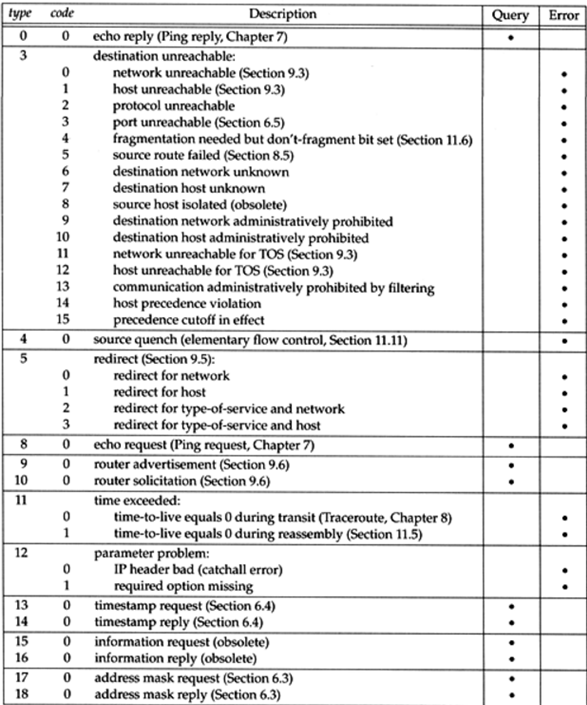

# OpenWrt 防火墙之iptables

## iptables简介

iptables是linux系统中非常出名的防火墙软件，但是其实iptables并不是真正的防火墙，我们可以把它理解为一个代理程序，我们通过iptables这个代理程序，编写相应的规则，并将这些规则执行到Linux的**安全框架**中去，所以，这个安全框架才是真正的防火墙，linux中这个安全框架叫**netfilter**，netfilter工作在操作系统的内核空间，iptables则工作在系统的用户空间。

netfilter/iptables是linux平台下的包过滤型防火墙，是免费的，它可以代替昂贵的商业防火墙解决方案，完成数据包的过滤，网络地址的转换（NAT）等功能。

## Iptables中链表规则的概念

表、链和链中规则关系如下：


不同的表中有多个链，每个链下有多个规则，因为表在整个linux网络系统中处于不同的位置，所以，当流量流经不同的地方的时候，我们通过修改表中不同的链下的规则，来进行控制流量。如下图所示：显示了系统默认的表和链在系统中不同的位置关系。


### Iptable中的链

iptables由5条链，分别是：PREROUTING,INPUT,OUTPUT,FORWARD,POST_ROUTING


### iptables中的表

表是具有相同功能的集合，iptables中定义了四个表


使用下面的命令查看表中包含的链

```
iptables -t filter -L
```

#### 重要的表详解

##### filter表


##### nat表


## iptables规则管理

数据包过滤基于规则，而规则由 **匹配条件+动作组成**，如下图所示：Mangle表上有不同的链，每个链上又有不同数量的规则。


iptables的命令格式大致如下：


下面会重点介绍规则和动作。

### 规则匹配

规则匹配又分为**隐式匹配**和**显示匹配**。iptables 在使用`-p`选项指明了特定的协议后，无需再用`-m`选项指明扩展模块的扩展机制，不需要手动加载扩展模块，这些都是iptables命令原生选项，故而称为**隐式匹配**。

#### 隐士匹配

1. 源IP地址或者不连续的IP地址匹配规则：`[!] -s, --source address[/mask][,...]`

   ```bash
   iptables -t filter -I INPUT -s       192.168.1.111 -j DROP #-s 单个ip
   iptables -t filter -I INPUT -s       192.168.1.111,192.168.1.118 -j DROP #-s 多个ip
   iptables -t filter -I INPUT -s 		 192.168.1.0/24 -j DROP 			 # 带ip掩码
   
   # -s 可以用 --source 替换
    
   ```

2. 目标IP地址或者不连续的IP地址：`[!] -d, --destination address[/mask][,...]`

   ```
   iptables -t filter -I INPUT -d       192.168.1.111 -j DROP #-d 单个ip
   iptables -t filter -I INPUT -d       192.168.1.111,192.168.1.118 -j DROP #-d 多个ip
   iptables -t filter -I INPUT -d 		 192.168.1.0/24 -j DROP 			 # 带ip掩码
   
   # -d 可以用 --destination  替换
    
   ```

3. 指定协议，可使用数字如0(all)：`[!] -p, --protocol protocol`：

   ```bash
   #protocol: tcp, udp, icmp, icmpv6, udplite,esp, ah, sctp, mh or "all"   参看:/etc/protocols
   
   iptables -t filter -I INPUT -p         tcp     -m tcp --dport 22 -j ACCEPT
   #或者
   iptables -t filter -I INPUT --protocol tcp     -m tcp --dport 22 -j ACCEPT
   ```

4. 报文流入的接口：`[!] -i, --in-interface`

   只能应用于数据报文流入环节，只应用于INPUT、 FORWARD、PREROUTING链

   ```bash
   iptables -t filter -I INPUT -i eth0 -j ACCEPT
   #或者
   iptables -t filter -I INPUT --in-interface eth0 -j ACCEPT
   ```

5. 报文流出的接口：`[!] -o, --out-interface`

   只能应用于数据报文流出的环节，只应用于 FORWARD、OUTPUT、POSTROUTING链

   ```bash
   iptables -t filter -I INPUT -o eth0 -j ACCEPT
   #或者
   iptables -t filter -I INPUT --out-interface eth0 -j ACCEPT
   ```

   

6. tcp隐式扩展选项：源端口

   - `[!] --source-port, --sport port[:port]`：匹配报文源端口

     ```bash
     #源端口不等于22
     iptables -t filter -I INPUT -p tcp ! --sport 22 -j ACCEPT
     #源端口端口在[22,30]之间
     iptables -t filter -I INPUT -p tcp --sport 23:30 -j ACCEPT
     #源端口在[22:65535]之间
     iptables -t filter -I INPUT -p tcp --sport 22: -j ACCEPT
     #源端口在[0:22]之间
     iptables -t filter -I INPUT -p tcp --sport :22 -j ACCEPT
     
     
     # 注意 --sport 可以替换为 --source-port
     
     ```

     

   - 目标端口：`[!] --destination-port,--dport port[:port]`

     使用方式和上面的源端口一样

   - tcp标志的数据报文：`[!] --tcp-flags mask comp`：

     ```bash
     # mask表示需检查的标志为列表，用逗号分隔，例如SYN,ACK,FIN,RST
     # comp表示mask列表中必须为1的标志为列表，没有指定表示必须为0用逗号分隔
     
     #表示要检查的标志位为SYN,ACK,FIN,RST四个，其中SYN必 须为1，余下的必须为0，第一次握手
     iptables -t filter -I INPUT -p tcp --tcp-flags SYN,ACK,FIN,RST  SYN -j ACCEPT
     #表示要检查的标志位为SYN,ACK,FIN,RST四个，其中SYN ACK必须为1，余下的必须为0，第二次握手
     iptables -t filter -I INPUT -p tcp --tcp-flags SYN,ACK,FIN,RST  SYN,ACK -j DROP
     
     # 错误包（四个包全部为 1 或者全部为 0 是错误的数据包）
     iptables -t filter -I INPUT  -p tcp --tcp-flags ALL NONE -j DROP
     iptables -t filter -I INPUT  -p tcp --tcp-flags ALL ALL -j DROP
     ```

     

   - 匹配第一次握手：`[!] --syn`：相当于:`–tcp-flags SYN,ACK,FIN,RST SYN`

     ```
     iptables -A INPUT -p tcp --syn  -j REJECT
     ```

     

7. udp隐式扩展选项

   - 源端口：`[!] --source-port, --sport port[:port]`

     ```bash
     #源端口不等于22
     iptables -t filter -I INPUT -p udp ! --sport 22 -j ACCEPT
     #源端口端口在[22,30]之间
     iptables -t filter -I INPUT -p udp --sport 23:30 -j ACCEPT
     #源端口在[22:65535]之间
     iptables -t filter -I INPUT -p udp --sport 22: -j ACCEPT
     #源端口在[0:22]之间
     iptables -t filter -I INPUT -p udp --sport :22 -j ACCEPT
     
     
     # 注意 --sport 可以替换为 --source-port
     ```

     

   - 目标端口：`[!] --destination-port,--dport port[:port]`

     ```bash
     #目标端口不等于22
     iptables -t filter -I INPUT -p udp ! --dport 22 -j ACCEPT
     #目标端口端口在[22,30]之间
     iptables -t filter -I INPUT -p udp --dport 23:30 -j ACCEPT
     #目标端口在[22:65535]之间
     iptables -t filter -I INPUT -p udp --dport 22: -j ACCEPT
     #目标端口在[0:22]之间
     iptables -t filter -I INPUT -p udp --dport :22 -j ACCEPT
     
     
     # 注意 --dport 可以替换为 --destination-port
     ```

     

8. icmp隐式扩展选项

   ```
   [!] --icmp-type
       type/code
       0/0 echo-reply icmp应答 。
       8/0 echo-request icmp请求。
   ```

   ```bash
   # 拒绝ICMP协议的请求报文，可实现本地主机ping对端主机可通，对端主机ping本地主机不通。
   iptables -t filter -A INPUT -s 192.168.10.10 -p icmp --icmp-type 8/0 -REJECT
   # icmp-type表示 icmp请求类型，8/0分别表示type/code。细节见下图
   ```

   

9. todo

#### 显示匹配

加`-m`引用模块的显示扩展。

1. 状态匹配：`-m state`

   state 扩展模块，可以根据**连接追踪机制**去检查连接的状态，较耗资源

   conntrack机制:追踪本机上的请求和响应之间的关系

   ```
   --state {NEW,ESTABLISHED,INVALID,RELATED,UNTRACKED}
   ```

   - INVALID：无效的连接，如flag标记不正确，即，表示该封包的连接编号(Session ID) 无法辨识或编号不正确
   - ESTABLISHED：NEW状态之后，连接追踪信息库中为其建立的条目失效之前期间内所进行的通信状态，即，表示该封包属于某个已经建立的连接
   - NEW：NEW:新发出请求;连接追踪信息库中不存在此连接的相关信息条目，因此，将其识别为第一次发 出的请求，即，表示该封包想要起始一个连接(重设连接或将连接重导向)
   - RELATED：表示该封包是属于某个已经建立的连接所建立的新连接，例如FTP-DATA连接必定是源自某个FTP连接
   - UNTRACKED:未进行追踪的连接，如:raw表中关闭追踪

   使用说明：todo

   

2. 端口匹配：`-m mustiport`

   ```
   -m multiport
       --sport
       --dport
       --ports
   
   ```

   ```bash
   # 指定多个源端口
   [!] --source-ports,--sports port[,port|,port:port]...
   
   # 指定多个目标端口
   [!] --destination-ports,--dports port[,port|,port:port]...
   
   # 多个源或目标端
   [!] --ports port[,port|,port:port]...
   
   ```

   示例

   ```bash
   # 在路由器上设置 拒绝 192.168.80.0/24 访问 192.168.10.0/24 的 1-1024 和 3389端口
   iptables -t filter -I FORWARD -p tcp -d 192.168.10.0/24 -s 192.168.80.0/24 -m multiport --dport 1:1024,3389 -j DROP
   
   #禁止 10.0.0.7 访问本机的80和6739端口
   iptables -A INPUT -s 10.0.0.7 -p tcp -m multiport --dport 80,6379 -j REJECT
   
   ```

   注意常用的端口如下：

   ```
   	http		tcp/80
   	https		tcp/443
   	SSH			TCP/22
   	TELNET		TCP/23
   	FTP			TCP/21(命令连接), 数据连接(TCP/20)
   	TFTP		UDP/69
   	MYSQL		TCP/3306
   	SMTP		TCP/25
   	POP3		TCP/110
   	IMAP4		TCP/143
   	DNS			TCP/53, UDP/53
   	DHCP		UDP/67(服务端), UDP/68(客户端)
   	SAMBA		TCP/139, TCP/445, UDP/137, UDP/138 
   	NTP			UDP/123 
   	iSCSI		tcp/3260
   ```

   

3. ip地址匹配：`-m iprange`

   指明连续的(但一般不是整个网络)ip地址范围

   ```bash
   -m iprange
       [!] --src-range from[-to]    # 源IP地址范围 
       [!] --dst-range from[-to]    # 目标IP地址范围
       
   
   ```

   

   ```bash
   iptables -t filter -I INPUT -m iprange --src-range 1.1.1.1-1.1.1.4 -j DROP
   iptables -t filter -I INPUT -m iprange ! --src-range 1.1.1.1-1.1.1.4 -j DROP
   ```

   同理还有 `--dst-range` ，用来设置目的地址

   

4. 链接数量匹配：`-m connlimit`

   根据每客户端IP做并发连接数数量匹配，可防止Dos(Denial of Service，拒绝服务)攻击

   ```bash
   # --connlimit-upto        #连接的数量小于等于时匹配
   # --connlimit-above       #连接的数量大于时匹配
   
   #只允许 192.168.80.0/24 使用远程桌面连接 192.169.10.123/32 最多两个会话
   iptables -I FORWARD -s 192.168.80.0/24 -d 192.169.10.123/32 -p tcp --dport 3389 -m connlimit --connlimit-above 2 -j DROP
   
   ```

   

5. 数据包流量匹配：`-m limit --limit`

   iptables对速率的限制，本质上是对数据包个数的限制，iptables不支持对数据包大小和带宽进行直接限制

   ```bash
   # 格式如下：其中N、M是一个正整数，表示t时间多少个数据包，M表示缓冲区大小
   # -m limit  --limit N/t --limit-burst M
   
   # --limit ： t的取值如下：比如 200/second  每秒产生200个数据包
   #            second 
   #            minute 
   #            hour 
   #            day
   #--limit-burst ：缓存区大小，
   
   #如果想要对某一类型的数据包进行限速，–limit参数和–limit-burst参数要配合使用，iptables会首先放置一个计数器，计数器大小为M的值，每当收到一个数据包，就会将计数器的值减1，如果计数器的值为0，则拒绝接受新的数据包，同时，iptables也会按照N的值，定期增加计数器的值
    
   #192.168.10.0/24 网段每秒钟向 192.168.80.0/24 发送数据包不能超过 300 个，在以太网中，一个数据包最大1500字节，300个数据包是：300*1500=450000=450K
   iptables -t filter -I FORWARD -s 192.168.10.0/24 -d 192.168.80.0/24 -m limit --limit 300/second -j ACCEPT
   
   # 注意：限速的设置后面一定要跟一个“拒绝”的语句，也可以将默认策略设置为“拒绝” 想想可知，上面如果速率大于450k了，上面不在ACCEPT，走到这条规则的时候，肯定要丢掉的
   iptables -t filter -A FORWARD -s 192.168.10.0/24 -d 192.168.80.0/24 -j DROP
   
   
   ```

   例子

   公司使用linux服务器来当网关，配置iptables NAT上网，虽然公司光纤带宽30MB，但只要有一个人使用迅雷等P2P软件下载资料时，会把带宽跑满，如何使用iptables来对每个用户进行带宽限速呢，参见如下脚本即可

   ```bash
   cat /etc/sysconfig/limit.sh
   for((i=2;i<254;i++))
   do
       iptables -t filter -I FORWARD -s 192.168.10.$i -j DROP
       iptables -t filter -I FORWARD -s 192.168.10.$i -m limit --limit 300/sec --limit-burst 1000 -j ACCEPT
   done
   # 注：对192.168.1.2-254，前1000个数据包都允许通过（不管它的速度如何），超过1000个以后的数据包，控制在每秒只允许最多300个数据包通过限制
   
   ```

   

6. mac地址匹配：`-m mac --mac-source`

   基于MAC地址过滤流量

   ```bash
    
   iptables -t filter -I FORWARD -d 192.168.80.0/24 -m mac --mac-source 00-0C-29-DB-32-6F -j DROP
   #适用于：PREROUTING, FORWARD，INPUT chains
   ```

   

7. 标记mark值匹配：`-m mark --mark`

8. string扩展，对报文中的应用层数据做字符串模式匹配检测

   ```bash
   # -algo {bm|kmp} 字符串匹配检测算法
   #    bm：Boyer-Moore
   #    kmp：Knuth-Pratt-Morris
   # --from offset       开始偏移
   # --to offset         结束偏移
   # [!] --string pattern    要检测的字符串模式
   # [!] --hex-string pattern要检测字符串模式，16进制格式
   
   iptables -A OUTPUT -p tcp --sport 80 -m string --algo bm --from 62  --string   "google" -j REJECT
   ```

   

9. icmp报文匹配：`-m icmp --icmp-type`

   这个和上面介绍的隐式匹配一样，只是这里用-m选项 显试说明了

   ```bash
   #含义：不接受ping请求，但是可以执行ping操作
   iptables -t filter -I INPUT -p icmp -m icmp --icmp-type 8/0 -j REJECT
   # icmp-type表示 icmp请求类型，8/0分别表示type/code。细节见下图
   ```

   

10. 字节长度匹配：`-m length`

    ```
    -m length --length num     #匹配指定大小的数据
    -m length ! --length num   #匹配非指定大小数据
    -m length --length num:    #匹配大于或等于
    -m length --length :num    #匹配小于或等于
    -m length --length num:num #匹配指定区间 
    ```

    

11. 一个连接中字节数量匹配：`-m connbytes`

    connbytes用于匹配一个连接中的字节数量，报文数量或者平均报文长度值，使用connbytes模块限制每个模块连接中所能传输的数据量。

    ```bash
    # 设置连接的回复方向平均报文长度超过1400字节，进行丢弃。以及连接的原始方向报文数量超过30000，执行丢弃。
    
    $iptables -A OUTPUT -m connbytes --connbytes 1400: --connbytes-dir reply --connbytes-mode avgpkt -j DROP
    $iptables -A OUTPUT -m connbytes --connbytes 30000: --connbytes-dir original --connbytes-mode packets -j DROP
    
    $iptables -L -n -v
    
    Chain OUTPUT (policy ACCEPT 0 packets, 0 bytes)
     pkts bytes target     prot opt in     out     source               destination         
        0     0 DROP       all  --  *      *       0.0.0.0/0            0.0.0.0/0            connbytes 1400 connbytes mode avgpkt connbytes direction reply
        0     0 DROP       all  --  *      *       0.0.0.0/0            0.0.0.0/0            connbytes 30000 connbytes mode packets connbytes direction original
    
    ```

    

    ```bash
    # 限制使用者以HTTP协议下载20M以上的数据
    $iptanbles -A FORWARD -p tcp -d $WEB_SERVER --dport 80 -m connbytes --connbytes-dir replay --connbytes-mode bytes --connbytes 20971520：-j DROP
    
    #--connbytes-dir: original-来源方向 reply-应答方向 both-双向
    
    #--connbytes-mode:packets-以数据包的数量来计算 bytes-以数据传输量来计算
    
    #--connbytes:匹配多少的单位量
    ```

    

12. 


### 执行动作

- **ACCEPT** ：一旦包满足了指定的匹配条件，就会被 ACCEPT，并且不会再去匹配当前链中的其他规则，数据会跳到下个表中链中。

- **DROP**：如果包符合条件，这个包 就会丢掉，也就是说包的生命到此结束，效果就像包被阻塞了。在某些情况下，这个 target 会引起意外的结果，因为它不会向发送者返回任何信息，也不会向路由器返回信息，这就可能会使连接的另一方的 sockets 因苦等回音而亡。

  解决这个问题的较好的办法是使用REJECT（因为它在丢弃包的同时还会向发送者返回一个错误信息，这样另一方就能正常结束），尤其是在阻止端口扫描工具获得更多的信息时

- **REJECT**：REJECT 和 DROP 基本一样，区别在于它除了阻塞包之外，还向发送者返回错误信息。
  现在，此target还只能用在 INPUT、FORWARD、OUTPUT 和它们的子链里，而且包含 REJECT 的链也只能被它们调用，否则不能发挥作用。
  它只有一个选项，是用来控制返回的错误信息的种类的。

- **SNAT** ：源地址转换。

- **DNAT** ：目标地址转换。

- **MASQUERADE** ：IP伪装(NAT)，用于ADSL。

- **LOG** ：日志记录。

- **REDIRECT** ：将封包重新导向到另一个端口（PNAT），进行完此处理动作后，将 会继续比对其它规则。 这个功能可以用来实作通透式 porxy 或用来保护 web 服务器

- **MARK**：将封包标上某个代号：`iptables -t mangle -A PREROUTING -p tcp --dport 22 -j MARK --set-mark 2`

- 跳到下个自定义的链

## iptables常用命令


1. 查看规则

   ```bash
   # -L 查看详情，
   # -n  以数字形式显示IP地址或端口信息，不要转换为字符串显示，
   # -v 详细信息，
   # –line-numbers显示规则编号
   iptables -t filter -L -n -v --line-numbers
   
   iptables -j MARK --help
   iptables -m mark --help
   iptables -j CONNMARK --help
   iptables -m connmark --help
   ```

   

3. 添加规则

   ```bash
   # -I 在指定链INPUT的最前面插入规则
   iptables -t filter -I INPUT -p icmp -j ACCEPT
   # -I 在指定链INPUT的第2条规则前插入规则
   iptables -t filter -I INPUT 2 -p icmp -j ACCEPT
   ```
   
3. 追加规则

   ```bash
      # -A 在指定链INPUT的最后面插入规则
   
      iptables -t filter -A INPUT -p icmp -j ACCEPT
   ```

   

4. 修改规则

   ```bash
   # 修改INPUT的第1条规则
   iptables -t filter -R INPUT 1 -p icmp -j DROP
   ```

5. 删除规则

   ```bash
   # 删除 INPUT 链上的第一条规则
   iptables -t filter -D INPUT 1
   ```

6. 保存规则

   默认iptables编写的规则属于临时的，所以需要将编写的规则永久保存起来

   ```bash
   iptables-save > /etc/iptables.rules
   ```

7. 恢复规则

   清空iptables所有的规则，然后用保存的规则恢复

   ```
   iptables -F
   iptables-restore < /etc/iptables.rules
   ```

8. MARK和CONNMARK目标

   MARK是iptables的一个目标，用于给数据包打上指定mark，当我们使用MARK目标的时候，通常是我们在配置策略路由，需要给一个包加上某个mark，然后ip rule某条规则中的fwmark匹配到该mark，数据包就会根据该规则的lookup参数指定的路由表中的规则转发。

   CONNMARK也是iptables的一个目标，用于给一个网络连接标记一个连接mark，也就是网络连接的整个过程的交互包都被该连接mark标记。连接mark一般用于设备有多个WAN口的场景，假设当设备的默认路由是WAN1的时候，外面的设备访问到WAN2时，WAN2的回包正常会走WAN1出去(WAN1是默认路由接口)，但是这时不对的。这时就需要给WAN2进来的数据包打上连接mark，并且配合策略路由，让包从WAN2返回。

   - MARK

     使用方法如下：

     - `--set-mark`：给数据包设置mark

       为匹配的数据包加上mark，如下：TCP的22端口的数据包打上`2`的mark

       ```bash
       iptables -t mangle -A PREROUTING -p tcp --dport 22 -j MARK --set-mark 2
       ```

   - CONNMARK

     使用方法如下：

     - `--set-mark`：给链接设置mark

       为匹配的数据包加上`连接mark`，该数据包所在的这条连接都由该`连接mark`标识

       ```bash
       iptables -t mangle -A PREROUTING -p tcp --dport 80 -j CONNMARK --set-mark 4
       ```

       访问TCP的80端口的该条连接打上4的`连接mark`。也就是该数据包所在的连接被加上了4的连接mark

     - `--save-mark`：把数据包的mark 设置为 链接mark

       保存一个数据包的mark到该包所在的连接的连接mark，通俗的说就是一个数据包被标识了一个mark数值，--save-mark可以将该数值设置为该包所在连接的连接mark

       ```bash
       #从eth2.2来的数据包都加上400的mark
       iptables -t mangle -A PREROUTING -i eth2.2 -j MARK --set-mark 400
       #将数据包的mark设置为通过eth2.2的连接mark
       iptables -t mangle -A PREROUTING -j CONNMARK --save-mark
       ```

       `CONNMARK --save-mark` 有点等效于 `CONNMARK --set-mark 400`的感觉。

     - `--restore-mark`：把链接mark 值 设置到 数据包中

       作用和--save-mark相反，将连接mark设置到某个数据包中，成为该数据包的mark。通俗解释就是，我们通过CONNMARK --set-mark为一个数据包设置mark，通过CONNMARK --save-mark将整个连接设置了连接mark，但是除了第一个被CONNMARK --set-mark有mark标识除外，该连接其他的数据包是没有mark的，所以我们需要--restore-mark，将连接mark重新设置回该连接的每个数据包中。

       ```bash
       iptables -t mangle -A OUTPUT -j CONNMARK --restore-mark
       ```

       上面规则表示，通过OUTPUT出去包的数据包，都会将该数据包所在的连接的连接mark设置到该数据包中。我们知道，只有通过-j CONNMARK --setmark或者-j MARK --set-mark和--save-mark的配合使用才能给一个连接加上连接mark，所以，经过该规则的包，如果有连接mark，则连接mark会被设置到该包中，如果没有连接mark，但是包自身有mark，则自身的mark会被清除，如果没有连接mark，包自身也没有mark，则无影响。

     **总结**：

      MARK目标是为数据包加mark，CONNMARK是为某一条连接加连接mark，mark和连接mark可以通过--save-mark和--restore-mark的处理，将一个连接的连接mark设置为连接中的数据包mark，也可以将一个数据包的mark设置为所在的连接的连接mark。下一篇通过一个案例具体解析一下MARK和CONNMARK的作用。

   

## iptables和etables与Linux bridge的交互

[参见原文: http://ebtables.netfilter.org/br_fw_ia/br_fw_ia.html](http://ebtables.netfilter.org/br_fw_ia/br_fw_ia.html)


## Openwrt 防火墙

2. Linux下的防火墙最终都会归iptables进行管理，OpenWrt的防火墙机制同样也是，最上层采用了自己基于UCI标准的配置方法管理防火墙firewall，最终写入到iptables。
4. OpenWrt基于firewall的配置，由于涉及到多个网口，有Wan和Lan这些，最终会转换成很多自定义的链，看来很吃力，我的建议是直接在firewall层全部开启，然后自己使用iptables做限制。不建议停掉之后再自己写配置，不然你无法知道哪些网口是走向什么地方的。
5. firewall不能单独关闭，不然会无法上网。

### 常用命令

OpenWrt下的NAT、DMZ、Firewall rules都是由配置文件“`/etc/config/firewall`”进行控制管理的。此文件可以使用UCI 命令、WEB界面或者vi编辑器直接修改。

该文件最后会在`/etc/init.d/firewall`启动的时候由UCI进行解码并且生成iptables规则生效。因此使用者不需要了解iptables即可通过配置文件实现防火墙规则。

防火墙的修改生效，需要重启防火墙执行一下命令：

```
/etc/init.d/firewall reload
```


  或

```
/etc/init.d/firewall restart  
```

查看当前iptables的已启用策略语法为：
```bash
# 显示队列和class规则
# tc -s qdisc show dev eth0
# tc -s class show dev eth0
# tc -s filter show dev eth0

# 显示iptables 策略 
# iptables -t mangle -L
#  iptables -L                  --- -L  以列表形式显示所有规则信息
#  iptables -L -n               --- -n  以数字形式显示IP地址或端口信息，不要转换为字符串显示
#  iptables -t nat -L -n        --- -t    表示指定查看或者配置相应的表
#  iptables -L -n -v            --- -v   表示显示详细规则信息，包含匹配计数器数值信息
#  iptables -L -n --line-number --- --line-number 显示规则序号信息
```


### 防火墙的基本设置

配置文件为`/etc/config/firewall`

#### config defaults 防火墙默认参数

|键             |  值  	|是否必须设置  	|说明|
|---------------|-------|---------------|----|
|input			|ACCEPT	|是				|设置 INPUT 链(chain) 的过滤策略，可选值： ACCEPT 允许， REJECT 拒绝|
|output			|ACCEPT	|是				|设置 OUTPUT 链(chain) 的过滤策略，可选值： ACCEPT 允许， REJECT 拒绝|
|forward		|REJECT	|是				|设置 FORWARD 链(chain) 的过滤策略，可选值： ACCEPT 允许， REJECT 拒绝|
|syn_flood		|1		|是				|是否启用防洪水攻击。可选值：0关闭，1启用。|
|synflood_rate	|字符串	|否				|设置 SYN 包传输洪水攻击检测比率值，默认为：25 单位(包/秒)|
|synflood_burst | 字符串|否				|设置 SYN 包传输比率值识别洪水攻击，默认为：50 单位(包/秒)|
|disable_ipv6	|1		|否				|设置关闭掉 IPv6 的防火墙策略， 可选值：0忽略，1关闭。|

这部分参考值使用系统默认值即可，无需修改：

```bash
config defaults
        option syn_flood
        option input            ACCEPT
        option output           ACCEPT
        option forward          REJECT

# Uncomment this line to disable ipv6 rules
#       option disable_ipv6   
```

#### config zone WAN/LAN域(zone)参数

|键     |   值  |是否必须设置 	|说明|
|-------|-------|---------------|-----|
|name	|字符串	|是				|域必须是唯一值，可选值：wan，lan |
|network|列表值	|否				|哪些接口被捆绑到这个域中，可选接口的名称，比如：lan，wan，wan6|
|input	|ACCEPT	|否				|设置INPUT链(chain)的过滤策略，可选值: ACCEPT 允许, REJECT 拒绝|
|output	|ACCEPT	|否				|设置OUTPUT链(chain)的过滤策略，可选值: ACCEPT 允许, REJECT 拒绝|
|forward|ACCEPT	|否				|设置FORWARD链(chain)的过滤策略，可选值: ACCEPT 允许, REJECT 拒绝|
|masq	|1		|否				|设置传输伪装,如果是WAN口必须为1|
|mtu_fix|1		|否				|设置MTU的MSS钳制,如果是WAN口请为1|
这部分配置也不需要做修改，参考：

```
config zone
        option name             lan
        list   network          'lan'
        option input            ACCEPT
        option output           ACCEPT
        option forward          ACCEPT  

config zone
        option name             wan
        list   network          'wan'
        list   network          'wan6'
        option input            REJECT
        option output           ACCEPT
        option forward          REJECT
        option masq
        option mtu_fix          
```

#### config forwarding路由转发参数

|键      |值    |是否必须设置|说明|
|-------|-------|------------|-----|
|src	|lan	|是			 |设置转发来源|
|dest	|wan	|是			 |设置转发目标|

这部分也需要修改，参考：
```
config forwarding
        option src              lan
        option dest             wan  
```
#### config includes 参数

用于添加自定义的防火墙脚本

```
config include
	option	path		'/etc/firewall.user'

```

Options

|Name		|Type		|Required	|Default	|Description|
|-----------|-----------|-----------|-----------|-----------|
|enabled	|boolean	|no			|1			|Allows to disable the corresponding include without having to delete the section|
|type		|string	no	|script		|Specifies	| the type of the include, can be script for traditional shell script includes or restore for plain files in iptables-restore format|
|path		|file name	|yes		|/etc/firewall.user|	Specifies a shell script to execute on boot or firewall restarts|
|family		|string	no	|any		|Specifies	| the address family (ipv4, ipv6 or any) for which the include is called|
|reload		|boolean	|no			|0			|Specifies whether the include should be called on reload - this is only needed if the include injects rules into internal chains|
- 由于自定义 iptables 规则比通用规则更具体，因此您必须确保使用-I *(insert)*而不是-A (append)，以便规则出现在默认规则之前
- 如果规则存在于iptables中，则不会重新添加。一个标准的 iptables-I 或 -A会添加重复规则

下面是一个例子允许访问HTTP 80 and HTTPS 443 ports

```bash
# Replace the ips-v4 with v6 if needed

for ip in `wget -qO- http://www.cloudflare.com/ips-v4`; do
  iptables -I INPUT -p tcp -m multiport --dports http,https -s $ip -j ACCEPT
done
```


#### config rule 防火墙的规则参数

如果在路由产品中需要开发 “允许 WAN 口访问设备的特定端口”，可以设置本规则(比如开放 WAN 口允许 SSH 登入，或允许 WAN 口访问设备的 FTP)，一般情况下无需设置。

规则配置文件结构

```
config rule
	option name '规则名称'
.....  
```

config rule可选参数表
|键			|值		|是否必须设置|说明|
|-----------|-------|------------|-----|
|name 		|字符串 |是			 |设置当前这个 rule 的名称|
|target		|字符串	|是			 |设置防火墙的动作，可选值：ACCEPT 许可, REJECT 拒绝, DROP 抛弃|
|src		|字符串	|否			 |数据源的zone域是哪个。可选值: wan / lan|
|src_ip 	|字符串	|否			 |数据源的IP地址是哪个。|
|src_mac 	|字符串	|否			 |数据源的 MAC 地址是哪个。|
|src_port 	|字符串	|否			 |数据源的端口，可以是一个端口，或一个端口范围，但是必须同时指定了协议类型 |
|proto		|字符串	|否			 |数据源的协议类型，可选值: tcp, udp, tcpudp, udplit, icmp, esp, ah, sctp, 或all表示全部  |
|dest		|字符串	|否			 |数据目标的 zone 域是哪个，可选值：wan / lan|
|dest_ip	|字符串	|否			 |数据目标的IP地址。|
|dest_port  |字符串	|否			 |数据目标的端口，可以是一个端口，或一个端口范围，但是必须同时指定了协议类型|
|family		|字符串	|否			 |数据的协议族，可选值: ipv4, ipv6, any|

rule规则可以灵活设置，比如允许WAN口可以ssh到系统，举例：

```
config rule
    option name wan-ssh
    option src wan
    option dest_port
    option proto tcp
    option target ACCEPT  

```

#### 端口转发和 DMZ(demilitarized zone 隔离区)

端口转发是路由产品中常见的配置，它允许使用者通过WAN口访问特定的端口转发给局域网的一台电脑设备(比如WAN口访问80端口(HTTP)将转发给局域网某台网站服务器)。

端口转发也是在防火墙配置/etc/config/firewall中定义redirect段策略实现的。所有匹配的来源数据将根据目标设置转发到目标主机上。

firewall配置中可以有多个redirect转发策略，默认是没有开放任何转发的，如果需要转发请使用vi或UCI进行配置。

规则配置文件结构

```
config redirect
	option name '名称'
	....  

```

config redirect可选参数表

|键    		|值    	|是否必须设置   |说明|
|-----------|-------|---------------|-----|
|name   	|字符串 |是 			|设置当前这个 redirect 的名称|
|src		|字符串	|是				|转发源的 zone 域，一般转发都是转发从 wan 过来的访问|
|src_ip 	|字符串	|否				|转发源的 IP 地址指定|
|src_mac	|字符串	|否				|转发源的 MAC 地址指定|
|src_port	|字符串	|否				|转发源的端口指定|
|proto		|字符串	|否				|转发源的协议类型，可选值：tcp, udp, tcpudp, udplit, icmp, esp, ah, sctp, 或all表示全部|
|dest		|字符串	|是				|转发目标的 zone 域|
|dest_ip	|字符串	|否				|转发目标的IP地址指定|
|dest_mac 	|字符串	|否				|转发目标的MAC地址指定|
|dest_port	|字符串	|否				|转发目标的端口指定|

端口转发的可配置性十分灵活，比如我们将 9020 这个端口转发给内网一台服务器的 80，举例：

```
config redirect
    option name '9020-80'
    option proto 'tcp'
    option src 'wan'
    option src_dport ''
    option dest 'lan'
    option dest_ip '192.168.1.100'
    option dest_port ''  

```

将电脑192.168.1.2设置DMZ隔离区，举例：

```
config redirect
    option src wan
    option proto all
    option dest_ip 192.168.1.2  
```

### web界面设置说明

参考【https://www.bilibili.com/video/BV1mt4y1T7qB/】