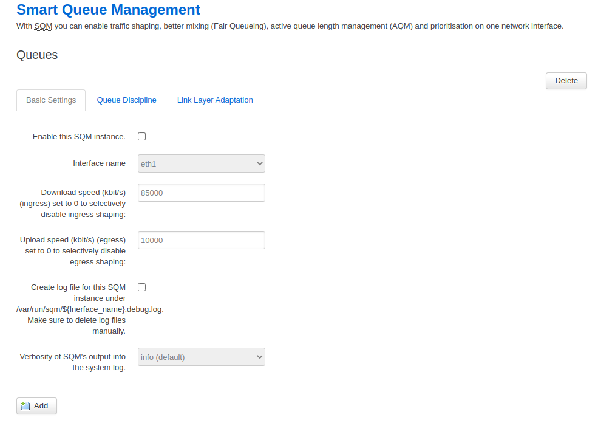

# OpenWrt 优先级Qos

## 有线端Qos

### 概述


OpenWrt Qos服务根据默认规则不同，可以分为两类：

- sch_fhsc和sch_fq_codel

  基于该规则的qos软件包有`qos-scripts (对应的web配置为luci-app-qos)`、`sqm-scripts(对应的web配置为luci-app-sqm)`

- sch_sfq和sch_htb

  基于该规则的qos软件包有`wshaper`

**注意：**上述三个软件包`qos-scripts`、`sqm-scripts`和`wshaper`只能同时用一个。

### qos-scripts软件包

OpenWrt的qos-scripts软件包默认的规则是hfsc，底层是tc，其目的决定先发送哪些包。设计了四个优先级。提供了分类标记，流量控制等功能，可能还有整形，实际使用下来效果很不错。像是基于优先级的公平队列。

**OpenWrt默认提供了四个队列级别**

| Class    | Mark | Packets | 字节                   | 解释                             |
| -------- | ---- | ------- | ---------------------- | -------------------------------- |
| Priority | 01   | 17172   | 1666639    (1.6 MiB)   | 优先级最高                       |
| Express  | 02   | 2784325 | 270790491  (258.2 MiB) | 其次                             |
| Normal   | 03   | 3993830 | 3667146683 (3.4 GiB)   | 正常                             |
| Bulk     | 04   | 7539946 | 6768585796 (6.3 GiB)   | 可支持延时传输或者丢弃较多的数据 |

**新增qos-scripts软件包**

- qos-scripts

  

- luci-app-qos

  

编译完后可以看到

- 配置文件`/etc/config/qos`

  

- web 端

  


**注**：如果想单ip限制速率，请使用`luci-app-qos-emong`软件包

#### 配置参数

[参见](https://oldwiki.archive.openwrt.org/doc/uci/qos)https://oldwiki.archive.openwrt.org/doc/uci/qos说明

1. 接口`interface`

   每个interface都可以有自己的buffer。该章节指定interface上进行连接通信的全局特征。

   ```
   config interface 'wan'
           option classgroup 'Default'
           option upload '128'
           option download '1024'
           option enabled '1'
           option overhead '1'
           option halfduplex '1'
   ```

   | 名字       | 类型   | 必填 | 默认值  | 描述                                              |
   | ---------- | ------ | ---- | ------- | ------------------------------------------------- |
   | enabled    | 布尔   | 是的 | 1       | 启用/禁用 QoS                                     |
   | classgroup | 字符串 | 是的 | Default | 指定用于此interface（请参阅下面的说明）classgroup |
   | overhead   | 布尔   | 是的 | 1       | 降低上传和下载比率以防止链接饱和                  |
   | download   | 整数   | 是的 | 4096    | 下载限制在kilobits/second                         |
   | upload     | 整数   | 是的 | 512     | 上传限制在kilobits/second                         |

   

2. 规则

   为每个packets 定义一个group， 并制定该group属于哪个target（即bucket），所有符合定义的规则的packets共享这个target（即bucket）。

   ```
   config classify
           option target 'Priority'
           option ports '22,53'
           option comment 'ssh, dns'
           option connbytes '100'
   ```

   | 名字      | 类型   | 必填 | 默认值 | 描述                                                      |
   | --------- | ------ | ---- | ------ | --------------------------------------------------------- |
   | target    | bucket | 是的 | （无） | defaults、Priority、Express、NormalBulk                   |
   | proto     | 字符串 | 不   | 0      | 协议匹配                                                  |
   | srchost   | 字符串 | 不   | （无） | 源地址匹配 single IP or in CIDR notation                  |
   | dsthost   | 字符串 | 不   | （无） | 目的地址匹配 single IP or in CIDR notation                |
   | ports     | 整数   | 不   | （无） | 端口匹配                                                  |
   | srcports  | 整数   | 不   | （无） | 源端口匹配                                                |
   | dstports  | 整数   | 不   | （无） | 目标端口匹配                                              |
   | portrange | 整数   | 不   | （无） | 按端口范围匹配                                            |
   | pktsize   | 整数   | 不   | （无） | 与此匹配的数据包属于目标中定义的存储桶                    |
   | tcpflags  | 字符串 | 不   | （无） | 与此匹配的数据包属于目标中定义的存储桶                    |
   | mark      | 字符串 | 不   | （无） | 与此匹配的数据包属于目标中定义的存储桶                    |
   | connbytes | int    | 不   | （无） | 与此匹配的数据包属于目标中定义的存储桶                    |
   | tos       | 字符串 | 不   | （无） | 与此匹配的数据包属于目标中定义的存储桶                    |
   | dscp      | 字符串 | 不   | （无） | 与此匹配的数据包属于目标中定义的存储桶                    |
   | direction | 字符串 | 不   | （无） | 与此流量方向匹配的数据包（或）属于目标中定义的存储桶inout |

3. 组`Classgroup`

   可能有很多个interface，也可能有很多个classgroup

   ```
   config classgroup 'Default'
           option classes 'Priority Express Normal Bulk'
           option default 'Normal'
   
   ```

   | 名字    | 类型         | 必填 | 默认值 | 描述                      |
   | ------- | ------------ | ---- | ------ | ------------------------- |
   | classes | bucket names | 是的 | （无） | 指定class的名称列表       |
   | default | bucket names | 是的 | （无） | 定义哪个class被视为默认类 |

4. 类`Classes`

   每个Bucket都有它自己的配置，例如：

   ```bash
   config class "Normal"
   	option packetsize  1500
   	option packetdelay 100
   	option avgrate     10
   	option priority    5
   ```

   | 名字        | 类型 | 必填 | 默认值 | 描述                                                         |
   | ----------- | ---- | ---- | ------ | ------------------------------------------------------------ |
   | packetsize  | 整数 | 是的 | （无） | 以字节为单位                                                 |
   | packetdelay | 整数 | 是的 | （无） | 在毫秒内                                                     |
   | maxsize     | 整数 | 是的 | （无） | 以字节为单位                                                 |
   | avgrate     | 整数 | 是的 | （无） | 此class的平均速率，以带宽百分比为单位的值（此值用于计算 “Nx” 的'tc … hfsc rt m1 N1 d N2 m2 N3') |
   | limitrate   | 整数 | 不   | 100    | 定义此class的可用带宽上限的百分比，值以 % 为单位             |
   | maxsize     | 整数 | 是的 | （无） | 以字节为单位                                                 |
   | priority    | 整数 | 是的 | （无） | 以 % 为单位                                                  |

5. Classes (For Advanced Users)

   ```bash
   Below is unverified technical breakdown of each /etc/config/qos class parameters. Source: http://pastebin.com/YL55na2E
   
   ### Params:
   #
   # maxsize:
   #       limits packet size in iptables rule
   #
   # avgrate: (note: sum(avgrates) ~ 100)
   #       rt m1 = avgrate / sum (avgrate) * max_bandwidth
   #       rt m2 = avgrate * max_bandwidth / 100
   #       ls m1 = rt m1
   #
   # packetsize & packetdelay: (only works if avgrate is present)
   #       rt d = max( packetdelay, 'time required for packetsize to transfer' ) (smaller ps -> smaller d)
   #       ls d = rt d
   #
   # priority:
   #       ls m2 = priority / sum (priority) * max_bandwidth
   #
   # limitrate:
   #       ul rate = limitrate * max_bandwidth / 100
   ```

   


### sqm-scripts软件包

和sqm-scripts对应的web配置软件包为luci-app-sqm。sqm-scripts是基于HTB规则的，底层同样适用tc和iptables进行实现。

**新增sqm-scripts软件包**

- sqm-scripts软件包

  

- luci-app-sqm软件包

  

编译完后可以看到

- 配置文件`/etc/config/sqm`

  

- web端

  

下面是qos-scriptsgen根据qos配置，执行的脚本具体内容

```bash


insmod cls_u32 >&- 2>&-
insmod em_u32 >&- 2>&-
insmod act_connmark >&- 2>&-
insmod act_mirred >&- 2>&-
insmod sch_ingress >&- 2>&-
insmod cls_fw >&- 2>&-
insmod sch_hfsc >&- 2>&-
insmod sch_fq_codel >&- 2>&-
tc qdisc del dev br-lan root >&- 2>&-
tc qdisc add dev br-lan root handle 1: hfsc
tc filter add dev br-lan parent 1: protocol ip prio 10 u32 match u32 0 0 flowid 1:1 action mirred egress redirect dev ifb0

ifconfig ifb0 up txqueuelen 5 >&- 2>&-
tc qdisc del dev ifb0 root >&- 2>&-
tc qdisc add dev ifb0 root handle 1: hfsc default 30
tc class add dev ifb0 parent 1: classid 1:1 hfsc sc rate 1024kbit ul rate 1024kbit
tc class add dev ifb0 parent 1:1 classid 1:10 hfsc rt m1 232kbit d 1907us m2 102kbit ls m1 232kbit d 1907us m2 568kbit ul rate 1024kbit
tc class add dev ifb0 parent 1:1 classid 1:20 hfsc rt m1 533kbit d 1907us m2 512kbit ls m1 533kbit d 1907us m2 284kbit ul rate 1024kbit
tc class add dev ifb0 parent 1:1 classid 1:30 hfsc ls m1 0kbit d 100000us m2 142kbit ul rate 1024kbit
tc class add dev ifb0 parent 1:1 classid 1:40 hfsc ls m1 0kbit d 200000us m2 28kbit ul rate 1024kbit
tc qdisc add dev ifb0 parent 1:10 handle 100: fq_codel limit 800 quantum 300 noecn
tc qdisc add dev ifb0 parent 1:20 handle 200: fq_codel limit 800 quantum 300 noecn
tc qdisc add dev ifb0 parent 1:30 handle 300: fq_codel limit 800 quantum 300 noecn
tc qdisc add dev ifb0 parent 1:40 handle 400: fq_codel limit 800 quantum 300 noecn
tc filter add dev ifb0 parent 1: prio 2 protocol ip handle 0x01/0x0f fw flowid 1:10
tc filter add dev ifb0 parent 1: prio 3 protocol ip handle 0x10/0xf0 fw flowid 1:10
tc filter add dev ifb0 parent 1: prio 4 protocol ip handle 0x02/0x0f fw flowid 1:20
tc filter add dev ifb0 parent 1: prio 5 protocol ip handle 0x20/0xf0 fw flowid 1:20
tc filter add dev ifb0 parent 1: prio 6 protocol ip handle 0x03/0x0f fw flowid 1:30
tc filter add dev ifb0 parent 1: prio 7 protocol ip handle 0x30/0xf0 fw flowid 1:30
tc filter add dev ifb0 parent 1: prio 8 protocol ip handle 0x04/0x0f fw flowid 1:40
tc filter add dev ifb0 parent 1: prio 9 protocol ip handle 0x40/0xf0 fw flowid 1:40


# 安装对应的模块
insmod xt_multiport >&- 2>&-
insmod xt_CONNMARK >&- 2>&-
insmod xt_comment >&- 2>&-
insmod xt_connbytes >&- 2>&-
insmod xt_length >&- 2>&-

#新建新链qos_Default和qos_Default_ct
iptables -t mangle -N qos_Default >&- 2>&-
iptables -t mangle -N qos_Default_ct >&- 2>&-

#设置qos_Default_ct链的数据包的mark
#匹配规则
#	-m mark --mark 0/0x0f 		: 数据包mark&0x0f ==0
	-m tcp -p tcp 				: 属于tcp协议
	-m multiport --ports 22,53 	：端口 22 53
	
	-m connbytes --connbytes 100 --connbytes-dir both --connbytes-mode bytes : 以bytes为单位 双向流量100字节
#执行动作
#	-j MARK --set-mark 17/0xff : 设置匹配上面规则的包 的mark为17 掩码为0xff
iptables -t mangle -A qos_Default_ct -m mark --mark 0/0x0f -m tcp -p tcp -m multiport --ports 22,53 -m comment --comment 'ssh, dns' -m connbytes --connbytes 100 --connbytes-dir both --connbytes-mode bytes -j MARK --set-mark 17/0xff
iptables -t mangle -A qos_Default_ct -m mark --mark 0/0x0f -p udp -m udp -m multiport --ports 22,53 -m comment --comment 'ssh, dns' -m connbytes --connbytes 100 --connbytes-dir both --connbytes-mode bytes -j MARK --set-mark 17/0xff

#不在累赘
iptables -t mangle -A qos_Default_ct -m mark --mark 0/0x0f -p tcp -m tcp -m multiport --ports 20,21,25,80,110,443,993,995 -m comment --comment 'ftp, smtp, http(s), imap' -m connbytes --connbytes 100 --connbytes-dir both --connbytes-mode bytes -j MARK --set-mark 51/0xff

#不在累赘
iptables -t mangle -A qos_Default_ct -m mark --mark 0/0x0f -m tcp -p tcp -m multiport --ports 5190 -m comment --comment 'AOL, iChat, ICQ' -m connbytes --connbytes 110 --connbytes-dir both --connbytes-mode bytes -j MARK --set-mark 34/0xff
iptables -t mangle -A qos_Default_ct -m mark --mark 0/0x0f -p udp -m udp -m multiport --ports 5190 -m comment --comment 'AOL, iChat, ICQ' -m connbytes --connbytes 110 --connbytes-dir both --connbytes-mode bytes -j MARK --set-mark 34/0xff

# 设置qos_Default_ct 数据mark&0xff -》为链接 mark 
iptables -t mangle -A qos_Default_ct -j CONNMARK --save-mark --mask 0xff


# 设置链接qos_Default 把链接mark&0xf -》数据包mark
iptables -t mangle -A qos_Default -j CONNMARK --restore-mark --mask 0x0f

# qos_Default 链 数据mark&0x0f==0  后执行 qos_Default_ct链的规则
iptables -t mangle -A qos_Default -m mark --mark 0/0x0f -j qos_Default_ct


#数据包mark&0xf0==0 udp小于或者等于500字节 设置34数据mark 掩码为0xff
iptables -t mangle -A qos_Default -m mark --mark 0/0xf0 -p udp -m length --length :500 -j MARK --set-mark 34/0xff
#协议为icmp 设置数据mark 17 掩码为0xff 
iptables -t mangle -A qos_Default -p icmp -j MARK --set-mark 17/0xff

#数据包mark&0xf0==0 tcp udp协议 源端口在1024-65535 设置数据mark 68 掩码为0xff
iptables -t mangle -A qos_Default -m mark --mark 0/0xf0 -m tcp -p tcp --sport 1024:65535 --dport 1024:65535 -j MARK --set-mark 68/0xff
iptables -t mangle -A qos_Default -m mark --mark 0/0xf0 -p udp -m udp --sport 1024:65535 --dport 1024:65535 -j MARK --set-mark 68/0xff

#数据包mark&0x0f==0 tcp udp协议 端口在 22 53 链数据小于100字节 设置数据mark 17 掩码为0xff
iptables -t mangle -A qos_Default_ct -m mark --mark 0/0x0f -m tcp -p tcp -m multiport --ports 22,53 -m comment --comment 'ssh, dns' -m connbytes --connbytes 100 --connbytes-dir both --connbytes-mode bytes -j MARK --set-mark 17/0xff
iptables -t mangle -A qos_Default_ct -m mark --mark 0/0x0f -p udp -m udp -m multiport --ports 22,53 -m comment --comment 'ssh, dns' -m connbytes --connbytes 100 --connbytes-dir both --connbytes-mode bytes -j MARK --set-mark 17/0xff

iptables -t mangle -A qos_Default_ct -m mark --mark 0/0x0f -p tcp -m tcp -m multiport --ports 20,21,25,80,110,443,993,995 -m comment --comment 'ftp, smtp, http(s), imap' -m connbytes --connbytes 100 --connbytes-dir both --connbytes-mode bytes -j MARK --set-mark 51/0xff
iptables -t mangle -A qos_Default_ct -m mark --mark 0/0x0f -m tcp -p tcp -m multiport --ports 5190 -m comment --comment 'AOL, iChat, ICQ' -m connbytes --connbytes 110 --connbytes-dir both --connbytes-mode bytes -j MARK --set-mark 34/0xff
iptables -t mangle -A qos_Default_ct -m mark --mark 0/0x0f -p udp -m udp -m multiport --ports 5190 -m comment --comment 'AOL, iChat, ICQ' -m connbytes --connbytes 110 --connbytes-dir both --connbytes-mode bytes -j MARK --set-mark 34/0xff

#数据mark&0xf0 保存为链接mark
iptables -t mangle -A qos_Default -j CONNMARK --save-mark --mask 0xf0

输出和防火墙规则走qos_Default
iptables -t mangle -A OUTPUT -o br-lan -j qos_Default
iptables -t mangle -A FORWARD -o br-lan -j qos_Default


 


/usr/lib/qos/generate.sh all
/usr/lib/qos/generate.sh interface eth0
/usr/lib/qos/generate.sh interfaces
/usr/lib/qos/generate.sh firewall stop
/usr/lib/qos/generate.sh firewall start
```


### 石像鬼qos

基于IMQ规则，没用过，todo

### nft-qos

nft-qos 是 RosyWrt 团队为 OpenWrt LuCI 项目研发的流量限速应用，基于全新的 nftables 防火墙以及
OpenWrt master 分支， 目的在于为项目提供一个细粒度（具体到客户端）的限速解决方案。

主要功能特点如下：

1. 静态限速

   - 支持 IPv4/IPv6

   - 支持对单个客户端（IP）限速 ；

   - 支持全局限速（整个局域网）；

   - 支持限速白名单（在名单内的客户端或网络不受限速影响）

2. 动态限速

   - 支持 IPv4/IPv6

   - 输入 ISP（运营商）接入的带宽速率（比如下行100mbps，即100， 下行 8 mbps，即 8 ）即可动态平均分摊同网段下每个客户端的速率，实 时调整。

   - 支持限速白名单（在名单内的客户端或网络不受限速影响）

3. 流量优先级

   支持设置传输层协议的优先级， 尤其是端口号， 既可以设置具体的端口值， 也可以输入端口的简称， 例如 23，45， http， ftp等

**预览图**

1. 实时限速

   

2. 静态限速

   

3. 动态限速

   

4. 流量优先级

   


下面是一個完整的脚本

```bash
#加载模块：

insmod xt_IPID
insmod cls_u32                                                                                         
insmod cls_fw  
insmod sch_htb
insmod sch_sfq
insmod sch_prio

#启用IMQ虚拟网卡
ip link set imq0 up
ip link set imq1 up

#删除旧队列
tc qdisc del dev imq0 root
tc qdisc del dev imq1 root

#上传设置
#增加根队列，未标记数据默认走26
tc qdisc add dev imq0 root handle 1: htb default 26

#增加总流量规则
tc class add dev imq0 parent 1: classid 1:1 htb rate 350kbit

#增加子类
tc class add dev imq0 parent 1:1 classid 1:20 htb rate 80kbit ceil 250kbit prio 0
tc class add dev imq0 parent 1:1 classid 1:21 htb rate 80kbit ceil 250kbit prio 1
tc class add dev imq0 parent 1:1 classid 1:22 htb rate 80kbit ceil 250kbit prio 2
tc class add dev imq0 parent 1:1 classid 1:23 htb rate 80kbit ceil 250kbit prio 3
tc class add dev imq0 parent 1:1 classid 1:24 htb rate 80kbit ceil 250kbit prio 4
tc class add dev imq0 parent 1:1 classid 1:25 htb rate 50kbit ceil 250kbit prio 5
tc class add dev imq0 parent 1:1 classid 1:26 htb rate 50kbit ceil 150kbit prio 6
tc class add dev imq0 parent 1:1 classid 1:27 htb rate 50kbit ceil 100kbit prio 7

#为子类添加SFQ公平队列,每10秒重置
tc qdisc add dev imq0 parent 1:20 handle 20: sfq perturb 10
tc qdisc add dev imq0 parent 1:21 handle 21: sfq perturb 10
tc qdisc add dev imq0 parent 1:22 handle 22: sfq perturb 10
tc qdisc add dev imq0 parent 1:23 handle 23: sfq perturb 10
tc qdisc add dev imq0 parent 1:24 handle 24: sfq perturb 10
tc qdisc add dev imq0 parent 1:25 handle 25: sfq perturb 10
tc qdisc add dev imq0 parent 1:26 handle 26: sfq perturb 10
tc qdisc add dev imq0 parent 1:27 handle 27: sfq perturb 10

#添加过滤规则配合Iptables Mark标记
#tc filter add dev imq0 parent 1:0 protocol ip u32 match ip sport 22 0xffff flowid 1:10

#使用U32标记数据，下面使用Iptables mark，容易。
tc filter add dev imq0 parent 1:0 prio 0 protocol ip handle 20 fw flowid 1:20
tc filter add dev imq0 parent 1:0 prio 0 protocol ip handle 21 fw flowid 1:21
tc filter add dev imq0 parent 1:0 prio 0 protocol ip handle 22 fw flowid 1:22
tc filter add dev imq0 parent 1:0 prio 0 protocol ip handle 23 fw flowid 1:23
tc filter add dev imq0 parent 1:0 prio 0 protocol ip handle 24 fw flowid 1:24
tc filter add dev imq0 parent 1:0 prio 0 protocol ip handle 25 fw flowid 1:25
tc filter add dev imq0 parent 1:0 prio 0 protocol ip handle 26 fw flowid 1:26
tc filter add dev imq0 parent 1:0 prio 0 protocol ip handle 27 fw flowid 1:27

#上传数据转入特定链
iptables -t mangle -N MYSHAPER-OUT #新建链 MYSHAPER-OUT
iptables -t mangle -A POSTROUTING -o pppoe-wan -j MYSHAPER-OUT
iptables -t mangle -A MYSHAPER-OUT -j IMQ --todev 0

#为特定数据打上标记配合之前过滤规则
#iptables -t mangle -I MYSHAPER-OUT -s 192.168.1.16 -j MARK --set-mark 27 

#限制特定IP上传速度
#iptables -t mangle -I MYSHAPER-OUT -s 192.168.1.16 -j RETURN
iptables -t mangle -A MYSHAPER-OUT -p tcp --tcp-flags SYN,RST,ACK SYN -j MARK --set-mark 20 

#提高HTTP连接速度
iptables -t mangle -A MYSHAPER-OUT -p tcp --tcp-flags SYN,RST,ACK SYN -j RETURN
iptables -t mangle -A MYSHAPER-OUT -p udp --dport 53 -j MARK --set-mark 20 

#DNS查询
iptables -t mangle -A MYSHAPER-OUT -p udp --dport 53 -j RETURN
iptables -t mangle -A MYSHAPER-OUT -p icmp -j MARK --set-mark 21 

#ICMP数据
iptables -t mangle -A MYSHAPER-OUT -p icmp -j RETURN
iptables -t mangle -A MYSHAPER-OUT -p tcp -m length --length :64 -j MARK --set-mark 21 

#小数据包
iptables -t mangle -A MYSHAPER-OUT -p tcp -m length --length :64 -j RETURN
iptables -t mangle -A MYSHAPER-OUT -p tcp --dport 22 -j MARK --set-mark 22 

#SSH连接
iptables -t mangle -A MYSHAPER-OUT -p tcp --dport 22 -j RETURN
iptables -t mangle -A MYSHAPER-OUT -p udp --dport 1194 -j MARK --set-mark 22

#VPN连接
iptables -t mangle -A MYSHAPER-OUT -p udp --dport 1194 -j RETURN
iptables -t mangle -A MYSHAPER-OUT -p tcp --dport 80 -j MARK --set-mark 23 

#HTTP连接
iptables -t mangle -A MYSHAPER-OUT -p tcp --dport 80 -j RETURN
iptables -t mangle -A MYSHAPER-OUT -p tcp --dport 443 -j MARK --set-mark 24 

#HTTPS连接
iptables -t mangle -A MYSHAPER-OUT -p tcp --dport 443 -j RETURN
#上传设置完成

#下载设置
#增加根队列，未标记数据默认走24
tc qdisc add dev imq1 handle 1: root htb default 24
tc class add dev imq1 parent 1: classid 1:1 htb rate 3500kbit

#添加子类
tc class add dev imq1 parent 1:1 classid 1:20 htb rate 1000kbit ceil 1500kbit prio 0
tc class add dev imq1 parent 1:1 classid 1:21 htb rate 1500kbit ceil 2500kbit prio 1
tc class add dev imq1 parent 1:1 classid 1:22 htb rate 2000kbit ceil 3500kbit prio 2
tc class add dev imq1 parent 1:1 classid 1:23 htb rate 1000kbit ceil 1500kbit prio 3
tc class add dev imq1 parent 1:1 classid 1:24 htb rate 1000kbit ceil 1500kbit prio 4

#为子类添加SFQ公平队列
tc qdisc add dev imq1 parent 1:20 handle 20: sfq perturb 10
tc qdisc add dev imq1 parent 1:21 handle 21: sfq perturb 10
tc qdisc add dev imq1 parent 1:22 handle 22: sfq perturb 10
tc qdisc add dev imq1 parent 1:23 handle 23: sfq perturb 10
tc qdisc add dev imq1 parent 1:24 handle 24: sfq perturb 10

#过滤规则
tc filter add dev imq1 parent 1:0 prio 0 protocol ip handle 20 fw flowid 1:20
tc filter add dev imq1 parent 1:0 prio 0 protocol ip handle 21 fw flowid 1:21
tc filter add dev imq1 parent 1:0 prio 0 protocol ip handle 22 fw flowid 1:22
tc filter add dev imq1 parent 1:0 prio 0 protocol ip handle 23 fw flowid 1:23
tc filter add dev imq1 parent 1:0 prio 0 protocol ip handle 24 fw flowid 1:24

#下载数据转入特定链
iptables -t mangle -N MYSHAPER-IN
iptables -t mangle -A PREROUTING -i pppoe-wan -j MYSHAPER-IN
iptables -t mangle -A MYSHAPER-IN -j IMQ --todev 1

#分类标记数据
#iptables -t mangle -A MYSHAPER-IN -d 192.168.1.16 -j MARK --set-mark 23 

#限制特定IP下载速度
#iptables -t mangle -A MYSHAPER-IN -d 192.168.1.16 -j RETURN
iptables -t mangle -A MYSHAPER-IN -p tcp -m length --length :64 -j MARK --set-mark 20 

#小数据优先
iptables -t mangle -A MYSHAPER-IN -p tcp -m length --length :64 -j RETURN
iptables -t mangle -A MYSHAPER-IN -p icmp -j MARK --set-mark 20 

#ICMP数据
iptables -t mangle -A MYSHAPER-IN -p icmp -j RETURN
iptables -t mangle -A MYSHAPER-IN -p tcp --sport 22 -j MARK --set-mark 21

#SSH连接
iptables -t mangle -A MYSHAPER-IN -p tcp --sport 22 -j RETURN
iptables -t mangle -A MYSHAPER-IN -p udp --sport 1194 -j MARK --set-mark 21 

#VPN连接
iptables -t mangle -A MYSHAPER-IN -p udp --sport 1194 -j RETURN
iptables -t mangle -A MYSHAPER-IN -p tcp --sport 443 -j MARK --set-mark 22 

#HTTPS连接
iptables -t mangle -A MYSHAPER-IN -p tcp --sport 443 -j RETURN
iptables -t mangle -A MYSHAPER-IN -p tcp --sport 80 -j MARK --set-mark 22 

#HTTP连接
iptables -t mangle -A MYSHAPER-IN -p tcp --sport 80 -j RETURN
iptables -t mangle -A MYSHAPER-IN -p tcp --sport 0:1024 -j MARK --set-mark 23 

#系统服务端口连接
iptables -t mangle -A MYSHAPER-IN -p tcp --sport 0:1024 -j RETURN
```


