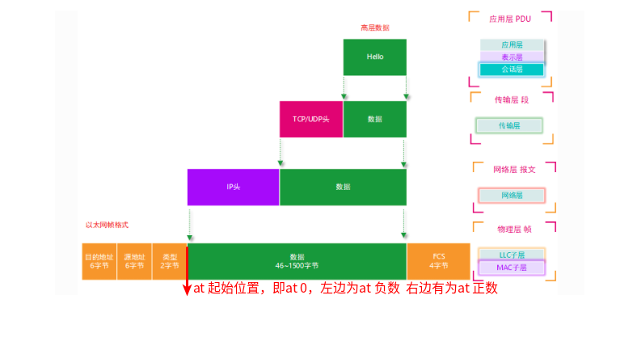
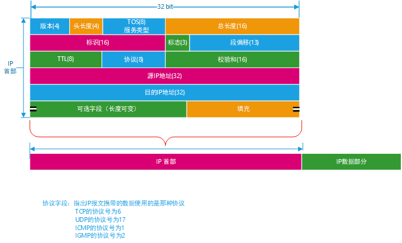
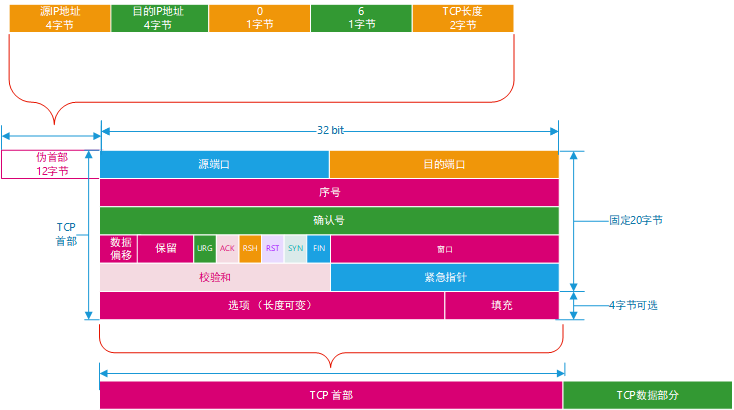
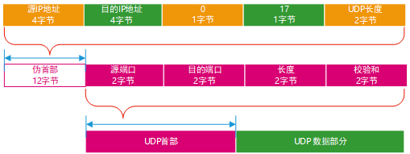
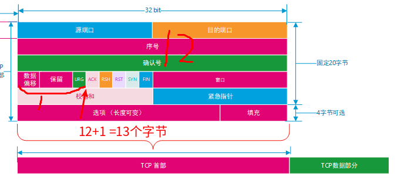

# TC工具之filter中U32工具匹配规则

## 规则讲解

```bash
tc filter add dev ifb0 parent 1: protocol ip u32 match u16 0x0800 0xffff at -2 flowid 100:0  
```

上面的命令`match u16 0x0800 0xffff  at -2 `  是什么意思呢，到底想匹配数据包的哪个字段？

看下面的图：at的起始位置是二层报文的协议类型的结尾，即第14个字节(6+6+2)后，左边为负 右边为正

- `match u16 0x0800 0xffff  at -2` 代表匹配以太网帧2字节的类型 ，掩码为0xffff，配置值为0x0800 即为IP数据报文，如果是ARP协议的话为0x0806
- `match u8 0xe2 0xff  at 1` 代表匹配ip协议的TOS字段 ，使用u8 匹配一个字节，0xff是掩码，at 1 是去掉1个字节（版本+头长度），即tos开始的位置，也可以使用`match u16 0x00e2 0x00ff  at 0` 效果一样，从at 0 开始，用u16匹配两个字节的数据，只不过我们不关心第一个字节的数据，所以掩码为0x00ff










## tc filter 中的u32一些常用的命令

- 源地址匹配`match ip src 192.168.1.200/24` 

  ```bash
  tc filter add dev ifb0 parent 1: protocol ip u32 match ip src 192.168.1.200/24   flowid 100:0  
  ```

- 目的地址匹配`match ip dst 192.168.1.200/24` 

  ```bash
  tc filter add dev ifb0 parent 1: protocol ip u32 match ip dst 192.168.1.200/24   flowid 100:0  
  ```

- 单个ip匹配`match ip  192.168.1.200/24` 

  ```bash
  tc filter add dev ifb0 parent 1: protocol ip u32 match ip  192.168.1.200/24   flowid 100:0  
  ```

- 端口匹配`match ip dport 80 0xffff` 或者源端口匹配`match ip sport 80 0xffff`

  这里的掩码其实可以匹配一段的端口号，例如下面：

  ```bash
   match ip sport 4096 0xf000 = sport 4096-8191
   match ip sport 8192 0xe000 = sport 8192-16383 
  
  ```

  

- 根据ip协议`match ip protocol 1 0xff` 这里的1(icmp)是根据/etc/protocols里面内容确定

  ```
  ip	0	IP		# internet protocol, pseudo protocol number
  hopopt	0	HOPOPT		# IPv6 Hop-by-Hop Option [RFC1883]
  icmp	1	ICMP		# internet control message protocol
  igmp	2	IGMP		# Internet Group Management
  ggp	3	GGP		# gateway-gateway protocol
  ipencap	4	IP-ENCAP	# IP encapsulated in IP (officially ``IP'')
  st	5	ST		# ST datagram mode
  tcp	6	TCP		# transmission control protocol
  egp	8	EGP		# exterior gateway protocol
  igp	9	IGP		# any private interior gateway (Cisco)
  pup	12	PUP		# PARC universal packet protocol
  udp	17	UDP		# user datagram protocol
  hmp	20	HMP		# host monitoring protocol
  xns-idp	22	XNS-IDP		# Xerox NS IDP
  rdp	27	RDP		# "reliable datagram" protocol
  iso-tp4	29	ISO-TP4		# ISO Transport Protocol class 4 [RFC905]
  dccp	33	DCCP		# Datagram Congestion Control Prot. [RFC4340]
  xtp	36	XTP		# Xpress Transfer Protocol
  ddp	37	DDP		# Datagram Delivery Protocol
  idpr-cmtp 38	IDPR-CMTP	# IDPR Control Message Transport
  ipv6	41	IPv6		# Internet Protocol, version 6
  ipv6-route 43	IPv6-Route	# Routing Header for IPv6
  ipv6-frag 44	IPv6-Frag	# Fragment Header for IPv6
  idrp	45	IDRP		# Inter-Domain Routing Protocol
  rsvp	46	RSVP		# Reservation Protocol
  gre	47	GRE		# General Routing Encapsulation
  esp	50	IPSEC-ESP	# Encap Security Payload [RFC2406]
  ah	51	IPSEC-AH	# Authentication Header [RFC2402]
  skip	57	SKIP		# SKIP
  ipv6-icmp 58	IPv6-ICMP	# ICMP for IPv6
  ipv6-nonxt 59	IPv6-NoNxt	# No Next Header for IPv6
  ipv6-opts 60	IPv6-Opts	# Destination Options for IPv6
  rspf	73	RSPF CPHB	# Radio Shortest Path First (officially CPHB)
  vmtp	81	VMTP		# Versatile Message Transport
  eigrp	88	EIGRP		# Enhanced Interior Routing Protocol (Cisco)
  ospf	89	OSPFIGP		# Open Shortest Path First IGP
  ax.25	93	AX.25		# AX.25 frames
  ipip	94	IPIP		# IP-within-IP Encapsulation Protocol
  etherip	97	ETHERIP		# Ethernet-within-IP Encapsulation [RFC3378]
  encap	98	ENCAP		# Yet Another IP encapsulation [RFC1241]
  #	99			# any private encryption scheme
  pim	103	PIM		# Protocol Independent Multicast
  ipcomp	108	IPCOMP		# IP Payload Compression Protocol
  vrrp	112	VRRP		# Virtual Router Redundancy Protocol [RFC5798]
  l2tp	115	L2TP		# Layer Two Tunneling Protocol [RFC2661]
  isis	124	ISIS		# IS-IS over IPv4
  sctp	132	SCTP		# Stream Control Transmission Protocol
  fc	133	FC		# Fibre Channel
  mobility-header 135 Mobility-Header # Mobility Support for IPv6 [RFC3775]
  udplite	136	UDPLite		# UDP-Lite [RFC3828]
  mpls-in-ip 137	MPLS-in-IP	# MPLS-in-IP [RFC4023]
  manet	138			# MANET Protocols [RFC5498]
  hip	139	HIP		# Host Identity Protocol
  shim6	140	Shim6		# Shim6 Protocol [RFC5533]
  wesp	141	WESP		# Wrapped Encapsulating Security Payload
  rohc	142	ROHC		# Robust Header Compression
  
  ```

  比如要匹配tcp协议`match ip protocol 6 0xff`

  比如要tos为0x90`match ip tos 0x90 0xff` 对应的dscp 为0x90>>2bit = 36  即匹配36的dscp标签


## 总结

```bash
match [ u32 | u16 | u8 ] PATTERN MASK [ at OFFSET | nexthdr+OFFSET]
```

- `[ u32 | u16 | u8 ]` :给出要匹配数据的位数

- PATTERN ：要匹配的值

- MASK ：掩码

- `[ at OFFSET | nexthdr+OFFSET]`：at的起始位置为二层协议后，即14字节后开始，向前为负 向后为正，如果出现nexthdr+ 则跳到上层协议开始处，

  例如下面的匹配，匹配协议为tcp协议，nexthdr跳过ip协议，来到他的上层协议tcp部分为起始位置，+13 刚好偏移到ack处，

  ```bash
   match ip protocol 6 0xff \
   match u8 0x10 0xff at nexthdr+13 \
  flowid 1:3
  ```

  
