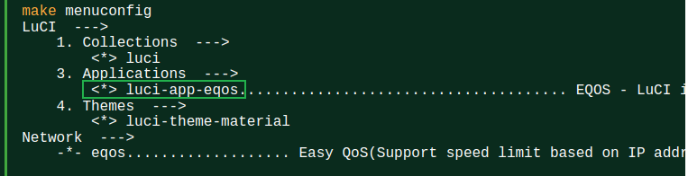
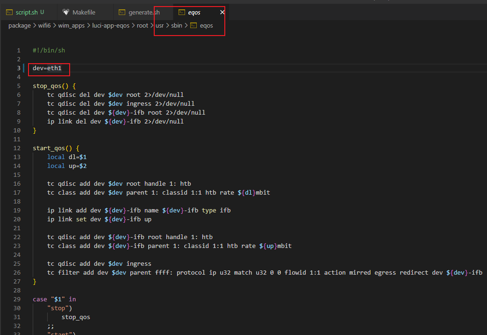
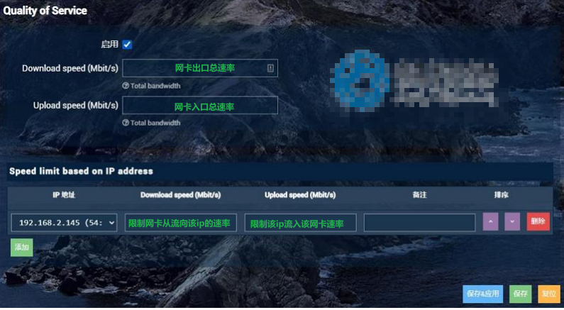

# 入口流量限速&Qos方案实践

## 入口限速

入口限速主要有两种方案

1. iptables 直接限速方案：使用iptables的`-m limit`模块进行流量限制
2. 入口队列方案：使用htb队列，对使用tc filter匹配的包进行限速

### iptables 直接限速方案

```bash
iptables -t mangle -A FORWARD  -s 192.168.50.200 -m limit --limit 2000/s --limit-burst 100 -j ACCEPT
iptables -t mangle -A FORWARD  -s 192.168.50.200 -j DROP
```

注意：测试OK

### 入口队列方案

参考eqos软件包，eqos软件包后面会介绍。

```bash
dl=512
up=512	 # 入口流量的总大小 单位 mbit
dev="eth1" # 入口的网卡


#tc qdisc add dev $dev root handle 1: htb
#tc class add dev $dev parent 1: classid 1:1 htb rate ${dl}mbit

ip link add dev ${dev}-ifb name ${dev}-ifb type ifb
ip link set dev ${dev}-ifb up

tc qdisc add dev ${dev}-ifb root handle 1: htb
tc class add dev ${dev}-ifb parent 1: classid 1:1 htb rate ${up}mbit

tc qdisc add dev $dev ingress
tc filter add dev $dev parent ffff: protocol ip u32 match u32 0 0 flowid 1:1 action mirred egress redirect dev ${dev}-ifb


ip="192.168.50.200" # 需要限制速度ip
ip_up=10 # 需要限制速度ip速度 单位为 mbit

cnt=$(tc class show dev $dev-ifb | wc -l) # 查看已经有多少条限速的ip了

tc class add dev ${dev}-ifb parent 1:1 classid 1:1$cnt htb rate ${ip_up}mbit ceil ${ip_up}mbit

tc filter add dev ${dev}-ifb parent 1:0 protocol ip u32 match ip src $ip flowid 1:1$cnt
```

注意：测试OK

## 入口队列 QOS

入口QOS主要分为两步：

1. 建立入口处的队列，队列方案可选hfsc或者htb
2. 包匹配和过滤，主要分为三种
   - a：直接使用`tc filter`匹配数据包，然后使用`tc filter flowid 1:20`指定流入队列的class
   - b：使用iptables mark标记包，然后使用`tc filter  handle $mark fw flowid 1:20`方法，指定流入队列的class
   - c：使用iptables 匹配数据包，然后使用`iptables -j CLASSIFY --set-class 1:20`属性来指定流入队列的class

### 常用队列

#### hfsc方案

```bash
insmod cls_u32 >&- 2>&-
insmod em_u32 >&- 2>&-
insmod act_connmark >&- 2>&-
insmod act_mirred >&- 2>&-
insmod sch_ingress >&- 2>&-
insmod cls_fw >&- 2>&-
insmod sch_hfsc >&- 2>&-
insmod sch_fq_codel >&- 2>&-

ifconfig ifb0 up txqueuelen 5 >&- 2>&-
tc qdisc del dev ifb0 root >&- 2>&-
tc qdisc add dev ifb0 root handle 1: hfsc default 30
tc class add dev ifb0 parent 1: classid 1:1 hfsc sc rate 512000kbit ul rate 512000kbit

tc qdisc del dev eth1 ingress >&- 2>&-
tc qdisc add dev eth1 ingress

tc filter add dev eth1 parent ffff: protocol ip u32 match u32 0 0 flowid 1:1 action mirred egress redirect dev ifb0


tc class add dev ifb0 parent 1:1 classid 1:10 hfsc rt m1 116053kbit d 3us m2 51200kbit ls m1 116053kbit d 3us m2 284444kbit ul rate 512000kbit
tc class add dev ifb0 parent 1:1 classid 1:20 hfsc rt m1 266808kbit d 3us m2 256000kbit ls m1 266808kbit d 3us m2 142222kbit ul rate 512000kbit
tc class add dev ifb0 parent 1:1 classid 1:30 hfsc ls m1 0kbit d 100000us m2 71111kbit ul rate 512000kbit
tc class add dev ifb0 parent 1:1 classid 1:40 hfsc ls m1 0kbit d 200000us m2 14222kbit ul rate 512000kbit
tc qdisc add dev ifb0 parent 1:10 handle 100: fq_codel limit 800 quantum 300 noecn
tc qdisc add dev ifb0 parent 1:20 handle 200: fq_codel limit 800 quantum 300 noecn
tc qdisc add dev ifb0 parent 1:30 handle 300: fq_codel limit 800 quantum 300 noecn
tc qdisc add dev ifb0 parent 1:40 handle 400: fq_codel limit 800 quantum 300 noecn

 

```


#### htb方案

```bash
insmod cls_u32 >&- 2>&-
insmod em_u32 >&- 2>&-
insmod act_connmark >&- 2>&-
insmod act_mirred >&- 2>&-
insmod sch_ingress >&- 2>&-
insmod cls_fw >&- 2>&-
insmod sch_hfsc >&- 2>&-
insmod sch_fq_codel >&- 2>&-

ifconfig ifb0 up txqueuelen 5 >&- 2>&-
tc qdisc del dev ifb0 root >&- 2>&-
tc qdisc add dev ifb0 root handle 1: htb default 30 #r2q 20
tc class add dev ifb0 parent 1: classid 1:1 htb rate 1000Mbit ceil 1000Mbit # burst 100k cburst 100k quantum 5000

tc qdisc del dev eth1 ingress >&- 2>&-
tc qdisc add dev eth1 ingress

tc filter add dev eth1 parent ffff: protocol ip u32 match u32 0 0 flowid 1:1 action mirred egress redirect dev ifb0

tc class add dev ifb0 parent 1:1 classid 1:10 htb rate 40Mbit   ceil 40Mbit    	#burst 30k cburst 30k priority 0 #priority
tc class add dev ifb0 parent 1:1 classid 1:20 htb rate 60Mbit   ceil 60Mbit  	#burst 30k cburst 30k priority 1 #express
tc class add dev ifb0 parent 1:1 classid 1:30 htb rate 800Mbit  ceil 800Mbps 	#burst 30k cburst 30k priority 2 #normal
tc class add dev ifb0 parent 1:1 classid 1:40 htb rate 100Mbit  ceil 100Mbps 	#burst 30k cburst 30k priority 3 #bulk

tc qdisc add dev ifb0 parent 1:10 handle 100: pfifo limit 100
tc qdisc add dev ifb0 parent 1:20 handle 200: pfifo limit 100
tc qdisc add dev ifb0 parent 1:30 handle 300: pfifo limit 100
tc qdisc add dev ifb0 parent 1:40 handle 400: pfifo limit 100 


```

### 过滤规则

#### 直接tc filter

```bash
tc filter add dev ifb0 parent 1: prio 2 protocol ip u32 match ip src 192.168.50.200 flowid 1:20
```

注意：测试OK

#### iptables mark

```bash
tc filter add dev ifb0 parent 1: prio 1 protocol ip handle 6 fw flowid 1:20 

iptables -t mangle -I FORWARD 1  -s 192.168.50.200 -j MARK --set-mark 6
iptables -t mangle -A FORWARD -j CONNMARK --save-mark
iptables -t mangle -A FORWARD -j CONNMARK --restore-mark
```

注意：没有测试成功

#### iptables CLASSIFY

```bash
iptables -t mangle -I FORWARD -s 192.168.50.200 -j CLASSIFY --set-class 1:20
```

注意：在QSDK上使用nsshtb 测试成功，使用Openwrt自带的htb没有测试成功


## htb优先级和tc filter 中优先级区别

1. htb中优先级和tc filter  中优先级概念
   - htb型class具有优先级，prio。可以指定优先级，数字低的优先级高，优先级范围从 0~7，0最高。
     它的效果是，存在空闲带宽时，优先满足高优先级class的需求，使得其可以占用全部空闲带宽，上限为ceil所指定的值。若此时还有剩余空闲带宽，则优先级稍低的class可以借用之。依优先级高低，逐级分配。相同优先级的class分配空闲带宽时，按照自身class所指定的rate（即保证带宽）之间的比例瓜分空闲带宽。例如：clsss A和B优先级相同，他们的rate比为3：5，则class A占用空闲的3/8，B占5/8。
   - tc filter的prio表示该filter的测试顺序，小的会优先进行测试，如果匹配到，则不会继续测试。故此filter 的prio跟class的prio并不一样。不同优先级的filter都可以匹配到包，则优先级高的filter起作用。相同优先级的filter（必须为同种类型classifier）严格按照命令的输入顺序进行匹配，先执行的filter起作用。

## eqos软件包

### 配置

1. 软件包下载地址

   https://github.com/kiss2u/luci-app-eqos

2. 加入编译

   

3. 修改需要限制的网卡

   

4. 配置

   

### 软件包源码解析

1. `etc/init.d/eqos`

   ```bash
   #!/bin/sh /etc/rc.common
   # Copyright (C) 2006 OpenWrt.org
   
   START=50
   
   parse_device() {
   	# 阅读步骤7
   	#此时的$1为 device
   	local cfg="$1" ip download upload
   	
   	# 得到配置文件中，device下的 ip
   	config_get ip "$cfg" ip
   	# 得到配置文件中，device下的 download
   	config_get download "$cfg" download
   	# 得到配置文件中，device下的 upload
   	config_get upload "$cfg" upload
   	
   	# 阅读步骤8
   	# 调用user/sbin/eqos add $ip $download $upload
   	# 具体参见user/sbin/eqos文件的 add作用(注意，这里作者没有单独拉函数出来)
   	eqos add $ip $download $upload
   }
   
   eqos_start() {
   	# 阅读步骤3
   	# 此时的$1为 eqos
   	local cfg="$1" enabled download upload
   	
   	# 得到配置文件中eqos的enabled使能位 赋值给本地变量  enabled
   	config_get_bool enabled "$cfg" enabled 0
   	# 如果 enabled==0 直接返回
   	[ $enabled -eq 0 ] && return 0
   	 
   	# 得到配置文件中eqos的download位 赋值给本地变量 download 流出网口的总流量
   	config_get download "$cfg" download
   	# 得到配置文件中eqos的upload位 赋值给本地变量 upload 流入网口的总流量
   	config_get upload "$cfg" upload
   	
   	# 阅读步骤4
   	# 调用user/sbin/eqos start $download $upload
   	# 具体参见user/sbin/eqos文件的 start_qos $download $upload 函数作用
   	eqos start $download $upload
   	
   	# 阅读步骤6
   	# 下面解析每个ip条目下的策略 具体参见 本文件的 parse_device device 函数
   	# 这个也是轮询调用的 解析device 选项
   	config_foreach parse_device device
   }
   
   start() {
   	# 阅读步骤1
   	# 调用命令为 user/sbin/eqos stop 
   	# 实际就是调用user/sbin/eqos 下的stop_qos函数
   	# 具体作用参见stop_qos函数
   	eqos stop
   	
   	# 加载/etc/config/eqos 配置文件
   	config_load eqos
   	# 针对eqos配置文件 轮询调用 eqos_start 函数
   	# 具体参考 eqos_start函数
   	config_foreach eqos_start eqos
   }
   
   stop() {
   	eqos stop
   }
   ```

   

2. `usr/sbin/eqos`

   ```bash
   #!/bin/sh
   
   dev=eth1
   
   stop_qos() {
   	# 阅读步骤2
   	# 删除 出口和入口根队列
   	tc qdisc del dev $dev root 2>/dev/null
   	tc qdisc del dev $dev ingress 2>/dev/null
   	# 删除 重定向网口的根队列 并删除重定向的网口，比如 eth1-ifb
   	tc qdisc del dev ${dev}-ifb root 2>/dev/null
   	ip link del dev ${dev}-ifb 2>/dev/null
   }
   
   start_qos() {
   	# 阅读步骤5
   	local dl=$1 #此时 $1 为 $download
   	local up=$2 #此时 $2 为 $upload
   	
   	# 新建出口队列的根队列节点，设置队列形式为htb 1:0
   	tc qdisc add dev $dev root handle 1: htb
   	# 在qdisc 1:0 上建立 class 1:1 限制速率为 出口速率${dl}mbit 即流出网卡的
   	tc class add dev $dev parent 1: classid 1:1 htb rate ${dl}mbit
   	
   	
   	#新建虚拟网卡 比如 eth1-ifb
   	ip link add dev ${dev}-ifb name ${dev}-ifb type ifb
   	ip link set dev ${dev}-ifb up
   	
   	#在虚拟网卡上建立根队列 1:0 
   	tc qdisc add dev ${dev}-ifb root handle 1: htb
   	#在根队列qdisc 1:0 上建立 class 1:1 限制速率为 入口速率${dl}mbit 即流入网卡的
   	tc class add dev ${dev}-ifb parent 1: classid 1:1 htb rate ${up}mbit
   	
   	#重定向网卡入口出的流量到 虚拟网卡 ${dev}-ifb 上，方便对入口流量控制
   	#说白了就是流入实际网卡的流量，不好控制，先把流量引入虚拟网卡上，当对虚拟网卡进行流量控制的时候
   	#相当于对实际网卡的入口在控制，在出口控制会方便很多，为什么，因为可操作的命令相当多。
   	tc qdisc add dev $dev ingress
   	tc filter add dev $dev parent ffff: protocol ip u32 match u32 0 0 flowid 1:1 action mirred egress redirect dev ${dev}-ifb
   }
   
   case "$1" in
   	"stop")
   		stop_qos
   	;;
   	"start")
   		stop_qos
   		start_qos $2 $3
   	;;
   	"add")
   		# 阅读步骤8
   		ip="$2" #需要限制的ip是哪个
   		dl="$3" #需要限制的下行流量
   		up="$4" #需要限制的上行流量
   		
   		# 得到已经有几个ip限速了，会在此基础上 增加
   		cnt=$(tc class show dev $dev | wc -l)
   		
   		#出口流量控制 新建class 1:1$cnt 且流量限制${dl}mbit ，
   		tc class add dev $dev parent 1:1 classid 1:1$cnt htb rate ${dl}mbit ceil ${dl}mbit
   		# 使用u32 匹配ip地址，然后 引入到 class 1:1$cnt 中去
   		tc filter add dev $dev parent 1:0 protocol ip u32 match ip dst $ip flowid 1:1$cnt
   		
   		#入口流量控制 新建class 1:1$cnt 且流量限制${up}mbit ，
   		tc class add dev ${dev}-ifb parent 1:1 classid 1:1$cnt htb rate ${up}mbit ceil ${up}mbit
   		# 使用u32 匹配ip地址，然后 引入到 class 1:1$cnt 中去
   		tc filter add dev ${dev}-ifb parent 1:0 protocol ip u32 match ip src $ip flowid 1:1$cnt
   	;;
   	*)
   		echo "Usage: $0 <command> [options]"
   		echo "Commands:"
   		echo "  start dl_rate up_rate       #Total bandwidth (Mbit/s)"
   		echo "  stop"
   		echo "  add ip dl_rate up_rate      #Limiting the bandwidth of a single IP (Mbit/s)"
   		echo "Example:"
   		echo "  $0 start 30 20              # Total bandwidth: down 30Mbit/s up 20Mbit/s"
   		echo "  $0 add 192.168.22.12 10 2   # down 10Mbit/s  up 2Mbit/s"
   	;;
   esac
   ```

   

3. 


 


