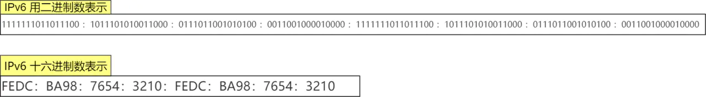

# IP地址介绍

## 概述


IP地址分为IPV4和IPV6，通常我们说的IP地址是指IPV4地址。

计算机网络体系结构分为3种：OSI体系结构（七层）、TCP/IP体系结构（四层）和五层体系结构。

- OSI体系结构：7层结构，概念清楚，理论也比较完整，但是它既复杂又不实用；
- TCP/IP体系结构：4层结构，TCP/IP是一个四层体系结构，得到了广泛的运用；
- 五层体系结构：5层结构，为了方便学习，折中OSI体系结构和TCP/IP体系结构，综合二者的优点，这样既简洁，又能将概念讲清楚。这种结构就是OSI参考模型的应用层、表示层、会话层 统称为应用层，其他的和OSI参考模型一样，这里仅仅说明一下，在下图中并没有反应。


1. 下图是OSI参考模型和TCP/IP参考模型的对比，而今天的重点，IP层从OSI参考模型中位于第三层，从TCP/IP参考模型中处于第二层网络层，如下图所示：

   

2. 下图是基于TCP/IP参考模型的具体报文如下：

   

3. 下图是IP协议报文具体所示：

   

## IPv4

### IP地址分类

IP地址设计之初只有IPV4，是一个32位的整数，**网络号+主机号**，表现方法如下：


从上图中可以看出：

1. A类IP地址网络号7bit ，一共可以表示126个，计算方式如下：
   $$
   126=2^7-2
   $$
   为什么减去2个，原因如下：

   - IP地址中网络号字段为全0的IP地址是个保留地址，意思是本网络；
   - 网络号为127（即1111111b）保留作为本地软件环回测试本主机的进程之间的通信之用。

   A类IP地址主机号24bit，一共16777214个，计算方式如下：

   
   $$
   16777214=2^{24} -2
   $$
   为什么减去2个，原因如下：

   - 全0的主机号字段表示该IP地址是“本主机”所连接到的单个网络地址
   - 而全1表示“所有的（all）”，因此全1的主机号字段表示该网络上的所有主机

   

2. B类IP地址网络号为14bit，一共可以表示16383个，计算方式如下
   $$
   16383=2^{14}-1
   $$
   为什么减去1个。原因如下：

   - B类网络地址128.0.0.0是不指派的，而可以指派的B类最小网络地址是128.1.0.0

   B类地址最大主机数65534，计算方式如下：
   $$
   65534=2^{16}-2
   $$
   为什么减去2个，同A类地址一致，这里需要减2是因为要扣除全0和全1的主机号。

3. C类地址21bit网络号，C类网络地址192.0.0.0也是不指派的，可以指派的C类最小网络地址是192.0.1.0，因此C类地址可指派的网络总数是2097151，计算方式如下
   $$
   2097151=2^{21}-1
   $$
   C类主机号8bit，同理扣除全0和全1的主机号，就是254，计算方式如下：
   $$
   254=2^8-2
   $$
   

综上所述：


而D 类和 E 类地址是没有主机号的，所以不可以用于主机 IP，D 类常被用于多播，E 类是预留的分类，暂时未使用。


知识点：单播、广播和多播的关系：


多播使用的 D 类地址，其前四位是 1110 就表示是多播地址，而剩下的 28 位是多播的组编号。

从 224.0.0.0 ~ 239.255.255.255 都是多播的可用范围，其划分为以下三类：

- 224.0.0.0 ~ 224.0.0.255 为预留的组播地址，只能局域网中，路由器是不会进行转发的。
- 224.0.1.0 ~ 238.255.255.255 为用户可用的组播地址，可以用于 Internet 上。
- 239.0.0.0 ~ 239.255.255.255 为本地管理组播地址，可供内部网在内部使用，仅在特定的本地范围内有效。

代码中判断IP地址是哪一类的时候也很简单，流程如下：


### 子网划分

上面介绍的两级IP地址划分存在很多弊端：

- IP地址空间的利用率有时很低；
- 给每一个物理网络分配一个网络号会使路由表变得太大因而使网络性能变坏；
- 两级IP地址不够灵活。

所以在此基础上，从1985年起，在IP地址中又增加了一个**子网号字段**，使两级IP地址变成为三级IP地址，它能够较好地解决上述问题，并且使用起来也很灵活。这种做法叫做划分子网。

三级IP地址表现形式为**网络号+子网号+主机号**。

凡是从其他网络发送给本单位某台主机的IP数据报，仍然是根据IP数据报的目的**网络号**找到连接在本单位网络上的路由器。但此路由器在收到IP数据报后，再按目的网络号和**子网号**找到目的子网，把IP数据报交付目的主机。如下图所示：


假定有一个数据报（其目的地址是145.13.3.10）已经到达了路由器。那么这个路由器如何把它转发到子网145.13.3.0呢？

我们知道，从IP数据报的首部无法看出源主机或目的主机所连接的网络是否进行了子网的划分。这是因为32位的IP地址本身以及数据报的首部都没有包含任何有关子网划分的信息。因此必须另外想办法，这就是使用子网掩码。


为了使路由器R1，能够很方便地从数据报中的目的IP地址中提取出所要找的子网的网络地址，路由器R1就要使用三级IP地址的子网掩码，路由器R1把三级IP地址的子网掩码和收到的数据报的目的IP地址145.13.3.10与运算，得出了所要找的子网的网络地址145.13.3.0，故而找到了前往145.13.3.10的数据报文要到145.13.3.0这个子网中去。

### 超网的组成

#### CIDR无分类编址

划分子网在一定程度上缓解了互联网在发展中遇到的困难。然而在1992年互联网仍然面临三个必须尽早解决的问题，

- B类地址在1992年已分配了近一半，眼看很快就将全部分配完毕！
- 互联网主干网上的路由表中的项目数急剧增长（从几千个增长到几万个）。
- 整个IPv4的地址空间最终将全部耗尽。

在一个划分子网的网络中可同时使用几个不同的子网掩码。使用变长子网掩码VLSM可进一步提高IP地址资源的利用率。在VLSM的基础上又进一步研究出无分类编址方法，它的正式名字是无分类域间路由选择 CIDR。

#### CIDR最主要的特点

1. CIDR 消除了传统的A类、B类和C类地址以及划分子网的概念，因而能更加有效地分配IPv4的地址空间，CIDR把32位的IP地址划分为前后两个部分。前面部分是“网络前缀”（或简称为“前缀”），用来指明网络，后面部分则用来指明主机。因此CIDR使IP地址从三级编址（使用子网掩码）又回到了两级编址，但这已是无分类的两级编址。其表示方法为**网络前缀+主机号**

   CIDR还使用斜线记法，或称为CIDR记法，即在IP地址后面加上斜线**/**，然后写上网络前缀所占的位数。

2. CIDR把网络前缀都相同的连续的IP地址组成一个“CIDR地址块”。我们只要知道CIDR地址块中的任何一个地址，就可以知道这个地址块的起始地址（即最小地址）和最大地址，以及地址块中的地址数。

已知IP地址128.14.35.7/20是某CIDR地址块中的一个地址，现在把它写成二进制表示，其中的前20位是网络前缀，而前缀后面的12位是主机号。

```
128.14.35.7/20 = 1000 0000 0000 1110 0010      0011 0000 0111
```

这个地址所在的地址块中的最小地址和最大地址可以很方便地得出：


当然，以上这两个特殊地址的主机号是全0和全1的地址。一般并不使用。通常只使用在这两个特殊地址之间的地址。

为了更方便地进行路由选择，CIDR使用32位的地址掩码。地址掩码也可继续称为子网掩码。例如，**/20**地址块的地址掩码是：11111111 11111111 11110000 00000000（20个连续的1）。斜线记法中，斜线后面的数字就是地址掩码中1的个数。

由于一个CIDR地址块中有很多地址，所以在路由表中就利用CIDR地址块来查找目的网络。这种地址的聚合常称为路由聚合，它使得路由表中的一个项目可以表示原来传统分类地址的很多个（例如上千个）路由。路由聚合也称为构成超网。

#### 最长前缀匹配

在发送 IP 包时，首先要确定 IP 包首部中的目标地址，再从路由控制表中找到与该地址具有相同网络地址的记录，根据该记录将 IP 包转发给相应的下一个路由器。如果路由控制表中存在多条相同网络地址的记录，就选择相同位数最多的网络地址，也就是最长匹配。

下面以下图的网络链路作为例子说明：


如上图所示：

1. 主机 A 要发送一个 IP 包，其源地址是 10.1.1.30 和目标地址是 10.1.2.10，由于没有在主机 A 路由表找到与目标地址 10.1.2.10 的网络地址，于是把包被转发到默认路由（路由器 1 ）
2. 路由器 1 收到 IP 包后，也在路由器 1 路由表匹配与目标地址相同的网络地址记录，发现匹配到了，于是就把 IP 数据包转发到了 10.1.0.2 这台路由器 2
3. 路由器 2 收到后，同样对比自身的路由表，发现匹配到了，于是把 IP 包从路由器 2 的 10.1.2.1 这个接口出去，最终经过交换机把 IP 数据包转发到了目标主机上。

#### IP 分片与重组

每种数据链路的最大传输单元 MTU 都是不相同的，如 FDDI 数据链路 MTU 4352、以太网的 MTU 是 1500 字节等。每种数据链路的 MTU 之所以不同，是因为每个不同类型的数据链路的使用目的不同。使用目的不同，可承载的 MTU 也就不同。

其中，我们最常见数据链路是以太网，它的 MTU 是 1500 字节。那么当 IP 数据包大小大于 MTU 时， IP 数据包就会被分片。

经过分片之后的 IP 数据报在被重组的时候，只能由目标主机进行，路由器是不会进行重组的。

假设发送方发送一个 4000 字节的大数据报，若要传输在以太网链路，则需要把数据报分片成 3 个小数据报进行传输，再交由接收方重组成大数据报。


**分片与重组**

在分片传输中，一旦某个分片丢失，则会造成整个 IP 数据报作废，所以 TCP 引入了 MSS 也就是在 TCP 进行分片不由 IP 层分片，那么对于 UDP 我们尽量不要发送一个大于 MTU 的数据报文。

## IPv6

Pv4 地址长度共 32 位，是以每 8 位作为一组，并用**.**加十进制的表示方式。

IPv6 地址长度是 128 位，是以每 16 位作为一组，每组用冒号 **:** 隔开



如果出现连续的 0 还可以将这些 0 省略，并用两个冒号 **::**隔开。但是，一个 IP 地址中只允许出现一次两个连续的冒号


IPv6 类似 IPv4，也是通过 IP 地址的前几位标识 IP 地址的种类

IPv6 的地址主要有一下类型地址：

单播地址，用于一对一的通信组播地址，用于一对多的通信任播地址，用于通信最近的节点，最近的节点是由路由协议决定没有广播地址


IPv4 首部与 IPv6 首部的差异如下图：


## 参考

知识和图片来自于谢希仁老师的《计算机网络》第七版 


