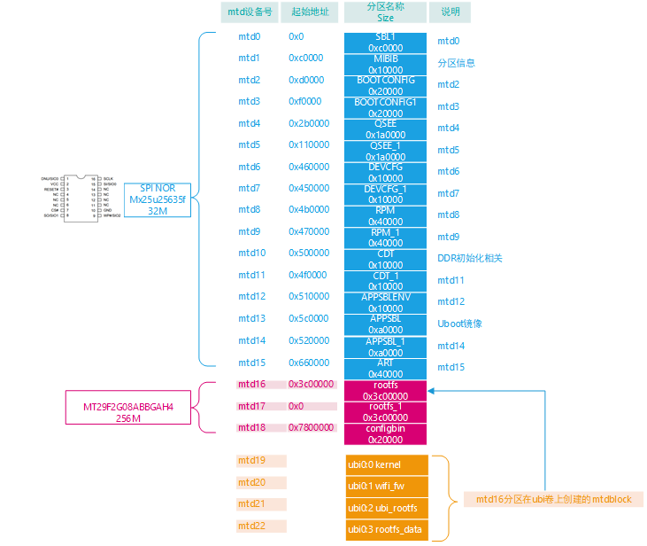

# 内核阶段dd命令读取norflash内容

## OperWrt读取Norflash中内容

OpenWrt路由设备使用的是Nor(32M)+Nand(256M)组合的存储方式，如下：



前16个mtd块（mtd0~mtd15）使用32M的 SPI norflash ，mtd16~mtd22 使用的是256M的nandflash。

如何把mtd0~mtd15内容按照图中的flash布局读出来为一个32M的bin文件？

方案如下：

1. 注意各个mtd分区的起始地址，如图所示，例如mtd1起始地址为0xc0000

2. 启动开发板子，制作一个32M大小的空文件

   ```bash
   dd if=/dev/zero of=/tmp/nor.bin   bs=1M count=32  && sync
   ```

   

3. 分別执行下面的命令，读取mtd里面的内容到`/tmp/nor.bin`

   ```bash
   dd if=/dev/mtd0  of=/tmp/nor.bin  seek=0      bs=1024 conv=notrunc
   dd if=/dev/mtd1  of=/tmp/nor.bin  seek=768    bs=1024 conv=notrunc
   dd if=/dev/mtd2  of=/tmp/nor.bin  seek=832    bs=1024 conv=notrunc
   dd if=/dev/mtd3  of=/tmp/nor.bin  seek=960    bs=1024 conv=notrunc
   dd if=/dev/mtd4  of=/tmp/nor.bin  seek=1088   bs=1024 conv=notrunc
   dd if=/dev/mtd5  of=/tmp/nor.bin  seek=2752   bs=1024 conv=notrunc
   dd if=/dev/mtd6  of=/tmp/nor.bin  seek=4416   bs=1024 conv=notrunc
   dd if=/dev/mtd7  of=/tmp/nor.bin  seek=4480   bs=1024 conv=notrunc
   dd if=/dev/mtd8  of=/tmp/nor.bin  seek=4544   bs=1024 conv=notrunc
   dd if=/dev/mtd9  of=/tmp/nor.bin  seek=4800   bs=1024 conv=notrunc
   dd if=/dev/mtd10 of=/tmp/nor.bin  seek=5056   bs=1024 conv=notrunc
   dd if=/dev/mtd11 of=/tmp/nor.bin  seek=5120   bs=1024 conv=notrunc
   dd if=/dev/mtd12 of=/tmp/nor.bin  seek=5184   bs=1024 conv=notrunc
   dd if=/dev/mtd13 of=/tmp/nor.bin  seek=5248   bs=1024 conv=notrunc
   dd if=/dev/mtd14 of=/tmp/nor.bin  seek=5888   bs=1024 conv=notrunc
   dd if=/dev/mtd15 of=/tmp/nor.bin  seek=6528   bs=1024 conv=notrunc
   ```

   解释如下：

   - `if=/dev/mtd0` 为要读取的输入数据源

   - `of=/tmp/nor.bin` 要输出文件名字为`/tmp/nor.bin`

   - `bs=1024` 说明每次读出和写入的字节数为1024字节 即1k  该值也为dd命令的block大小

   - `seek=`  为该分区所在的起始地址除以bs大小，例如mtd1起始地址为0xc0000/1024 =768 ,故而

     seek=768  说白了就是写入`/tmp/nor.bin`的时候，要跳过768 个block，因为前768个block是mtd0的分区

   - `conv=notrunc`  notrunc 表示不缩减输出文件，也就是每次只按照指定的地址去覆盖32M空间的属于自己的那部分

4. 拷贝输出文件到pc

   ```bash
   scp /tmp/nor.bin book@192.168.50.200:/home/book/works
   ```

5. 至此结束，就可以读出前16个分区 即norflash里面的内容了，然后我们就可以用flash烧写工具把该bin文件整个烧录到norflash中。

## Linux dd命令

Linux dd 命令用于读取、转换并输出数据。

dd 可从标准输入或文件中读取数据，根据指定的格式来转换数据，再输出到文件、设备或标准输出。

参数说明:

- if=文件名：输入文件名，默认为标准输入。即指定源文件。
- of=文件名：输出文件名，默认为标准输出。即指定目的文件。
- ibs=bytes：一次读入bytes个字节，即指定一个块大小为bytes个字节。
- obs=bytes：一次输出bytes个字节，即指定一个块大小为bytes个字节。
- bs=bytes：同时设置读入/输出的块大小为bytes个字节。
- cbs=bytes：一次转换bytes个字节，即指定转换缓冲区大小。
- skip=blocks：从输入文件开头跳过blocks个块后再开始复制。
- seek=blocks：从输出文件开头跳过blocks个块后再开始复制。
- count=blocks：仅拷贝blocks个块，块大小等于ibs指定的字节数。
- conv=<关键字>，关键字可以有以下11种：
  - conversion：用指定的参数转换文件。
  - ascii：转换ebcdic为ascii
  - ebcdic：转换ascii为ebcdic
  - ibm：转换ascii为alternate ebcdic
  - block：把每一行转换为长度为cbs，不足部分用空格填充
  - unblock：使每一行的长度都为cbs，不足部分用空格填充
  - lcase：把大写字符转换为小写字符
  - ucase：把小写字符转换为大写字符
  - swap：交换输入的每对字节
  - noerror：出错时不停止
  - notrunc：不截短输出文件
  - sync：将每个输入块填充到ibs个字节，不足部分用空（NUL）字符补齐。
- --help：显示帮助信息
- --version：显示版本信息

