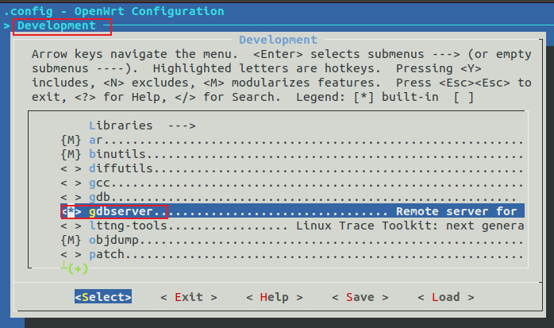
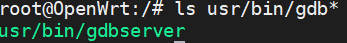
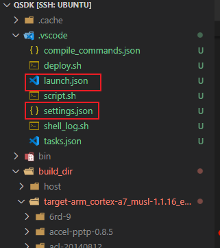
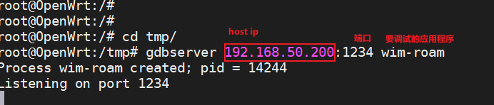
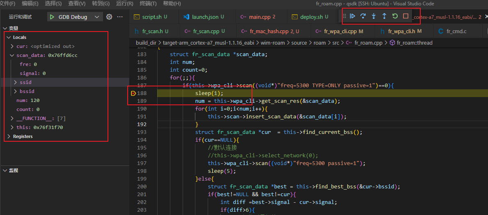

# Openwrt 基于VsCode gdb调试应用程序

1. 编译gdbserver到开发板

   如下图所示：使能gdbserver，

   

   编译完后下载镜像到在OpenWrt主板上，会发现下面的应用程序：

   

2. 配置vscode

   我们知道OpenWrt规则，编译和生成的目标文件在`build_dir`目录，我们需要在vscode的.vscode目录下添加下面内容

   

   - setting.json文件内容如下：下面的目标板子的ip地址需要自行修改

     ```
     {
     
         "FR_ENV": {
         	/* 目标板子ip地址 */
         	"FR_TARGET_IP":"192.168.50.1",
     		"FR_TARGET_PORT":"1234",
         	/* Project Settings */
     		"FR_STAGING_DIR":"${workspaceFolder}/staging_dir",
     		"FR_BUILD_DIR":"${workspaceFolder}/build_dir",
     		//应用程序目录
     		"FR_PROGRAM_DIR":"${config:FR_ENV.FR_BUILD_DIR}/target-arm_cortex-a7_musl-1.1.16_eabi/wim-roam",
     		//应用程序
     		"FR_PROGRAM":    "${config:FR_ENV.FR_PROGRAM_DIR}/wim-roam",
     		//应用程序源码目录
     		"FR_PROGRAM_SRC_DIR":"${workspaceFolder}/package/wifi6/wim_apps/wim-roam",
     		
         	//"FR_ARCH":"arm-openwrt-linux-muslgnueabi",
         	//"FR_SDKTARGETSYSROOT": "${STAGING_DIR}/target-arm_cortex-a7_musl-1.1.16_eabi",
     
         	/* 编译器相关 */
         	"FR_CC_PREFIX":"${config:FR_ENV.FR_STAGING_DIR}/toolchain-arm_cortex-a7_gcc-5.2.0_musl-1.1.16_eabi/bin/arm-openwrt-linux-muslgnueabi-",
         	"FR_CXX":"${config:FR_ENV.FR_CC_PREFIX}g++",
         	"FR_CC" :"${config:FR_ENV.FR_CC_PREFIX}gcc",
     		"FR_GDB":"${config:FR_ENV.FR_CC_PREFIX}gdb"
     	},
     	
     }
     ```

     

   - launch.json内容如下：下面的内容不用任何改動

     ```
     {
         "version": "0.2.0",
         "configurations": [
             {
                 "name": "GDB Debug",
                 "type": "cppdbg",
                 "request": "launch",
                 "program": "${config:FR_ENV.FR_PROGRAM}",
                 "args": [],
                 "stopAtEntry": false,
                 "cwd": "${config:FR_ENV.FR_PROGRAM_DIR}",
                 "environment": [],
                 "externalConsole": false,
     			"targetArchitecture": "arm",
                 "MIMode": "gdb",
     			//"preLaunchTask": "deploy-gdb",
                 "setupCommands": [
                     {
                         "description": "为 gdb 启用整齐打印",
                         "text": "-enable-pretty-printing",
                         "ignoreFailures": true
                     }
                 ],
     			"miDebuggerPath": "${config:FR_ENV.FR_GDB}",			
                 "miDebuggerServerAddress": "${config:FR_ENV.FR_TARGET_IP}:${config:FR_ENV.FR_TARGET_PORT}",
             }
         ]
     }
     ```

     

3. 启动调试

   - 主板开启gdbserver

     

   - 在vscode上按下F5快捷键，如下图所示可以调试了。

     

   