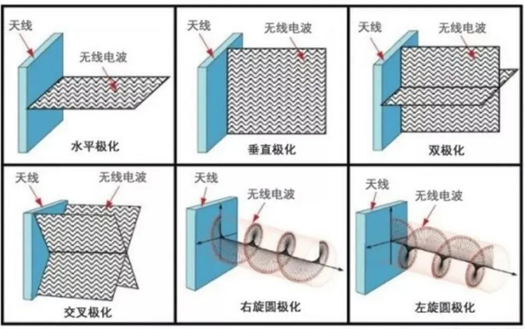

# 无线知识

## 频谱划分

对于wifi，常用的频段为2.4G、5.2G、5.8G

### 2.4G


- 中心频率范围2.412GHz-2.484GHz，包含14个channel

- 每个channel，宽度其实是22MHz, 和常说的20M带宽有2M差别，多出来的这2M属于保护隔离频带。

- 每个信道对应一个中心频点，信道1的中心频点2412MHz，信道2的中心频点是2417MHz，相差5M，其他依次类推；信道14是特例，相差12M

- 互不干扰的信道，有4组，1/6/11, 2/7/12，3/8/13，4/9/14。最常用的是第一组，1、6、11

  

- 协议中有两处对此进行描述：2.471 GHz to 2.497 GHz频段是由日本监管机构分配，可以认为是信道14只有日本在使用。

### 5.8G


- 频率范围在 5150MHz - 5825MHz，俗称5G Wi-Fi频段，这个频段里面一共有201个信道，但是，能够被Wi-Fi协议所用的信道却很少。原因是5G的频率很特殊，甚至有关国家安全，因为5G wifi的频率与军用雷达频段重合，因此，很多国家基于国家安全考虑，对5G频段持保留态度。

- 相邻信道中心频点间隔还是5MHz

- 在中国，只有36, 40, 44, 48, 52, 56, 60, 64, 149, 153, 157, 161, 165这13个信道可以供5G的wifi网络使用

- 5G的频道编号和中心频率

  

## wifi速率计算

### 空间流数量

- 无线电在同一时间发送多个信号，每一份信号都是一个空间流
- 空间流使用发射端的天线进行发送，每个空间流通过不同的路径到达接收端。无线系统能够发送或接收空间流，并能够区分发往或来自不同空间方位的信号
- 通常情况下，一个发送电线和一个接收天线间可以建立一个空间流，比如说AP有4个天线，接受的STA也有4个天线，那么同时就有4个空间流。
- 由于802.11ac及802.11ax协议规定一个射频最大8个空间流，在这种情况下，就算有12个天线，也只能有8个空间流


### Symbol 与 GI

Symbol 就是时域上的传输信号，相邻的两个Symbol 之间需要有一定的空隙（GI），以避免 Symbol 之间的干扰。不同 Wi-Fi 标准下的间隙也有不同，一般来说传输速度较快时 GI 需要适当增大。


### 编码方式

编码方式就是调制技术，即 1 个 Symbol 里面能承载的 bit 数量。从 Wi-Fi 1 到 Wi-Fi 6，每次调制技术的提升，都能至少给每条空间流速率带来 20%以上的提升


### 码率

理论上应该是按照编码方式无损传输，但现实没有这么美好。传输时需要加入一些用于纠错的信息码，用冗余换取高可靠度。码率就是排除纠错码之后实际真实传输的数据码占理论值的比例


说明：调整方式中的16-QAM或者64-QAM中的16和64是指调制阶数，和每个Symbol有多少个bit位的关系如下
$$
bit数/Symbol=log2^(调制阶数)
$$
例如对于64-QAM 的
$$
bit数/Symbol=log2^(64) = 6
$$


### 有效子载波数量

载波类似于频域上的 Symbol，一个子载波承载一个 Symbol，不同调制方式及不同频宽下的子载波数量不一样


### 计算

```
MIMO数 x 1/（symbol+GI） x bit/子载波 x 编码率 x 有效子载波数量
```

至此，我们可以计算一下 802.11ac 与 802.11ax 在 HT80 频宽下的单条空间流最大速率：


```bash
#比如针对802.11ax 单条流速率计算为

1*1/(12.8+0.8)*10*(5/6)*980 = 600Mbit/s
```

再比如下面8条流的计算


## 天线极化方向

天线在远场条件下辐射的都是横电磁波（下图中的蓝色），电场矢量的方向（红色）和磁场垂直，且同时垂直于传播方向。于是，无线电波在空间传播时，其电场方向是按一定的规律而变化的，这种现象称为无线电波的极化


如电波的电场方向垂直于地面，我们称它为垂直极化波。同理，平行于地面，就是水平极化波。另外，还有±45°的极化


下图是常见的天线极化的方式，虽然存在多种极化类型，但主要分为三种：




- 线极化
  - 垂直极化
  - 水平极化
- 圆极化
  - 左旋圆极化天线
  - 右旋圆极化天线
- 椭圆极化 
  - 由线极化和圆极化通过复杂组合而形成的椭圆极化天线

根据极化的数量，还可以分为

- 单极化
- 双极化

双极化可以是两个线极化，也可以是两个圆极化(左旋圆极化和右旋圆极化)

极化不同可能会导致信息传输失败。理清楚这个，可以帮助我们在实际应用中分析哪些情况是因为极化导致的信息传输效率差，也能在做应用方案的时候，快速选出适合应用的极化类型的天线产品，定出安装方式。不同应用可从不同的极化方式获得更佳效果。例如，由于垂直极化电磁波比水平极化电磁波更加易于穿过起伏不平的地貌，因此垂直极化天线在陆地移动通信用途中具有更佳表现，而水平极化方式在仰赖电离层且通常为长距离通信的用途中表现更好。此外，由于圆极化通常可更佳地缓解卫星定向偏移导致的衰弱，因此圆极化常应用于卫星通信。

### 线极化

线极化描述电场矢量在空间的取向固定不变的电磁波叫线极化。

电场矢量方向与地面平行的叫水平极化，

电场矢量方向与地面垂直的叫垂直极化。

电场矢量与传播方向构成的平面叫极化平面

- 垂直极化波的极化平面与地面垂直
- 水平极化波的极化平面则垂直于入射线、反射线和入射点地面的法线构成的入射平面


双极化天线就是有水平和垂直两个方向的极化，而单极化天线仅是水平或者垂直。双极化天线示意图：


单极化天线示意图：

