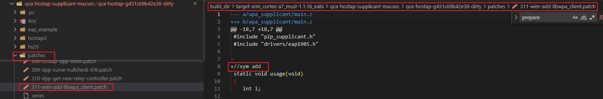

# Openwrt quilt补丁

本章主要介绍给软件包制作patch补丁方法。

## 安装配置quilt工具

1. 安装如下

   ```bash
   sudo apt-get install quilt
   ```

2. 配置

   `~/.quiltrc`文件内容如下：

   ```bash
   QUILT_DIFF_ARGS="--no-timestamps --no-index -p ab --color=auto"
   QUILT_REFRESH_ARGS="--no-timestamps --no-index -p ab"
   QUILT_PATCH_OPTS="--unified"
   QUILT_DIFF_OPTS="-p"
   EDITOR="vim"
   ```
   
   **注意：**当然这里的编辑器也可以换为vscode，例如我的vscode安装目录为`/snap/bin/code`，下面是用vscode作为配置的案例：
   
   ```bash
   QUILT_DIFF_ARGS="--no-timestamps --no-index -p ab --color=auto"
   QUILT_REFRESH_ARGS="--no-timestamps --no-index -p ab"
   QUILT_PATCH_OPTS="--unified"
   QUILT_DIFF_OPTS="-p"
   EDITOR="/snap/bin/code"
   ```
   
   


下面以`package/feeds/qca/qca-hostap`软件包为例说明：

`package/feeds/qca/qca-hostap`下面的目录如下：


- files目录下存放配置

- Makefile定义软件包

  如下图所示：定义了该软件包当前已经拥有的补丁的路径为`PATCH_DIR:=$(TOPDIR)/qca/src/$(PKG_NAME)/qca-patches`

  

  查看该路径如下图所示，其实qca-hostap的源码也存放在该路径下：

  

  

  如何打补丁？请见下面分享

  


  

## 打补丁步骤

1. 首先下载软件包并进行unpack

   ```bash
   make package/feeds/qca/qca-hostap/{clean,prepare} V=s QUILT=1
   ```

   经过测试用下面的命令也可以，使用该命令的时候无需在执行下面第三步的`quilt push -a`命令，也就是`compile`已经完成了该动作

   ```
   make package/feeds/qca/qca-hostap/{clean,compile} V=s QUILT=1
   ```

   

2. 进入编译目录查看并查看现有patch

   ```bash
   cd build_dir/target-arm_cortex-a7_musl-1.1.16_eabi/qca-hostap-supplicant-macsec/qca-hostap-g431c69b42e38-dirty/
   
   #查看现有的补丁
   quilt series
   ```

   如下图：

   

3. 打入已有patch，如果上面使用的compile命令编译，该步骤无需执行。

   ```
   quilt push -a
   ```

   过程如下：

   

4. 创建新的patch

   ```bash
   quilt new 311-wim-add-libwpa_client.patch
   ```

   注意：要查看下`PATCH_DIR:=$(TOPDIR)/qca/src/$(PKG_NAME)/qca-patches`目录下现有的补丁已经到了多少编号？或者用`quilt series`命令查看补丁已经到了多少编号，新补丁在此基础上加1即可。

   我看自己的已经到了310，如下

   

   所以这里我新建的补丁为**311**-wim-add-libwpa_client.patch的编号。

5. 修改文件，比如我想修改`wpa_supplicant/main.c`文件，命令如下：

   ```
   quilt edit wpa_supplicant/main.c
   ```

   输入上面的命令进入vim模式修改后，退出，例如我新增了内如如下：

   

   使用`quilt diff`查看补丁文件如下：

   

   注意：如果是需要多个文件，就重复该步骤即可；如果是创建新文件，命令一样，也是`quilt edit new.c`

6. 保存内如更新到patch文件

   ```
   quilt refresh
   ```

   该命令会将刚才修改的内容更新 `patches/311-wim-add-libwpa_client.patch`里面

   

7. 移动`build_dir/target-arm_cortex-a7_musl-1.1.16_eabi/qca-hostap-supplicant-macsec/qca-hostap-g431c69b42e38-dirty/patches/311-wim-add-libwpa_client.patch`到源码`PATCH_DIR:=$(TOPDIR)/qca/src/$(PKG_NAME)/qca-patches`所指示的目录下：

   这样这个新补丁就存放到我们的源码路径下了

8. 测试

   ```
   make package/feeds/qca/qca-hostap/{clean,compile} V=s 
   ```

   然後查看`build_dir/target-arm_cortex-a7_musl-1.1.16_eabi/qca-hostap-supplicant-macsec/qca-hostap-g431c69b42e38-dirty/wpa_supplicant/main.c`文件，是否有我們新增的内容。

   

## 总结

以`iwinfo`软件包为例说明

1. 进入QUILT模式

   ```bash
   make package/network/utils/iwinfo/{clean,prepare} V=s QUILT=1
   ```

2. 进入build_dir目录，查看现有补丁，

   ```bash
   cd build_dir/target-arm_cortex-a7+neon-vfpv4_musl_eabi/libiwinfo-2019-10-16-07315b6f
   quilt series
   ```

3. 打上现有所有补丁

   ```bash
   quilt push -a
   ```

4. 用quilt new创建新补丁

   ```bash
   quilt new 003-add-test.patch
   ```

5. 用quilt edit 编辑源码

   ```bash
   quilt edit main.c
   ```

6. quilt refresh 把修改写入新的补丁文件

   ```bash
   quilt refresh
   ```

7. cp补丁文件到源码目录

   ```bash
   cp patches ../../../package/network/utils/iwinfo/ -r
   ```

8. 从新编译，就可以看到，已经把新补丁打上了

   ```bash
   make package/network/utils/iwinfo/{clean,compile} V=s
   ```

   

## 高级用法

quilt用法

```bash
Usage: quilt [--trace[=verbose]] [--quiltrc=XX] command [-h] ...
       quilt --version
Commands are:
        add       fold    mail      refresh  snapshot
        annotate  fork    new       remove   top
        applied   graph   next      rename   unapplied
        delete    grep    patches   revert   upgrade
        diff      header  pop       series
        edit      import  previous  setup
        files     init    push      shell

Global options:

--trace
        Runs the command in bash trace mode (-x). For internal debugging.

--quiltrc file
        Use the specified configuration file instead of ~/.quiltrc (or
        /etc/quilt.quiltrc if ~/.quiltrc does not exist).  See the pdf
        documentation for details about its possible contents.  The
        special value "-" causes quilt not to read any configuration
        file.

--version
        Print the version number and exit immediately.
        
```


1. `quilt series`：查看seriies文件中的补丁文件列表

2. `quilt applied`:查看已经应用的补丁

3. `quilt unapplied`：查看还未应用的补丁

4. `quilt previous`：查看上一个应用的补丁

5. `quilt top`：查看栈顶应用的补丁

6. `quilt files` ：查看所有补丁关联的文件

   `quilt files xxx.patch`：查看xxx.patch补丁关联的文件

   **注意：**该命令可以加参数

   - -v 参数：更友好的显示

   - -a 参数：显示所有补丁

   - -l 参数显示补丁名字

     区别如下：下面是不指定具体哪个补丁文件，使用`-a`参数查看所有补丁和文件关联的情况

     ```bash
     #quilt files -a 显示所有补丁关联的文件
     $ quilt files -a
     iwinfo_cli.c
     Makefile
     include/iwinfo.h
     include/iwinfo/lua.h
     iwinfo_lib.c
     iwinfo_lua.c
     iwinfo_qcawifi.c
     iwinfo_cli.c
     
     #quilt files -a v显示所有补丁关联的文件，并友好的显示哪个补丁关联哪个文件
     $ quilt files -av
     001-increase_format_frequency_buffer_length.patch
       iwinfo_cli.c
     002-iwinfo-Add-initial-qca-wifi-support.patch
       Makefile
       include/iwinfo.h
       include/iwinfo/lua.h
       iwinfo_lib.c
       iwinfo_lua.c
     + iwinfo_qcawifi.c
     003-test.patch
       iwinfo_cli.c
       
      #quilt files -avl 显示所有补丁关联的文件，并列出补丁和哪个文件关联，和-av 差不多
     $ quilt files -avl
     [001-increase_format_frequency_buffer_length.patch] iwinfo_cli.c
     [002-iwinfo-Add-initial-qca-wifi-support.patch] Makefile
     [002-iwinfo-Add-initial-qca-wifi-support.patch] include/iwinfo.h
     [002-iwinfo-Add-initial-qca-wifi-support.patch] include/iwinfo/lua.h
     [002-iwinfo-Add-initial-qca-wifi-support.patch] iwinfo_lib.c
     [002-iwinfo-Add-initial-qca-wifi-support.patch] iwinfo_lua.c
     [002-iwinfo-Add-initial-qca-wifi-support.patch] iwinfo_qcawifi.c
     [003-test.patch] iwinfo_cli.c
     ```

     下面是指定具体patch文件，查看该patch 关联的文件名字

     ```bash
     #quilt files 002-iwinfo-Add-initial-qca-wifi-support.patch -v 
     #查看 002-iwinfo-Add-initial-qca-wifi-support.patch 补丁关联的文件
     $ quilt files 002-iwinfo-Add-initial-qca-wifi-support.patch -v
       Makefile
       include/iwinfo.h
       include/iwinfo/lua.h
       iwinfo_lib.c
       iwinfo_lua.c
     + iwinfo_qcawifi.c
     
     #查看 002-iwinfo-Add-initial-qca-wifi-support.patch 补丁关联的文件，和上面一样，只是显示不同
     $ quilt files 002-iwinfo-Add-initial-qca-wifi-support.patch -vl
     [002-iwinfo-Add-initial-qca-wifi-support.patch] Makefile
     [002-iwinfo-Add-initial-qca-wifi-support.patch] include/iwinfo.h
     [002-iwinfo-Add-initial-qca-wifi-support.patch] include/iwinfo/lua.h
     [002-iwinfo-Add-initial-qca-wifi-support.patch] iwinfo_lib.c
     [002-iwinfo-Add-initial-qca-wifi-support.patch] iwinfo_lua.c
     [002-iwinfo-Add-initial-qca-wifi-support.patch] iwinfo_qcawifi.c
     ```

     上面介绍了查看指定补丁和文件的关联关系，那么是不是有什么方法查看下指定文件，和哪个补丁相关联呢？下面介绍

7. `quilt patches xxx.file`：查看指定xxx.file文件关联了哪些补丁

   ```bash
   # quilt patches include/iwinfo.h 查看 include/iwinfo.h文件 关联了哪些补丁
   $ quilt patches include/iwinfo.h
   002-iwinfo-Add-initial-qca-wifi-support.patch
   ```

8. `quilt diff -z -P xxx.patch  xxx.files` ：查看文件变化

   - -z 选项：如果加-z 不会显示已经保存的差异，如果不加-z选项，会显示所有的差异，不管是否保存过
   - -P xxx.patch 选项：如果省略-P选项，默认查看栈顶补丁，不省略就是指定的xxx.patch
   - xxx.files 选项：如果省略了话就是查看xxx.patch中所有的文件修改情况，如果不省略就是显示xxx.patch补丁中关于xxx.files文件的修改情况

   ```bash
   #1.修改文件
   $ quilt edit iwinfo_cli.c 
   File iwinfo_cli.c is already in patch 003-test.patch
   #2.下面是加-z和不加-z的情况
   #不加-z
   $ quilt diff  -P 003-test.patch 
   --- a/iwinfo_cli.c
   +++ b/iwinfo_cli.c
   @@ -21,7 +21,7 @@
    
    #include "iwinfo.h"
    
   -//xym
   +//
    static char * format_bssid(unsigned char *mac)
    {
           static char buf[18];
           
   #加-z
   $ quilt diff -z -P 003-test.patch 
   --- a/iwinfo_cli.c
   +++ b/iwinfo_cli.c
   @@ -21,7 +21,7 @@
    
    #include "iwinfo.h"
    
   -//xy
   +//
    static char * format_bssid(unsigned char *mac)
    {
           static char buf[18];
   ```

   可以看到此时加-z和不加效果一样，因为，我们的补丁文件还没有保存，故而显示的一样，当执行完保存后，可以看到区别，如下：

   ```bash
   #保存补丁
   quilt refresh
   #加-z 什么都不显示，因为补丁已经保存，-z选项不会显示保存过的信息
   $ quilt diff -z -P 003-test.patch 
   
   #不加-z 什么都显示，无论是否保存
   $ quilt diff  -P 003-test.patch 
   --- a/iwinfo_cli.c
   +++ b/iwinfo_cli.c
   @@ -21,7 +21,7 @@
    
    #include "iwinfo.h"
    
   -//xym
   +//
    static char * format_bssid(unsigned char *mac)
    {
           static char buf[18];
   ```

9. 假如已经存在三个补丁，现在想撤销补丁如何操作

   - 如下图，有三个补丁，并且都已经保存

     

   - `quilt pop`命令可以弹出栈顶的patch，即003-test.patch，再次输入quilt pop会弹出002-iwinfo-Add-initial-qca-wifi-support.patch，以此类推

     

     **注意：**使用`quilt pop -a`会弹出所有的补丁

   - 同理使用`quilt push`会按照unapplied里面的顺序 依次把补丁打上

     **注意：**使用`quilt push -a`会打上所有补丁

10. `quilt next`和`quilt previous`

    如下图，此时001是top，002和003都没打上，使用`quilt previous`显示空，说明`quilt previous`显示的永远是top的上一个，001的上一个没有，故而不显示

    接着把002打上，可以看到，001和002已经打上，003没有打上，next就显示的003，previous显示的001，因为此时的top为002

    

11. `quilt add -P xxx.patch  xxx.files`：把xxx.patch和xxx.files关联起来，如果没有 `-P xxx.patch`选项，默认和top 补丁关联

    ```bash
    quilt add -P 003-test.patch iwinfo_lib.c
    #然后用任何工具去修改iwinfo_lib.c的内容，修改完后执行下面的命令，保存修改diff到003-test.patch 里面
    quilt refresh
    #此时查看  003-test.patch文件 发现修改的diff 已经存放在003-test.patch里面
    #那么如何解除修改？
    quilt remove -P 003-test.patch iwinfo_lib.c #执行完该命令，iwinfo_lib.c 里面内容已经恢复原样，但是003-test.patch得diff还在，所以我们需要再次保存，恢复003-test.patch里面的内容
    quilt refresh
    #执行完后，就完成了003-test.patch iwinfo_lib.c解除关联
    ```

    

12. `quilt edit xxx.files` :该命令会自动加入add命令和top栈顶的patch关联，并使用配置中的编辑工具打开xxx.files，当修改xxx.files文件后，使用quilt refresh 即可保存修改到栈顶patch中

13. `quilt new xxx.patch` ：创建一个新的补丁，并把top强制指向该补丁，

    **注意：**假如现在有000、001、002、003补丁，top指向001，如果此时执行`quilt new 005.patch`

    你会发现，top指向了005，`quilt applied`显示的是000、001、005，`quilt unapplied`显示的是002、003

    故而，解释上面提到的top强制指向了005的说法。

14. `quilt refresh [xxx.patch]` 保存diff到指定的xxx.patch中，如果没有指定xxx.patch，默认保存到栈顶补丁

15. `quilt delete xxx.patch` ：删除掉该patch中关联的文件中的diff，但是该patch的diff记录和diff都在该文件中，该文件不会被删除，只是把对应的源码文件中的内容恢复，把series中删除掉该项patch，如何确实不想要该文件了，就在上面的基础上自己手动rm掉即可。

    当然如果想再次使用该patch可以使用`quilt import xxx.patch`命令导入进来，此时的top并没有变化，

    需要执行`quilt push`命令把新导入的xxx.patch中的diff 打入到关联的文件中即可。

    

16. `quilt rename [-P xxx_old.patch] xxx_new.patch`

    给`xxx_old.patch`重新命名为`xxx_new.patch`，如果缺省-P参数，默认就是修改top指向的补丁为xxx_new.patch

17. quilt 
