# Openwrt sysupgrades升级原理

## 常用命令

1. `sysupgrade -T xxx.img`：验证升级文件的合法性
2. `sysupgrade -v xxx.img`：升级(可以是app，也可以是signle)，
   - `-v`：加`-v`打印详细信息，`-q`相反；
   - `-n`：默认不加`-n`，保存配置，如果加`-n`想反，不会保存配置，
   - `-F`：如果文件校验失败，也会强制升级，
   - `-d`：升级完后延时多少s重启
   - `-i`：开启交互模式，一般在命令行下用
3. `sysupgrade -l`：列出配置文件列表
4. `sysupgrade -b  back.tar`：备份配置文件列表打包为`back.tar`
5. `sysupgrade -r back.tar`：从备份`back.tar`恢复配置文件
6. `sysupgrade -f back.tar`：和`-r`参数一样
7. `sysupgrade -f http://back.tar`：通过http协议，从http://back.tar中恢复配置文件
8. `sysupgrade -f ftp://back.tar`：通过ftp协议，从ftp://back.tar中恢复配置文件
9. `sysupgrade -c`：保留 `/etc` 中所有修改过的文件
10. `sysupgrade  -h`：打印帮助信息

### 参数解析

参见`package/base-files/files/sbin/sysupgrade`文件

```bash
while [ -n "$1" ]; do
	case "$1" in
		-i) export INTERACTIVE=1;;
		-d) export DELAY="$2"; shift;;
		-v) export VERBOSE="$(($VERBOSE + 1))";;
		-q) export VERBOSE="$(($VERBOSE - 1))";;
		-n) export SAVE_CONFIG=0;;
		-c) export SAVE_OVERLAY=1;;
		-b|--create-backup) export CONF_BACKUP="$2" NEED_IMAGE=1; shift;;
		-r|--restore-backup) export CONF_RESTORE="$2" NEED_IMAGE=1; shift;;
		-l|--list-backup) export CONF_BACKUP_LIST=1; break;;
		-f) export CONF_IMAGE="$2"; shift;;
		-F|--force) export FORCE=1;;
		-T|--test) export TEST=1;;
		-h|--help) export HELP=1; break;;
		-*)
			echo "Invalid option: $1"
			exit 1
		;;
		*) break;;
	esac
	shift;
done
export CONFFILES=/tmp/sysupgrade.conffiles #默认用来存放需要备份的文件 列表
export CONF_TAR=/tmp/sysupgrade.tgz        #默认备份文件压缩后的 文件

export ARGV="$*"
export ARGC="$#"
```

注意：常用的shell脚本参数

```bash
$# 表示执行脚本传入参数的个数
$* 表示执行脚本传入参数的列表（不包括$0）
$@ 表示获取执行脚本传入的所有参数
$0 表示执行的脚本名称
$1 表示第一个参数
$2 表示第二个参数
$? 表示脚本执行的状态，0表示正常，其他表示错误
```
## 升级过程分析

涉及文件如下：

1. package/base-files/files/lib/upgrade/common.sh
2. package/base-files/files/lib/functions.sh
3. package/base-files/files/sbin/sysupgrade
4. target/linux/ipq/base-files/lib/upgrade/platform.sh


`package/base-files/files/sbin/sysupgrade`文件分析

```bash
#!/bin/sh
. /lib/functions.sh
. /lib/functions/system.sh

# initialize defaults
RAMFS_COPY_BIN=""	# extra programs for temporary ramfs root
RAMFS_COPY_DATA=""	# extra data files
export MTD_CONFIG_ARGS=""
export INTERACTIVE=0
export VERBOSE=1
export SAVE_CONFIG=1 #注意这里，默认是保存配置的
export SAVE_OVERLAY=0
export DELAY=
export CONF_IMAGE=
export CONF_BACKUP_LIST=0
export CONF_BACKUP=
export CONF_RESTORE=
export NEED_IMAGE=
export HELP=0
export FORCE=0
export TEST=0
echo "[xym debug] sysupgrade "$@""
# 解析参数
while [ -n "$1" ]; do
	case "$1" in
		-i) export INTERACTIVE=1;;
		-d) export DELAY="$2"; shift;;
		-v) export VERBOSE="$(($VERBOSE + 1))";;
		-q) export VERBOSE="$(($VERBOSE - 1))";;
		-n) export SAVE_CONFIG=0;;
		-c) export SAVE_OVERLAY=1;;
		-b|--create-backup) export CONF_BACKUP="$2" NEED_IMAGE=1; shift;;
		-r|--restore-backup) export CONF_RESTORE="$2" NEED_IMAGE=1; shift;;
		-l|--list-backup) export CONF_BACKUP_LIST=1; break;;
		-f) export CONF_IMAGE="$2"; shift;;
		-F|--force) export FORCE=1;;
		-T|--test) export TEST=1;;
		-h|--help) export HELP=1; break;;
		-*)
			echo "Invalid option: $1"
			exit 1
		;;
		*) break;;
	esac
	shift;
done

#默认配置文件列表，暂存在该文件中
export CONFFILES=/tmp/sysupgrade.conffiles
#当需要保存配置或者备份配置的时候，生成的配置的备份文件默认的名字
export CONF_TAR=/tmp/sysupgrade.tgz
#记录传入参数列表
export ARGV="$*" 
#记录参数个数
export ARGC="$#"

#下面提示信息，无需在意
[ -z "$ARGV" -a -z "$NEED_IMAGE" -o $HELP -gt 0 ] && {
	cat <<EOF
Usage: $0 [<upgrade-option>...] <image file or URL>
       $0 [-q] [-i] <backup-command> <file>

upgrade-option:
	-d <delay>   add a delay before rebooting
	-f <config>  restore configuration from .tar.gz (file or url)
	-i           interactive mode
	-c           attempt to preserve all changed files in /etc/
	-n           do not save configuration over reflash
	-T | --test
	             Verify image and config .tar.gz but do not actually flash.
	-F | --force
	             Flash image even if image checks fail, this is dangerous!
	-q           less verbose
	-v           more verbose
	-h | --help  display this help

backup-command:
	-b | --create-backup <file>
	             create .tar.gz of files specified in sysupgrade.conf
	             then exit. Does not flash an image. If file is '-',
	             i.e. stdout, verbosity is set to 0 (i.e. quiet).
	-r | --restore-backup <file>
	             restore a .tar.gz created with sysupgrade -b
	             then exit. Does not flash an image. If file is '-',
	             the archive is read from stdin.
	-l | --list-backup
	             list the files that would be backed up when calling
	             sysupgrade -b. Does not create a backup file.

EOF
	exit 1
}

[ -n "$ARGV" -a -n "$NEED_IMAGE" ] && {
	cat <<-EOF
		-b|--create-backup and -r|--restore-backup do not perform a firmware upgrade.
		Do not specify both -b|-r and a firmware image.
	EOF
	exit 1
}
#下面这个也没什么用
# prevent messages from clobbering the tarball when using stdout
[ "$CONF_BACKUP" = "-" ] && export VERBOSE=0

###########################定义函数add_uci_conffiles##################################
#参数：$1 用来保存需要备份文件列表的 文件名
#功能：从/etc/sysupgrade.conf /lib/upgrade/keep.d文件中找到需要备份的文件列表到$1中
add_uci_conffiles() {
	local file="$1"
	( find $(sed -ne '/^[[:space:]]*$/d; /^#/d; p' \
		/etc/sysupgrade.conf /lib/upgrade/keep.d/* 2>/dev/null) \
		-type f -o -type l 2>/dev/null;
	  #列出改变的配置文件	
	  opkg list-changed-conffiles ) | sort -u > "$file"
	return 0
}
#############################定义函数add_overlayfiles################################
#参数：$1 用来保存需要备份文件列表的 文件名
#功能：从/overlay/upper文件中找到需要备份的文件列表到$1中
#     /overlay/upper中存放着用户修改的配置文件
add_overlayfiles() {
	local file="$1"
	if [ -d /overlay/upper ]; then
		local overlaydir="/overlay/upper"
	else
		local overlaydir="/overlay"
	fi
	find $overlaydir/etc/ -type f -o -type l | sed \
		-e 's,^/overlay/,/,' \
		-e '\,/META_[a-zA-Z0-9]*$,d' \
		-e '\,/functions.sh$,d' \
		-e '\,/[^/]*-opkg$,d' \
	> "$file"
	return 0
}

# hooks
sysupgrade_image_check="platform_check_image"
#如果没有-c参数，或者 /overlay/etc目录不存在，则
#sysupgrade_init_conffiles="add_uci_conffiles 否则
#sysupgrade_init_conffiles="add_overlayfiles"
#这里意思是，如果没有使用-c参数，那么就默认调用add_uci_conffiles来获取需要备份的文件列表
[ $SAVE_OVERLAY = 0 -o ! -d /overlay/etc ] && \
	sysupgrade_init_conffiles="add_uci_conffiles" || \
	sysupgrade_init_conffiles="add_overlayfiles"

include /lib/upgrade

#下面这个先不管
echo "[xym debug] 1 ARGC=$ARGC ARGV=$ARGV"
[ "$ARGC" -ge 2 ] && {
	cat /tmp/sysinfo/model | grep "IPQ" && shift && ARGV=$1
}

#命令指定nand时，则调用nand_upgrade_stage2函数，例如sysupgrade nand openwrt.bin。 暂时使用spi flash，不讨论这里
echo "[xym debug] 2 ARGC=$ARGC ARGV=$ARGV"
[ "$1" = "nand" ] && nand_upgrade_stage2 $@

##########################定义函数do_save_conffiles #################################
#参数：$1如果为空的话，备份参数列表文件名字为$CONF_TAR=/tmp/sysupgrade.tgz 否则就使用$1
#功能：运行sysupgrade_init_conffiles $CONFFILES 把需要备份的文件名写入到$CONFFILES文件
#     然后执行 tar czf /tmp/sysupgrade.tgz -T $CONFFILES 把$CONFFILES里面指定的文件压缩#   #     到/tmp/sysupgrade.tgz里面
do_save_conffiles() {
	local conf_tar="${1:-$CONF_TAR}"
    
    # 此时的 rootfs_type=overlayfs 所以这里跳过
	[ -z "$(rootfs_type)" ] && {
		echo "Cannot save config while running from ramdisk."
		ask_bool 0 "Abort" && exit
		return 0
	}
	echo "[xym debug] CONFFILES=$CONFFILES"
	#run_hooks 功能下面解释，这里相当于执行 sysupgrade_init_conffiles  "$CONFFILES" 函数
	# sysupgrade_init_conffiles 函数上面解释了，以add_uci_conffiles为例，就是把要备份的文件列表写到$CONFFILES中
	run_hooks "$CONFFILES" $sysupgrade_init_conffiles
	#这个是交互模式用，不用理会
	ask_bool 0 "Edit config file list" && vi "$CONFFILES"

	v "Saving config files..."
	[ "$VERBOSE" -gt 1 ] && TAR_V="v" || TAR_V=""
	#安装指定"$CONFFILES"文件里面的内容压缩 为 名字"$conf_tar"的 压缩包，这里以/tmp/sysupgrade.tgz为例
	tar c${TAR_V}zf "$conf_tar" -T "$CONFFILES" 2>/dev/null
    #删除掉 "$CONFFILES" 所以我们在/tmp下看不到/tmp/sysupgrade.conffiles该文件，用完就删除了
	rm -f "$CONFFILES"
}

#如果使用了-l选项，这里调用add_uci_conffiles获取需要备份的文件列表写入到$CONFFILES文件中，打印出来#后在删掉$CONFFILES 然后直接退出
if [ $CONF_BACKUP_LIST -eq 1 ]; then
	add_uci_conffiles "$CONFFILES"
	cat "$CONFFILES"
	rm -f "$CONFFILES"
	exit 0
fi

#如果用了-b参数 调用do_save_conffiles $CONF_BACKUP 函数把配置文件打包为$CONF_BACKUP 直接退出
if [ -n "$CONF_BACKUP" ]; then
	do_save_conffiles "$CONF_BACKUP"
	exit $?
fi

#如果用了-r参数 直接 tar -C / -xzf $CONF_RESTORE  恢复配置文件到各个目录 然后直接退出
if [ -n "$CONF_RESTORE" ]; then
	if [ "$CONF_RESTORE" != "-" ] && [ ! -f "$CONF_RESTORE" ]; then
		echo "Backup archive '$CONF_RESTORE' not found."
		exit 1
	fi

	[ "$VERBOSE" -gt 1 ] && TAR_V="v" || TAR_V=""
	tar -C / -x${TAR_V}zf "$CONF_RESTORE"
	exit $?
fi

#如果platform_check_image不是个函数 直接退出 
#platform_check_image函数在target/linux/ipq/base-files/lib/upgrade/platform.sh中定义，
#下面会分析
type platform_check_image >/dev/null 2>/dev/null || {
	echo "Firmware upgrade is not implemented for this platform."
	exit 1
}

#上面定义了 sysupgrade_image_check="platform_check_image"
#所以这里遍历platform_check_image的函数的返回值，如果返回值不为0(即函数校验失败) 那么看看是否有-F参数，如果有-F参数，强制往下进行，否则 直接退出
for check in $sysupgrade_image_check; do
	( eval "$check \"\$ARGV\"" ) || {
		if [ $FORCE -eq 1 ]; then
			echo "Image check '$check' failed but --force given - will update anyway!"
			break
		else
			echo "Image check '$check' failed."
			exit 1
		fi
	}
done

#如果使用-f参数，说明要从远程使用http或者ftp下载备份文件
#这里调用get_magic_word检测下远程文件，如果是.tar.gz结尾的 为无效直接退出
#get_magic_word函数后面会介绍
if [ -n "$CONF_IMAGE" ]; then
	case "$(get_magic_word $CONF_IMAGE cat)" in
		# .gz files
		1f8b) ;;
		*)
			echo "Invalid config file. Please use only .tar.gz files"
			exit 1
		;;
	esac
	# get_image函数在package/base-files/files/lib/upgrade/common.sh文件定义，远程下载并
	get_image "$CONF_IMAGE" "cat" > "$CONF_TAR"
	export SAVE_CONFIG=1
elif ask_bool $SAVE_CONFIG "Keep config files over reflash"; then
	#这里是没有使用-n选项 进来
	#如果不是测试模式，即-T 模式 执行 do_save_conffiles
	#如果是测试模式 不执行do_save_conffiles 
	#do_save_conffiles do_save_conffiles函数上面已经介绍了
	[ $TEST -eq 1 ] || do_save_conffiles
	export SAVE_CONFIG=1
else
	export SAVE_CONFIG=0
fi

#如果是测试模式 直接退出
if [ $TEST -eq 1 ]; then
	exit 0
fi
#运行sysupgrade_pre_upgrade 据说是禁能看么狗，没找到在哪里定义
run_hooks "" $sysupgrade_pre_upgrade

# Some platforms/devices may want different sysupgrade process, e.g. without
# killing processes yet or calling ubus system upgrade method.
# This is needed e.g. on NAND devices where we just want to trigger stage1 at
# this point.
if [ "$SAVE_CONFIG" -eq 1 ] && type 'platform_pre_upgrade' >/dev/null 2>/dev/null; then
    #platform_pre_upgrade函数在target/linux/ipq/base-files/lib/upgrade/platform.sh
    # 中定义，功能是ubus call system nandupgrade 据说是赋值了一个全局变量 没找到哪里定义
	platform_pre_upgrade "$ARGV"
fi

#这里先忽略 可以使用 ubus -v list system 显示
ubus call system upgrade
touch /tmp/sysupgrade

#杀掉TERM KILL
if [ ! -f /tmp/failsafe ] ; then
	kill_remaining TERM
	sleep 3
	kill_remaining KILL
fi


#rootfs_type=overlayfs的
if [ -n "$(rootfs_type)" ]; then
	v "Switching to ramdisk..."
	#运行一个ramfs文件系统，执行do_upgrade
	#do_upgrade函数在package/base-files/files/lib/upgrade/common.sh定义，下面具体分析
	run_ramfs '. /lib/functions.sh; include /lib/upgrade; do_upgrade'
else
	do_upgrade
fi

```

上述代码中用到的函数分析

1. `platform_check_image`函数在`target/linux/ipq/base-files/lib/upgrade/platform.sh`

   ```bash
   platform_check_image() {
   	local board=$(ipq806x_board_name)
   
   	local mandatory_nand="ubi"
   	local mandatory_nor_emmc="hlos fs"
   	local mandatory_nor="hlos"
   	local mandatory_section_found=0
   	local ddr_section="ddr"
   	local optional="sbl1 sbl2 u-boot lkboot ddr-${board} ssd tz rpm"
   	local ignored="mibib bootconfig"
   	
       #此处的$1 为升级的镜像文件 如果image_is_FIT返回0，这里直接返回
       #意思是如果不是fit格式的镜像，那么直接退出1，镜像检测失败
   	image_is_FIT $1 || return 1
   
   	#判断镜像头部信息的Image所在行里面是否有"ubi"字眼
   	image_has_mandatory_section $1 "${mandatory_nand}" && {\
   		mandatory_section_found=1
   	}
   	#判断镜像头部信息的Image所在行里面是否有"hlos fs"字眼
   	image_has_mandatory_section $1 "${mandatory_nor_emmc}"  && {\
   		mandatory_section_found=1
   	}
   	#判断镜像头部信息的Image所在行里面是否有"hlos"字眼 
   	image_has_mandatory_section $1 "${mandatory_nor}" && {\
   		mandatory_section_found=1
   	}
   	#如果"ubi" hlos fs 都没有直接返回1 镜像检测失败
   	if [ $mandatory_section_found -eq 0 ]; then
   		echo "Error: mandatory section(s) missing from \"$1\". Abort..."
   		return 1
   	fi
   	
   	# 此时的board为
   	#
   	#判断镜像里面是否有"ddr"字眼,如果没有就看看有没有ddr-$board字眼，
   	#如果没有看看有没有ddr-$(to_upper $board)字眼，如果都没有 直接返回1 镜像检测失败
   	image_has_mandatory_section $1 "$ddr_section" && {\
   		image_contains $1 ddr-$board || {\
   			#to_upper是转换为大写把$board
   			image_contains $1 ddr-$(to_upper $board) || {\
   			return 1
   			}
   		}
   	}
   	
   	#同样道理，判断镜像头部信息中有没有sbl1 sbl2 u-boot lkboot ddr-${board} ssd tz rpm
   	#字眼，如果有 往下继续，否则日志Warning提示
   	for sec in ${optional}; do
   		image_contains $1 ${sec} || {\
   			echo "Warning: optional section \"${sec}\" missing from \"$1\". Continue..."
   		}
   	done
   	
   	#同上
   	for sec in ${ignored}; do
   		image_contains $1 ${sec} && {\
   			echo "Warning: section \"${sec}\" will be ignored from \"$1\". Continue..."
   		}
   	done
   
   	# sync and flush kernel cache memory
   	#频繁的读写文件容易造成缓存使用过度，这里手动清缓存
   	sync
   	echo 3 > /proc/sys/vm/drop_caches
   
   	#解压文件这个函数很重要，解压镜像文件，下面会分析
   	image_demux $1 || {\
   		echo "Error: \"$1\" couldn't be extracted. Abort..."
   		return 1
   	}
   
   	[ -f /tmp/hlos_version ] && rm -f /tmp/*_version
   	
   	#下面这个返回0
   	dumpimage -c $1
   
   	if [[ "$?" == 0 ]];then
   		return $?
   	else
   		echo "Rebooting the system"
   		reboot
   		return 1
   	fi
   }
   ```

   上面代码用到的函数介绍

   - image_is_FIT 函数分析

     该函数作用就是判断下镜像文件是不是FIT格式的，是返回0，不是返回1

     ```bash
     image_is_FIT() {
     	if ! dumpimage -l $1 > /dev/null 2>&1; then
     		echo "$1 is not a valid FIT image"
     		return 1
     	fi
     	return 0
     }
     ```

     - 知识点：

       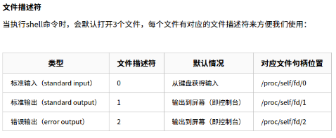

       重定向绑定如上图所示，有了这个基础，接下来看

       - `> /dev/null`：将标准输出1重定向到`/dev/null`中。 `/dev/null`代表linux的空设备文件，所有往这个文件里面写入的内容都会丢失，俗称**黑洞**。那么执行了`>/dev/null`之后，标准输出就会不再存在，没有任何地方能够找到输出的内容
       - ` 2>&1`：采用&可以将两个输出绑定在一起。这条命令的作用是错误输出将和标准输出同用一个文件描述符，说人话就是错误输出将会和标准输出输出到同一个地方

       linux在执行shell命令之前，就会确定好所有的输入输出位置，并且从左到右依次执行重定向的命令，所以`>/dev/null 2>&1`的作用就是让标准输出重定向到`/dev/null`中(丢弃标准输出)，然后错误输出由于重用了标准输出的描述符，所以错误输出也被定向到了`/dev/null`中，错误输出同样也被丢弃了。执行了这条命令之后，**该条shell命令将不会输出任何信息到控制台，也不会有任何信息输出到文件中**。

       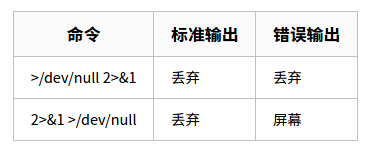

     注意：这里的原始代码为`if ! dumpimage -l $1 > /dev/null 2>&1; then` ，按照理解，这里把标准输出和错误输出到丢了，`if`语句还判断个锤子，`dumpimage -l $1 > /dev/null 2>&1`的执行结果肯定是空

     然后导致该函数始终返回0，不觉所以然。验证如下：

     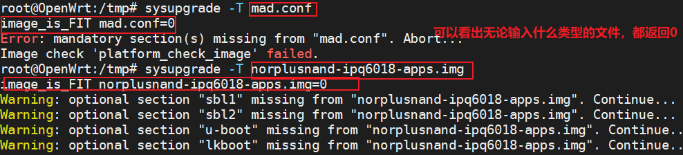

     我觉得应该是`if ! dumpimage -l $1 2>&1 >/dev/null ; then`，错误输出重定向到标准输出上(此时的标准输出为默认输出)，然后标准输出进黑洞，即只有错误输出。

   - `image_contains`

     ```bash
     #查找Image开头的行中有没有以$2的字眼，如果有直接返回0，否则返回1
     image_contains() {
     	local img=$1  #镜像文件名字
     	local sec=$2  #要查的字符串
     	dumpimage -l ${img} | grep -q "^ Image.*(${sec}.*)" || return 1
     }
     ```

     说明：

     - `dumpimage -l norplusnand-ipq6018-apps.img`执行结果如下：

       ```
       root@OpenWrt:/tmp# dumpimage -l norplusnand-ipq6018-apps.img
       FIT description: Flashing nor 100 10000
       Created:         Thu Jun 29 07:52:03 2023
        Image 0 (script)
         Description:  flash.scr
         Created:      Thu Jun 29 07:52:03 2023
         Type:         Script
         Compression:  uncompressed
         Data Size:    1734 Bytes = 1.69 kB = 0.00 MB
         Hash algo:    crc32
         Hash value:   778a552f
        Image 1 (ubi-11b222af1220a55fa0028279c31f3cf5f430e279)
         Description:  openwrt-ipq-ipq60xx-ubi-root.img
         Created:      Thu Jun 29 07:52:03 2023
         Type:         Firmware
         Compression:  uncompressed
         Data Size:    31195136 Bytes = 30464.00 kB = 29.75 MB
         Architecture: ARM
         Load Address: unavailable
         Hash algo:    crc32
         Hash value:   dcb85f79
       ```

       假如 执行`image_contains  norplusnand-ipq6018-apps.img ubi`命令，实际执行`dumpimage -l norplusnand-ipq6018-apps.img | grep -q "^ Image.*(ubi.*)" || return 1`

       整体意思就是查以Image开头的行中有没有以ubi开头的字眼，如果有直接返回0，否则返回1。

       说明

       - `-q`：如果查到就直接返回0 查不到就返回1  ，用于`if`判断如下：

         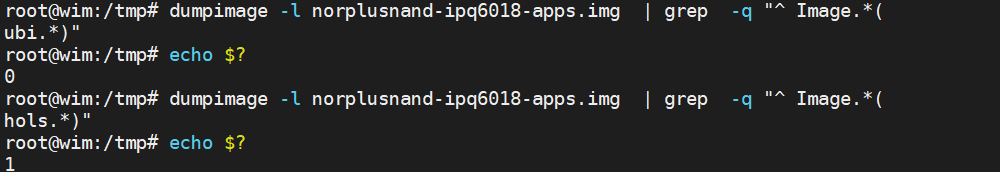

       - `^ Image` :查找以Image开头的

       - `.*` 匹配任意飞控字符串：所以`^ Image.*(ubi.*)`  意思为 以 `Image`开头，中间有`(ubi`，以`)`结尾的

     

   - `image_has_mandatory_section`

     ```bash
     #查找镜像$1中头信息中的Image所在行是否有$2字眼 如果有 返回0 否则返回1
     image_has_mandatory_section() {
     	local img=$1 #镜像文件名字
     	local mandatory_sections=$2  #这些关键字"hlos fs"
     	for sec in ${mandatory_sections}; do
     		image_contains $img ${sec} || {\  #遍历里面的每个关键字 调用image_contains
     			return 1
     		}
     	done
     }
     ```

   - `image_demux`

     ```bash
     image_demux() {
     	local img=$1
         #遍历镜像中Image的名字，例如  
         # script 
         # ubi-11b222af1220a55fa0028279c31f3cf5f430e279
     	for sec in $(print_sections ${img}); do
     	    #得到 Image的 名字
     		local fullname=$(get_full_section_name ${img} ${sec})
             #得到該名字所在的分区号
     		local position=$(dumpimage -l ${img} | grep "(${fullname})" | awk '{print $2}')
     		#根据分区号和名字解压该分区的固件出来命名为/tmp/${fullname}.bin
     		#执行到这里适合，就会在/tmp目录下解压出来固件
     		dumpimage -i ${img} -o /tmp/${fullname}.bin -T "flat_dt" -p "${position}" ${fullname} > /dev/null || { \
     			echo "Error while extracting \"${sec}\" from ${img}"
     			return 1
     		}
     	done
     	return 0
     }
     ```

     - print_sections函数

       ```bash
       #显示镜像$1头部信息中所有Image的名字
       #例如 script
       #    ubi-11b222af1220a55fa0028279c31f3cf5f430e279
       #    等
       print_sections() {
       	local img=$1
       
       	dumpimage -l ${img} | awk '/^ Image.*(.*)/ { print gensub(/Image .* \((.*)\)/,"\\1", $0) }'
       }
       ```

       例如下面：

       ```bash
       dumpimage -l norplusnand-ipq6018-apps.img | awk '/^ Image.*(.*)/ { print gensub(/Image .* \((.*)\)/,"\\1", $0) }'
        script
        ubi-11b222af1220a55fa0028279c31f3cf5f430e279
       ```

     - get_full_section_name函數

       ```bash
       #例如 get_full_section_name  norplusnand-ipq6018-apps.img script 得到的结果还是script
       #或者get_full_section_name  norplusnand-ipq6018-apps.img ubi-11b222af1220a55fa0028279c31f3cf5f430e279得到的结果还是ubi-11b222af1220a55fa0028279c31f3cf5f430e279 
       
       #该函数就是返回Image 名字
       get_full_section_name() {
       	local img=$1
       	local sec=$2
       
       	dumpimage -l ${img} | grep "^ Image.*(${sec})" | \
       		sed 's,^ Image.*(\(.*\)),\1,'
       }
       
       ```

       ```bash
       root@OpenWrt:/tmp# dumpimage -l norplusnand-ipq6018-apps.img
       FIT description: Flashing nor 100 10000
       Created:         Thu Jun 29 07:52:03 2023
        Image 0 (script)  #返回 script
         Description:  flash.scr
         Created:      Thu Jun 29 07:52:03 2023
         Type:         Script
         Compression:  uncompressed
         Data Size:    1734 Bytes = 1.69 kB = 0.00 MB
         Hash algo:    crc32
         Hash value:   778a552f
        Image 1 (ubi-11b222af1220a55fa0028279c31f3cf5f430e279)#返回 ubi-11b222af1220a55fa0028279c31f3cf5f430e279
         Description:  openwrt-ipq-ipq60xx-ubi-root.img
         Created:      Thu Jun 29 07:52:03 2023
         Type:         Firmware
         Compression:  uncompressed
         Data Size:    31195136 Bytes = 30464.00 kB = 29.75 MB
         Architecture: ARM
         Load Address: unavailable
         Hash algo:    crc32
         Hash value:   dcb85f79
       ```

       `dumpimage -l norplusnand-ipq6018-apps.img  | grep "(ubi-11b222af1`
       `220a55fa0028279c31f3cf5f430e279)" | awk '{print $2}'` 命令获取下面的分区号

       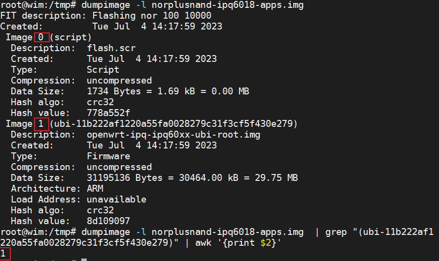

     - `dumpimage -i ${img} -o /tmp/${fullname}.bin -T "flat_dt" -p "${position}" ${fullname} > /dev/null`

       dumpimage 的用法之一，用来解压被压缩的文件，格式如下

       ```bash
       dumpimage -i image -T type [-p position] [-o outfile] data_file
       ```

       - -i 选项：要解压的镜像
       - -o 选项：解压某个分区后输出的镜像名
       - -T 选项：镜像类型
       - -p 选项：position为data_file镜像所在镜像中的分区号

     - `dumpimage -c`

       ```bash
       #do board upgrade check 
       #在高通qsdk中 该命令无效，无论image是否合法，返回总是0 ，估计是高通bug
       dumpimage -c image
       ```

       

2. `get_image`：函数在`package/base-files/files/lib/upgrade/common.sh`

   ```bash
   # get_image http://nor.bin "cat"
   # get_image http://nor.bin  "cat"
   # get_image ftp://nor.bin "cat"
   # 上面cat可以省略
   get_image() { # <source> [ <command> ]
   	local from="$1" #镜像源地址
   	local conc="$2" #根据镜像压缩格式不同，使用不同的cat 例如 zcat bzcat等
   	local cmd
   
   	case "$from" in
   		http://*|ftp://*) cmd="wget -O- -q";;
   		*) cmd="cat";;
   	esac
   	#如果$conc 为空，则根据镜像类型判断使用什么cat
   	if [ -z "$conc" ]; then
   		local magic="$(eval $cmd \"$from\" 2>/dev/null | dd bs=2 count=1 2>/dev/null | hexdump -n 2 -e '1/1 "%02x"')"
   		case "$magic" in
   			1f8b) conc="zcat";;
   			425a) conc="bzcat";;
   		esac
   	fi
       # 使用wget -O- -q \"$from\" 下载镜像到本地
   	eval "$cmd \"$from\" 2>/dev/null ${conc:+| $conc}"
   }
   ```

   

3. `platform_pre_upgrade`：函数在`target/linux/ipq/base-files/lib/upgrade/platform.sh`

   ```bash
   #暂且忽略
   platform_pre_upgrade() {
   	cp /sbin/upgraded /tmp
   	ubus call system nandupgrade "{\"path\": \"$1\" }"
   }
   ```

   

4. `do_upgrade`：函数在`package/base-files/files/lib/upgrade/common.sh`

   ```bash
   do_upgrade() {
   	v "Performing system upgrade..."
   	if type 'platform_do_upgrade' >/dev/null 2>/dev/null; then
   		#platform_do_upgrade定义了所以到这里，该函数是把刚解压的镜像 分别烧录到每个分区
   		#下面重点分析
   		platform_do_upgrade "$ARGV"
   	else
   		default_do_upgrade "$ARGV"
   	fi
   
   	#没有使用-n选项，下面会调用platform_copy_config函数把配置文件压缩包存放到对用的分区
   	if [ "$SAVE_CONFIG" -eq 1 ] && type 'platform_copy_config' >/dev/null 2>/dev/null; then
   		platform_copy_config
   	fi
   
   	#能到这里说明升级已经完成下面是重启
   	v "Upgrade completed"
   	[ -n "$DELAY" ] && sleep "$DELAY"
   	ask_bool 1 "Reboot" && {
   		v "Rebooting system..."
   		sleep 2
   		reboot -f
   		sleep 5
   		echo b 2>/dev/null >/proc/sysrq-trigger
   	}
   }
   
   ```

   - `platform_do_upgrade "$ARGV"`

     ```bash
     
     platform_do_upgrade() {
     	local board=$(ipq806x_board_name)
     
     	# verify some things exist before erasing
     	#此时的$1 为整个镜像名字，如果不存在则直接重启
     	if [ ! -e $1 ]; then
     		echo "Error: Can't find $1 after switching to ramfs, aborting upgrade!"
     		reboot
     	fi
     	#遍历整个镜像中的image，如果不存在解压后的该sections.bin 也是直接重启
     	for sec in $(print_sections $1); do
     		if [ ! -e /tmp/${sec}.bin ]; then
     			echo "Error: Cant' find ${sec} after switching to ramfs, aborting upgrade!"
     			reboot
     		fi
     	done
     	
     	#判断板子类型
     	case "$board" in
     	db149 | ap148 | ap145 | ap148_1xx | db149_1xx | db149_2xx | ap145_1xx | ap160 | ap160_2xx | ap161 | ak01_1xx | ap-dk01.1-c1 | ap-dk01.1-c2 | ap-dk04.1-c1 | ap-dk04.1-c2 | ap-dk04.1-c3 | ap-dk04.1-c4 | ap-dk04.1-c5 | ap-dk04.1-c6 | ap-dk05.1-c1 |  ap-dk06.1-c1 | ap-dk07.1-c1 | ap-dk07.1-c2 | ap-dk07.1-c3 | ap-dk07.1-c4 | ap-hk01-c1 | ap-hk01-c2 | ap-hk01-c3 | ap-hk01-c4 | ap-hk01-c5 | ap-hk01-c6 | ap-hk02 | ap-hk06 | ap-hk07 | ap-hk08 | ap-hk09 | ap-hk10-c1 | ap-hk10-c2 | ap-hk11-c1 | ap-hk12 | ap-hk14 | ap-ac01 | ap-ac02 | ap-ac03 | ap-ac04 | ap-oak02 | ap-oak03 | db-hk01 | db-hk02 | ap-cp01-c1 | ap-cp01-c2 | ap-cp01-c3 | ap-cp01-c4 | ap-cp02-c1 | ap-cp03-c1 | db-cp01 | db-cp02 | mp-emu | ap-mp02.1 | ap-mp03.1 | ap-mp03.1-c2 | ap-mp03.1-c3 | ap-mp03.3 | ap-mp03.3-c2 | ap-mp03.3-c3 | ap-mp03.4-c1 | ap-mp03.4-c2 | ap-mp03.5-c1 | ap-mp03.5-c2 | ap-mp03.6-c1 | ap-mp03.6-c2 | db-mp02.1 | db-mp03.1 | db-mp03.1-c2 | db-mp03.3 | db-mp03.3-c2 | tb-mp04)
     		# uncomment below function call to have support for sysupgrade from Linux v4.4 to v5.4 with removal of rootfs_data partition
     		# do_flash_gpt
     		
     		#烧录每个镜像，此时的$sec 为
     		# script
     		# ubi-11b222af1220a55fa0028279c31f3cf5f430e279
     		for sec in $(print_sections $1); do
     			# 具体的烧录工作，下面会具体分析
     			flash_section ${sec}
     		done
     
     		switch_layout linux
     		# update bootconfig to register that fw upgrade has been done
     		do_flash_bootconfig bootconfig "0:BOOTCONFIG"
     		do_flash_bootconfig bootconfig1 "0:BOOTCONFIG1"
     		platform_version_upgrade
     
     		erase_emmc_config
     		return 0;
     		;;
     	esac
     
     	echo "Upgrade failed!"
     	return 1;
     }
     
     ```

     - `flash_section ${sec}`

       这里以`flash_section ubi-11b222af1220a55fa0028279c31f3cf5f430e279`为例说明

       ```bash
       flash_section() {
       	local sec=$1
       	#这里的board为ap-cp01-c2
       	local board=$(ipq806x_board_name)
       	local version=$(hexdump -n 1 -e '"%1d"' /sys/firmware/devicetree/base/soc_version_major)
       
       	if [ $version == "" ]; then
       		version=1
       	fi
            
       	# Look for pci mhi devices
       	# 该命令执行结果为
       	# cat /sys/bus/pci/devices/*/device
           # 0x1003
           # 0x1104
       
       	for device in $(cat /sys/bus/pci/devices/*/device 2> /dev/null)
       	do
       		# 说明有qcn9000的pcie卡
       		[ "${device}" = "0x1104" ] && qcn9000="true"
       	done
       	
       	#下面根据${sec}内容 找到需要升级的项，假如
       	#${sec}=ubi-11b222af1220a55fa0028279c31f3cf5f430e279
       	#那么看下面的这句话
       	#ubi*) switch_layout linux; image_is_nand || return && do_flash_ubi ${sec} "rootfs";;
       	#下面重点分析do_flash_ubi ${sec} "rootfs" 函数
       	case "${sec}" in
       		hlos*) switch_layout linux; image_is_nand && return || do_flash_failsafe_partition ${sec} "0:HLOS";;
       		rootfs*) switch_layout linux; image_is_nand && return || do_flash_failsafe_partition ${sec} "rootfs";;
       		wifi_fw_$(get_fw_name)-*) switch_layout linux; do_flash_failsafe_partition ${sec} "0:WIFIFW"; do_flash_failsafe_ubi_volume ${sec} "rootfs" "wifi_fw" ;;
       		wififw-*) switch_layout linux; do_flash_failsafe_partition ${sec} "0:WIFIFW";;
       		wififw_ubi-*) switch_layout linux; do_flash_ubi ${sec} "0:WIFIFW";;
       		wififw_v${version}-*) switch_layout linux; do_flash_failsafe_partition ${sec} "0:WIFIFW";;
       		wififw_ubi_v${version}-*)
       			if ! [ "${qcn9000}" = "true" ]; then
       				switch_layout linux; do_flash_ubi ${sec} "0:WIFIFW";
       			else
       				echo "Section ${sec} ignored"; return 1;
       			fi
       			;;
       		wififw_ubi_*_v${version}-*)
       			if [ "${qcn9000}" = "true" ]; then
       				switch_layout linux; do_flash_ubi ${sec} "0:WIFIFW";
       			else
       				echo "Section ${sec} ignored"; return 1;
       			fi
       			;;
       		btfw-*) switch_layout linux; do_flash_failsafe_partition ${sec} "0:BTFW";;
       		fs*) switch_layout linux; do_flash_failsafe_partition ${sec} "rootfs";;
       		
       		
       		# 下面会重点分析这里
       		ubi*) switch_layout linux; image_is_nand || return && do_flash_ubi ${sec} "rootfs";;
       		sbl1*) switch_layout boot; do_flash_partition ${sec} "0:SBL1";;
       		sbl2*) switch_layout boot; do_flash_failsafe_partition ${sec} "0:SBL2";;
       		sbl3*) switch_layout boot; do_flash_failsafe_partition ${sec} "0:SBL3";;
       		dtb-$(to_upper $board)*) switch_layout boot; do_flash_partition ${sec} "0:DTB";;
       		u-boot*) switch_layout boot; do_flash_failsafe_partition ${sec} "0:APPSBL";;
       		lkboot*) switch_layout boot; do_flash_failsafe_partition ${sec} "0:APPSBL";;
       		ddr-$(to_upper $board)_*) switch_layout boot; do_flash_ddr ${sec};;
       		ddr-${board}-*) switch_layout boot; do_flash_failsafe_partition ${sec} "0:DDRCONFIG";;
       		ssd*) switch_layout boot; do_flash_partition ${sec} "0:SSD";;
       		tz*) switch_layout boot; do_flash_tz ${sec};;
       		apdp*) switch_layout boot; do_flash_failsafe_partition ${sec} "0:APDP";;
       		devcfg*) switch_layout boot; do_flash_failsafe_partition ${sec} "0:DEVCFG";;
       		rpm*) switch_layout boot; do_flash_failsafe_partition ${sec} "0:RPM";;
       		*) echo "Section ${sec} ignored"; return 1;;
       	esac
       
       	echo "Flashed ${sec}"
       }
       ```

     - `switch_layout linux`

       暂时忽略掉该函数，不影响后面分析

       ```bash
       switch_layout() {
       	local layout=$1
       	local boot_layout=`find / -name boot_layout`
       
       	# Layout switching is only required as the  boot images (up to u-boot)
       	# use 512 user data bytes per code word, whereas Linux uses 516 bytes.
       	# It's only applicable for NAND flash. So let's return if we don't have
       	# one.
       
       	[ -n "$boot_layout" ] || return
       
       	case "${layout}" in
       		boot|1) echo 1 > $boot_layout;;
       		linux|0) echo 0 > $boot_layout;;
       		*) echo "Unknown layout \"${layout}\"";;
       	esac
       }
       ```

       

     - `do_flash_ubi ${sec} "rootfs"` 

       假如 `${sec}=ubi-11b222af1220a55fa0028279c31f3cf5f430e279`以`do_flash_ubi ${sec} "rootfs"`为例分析：

       ```bash
       do_flash_ubi() {
       	local bin=$1     # ubi-11b222af1220a55fa0028279c31f3cf5f430e279
       	local mtdname=$2 # "rootfs"
       	local mtdpart
       	local primaryboot
       	
       	#得到rootfs所在分区的mtd号，这里是mtdpart=mtd16
       	mtdpart=$(grep "\"${mtdname}\"" /proc/mtd | awk -F: '{print $1}')
       	
       	#强制将mtd16 从ubi设备上去掉
       	ubidetach -f -p /dev/${mtdpart}
       
       	# Fail safe upgrade
       	#下面这段忽略，我们不存在这个文件
       	[ -f /proc/boot_info/$mtdname/upgradepartition ] && {
       		primaryboot=$(cat /proc/boot_info/$mtdname/primaryboot)
       		if [ $primaryboot -eq 0 ]; then
       			echo 1 > /proc/boot_info/$mtdname/primaryboot
       		else
       			echo 0 > /proc/boot_info/$mtdname/primaryboot
       		fi
       
       		mtdname=$(cat /proc/boot_info/$mtdname/upgradepartition)
       	}
           
           # mtdpart=mtd16
       	mtdpart=$(grep "\"${mtdname}\"" /proc/mtd | awk -F: '{print $1}')
           
           #把/tmp/${bin}.bin文件加载到/dev/${mtdpart} 块设备中，
           #至此完成烧录rootfs的烧录
       	ubiformat /dev/${mtdpart} -y -f /tmp/${bin}.bin
       }
       ```

       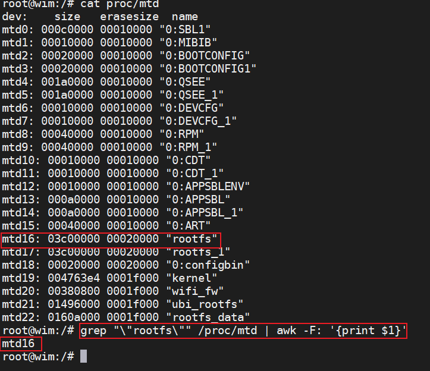

     - `do_flash_bootconfig bootconfig "0:BOOTCONFIG"`

       ```bash
       do_flash_bootconfig() {
       	local bin=$1       #$1 = bootconfig 
       	local mtdname=$2   #$2 = "0:BOOTCONFIG"
       
       	# Fail safe upgrade
       	if [ -f /proc/boot_info/getbinary_${bin} ]; then
       		cat /proc/boot_info/getbinary_${bin} > /tmp/${bin}.bin
       		do_flash_partition $bin $mtdname
       	fi
       }
       ```

       

     - `platform_version_upgrade`

       ```bash
       #更新版本，就是如果
       #/tmp/appsbl_version sbl_version tz_version hlos_version rpm_version 存在，
       #那么就把这些文件里面的内容输到
       #/sys/devices/system/qfprom/qfprom0/appsbl_version sbl_version tz_version hlos_version rpm_version 对应文件中
       
       platform_version_upgrade() {
       	local version_files="appsbl_version sbl_version tz_version hlos_version rpm_version"
       	local sys="/sys/devices/system/qfprom/qfprom0/"
       	local tmp="/tmp/"
       
       	for file in $version_files; do
       		[ -f "${tmp}${file}" ] && {
       			echo "Updating "${sys}${file}" with `cat "${tmp}${file}"`"
       			echo `cat "${tmp}${file}"` > "${sys}${file}"
       			rm -f "${tmp}${file}"
       		}
       	done
       }
       ```

       

   - `platform_copy_config`

     ```bash
     platform_copy_config() {
     	local nand_part="$(find_mtd_part "ubi_rootfs")"  #/dev/mtdblock21
     	local emmcblock="$(find_mmc_part "rootfs_data")"
     	[ -e "$emmcblock" ] || emmcblock="$(find_mmc_part "rootfs")"
     	mkdir -p /tmp/overlay
         echo "[xym debug] copy config1"
         #这里是nand分区 所以走下面的分支
     	if [ -e "${nand_part%% *}" ]; then
     		local mtdname=rootfs
     		local mtdpart
             echo "[xym debug] copy config2"
     		[ -f /proc/boot_info/$mtdname/upgradepartition ] && {
     			mtdname=$(cat /proc/boot_info/$mtdname/upgradepartition)
     		}
     		#mtdpart=mtd21
     		mtdpart=$(grep "\"${mtdname}\"" /proc/mtd | awk -F: '{print $1}')
     		#将ubi和mtd21关联
     		ubiattach -p /dev/${mtdpart}
     		#mount ubi0:rootfs_data 到/tmp/overlay目录下
     		mount -t ubifs ubi0:rootfs_data /tmp/overlay
     		#copy /tmp/sysupgrade.tgz /tmp/overlay/目录下，
     		#这样板子上的ubi0:rootfs_data 里面就有了sysupgrade.tgz文件
     		cp /tmp/sysupgrade.tgz /tmp/overlay/
     		sync
     		#卸载
     		umount /tmp/overlay
     	elif [ -e "$emmcblock" ]; then
     		#这里不分析
     	fi
     }
     ```

     - `find_mtd_part "ubi_rootfs"`

       ```bash
       #find_mtd_index "ubi_rootfs"  输出的是21
       find_mtd_index() {
       	#假如$1 = "ubi_rootfs"
       	#那么PART=mtd21
       	local PART="$(grep "\"$1\"" /proc/mtd | awk -F: '{print $1}')"
       	#INDEX=21
       	local INDEX="${PART##mtd}"
       	#输出mtd的编号，即21
       	echo ${INDEX}
       }
       #find_mtd_part "ubi_rootfs"  输出的是 /dev/mtdblock21
       find_mtd_part() {
       	local INDEX=$(find_mtd_index "$1")
       	local PREFIX=/dev/mtdblock
       
       	[ -d /dev/mtdblock ] && PREFIX=/dev/mtdblock/
       	echo "${INDEX:+$PREFIX$INDEX}"
       	#这里输出的就是 /dev/mtdblock21  即
       	#该函数就是根据/proc/mtd的内容，找到ubi_rootfs所在分区mtd21，根据21找到
       	#/dev/mtdblock21    mtdblock块
       }
       ```

5. `run_hooks`：函数在`package/base-files/files/lib/upgrade/common.sh`

   ```bash
   #参数$1: 函数参数
   #   $2： 函数名字
   #功能：   调用函数 $2 $1
   run_hooks() {
   	local arg="$1"; shift
   	for func in "$@"; do
   		eval "$func $arg"
   	done
   }
   ```

6. `kill_remaining`：`package/base-files/files/lib/upgrade/common.sh`

   ```bash
   #实现对进程的term和kill操作
   kill_remaining() { # [ <signal> ]
   	local sig="${1:-TERM}"
   	echo -n "Sending $sig to remaining processes ... "
    
   	local stat
   	for stat in /proc/[0-9]*/stat; do
   		[ -f "$stat" ] || continue
    
   		local pid name state ppid rest
   		read pid name state ppid rest < $stat
   		name="${name#(}"; name="${name%)}"
    
   		local cmdline
   		read cmdline < /proc/$pid/cmdline
    
   		# Skip kernel threads 
   		[ -n "$cmdline" ] || continue
    
   		case "$name" in
   			# Skip essential services
   			*ash*|*init*|*watchdog*|*ssh*|*dropbear*|*telnet*|*login*|*hostapd*|*wpa_supplicant*) : ;;
    
   			# Killable process
   			*)
   				if [ $pid -ne $$ ] && [ $ppid -ne $$ ]; then
   					echo -n "$name "
   					kill -$sig $pid 2>/dev/null
   				fi
   			;;
   		esac
   	done
   	echo ""
   }
   ```

   

7. `run_ramfs`：`package/base-files/files/lib/upgrade/common.sh`

   ```bash
   #在升级操作之前有一个run_ramfs()，将一个最小能运行的系统mount到内存中去。为后的操作提供运行环境。
   run_ramfs() { # <command> [...]
   	install_bin /bin/busybox /bin/ash /bin/sh /bin/mount /bin/umount        \
   		/sbin/pivot_root /usr/bin/wget /sbin/reboot /bin/sync /bin/dd   \
   		/bin/grep /bin/cp /bin/mv /bin/tar /usr/bin/md5sum "/usr/bin/[" \
   		/bin/vi /bin/ls /bin/cat /usr/bin/awk /usr/bin/hexdump          \
   		/bin/sleep /bin/zcat /usr/bin/bzcat /usr/bin/printf /usr/bin/wc
    
   	install_bin /sbin/mtd
   	for file in $RAMFS_COPY_BIN; do
   		install_bin $file
   	done
   	install_file /etc/resolv.conf /lib/functions.sh /lib/functions.sh /lib/upgrade/*.sh $RAMFS_COPY_DATA
    
   	pivot $RAM_ROOT /mnt || {
   		echo "Failed to switch over to ramfs. Please reboot."
   		exit 1
   	}
    
   	mount -o remount,ro /mnt
   	umount -l /mnt
    
   	grep /overlay /proc/mounts > /dev/null && {
   		mount -o remount,ro /overlay
   		umount -l /overlay
   	}
    
   	# spawn a new shell from ramdisk to reduce the probability of cache issues
   	exec /bin/busybox ash -c "$*"
   }
   ```


## 总结

上面介绍了使用命令升级的过程，也介绍了以文件系统`ubi-11b222af1220a55fa0028279c31f3cf5f430e279`分区怎么写入到存储中的，下面会逐步分析其他分区如何写入的，以及网页升级原理。

### 网页配置项对应的命令意思

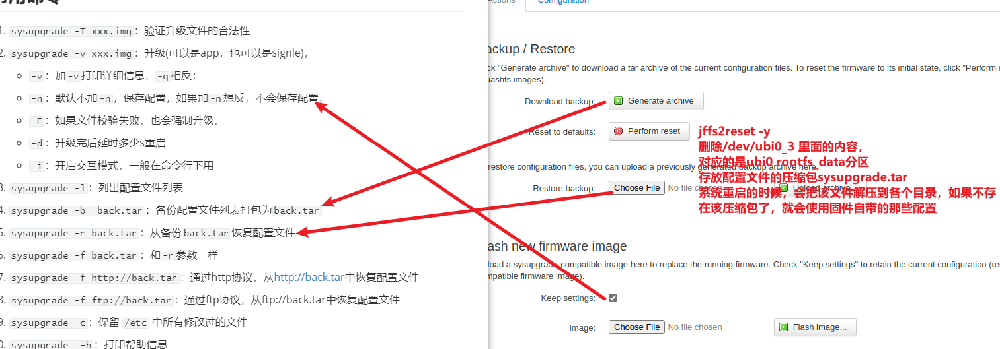

- Generate archive 按钮：会保存配置文件到pc端，命名为`backup-主机名-时间.tar.gz`

  实际执行的是`sysupgrade --create-backup`  命令，对应的代码在`package/feeds/luci/luci-mod-admin-full/luasrc/controller/admin/system.lua`中如下：

  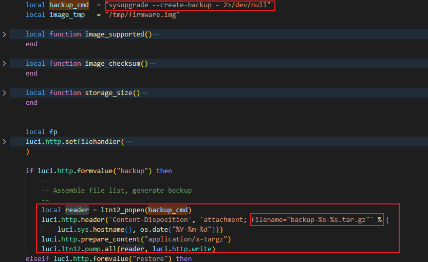

- Perform reset按钮：实际是执行的`jffs2reset -y && reboot`命令，该命令会把`/dev/ubi0_3` 挂载到`/tmp/overlay`目录下，然后删除里面的`sysupgrade.tgz`文件，其实`/dev/ubi0_3`里面就是对应的mtd22分区的ubi0:3的`rootfs_data`，里面存放的是配置文件的压缩包，系统在启动的时候执行`package/base-files/files/lib/preinit/80_mount_root`脚本，判断是否有该文件，如果有，就解压到各个目录，否则就用固件默认配置(编译时候决定)。

  ```bash
  do_mount_root() {
  	echo "Before mount_root"
  	mount_root
  	boot_run_hook preinit_mount_root
  	#看是否存在配置，如果有，就解压到各个目录
  	[ -f /sysupgrade.tgz ] && {
  		echo "- [xym debug] config restore -"
  		cd /
  		tar xzf /sysupgrade.tgz
  	}
  	echo "[xym debug] After mount_root"
  }
  
  [ "$INITRAMFS" = "1" ] || boot_hook_add preinit_main do_mount_root
  ```

  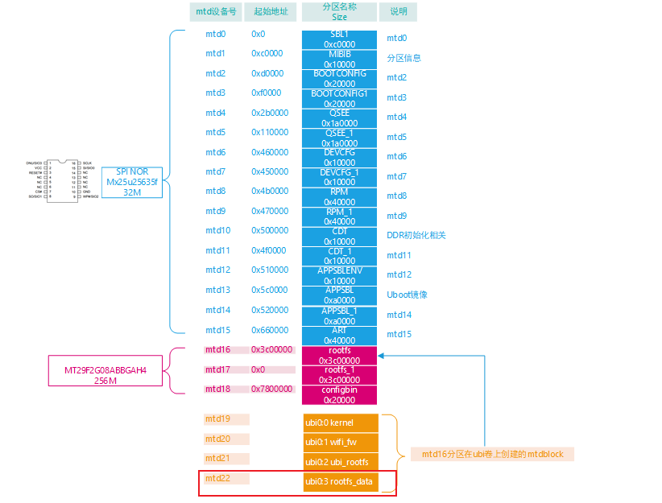

- Restore backup按钮：直接解压压缩包文件到根目录

  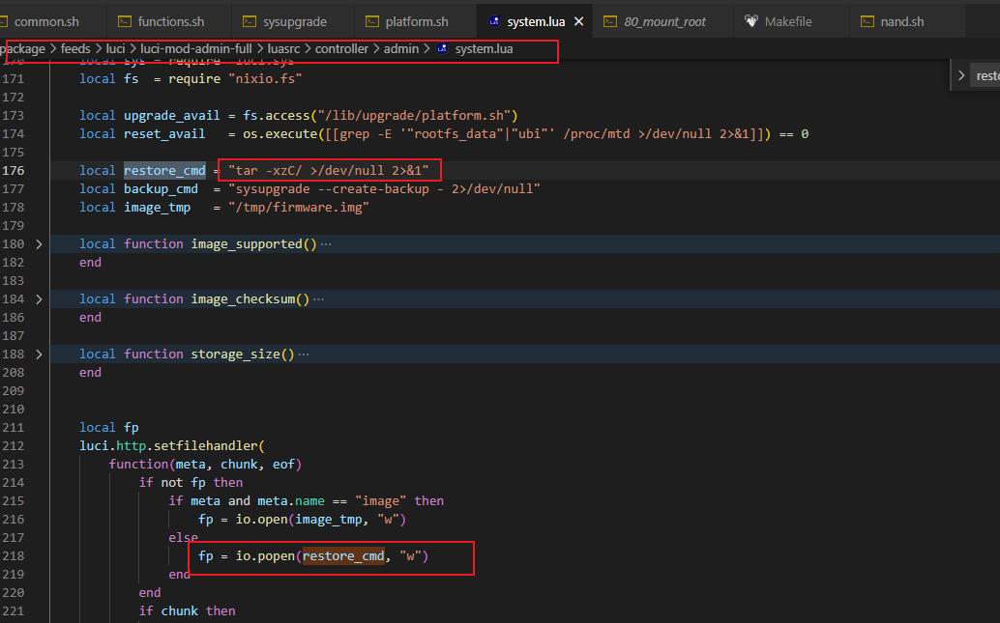

- keep Settings：保持配置，相当于sysupgrade -v xx.img 时候不加-n选项

  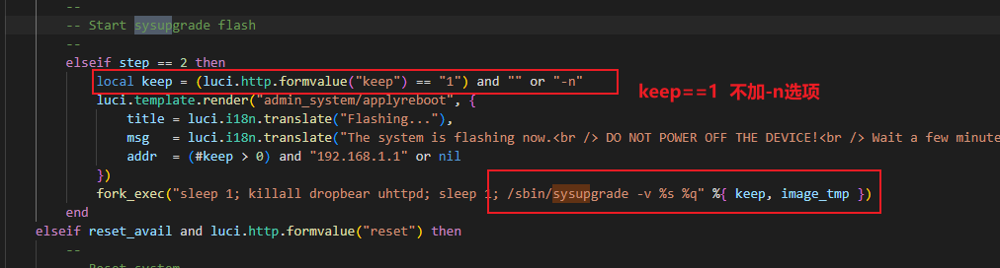


### 各个分区烧录方式

分区内容如下：

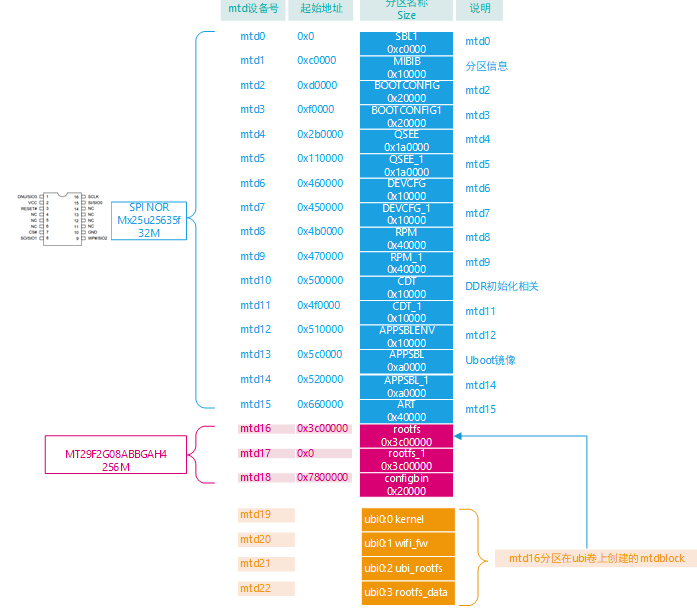


`norplusnand-ipq6018-single.img`和`norplusnand-ipq6018-apps.img`区别

使用`dumpimage -l 镜像名字`命令可以查看img镜像各个分区内容：

- `norplusnand-ipq6018-single.img`分区内如如下：

  ```bash
  
  root@wim:/tmp# dumpimage -l norplusnand-ipq6018-single.img
  FIT description: Flashing nor 100 10000
  Created:         Tue Jul  4 14:17:58 2023
   Image 0 (script)
    Description:  flash.scr
    Created:      Tue Jul  4 14:17:58 2023
    Type:         Script
    Compression:  uncompressed
    Data Size:    17658 Bytes = 17.24 kB = 0.02 MB
    Hash algo:    crc32
    Hash value:   4264ab73
   Image 1 (sbl1-2249111d25f08aa2014faed6fc66e35e084f6654)
    Description:  xbl.elf
    Created:      Tue Jul  4 14:17:58 2023
    Type:         Firmware
    Compression:  uncompressed
    Data Size:    540672 Bytes = 528.00 kB = 0.52 MB
    Architecture: ARM
    Load Address: unavailable
    Hash algo:    crc32
    Hash value:   44b9cffb
   Image 2 (mibib-1b8580e2213813c4cc9c572b137ae51c7298a8b8)
    Description:  norplusnand-system-partition-ipq6018.bin
    Created:      Tue Jul  4 14:17:58 2023
    Type:         Firmware
    Compression:  uncompressed
    Data Size:    65536 Bytes = 64.00 kB = 0.06 MB
    Architecture: ARM
    Load Address: unavailable
    Hash algo:    crc32
    Hash value:   4c70a2ed
   Image 3 (bootconfig-f1050e638265203cd2a74f220c37aeaa88edfc7e)
    Description:  bootconfig.bin
    Created:      Tue Jul  4 14:17:58 2023
    Type:         Firmware
    Compression:  uncompressed
    Data Size:    131072 Bytes = 128.00 kB = 0.12 MB
    Architecture: ARM
    Load Address: unavailable
    Hash algo:    crc32
    Hash value:   938e98a3
   Image 4 (bootconfig1-f1050e638265203cd2a74f220c37aeaa88edfc7e)
    Description:  bootconfig.bin
    Created:      Tue Jul  4 14:17:58 2023
    Type:         Firmware
    Compression:  uncompressed
    Data Size:    131072 Bytes = 128.00 kB = 0.12 MB
    Architecture: ARM
    Load Address: unavailable
    Hash algo:    crc32
    Hash value:   938e98a3
   Image 5 (tz-5371ff12800ec75037875b90289bbafe482dee9f)
    Description:  tz.mbn
    Created:      Tue Jul  4 14:17:58 2023
    Type:         Firmware
    Compression:  uncompressed
    Data Size:    1469120 Bytes = 1434.69 kB = 1.40 MB
    Architecture: ARM
    Load Address: unavailable
    Hash algo:    crc32
    Hash value:   54c3eda5
   Image 6 (devcfg-8666c73196e28125dc783776af0206b2c4b86a6b)
    Description:  devcfg.mbn
    Created:      Tue Jul  4 14:17:58 2023
    Type:         Firmware
    Compression:  uncompressed
    Data Size:    45442 Bytes = 44.38 kB = 0.04 MB
    Architecture: ARM
    Load Address: unavailable
    Hash algo:    crc32
    Hash value:   dba8b06d
   Image 7 (rpm-f7ae6c6e3b03b2c11b4d154cf0db219dafdb96e3)
    Description:  rpm.mbn
    Created:      Tue Jul  4 14:17:58 2023
    Type:         Firmware
    Compression:  uncompressed
    Data Size:    108016 Bytes = 105.48 kB = 0.10 MB
    Architecture: ARM
    Load Address: unavailable
    Hash algo:    crc32
    Hash value:   82e933e0
   Image 8 (ddr-AP-CP01-C1_256M32_DDR3-dd3f3176bae709f007b3434b24d5fe6b656a0910)
    Description:  cdt-AP-CP01-C1_256M32_DDR3.bin
    Created:      Tue Jul  4 14:17:58 2023
    Type:         Firmware
    Compression:  uncompressed
    Data Size:    548 Bytes = 0.54 kB = 0.00 MB
    Architecture: ARM
    Load Address: unavailable
    Hash algo:    crc32
    Hash value:   980a1526
   Image 9 (ddr-AP-CP01-C2_256M32_DDR3-6c2b6a39daaf4e35f2a4f6e99f2653c61727ea8c)
    Description:  cdt-AP-CP01-C2_256M32_DDR3.bin
    Created:      Tue Jul  4 14:17:58 2023
    Type:         Firmware
    Compression:  uncompressed
    Data Size:    548 Bytes = 0.54 kB = 0.00 MB
    Architecture: ARM
    Load Address: unavailable
    Hash algo:    crc32
    Hash value:   fbdb1bbe
   Image 10 (ddr-AP-CP01-C3_256M32_DDR3-b55a7872427a187378912d68f1cd21fd39acae3a)
    Description:  cdt-AP-CP01-C3_256M32_DDR3.bin
    Created:      Tue Jul  4 14:17:58 2023
    Type:         Firmware
    Compression:  uncompressed
    Data Size:    548 Bytes = 0.54 kB = 0.00 MB
    Architecture: ARM
    Load Address: unavailable
    Hash algo:    crc32
    Hash value:   5fa80816
   Image 11 (ddr-AP-CP01-C4_256M32_DDR3-a3d2d497503e9e606767bfdd48944c34aaa6dadf)
    Description:  cdt-AP-CP01-C4_256M32_DDR3.bin
    Created:      Tue Jul  4 14:17:58 2023
    Type:         Firmware
    Compression:  uncompressed
    Data Size:    548 Bytes = 0.54 kB = 0.00 MB
    Architecture: ARM
    Load Address: unavailable
    Hash algo:    crc32
    Hash value:   b6e778e4
   Image 12 (ddr-AP-CP02-C1_256M32_DDR4-6248f064233e7d9162241a385fe3dff878de701f)
    Description:  cdt-AP-CP02-C1_256M32_DDR4.bin
    Created:      Tue Jul  4 14:17:58 2023
    Type:         Firmware
    Compression:  uncompressed
    Data Size:    548 Bytes = 0.54 kB = 0.00 MB
    Architecture: ARM
    Load Address: unavailable
    Hash algo:    crc32
    Hash value:   b97c0932
   Image 13 (ddr-AP-CP03-C1_256M16_DDR3-fdf5fd14236b44732017ae2117a6e5dfde94808f)
    Description:  cdt-AP-CP03-C1_256M16_DDR3.bin
    Created:      Tue Jul  4 14:17:58 2023
    Type:         Firmware
    Compression:  uncompressed
    Data Size:    548 Bytes = 0.54 kB = 0.00 MB
    Architecture: ARM
    Load Address: unavailable
    Hash algo:    crc32
    Hash value:   18868aad
   Image 14 (ddr-DB-CP01_256M32_DDR3-eb15d1a82024a703b2016806bcac079864014fbf)
    Description:  cdt-DB-CP01_256M32_DDR3.bin
    Created:      Tue Jul  4 14:17:58 2023
    Type:         Firmware
    Compression:  uncompressed
    Data Size:    548 Bytes = 0.54 kB = 0.00 MB
    Architecture: ARM
    Load Address: unavailable
    Hash algo:    crc32
    Hash value:   96e2b520
   Image 15 (ddr-DB-CP02_1024M32_DDR4-a05021a9be1974fbc52d6ecae5011cf12484c0a1)
    Description:  cdt-DB-CP02_1024M32_DDR4.bin
    Created:      Tue Jul  4 14:17:58 2023
    Type:         Firmware
    Compression:  uncompressed
    Data Size:    548 Bytes = 0.54 kB = 0.00 MB
    Architecture: ARM
    Load Address: unavailable
    Hash algo:    crc32
    Hash value:   aef8b1ca
   Image 16 (ddr-CP-EMU_256M32_DDR3-675993015fed1bf5a6a21cc410e22263fb9cd9f2)
    Description:  cdt-CP-EMU_256M32_DDR3.bin
    Created:      Tue Jul  4 14:17:58 2023
    Type:         Firmware
    Compression:  uncompressed
    Data Size:    548 Bytes = 0.54 kB = 0.00 MB
    Architecture: ARM
    Load Address: unavailable
    Hash algo:    crc32
    Hash value:   2b7d771b
   Image 17 (u-boot-5ed2e0a3d5935e809588d1f80dcea2110fe518de)
    Description:  openwrt-ipq6018-u-boot.mbn
    Created:      Tue Jul  4 14:17:58 2023
    Type:         Firmware
    Compression:  uncompressed
    Data Size:    613162 Bytes = 598.79 kB = 0.58 MB
    Architecture: ARM
    Load Address: unavailable
    Hash algo:    crc32
    Hash value:   65ad30c5
   Image 18 (ubi-11b222af1220a55fa0028279c31f3cf5f430e279)
    Description:  openwrt-ipq-ipq60xx-ubi-root.img
    Created:      Tue Jul  4 14:17:58 2023
    Type:         Firmware
    Compression:  uncompressed
    Data Size:    31195136 Bytes = 30464.00 kB = 29.75 MB
    Architecture: ARM
    Load Address: unavailable
    Hash algo:    crc32
    Hash value:   1e4e66a3
  root@wim:/tmp#
  
  ```

  

- `norplusnand-ipq6018-apps.img`分区内如如下：

  ```bash
  root@wim:/tmp# dumpimage -l norplusnand-ipq6018-apps.img
  FIT description: Flashing nor 100 10000
  Created:         Tue Jul  4 14:17:59 2023
   Image 0 (script)
    Description:  flash.scr
    Created:      Tue Jul  4 14:17:59 2023
    Type:         Script
    Compression:  uncompressed
    Data Size:    1734 Bytes = 1.69 kB = 0.00 MB
    Hash algo:    crc32
    Hash value:   778a552f
   Image 1 (ubi-11b222af1220a55fa0028279c31f3cf5f430e279)
    Description:  openwrt-ipq-ipq60xx-ubi-root.img
    Created:      Tue Jul  4 14:17:59 2023
    Type:         Firmware
    Compression:  uncompressed
    Data Size:    31195136 Bytes = 30464.00 kB = 29.75 MB
    Architecture: ARM
    Load Address: unavailable
    Hash algo:    crc32
    Hash value:   8d109097
  
  ```

下面以`norplusnand-ipq6018-single.img`为例，结合`target/linux/ipq/base-files/lib/upgrade/platform.sh`代码分析，各个分区如何进行烧录：主要是`flash_section`函数，在分析前先看下面的打印，以便知道每个分区如何对应mtd块

```bash
root@wim:/tmp# cat /proc/mtd
dev:    size   erasesize  name
mtd0: 000c0000 00010000 "0:SBL1"
mtd1: 00010000 00010000 "0:MIBIB"
mtd2: 00020000 00010000 "0:BOOTCONFIG"
mtd3: 00020000 00010000 "0:BOOTCONFIG1"
mtd4: 001a0000 00010000 "0:QSEE"
mtd5: 001a0000 00010000 "0:QSEE_1"
mtd6: 00010000 00010000 "0:DEVCFG"
mtd7: 00010000 00010000 "0:DEVCFG_1"
mtd8: 00040000 00010000 "0:RPM"
mtd9: 00040000 00010000 "0:RPM_1"
mtd10: 00010000 00010000 "0:CDT"
mtd11: 00010000 00010000 "0:CDT_1"
mtd12: 00010000 00010000 "0:APPSBLENV"
mtd13: 000a0000 00010000 "0:APPSBL"
mtd14: 000a0000 00010000 "0:APPSBL_1"
mtd15: 00040000 00010000 "0:ART"
mtd16: 03c00000 00020000 "rootfs"
mtd17: 03c00000 00020000 "rootfs_1"
mtd18: 00020000 00020000 "0:configbin"
mtd19: 004763e4 0001f000 "kernel"
mtd20: 00380800 0001f000 "wifi_fw"
mtd21: 01496000 0001f000 "ubi_rootfs"
mtd22: 0160a000 0001f000 "rootfs_data"
```


- Image 0分区：flash.scr

  这是个脚本在用uboot烧录时候用，不用写固话到设备中，这里不做分析

- Image 1分区：sbl1-2249111d25f08aa2014faed6fc66e35e084f6654

  1. 执行代码：

     ```bash
     sbl1*) switch_layout boot; do_flash_partition ${sec} "0:SBL1";;
     ```

  2. 代码分析

     ```bash
     do_flash_mtd() {
     	local bin=$1      # sbl1-2249111d25f08aa2014faed6fc66e35e084f6654
     	local mtdname=$2  # "0:SBL1"
     	local append=""
     	
     	#mtdpart=mtd0
     	local mtdpart=$(grep "\"${mtdname}\"" /proc/mtd | awk -F: '{print $1}')
     	
     	#pgsz=1
     	local pgsz=$(cat /sys/class/mtd/${mtdpart}/writesize)
     	
     	#如果/tmp/sysupgrade.tgz存在 且没有使用-n参数 且"$2" == "rootfs"的时候，
     	#这里不进忽略
     	#其实这段代码意思是当烧录"rootfs"的时候，需要把/tmp/sysupgrade.tgz 一起用mtd命令写入mtd分区里面
     	[ -f "$CONF_TAR" -a "$SAVE_CONFIG" -eq 1 -a "$2" == "rootfs" ] && append="-j $CONF_TAR"
     
     	# 执行下面的命令烧录sbl1-2249111d25f08aa2014faed6fc66e35e084f6654.bin到mtd0分区
     	# dd if=/tmp/sbl1-2249111d25f08aa2014faed6fc66e35e084f6654.bin bs=1 conv=sync | mtd -e "/dev/mtd0" write - "/dev/mtd0"
     	
     	dd if=/tmp/${bin}.bin bs=${pgsz} conv=sync | mtd $append -e "/dev/${mtdpart}" write - "/dev/${mtdpart}"
     	
     }
     
     do_flash_partition() {
     	local bin=$1      #sbl1-2249111d25f08aa2014faed6fc66e35e084f6654
     	local mtdname=$2  #"0:SBL1"
     	local emmcblock="$(find_mmc_part "$mtdname")"
     
     	if [ -e "$emmcblock" ]; then
     		do_flash_emmc $bin $emmcblock
     	else
     		#这里走这个分支
     		do_flash_mtd $bin $mtdname
     	fi
     }
     ```

  3. 总结就是

     ```bash
     dd if=/tmp/sbl1-2249111d25f08aa2014faed6fc66e35e084f6654.bin bs=1 conv=sync | mtd -e "/dev/mtd0" write - "/dev/mtd0"
     ```

     

- Image 2分区：mibib-1b8580e2213813c4cc9c572b137ae51c7298a8b8

  flash_section中没有关于该分区怎么烧录的 忽略

- Image 3分区：bootconfig-f1050e638265203cd2a74f220c37aeaa88edfc7e

  1. 执行代码：`do_flash_bootconfig bootconfig "0:BOOTCONFIG"`

  2. 代码分析：

     ```bash
     do_flash_bootconfig() {
     	local bin=$1  # bootconfig 
     	local mtdname=$2 #"0:BOOTCONFIG"
     
     	# Fail safe upgradea
     	#际还是执行的 do_flash_partition bootconfig "0:BOOTCONFIG"
     	#
     	if [ -f /proc/boot_info/getbinary_${bin} ]; then
     		#
     		cat /proc/boot_info/getbinary_${bin} > /tmp/${bin}.bin
     		#这里实际是do_flash_partition bootconfig "0:BOOTCONFIG"
     		do_flash_partition $bin $mtdname
     	fi
     }
     ```

     

  3. 总结

     ```bash
     dd if=/tmp/bootconfig.bin bs=1 conv=sync | mtd -e "/dev/mtd0" write - "/dev/mtd2"
     ```

     

- Image 4分区：bootconfig1-f1050e638265203cd2a74f220c37aeaa88edfc7e

  1. 执行代码：`do_flash_bootconfig bootconfig1 "0:BOOTCONFIG1"`

  2. 代码分析：

     ```bash
     do_flash_bootconfig() {
     	local bin=$1  # bootconfig 
     	local mtdname=$2 #"0:BOOTCONFIG"
     
     	# Fail safe upgradea
     	#如果进的话实际还是执行的 do_flash_partition bootconfig "0:BOOTCONFIG"
     	#
     	if [ -f /proc/boot_info/getbinary_${bin} ]; then
     		cat /proc/boot_info/getbinary_${bin} > /tmp/${bin}.bin
     		
     		#这里实际是do_flash_partition bootconfig1 "0:BOOTCONFIG1"
     		do_flash_partition $bin $mtdname
     	fi
     }
     ```

     

  3. 总结

     ```bash
     dd if=/tmp/bootconfig1.bin bs=1 conv=sync | mtd -e "/dev/mtd0" write - "/dev/mtd3"
     ```

     

- Image 5分区：tz-5371ff12800ec75037875b90289bbafe482dee9f

  1. 执行代码：`tz*) switch_layout boot; do_flash_tz ${sec};;`

  2. 代码分析：

     

     ```bash
     #do_flash_tz tz-5371ff12800ec75037875b90289bbafe482dee9f
     do_flash_tz() {
     	local sec=$1 # tz-5371ff12800ec75037875b90289bbafe482dee9f
     	# mtdpart = mtd4
     	local mtdpart=$(grep "\"0:QSEE\"" /proc/mtd | awk -F: '{print $1}')
     	local emmcblock="$(find_mmc_part "0:QSEE")"
     
     	if [ -n "$mtdpart" -o -e "$emmcblock" ]; then
     	    #实际执行do_flash_failsafe_partition tz-5371ff12800ec75037875b90289bbafe482dee9f "0:QSEE"
     		do_flash_failsafe_partition ${sec} "0:QSEE"
     	else
     		do_flash_failsafe_partition ${sec} "0:TZ"
     	fi
     }
     
     #do_flash_failsafe_partition tz-5371ff12800ec75037875b90289bbafe482dee9f "0:QSEE"
     do_flash_failsafe_partition() {
     	local bin=$1  # tz-5371ff12800ec75037875b90289bbafe482dee9f
     	local mtdname=$2 # "0:QSEE"
     	local emmcblock
     	local primaryboot
     
     	#mtd_part = mtd4
     	local mtd_part=$(cat /proc/mtd | grep $mtdname)
     	[ -z "$mtd_part" ] && {
     		mtd_part=$(echo $(find_mmc_part "$mtdname"))
     		[ -z "$mtd_part" ] && return 1
     	}
     
     	# Fail safe upgrade
     	# 
     	[ -f /proc/boot_info/$mtdname/upgradepartition ] && {
     		# cat /proc/boot_info/0:QSEE/primaryboot
     		# 1
     		# cat /proc/boot_info/0:QSEE/upgradepartition
     		# 0:QSEE_1
     		#
     		default_mtd=$mtdname
     		# 此时的mtdname= 0:QSEE_1
     		mtdname=$(cat /proc/boot_info/$mtdname/upgradepartition)
     		#此时primaryboot=1
     		primaryboot=$(cat /proc/boot_info/$default_mtd/primaryboot)
     		if [ $primaryboot -eq 0 ]; then
     			echo 1 > /proc/boot_info/$default_mtd/primaryboot
     		else
     			#如果是1的话 写入0 到/proc/boot_info/0:QSEE/primaryboot
     			echo 0 > /proc/boot_info/$default_mtd/primaryboot
     		fi
     		
     		# 该段函数意思是如果当前是准备往0:QSEE_1写入，那么把primaryboot清0 下次就写0:QSEE
     	}
     	# 这里空
     	emmcblock="$(find_mmc_part "$mtdname")"
     
     	if [ -e "$emmcblock" ]; then
     		do_flash_emmc $bin $emmcblock
     	else
     		#走这里 do_flash_mtd tz-5371ff12800ec75037875b90289bbafe482dee9f "0:QSEE"
     		do_flash_mtd $bin $mtdname
     	fi
     
     }
     ```

  3. 总结：

     ```bash
     dd if=/tmp/tz-5371ff12800ec75037875b90289bbafe482dee9f.bin bs=1 conv=sync | mtd -e "/dev/mtd4" write - "/dev/mtd4"
     ```

     

- Image 6分区：devcfg-8666c73196e28125dc783776af0206b2c4b86a6b

  1. 执行代码：`devcfg*) switch_layout boot; do_flash_failsafe_partition ${sec} "0:DEVCFG";;`

  2. 分析代码

     和上面一样，不在累赘

  3. 总结

     ```bash
     dd if=/tmp/devcfg-8666c73196e28125dc783776af0206b2c4b86a6b.bin bs=1 conv=sync | mtd -e "/dev/mtd6" write - "/dev/mtd6"
     ```

     

- Image 7分区：rpm-f7ae6c6e3b03b2c11b4d154cf0db219dafdb96e3

  1. 执行代码：`rpm*) switch_layout boot; do_flash_failsafe_partition ${sec} "0:RPM";;`

  2. 代码分析：

     和上面一样，不在累赘

  3. 总结

     ```bash
     dd if=/tmp/devcfg-8666c73196e28125dc783776af0206b2c4b86a6b.bin bs=1 conv=sync | mtd -e "/dev/mtd8" write - "/dev/mtd8"
     ```

     

- Image 8分区：ddr-AP-CP01-C1_256M32_DDR3-dd3f3176bae709f007b3434b24d5fe6b656a0910
  Image 9分区：ddr-AP-CP01-C2_256M32_DDR3-6c2b6a39daaf4e35f2a4f6e99f2653c61727ea8c
  Image 10分区：ddr-AP-CP01-C3_256M32_DDR3-b55a7872427a187378912d68f1cd21fd39acae3a
  Image 11分区：ddr-AP-CP01-C4_256M32_DDR3-a3d2d497503e9e606767bfdd48944c34aaa6dadf
  Image 12分区：ddr-AP-CP02-C1_256M32_DDR4-6248f064233e7d9162241a385fe3dff878de701f
  Image 13分区：ddr-AP-CP03-C1_256M16_DDR3-fdf5fd14236b44732017ae2117a6e5dfde94808f
  Image 14分区：ddr-DB-CP01_256M32_DDR3-eb15d1a82024a703b2016806bcac079864014fbf
  Image 15分区：ddr-DB-CP02_1024M32_DDR4-a05021a9be1974fbc52d6ecae5011cf12484c0a1
  Image 16分区：ddr-CP-EMU_256M32_DDR3-675993015fed1bf5a6a21cc410e22263fb9cd9f2

  

  1. 执行代码

     ```bash
     ddr-$(to_upper $board)_*) switch_layout boot; do_flash_ddr ${sec};;
     ```

  2. 代码分析

     ```bash
     do_flash_ddr() {
     	local sec=$1  # 
     	# mtdpart=mtd10
     	local mtdpart=$(grep "\"0:CDT\"" /proc/mtd | awk -F: '{print $1}')
     	#空
     	local emmcblock="$(find_mmc_part "0:CDT")"
     
     	if [ -n "$mtdpart" -o -e "$emmcblock" ]; then
     		#走这里
     		do_flash_failsafe_partition ${sec} "0:CDT"
     	else
     		do_flash_failsafe_partition ${sec} "0:DDRPARAMS"
     	fi
     }
     ```

     

  3. 总结

     ```bash
     dd if=/tmp/ddr-AP-CP01-C1_256M32_DDR3-dd3f3176bae709f007b3434b24d5fe6b656a0910.bin bs=1 conv=sync | mtd -e "/dev/mtd10" write - "/dev/mtd10"
     ```

     

  

- Image 17分区：u-boot-5ed2e0a3d5935e809588d1f80dcea2110fe518de

  1. 执行代码：`u-boot*) switch_layout boot; do_flash_failsafe_partition ${sec} "0:APPSBL";;`

  2. 分析代码：

     前面已经分析了`do_flash_failsafe_partition`函数这里不在分析

  3. 总结

     ```bash
     dd if=/tmp/u-boot-5ed2e0a3d5935e809588d1f80dcea2110fe518de.bin bs=1 conv=sync | mtd -e "/dev/mtd13" write - "/dev/mtd13"
     ```

     

- Image 18分区：ubi-11b222af1220a55fa0028279c31f3cf5f430e279

  1. 执行代码`ubi*) switch_layout linux; image_is_nand || return && do_flash_ubi ${sec} "rootfs";;`

  2. 分析代码：

     ```bash
     do_flash_ubi() {
     	local bin=$1     # ubi-11b222af1220a55fa0028279c31f3cf5f430e279
     	local mtdname=$2 # "rootfs"
     	local mtdpart
     	local primaryboot
     	
     	#得到rootfs所在分区的mtd号，这里是mtdpart=mtd16
     	mtdpart=$(grep "\"${mtdname}\"" /proc/mtd | awk -F: '{print $1}')
     	
     	#强制将mtd16 从ubi设备上去掉
     	ubidetach -f -p /dev/${mtdpart}
     
     	# Fail safe upgrade
     	#下面这段忽略，我们不存在这个文件
     	[ -f /proc/boot_info/$mtdname/upgradepartition ] && {
     		primaryboot=$(cat /proc/boot_info/$mtdname/primaryboot)
     		if [ $primaryboot -eq 0 ]; then
     			echo 1 > /proc/boot_info/$mtdname/primaryboot
     		else
     			echo 0 > /proc/boot_info/$mtdname/primaryboot
     		fi
     
     		mtdname=$(cat /proc/boot_info/$mtdname/upgradepartition)
     	}
         
         # mtdpart=mtd16
     	mtdpart=$(grep "\"${mtdname}\"" /proc/mtd | awk -F: '{print $1}')
         
         #把/tmp/${bin}.bin文件加载到/dev/${mtdpart} 块设备中，
         #至此完成烧录rootfs的烧录
     	ubiformat /dev/${mtdpart} -y -f /tmp/${bin}.bin
     }
     ```

     

  3. 总结：

     ```bash
     ubidetach -f -p /dev/mtd16
     ubiformat /dev/mtd16 -y -f /tmp/ubi-11b222af1220a55fa0028279c31f3cf5f430e279.bin
     ```

     

