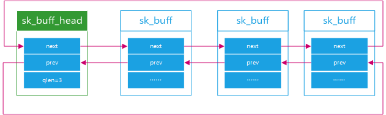
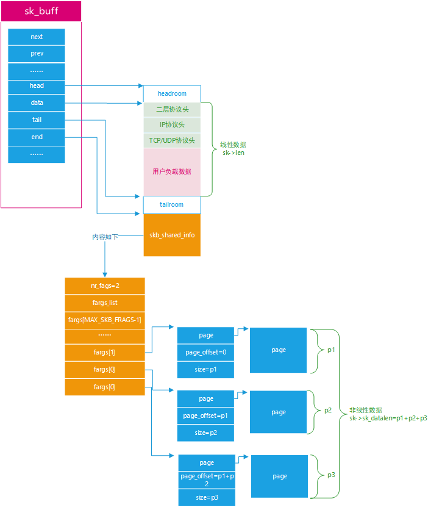
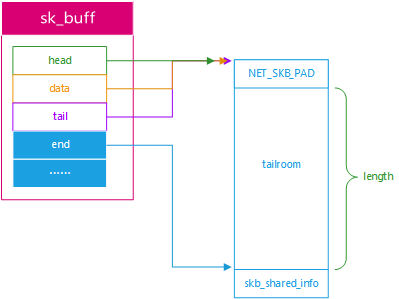
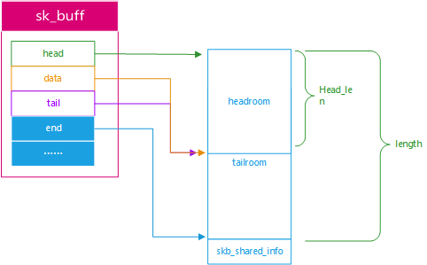
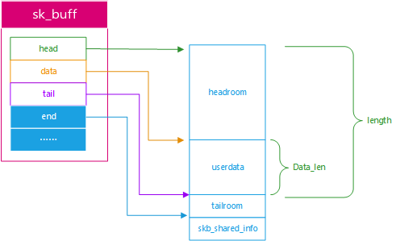
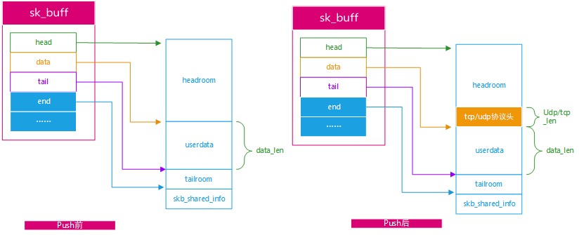
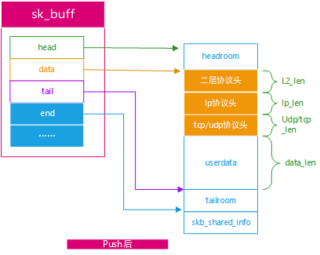
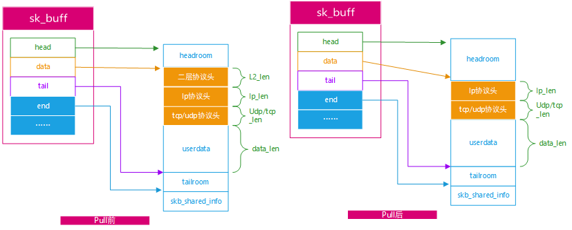

# sk_buff

## 概述

sk_buff在内部是以链表的形式整体组织的，如下图所示：



如下图所示，解释了skb_buff的一些重要的数据成员的含义



## skb空间分布

1. alloc_skb函数

   ```
   skb = alloc_skb(length, GFP_KERNEL);
   ```

   

   如图所示：该函数会分配`NET_SKB_PAD + length + sizeof(struct skb_shared_info)`长的空间，并把head、data、tail指向buff的头部，注意：

   - `NET_SKB_PAD`是为了对齐用
   - `length`是实际可以使用的空间
   - `sizeof(struct skb_shared_info)`：只是分配了这个结构体大小

   参考源码如下：

   ```c
   static inline struct sk_buff *dev_alloc_skb(unsigned int length)
   {
      size = NET_SKB_PAD + length;
   
   	/* 分配skb 结构体的内存*/
   	skb = kmem_cache_alloc_node(cache, gfp_mask & ~__GFP_DMA, node);
           
           /* 将 size 和 L1 Cache Line 长度对其 */
   	size = SKB_DATA_ALIGN(size);
           /* size 加上 sizeof(struct skb_shared_info)，并与  L1 Cache Line 长度对其*/
   	size += SKB_DATA_ALIGN(sizeof(struct skb_shared_info));
           /* 申请 skb 指向的 data buffer 空间 */
   	data = kmalloc_reserve(size, gfp_mask, node, &pfmemalloc);
   	skb->head = data;
   	skb->data = data;
   	skb_reset_tail_pointer(skb);
   	skb->end = skb->tail + size;
   }
   ```

   执行完该函数后，该sk_buff的总长度就固定下来了，能存放数据的长度为length

2. skb_reserve函数

   ```c
   skb_reserve(skb, Head_len)
   ```

   

   如图所示：此时会把data、tail指针往下移动Head_len长度，留出来headroom给协议栈用来存放各种协议的头。

   参考源码：

   ```c
   static inline void skb_reserve(struct sk_buff *skb, int len)
   {
   	skb->data += len;
   	skb->tail += len;
   }
   ```

   

3. skb_put函数

   ```
   skb_put(skb,data_len)
   ```

   skb_put 负责向skb 指向的buffer 中添加数据。如下图，在用户将数据memcpy( skb->data, data_len) 到 data 指针开始的位置时，然后调用 skb_put 移动 tail 指针到 skb->data + data_len位置

   

   参见源码：

   ```c
   /**
    *	skb_put - add data to a buffer
    *	@skb: buffer to use
    *	@len: amount of data to add
    *
    *	This function extends the used data area of the buffer. If this would
    *	exceed the total buffer size the kernel will panic. A pointer to the
    *	first byte of the extra data is returned.
    */
   void *skb_put(struct sk_buff *skb, unsigned int len)
   {
   	void *tmp = skb_tail_pointer(skb);
   	SKB_LINEAR_ASSERT(skb);
   	skb->tail += len;
   	skb->len  += len;
           /* 返回原始的tail指针 */
   	return tmp;
   }
   ```

   

4. skb_push函数

   ```
   skb_push(skb,udp/tcp_len)
   ```

   skb_push 在 skb->data 指针前面继续添加数据。例如在协议栈TX数据包时，需要添加UDP或者TCP等协议头部信息，则会调用 skb_push 将 skb->data 指针向上移动udp/tcp_len 长度，减少的是headroom的空间

   

   当然，后面可能还会继续添加ip协议头和二层协议头如下：

   

   参考源码如下：

   ```c
   /**
    *	skb_push - add data to the start of a buffer
    *	@skb: buffer to use
    *	@len: amount of data to add
    *
    *	This function extends the used data area of the buffer at the buffer
    *	start. If this would exceed the total buffer headroom the kernel will
    *	panic. A pointer to the first byte of the extra data is returned.
    */
   void *skb_push(struct sk_buff *skb, unsigned int len)
   {
   	skb->data -= len;
   	skb->len  += len;
   	return skb->data;
   } 
   ```

   

5. skb_pull函数

   ```
   skb_pull(skb,L2_len )
   ```

   skb_pull 从skb->data 指向的位置向下移动，类似于 pop 出栈。如下图，将二层协议头 pop 掉，则skb->data 回到IP协议头 时的位置。这主要被协议栈RX收包时，去除协议头时使用。

   

6. 举例说明

   ```c
   /* 分配 skb 总长度为length */
   skb = alloc_skb(length, GFP_KERNEL);
   /* 设置保留空间 给协议栈的头部使用 */
   skb_reserve(skb, header_len);
   
   /* skb put 将tail+user_data_len，返回原始tail指针 给 data*/
   unsigned char *data = skb_put(skb, user_data_len);
   /* 将用户态user_pointer的数据 copy 到 data */
   skb->csum = csum_and_copy_from_user(user_pointer, data,
   					user_data_len, 0, &err);
   
   struct udphdr *uh;
   /* 将skb data 指针向上移动 udphdr size，然后赋值 udp head*/
   skb->h.raw = skb_push(skb, sizeof(struct udphdr));
   uh = skb->h.uh
   uh->source = fl->fl_ip_sport;
   uh->dest = fl->fl_ip_dport;
   uh->len = htons(user_data_len);
   uh->check = 0;
   ```

   

## skb_shared_info介绍

如下图所示：skb_shared_info里面存放的是skb非线性信息；


首先我们来看看，内核是如何获取到一个已知 SKB 的 shared info 的结构信息的。如下实现非常简洁，就是从skb->end 指针开始的位置，基于结构(struct skb_shared_info *) 强制转换即可。

```c
#define skb_shinfo(SKB)	((struct skb_shared_info *)(skb_end_pointer(SKB)))

static inline unsigned char *skb_end_pointer(const struct sk_buff *skb)
{
	return skb->end;
}
```


skb_shared_info核心成员

```c
/* This data lives at
 * the end of the header data, ie. at skb->end.
 */
struct skb_shared_info {

	__u8		nr_frags; /* frags 数组中有效的成员个数 */

	unsigned short	gso_size; /* 进行 TCP 分段时，每段最大长度，即TCP头部的MSS，
                                   * 因为硬件可以做TSO（TCP 分段），所以网络设备驱动需要传给硬件
                                   */
	/* Warning: this field is not always filled in (UFO)! */
	unsigned short	gso_segs; /* 按照gso_size 即MSS进行 TCP 分段时，
                                   * 该skb将被分为多少段 segments 
                                   */
	struct sk_buff	*frag_list; /* UDP大块数据包需要分为多个Size为MTU的数据包，
                                     * 每个MTU数据包对应一个SKB，这些SKB通过该结构进行链表连接
                                     */

	/* must be last field, see pskb_expand_head() */
	skb_frag_t	frags[MAX_SKB_FRAGS];/* 驱动和硬件支持 Scatter Gatter 对小块数据进行聚合，
                                              * 以及 TSO（硬件TCP分段）会用到该数组（后面会有详细介绍）
                                              */
};

/* 每个 skb_frag_t 存放数据块基于 struct page 的地址和长度信息*/
typedef struct skb_frag_struct skb_frag_t;
struct skb_frag_struct {
	struct {
		struct page *p;
	} page;                             /* 当前 块数据对应 page 的虚拟地址*/
	__u32 page_offset;                  /* 当前 块数据在 page 中的偏移量，
                                             * 所以一个page可以给多个frags共享 
                                             */
	__u32 size;                         /* 当前 块数据的大小 */
};
```

