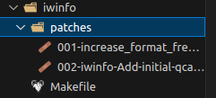
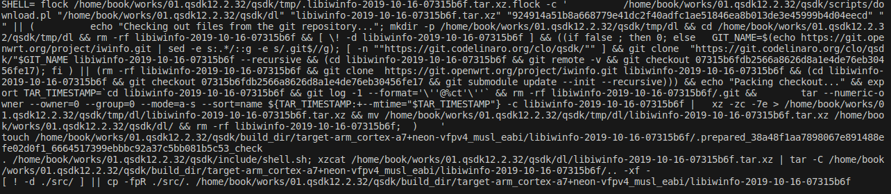

# Openwrt软件包下载脚本

这里以iwinfo软件包为例说明



如上图所示：iwinfo软件包里面有补丁和Makefile，这里主要分析Makefile，如下：

```bash
include $(TOPDIR)/rules.mk

PKG_NAME:=libiwinfo
PKG_RELEASE:=1

PKG_SOURCE_PROTO:=git
PKG_SOURCE_URL=$(PROJECT_GIT)/project/iwinfo.git
PKG_SOURCE_DATE:=2019-10-16
PKG_SOURCE_VERSION:=07315b6fdb2566a8626d8a1e4de76eb30456fe17
PKG_MIRROR_HASH:=924914a51b8a668779e41dc2f40adfc1ae51846ea8b013de3e45999b4d04eecd
PKG_MAINTAINER:=Jo-Philipp Wich <jo@mein.io>
PKG_LICENSE:=GPL-2.0

#XYM ADD
PATCH_DIR:=$(TOPDIR)/package/network/utils/iwinfo/patches

PKG_FLAGS := nonshared
```

执行编译，看到输出如下：

```bash
make  package/network/utils/iwinfo/{clean,compile} -j1 V=s
```



拆解里面的代码如下：

1. 执行脚本`scripts/download.pl`直接下载`libiwinfo-2019-10-16-07315b6f.tar.xz`压缩包

   ```bash
   /home/book/works/01.qsdk12.2.32/qsdk/scripts/download.pl
   "/home/book/works/01.qsdk12.2.32/qsdk/dl" 
   "libiwinfo-2019-10-16-07315b6f.tar.xz" "924914a51b8a668779e41dc2f40adfc1ae51846ea8b013de3e45999b4d04eecd" 
   ""
   ```

   **注意：**scripts/download.pl脚本用法如下：

   ```bash
   ./download.pl <target_dir> <filename> <md5sum> [<mirror> ...]
    #<target_dir> ：下载后保存的位置
     #<filename> ：待下载文件名字
     #<md5sum> ：下载文件的MD5
     # [<mirror> ...]：可选参数，下载文件的镜像地址，可以有多个地址。优先选择第一个
   ```

   查看`qsdk/scripts/download.pl`文件内容如下：

   ```
   
   ```

   

2. 如果上面的脚本下载压缩包失败，则执行下面的下载

   - git仓库clone下载，然后切换到指定的版本

     ```bash
     #临时目录 qsdk/tmp/dl 下操作
     cd /home/book/works/01.qsdk12.2.32/qsdk/tmp/dl
     
     git clone  "https://git.codelinaro.org/clo/qsdk/"$GIT_NAME libiwinfo-2019-10-16-07315b6f --recursive
     cd libiwinfo-2019-10-16-07315b6f
     git remote -v 
     git checkout 07315b6fdb2566a8626d8a1e4de76eb30456fe17 #切换到指定版本
     ```

     **注意：**该地址在`CONFIG_GIT_MIRROR="https://git.codelinaro.org/clo/qsdk/"`中设置，参见`qsdk/qca/configs/qsdk/ipq_premium.config`文件内容

     如果在失败的话执行下面的脚本

     ```bash
     git clone  https://git.openwrt.org/project/iwinfo.git libiwinfo-2019-10-16-07315b6f
     cd libiwinfo-2019-10-16-07315b6f
     git checkout 07315b6fdb2566a8626d8a1e4de76eb30456fe17
     git submodule update --init --recursive
     ```

     **注意：**该地址在`PROJECT_GIT = https://git.openwrt.org`中设置，参见`qsdk/include/download.mk`文件。

   - 接下来执行

     ```bash
     cd libiwinfo-2019-10-16-07315b6f
     git log -1 --format='\''@%ct'\''
     rm -rf libiwinfo-2019-10-16-07315b6f/.git #删除掉仓库的.git目录
     
     #压缩qsdk/tmp/dl/libiwinfo-2019-10-16-07315b6f 为libiwinfo-2019-10-16-07315b6f.tar.xz
     tar --numeric-owner --owner=0 --group=0 --mode=a-s --sort=name ${TAR_TIMESTAMP:+--mtime="$TAR_TIMESTAMP"} -c libiwinfo-2019-10-16-07315b6f |   xz -zc -7e > /home/book/works/01.qsdk12.2.32/qsdk/tmp/dl/libiwinfo-2019-10-16-07315b6f.tar.xz
     
     #把libiwinfo-2019-10-16-07315b6f.tar.xz 移动到 qsdk/dl/目录下
     mv /home/book/works/01.qsdk12.2.32/qsdk/tmp/dl/libiwinfo-2019-10-16-07315b6f.tar.xz /home/book/works/01.qsdk12.2.32/qsdk/dl/
     #删除掉dl目录下的仓库 libiwinfo-2019-10-16-07315b6f
     rm -rf libiwinfo-2019-10-16-07315b6f
     ```

     

3. 在我们执行编译命令的时候，把`dl/libiwinfo-2019-10-16-07315b6f.tar.xz`解压到`build_dir`目录下，命令如下：

   ```bash
   . /home/book/works/01.qsdk12.2.32/qsdk/include/shell.sh; 
   xzcat /home/book/works/01.qsdk12.2.32/qsdk/dl/libiwinfo-2019-10-16-07315b6f.tar.xz | tar -C /home/book/works/01.qsdk12.2.32/qsdk/build_dir/target-arm_cortex-a7+neon-vfpv4_musl_eabi/libiwinfo-2019-10-16-07315b6f/.. -xf -
   ```

   