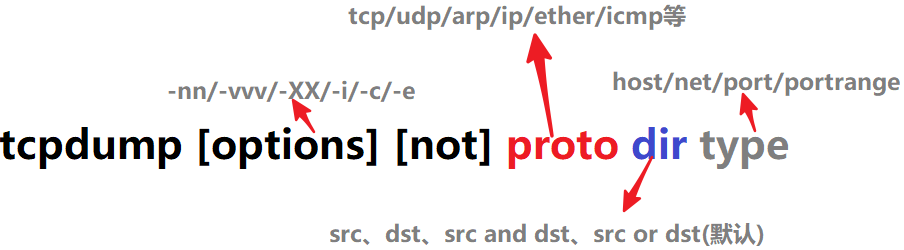

# tcpdump 工具使用说明

## 命令格式

```bash
root@wim:/# tcpdump -h
tcpdump version 4.9.3
libpcap version 1.9.1 (with TPACKET_V3)
Usage: tcpdump [-aAbdDefhHIJKlLnNOpqStuUvxX#] [ -B size ] [ -c count ]
                [ -C file_size ] [ -E algo:secret ] [ -F file ] [ -G seconds ]
                [ -i interface ] [ -j tstamptype ] [ -M secret ] [ --number ]
                [ -Q in|out|inout ]
                [ -r file ] [ -s snaplen ] [ --time-stamp-precision precision ]
                [ --immediate-mode ] [ -T type ] [ --version ] [ -V file ]
                [ -w file ] [ -W filecount ] [ -y datalinktype ] [ -z postrotate-command ]
                [ -Z user ] [ expression ]
                
```

### 抓包选项

- `-c`：指定要抓取的包数量；例如，指定"-c 10"将获取10个包，但可能已经处理了100个包，只不过只有10个包是满足条件的包；
- `-i interface`：指定tcpdump需要监听的接口；若未指定该选项，将从系统接口列表中搜寻编号最小的已配置好的接口(不包括loopback接口，要抓取loopback接口使用tcpdump -i lo)，一旦找到第一个符合条件的接口，搜寻马上结束；可以使用'any'关键字表示所有网络接口；
- `-n`：对地址以数字方式显式，否则显式为主机名，也就是说-n选项不做主机名解析；
- `-nn`：除了-n的作用外，还把端口显示为数值，否则显示端口服务名；
- `-N`：不打印出host的域名部分；例如tcpdump将会打印'nic'而不是'nic.ddn.mil'；
- `-P`：指定要抓取的包是流入还是流出的包；可以给定的值为
  - in 输入
  - out 输出
  - inout，默认为"inout"  输入输出
- `-s len`：设置tcpdump的数据包抓取长度为len，如果不设置默认将会是65535字节；对于要抓取的数据包较大时，长度设置不够可能会产生包截断，若出现包截断，输出行中会出现"[|proto]"的标志(proto实际会显示为协议名)；但是抓取len越长，包的处理时间越长，并且会减少tcpdump可缓存的数据包的数量，从而会导致数据包的丢失，所以在能抓取我们想要的包的前提下，抓取长度越小越好；

### 输出选项

- `-e`：输出的每行中都将包括数据链路层头部信息，例如源MAC和目标MAC；
- `-q`：快速打印输出；即打印很少的协议相关信息，从而输出行都比较简短；
- `-X`：输出包的头部数据，会以16进制和ASCII两种方式同时输出；
- `-XX`：输出包的头部数据，会以16进制和ASCII两种方式同时输出，更详细；
- `-v`：当分析和打印的时候，产生详细的输出；
- `-vv`：产生比-v更详细的输出；
- `-vvv`：产生比-vv更详细的输出；

### 其他功能性选项

- `-D`：列出可用于抓包的接口。将会列出接口的数值编号和接口名，它们都可以用于"-i"后；
- `-F`：从文件中读取抓包的表达式。若使用该选项，则命令行中给定的其他表达式都将失效；
- `-w`：将抓包数据输出到文件中而不是标准输出。可以同时配合"-G time"选项使得输出文件每time秒就自动切换到另一个文件。可通过"-r"选项载入这些文件以进行分析和打印；
- `-r`：从给定的数据包文件中读取数据。使用"-"表示从标准输入中读取。

常用的选项也就这几个


## tcpdump表达式



表达式用于筛选输出哪些类型的数据包，如果没有给定表达式，所有的数据包都将输出，否则只输出表达式为true的包。

tcpdump的一个基本的表达式单元格式为`proto dir type `，可以有多个单元组成：

1. `proto`：匹配的数据包类型

   常用的协议有：

   - tcp
   - udp
   - arp
   - ip
   - ether
   - icmp等，若未给定协议类型，则匹配所有可能的类型。

   ```bash
   tcpdump -i eth0 icmp   #抓取协议为icmp的数据包
   tcpdump -i eth0 ether src  00:0c:29:ae:89:5d  抓取源mac为  00:0c:29:ae:89:5d 的数据包
   ```

   

2. `dir`：指定方向

   可以给定的值包括:

   - src
   - dst
   - src or dst
   - src and dst`，默认为`src or dst

   ```bash
   tcpdump -i eth0 tcp and src  host 192.168.1.88  #抓取源地址为1.88的tcp 数据包
   tcpdump -i eth0 tcp and dst   host 192.168.1.200  #抓取源地址为1.200的tcp 数据包
   tcpdump -i eth0 tcp and src or dst   port 22  #抓取 源或者目录端口为22的 数据包
   ```

3. `type`：指定类型

   可以给定的值有

   - host
   - net
   - port 或者 portrange

   例如

   ```
   tcpdump -i ens33  host 192.168.2.137 and dst port 80 and tcp  #抓取源地址为1.88 数据包
   tcpdump -i eth0 src net  192.168.0.0/24  #抓取ip从192.168.0.0/24网段来的数据包
   tcpdump -i eth0 port 80 and src net  192.168.0.0/24   #抓取ip从192.168.0.0/24网段访问本机端口80的数据包
   ```

   

   - `"host 192.168.1.15"`：指定ip
   - `"net 128.3"`：指定网段
   - `"port 20"`：指定端口：
   - `"portrange 6000-6008"`。默认的type为host。

   


除了使用修饰符和ID组成的表达式单元，还有关键字表达式单元：gateway，broadcast，less，greater以及算术表达式。


表达式单元之间可以使用操作符" and / && / or / || / not / ! "进行连接，从而组成复杂的条件表达式。


如`"host foo and not port ftp and not port ftp-data"`，这表示筛选的数据包要满足`"主机为foo且端口不是ftp(端口21)和ftp-data(端口20)的包"`，常用端口和名字的对应关系可在linux系统中的`cat /etc/services`文件中找到。

另外，同样的修饰符可省略；

如`"tcp dst port ftp or ftp-data or domain"`与`"tcp dst port ftp or tcp dst port ftp-data or tcp dst port domain"`意义相同，都表示包的协议为tcp且目的端口为ftp或ftp-data或domain(端口53)

## tcpdump 示例

1. **监视指定网络接口的数据包**

   ```bash
   tcpdump -i eth1
   ```

   如果不指定网卡，默认tcpdump只会监视第一个网络接口，如eth0。

2. **监视指定主机的数据包**

   例如所有进入或离开longshuai的数据包

   ```bash
   tcpdump host longshuai
   ```

3.  **打印helios<-->hot或helios<-->ace之间通信的数据包**

   ```bash
   tcpdump host helios and ( hot or ace )
   
   ```

   

4. **打印ace与任何其他主机之间通信的IP数据包,但不包括与helios之间的数据包**

   ```bash
   tcpdump ip host ace and not helios
   ```

   

5.  **截获主机 hostname发送的所有数据**

   ```
   tcpdump src host hostname
   ```

   

6. **监视所有 发送到主机hostname的数据包**

   ```
   tcpdump dst host hostname
   ```

   

7. **监视指定主机和端口的数据包**

   ```
   tcpdump tcp port 22 and host hostname
   ```

   

8.  **本机的udp 123端口进行监视(123为ntp的服务端口)**

   ```bash
   tcpdump udp port 123
   
   ```

   

9. **监视指定网络的数据包**

   如本机与192.168网段通信的数据包，"-c 10"表示只抓取10个包

   ```
   tcpdump -c 10 net 192.168
   
   ```

   

10. **打印所有通过网关snup的ftp数据包** 

    (注意,表达式被单引号括起来了,这可以防止shell对其中的括号进行错误解析)

    ```bash
    shell> tcpdump 'gateway snup and (port ftp or ftp-data)'
    ```

    

11. **抓取ping包**

    ```bash
    tcpdump -c 5 -nn -i eth0 icmp
    ```

12.  **抓取到本机目的22端口包**

    ```
    tcpdump -c 10 -nn -i eth0 tcp dst port 22
    ```

    

13. **解析数据包**

    ```bash
    
    [root@server2 ~]# tcpdump -c 2 -q -XX -vvv -nn -i eth0 tcp dst port 22
    tcpdump: listening on eth0, link-type EN10MB (Ethernet), capture size 65535 bytes
    12:15:54.788812 IP (tos 0x0, ttl 64, id 19303, offset 0, flags [DF], proto TCP (6), length 40)
        192.168.100.1.5788 > 192.168.100.62.22: tcp 0
            0x0000:  000c 2908 9234 0050 56c0 0008 0800 4500  ..)..4.PV.....E.
            0x0010:  0028 4b67 4000 4006 a5d8 c0a8 6401 c0a8  .(Kg@.@.....d...
            0x0020:  643e 169c 0016 2426 5fd6 1fec 2b62 5010  d>....$&_...+bP.
            0x0030:  0803 7844 0000 0000 0000 0000            ..xD........
    12:15:54.842641 IP (tos 0x0, ttl 64, id 19304, offset 0, flags [DF], proto TCP (6), length 40)
        192.168.100.1.5788 > 192.168.100.62.22: tcp 0
            0x0000:  000c 2908 9234 0050 56c0 0008 0800 4500  ..)..4.PV.....E.
            0x0010:  0028 4b68 4000 4006 a5d7 c0a8 6401 c0a8  .(Kh@.@.....d...
            0x0020:  643e 169c 0016 2426 5fd6 1fec 2d62 5010  d>....$&_...-bP.
            0x0030:  0801 7646 0000 0000 0000 0000            ..vF........
    packets captured
    packets received by filter
    packets dropped by kernel
    ```

    总的来说，tcpdump对基本的数据包抓取方法还是较简单的。只要掌握有限的几个选项(-nn -XX -vvv -i -c -q)，再组合表达式即可。

