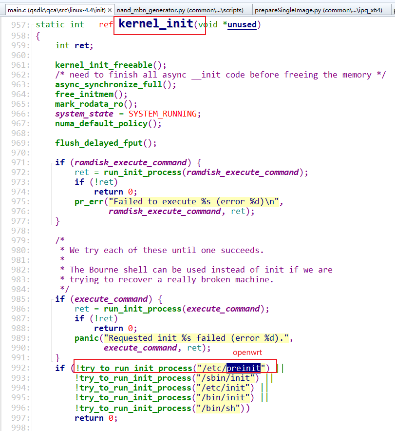
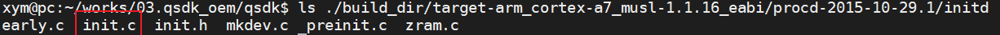
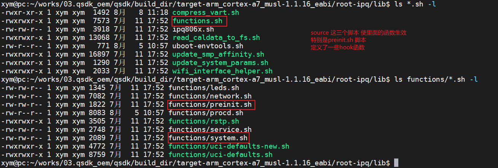
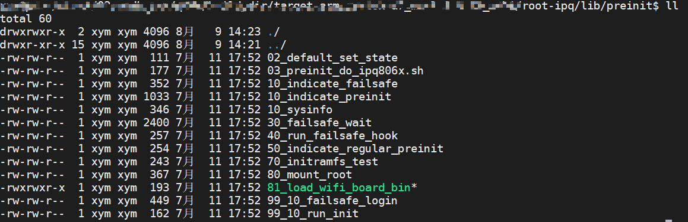
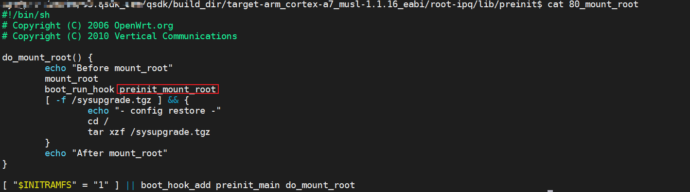
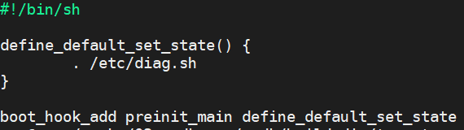
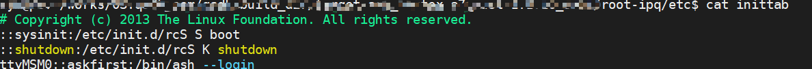
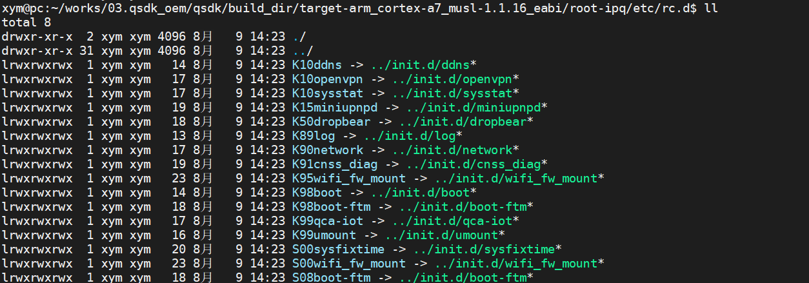
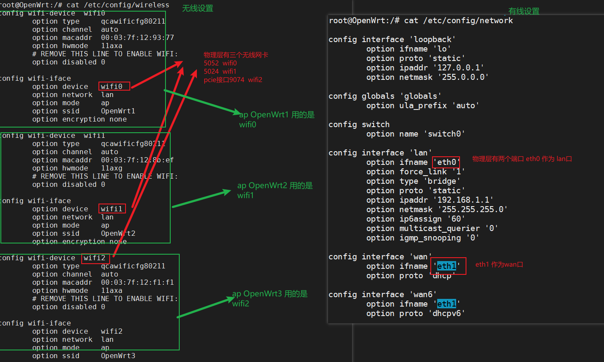

# OpenWrt

## 常用命令

1. 查看内存

   ```bash
   root@OpenWrt:/# cat /proc/meminfo
   MemTotal:         424480 kB
   MemFree:          298980 kB
   MemAvailable:     301648 kB
   Buffers:            1944 kB
   Cached:             5748 kB
   SwapCached:            0 kB
   Active:             7736 kB
   Inactive:           2236 kB
   Active(anon):       2824 kB
   ………………………………
   ```

2. 查看分区

   ```
   root@OpenWrt:/# cat /proc/mtd
   dev:    size   erasesize  name
   mtd0: 00180000 00020000 "0:SBL1"
   mtd1: 00100000 00020000 "0:MIBIB"
   mtd2: 00080000 00020000 "0:BOOTCONFIG"
   mtd3: 00080000 00020000 "0:BOOTCONFIG1"
   mtd4: 00380000 00020000 "0:QSEE"
   mtd5: 00380000 00020000 "0:QSEE_1"
   mtd6: 00080000 00020000 "0:DEVCFG"
   mtd7: 00080000 00020000 "0:DEVCFG_1"
   mtd8: 00080000 00020000 "0:RPM"
   mtd9: 00080000 00020000 "0:RPM_1"
   mtd10: 00080000 00020000 "0:CDT"
   mtd11: 00080000 00020000 "0:CDT_1"
   mtd12: 00080000 00020000 "0:APPSBLENV"
   mtd13: 00180000 00020000 "0:APPSBL"
   mtd14: 00180000 00020000 "0:APPSBL_1"
   mtd15: 00080000 00020000 "0:ART"
   mtd16: 03580000 00020000 "rootfs"
   mtd17: 03580000 00020000 "rootfs_1"
   mtd18: 00080000 00020000 "0:ETHPHYFW"
   mtd19: 0045a7c4 0001f000 "kernel"
   mtd20: 001c6000 0001f000 "wifi_fw"
   mtd21: 0101b000 0001f000 "ubi_rootfs"
   mtd22: 016a5000 0001f000 "rootfs_data"
   ```

3. 文件信息

   ```bash
   root@OpenWrt:/etc# ls /sys/class/net -l
   lrwxrwxrwx    1 root     root             0 Jul 28 09:38 bond0 -> ../../devices/virtual/net/bond0
   -rw-r--r--    1 root     root          4096 Jul 28 09:38 bonding_masters
   lrwxrwxrwx    1 root     root             0 Jul 28 09:38 br-lan -> ../../devices/virtual/net/br-lan
   lrwxrwxrwx    1 root     root             0 Jul 28 09:38 eth0 -> ../../devices/platform/soc/3a001400.dp1/net/eth0
   lrwxrwxrwx    1 root     root             0 Jul 28 09:30 eth1 -> ../../devices/platform/soc/3a001600.dp2/net/eth1
   lrwxrwxrwx    1 root     root             0 Jul 28 09:38 gre0 -> ../../devices/virtual/net/gre0
   lrwxrwxrwx    1 root     root             0 Jul 28 09:38 gretap0 -> ../../devices/virtual/net/gretap0
   lrwxrwxrwx    1 root     root             0 Jul 28 09:38 ifb0 -> ../../devices/virtual/net/ifb0
   lrwxrwxrwx    1 root     root             0 Jul 28 09:38 ifb1 -> ../../devices/virtual/net/ifb1
   lrwxrwxrwx    1 root     root             0 Jul 28 09:38 ip6gre0 -> ../../devices/virtual/net/ip6gre0
   lrwxrwxrwx    1 root     root             0 Jul 28 09:38 ip6tnl0 -> ../../devices/virtual/net/ip6tnl0
   lrwxrwxrwx    1 root     root             0 Jul 28 09:38 ipsecdummy -> ../../devices/virtual/net/ipsecdummy
   lrwxrwxrwx    1 root     root             0 Jul 28 09:38 lo -> ../../devices/virtual/net/lo
   lrwxrwxrwx    1 root     root             0 Jul 28 09:38 sit0 -> ../../devices/virtual/net/sit0
   lrwxrwxrwx    1 root     root             0 Jul 28 09:38 soc0 -> ../../devices/platform/soc/c000000.wifi/net/soc0
   lrwxrwxrwx    1 root     root             0 Jul 28 09:38 teql0 -> ../../devices/virtual/net/teql0
   lrwxrwxrwx    1 root     root             0 Jul 28 09:38 wifi0 -> ../../devices/platform/soc/c000000.wifi/net/wifi0
   lrwxrwxrwx    1 root     root             0 Jul 28 09:38 wifi1 -> ../../devices/platform/soc/c000000.wifi/net/wifi1
   root@OpenWrt:/etc#
   ```

   

4. wifi 配置信息

   ```bash
   root@OpenWrt:/# cat /etc/config/wireless
   config wifi-device  wifi0
           option type     qcawificfg80211
           option channel  auto
           option macaddr  00:03:7f:12:f3:d7
           option hwmode   11axa
           # REMOVE THIS LINE TO ENABLE WIFI:
           option disabled 1
   
   config wifi-iface
           option device   wifi0
           option network  lan
           option mode     ap
           option ssid     OpenWrt
           option encryption none
   
   config wifi-device  wifi1
           option type     qcawificfg80211
           option channel  auto
           option macaddr  00:03:7f:12:eb:4f
           option hwmode   11axg
           # REMOVE THIS LINE TO ENABLE WIFI:
           option disabled 1
   
   config wifi-iface
           option device   wifi1
           option network  lan
           option mode     ap
           option ssid     OpenWrt
           option encryption none
   
   root@OpenWrt:/#
   
   ```

   

5. 打开wifi

   ```bash
   uci set wireless.wifi0.disabled='0'
   uci commit
   wifi # 启动wifi
   ```

   

6. 查看wifi0 5G 频段的信道和带宽

   ```bash
   root@OpenWrt:/# iw wifi0 info
   Interface wifi0
           ifindex 14
           wdev 0x1
           addr 00:03:7f:12:f3:d7
           type AP
           wiphy 0
           channel 149 (5745 MHz), width: 80 MHz, center1: 5775 MHz
   Frequency
   ```

   

7. `iw info wifi0 freqlist`

8. `iw phy phy0 channels`

9. 安装`cheat`程序

   ```bash
   sudo snap install cheat
   ```

   用法

   1. 帮助信息`cheat -h`

      ```
      xym@pc:~/works/03.qsdk_oem/qsdk$ cheat -h
      Usage:
        cheat [options] [<cheatsheet>]
      
      Update community cheatsheets via:
        cheat.update
      
      
      Options:
        -a --all                Search among all cheatpaths
        -c --colorize           Colorize output
        -d --directories        List cheatsheet directories
        -e --edit=<cheatsheet>  Edit <cheatsheet>
        -l --list               List cheatsheets
        -p --path=<name>        Return only sheets found on cheatpath <name>
        -r --regex              Treat search <phrase> as a regex
        -s --search=<phrase>    Search cheatsheets for <phrase>
        -t --tag=<tag>          Return only sheets matching <tag>
        -T --tags               List all tags in use
        -v --version            Print the version number
        --rm=<cheatsheet>       Remove (delete) <cheatsheet>
      
      Examples:
      
      
        To view the tar cheatsheet:
          cheat tar
      
        To edit (or create) the foo cheatsheet:
          cheat -e foo
      
        To edit (or create) the foo/bar cheatsheet on the "work" cheatpath:
          cheat -p work -e foo/bar
      
        To view all cheatsheet directories:
          cheat -d
      
      ```

      

   2. 查找某个命令 `cheat -s 关键词`

   3. 查看命令使用方法`cheat 命令名字`

   4. 

   

10. find 命令

    - 查找所有`.h`文件

      ```bash
      find ./ -name "*.h"
      ```

    - 查找所有`.h`文件中包含`helloword`字符串的文件

      ```bash
      find ./ -name "*.h" -exec grep -in "helloword" {} \;
      #或者
      find ./ -name "*.h" | xargs grep -in "helloworld"
      ```

      

    - 查找所有”.h”和”.c”文件中的含有”helloworld”字符串的文件

      ```bash
      find ./ /(-name "*.h" -or -name "*.c" /) -exec grep -in "helloworld" {} \;
      ```

    - 

11. grep命令

    ```bash
    grep [-abcEFGhHilLnqrsvVwxy][-A<显示行数>][-B<显示列数>][-C<显示列数>][-d<进行动作>][-e<范本样式>][-f<范本文件>][--help][范本样式][文件或目录...]
    
    参数：
    -a 或 --text : 不要忽略二进制的数据。
    -A<显示行数> 或 --after-context=<显示行数> : 除了显示符合范本样式的那一列之外，并显示该行之后的内容。
    -b 或 --byte-offset : 在显示符合样式的那一行之前，标示出该行第一个字符的编号。
    -B<显示行数> 或 --before-context=<显示行数> : 除了显示符合样式的那一行之外，并显示该行之前的内容。
    -c 或 --count : 计算符合样式的列数。
    -C<显示行数> 或 --context=<显示行数>或-<显示行数> : 除了显示符合样式的那一行之外，并显示该行之前后的内容。
    -d <动作> 或 --directories=<动作> : 当指定要查找的是目录而非文件时，必须使用这项参数，否则grep指令将回报信息并停止动作。
    -e<范本样式> 或 --regexp=<范本样式> : 指定字符串做为查找文件内容的样式。
    -E 或 --extended-regexp : 将样式为延伸的正则表达式来使用。
    -f<规则文件> 或 --file=<规则文件> : 指定规则文件，其内容含有一个或多个规则样式，让grep查找符合规则条件的文件内容，格式为每行一个规则样式。
    -F 或 --fixed-regexp : 将样式视为固定字符串的列表。
    -G 或 --basic-regexp : 将样式视为普通的表示法来使用。
    -h 或 --no-filename : 在显示符合样式的那一行之前，不标示该行所属的文件名称。
    -H 或 --with-filename : 在显示符合样式的那一行之前，表示该行所属的文件名称。
    -i 或 --ignore-case : 忽略字符大小写的差别。
    -l 或 --file-with-matches : 列出文件内容符合指定的样式的文件名称。
    -L 或 --files-without-match : 列出文件内容不符合指定的样式的文件名称。
    -n 或 --line-number : 在显示符合样式的那一行之前，标示出该行的列数编号。
    -o 或 --only-matching : 只显示匹配PATTERN 部分。
    -q 或 --quiet或--silent : 不显示任何信息。
    -r 或 --recursive : 此参数的效果和指定"-d recurse"参数相同。
    -s 或 --no-messages : 不显示错误信息。
    -v 或 --invert-match : 显示不包含匹配文本的所有行。
    -V 或 --version : 显示版本信息。
    -w 或 --word-regexp : 只显示全字符合的列。
    -x --line-regexp : 只显示全列符合的列。
    -y : 此参数的效果和指定"-i"参数相同。
    ```

    

    - 在指定的文件`/etc/passwd`中搜索字符串`watchdog`

      ```bash
      #-n 显示行号
      grep -n 'watchdog'  /etc/passwd
      
      #'watchdog'引号可以省略，但是如果字符串中有空格或者用正则表达式请不要省略引号
      ```

    - 在指定的目录`/etc`下递归搜索含有`watchdog`的字符串的文件

      ```bash
      #-r 递归查找 
      #-n 列出行號
      #-i 忽略大小写
      grep -rni 'watchdog' /etc 
      ```

    - 在指定的目录下`/etc`递归搜索指定后缀的所有文件中，包含`watchdog`字符串的文件

      ```bash
      #在/etc 所有目录下递归查找后缀为.config的文件中 包含 watchdog字符串 列出行号 忽略大小写
      find /etc -type f -name *.config -exec grep -in watchdog {} \;
      
      #在/etc 所有目录下递归查找后缀为.h或者.c的文件中 包含 watchdog字符串 列出文件名和行号 忽略大小写
      find /etc -name "*.h" -or -name "*.c" -exec grep -iHn "watchdog" {} \;
      ```

      

    - 

12. 

## OperWrt启动过程

1. 内核init进程是所有系统进程的父进程，在init进程中会读取`/etc/inittab`文件，执行里面的`sysinit`所指向的脚本`/etc/init.d/rcS S boot`

   下面是`/etc/inittab`的内容

   ```bash
   root@OpenWrt:/etc# cat inittab
   # Copyright (c) 2013 The Linux Foundation. All rights reserved.
   ::sysinit:/etc/init.d/rcS S boot
   ::shutdown:/etc/init.d/rcS K shutdown
   ttyMSM0::askfirst:/bin/ash --login
   ```

   

2. 在正常的linux内核中我们会在`/etc/init.d/rcS`中写入我们要启动的应用程序和服务，但是OpenWrt为了能够动态的修改需要启动的应用程序，引入了一个新的机制，


### OpenWrt启动脚本分析

1. 内核代码`start_kernel`函数执行的最后会调用`kernel_init`函数来启动用户空间的一号进程，标准linux默认是的`/etc/init`进程，但在OpenWRT里面会执行`/etc/preinit`，代码如下图992行：

   

2. 下面分析`/etc/preinit`脚本

   `/etc/preinit`脚本内容如下：

   ```bash
   #!/bin/sh
   # Copyright (C) 2006 OpenWrt.org
   # Copyright (C) 2010 Vertical Communications
   
   [ -z "$PREINIT" ] && exec /sbin/init
   
   export PATH=/usr/sbin:/usr/bin:/sbin:/bin
   
   pi_ifname=
   pi_ip=192.168.1.1
   pi_broadcast=192.168.1.255
   pi_netmask=255.255.255.0
   
   fs_failsafe_ifname=
   fs_failsafe_ip=192.168.1.1
   fs_failsafe_broadcast=192.168.1.255
   fs_failsafe_netmask=255.255.255.0
   
   fs_failsafe_wait_timeout=0
   
   pi_suppress_stderr="y"
   pi_init_suppress_stderr="y"
   pi_init_path="/usr/sbin:/usr/bin:/sbin:/bin"
   pi_init_cmd="/sbin/init"
   
   . /lib/functions.sh
   . /lib/functions/preinit.sh
   . /lib/functions/system.sh
   
   boot_hook_init preinit_essential
   boot_hook_init preinit_main
   boot_hook_init failsafe
   boot_hook_init initramfs
   boot_hook_init preinit_mount_root
   
   for pi_source_file in /lib/preinit/*; do
           . $pi_source_file
   done
   
   boot_run_hook preinit_essential
   
   pi_mount_skip_next=false
   pi_jffs2_mount_success=false
   pi_failsafe_net_message=false
   
   boot_run_hook preinit_main
   ```

   拆解上面的脚本，逐步分析如下：

   1. 步骤1

      ```bash
      [ -z "$PREINIT" ] && exec /sbin/init
      ```

      分析：
      `PREINIT`变量当前没有值，所以执行`exec /sbin/init`，使用`exec`，表明`/sbin/init`替换进程上下文，`pid`保持不变，应该为1。

      下面分析`/sbin/init`干了什么，即分析函数`init.c`

      源码位于

      

      ```c
      int  main(int argc, char **argv)  
      {  
          pid_t pid;  
        
          sigaction(SIGTERM, &sa_shutdown, NULL);  
          sigaction(SIGUSR1, &sa_shutdown, NULL);  
          sigaction(SIGUSR2, &sa_shutdown, NULL);  
        
      	/*  early
           *   |->early_mounts
           *   |      |-> mount
           *   |      |->early_dev 设置环境变量
           *   |->LOG("Console is alive")
           */
      	early();
          
          /*  cmdline
           *      |-> get init_debug 获取init_debug等级
           */
      	cmdline();
          
          /*  watchdog_init
           *      |->LOG("- watchdog -")
           */
      	watchdog_init(1); 
        
          pid = fork();  
          if (!pid) {  
              /*  /sbin/kmodloader
               *      |-> /etc/modules-boot.d 加载驱动
               */
              char *kmod[] = { "/sbin/kmodloader", "/etc/modules-boot.d/", NULL };  
        
              if (debug < 3) {  
                  int fd = open("/dev/null", O_RDWR);  
        
                  if (fd > -1) {  
                      dup2(fd, STDIN_FILENO);  
                      dup2(fd, STDOUT_FILENO);  
                      dup2(fd, STDERR_FILENO);  
                      if (fd > STDERR_FILENO)  
                          close(fd);  
                  }  
              }  
              execvp(kmod[0], kmod);  
              ERROR("Failed to start kmodloader\n");  
              exit(-1);  
          }  
          if (pid <= 0)  
              ERROR("Failed to start kmodloader instance\n");  
          uloop_init();  
          /*  preinit
           *      |-> LOG("- preinit -")
           *      |-> fork->procd
           *      |-> setenv("PREINIT"， "1"， 1)
           *      |-> fork->sh /etc/preinit
           */
          preinit();    //-------------->watchdog.c  
          uloop_run();  
        
          return 0;  
      } 
      
      ```

      - `early()`函數：主要四个功能：

        - early_mounts()： mount /proc， /sysfs， /dev， /tmp
        - early_env()： 使用/usr/sbin：/sbin：/usr/bin：/bin设置 PATH参数
        - 初始化`/dev/console`
        - 从init打印第一条消息：`"init: Console is alive"`

        

      - `cmdline()`函数

        它从`/proc/cmdline`读取内核引导命令行并解析init_debug参数

      - `watchdog_init(1)`函数

        初始化监视程序 `/dev/watchdog` 并打印第二条消息 `"init: - watchdog -"`

      - `fork` 一个新线程，让`/sbin/kmodloader`加载`/etc/modules-boot.d`下的设备驱动程序

        下面看下`kmodloader.c`内容：

        ```c
            if (scan_loaded_modules())
                return -1;
        
            if (scan_module_folders())
                return -1;
                
            while (getline(&mod, &mod_len, fp) > 0) {
                char *nl = strchr(mod, '\n');
                struct module *m;
                char *opts;
        
                if (nl)
                    *nl = '\0';
        
                opts = strchr(mod, ' ');
                if (opts)
                    *opts++ = '\0';
        
                m = find_module(get_module_name(mod));
                if (!m || (m->state == LOADED))
                    continue;
        
                if (opts)
                    m->opts = strdup(opts);
                m->state = PROBE;
                if (basename(gl.gl_pathv[j])[0] - '0' <= 9)
                    load_modprobe();
        
            }
        
        ```

        

        1. 从`/proc/modules`里面遍历所有已经安装的模块，包括模块名称和大小等信息，插入到avl树中，同时将节点状态设置为`LOADED`；
        2. 将`/lib/modules/x.x.x`路径保存到二维指针`module_folders`，遍历`/lib/modules/x.x.x/*.ko`，查看是否在avl树中，如果不在，添加到avl树中，同时将节点状态设置为`SCANNED`;
        3. 遍历`/etc/modules-boot.d`下所有文件并打开，判断当前模块是否在avl树中，如果存在且节点状态不为LOADED，则将此节点状态设置为PROBE，如果文件名第一个字符是0~9之间，则装载此模块，同时将此节点状态设置为LOADED;

      - `uloop_init()` 初始化`uloop`，这是一个事件循环。后来的`sh /sbin/procd`和`sh /etc/preinit`将由`uloop`管理

      - `preinit()`函数：有四个主要任务,`preinit()`函数如下:

        ```c
        void
        preinit(void)
        {
            char *init[] = { "/bin/sh", "/etc/preinit", NULL };
            char *plug[] = {"/sbin/procd", "-h","/etc/hotplug-preinit.json",NULL };
        
            // 步骤1： 打印日志
            LOG("- preinit -\n");
            
            // 步骤2：fork一个新进程 执行/sbin/procd -h /etc/hotplug-preinit.json 
            // 进程结束后，回调 plugd_proc_cb 函数
            plugd_proc.cb = plugd_proc_cb;
            plugd_proc.pid = fork();
            if (!plugd_proc.pid) {
                execvp(plug[0], plug);
                ERROR("Failed to start plugd\n");
                exit(-1);
            }
            if (plugd_proc.pid <= 0) {
                ERROR("Failed to start new plugd instance\n");
                return;
            }
            uloop_process_add(&plugd_proc);
            // 步骤3：设置环境比变量
            setenv("PREINIT", "1", 1);
        
            // 步骤4：fork一个新进程 执行 /bin/sh /etc/preinit 脚本
            // 进程结束后，回调 spawn_procd 函数
            preinit_proc.cb = spawn_procd;
            preinit_proc.pid = fork();
            if (!preinit_proc.pid) {
                execvp(init[0], init);
                ERROR("Failed to start preinit\n");
                exit(-1);
            }
            if (preinit_proc.pid <= 0) {
                ERROR("Failed to start new preinit instance\n");
                return;
            }
            uloop_process_add(&preinit_proc);
        
            DEBUG(4, "Launched preinit instance, pid=%d\n", (int) preinit_proc.pid);
        }
        
        ```

        分析过后可以发现`preinit`函数分别`fork`了两个进程`procd`和`/etc/preinit`下面分析这两个进程

        - `/sbin/procd`进程

          ```bash
          /sbin/procd -h /etc/hotplug-preinit.json
          ```

          `/sbin/procd`程序源码如下：可以看到由于`-h`作用，肯定会执行`hotplug_run(optarg)`

          ```c
          int main(int argc, char **argv)
          {
              int ch;
              char *dbglvl = getenv("DBGLVL");
              int ulog_channels = ULOG_KMSG;
          
              if (dbglvl) {
                  debug = atoi(dbglvl);
                  unsetenv("DBGLVL");
              }
          
              while ((ch = getopt(argc, argv, "d:s:h:S")) != -1) {
                  switch (ch) {
                  case 'h':
                      /*  建立netlink通讯机制，完成内核的交互，监听uevent事件
                       */
                      return hotplug_run(optarg);
                  case 's':
                      ubus_socket = optarg;
                      break;
                  case 'd':
                      debug = atoi(optarg);
                      break;
                  case 'S':
                      ulog_channels = ULOG_STDIO;
                      break;
                  default:
                      return usage(argv[0]);
                  }
              }
          
              ulog_open(ulog_channels, LOG_DAEMON, "procd");
          
              setsid();
              uloop_init();
              procd_signal();
              if (getpid() != 1)
                  procd_connect_ubus();
              else
                  /* 状态机处理，实际效果如下
                   * [ 6.596450] procd: - early -
                   * [ 6.599817] procd: - watchdog -
                   * [ 7.301153] procd: - ubus -
                   * [ 7.362047] procd: - init -
                   */
                  procd_state_next();
              uloop_run();
              uloop_done();
          
              return 0;
          }
          
          ```

          `procd_state_next`处理完状态之后设备设备会执行到`rcS.c`

          ```c
          int rcS(char *pattern, char *param, void (*q_empty)(struct runqueue *))
          {
              runqueue_init(&q);
              q.empty_cb = q_empty;
              q.max_running_tasks = 1;
              // 这里便是我们常见的自启动脚本的地方
          	// 需要知道的是K开头的文件为stop，S开头的文件为start
          	return _rc(&q, "/etc/rc.d", pattern, "*", param);
          }
          ```

          

          **注意**：由于通过 `uloop_process_add(&plugd_proc)`函数将`plugd_proc`加入`uloop`中，当线程执行完后回调`plugd_proc_cb`函数

          

        - `/etc/preinit`进程

          ```
           /bin/sh /etc/preinit
          ```

          可以看到这里又回到了`/etc/preinit`脚本，不过此时`PREINIT`已经为1

          **注意**：通过 `uloop_process_add(&preinit_proc)`函数将`preinit_proc`加入`uloop`中，当线程执行完后回调`spawn_procd`函数，`spawn_procd()`将从`/tmp/debuglevel`读取系统调试级别，并将其设置为`setenv DBGLVL`。它还将看门狗`fd`设置为`setenv WDTFD`。

          最后，它将分叉真正的`/sbin/procd`作为`deamon`。

   2. 步骤2

      步骤1最终回到了`/etc/preinit`脚本，不过此时`PREINIT`已经为1，所以继续执行`/etc/preinit`下面的内容，如下代碼，沒什麽好分析的

      ```bash
      export PATH=/usr/sbin:/usr/bin:/sbin:/bin
      
      pi_ifname=
      pi_ip=192.168.1.1
      pi_broadcast=192.168.1.255
      pi_netmask=255.255.255.0
      
      fs_failsafe_ifname=
      fs_failsafe_ip=192.168.1.1
      fs_failsafe_broadcast=192.168.1.255
      fs_failsafe_netmask=255.255.255.0
      
      fs_failsafe_wait_timeout=0
      
      pi_suppress_stderr="y"
      pi_init_suppress_stderr="y"
      pi_init_path="/usr/sbin:/usr/bin:/sbin:/bin"
      pi_init_cmd="/sbin/init"
      ```

      

   3. 步骤3

      注意`.`和`/`之间是有空格的，这里的点相当与`souce`命令，但`souce`是bash特有的，并不在POSIX标准中，`.`是通用的用法。使用`.`的意思是在当前shell环境下运行，并不会在子shell中运行。这几个shell脚本主要定义了shell函数，特别是`preinit.sh`中，定义了`hook`相关操作的函数

      ```bash
      . /lib/functions.sh
      . /lib/functions/preinit.sh
      . /lib/functions/system.sh
      ```

      

      我们需要重点看下`/lib/functions/preinit.sh`里面的三个函数

      ```bash
      boot_hook_init() {
              local hook="${1}_hook"
              export -n "PI_STACK_LIST=${PI_STACK_LIST:+$PI_STACK_LIST }$hook"
              export -n "$hook="
      }
      
      boot_hook_add() {
              local hook="${1}_hook${PI_HOOK_SPLICE:+_splice}"
              local func="${2}"
      
              [ -n "$func" ] && {
                      local v; eval "v=\$$hook"
                      export -n "$hook=${v:+$v }$func"
              }
      }
      boot_run_hook() {
              local hook="$1"
              local func
      
              while boot_hook_shift "$hook" func; do
                      local ran; eval "ran=\$PI_RAN_$func"
                      [ -n "$ran" ] || {
                              export -n "PI_RAN_$func=1"
                              $func "$1" "$2"
                      }
              done
      }
      
      ```

      函数功能如下：

      - boot_hook_init()：初始化一个函数队列
      - boot_hook_add()：往函数队列上增加函数
      - boot_run_hook()：遍历函数队列上的所有函数，找到对应的函数然后运行

   4. 步驟4

      ```bash
      boot_hook_init preinit_essential
      boot_hook_init preinit_main
      boot_hook_init failsafe
      boot_hook_init initramfs
      boot_hook_init preinit_mount_root
      ```

      可以看到，openwrt一共初始化了5类函数队列如下：

      - preinit_essential
      - preinit_main
      - failsafe
      - initramfs
      - preinit_mount_root

      那又哪些函数分别挂载到这五类队列上呢？继续往下分析

   5. 步骤5

      依次执行`/lib/preinit/`下面的所有脚本，其实仔细分析这些脚本，你会发现并没真的执行，只是将函数添加到步骤4上说的5类函数队列上

      ```bash
      for pi_source_file in /lib/preinit/*; do
          . $pi_source_file
      done
      ```

      这些脚本如下：

      

      **注意**：`80_mount_root` 会对overlay目录进行挂载

      

      

      我们举例分析：`lib/preinit/02_default_set_state`

      
      可以看到

      把`define_default_set_state()`函数挂载到`preinit_main`函数列表中

      而`define_default_set_state()`函数的内容是

      ```bash
      define_default_set_state() {
              . /etc/diag.sh
      }
      ```

      所以可以看到，這裏仅仅只是把函数挂载到5类函数队列中，并为真正执行，那么问题来了，到底什么时候执行？接着往下分析。

      先总结下这五类函数队列下都挂载了什么

      1. preinit_essential

         - 

      2. preinit_main

         - 【`lib/preinit/02_default_set_state`】脚本下的`define_default_set_state()`函数

           ```bash
           . /etc/diag.sh
           ```

         - 【`lib/preinit/10_sysinfo`】脚本下的`do_sysinfo_generic()`函数

           ```bash
           do_sysinfo_generic() {
                   [ -d /proc/device-tree ] || return
                   mkdir -p /tmp/sysinfo
                   [ -e /tmp/sysinfo/board_name ] || \
                           echo "$(strings /proc/device-tree/compatible | head -1)" > /tmp/sysinfo/board_name
                   [ -e /tmp/sysinfo/model ] || \
                           echo "$(cat /proc/device-tree/model)" > /tmp/sysinfo/model
           }
           ```

         - 【`lib/preinit/40_run_failsafe_hook`】脚本下的`run_failsafe_hook()`函数

           ```bash
           run_failsafe_hook() {
               if [ "$FAILSAFE" = "true" ]; then
                   boot_run_hook failsafe
                   lock -w /tmp/.failsafe
               fi
           }
           
           ```

           

         - 【`lib/preinit/70_initramfs_test`】脚本下的`initramfs_test()`函数

           ```bash
           initramfs_test() {
                   if [ -n "$INITRAMFS" ]; then
                           boot_run_hook initramfs
                           preinit_ip_deconfig
                           break
                   fi
           }
           
           ```

         - 【`lib/preinit/81_load_wifi_board_bin`】脚本下的`do_load_ipq4019_board_bin()`函数

           ```
           
           #!/bin/sh
           #
           # Copyright (c) 2015 The Linux Foundation. All rights reserved.
           # Copyright (C) 2011 OpenWrt.org
           
           . /lib/read_caldata_to_fs.sh
           
           boot_hook_add preinit_main do_load_ipq4019_board_bin
           ```

           **注意**：这里会先执行`. /lib/read_caldata_to_fs.sh`脚本,`do_load_ipq4019_board_bin()`函数暂时不知在哪？

           `/lib/read_caldata_to_fs.sh`脚本内容如下：

           ```bash
           #!/bin/sh
           #
           # Copyright (c) 2015 The Linux Foundation. All rights reserved.
           # Copyright (C) 2011 OpenWrt.org
           
           . /lib/ipq806x.sh
           
           do_load_ipq4019_board_bin()
           {
               local board=$(ipq806x_board_name)
               local mtdblock=$(find_mtd_part 0:ART)
           
               local apdk="/tmp"
           
               if [ -z "$mtdblock" ]; then
                   # read from mmc
                   mtdblock=$(find_mmc_part 0:ART)
               fi
           
               [ -n "$mtdblock" ] || return
           
               # load board.bin
               case "$board" in
                       ap-dk0*)
                               mkdir -p ${apdk}
                               dd if=${mtdblock} of=${apdk}/wifi0.caldata bs=32 count=377 skip=128
                               dd if=${mtdblock} of=${apdk}/wifi1.caldata bs=32 count=377 skip=640
                       ;;
                       ap16* | ap148*)
                               mkdir -p ${apdk}
                               dd if=${mtdblock} of=${apdk}/wifi0.caldata bs=32 count=377 skip=128
                               dd if=${mtdblock} of=${apdk}/wifi1.caldata bs=32 count=377 skip=640
                               dd if=${mtdblock} of=${apdk}/wifi2.caldata bs=32 count=377 skip=1152
                       ;;
                       ap-hk14 | ap-hk01-c6)
                               FILESIZE=131072
                               mkdir -p ${apdk}/IPQ8074
                               dd if=${mtdblock} of=${apdk}/IPQ8074/caldata.bin bs=1 count=$FILESIZE skip=4096
                               ln -s ${apdk}/IPQ8074/caldata.bin /lib/firmware/IPQ8074/caldata.bin
           
                               mkdir -p ${apdk}/qcn9000
                               dd if=${mtdblock} of=${apdk}/qcn9000/caldata_1.bin bs=1 count=$FILESIZE skip=157696
                               ln -s ${apdk}/qcn9000/caldata_1.bin /lib/firmware/qcn9000/caldata_1.bin
                       ;;
                       ap-hk01-*)
                               HK_BD_FILENAME=/lib/firmware/IPQ8074/bdwlan.bin
                               mkdir -p ${apdk}/IPQ8074
                               if [ -f "$HK_BD_FILENAME" ]; then
                                   FILESIZE=$(stat -Lc%s "$HK_BD_FILENAME")
                               else
                                   FILESIZE=131072
                               fi
                               dd if=${mtdblock} of=${apdk}/IPQ8074/caldata.bin bs=1 count=$FILESIZE skip=4096
                               [ -L /lib/firmware/IPQ8074/caldata.bin ] || \
                               ln -s ${apdk}/IPQ8074/caldata.bin /lib/firmware/IPQ8074/caldata.bin
                       ;;
                       ap-hk10-*)
                               FILESIZE=131072
                               mkdir -p ${apdk}/IPQ8074
                               dd if=${mtdblock} of=${apdk}/IPQ8074/caldata.bin bs=1 count=$FILESIZE skip=4096
                               ln -s ${apdk}/IPQ8074/caldata.bin /lib/firmware/IPQ8074/caldata.bin
           
                               mkdir -p ${apdk}/qcn9000
                               dd if=${mtdblock} of=${apdk}/qcn9000/caldata_1.bin bs=1 count=$FILESIZE skip=157696
                               dd if=${mtdblock} of=${apdk}/qcn9000/caldata_2.bin bs=1 count=$FILESIZE skip=311296
                               ln -s ${apdk}/qcn9000/caldata_1.bin /lib/firmware/qcn9000/caldata_1.bin
                               ln -s ${apdk}/qcn9000/caldata_2.bin /lib/firmware/qcn9000/caldata_2.bin
                       ;;
                       ap-hk* | ap-ac* | ap-oa*)
                               HK_BD_FILENAME=/lib/firmware/IPQ8074/bdwlan.bin
                               mkdir -p ${apdk}/IPQ8074
                               dd if=${mtdblock} of=${apdk}/wifi1.caldata bs=1 count=12064 skip=208896
                               if [ -f "$HK_BD_FILENAME" ]; then
                                   FILESIZE=$(stat -Lc%s "$HK_BD_FILENAME")
                               else
                                   FILESIZE=131072
                               fi
                               dd if=${mtdblock} of=${apdk}/IPQ8074/caldata.bin bs=1 count=$FILESIZE skip=4096
                               [ -L /lib/firmware/IPQ8074/caldata.bin ] || \
                               ln -s ${apdk}/IPQ8074/caldata.bin /lib/firmware/IPQ8074/caldata.bin
                       ;;
                       ap-cp01-c3*)
                               CP_BD_FILENAME=/lib/firmware/IPQ6018/bdwlan.bin
                               mkdir -p ${apdk}/IPQ6018
                               if [ -f "$CP_BD_FILENAME" ]; then
                                   FILESIZE=$(stat -Lc%s "$CP_BD_FILENAME")
                               else
                                   FILESIZE=65536
                               fi
                               dd if=${mtdblock} of=${apdk}/IPQ6018/caldata.bin bs=1 count=$FILESIZE skip=4096
                               [ -L /lib/firmware/IPQ6018/caldata.bin ] || \
                               ln -s ${apdk}/IPQ6018/caldata.bin /lib/firmware/IPQ6018/caldata.bin
           
                               mkdir -p ${apdk}/qcn9000
                               FILESIZE=131072
                               dd if=${mtdblock} of=${apdk}/qcn9000/caldata_1.bin bs=1 count=$FILESIZE skip=157696
                               ln -s ${apdk}/qcn9000/caldata_1.bin /lib/firmware/qcn9000/caldata_1.bin
                       ;;
                       ap-mp02.1* | db-mp02.1*)
                               mkdir -p ${apdk}/IPQ5018
                               FILESIZE=131072
           
                               #FTM Daemon compresses the caldata and writes the lzma file in ART Partition
                               dd if=${mtdblock} of=${apdk}/virtual_art.bin.lzma
                               lzma -fdv --single-stream ${apdk}/virtual_art.bin.lzma || {
                               # Create dummy virtual_art.bin file of size 512K
                               dd if=/dev/zero of=${apdk}/virtual_art.bin bs=1024 count=512
                               }
           
                               dd if=${apdk}/virtual_art.bin of=${apdk}/IPQ5018/caldata.bin bs=1 count=$FILESIZE skip=4096
           
                               mkdir -p ${apdk}/qcn6122
                               # Read after 154KB
                               dd if=${apdk}/virtual_art.bin of=${apdk}/qcn6122/caldata_1.bin bs=1 count=$FILESIZE skip=157696
                               # Read after 304KB
                               dd if=${apdk}/virtual_art.bin of=${apdk}/qcn6122/caldata_2.bin bs=1 count=$FILESIZE skip=311296
           
                               ln -s ${apdk}/IPQ5018/caldata.bin /lib/firmware/IPQ5018/caldata.bin
                               # To Remove later
                               ln -s ${apdk}/qcn6122/caldata_1.bin /lib/firmware/qcn9100/caldata_1.bin
                               ln -s ${apdk}/qcn6122/caldata_2.bin /lib/firmware/qcn9100/caldata_2.bin
           
                               ln -s ${apdk}/qcn6122/caldata_1.bin /lib/firmware/qcn6122/caldata_1.bin
                               ln -s ${apdk}/qcn6122/caldata_2.bin /lib/firmware/qcn6122/caldata_2.bin
                       ;;
                       ap-mp03.1)
                               mkdir -p ${apdk}/IPQ5018
                               FILESIZE=131072
           
                               if [ -e /sys/firmware/devicetree/base/compressed_art ]
                               then
                                   #FTM Daemon compresses the caldata and writes the lzma file in ART Partition
                                   dd if=${mtdblock} of=${apdk}/virtual_art.bin.lzma
                                   lzma -fdv --single-stream ${apdk}/virtual_art.bin.lzma || {
                                   # Create dummy virtual_art.bin file of size 512K
                                   dd if=/dev/zero of=${apdk}/virtual_art.bin bs=1024 count=512
                                   }
           
                                   dd if=${apdk}/virtual_art.bin of=${apdk}/IPQ5018/caldata.bin bs=1 count=$FILESIZE skip=4096
           
                                   mkdir -p ${apdk}/qcn9000
                                   # Read after 154KB
                                   dd if=${apdk}/virtual_art.bin of=${apdk}/qcn9000/caldata_1.bin bs=1 count=$FILESIZE skip=157696
                               else
                                   dd if=${mtdblock} of=${apdk}/IPQ5018/caldata.bin bs=1 count=$FILESIZE skip=4096
           
                                   mkdir -p ${apdk}/qcn9000
                                   dd if=${mtdblock} of=${apdk}/qcn9000/caldata_1.bin bs=1 count=$FILESIZE skip=157696
                               fi
           
                               ln -s ${apdk}/IPQ5018/caldata.bin /lib/firmware/IPQ5018/caldata.bin
                               ln -s ${apdk}/qcn9000/caldata_1.bin /lib/firmware/qcn9000/caldata_1.bin
                       ;;
                       ap-mp03.1-* | db-mp03.1-* | ap-mp03.6*)
                               MP_BD_FILENAME=/lib/firmware/IPQ5018/bdwlan.bin
                               mkdir -p ${apdk}/IPQ5018
                               if [ -f "$MP_BD_FILENAME" ]; then
                                   FILESIZE=$(stat -Lc%s "$MP_BD_FILENAME")
                               else
                                   FILESIZE=131072
                               fi
                               dd if=${mtdblock} of=${apdk}/IPQ5018/caldata.bin bs=1 count=$FILESIZE skip=4096
                               ln -s ${apdk}/IPQ5018/caldata.bin /lib/firmware/IPQ5018/caldata.bin
           
                               mkdir -p ${apdk}/qcn9000
                               dd if=${mtdblock} of=${apdk}/qcn9000/caldata_1.bin bs=1 count=$FILESIZE skip=157696
                               ln -s ${apdk}/qcn9000/caldata_1.bin /lib/firmware/qcn9000/caldata_1.bin
                       ;;
                       ap-mp03.5*)
                               MP_BD_FILENAME=/lib/firmware/IPQ5018/bdwlan.bin
                               mkdir -p ${apdk}/IPQ5018
                               if [ -f "$MP_BD_FILENAME" ]; then
                                   FILESIZE=$(stat -Lc%s "$MP_BD_FILENAME")
                               else
                                   FILESIZE=131072
                               fi
                               dd if=${mtdblock} of=${apdk}/IPQ5018/caldata.bin bs=1 count=$FILESIZE skip=4096
                               ln -s ${apdk}/IPQ5018/caldata.bin /lib/firmware/IPQ5018/caldata.bin
           
                               mkdir -p ${apdk}/qcn6122
                               dd if=${mtdblock} of=${apdk}/qcn6122/caldata_1.bin bs=1 count=$FILESIZE skip=157696
                               # To remove later
                               ln -s ${apdk}/qcn6122/caldata_1.bin /lib/firmware/qcn9100/caldata_1.bin
           
                               ln -s ${apdk}/qcn6122/caldata_1.bin /lib/firmware/qcn6122/caldata_1.bin
           
                               dd if=${mtdblock} of=${apdk}/qcn6122/caldata_2.bin bs=1 count=$FILESIZE skip=311296
                               # To remove later
                               ln -s ${apdk}/qcn6122/caldata_2.bin /lib/firmware/qcn9100/caldata_2.bin
                               ln -s ${apdk}/qcn6122/caldata_2.bin /lib/firmware/qcn6122/caldata_2.bin
                       ;;
                       ap-mp03.3* | db-mp03.3* | tb-mp04*)
                               MP_BD_FILENAME=/lib/firmware/IPQ5018/bdwlan.bin
                               mkdir -p ${apdk}/IPQ5018
                               if [ -f "$MP_BD_FILENAME" ]; then
                                   FILESIZE=$(stat -Lc%s "$MP_BD_FILENAME")
                               else
                                   FILESIZE=131072
                               fi
                               dd if=${mtdblock} of=${apdk}/IPQ5018/caldata.bin bs=1 count=$FILESIZE skip=4096
                               ln -s ${apdk}/IPQ5018/caldata.bin /lib/firmware/IPQ5018/caldata.bin
           
                               mkdir -p ${apdk}/qcn6122
                               dd if=${mtdblock} of=${apdk}/qcn6122/caldata_1.bin bs=1 count=$FILESIZE skip=157696
                               # To remove later
                               ln -s ${apdk}/qcn6122/caldata_1.bin /lib/firmware/qcn9100/caldata_1.bin
           
                               ln -s ${apdk}/qcn6122/caldata_1.bin /lib/firmware/qcn6122/caldata_1.bin
           
                               mkdir -p ${apdk}/qcn9000
                               dd if=${mtdblock} of=${apdk}/qcn9000/caldata_2.bin bs=1 count=$FILESIZE skip=311296
                               ln -s ${apdk}/qcn9000/caldata_2.bin /lib/firmware/qcn9000/caldata_2.bin
                       ;;
                       ap-mp03.4*)
                               MP_BD_FILENAME=/lib/firmware/IPQ5018/bdwlan.bin
                               mkdir -p ${apdk}/IPQ5018
                               if [ -f "$MP_BD_FILENAME" ]; then
                                   FILESIZE=$(stat -Lc%s "$MP_BD_FILENAME")
                               else
                                   FILESIZE=131072
                               fi
                               dd if=${mtdblock} of=${apdk}/IPQ5018/caldata.bin bs=1 count=$FILESIZE skip=4096
                               ln -s ${apdk}/IPQ5018/caldata.bin /lib/firmware/IPQ5018/caldata.bin
           
                               mkdir -p ${apdk}/qcn9000
                               dd if=${mtdblock} of=${apdk}/qcn9000/caldata_1.bin bs=1 count=$FILESIZE skip=157696
                               ln -s ${apdk}/qcn9000/caldata_1.bin /lib/firmware/qcn9000/caldata_1.bin
           
                               mkdir -p ${apdk}/qcn9000
                               dd if=${mtdblock} of=${apdk}/qcn9000/caldata_2.bin bs=1 count=$FILESIZE skip=311296
                               ln -s ${apdk}/qcn9000/caldata_2.bin /lib/firmware/qcn9000/caldata_2.bin
                       ;;
                       ap-mp*)
                               MP_BD_FILENAME=/lib/firmware/IPQ5018/bdwlan.bin
                               mkdir -p ${apdk}/IPQ5018
                               if [ -f "$MP_BD_FILENAME" ]; then
                                   FILESIZE=$(stat -Lc%s "$MP_BD_FILENAME")
                               else
                                   FILESIZE=131072
                               fi
                               dd if=${mtdblock} of=${apdk}/IPQ5018/caldata.bin bs=1 count=$FILESIZE skip=4096
                               [ -L /lib/firmware/IPQ5018/caldata.bin ] || \
                               ln -s ${apdk}/IPQ5018/caldata.bin /lib/firmware/IPQ5018/caldata.bin
                       ;;
                       ap-cp*)
                               CP_BD_FILENAME=/lib/firmware/IPQ6018/bdwlan.bin
                               mkdir -p ${apdk}/IPQ6018
                               if [ -f "$CP_BD_FILENAME" ]; then
                                   FILESIZE=$(stat -Lc%s "$CP_BD_FILENAME")
                               else
                                   FILESIZE=65536
                               fi
                               dd if=${mtdblock} of=${apdk}/IPQ6018/caldata.bin bs=1 count=$FILESIZE skip=4096
                               [ -L /lib/firmware/IPQ6018/caldata.bin ] || \
                               ln -s ${apdk}/IPQ6018/caldata.bin /lib/firmware/IPQ6018/caldata.bin
                       ;;
              esac
           }
           
           ```

           

         - 【`lib/preinit/99_10_run_init`】脚本下的`run_init()`函数

           ```bash
           run_init() {
                   preinit_ip_deconfig
           }
           ```

           

         - 【`lib/preinit/03_preinit_do_ipq806x.sh`】脚本下的`do_ipq806x()`函数

           ```bash
           do_ipq806x() {
                   . /lib/ipq806x.sh
           
                   ipq806x_board_detect
           }
           ```

         - 【`lib/preinit/30_failsafe_wait`】脚本下的`failsafe_wait()` 函數和

           ```bash
           failsafe_wait() {
                   FAILSAFE=
                   grep -q 'failsafe=' /proc/cmdline && FAILSAFE=true && export FAILSAFE
                   if [ "$FAILSAFE" != "true" ]; then
                           pi_failsafe_net_message=true
                           preinit_net_echo "Please press button now to enter failsafe"
                           pi_failsafe_net_message=false
                           fs_wait_for_key f 'to enter failsafe mode' $fs_failsafe_wait_timeout && FAILSAFE=true
                           [ -f "/tmp/failsafe_button" ] && FAILSAFE=true && echo "- failsafe button "`cat /tmp/failsafe_button`" was pressed -"
                           [ "$FAILSAFE" = "true" ] && export FAILSAFE && touch /tmp/failsafe
                   fi
           }
           
           ```

           

         - 【`lib/preinit/50_indicate_regular_preinit`】脚本下的`indicate_regular_preinit()` 函数

           ```bash
           indicate_regular_preinit() {
                   preinit_net_echo "Continuing with Regular Preinit\n"
                   set_state preinit_regular
           }
           ```

           

         - 【`lib/preinit/80_mount_root`】脚本下的`do_mount_root()` 函數

           ```bash
           do_mount_root() {
                   echo "Before mount_root"
                   mount_root
                   boot_run_hook preinit_mount_root
                   [ -f /sysupgrade.tgz ] && {
                           echo "- config restore -"
                           cd /
                           tar xzf /sysupgrade.tgz
                   }
                   echo "After mount_root"
           }
           
           ```

         - 【`lib/preinit/10_indicate_preinit`】脚本下的`preinit_ip()` 函數和`pi_indicate_preinit()`函數

           ```bash
           preinit_ip() {
                   # if the preinit interface isn't specified and ifname is set in
                   # preinit.arch use that interface
                   if [ -z "$pi_ifname" ]; then
                           pi_ifname=$ifname
                   fi
           
                   [ -n "$pi_ifname" ] && grep -q "$pi_ifname" /proc/net/dev && {
                           ifconfig $pi_ifname $pi_ip netmask $pi_netmask broadcast $pi_broadcast up
                   }
           }
           
           
           
           pi_indicate_preinit() {
                   preinit_net_echo "Doing OpenWrt Preinit\n"
                   set_state preinit
           }
           
           ```

           

      3. failsafe

         - 【`lib/preinit/10_indicate_failsafe`】脚本下的`indicate_failsafe()` 函數

           ```bash
           indicate_failsafe() {
                   echo "- failsafe -"
                   preinit_net_echo "Entering Failsafe!\n"
                   indicate_failsafe_led
           }
           
           ```

           

         - 【`lib/preinit/99_10_failsafe_login`】脚本下的`failsafe_netlogin()` 函數和`failsafe_shell()`函數

           ```bash
           failsafe_netlogin () {
                   dropbearkey -t rsa -s 1024 -f /tmp/dropbear_failsafe_host_key
                   dropbear -r /tmp/dropbear_failsafe_host_key <> /dev/null 2>&1
           }
           
           failsafe_shell() {
                   lock /tmp/.failsafe
                   ash --login
                   echo "Please reboot system when done with failsafe network logins"
           }
           
           ```

           

         - 

      4. initramfs

      5. preinit_mount_root

      总结：可以看出目前只用了`preinit_main`和`failsafe`两个函数队列

      1. preinit_main
         - 【`lib/preinit/02_default_set_state`】       
         - 【`lib/preinit/40_run_failsafe_hook `】       
         - 【`lib/preinit/10_sysinfo `】
         - 【` lib/preinit/70_initramfs_test `】
         - 【` lib/preinit/81_load_wifi_board_bin`】
         -  【`lib/preinit/99_10_run_init`】
         - 【`lib/preinit/03_preinit_do_ipq806x.sh  `】
         - 【`lib/preinit/10_indicate_preinit `】  
         - 【`lib/preinit/30_failsafe_wait`】 
         - 【` lib/preinit/50_indicate_regular_preinit`】 
         - 【` lib/preinit/80_mount_root`】      
      2. failsafe
         - 【`lib/preinit/99_10_failsafe_login`】
         - 【` lib/preinit/10_indicate_failsafe`】  

      

   6. 步骤6 

      继续分析`/etc/perinit` 脚本

      ```
      boot_run_hook preinit_essential # 执行preinit_essential队列下的所有函数，这里应该是空
      boot_run_hook preinit_main      # 执行preinit_main队列下的所有函数 如步骤5中所述，所有的中注册的函数
      
      ```

   7. 步骤7 

      `/etc/perinit` 脚本执行完毕结束。

3. 按照`/etc/inittab`文件执行其他的启动项

   Linux原生系统`/etc/inittab`是有是有busybox下的`/sbin/init`在下面这个地方调用

   

   来来解释的，但是openwrt是有`/sbin/procd`来解释的，目的是为了初始化文件系统。

   新看下`/etc/inittab`内容

   

   从图中内容可以看出：`/etc/inittab`会执行`/etc/init.d/rcS`脚本，但是吧，openwrt把这个脚本去掉，了，所以我们在etc目录下根本找不到这个脚本。取而代之的如下：

   1. `::sysinit:/etc/init.d/rcS S boot`

      功能：开机的时候按照`etc/rc.d`目录下`S`开头的数值顺序，执行脚本

   2. `::shutdown:/etc/init.d/rcS K shutdown`

      功能：关机的时候按照`etc/rc.d`目录下`K`开头的数值顺序，执行脚本

   

4. 所以下面肯定要分析`etc/rc.d/S*`开头的启动脚本

   重点分析：

   1. S10boot

      调用uci_apply_defaults 执行第一次开机时候的UCI配置初始化，该函数执行/etc/uci-defaults下的所有脚本，执行成功后就删除掉了，因此该目录下的脚本只有在第一次开机的时候才会执行。

   2. S10system

      根据UCI配置文件/etc/confing/system 配置系统

   3. S11sysctl

      根据/etc/sysctl.cofig 设置系统配置（[-f /etc/sysctl.conf] && sysctl -p -e >&-)）

   4. S19firewall

      启动防火墙fw3 该工具在Openwrt工具包 packgae/network/config/firewall

   5. S20network

      根据UCI配置文件/etc/config/network ,使用守护进程/sbin/netifd 来配置网络

5. 

## wifi 工作模式

WIFI配置具体的模式主要有以下这几种：
STA模式、AccessPoint模式、Monitor模式、Ad-hoc（IBSS）模式、WDS模式、Mesh模式。

1. STA模式
   任何一种无线网卡都可以运行在此模式下，这种模式也可以称为默认模式。在此模式下，无线网卡发送连接与认证消息给热点，热点接收到后完成认证后，发回成功认证消息，此网卡接入无线网络。这种模式下，wifi工作于从模式
2. AccessPoint模式
   在一个无线网络环境中，无线热点是作为一个主设备，工作于主模式（Master mode）。通过管理控制可控制的STA，从而组成无线网络，也有相应的安全控制策略。由AP形成的网络，由AP的MAC地址唯一识别。热点完成创建后，会由热点创建一个被别的设备可识别的名称，称为SSID。在Linux下，要使用AP模式，必须使系统支持hostapd。
3. Monitor模式
   这种模式下，所有的数据包无过滤地传输到主机，此模式下主要查看网络中出了那些故障。在支持MAC80211的一般设备中，工作于Monitor模式下，可以有效地对整个网络进行监控，在此模式下，可以实现数据包的注入，在用户模式下，想要在应用程序中部署MLME（Media Access Control (MAC) Sublayer Management Entity）非常有用。
4. Ad-hoc（IBSS）模式
   Ad-hoc又称为独立基本业务集，用以创建一个无线网络，此网络中不需要热点（AP），此网络中的每个节点的地位都是对等的，此模式用以连接几个不能通过基站进行通信的电脑。ad-hoc模式就和以前的直连双绞线概念一样，是P2P的连接，所以也就无法与其它网络沟通了。一般无线终端设备像PMP、PSP、DMA等用的就是ad-hoc模式。
   在家庭无线局域网的组建，大家都知道最简单的莫过于两台安装有无线网卡的计算机实施无线互联，其中一台计算机连接Internet就可以共享带宽。Ad-Hoc结构是一种省去了无线AP而搭建起的对等网络结构，只要安装了无线网卡的计算机彼此之间即可实现无线互联；其原理是网络中的一台电脑主机建立点对点连接相当于虚拟AP，而其它电脑就可以直接通过这个点对点连接进行网络互联与共享。
   由于省去了无线AP，Ad-Hoc无线局域网的网络架设过程十分简单，不过一般的无线网卡在室内环境下传输距离通常为40m左右，当超过此有效传输距离，就不能实现彼此之间的通讯；因此该种模式非常适合一些简单甚至是临时性的无线互联需求。
5. WDS模式
   WDS全名为无线分布式系统。以往在无线应用领域中它都是帮助无线基站与无线基站之间进行联系通讯的系统。WDS的功能是充当无线网络的中继器，通过在无线路由器上开启WDS功能，让其可以延伸扩展无线信号，从而覆盖更广更大的范围。WDS可以让无线AP或者无线路由器之间通过无线进行桥接（中继），而在中继的过程中并不影响其无线设备覆盖效果的功能。这样我们就可以用两个无线设备，让其之间建立WDS信任和通讯关系，从而将无线网络覆盖范围扩展到原来的一倍以上，大大方便了我们无线上网。
6. mesh模式
   Mesh接口使设备之间动态建立路由，从而实现通信。无线Mesh网络中，任何无线设备节点都可以同时作为AP和路由器，网络中的每个节点都可以发送和接收信号，每个节点都可以与一个或者多个对等节点进行直接通信。这种结构的最大好处在于：如果最近的AP由于流量过大而导致拥塞的话，那么数据可以自动重新路由到一个通信流量较小的邻近节点进行传输。依此类推，数据包还可以根据网络的情况，继续路由到与之最近的下一个节点进行传输，直到到达最终目的地为止。这样的访问方式就是多跳访问

## wifi 配置

`/etc/config/wireless`


```
config wifi-device 'wifi0'
        option type 'qcawificfg80211'
        option channel 'auto'
        option hwmode '11axg'
        option htmode 'HT20'
        option country '156'
        option txpower '27'
        option macaddr '8C:1F:64:CC:B0:46'
        option countrystr 'CN'

config wifi-iface
        option device 'wifi0'
        option network 'lan'
        option mode 'ap'
        option ssid 'Wireless'
        option encryption 'none'
        option vifname 'ath0'
        option shortgi '2'
        option wmm '1'
        option maxsta '256'
        option vlan_tag '0'
        option disablecoext '1'
        option sae '0'
        option disabled '1'

config wifi-iface
        option device 'wifi0'
        option network 'lan'
        option mode 'ap'
        option ssid 'Wireless'
        option encryption 'none'
        option vifname 'ath01'
        option shortgi '2'
        option wmm '1'
        option maxsta '256'
        option disabled '1'

config wifi-iface
        option device 'wifi0'
        option network 'lan'
        option mode 'ap'
        option ssid 'Wireless'
        option encryption 'none'
        option vifname 'ath02'
        option shortgi '2'
        option wmm '1'
        option maxsta '256'
        option disabled '1'

config wifi-iface
        option device 'wifi0'
        option network 'lan'
        option mode 'ap'
        option ssid 'Wireless'
        option encryption 'none'
        option vifname 'ath03'
        option shortgi '2'
        option wmm '1'
        option maxsta '256'
        option disabled '1'

config wifi-iface
        option device 'wifi0'
        option network 'lan'
        option mode 'ap'
        option ssid 'Wireless'
        option encryption 'none'
        option vifname 'ath04'
        option shortgi '2'
        option wmm '1'
        option maxsta '256'
        option disabled '1'

config wifi-iface
        option device 'wifi0'
        option network 'lan'
        option mode 'ap'
        option ssid 'Wireless'
        option encryption 'none'
        option vifname 'ath05'
        option shortgi '2'
        option wmm '1'
        option maxsta '256'
        option disabled '1'

config wifi-iface
        option device 'wifi0'
        option network 'lan'
        option mode 'ap'
        option ssid 'Wireless'
        option encryption 'none'
        option vifname 'ath06'
        option shortgi '2'
        option wmm '1'
        option maxsta '256'
        option disabled '1'

config wifi-iface
        option device 'wifi0'
        option network 'lan'
        option mode 'ap'
        option ssid 'Wireless'
        option encryption 'none'
        option vifname 'ath07'
        option shortgi '2'
        option wmm '1'
        option maxsta '256'
        option disabled '1'

config wifi-device 'wifi1'
        option type 'qcawificfg80211'
        option channel 'auto'
        option hwmode '11axa'
        option htmode 'HT20'
        option country '156'
        option txpower '23'
        option macaddr '8C:1F:64:CC:B0:47'
        option countrystr 'CN'

config wifi-iface
        option device 'wifi1'
        option network 'lan'
        option mode 'ap'
        option ssid 'Wireless'
        option encryption 'none'
        option vifname 'ath1'
        option shortgi '2'
        option wmm '1'
        option maxsta '256'
        option vlan_tag '0'
        option disablecoext '1'
        option sae '0'
        option disabled '1'

config wifi-iface
        option device 'wifi1'
        option network 'lan'
        option mode 'ap'
        option ssid 'Wireless'
        option encryption 'none'
        option vifname 'ath11'
        option shortgi '2'
        option wmm '1'
        option maxsta '256'
        option disabled '1'

config wifi-iface
        option device 'wifi1'
        option network 'lan'
        option mode 'ap'
        option ssid 'Wireless'
        option encryption 'none'
        option vifname 'ath12'
        option shortgi '2'
        option wmm '1'
        option maxsta '256'
        option disabled '1'

config wifi-iface
        option device 'wifi1'
        option network 'lan'
        option mode 'ap'
        option ssid 'Wireless'
        option encryption 'none'
        option vifname 'ath13'
        option shortgi '2'
        option wmm '1'
        option maxsta '256'
        option disabled '1'

config wifi-iface
        option device 'wifi1'
        option network 'lan'
        option mode 'ap'
        option ssid 'Wireless'
        option encryption 'none'
        option vifname 'ath14'
        option shortgi '2'
        option wmm '1'
        option maxsta '256'
        option disabled '1'

config wifi-iface
        option device 'wifi1'
        option network 'lan'
        option mode 'ap'
        option ssid 'Wireless'
        option encryption 'none'
        option vifname 'ath15'
        option shortgi '2'
        option wmm '1'
        option maxsta '256'
        option disabled '1'

config wifi-iface
        option device 'wifi1'
        option network 'lan'
        option mode 'ap'
        option ssid 'Wireless'
        option encryption 'none'
        option vifname 'ath16'
        option shortgi '2'
        option wmm '1'
        option maxsta '256'
        option disabled '1'

config wifi-iface
        option device 'wifi1'
        option network 'lan'
        option mode 'ap'
        option ssid 'Wireless'
        option encryption 'none'
        option vifname 'ath17'
        option shortgi '2'
        option wmm '1'
        option maxsta '256'
        option disabled '1'

config wifi-device 'wifi2'
        option type 'qcawificfg80211'
        option channel 'auto'
        option hwmode '11axa'
        option country '156'
        option txpower '23'
        option macaddr '8C:1F:64:CC:B0:48'
        option countrystr 'CN'
        option htmode 'HT160'

config wifi-iface
        option device 'wifi2'
        option network 'lan'
        option encryption 'none'
        option vifname 'ath2'
        option shortgi '2'
        option maxsta '256'
        option disablecoext '1'
        option sae '0'
        option ssid 'Wireless1'
        option doth '0'
        option qosmapenable '0'
        option vo '7'
        option vi '5'
        option bk '1'
        option be '0'
        option mode 'ap'
        option isolate '0'
        option wmm '1'

config wifi-iface
        option device 'wifi2'
        option network 'lan'
        option mode 'ap'
        option ssid 'Wireless'
        option encryption 'none'
        option vifname 'ath21'
        option shortgi '2'
        option wmm '1'
        option maxsta '256'
        option disabled '1'

config wifi-iface
        option device 'wifi2'
        option network 'lan'
        option mode 'ap'
        option ssid 'Wireless'
        option encryption 'none'
        option vifname 'ath22'
        option shortgi '2'
        option wmm '1'
        option maxsta '256'
        option disabled '1'

config wifi-iface
        option device 'wifi2'
        option network 'lan'
        option mode 'ap'
        option ssid 'Wireless'
        option encryption 'none'
        option vifname 'ath23'
        option shortgi '2'
        option wmm '1'
        option maxsta '256'
        option disabled '1'

config wifi-iface
        option device 'wifi2'
        option network 'lan'
        option mode 'ap'
        option ssid 'Wireless'
        option encryption 'none'
        option vifname 'ath24'
        option shortgi '2'
        option wmm '1'
        option maxsta '256'
        option disabled '1'

config wifi-iface
        option device 'wifi2'
        option network 'lan'
        option mode 'ap'
        option ssid 'Wireless'
        option encryption 'none'
        option vifname 'ath25'
        option shortgi '2'
        option wmm '1'
        option maxsta '256'
        option disabled '1'

config wifi-iface
        option device 'wifi2'
        option network 'lan'
        option mode 'ap'
        option ssid 'Wireless'
        option encryption 'none'
        option vifname 'ath26'
        option shortgi '2'
        option wmm '1'
        option maxsta '256'
        option disabled '1'

config wifi-iface
        option device 'wifi2'
        option network 'lan'
        option mode 'ap'
        option ssid 'Wireless'
        option encryption 'none'
        option vifname 'ath27'
        option shortgi '2'
        option wmm '1'
        option maxsta '256'
        option disabled '1'

```


解释

```bash
--无线设备的设置，
config wifi-device 'mt7603e' //网卡的内置标识符
        option type 'mt7603e' //该接口使用的驱动或芯片类型。
        option country 'us'   //国家代码用来指名规定设置，影响可用的通道和传输功率
        option txpower '100'  //发射功率
        option macaddr 'mac80211' //Specifies the radio adapter,无线电适配器
        option channel '0'    //wifi信道；作为sta,可使用auto,作为AP,必须指明信道值
        option maxassoc 1-128 //可选：最大的可连接客户端。这个特性只在broadcom芯片组上可选
        option disabled '0'   //1:禁用无线电适配器 0:启用
        option hwmode '11bg'  //选择无线协议
        option htmode 'HT20'   //value:HT20 HT40 or HT40+ 
        option diversity disable      //启用或禁用驱动程序自动选择天线
        option rxantenna 1     //指定接收天线,启用diversity后，此值无效
        option txantenna 1     //指定发送天线，同rxantenna 
        option macfilter disable //指定mac过滤策略，disable禁用过滤器，allow将其视为白名单或deny将其视为黑名单
        option maclist   ""    //mac列表，放入mac过滤器
        option distance  3     //ap与最远客户之间的距离，以米为单位。
        option wps_enabled 'enable'
        option wps_router_pin 'pin'
        option wps_mode 'PBC'
        option vendor 'ralink' 
        option band '2.4G'
        option beacon '100'
        option wifimode '9'
        option bw '1'
        option region '0'
 
--无线接口设置，每个适配器至少包含一个
config wifi-iface
        option device 'mt7603e' //指定使用的无线适配器，必须引用其中一个已定义的wifi-device部分
        option ifname 'ra0'
        option network 'lan' //lan表示桥接到lan网上，wwan表示启用无线中继
        option mode 'ap' //选择无线网络的操作模式,ap,sta,adhoc，wds，monitor
        option ssid 'FURRIONAP_2660F8'  //广播的无线网络SSID,无线信号的名字，用来区分不同的网络
        option bssid bssid address
        option instance '1'
        option hidden '0'     //是否隐藏无线名称。1:关闭SSID广播 0:开启ssid广播；
        option wmm 'enable'   //无线多媒体优先支持，1：启用，0：禁用
        option encryption 'psk-mixed+ccmp' //无线加密方式，none用于开放网络，psk：WPA-PSK和psk2：WPA2-PSK, psk-mixed:WPA-PSK+WPA2-PSK的混合
        option key 'FA2660F8'
        option key1 key 1 
        option key2 key 2 
        option key3 key 3 
        option key4 key 4
        option passphrase 0,1 0则将WPA psk为明文passphrase，1则为encoded passphrase。可通过wpa_passphrase工具产生加密的passphrase。在passphrase包含特殊字符时有用。此选项仅适用于mac80211或atheros。 
        option doth 0,1 (atheros,broadcom) Toggle 802.11h mode，0为禁止802.11h，1为启用，缺省为0.
        option server ip(WPA)  The RADIUS server ip address
        option port port(WPA)  The RADIUS server port (defaults to 1812)
```


对于我们的板子如下：

