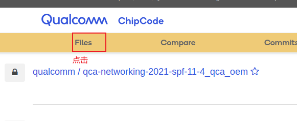
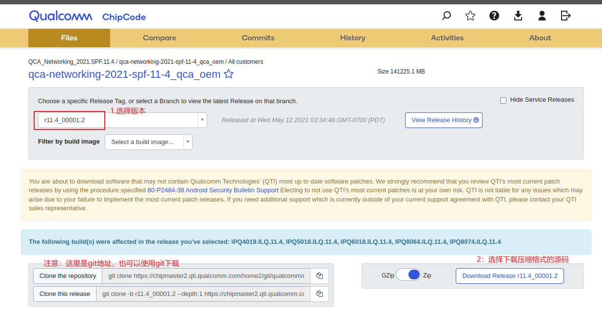
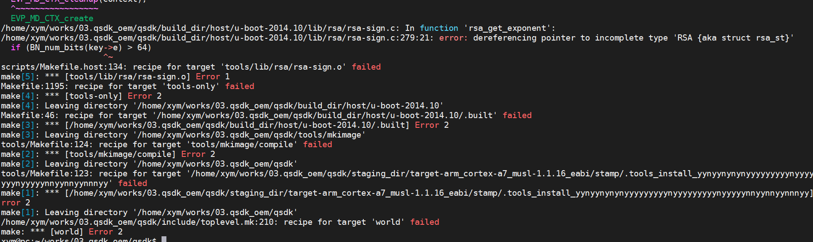
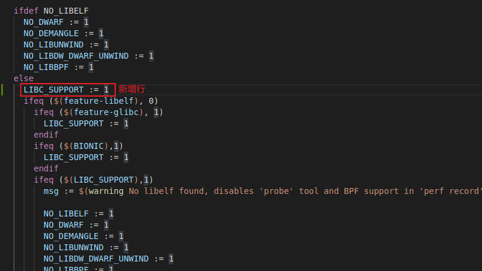

# 高通QSDK 环境搭建

编译环境依賴

```bash
sudo apt-get install gcc g++ binutils patch bzip2 flex make gettext pkg-config unzip zlib1g-dev libc6-dev subversion libncurses5-dev gawk sharutils curl libxml-parser-perl python-yaml ocaml-nox ocaml ocaml-findlib libssl-dev libfdt-dev repo

sudo apt-get install  u-boot-tools libssl1.0-dev libaudit-dev libgtk2.0-dev
sudo apt-get install  device-tree-compiler libfdt-dev libc6-i386 libgl1-mesa-dri:i386
```


## 资源下载

1. 网页打开高通官网

   ```
   https://chipcode.qti.qualcomm.com/
   ```

   - 步骤1

     

   - 步骤2

     

   - 步骤3

     

   - 

   

2. 下载好的固件【qca-networking-2021-spf-11-4_qca_oem-r11.4】

   - 解压

     ```bash
     uzip qca-networking-2021-spf-11-4_qca_oem-r11.4_00001.2-577c95df9cd76fb4757e70eb609b4754089e5167.zip
     ```

     

   - 刪除掉无用的文件 拷贝文件到上级目录

     ```bash
     cd qca-networking-2021-spf-11-4_qca_oem-r11.4_00001.2-577c95df9cd76fb4757e70eb609b4754089e5167
     
     rm -rf BOOT.AK.1.0 BOOT.BF.3.* IPQ8064.ILQ* IPQ4019.ILQ* IPQ8074.ILQ* RPM.AK.1.0 TZ.AK.1.0 TZ.BF.2.7 TZ.BF.4.0.8 WIGIG.TLN* BOOT.BF.3.3.1.1 TZ.WNS.4.0 IPQ5018.ILQ.11.* BTFW.MAPLE.1.0.0 WIGIG.TLN.7.5
     
     cp -rf */* .
     ```

     

   - 执行repo init

     ```bash
     repo init -u git://codeaurora.org/quic/qsdk/releases/manifest/qstak -b release -m caf_AU_LINUX_QSDK_NHSS.QSDK.11.4_TARGET_ALL.11.4.6938.7021.xml
     
     #如果上面命令出错 执行下面的
     repo init -u git://codeaurora.org/quic/qsdk/releases/manifest/qstak -b release -m caf_AU_LINUX_QSDK_NHSS.QSDK.11.4_TARGET_ALL.11.4.6938.7021.xml --repo-url=git://codeaurora.org/tools/repo.git --repo-branch=caf-stable
     
     
     
     repo sync -j8 --no-tags -qc
     ```

     备注：需要自行安装repo和全局的git配置

     ```bash
     sudo apt-get install repo
     
     git config --global user.email "you@example.com"
     git config --global user.name "youname"
     ```

3. 执行完后，到此资源下载完毕

## 编译

- 第一次编译

  直接执行下面一种即可

  ```bash
  ./wim_rebuild.sh LM256		# 编译小内存256M
  # 或者
  ./wim_rebuild.sh LM512		# 编译大内存512M
  # 或者
  ./wim_rebuild.sh P 32       # 编译Premium 32bit
  # 或者
  ./wim_rebuild.sh P 64       # 编译Premium 64bit
  # 或者
  ./wim_rebuild.sh E 32       # 编译Enterprise 32bit
  # 或者
  ./wim_rebuild.sh E 64       # 编译Enterprise 64bit
  ```

  生成的固件目录

  ```bash
  qsdk/bin/ipq/
  ```

  

  脚本【`wim_rebuild.sh`】内容如下：

  ```bash
  #!/bin/bash
  
  CHIP_CODE_DIR=$(cd $(dirname $0) && pwd)
  
  QSDK_BUILD_TYPE="NULL"
  QSDK_BUILD_BIT=32
  
  function usage()
  {
      echo "usage"
      echo -e " [P|E|LM256|LM512] [32|64 ]"
   	echo -e " notice LM256 and LM512 only 32 bit"
  }
  
  function qsdk_generating()
  {
  	
  	echo "######################## qsdk_generating ##############################"
  	sleep 1s
  	cd $CHIP_CODE_DIR
  	cp -rf apss_proc/out/proprietary/Wifi/qsdk-ieee1905-security/* qsdk
  	cp -rf apss_proc/out/proprietary/Wifi/qsdk-qca-art/* qsdk
  	cp -rf apss_proc/out/proprietary/Wifi/qsdk-qca-wifi/* qsdk
  	cp -rf apss_proc/out/proprietary/Wifi/qsdk-qca-wlan/* qsdk
  	cp -rf wlan_proc/src/components/qca-wifi-fw-src-component-cmn-WLAN.HK.* qsdk/dl/
  	cp -rf wlan_proc/pkg/wlan_proc/bin/QCA6018/qca-wifi-fw-QCA6018_v1.0-WLAN.HK.* qsdk/dl/
  	tar xvf cnss_proc/src/components/qca-wifi-fw-src-component-cmn-WLAN.BL.*.tgz -C qsdk/dl
  	tar xvf cnss_proc/src/components/qca-wifi-fw-src-component-halphy_tools-WLAN.BL.*.tgz -C qsdk/dl
  	cp -rf cnss_proc/src/components/* qsdk/dl
  	cp -rf cnss_proc/bin/QCA9888/hw.2/* qsdk/dl
  	cp -rf cnss_proc/bin/AR900B/hw.2/* qsdk/dl
  	cp -rf cnss_proc/bin/QCA9984/hw.1/* qsdk/dl
  	cp -rf cnss_proc/bin/IPQ4019/hw.1/* qsdk/dl
  	cp -rf qca-wifi-fw-AR988* qsdk/dl
  	cp -rf apss_proc/out/proprietary/QSDK-Base/meta-tools/ qsdk
  	cp -rf apss_proc/out/proprietary/QSDK-Base/common-tools/* qsdk/
  	cp -rf apss_proc/out/proprietary/QSDK-Base/qsdk-qca-nss/* qsdk/
  	cp -rf apss_proc/out/proprietary/QSDK-Base/qca-lib/* qsdk/
  	cp -rf apss_proc/out/proprietary/QSDK-Base/qca-mcs-apps/* qsdk
  	cp -rf apss_proc/out/proprietary/QSDK-Base/qca-nss-userspace/* qsdk
  	cp -rf apss_proc/out/proprietary/QSDK-Base/qca-time-services/* qsdk
  	cp -rf apss_proc/out/proprietary/QSDK-Base/qca-qmi-framework/* qsdk
  	cp -rf apss_proc/out/proprietary/QSDK-Base/gpio-debug/* qsdk
  	cp -rf apss_proc/out/proprietary/QSDK-Base/qca-diag/* qsdk
  	cp -rf apss_proc/out/proprietary/QSDK-Base/athtestcmd/* qsdk
  	cp -rf apss_proc/out/proprietary/QSDK-Base/btdaemon/* qsdk
  	cp -rf apss_proc/out/proprietary/QSDK-Base/minidump/* qsdk
  	tar xjvf apss_proc/out/proprietary/QSDK-Base/qca-IOT/qca-IOT.tar.bz2 -C qsdk
  	cp -rf apss_proc/out/proprietary/QSDK-Base/qca-cnss-daemon/* qsdk
  	cp -rf apss_proc/out/proprietary/QSDK-Base/fw-qca-stats/* qsdk
  	cp apss_proc/out/proprietary/QSDK-Base/qca-nss-fw-eip-cp/BIN-EIP197.CP.* qsdk/dl/
  	sed -i '/QCAHKSWPL_SILICONZ/c\PKG_VERSION:=WLAN.HK.2.5.r4-00622-QCAHKSWPL_SILICONZ-1' qsdk/qca/feeds/qca-cp/net/qca-cyp/Makefile
  	cp -rf apss_proc/out/proprietary/BLUETOPIA/qca-bluetopia/* qsdk
  }
  
  
  function qsdk_where_ipq()
  {
  	echo "######################## qsdk_where_ipq ##############################"
  	sleep 1s
  
  	cd $CHIP_CODE_DIR
  	if [ QSDK_BUILD_TYPE == "E" ];then
  		cp apss_proc/out/proprietary/RBIN-NSS-ENTERPRISE/BIN-NSS.CP* qsdk/dl/
  	else
  		cp apss_proc/out/proprietary/RBIN-NSS-RETAIL/BIN-NSS.CP* qsdk/dl/
  	fi
  }
  
  
  function qsdk_customers_hy_fi_whc_wapid_or_dut_packages()
  {
  	echo "######################## hy_fi null ##############################"
  	sleep 1s
  	
  	cd $CHIP_CODE_DIR/qsdk
  	
  	#######Premium/ LM  HY-FI #######
  	cp -rf apss_proc/out/proprietary/Hyfi/hyfi/* qsdk
  	
  	
  	########## Premium/ LM WHC ###########
  	
  	cp -rf apss_proc/out/proprietary/Wifi/qsdk-whc/* qsdk
  	mkdir qsdk/qca/feeds/qca-son-mem-debug/qca-son-mem-debug
  	mv qsdk/qca/feeds/qca-son-mem-debug/Makefile qsdk/qca/feeds/qca-son-mem-debug/Config.in qsdk/qca/feeds/qca-son-mem-debug/qca-son-mem-debug
  	cp -rf apss_proc/out/proprietary/Wifi/qsdk-whcpy/* qsdk
  	
  	# todo
  	########## Premium/ WAPid ###########
  	#git clone <wapid ChipCode directory>
  	#cd <wapid ChipCode directory>
  	#git checkout r11.4_00001.2
  	#cd ..
  	#cp -rf <wapid ChipCode directory>/NHSS.QSDK.11.4/apss_proc/out/proprietary/Wapid/qsdk-wapid/* qsdk
  }
  
  function qsdk_update_feeds()
  {
  	echo "######################## qsdk_update_feeds##############################"
  	sleep 1s
  
  	cd $CHIP_CODE_DIR/qsdk
  	./scripts/feeds update -a
  	./scripts/feeds install -a -f
  }
  function qsdk_base_configuration()
  {
  	echo "######################## qsdk_base_configuration ##############################"
  	sleep 1s
  
  	cd $CHIP_CODE_DIR/qsdk
  
  	if [ $QSDK_BUILD_TYPE == "P" ];then
  		if [ $QSDK_BUILD_BIT -eq 32 ];then	
  			cp qca/configs/qsdk/ipq_premium.config .config 
  			sed -i "s/TARGET_ipq_ipq806x/TARGET_ipq_ipq60xx/g" .config 
  			sed -i "s/CONFIG_PACKAGE_qal/#CONFIG_PACKAGE_qal/g" .config 
  			mv prebuilt/ipq60xx/ipq_premium/* prebuilt/ipq60xx/
  		elif [ $QSDK_BUILD_BIT -eq 64 ];then
  			cp qca/configs/qsdk/ipq_premium.config .config 
  			sed -i "s/TARGET_ipq_ipq806x/TARGET_ipq_ipq60xx_64/g" .config 
  			sed -i "s/CONFIG_PACKAGE_qal/#CONFIG_PACKAGE_qal/g" .config 
  			mv prebuilt/ipq60xx_64/ipq_premium/* prebuilt/ipq60xx_64/
  		fi
  	elif [ $QSDK_BUILD_TYPE == "E" ];then
  		if [ $QSDK_BUILD_BIT -eq 32 ];then
  			cp qca/configs/qsdk/ipq_enterprise.config .config 
  			sed -i "s/TARGET_ipq_ipq806x/TARGET_ipq_ipq60xx/g" .config 
  			mv prebuilt/ipq60xx/ipq_enterprise/* prebuilt/ipq60xx/
  		elif [ $QSDK_BUILD_BIT -eq 64 ];then
  			cp qca/configs/qsdk/ipq_enterprise.config .config 
  			sed -i "s/TARGET_ipq_ipq806x/TARGET_ipq_ipq60xx_64/g" .config 
  			mv prebuilt/ipq60xx_64/ipq_enterprise/* prebuilt/ipq60xx_64/
  		fi
  	elif [ $QSDK_BUILD_TYPE == "LM256" ];then
  		cp qca/configs/qsdk/ipq_256.config .config 
  		sed -i "s/TARGET_ipq_ipq807x/TARGET_ipq_ipq60xx/g" .config 
  		mv prebuilt/ipq60xx/ipq_256/* prebuilt/ipq60xx/
  	elif [ $QSDK_BUILD_TYPE == "LM512" ];then
  		cp qca/configs/qsdk/ipq_512.config .config 
  		sed -i "s/TARGET_ipq_ipq807x/TARGET_ipq_ipq60xx/g" .config
  		mv prebuilt/ipq60xx/ipq_512/* prebuilt/ipq60xx/
  	fi
  
  }
  
  
  
  function qsdk_son_package()
  {
  	echo "######################## qsdk_son_package ##############################"
  	sleep 1s
  
  	cd $CHIP_CODE_DIR/qsdk
  	echo "CONFIG_PACKAGE_whc-mesh=n" >> .config
  	echo "CONFIG_PACKAGE_hyfi-mesh=n" >> .config
  	echo "CONFIG_PACKAGE_whc-son=y" >> .config
  	echo "CONFIG_PACKAGE_hyfi-son=y" >> .config
  	echo "CONFIG_PACKAGE_qca-ezmesh-cmn=n" >> .config
  	echo "CONFIG_PACKAGE_qca-ezmesh=n" >> .config
  	echo "CONFIG_PACKAGE_qca-ezmesh-alg=n" >> .config
  	echo "CONFIG_PACKAGE_qca-ezmesh-ctrl=n" >> .config
  	echo "CONFIG_PACKAGE_qca-ezmesh-agent=n" >> .config
  	echo "CONFIG_PACKAGE_qca-ezmesh-agentalg=n" >> .config
  	sed -i "s/@PACKAGE_whc-son/@PACKAGE_whc-map/g" package/feeds/qca_lib/qca-wifison-ext-lib/Makefile
  }
  
  
  function qsdk_ezmesh_package_full_mode()
  {
  	echo "######################## qsdk_ezmesh_package_full_mode ##############################"
  	sleep 1s
  
  	cd $CHIP_CODE_DIR/qsdk
  	echo "CONFIG_PACKAGE_whc-mesh=n" >> .config
  	echo "CONFIG_PACKAGE_hyfi-mesh=n" >> .config
  	echo "CONFIG_PACKAGE_whc-map=y" >> .config
  	echo "CONFIG_PACKAGE_hyfi-map=y" >> .config
  	#Additional configuration to enable ezmesh packages:
  	echo "CONFIG_PACKAGE_qca-ezmesh-cmn=y" >> .config
  	echo "CONFIG_PACKAGE_qca-ezmesh=y" >> .config
  	echo "CONFIG_PACKAGE_qca-ezmesh-alg=y" >> .config
  	echo "CONFIG_PACKAGE_qca-ezmesh-ctrl=n" >> .config
  	echo "CONFIG_PACKAGE_qca-ezmesh-agent=n" >> .config
  	echo "CONFIG_PACKAGE_qca-ezmesh-agentalg=n" >> .config
  	sed -i "s/@PACKAGE_whc-son/@PACKAGE_whc-map/g" package/feeds/qca_lib/qca-wifison-ext-lib/Makefile
  }
  function qsdk_ezmesh_package_co_locater_mode()
  {
  	echo "######################## qsdk_ezmesh_package_co_locater_mode ##############################"
  	sleep 1s
  
  	cd $CHIP_CODE_DIR/qsdk
  	echo "CONFIG_PACKAGE_whc-mesh=n" >> .config
  	echo "CONFIG_PACKAGE_hyfi-mesh=n" >> .config
  	echo "CONFIG_PACKAGE_whc-map=y" >> .config
  	echo "CONFIG_PACKAGE_hyfi-map=y" >> .config
  	#Additional configuration to enable ezmesh packages:
  	echo "CONFIG_PACKAGE_qca-ezmesh-cmn=y" >> .config
  	echo "CONFIG_PACKAGE_qca-ezmesh-ctrl=y" >> .config
  	echo "CONFIG_PACKAGE_qca-ezmesh-agent=y" >> .config
  	echo "CONFIG_PACKAGE_qca-ezmesh-alg=y" >> .config
  	echo "CONFIG_PACKAGE_qca-ezmesh-agentalg=y" >> .config
  	echo "CONFIG_PACKAGE_qca-ezmesh=n" >> .config
  	sed -i "s/@PACKAGE_whc-son/@PACKAGE_whc-map/g" package/feeds/qca_lib/qca-wifison-ext-lib/Makefile
  }
  
  function qsdk_son_ezmesh_package_full_mode()
  {
  	echo "######################## qsdk_son_ezmesh_package_full_mode ##############################"
  	sleep 1s
  
  	cd $CHIP_CODE_DIR/qsdk
  	echo "CONFIG_PACKAGE_whc-mesh=y" >> .config
  	echo "CONFIG_PACKAGE_hyfi-mesh=y" >> .config
  	#Additional configuration to enable ezmesh packages:
  	echo "CONFIG_PACKAGE_qca-ezmesh-cmn=y" >> .config
  	echo "CONFIG_PACKAGE_qca-ezmesh=y" >> .config
  	echo "CONFIG_PACKAGE_qca-ezmesh-alg=y" >> .config
  }
  
  
  
  
  
  
  function qsdk_build_env_check()
  {
  	if [ $# -eq 0 ]
  		then
  		usage
  		return -1
  	fi
  
  	if [ $1 == "P" ];then
  		if [ $# -ne 2 ];then
  			echo -e "please input P 32 or P 64 "
  			return -2
  		fi
  
  		if [ $2 -eq 32 ];then
  			QSDK_BUILD_TYPE="P"
  			QSDK_BUILD_BIT=32
  		elif [ $2 -eq 64 ];then
  			QSDK_BUILD_TYPE="P"
  			QSDK_BUILD_BIT=64
  		else
  			echo -e "please input P 32 or P 64 "
  			return -3
  		fi
  	elif [ $1 == "E" ];then
  		if [ $# -ne 2 ];then
  			echo -e "please input E 32 or E 64 "
  			return -2
  		fi
  		if [ $2 -eq 32 ];then
  			QSDK_BUILD_TYPE="E"
  			QSDK_BUILD_BIT=32
  		elif [ $2 -eq 64 ];then
  			QSDK_BUILD_TYPE="E"
  			QSDK_BUILD_BIT=64
  		else
  			echo -e "please input E 32 or E 64 "
  			return -3
  		fi
  	elif [ $1 == "LM256" ];then
  			QSDK_BUILD_TYPE="LM256"
  	elif [ $1 == "LM512" ];then
  			QSDK_BUILD_TYPE="LM512"
  	else
  		usage
  		return -4
  	fi
  
  	echo "QSDK_BUILD_TYPE=$QSDK_BUILD_TYPE"
  	echo "QSDK_BUILD_BIT=$QSDK_BUILD_BIT"
  	return 0
  }
  
  
  
  
  function qsdk_build_start()
  {
  	qsdk_build_env_check $1 $2
  	if [ $? -ne 0 ];then
  		echo -e "build error"
  		exit 
  	fi
  
      cd $CHIP_CODE_DIR/qsdk
  	make clean
  	cd $CHIP_CODE_DIR
  
  	qsdk_generating
  	qsdk_where_ipq
  	qsdk_customers_hy_fi_whc_wapid_or_dut_packages
  	qsdk_update_feeds
  	qsdk_base_configuration
  	qsdk_son_package
  	#qsdk_ezmesh_package_full_mode
  	#qsdk_ezmesh_package_co_locater_mode
  	#qsdk_son_ezmesh_package_full_mode
  	
  	make defconfig 
  	make V=s
  }
  
  qsdk_build_start $1 $2
  
   
   
  
  
  ```

  

- 第二次编译

  无需在再次执行脚本，直接进入qsdk目录编译即可

  ```
  cd qsdk
  make -j6 V=s 
  ```

- 可能遇见的编译问题

  - openssl版本问题

    

    解决如下：

    ```
    sudo apt install libssl1.0-dev
    ```

    

  - libelf编译出错

    修改【`qsdk/qca/src/linux-4.4/tools/perf/config/Makefile`】文件如下

    

    然后执行

    ```bash
    make clean 
    make -j1 V=s
    ```

    

## 打包

- 整个镜像打包

  ```bash
  # 下面命令执行一个，要和上面编译的时候对应
  
  ./wim_pack_single_image.sh LM256
  ./wim_pack_single_image.sh LM512
  ./wim_pack_single_image.sh E 32
  ./wim_pack_single_image.sh E 64
  ./wim_pack_single_image.sh P 32
  ./wim_pack_single_image.sh P 64
  ```

  最后生成的镜像路径如下`common/build/bin`

  ```
  xym@pc:~/works/01.qsdk/QSDK_r11.4_1.2/common/build/bin$ ls -lht
  total 356M
  -rw-rw-r-- 1 xym xym 23M 7月  28 11:05 nor-ipq6018-apps.img
  -rw-rw-r-- 1 xym xym 25M 7月  28 11:05 nor-ipq6018-single.img
  -rw-rw-r-- 1 xym xym 23M 7月  28 11:05 norplusemmc-ipq6018-apps.img
  -rw-rw-r-- 1 xym xym 26M 7月  28 11:05 norplusemmc-ipq6018-single.img
  -rw-rw-r-- 1 xym xym 23M 7月  28 11:05 emmc-ipq6018-apps.img
  -rw-rw-r-- 1 xym xym 26M 7月  28 11:05 emmc-ipq6018-single.img
  -rw-rw-r-- 1 xym xym 26M 7月  28 11:05 norplusnand-4k-ipq6018-apps.img
  -rw-rw-r-- 1 xym xym 26M 7月  28 11:05 norplusnand-ipq6018-apps.img
  -rw-rw-r-- 1 xym xym 29M 7月  28 11:05 norplusnand-4k-ipq6018-single.img
  -rw-rw-r-- 1 xym xym 28M 7月  28 11:04 norplusnand-ipq6018-single.img
  -rw-rw-r-- 1 xym xym 26M 7月  28 11:04 nand-4k-ipq6018-apps.img
  -rw-rw-r-- 1 xym xym 26M 7月  28 11:04 nand-ipq6018-apps.img
  -rw-rw-r-- 1 xym xym 29M 7月  28 11:04 nand-4k-ipq6018-single.img
  -rw-rw-r-- 1 xym xym 29M 7月  28 11:04 nand-ipq6018-single.img
  
  ```

  我們最终用的固件如下：

  - `nand-ipq6018-single.img` 包含所有分内容
  - `nand-ipq6018-apps.img`：文件系统部分kernel rootfs

  

  脚本【`wim_pack_single_image.sh`】内容如下：

  ```bash
  #!/bin/bash
  
  CHIP_CODE_DIR=$(cd $(dirname $0) && pwd)
  
  LOCAL_BLD_ENV_BUILD_ID="LM256"
  LOCAL_QSDK_BUILD_BIT=32
  
  function pack_32()
  {
  	mkdir -p common/build/ipq
  	mkdir -p apss_proc/out/meta-scripts
  	cp qsdk/qca/src/u-boot-2016/tools/pack.py apss_proc/out/meta-scripts/pack_hk.py
  	#sed -i 's#</linux_root_path>#/</linux_root_path>#' contents.xml   
  	#sed -i 's#</windows_root_path>#\\</windows_root_path>#' contents.xml
  	cp qsdk/bin/ipq/openwrt* common/build/ipq
  	cp -r apss_proc/out/proprietary/QSDK-Base/meta-tools apss_proc/out/
  	cp -rf qsdk/bin/ipq/dtbs/* common/build/ipq/
  	cp -rf skales/* common/build/ipq/
  	cp -rf wlan_proc/build/ms/bin/FW_IMAGES/* common/build/ipq/
  	cp qsdk/staging_dir/host/bin/ubinize common/build/ipq/
  	cd common/build
  	sed '/debug/d;/packages/d;/"ipq6018_64"/d;/t32/d;/ret_prep_64image/d;/Required/d; /skales/d;/nosmmu/d;/os.system(cmd)/d;/os.chdir(ipq_dir)/d;/atfdir/d;/noac/d;/single-atf/d;/bl31.mbn/d;/ret_pack_64image/d;/ret_pack_apps_64image/d;/64image/d' -i update_common_info.py
  		 
  	#E, P, LM256, or LM512
  	
  	export BLD_ENV_BUILD_ID=$LOCAL_BLD_ENV_BUILD_ID 
  
  	python update_common_info.py
  
  
  }
  
  
  function pack_64()
  {
  	cd  $CHIP_CODE_DIR
  	mkdir -p common/build/ipq_x64
  	mkdir -p apss_proc/out/meta-scripts
  	cp qsdk/qca/src/u-boot-2016/tools/pack.py apss_proc/out/meta-scripts/pack_hk.py
  	sed -i 's#</linux_root_path>#/</linux_root_path>#' contents.xml
  	sed -i 's#</windows_root_path>#\\</windows_root_path>#' contents.xml
  	cp qsdk/bin/ipq/openwrt* common/build/ipq_x64
  	#copy the saved openwrt-ipq6018-u-boot*.elf from the 32-bit build to: common/build/ipq_x64
  	cp -r apss_proc/out/proprietary/QSDK-Base/meta-tools apss_proc/out/
  	cp -rf qsdk/bin/ipq/dtbs/* common/build/ipq_x64/
  	cp -rf skales/* common/build/ipq_x64/
  	cp -rf wlan_proc/build/ms/bin/FW_IMAGES/* common/build/ipq_x64
  	cp qsdk/staging_dir/host/bin/ubinize common/build/ipq_x64
  	cd common/build
  	sed -i 's/\.\/ipq/\.\/ipq_x64/g' update_common_info.py
  	sed -i 's/\.\/ipq_x64_x64/\.\/ipq_x64/g' update_common_info.py
  	sed '/debug/d;/packages/d;/"ipq6018"/d;/t32/d;/ret_prep_32image/d;/Required/d;/nosmmu/d;/os.system(cmd)/d;/skales/d;/os.chdir(ipq_dir)/d;/atfdir/d;/noac/d;/single-atf/d;/bl31.mbn/d;/ret_pack_32image/d;/ret_pack_apps_32image/d;/32image/d' -i update_common_info.py
  
  	export BLD_ENV_BUILD_ID=$LOCAL_BLD_ENV_BUILD_ID 
  	python update_common_info.py
  }
  
  function usage()
  {
      echo "usage"
      echo -e " [P|E|LM256|LM512] [32|64 ]"
   	echo -e " notice LM256 and LM512 only 32 bit"
  }
  
  
  
  
  
  
  if [ $# -eq 0 ]
      then
      usage
      exit
  fi   
  
  if [ $1 == "E" ]||[ $1 == "P" ];then
  	if [ $# -ne 2 ]
  		then
  		usage
  		exit
  	fi 
  	
  	if [ $2 -eq 32 ];then
  		LOCAL_BLD_ENV_BUILD_ID=$1
  		LOCAL_QSDK_BUILD_BIT=32
  	elif [ $2 -eq 64 ];then
  		LOCAL_BLD_ENV_BUILD_ID=$1
  		LOCAL_QSDK_BUILD_BIT=64
  	else
  		usage
  		exit
  	fi
  else
  	if [ $1 == "LM256" ] || [ $1 == "LM512" ];then
  		LOCAL_BLD_ENV_BUILD_ID=$1
  		LOCAL_QSDK_BUILD_BIT=32
  	else
  		usage
  		exit
  	fi
  
  fi
  
  echo "***********************packing ipq6018 image start***********************"
  
  echo "LOCAL_BLD_ENV_BUILD_ID=$LOCAL_BLD_ENV_BUILD_ID"
  echo "LOCAL_QSDK_BUILD_BIT  =$LOCAL_QSDK_BUILD_BIT"
  echo "qsdk chip code dir : $CHIP_CODE_DIR"
  cd   $CHIP_CODE_DIR
  
  rm common/build/ipq -rf
  rm apss_proc/out/meta-scripts -rf
  
  if [ $LOCAL_QSDK_BUILD_BIT -eq 32 ];then
  	pack_32
  else
  	pack_64
  fi
  
  sudo cp $CHIP_CODE_DIR/common/build/bin/nand-ipq6018-single.img ~/tftpboot -f
  ls ~/tftpboot/*single.img -l
  	
  echo "***********************packing ipq6018 image end***********************"
  
  
  ```

  

- `wifi_fw`单独打包

  ```bash
  ./wim_pack_wifi_fw.sh
  ```

  脚本【wim_pack_wifi_fw.sh】内容如下

  ```bash
  #!/bin/bash
  
  CHIP_CODE_DIR=$(cd $(dirname $0) && pwd)
  echo "qsdk chip code dir : $CHIP_CODE_DIR"
  echo "***********************packing wifi_fw start***********************"
  cd   $CHIP_CODE_DIR
  rm   fwtemp -rf
  mkdir -p fwtemp
  cp -rfv wlan_proc/pkg/wlan_proc/bin/QCA6018/qca-wifi-fw-QCA6018_v1.0-WLAN.HK.*.tar.bz2 fwtemp
  cd fwtemp
  tar -xvf qca-wifi-fw-QCA6018_v1.0-WLAN.HK.*.tar.bz2
  
  rm   staging_dir -rf
  mkdir staging_dir
  cp -rfv qca-wifi-fw-WLAN.HK.*/PIL_IMAGES/* staging_dir
  cp -rfv qca-wifi-fw-WLAN.HK.*/bdwlan* staging_dir
  cp $CHIP_CODE_DIR/common/build/mksquashfs4 ./ -f
  rm wifi_fw_squashfs.img wifi_fw.squashfs -f
  ./mksquashfs4 staging_dir/ wifi_fw.squashfs -nopad -noappend -root-owned -comp xz -Xpreset 9 -Xe -Xlc 0 -Xlp 2 -Xpb 2 -Xbcj arm -b 256k -processors 1
  
  dd if=wifi_fw.squashfs of=wifi_fw_squashfs.img bs=2k conv=sync
  sudo cp wifi_fw_squashfs.img ~/tftpboot/ -f
  
  ls ~/tftpboot/wifi_fw_squashfs.img -l
  
  echo "***********************packing wifi_fw end***********************"
  
  ```


## 下载

### 整个镜像文件下载

```bash
set ipaddr 192.168.1.11
set serverip 192.168.1.xx
ping ${serverip}
set bootargs console=ttyMSM0,115200n8

tftpboot nand-ipq6018-single.img
imgaddr=$fileaddr && source $imgaddr:script
```

注意：需要自己提前拷貝目標镜像文件到tftp服务器

### mtd16分区(rootfs)单独下载

使用网页更新`nand-ipq6018-apps.img`

### FW_WIFI 固件单独下载

```bash
tftpboot wifi_fw_squashfs.img
flash wifi_fw
```

### ipk软件安装

需要安裝的软件需要手动拷贝到硬件的`/tmp`目录下

1. bluetopia 安装

   - 32bit 软件包位置`qsdk/prebuilt/ipq60xx/bluetopia_4.2.1.c1_13-1_ipq.ipk` 
   - 64bit 软件包位置 `qsdk/prebuilt/ipq60xx_64/bluetopia_4.2.1.c1_13-1_ipq.ipk`

   自行拷贝到板子的`/tmp`目录下安装

   ```
   opkg install bluetopia_4.2.1.c1_13-1_ipq.ipk
   ```

2. SON package安装

   - 32bit  软件包位置

     ```bash
     qsdk/prebuilt/ipq60xx/qca-hyd-init_ge474d2e-1_ipq.ipk
     qsdk/prebuilt/ipq60xx/qca-hyd-son_ge474d2e-1_ipq.ipk
     ```

   - 64bit 软件包位置

     ```bash
     qsdk/prebuilt/ipq60xx_64/qca-hyd-init_ge474d2e-1_ipq.ipk
     qsdk/prebuilt/ipq60xx_64/qca-hyd-son_ge474d2e-1_ipq.ipk
     ```

   自行拷贝到板子的`/tmp`目录下安装

   ```bash
   opkg install qca-hyd-init_ge474d2e-1_ipq.ipk
   opkg install qca-hyd-son_ge474d2e-1_ipq.ipk
   ```

3. EZMESH package 安装

   - 32bit 软件包位置

     ```
     # To support Full mode:
     qsdk/prebuilt/ipq60xx/qca-ezmesh-cmn_ge474d2e-1_ipq.ipk
     qsdk/prebuilt/ipq60xx/qca-ezmesh_ge474d2e-1_ipq.ipk
     qsdk/prebuilt/ipq60xx/qca-ezmesh-alg_ge474d2e-1_ipq.ipk
     
     # To support Co-located mode:
     qsdk/prebuilt/ipq60xx/qca-ezmesh-cmn_ge474d2e-1_ipq.ipk 
     qsdk/prebuilt/ipq60xx/qca-ezmesh-ctrl_ge474d2e-1_ipq.ipk
     qsdk/prebuilt/ipq60xx/qca-ezmesh-agent_ge474d2e-1_ipq.ipk
     qsdk/prebuilt/ipq60xx/qca-ezmesh-alg_ge474d2e-1_ipq.ipk
     qsdk/prebuilt/ipq60xx/qca-ezmesh-agentalg_ge474d2e-1_ipq.ipk
     ```

   - 64bit 软件包位置

     ```bash
     # To support Full mode:
     qsdk/prebuilt/ipq60xx_64/qca-ezmesh-cmn_ge474d2e-1_ipq.ipk
     qsdk/prebuilt/ipq60xx_64/qca-ezmesh_ge474d2e-1_ipq.ipk
     qsdk/prebuilt/ipq60xx_64/qca-ezmesh-alg_ge474d2e-1_ipq.ipk
     
     # To support Co-located mode:
     qsdk/prebuilt/ipq60xx_64/qca-ezmesh-cmn_ge474d2e-1_ipq.ipk
     qsdk/prebuilt/ipq60xx_64/qca-ezmesh-ctrl_ge474d2e-1_ipq.ipk
     qsdk/prebuilt/ipq60xx_64/qca-ezmesh-agent_ge474d2e-1_ipq.ipk
     qsdk/prebuilt/ipq60xx_64/qca-ezmesh-alg_ge474d2e-1_ipq.ipk
     qsdk/prebuilt/ipq60xx_64/qca-ezmesh-agentalg_ge474d2e-1_ipq.ipk
     ```

   自行拷贝到板子的`/tmp`目录下安装

   ```bash
   # To support Full mode:
   opkg install qca-ezmesh-cmn_ge474d2e-1_ipq.ipk
   opkg install qca-ezmesh_ge474d2e-1_ipq.ipk
   opkg install qca-ezmesh-alg_ge474d2e-1_ipq.ipk
   
   # To support Co-located mode:
   opkg install qca-ezmesh-cmn_ge474d2e-1_ipq.ipk
   opkg install qca-ezmesh-ctrl_ge474d2e-1_ipq.ipk
   opkg install qca-ezmesh-agent_ge474d2e-1_ipq.ipk
   opkg install qca-ezmesh-alg_ge474d2e-1_ipq.ipk
   opkg install qca-ezmesh-agentalg_ge474d2e-1_ipq.ipk
   
   ```

   注意：ge474d2e 是git的提交id 有可能会不一样

4. 守护进程相关

   - SON package

     ```bash
     ln -s /usr/sbin/wsplcd-son /usr/sbin/wsplcd
     ln -s /usr/sbin/hyd-son /usr/sbin/hyd
     ```

   - EZMESH package

     ```bash
     ln -s /usr/sbin/wsplcd-map /usr/sbin/wsplcd
     ```

     

   


