# 高通QSDK 编译分析

## uboot说明

## Flash 布局

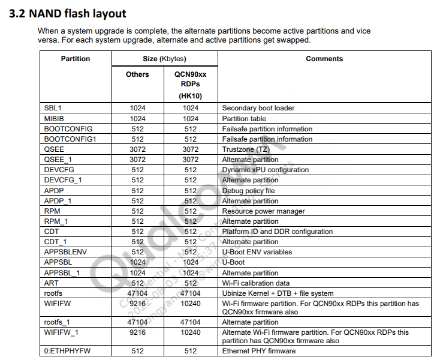

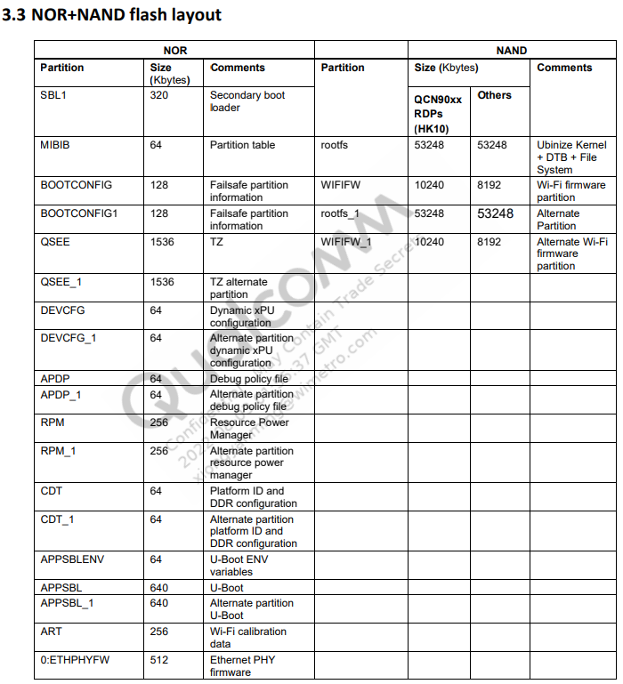

## DDR 布局

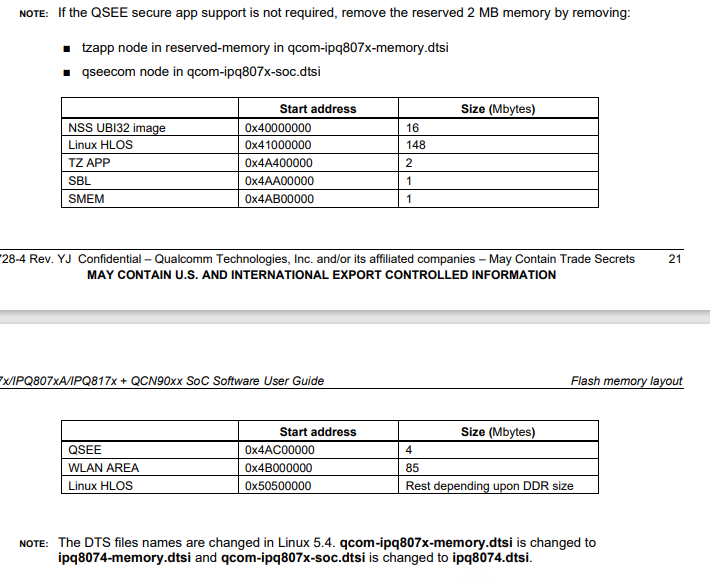

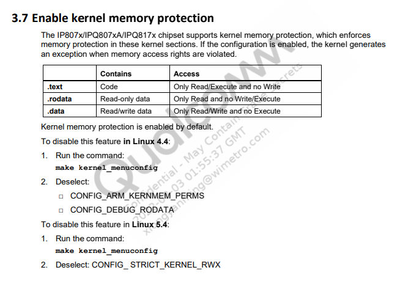

## 自定义flash分区

在`<chipcode>`目录下分别在下面的目录会看到分区表信息

1. `<chipcode>/apss_proc/out/proprietary/QSDK-Base/meta-tools/ipq6018/flash_partition`目录

   原始分区文件目录

2. `<chipcode>/apss_proc/out/meta-tools/ipq6018/flash_partition`目录

   在打包`single_image`执行`./wim_pack_single_image.sh`脚本时，拷贝【步骤1】中的内容到该目录下

3. `<chipcode>/qsdk/meta-tools/ipq6018/flash_partition/`

   在生成qsdk的时执行`./wim_rebuild.sh`时，拷贝【步骤1】中内容到该目录下

4. `<chipcode>/common/build/ipq/ipq6018/flash_partition`目录

   todo


生成系统分区镜像在`qsdk\meta-tools`目录下执行下面脚本生成不同的分区镜像

```bash
# --arch   架构 例如 ipq60xx ipq807x
# --fltype 存储类型例如 nor、nand、emmc、norplusnand、norplusemmc
# --in     Output directory where all individual images are copied for single image packing

# NOR 输出镜像路径为：common/build/ipq/nor-system-partition-ipq6018.bin
python prepareSingleImage.py --arch ipq60xx --fltype nor --genpart
--in /images/ipq

# NAND 输出镜像路径为：common/build/ipq/nand-system-partition-ipq6018.bin
python prepareSingleImage.py --arch ipq60xx --fltype nand --genpart
--in /images/ipq

# NOR+NAND 输出镜像路径为：common/build/ipq/norplusnand-system-partition-ipq6018.bin
python prepareSingleImage.py --arch ipq60xx --fltype norplusnand --genpart
--in /images/ipq

# NOR+emmc 输出镜像路径为：common/build/ipq/norplusemmc-system-partition-ipq6018.bin
python prepareSingleImage.py --arch ipq60xx --fltype norplusemmc --genpart
--in /images/ipq


```

### 生成更多的分区信息表

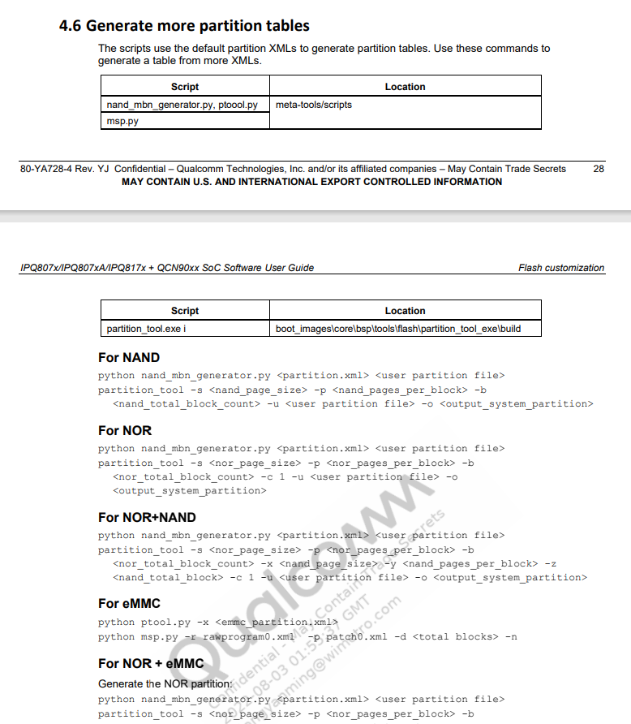

## 编译Single image


## 编译分析

1. 生成不带`initramfs`版本镜像

   - 用下面的命令生成压缩格式的镜像

     ```bash
     make -C /home/xym/works/01.qsdk/QSDK_r11.4_1.2/qsdk/build_dir/target-arm_cortex-a7_musl-1.1.16_eabi/linux-ipq_ipq60xx/linux-4.4.60 HOSTCFLAGS="-O2 -I/home/xym/works/01.qsdk/QSDK_r11.4_1.2/qsdk/staging_dir/host/include -I/home/xym/works/01.qsdk/QSDK_r11.4_1.2/qsdk/staging_dir/host/usr/include -Wall -Wmissing-prototypes -Wstrict-prototypes" CROSS_COMPILE="arm-openwrt-linux-muslgnueabi-" ARCH="arm" KBUILD_HAVE_NLS=no CONFIG_SHELL="bash" V='' CC="arm-openwrt-linux-muslgnueabi-gcc" zImage Image dtbs modules
     ```

     最終生成的镜像zImage和Image和dtbs路径在下面的目录：

     `qsdk/build_dir/target-arm_cortex-a7_musl-1.1.16_eabi/linux-ipq_ipq60xx/linux-4.4.60/arch/arm/boot/`

     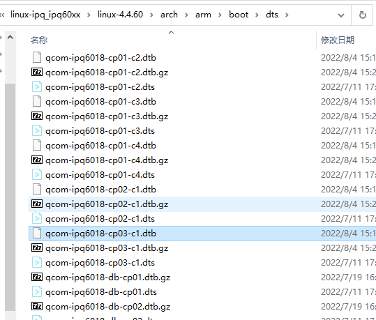

     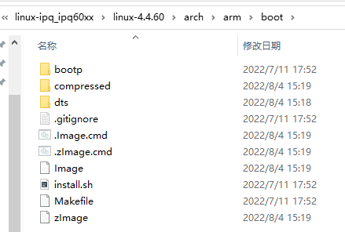

   - 拷贝镜像到`qsdk/build_dir/target-arm_cortex-a7_musl-1.1.16_eabi/linux-ipq_ipq60xx/`

     ```bash
     cp -fpR qsdk/build_dir/target-arm_cortex-a7_musl-1.1.16_eabi/linux-ipq_ipq60xx/linux-4.4.60/vmlinux 
     qsdk/build_dir/target-arm_cortex-a7_musl-1.1.16_eabi/linux-ipq_ipq60xx/vmlinux.debug
     
     cp -fpR qsdk/build_dir/target-arm_cortex-a7_musl-1.1.16_eabi/linux-ipq_ipq60xx/linux-4.4.60/arch/arm/boot//zImage 
     qsdk/build_dir/target-arm_cortex-a7_musl-1.1.16_eabi/linux-ipq_ipq60xx/zImage;   
     
     cp -fpR qsdk/build_dir/target-arm_cortex-a7_musl-1.1.16_eabi/linux-ipq_ipq60xx/linux-4.4.60/arch/arm/boot//Image 
     qsdk/build_dir/target-arm_cortex-a7_musl-1.1.16_eabi/linux-ipq_ipq60xx/Image;
     ```

     拷贝后

     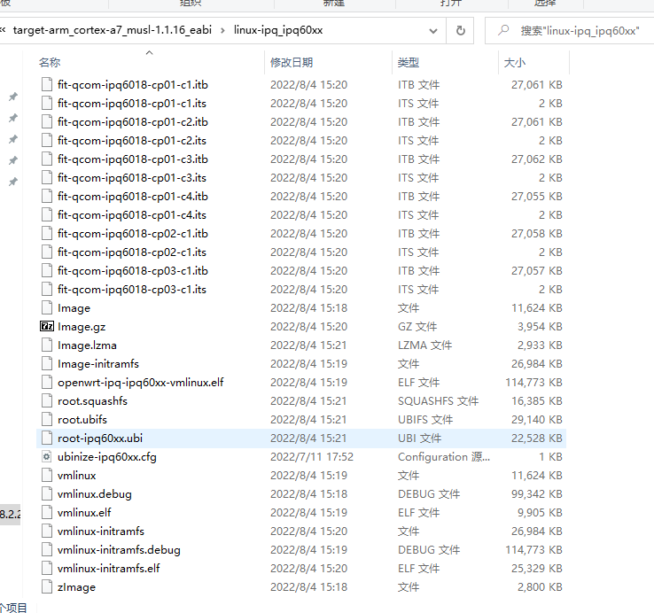

   - 备份内核配置

     ```bash
     mv qsdk/build_dir/target-arm_cortex-a7_musl-1.1.16_eabi/linux-ipq_ipq60xx/linux-4.4.60/.config 
     qsdk/build_dir/target-arm_cortex-a7_musl-1.1.16_eabi/linux-ipq_ipq60xx/linux-4.4.60/.config.old
     ```

     

   

   

2. 生成带`initramfs`的镜像

   - 修改内核配置

     ```bash
     echo 'CONFIG_INITRAMFS_SOURCE="qsdk/build_dir/target-arm_cortex-a7_musl-1.1.16_eabi/root-ipq qsdk/target/linux/generic/image/initramfs-base-files.txt"' 
     >> qsdk/build_dir/target-arm_cortex-a7_musl-1.1.16_eabi/linux-ipq_ipq60xx/linux-4.4.60/.config
     
     echo 'CONFIG_INITRAMFS_ROOT_UID=1001' 
     >> qsdk/build_dir/target-arm_cortex-a7_musl-1.1.16_eabi/linux-ipq_ipq60xx/linux-4.4.60/.config
     
     echo 'CONFIG_INITRAMFS_ROOT_GID=1001' 
     >> qsdk/build_dir/target-arm_cortex-a7_musl-1.1.16_eabi/linux-ipq_ipq60xx/linux-4.4.60/.config
     
     echo "# CONFIG_INITRAMFS_COMPRESSION_NONE is not set" 
     >> qsdk/build_dir/target-arm_cortex-a7_musl-1.1.16_eabi/linux-ipq_ipq60xx/linux-4.4.60/.config
     
     echo -e "# CONFIG_INITRAMFS_COMPRESSION_GZIP is not set\n# CONFIG_RD_GZIP is not set" 
     >> qsdk/build_dir/target-arm_cortex-a7_musl-1.1.16_eabi/linux-ipq_ipq60xx/linux-4.4.60/.config
     
     echo -e "# CONFIG_INITRAMFS_COMPRESSION_BZIP2 is not set\n# CONFIG_RD_BZIP2 is not set" 
     >> qsdk/build_dir/target-arm_cortex-a7_musl-1.1.16_eabi/linux-ipq_ipq60xx/linux-4.4.60/.config
     
     echo -e "CONFIG_INITRAMFS_COMPRESSION_LZMA=y\nCONFIG_RD_LZMA=y" 
     >> qsdk/build_dir/target-arm_cortex-a7_musl-1.1.16_eabi/linux-ipq_ipq60xx/linux-4.4.60/.config
     
     echo -e "# CONFIG_INITRAMFS_COMPRESSION_LZO is not set\n# CONFIG_RD_LZO is not set" 
     >> qsdk/build_dir/target-arm_cortex-a7_musl-1.1.16_eabi/linux-ipq_ipq60xx/linux-4.4.60/.config
     
     echo -e "# CONFIG_INITRAMFS_COMPRESSION_XZ is not set\n# CONFIG_RD_XZ is not set"
     >> qsdk/build_dir/target-arm_cortex-a7_musl-1.1.16_eabi/linux-ipq_ipq60xx/linux-4.4.60/.config
     
     echo -e "# CONFIG_INITRAMFS_COMPRESSION_LZ4 is not set\n# CONFIG_RD_LZ4 is not set" 
     >> qsdk/build_dir/target-arm_cortex-a7_musl-1.1.16_eabi/linux-ipq_ipq60xx/linux-4.4.60/.config
     
     
     #~~~~~~~~~~~~~~~~~~~~~~~~~省略N行~~~~~~~~~~~~~~~~~~~~~
     
     ```

     

   - 用下面的命令再次生成镜像

     ```bash
     make -C /home/xym/works/01.qsdk/QSDK_r11.4_1.2/qsdk/build_dir/target-arm_cortex-a7_musl-1.1.16_eabi/linux-ipq_ipq60xx/linux-4.4.60 HOSTCFLAGS="-O2 -I/home/xym/works/01.qsdk/QSDK_r11.4_1.2/qsdk/staging_dir/host/include -I/home/xym/works/01.qsdk/QSDK_r11.4_1.2/qsdk/staging_dir/host/usr/include -Wall -Wmissing-prototypes -Wstrict-prototypes" CROSS_COMPILE="arm-openwrt-linux-muslgnueabi-" ARCH="arm" KBUILD_HAVE_NLS=no CONFIG_SHELL="bash" V='' CC="arm-openwrt-linux-muslgnueabi-gcc" zImage Image dtbs modules
     ```

   - 拷贝镜像到`qsdk/build_dir/target-arm_cortex-a7_musl-1.1.16_eabi/linux-ipq_ipq60xx/`

     ```bash
     cp -fpR /home/xym/works/01.qsdk/QSDK_r11.4_1.2/qsdk/build_dir/target-arm_cortex-a7_musl-1.1.16_eabi/linux-ipq_ipq60xx/linux-4.4.60/vmlinux 
     /home/xym/works/01.qsdk/QSDK_r11.4_1.2/qsdk/build_dir/target-arm_cortex-a7_musl-1.1.16_eabi/linux-ipq_ipq60xx/vmlinux-initramfs.debug
     
     cp -fpR /home/xym/works/01.qsdk/QSDK_r11.4_1.2/qsdk/build_dir/target-arm_cortex-a7_musl-1.1.16_eabi/linux-ipq_ipq60xx/linux-4.4.60/arch/arm/boot//zImage
     /home/xym/works/01.qsdk/QSDK_r11.4_1.2/qsdk/build_dir/target-arm_cortex-a7_musl-1.1.16_eabi/linux-ipq_ipq60xx/zImage-initramfs;   
      
     cp -fpR /home/xym/works/01.qsdk/QSDK_r11.4_1.2/qsdk/build_dir/target-arm_cortex-a7_musl-1.1.16_eabi/linux-ipq_ipq60xx/linux-4.4.60/arch/arm/boot//Image 
     /home/xym/works/01.qsdk/QSDK_r11.4_1.2/qsdk/build_dir/target-arm_cortex-a7_musl-1.1.16_eabi/linux-ipq_ipq60xx/Image-initramfs;
     ```

     

3. 拷贝modules和安装modules到文件系统目录

   ```bash
   rm -rf /home/xym/works/01.qsdk/QSDK_r11.4_1.2/qsdk/build_dir/target-arm_cortex-a7_musl-1.1.16_eabi/linux-ipq_ipq60xx/debug
   
   mkdir -p /home/xym/works/01.qsdk/QSDK_r11.4_1.2/qsdk/build_dir/target-arm_cortex-a7_musl-1.1.16_eabi/linux-ipq_ipq60xx/debug/modules
   
   cp -fpR /home/xym/works/01.qsdk/QSDK_r11.4_1.2/qsdk/build_dir/target-arm_cortex-a7_musl-1.1.16_eabi/linux-ipq_ipq60xx/linux-4.4.60/vmlinux 
   /home/xym/works/01.qsdk/QSDK_r11.4_1.2/qsdk/build_dir/target-arm_cortex-a7_musl-1.1.16_eabi/linux-ipq_ipq60xx/debug/
   
   cp -fpR /home/xym/works/01.qsdk/QSDK_r11.4_1.2/qsdk/staging_dir/target-arm_cortex-a7_musl-1.1.16_eabi/root-ipq/lib/modules/4.4.60/* 
   /home/xym/works/01.qsdk/QSDK_r11.4_1.2/qsdk/build_dir/target-arm_cortex-a7_musl-1.1.16_eabi/linux-ipq_ipq60xx/debug/modules/
   
   cp -fpR /home/xym/works/01.qsdk/QSDK_r11.4_1.2/qsdk/build_dir/target-arm_cortex-a7_musl-1.1.16_eabi/linux-ipq_ipq60xx/debug 
   /home/xym/works/01.qsdk/QSDK_r11.4_1.2/qsdk/bin/ipq/
   
   touch /home/xym/works/01.qsdk/QSDK_r11.4_1.2/qsdk/build_dir/target-arm_cortex-a7_musl-1.1.16_eabi/linux-ipq_ipq60xx/linux-4.4.60/.image
   make -C image compile install TARGET_BUILD=
   make[5]: Entering directory '/home/xym/works/01.qsdk/QSDK_r11.4_1.2/qsdk/target/linux/ipq/image'
   make[5]: Nothing to be done for 'compile'.
   mkdir -p /home/xym/works/01.qsdk/QSDK_r11.4_1.2/qsdk/build_dir/target-arm_cortex-a7_musl-1.1.16_eabi/linux-ipq_ipq60xx/tmp
   
   
   cp -fpR /home/xym/works/01.qsdk/QSDK_r11.4_1.2/qsdk/build_dir/target-arm_cortex-a7_musl-1.1.16_eabi/linux-ipq_ipq60xx/linux-4.4.60/vmlinux 
   /home/xym/works/01.qsdk/QSDK_r11.4_1.2/qsdk/build_dir/target-arm_cortex-a7_musl-1.1.16_eabi/linux-ipq_ipq60xx/openwrt-ipq-ipq60xx-vmlinux.elf
   
   # Use symbolic permissions to avoid clobbering SUID/SGID/sticky bits
   find /home/xym/works/01.qsdk/QSDK_r11.4_1.2/qsdk/build_dir/target-arm_cortex-a7_musl-1.1.16_eabi/root-ipq -type f -not -perm /0100 -not -name 'ssh_host*' -not -name 'shadow' -print0 | xargs -r -0 chmod u+rw,g+r,o+r
   find /home/xym/works/01.qsdk/QSDK_r11.4_1.2/qsdk/build_dir/target-arm_cortex-a7_musl-1.1.16_eabi/root-ipq -type f -perm /0100 -print0 | xargs -r -0 chmod u+rwx,g+rx,o+rx
   find /home/xym/works/01.qsdk/QSDK_r11.4_1.2/qsdk/build_dir/target-arm_cortex-a7_musl-1.1.16_eabi/root-ipq -type d -print0 | xargs -r -0 chmod u+rwx,g+rx,o+rx
   
   install -d -m0755 /home/xym/works/01.qsdk/QSDK_r11.4_1.2/qsdk/build_dir/target-arm_cortex-a7_musl-1.1.16_eabi/root-ipq/tmp
    /home/xym/works/01.qsdk/QSDK_r11.4_1.2/qsdk/build_dir/target-arm_cortex-a7_musl-1.1.16_eabi/root-ipq/overlay
    
   chmod 1777 /home/xym/works/01.qsdk/QSDK_r11.4_1.2/qsdk/build_dir/target-arm_cortex-a7_musl-1.1.16_eabi/root-ipq/tmp
   cp -fpR /home/xym/works/01.qsdk/QSDK_r11.4_1.2/qsdk/build_dir/target-arm_cortex-a7_musl-1.1.16_eabi/linux-ipq_ipq60xx/vmlinux.debug 
   /home/xym/works/01.qsdk/QSDK_r11.4_1.2/qsdk/bin/ipq/openwrt-ipq-ipq60xx-vmlinux.elf
   ```

   

4. todo

5. 压缩镜像，为后面生成itb用

   - `gzip Image ->Image.gz`

   - `lzma Image->Image.lzma`

   

   ```bash
   cp -fpR /home/xym/works/01.qsdk/QSDK_r11.4_1.2/qsdk/build_dir/target-arm_cortex-a7_musl-1.1.16_eabi/linux-ipq_ipq60xx/Image 
   /home/xym/works/01.qsdk/QSDK_r11.4_1.2/qsdk/bin/ipq/openwrt-ipq-ipq60xx-vmlinux.bin
   
   gzip -9 -c /home/xym/works/01.qsdk/QSDK_r11.4_1.2/qsdk/build_dir/target-arm_cortex-a7_musl-1.1.16_eabi/linux-ipq_ipq60xx/Image 
   > /home/xym/works/01.qsdk/QSDK_r11.4_1.2/qsdk/build_dir/target-arm_cortex-a7_musl-1.1.16_eabi/linux-ipq_ipq60xx/Image.gz
   
   /home/xym/works/01.qsdk/QSDK_r11.4_1.2/qsdk/staging_dir/host/bin/lzma 
   e /home/xym/works/01.qsdk/QSDK_r11.4_1.2/qsdk/build_dir/target-arm_cortex-a7_musl-1.1.16_eabi/linux-ipq_ipq60xx/Image 
   -lc1 -lp2 -pb2 /home/xym/works/01.qsdk/QSDK_r11.4_1.2/qsdk/build_dir/target-arm_cortex-a7_musl-1.1.16_eabi/linux-ipq_ipq60xx/Image.lzma
   ```

   

6. 生成itb文件

   - 生成its文件 gzip格式压缩

     ```bash
     home/xym/works/01.qsdk/QSDK_r11.4_1.2/qsdk/scripts/mkits.sh 
     -D qcom-ipq6018-cp01-c2 
     -o /home/xym/works/01.qsdk/QSDK_r11.4_1.2/qsdk/build_dir/target-arm_cortex-a7_musl-1.1.16_eabi/linux-ipq_ipq60xx/fit-qcom-ipq6018-cp01-c2.its 
     -k  /home/xym/works/01.qsdk/QSDK_r11.4_1.2/qsdk/build_dir/target-arm_cortex-a7_musl-1.1.16_eabi/linux-ipq_ipq60xx/Image.gz 
     -d  /home/xym/works/01.qsdk/QSDK_r11.4_1.2/qsdk/build_dir/target-arm_cortex-a7_musl-1.1.16_eabi/linux-ipq_ipq60xx/linux-4.4.60/arch/arm/boot/dts//qcom-ipq6018-cp01-c2.dtb 
     -C gzip 
     -a 0x41008000 
     -e 0x41008000 
     -A arm 
     -v 4.4.60
     ```

     

   - 根据its生成itb文件

     ```bash
     mkimage -f /home/xym/works/01.qsdk/QSDK_r11.4_1.2/qsdk/build_dir/target-arm_cortex-a7_musl-1.1.16_eabi/linux-ipq_ipq60xx/fit-qcom-ipq6018-cp01-c2.its 
     /home/xym/works/01.qsdk/QSDK_r11.4_1.2/qsdk/build_dir/target-arm_cortex-a7_musl-1.1.16_eabi/linux-ipq_ipq60xx/fit-qcom-ipq6018-cp01-c2.itb
     ```

     

   - 把生成的itb dtb image 文件拷贝到`qsdk/bin/ipq/`目录下

     ```bash
     cp -fpR /home/xym/works/01.qsdk/QSDK_r11.4_1.2/qsdk/build_dir/target-arm_cortex-a7_musl-1.1.16_eabi/linux-ipq_ipq60xx/fit-qcom-ipq6018-cp01-c2.itb 
     /home/xym/works/01.qsdk/QSDK_r11.4_1.2/qsdk/bin/ipq/openwrt-ipq-ipq60xx-qcom-ipq6018-cp01-c2-fit-uImage.itb
     
     mkdir -p /home/xym/works/01.qsdk/QSDK_r11.4_1.2/qsdk/bin/ipq/dtbs/
     cp -fpR /home/xym/works/01.qsdk/QSDK_r11.4_1.2/qsdk/build_dir/target-arm_cortex-a7_musl-1.1.16_eabi/linux-ipq_ipq60xx/linux-4.4.60/arch/arm/boot/dts//qcom-ipq*.dtb 
     /home/xym/works/01.qsdk/QSDK_r11.4_1.2/qsdk/bin/ipq/dtbs/
     
     cp -fpR /home/xym/works/01.qsdk/QSDK_r11.4_1.2/qsdk/build_dir/target-arm_cortex-a7_musl-1.1.16_eabi/linux-ipq_ipq60xx/Image 
     /home/xym/works/01.qsdk/QSDK_r11.4_1.2/qsdk/bin/ipq/dtbs/    
     
     cp -fpR /home/xym/works/01.qsdk/QSDK_r11.4_1.2/qsdk/build_dir/target-arm_cortex-a7_musl-1.1.16_eabi/linux-ipq_ipq60xx/Image 
     /home/xym/works/01.qsdk/QSDK_r11.4_1.2/qsdk/bin/ipq/openwrt-ipq-ipq60xx-vmlinux.bin
     
     gzip -9 -c /home/xym/works/01.qsdk/QSDK_r11.4_1.2/qsdk/build_dir/target-arm_cortex-a7_musl-1.1.16_eabi/linux-ipq_ipq60xx/Image 
     > /home/xym/works/01.qsdk/QSDK_r11.4_1.2/qsdk/build_dir/target-arm_cortex-a7_musl-1.1.16_eabi/linux-ipq_ipq60xx/Image.gz
     
     /home/xym/works/01.qsdk/QSDK_r11.4_1.2/qsdk/staging_dir/host/bin/lzma 
     e /home/xym/works/01.qsdk/QSDK_r11.4_1.2/qsdk/build_dir/target-arm_cortex-a7_musl-1.1.16_eabi/linux-ipq_ipq60xx/Image 
     -lc1 -lp2 -pb2 /home/xym/works/01.qsdk/QSDK_r11.4_1.2/qsdk/build_dir/target-arm_cortex-a7_musl-1.1.16_eabi/linux-ipq_ipq60xx/Image.lzma
     ```

     

   - 按照上面的流程以此生成剩下的的itb文件并拷贝到`qsdk/bin/ipq/`目录下

     - openwrt-ipq-ipq60xx-qcom-ipq6018-cp01-c2-fit-uImage.itb
     - openwrt-ipq-ipq60xx-qcom-ipq6018-cp01-c3-fit-uImage.itb
     - openwrt-ipq-ipq60xx-qcom-ipq6018-db-cp02-fit-uImage.itb
     - openwrt-ipq-ipq60xx-qcom-ipq6018-db-cp01-fit-uImage.itb
     - openwrt-ipq-ipq60xx-qcom-ipq6018-cp01-c4-fit-uImage.itb
     - openwrt-ipq-ipq60xx-qcom-ipq6018-cp01-c1-fit-uImage.itb
   - openwrt-ipq-ipq60xx-qcom-ipq6018-cp02-c1-fit-uImage.itb
     - openwrt-ipq-ipq60xx-qcom-ipq6018-cp03-c1-fit-uImage.itb
     
     

7. 上面一步是生成的内核和单个的dtb的镜像，下面生成内核和所有dtb的镜像

   - 生成its文件 gzip格式压缩，用-d 指定多个dtb文件 生成`fit-qcom-ipq60xx-cpxx.its`

     ```bash
     /home/xym/works/03.qsdk_oem/qsdk/scripts/mkits.sh 
     -D qcom-ipq60xx-cpxx 
     -o /home/xym/works/03.qsdk_oem/qsdk/build_dir/target-arm_cortex-a7_musl-1.1.16_eabi/linux-ipq_ipq60xx/fit-qcom-ipq60xx-cpxx.its 
     -k /home/xym/works/03.qsdk_oem/qsdk/build_dir/target-arm_cortex-a7_musl-1.1.16_eabi/linux-ipq_ipq60xx/Image.gz  
     -d /home/xym/works/03.qsdk_oem/qsdk/build_dir/target-arm_cortex-a7_musl-1.1.16_eabi/linux-ipq_ipq60xx/linux-4.4.60/arch/arm/boot/dts//qcom-ipq6018-cp01-c2.dtb  
     -d /……/qcom-ipq6018-cp01-c3.dtb  
     -d /……/qcom-ipq6018-db-cp02.dtb  
     -d /……/qcom-ipq6018-db-cp01.dtb  
     -d /……/qcom-ipq6018-cp01-c4.dtb  
     -d /……/qcom-ipq6018-cp01-c1.dtb  
     -d /……/qcom-ipq6018-cp02-c1.dtb  
     -d /……/qcom-ipq6018-cp03-c1.dtb 
     -C gzip 
     -a  0x41008000 
     -e  0x41008000  
     -A arm 
     -v 4.4.60
     ```

     

   - 根据`fit-qcom-ipq60xx-cpxx.its`生成包含所有dtb的`fit-qcom-ipq60xx-cpxx.itb`文件

     默认是`config@cp03-c1`
     
     ```bash
     mkimage -f /home/xym/works/03.qsdk_oem/qsdk/build_dir/target-arm_cortex-a7_musl-1.1.16_eabi/linux-ipq_ipq60xx/fit-qcom-ipq60xx-cpxx.its /home/xym/works/03.qsdk_oem/qsdk/build_dir/target-arm_cortex-a7_musl-1.1.16_eabi/linux-ipq_ipq60xx/fit-qcom-ipq60xx-cpxx.itb
     
     FIT description: ARM OpenWrt FIT (Flattened Image Tree)
     Created:         Mon Aug  8 09:59:37 2022
      Image 0 (kernel@1)
       Description:  ARM OpenWrt Linux-4.4.60
       Created:      Mon Aug  8 09:59:37 2022
       Type:         Kernel Image
       Compression:  gzip compressed
       Data Size:    4050739 Bytes = 3955.80 kB = 3.86 MB
       Architecture: ARM
       OS:           Linux
       Load Address: 0x41008000
       Entry Point:  0x41008000
       Hash algo:    crc32
       Hash value:   2eb15341
       Hash algo:    sha1
       Hash value:   aacab0a37da026a0ec9351cfef53beb264389c14
      Image 1 (fdt@cp01-c2)
       Description:  ARM OpenWrt qcom-ipq60xx-cpxx device tree blob
       Created:      Mon Aug  8 09:59:37 2022
       Type:         Flat Device Tree
       Compression:  uncompressed
       Data Size:    75585 Bytes = 73.81 kB = 0.07 MB
       Architecture: ARM
       Hash algo:    crc32
       Hash value:   b0c5bdee
       Hash algo:    sha1
       Hash value:   a888bde80fe22ae0874098b8447f41985340b81d
      Image 2 (fdt@cp01-c3)
       Description:  ARM OpenWrt qcom-ipq60xx-cpxx device tree blob
       Created:      Mon Aug  8 09:59:37 2022
       Type:         Flat Device Tree
       Compression:  uncompressed
       Data Size:    78857 Bytes = 77.01 kB = 0.08 MB
       Architecture: ARM
       Hash algo:    crc32
       Hash value:   a313fd6c
       Hash algo:    sha1
       Hash value:   202478b900fb4552fe7371fbe3c14dabd46edbb8
      Image 3 (fdt@db-cp02)
       Description:  ARM OpenWrt qcom-ipq60xx-cpxx device tree blob
       Created:      Mon Aug  8 09:59:37 2022
       Type:         Flat Device Tree
       Compression:  uncompressed
       Data Size:    95903 Bytes = 93.66 kB = 0.09 MB
       Architecture: ARM
       Hash algo:    crc32
       Hash value:   ca7608ae
       Hash algo:    sha1
       Hash value:   4ac53b46480ca793daa2bf58690a4b951d88b916
      Image 4 (fdt@db-cp01)
       Description:  ARM OpenWrt qcom-ipq60xx-cpxx device tree blob
       Created:      Mon Aug  8 09:59:37 2022
       Type:         Flat Device Tree
       Compression:  uncompressed
       Data Size:    72188 Bytes = 70.50 kB = 0.07 MB
       Architecture: ARM
       Hash algo:    crc32
       Hash value:   73e49fc1
       Hash algo:    sha1
       Hash value:   cf23f30775ab9f4f666ca0822660d3bf2c5adc9d
      Image 5 (fdt@cp01-c4)
       Description:  ARM OpenWrt qcom-ipq60xx-cpxx device tree blob
       Created:      Mon Aug  8 09:59:37 2022
       Type:         Flat Device Tree
       Compression:  uncompressed
       Data Size:    69001 Bytes = 67.38 kB = 0.07 MB
       Architecture: ARM
       Hash algo:    crc32
       Hash value:   544d1f1a
       Hash algo:    sha1
       Hash value:   5a1c2c1e4fbae52fe36633db68a3be27d7f312a2
      Image 6 (fdt@cp01-c1)
       Description:  ARM OpenWrt qcom-ipq60xx-cpxx device tree blob
       Created:      Mon Aug  8 09:59:37 2022
       Type:         Flat Device Tree
       Compression:  uncompressed
       Data Size:    75384 Bytes = 73.62 kB = 0.07 MB
       Architecture: ARM
       Hash algo:    crc32
       Hash value:   42e387a1
       Hash algo:    sha1
       Hash value:   1d51a8eeee9abac0aa7621e3e2fd5418943f5c4d
      Image 7 (fdt@cp02-c1)
       Description:  ARM OpenWrt qcom-ipq60xx-cpxx device tree blob
       Created:      Mon Aug  8 09:59:37 2022
       Type:         Flat Device Tree
       Compression:  uncompressed
       Data Size:    72170 Bytes = 70.48 kB = 0.07 MB
       Architecture: ARM
       Hash algo:    crc32
       Hash value:   df594489
       Hash algo:    sha1
       Hash value:   4ea6259b8d869c41f2ec541f272deb9e7d7f77ea
      Image 8 (fdt@cp03-c1)
       Description:  ARM OpenWrt qcom-ipq60xx-cpxx device tree blob
       Created:      Mon Aug  8 09:59:37 2022
       Type:         Flat Device Tree
       Compression:  uncompressed
       Data Size:    71499 Bytes = 69.82 kB = 0.07 MB
       Architecture: ARM
       Hash algo:    crc32
       Hash value:   33aa1f1b
       Hash algo:    sha1
       Hash value:   9660c4a152641a0c33c854c90c9eed4834165779
      Default Configuration: 'config@cp03-c1'
      Configuration 0 (config@cp01-c2)
     Description:  OpenWrt
       Kernel:       kernel@1
       FDT:          fdt@cp01-c2
      Configuration 1 (config@cp01-c3)
       Description:  OpenWrt
       Kernel:       kernel@1
       FDT:          fdt@cp01-c3
      Configuration 2 (config@db-cp02)
       Description:  OpenWrt
       Kernel:       kernel@1
       FDT:          fdt@db-cp02
      Configuration 3 (config@db-cp01)
       Description:  OpenWrt
       Kernel:       kernel@1
       FDT:          fdt@db-cp01
      Configuration 4 (config@cp01-c4)
       Description:  OpenWrt
       Kernel:       kernel@1
       FDT:          fdt@cp01-c4
      Configuration 5 (config@cp01-c1)
       Description:  OpenWrt
       Kernel:       kernel@1
       FDT:          fdt@cp01-c1
      Configuration 6 (config@cp02-c1)
       Description:  OpenWrt
       Kernel:       kernel@1
       FDT:          fdt@cp02-c1
      Configuration 7 (config@cp03-c1)
       Description:  OpenWrt
       Kernel:       kernel@1
       FDT:          fdt@cp03-c1
     ```
     
     最终会把`fit-qcom-ipq60xx-cpxx.itb`拷贝到`qsdk\bin\ipq\openwrt-ipq-ipq60xx-qcom-ipq60xx-cpxx-fit-uImage.itb`

8. 重复上面两步，只是在制作its的时候指定不使用gzip压缩，且内核为initramfs，即生成带ramfs的itb文件

   即生成单个initramfs版本的内核和单个dtb的itb文件

   例如：下面使用`Image-initramfs` 來制作单个的itb文件

   ```
   /home/xym/works/03.qsdk_oem/qsdk/scripts/mkits.sh 
   -D qcom-ipq6018-cp03-c1 
   -o /home/xym/works/03.qsdk_oem/qsdk/build_dir/target-arm_cortex-a7_musl-1.1.16_eabi/linux-ipq_ipq60xx/fit-qcom-ipq6018-cp03-c1.its 
   -k  /home/xym/works/03.qsdk_oem/qsdk/build_dir/target-arm_cortex-a7_musl-1.1.16_eabi/linux-ipq_ipq60xx/Image-initramfs 
   -d  /home/xym/works/03.qsdk_oem/qsdk/build_dir/target-arm_cortex-a7_musl-1.1.16_eabi/linux-ipq_ipq60xx/linux-4.4.60/arch/arm/boot/dts//qcom-ipq6018-cp03-c1.dtb 
   -C  none -a 0x41008000 -e 0x41008000 -A arm -v 4.4.60
   ```

   生成的itb文件如下

   ```bash
   openwrt-ipq-ipq60xx-qcom-ipq6018-cp01-c2-fit-uImage-initramfs.itb
   openwrt-ipq-ipq60xx-qcom-ipq6018-cp01-c3-fit-uImage-initramfs.itb
   openwrt-ipq-ipq60xx-qcom-ipq6018-cp01-c4-fit-uImage-initramfs.itb
   openwrt-ipq-ipq60xx-qcom-ipq6018-cp01-c1-fit-uImage-initramfs.itb
   openwrt-ipq-ipq60xx-qcom-ipq6018-cp02-c1-fit-uImage-initramfs.itb
   openwrt-ipq-ipq60xx-qcom-ipq6018-cp03-c1-fit-uImage-initramfs.itb
   ```

   下面这一段不知道为什么 和 步骤7重复

   然后 生成总的`fit-qcom-ipq60xx-cpxx.itb`

   ```
   /home/xym/works/03.qsdk_oem/qsdk/scripts/mkits.sh 
   -D qcom-ipq60xx-cpxx 
   -o /home/xym/works/03.qsdk_oem/qsdk/build_dir/target-arm_cortex-a7_musl-1.1.16_eabi/linux-ipq_ipq60xx/fit-qcom-ipq60xx-cpxx.its 
   -k /home/xym/works/03.qsdk_oem/qsdk/build_dir/target-arm_cortex-a7_musl-1.1.16_eabi/linux-ipq_ipq60xx/Image.gz  
   -d /……/qcom-ipq6018-cp01-c2.dtb  
   -d /……/qcom-ipq6018-cp01-c3.dtb  
   -d /……/qcom-ipq6018-db-cp02.dtb  
   -d /……/qcom-ipq6018-db-cp01.dtb  
   -d /……/qcom-ipq6018-cp01-c4.dtb  
   -d /……/qcom-ipq6018-cp01-c1.dtb  
   -d /……/qcom-ipq6018-cp02-c1.dtb  
   -d /……/qcom-ipq6018-cp03-c1.dtb 
   -C gzip 
   -a  0x41008000 
   -e  0x41008000  
   -A arm 
   -v 4.4.60
   ```

   

   ```bash
   
   mkimage 
   -f /home/xym/works/03.qsdk_oem/qsdk/build_dir/target-arm_cortex-a7_musl-1.1.16_eabi/linux-ipq_ipq60xx/fit-qcom-ipq60xx-cpxx.its 
   /home/xym/works/03.qsdk_oem/qsdk/build_dir/target-arm_cortex-a7_musl-1.1.16_eabi/linux-ipq_ipq60xx/fit-qcom-ipq60xx-cpxx.itb
   
   FIT description: ARM OpenWrt FIT (Flattened Image Tree)
   Created:         Mon Aug  8 09:59:48 2022
    Image 0 (kernel@1)
     Description:  ARM OpenWrt Linux-4.4.60
     Created:      Mon Aug  8 09:59:48 2022
     Type:         Kernel Image
     Compression:  gzip compressed
     Data Size:    4050739 Bytes = 3955.80 kB = 3.86 MB
     Architecture: ARM
     OS:           Linux
     Load Address: 0x41008000
     Entry Point:  0x41008000
     Hash algo:    crc32
     Hash value:   2eb15341
     Hash algo:    sha1
     Hash value:   aacab0a37da026a0ec9351cfef53beb264389c14
    Image 1 (fdt@cp01-c2)
     Description:  ARM OpenWrt qcom-ipq60xx-cpxx device tree blob
     Created:      Mon Aug  8 09:59:48 2022
     Type:         Flat Device Tree
     Compression:  uncompressed
     Data Size:    75585 Bytes = 73.81 kB = 0.07 MB
     Architecture: ARM
     Hash algo:    crc32
     Hash value:   b0c5bdee
     Hash algo:    sha1
     Hash value:   a888bde80fe22ae0874098b8447f41985340b81d
    Image 2 (fdt@cp01-c3)
     Description:  ARM OpenWrt qcom-ipq60xx-cpxx device tree blob
     Created:      Mon Aug  8 09:59:48 2022
     Type:         Flat Device Tree
     Compression:  uncompressed
     Data Size:    78857 Bytes = 77.01 kB = 0.08 MB
     Architecture: ARM
     Hash algo:    crc32
     Hash value:   a313fd6c
     Hash algo:    sha1
     Hash value:   202478b900fb4552fe7371fbe3c14dabd46edbb8
    Image 3 (fdt@db-cp02)
     Description:  ARM OpenWrt qcom-ipq60xx-cpxx device tree blob
     Created:      Mon Aug  8 09:59:48 2022
     Type:         Flat Device Tree
     Compression:  uncompressed
     Data Size:    95903 Bytes = 93.66 kB = 0.09 MB
     Architecture: ARM
     Hash algo:    crc32
     Hash value:   ca7608ae
     Hash algo:    sha1
     Hash value:   4ac53b46480ca793daa2bf58690a4b951d88b916
    Image 4 (fdt@db-cp01)
     Description:  ARM OpenWrt qcom-ipq60xx-cpxx device tree blob
     Created:      Mon Aug  8 09:59:48 2022
     Type:         Flat Device Tree
     Compression:  uncompressed
     Data Size:    72188 Bytes = 70.50 kB = 0.07 MB
     Architecture: ARM
     Hash algo:    crc32
     Hash value:   73e49fc1
     Hash algo:    sha1
     Hash value:   cf23f30775ab9f4f666ca0822660d3bf2c5adc9d
    Image 5 (fdt@cp01-c4)
     Description:  ARM OpenWrt qcom-ipq60xx-cpxx device tree blob
     Created:      Mon Aug  8 09:59:48 2022
     Type:         Flat Device Tree
     Compression:  uncompressed
     Data Size:    69001 Bytes = 67.38 kB = 0.07 MB
     Architecture: ARM
     Hash algo:    crc32
     Hash value:   544d1f1a
     Hash algo:    sha1
     Hash value:   5a1c2c1e4fbae52fe36633db68a3be27d7f312a2
    Image 6 (fdt@cp01-c1)
     Description:  ARM OpenWrt qcom-ipq60xx-cpxx device tree blob
     Created:      Mon Aug  8 09:59:48 2022
     Type:         Flat Device Tree
     Compression:  uncompressed
     Data Size:    75384 Bytes = 73.62 kB = 0.07 MB
     Architecture: ARM
     Hash algo:    crc32
     Hash value:   42e387a1
     Hash algo:    sha1
     Hash value:   1d51a8eeee9abac0aa7621e3e2fd5418943f5c4d
    Image 7 (fdt@cp02-c1)
     Description:  ARM OpenWrt qcom-ipq60xx-cpxx device tree blob
     Created:      Mon Aug  8 09:59:48 2022
     Type:         Flat Device Tree
     Compression:  uncompressed
     Data Size:    72170 Bytes = 70.48 kB = 0.07 MB
     Architecture: ARM
     Hash algo:    crc32
     Hash value:   df594489
     Hash algo:    sha1
     Hash value:   4ea6259b8d869c41f2ec541f272deb9e7d7f77ea
    Image 8 (fdt@cp03-c1)
     Description:  ARM OpenWrt qcom-ipq60xx-cpxx device tree blob
     Created:      Mon Aug  8 09:59:48 2022
     Type:         Flat Device Tree
     Compression:  uncompressed
     Data Size:    71499 Bytes = 69.82 kB = 0.07 MB
     Architecture: ARM
     Hash algo:    crc32
     Hash value:   33aa1f1b
     Hash algo:    sha1
     Hash value:   9660c4a152641a0c33c854c90c9eed4834165779
    Default Configuration: 'config@cp03-c1'
    Configuration 0 (config@cp01-c2)
     Description:  OpenWrt
     Kernel:       kernel@1
     FDT:          fdt@cp01-c2
    Configuration 1 (config@cp01-c3)
     Description:  OpenWrt
     Kernel:       kernel@1
     FDT:          fdt@cp01-c3
    Configuration 2 (config@db-cp02)
     Description:  OpenWrt
     Kernel:       kernel@1
     FDT:          fdt@db-cp02
    Configuration 3 (config@db-cp01)
     Description:  OpenWrt
     Kernel:       kernel@1
     FDT:          fdt@db-cp01
    Configuration 4 (config@cp01-c4)
     Description:  OpenWrt
     Kernel:       kernel@1
     FDT:          fdt@cp01-c4
    Configuration 5 (config@cp01-c1)
     Description:  OpenWrt
     Kernel:       kernel@1
     FDT:          fdt@cp01-c1
    Configuration 6 (config@cp02-c1)
     Description:  OpenWrt
     Kernel:       kernel@1
     FDT:          fdt@cp02-c1
    Configuration 7 (config@cp03-c1)
     Description:  OpenWrt
     Kernel:       kernel@1
     FDT:          fdt@cp03-c1
   ```

   

9. 生成的`root.squashfs`进行对齐并使用dd命令生成`qsdk/bin/ipq/openwrt-ipq-ipq60xx-squashfs-root.img`

   - 制作文件系统

     - `mksquashfs4` 把 `root-ipq/`        生成 `root.squashfs`
     
     ```bash
     /home/xym/works/01.qsdk/QSDK_r11.4_1.2/qsdk/staging_dir/host/bin/mksquashfs4 
     /home/xym/works/01.qsdk/QSDK_r11.4_1.2/qsdk/build_dir/target-arm_cortex-a7_musl-1.1.16_eabi/root-ipq 
     /home/xym/works/01.qsdk/QSDK_r11.4_1.2/qsdk/build_dir/target-arm_cortex-a7_musl-1.1.16_eabi/linux-ipq_ipq60xx/root.squashfs 
     -nopad -noappend -root-owned -comp xz -Xpreset 9 -Xe -Xlc 0 -Xlp 2 -Xpb 2 -Xbcj arm -b 256k -p '/dev d 755 0 0' -p '/dev/console c 600 0 0 5 1' -processors 1
     ```
     
   - `dd root.squashfs` 生成 `qsdk/bin/ipq/openwrt-ipq-ipq60xx-squashfs-root.img`

     ```bash
     /home/xym/works/01.qsdk/QSDK_r11.4_1.2/qsdk/staging_dir/host/bin/padjffs2 
     /home/xym/works/01.qsdk/QSDK_r11.4_1.2/qsdk/build_dir/target-arm_cortex-a7_musl-1.1.16_eabi/linux-ipq_ipq60xx/root.squashfs 4 8 16 64 128 256
     
     dd if=/home/xym/works/01.qsdk/QSDK_r11.4_1.2/qsdk/build_dir/target-arm_cortex-a7_musl-1.1.16_eabi/linux-ipq_ipq60xx/root.squashfs of=/home/xym/works/01.qsdk/QSDK_r11.4_1.2/qsdk/bin/ipq/openwrt-ipq-ipq60xx-squashfs-root.img bs=2k conv=sync
     ```

10. 制作ubifs

    - `mkfs.ubifs` 命令 把`/root-ipq` 生成 `root.ubifs`

      ```
      /home/xym/works/01.qsdk/QSDK_r11.4_1.2/qsdk/staging_dir/host/bin/mkfs.ubifs  
      -m 2048 
      -e 124KiB 
      -c 4096 
      -U 
      -F  
      --space-fixup   
      --force-compr=zlib  
      --squash-uids 
      -o /home/xym/works/01.qsdk/QSDK_r11.4_1.2/qsdk/build_dir/target-arm_cortex-a7_musl-1.1.16_eabi/linux-ipq_ipq60xx/root.ubifs 
      -d /home/xym/works/01.qsdk/QSDK_r11.4_1.2/qsdk/build_dir/target-arm_cortex-a7_musl-1.1.16_eabi/root-ipq
      ```

      

    - 根据`ubinize-ipq60xx.cfg`使用ubinize和dd命令生成`qsdk/bin/ipq/openwrt-ipq-ipq60xx-ubi-root.img`

      注意`ubinize-ipq60xx.cfg`原始文件存放目录`qsdk\target\linux\ipq\image`目录下，所以下面也是从该目录拷贝到`qsdk/build_dir/target-arm_cortex-a7_musl-1.1.16_eabi/linux-ipq_ipq60xx`下才用的，
      
      ```
      cp -fpR qsdk/target/linux/ipq/image/ubinize-ipq60xx.cfg 
      /home/xym/works/01.qsdk/QSDK_r11.4_1.2/qsdk/build_dir/target-arm_cortex-a7_musl-1.1.16_eabi/linux-ipq_ipq60xx
      
      cd /home/xym/works/01.qsdk/QSDK_r11.4_1.2/qsdk/build_dir/target-arm_cortex-a7_musl-1.1.16_eabi/linux-ipq_ipq60xx;
      
      /home/xym/works/01.qsdk/QSDK_r11.4_1.2/qsdk/staging_dir/host/bin/ubinize  
      -m 2048 
      -p 128KiB  
      -o /home/xym/works/01.qsdk/QSDK_r11.4_1.2/qsdk/build_dir/target-arm_cortex-a7_musl-1.1.16_eabi/linux-ipq_ipq60xx/root-ipq60xx.ubi 
      ubinize-ipq60xx.cfg 
      
      ubinize: volume size was not specified in section "kernel", assume minimum to fit image "fit-qcom-ipq60xx-cpxx.itb"4491784 bytes (4.3 MiB)
      ubinize: volume size was not specified in section "rootfs", assume minimum to fit image "root.squashfs"16777220 bytes (16.0 MiB)
      
      
      dd if=/home/xym/works/01.qsdk/QSDK_r11.4_1.2/qsdk/build_dir/target-arm_cortex-a7_musl-1.1.16_eabi/linux-ipq_ipq60xx/root-ipq60xx.ubi 
    of=/home/xym/works/01.qsdk/QSDK_r11.4_1.2/qsdk/bin/ipq/openwrt-ipq-ipq60xx-ubi-root.img bs=2k conv=sync
      ```

      同理改变ubiinize参数生成
      
      - openwrt-ipq-ipq60xx-ubi-root-m4096-p256KiB.img
    - openwrt-ipq-ipq60xx-ubi-root-m4096-p512KiB.img
      - openwrt-ipq-ipq60xx-ubifs-root.img
      
      ```bash
      生成 openwrt-ipq-ipq60xx-ubi-root-m4096-p256KiB.img
      
      cp -fpR ./ubinize-ipq60xx.cfg 
      /home/xym/works/01.qsdk/QSDK_r11.4_1.2/qsdk/build_dir/target-arm_cortex-a7_musl-1.1.16_eabi/linux-ipq_ipq60xx
      
      cd /home/xym/works/01.qsdk/QSDK_r11.4_1.2/qsdk/build_dir/target-arm_cortex-a7_musl-1.1.16_eabi/linux-ipq_ipq60xx
      /home/xym/works/01.qsdk/QSDK_r11.4_1.2/qsdk/staging_dir/host/bin/ubinize  
      -m 4096 -p 256KiB  
      -o /home/xym/works/01.qsdk/QSDK_r11.4_1.2/qsdk/build_dir/target-arm_cortex-a7_musl-1.1.16_eabi/linux-ipq_ipq60xx/root-ipq60xx.ubi ubinize-ipq60xx.cfg
      
      
      ubinize: volume size was not specified in section "kernel", assume minimum to fit image "fit-qcom-ipq60xx-cpxx.itb"4491784 bytes (4.3 MiB)
      ubinize: volume size was not specified in section "rootfs", assume minimum to fit image "root.squashfs"16777220 bytes (16.0 MiB)
      dd if=/home/xym/works/01.qsdk/QSDK_r11.4_1.2/qsdk/build_dir/target-arm_cortex-a7_musl-1.1.16_eabi/linux-ipq_ipq60xx/root-ipq60xx.ubi 
      of=/home/xym/works/01.qsdk/QSDK_r11.4_1.2/qsdk/bin/ipq/openwrt-ipq-ipq60xx-ubi-root-m4096-p256KiB.img bs=2k conv=sync
      
      生成 openwrt-ipq-ipq60xx-ubi-root-m4096-p512KiB.img
      
      cp -fpR ./ubinize-ipq60xx.cfg /home/xym/works/01.qsdk/QSDK_r11.4_1.2/qsdk/build_dir/target-arm_cortex-a7_musl-1.1.16_eabi/linux-ipq_ipq60xx
      cd /home/xym/works/01.qsdk/QSDK_r11.4_1.2/qsdk/build_dir/target-arm_cortex-a7_musl-1.1.16_eabi/linux-ipq_ipq60xx
      /home/xym/works/01.qsdk/QSDK_r11.4_1.2/qsdk/staging_dir/host/bin/ubinize  
      -m 4096 
      -p 512KiB  
      -o /home/xym/works/01.qsdk/QSDK_r11.4_1.2/qsdk/build_dir/target-arm_cortex-a7_musl-1.1.16_eabi/linux-ipq_ipq60xx/root-ipq60xx.ubi ubinize-ipq60xx.cfg 
      
      dd if=/home/xym/works/01.qsdk/QSDK_r11.4_1.2/qsdk/build_dir/target-arm_cortex-a7_musl-1.1.16_eabi/linux-ipq_ipq60xx/root-ipq60xx.ubi 
      of=/home/xym/works/01.qsdk/QSDK_r11.4_1.2/qsdk/bin/ipq/openwrt-ipq-ipq60xx-ubi-root-m4096-p512KiB.img bs=2k conv=sync
      
      
      生成 openwrt-ipq-ipq60xx-ubifs-root.img
      dd if=/home/xym/works/01.qsdk/QSDK_r11.4_1.2/qsdk/build_dir/target-arm_cortex-a7_musl-1.1.16_eabi/linux-ipq_ipq60xx/root.ubifs 
      of=/home/xym/works/01.qsdk/QSDK_r11.4_1.2/qsdk/bin/ipq/openwrt-ipq-ipq60xx-ubifs-root.img bs=2k conv=sync
      
      cd /home/xym/works/01.qsdk/QSDK_r11.4_1.2/qsdk/bin/ipq 
      find -maxdepth 1 -type f \! -name 'md5sums'  -printf "%P\n" | sort | xargs md5sum --binary > md5sums )
      cd /home/xym/works/01.qsdk/QSDK_r11.4_1.2/qsdk/bin/ipq
      find -maxdepth 1 -type f \! -name 'md5sums'  -printf "%P\n" | sort | xargs openssl dgst -sha256 > sha256sums )
      
      ```

11. 总结下来就是

    ```
    mksquashfs4 把 root-ipq/        生成 root.squashfs
    dd          把 root.squashfs    生成 openwrt-ipq-ipq60xx-squashfs-root.img
    
    mkfs.ubifs 把  root-ipq/        生成 root.ubifs
    dd         把  root.ubifs       生成 openwrt-ipq-ipq60xx-ubifs-root.img
    
    ubinize 根据ubinize-ipq60xx.cfg 生成 root-ipq60xx.ubi
    [fit-qcom-ipq60xx-cpxx.itb]
    [root.squashfs]
    [rootfs_data]
    dd         把root-ipq60xx.ubi   生成 openwrt-ipq-ipq60xx-ubi-root.img
    ```

    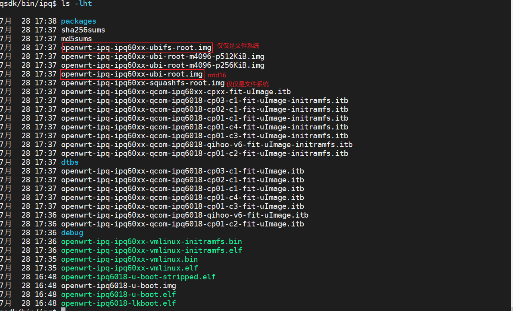

12. todo

## 打包分析


```
./ipq/prepareSingleImage.py --arch ipq6018 --in ./ipq --gencdt --genbootconf --genpart --genmbn --memory 512

cdt_generator.py 227 INFO: Filename: '/home/xym/works/01.qsdk/QSDK_r11.4_1.2/common/build/ipq/ipq6018/machid_xml/AP-CP01-C4_256M32_DDR3_LM512.xml'


python /home/xym/works/01.qsdk/QSDK_r11.4_1.2/./apss_proc/out/meta-scripts/pack_hk.py --arch ipq6018 --fltype nand --srcPath ./ipq --inImage ./ipq --outImage ./bin --memory 512
python /home/xym/works/01.qsdk/QSDK_r11.4_1.2/./apss_proc/out/meta-scripts/pack_hk.py --arch ipq6018 --fltype nand --srcPath ./ipq --inImage ./ipq --outImage ./bin --image_type hlos --memory 512
python /home/xym/works/01.qsdk/QSDK_r11.4_1.2/./apss_proc/out/meta-scripts/pack_hk.py --arch ipq6018 --fltype norplusnand --srcPath ./ipq --inImage ./ipq --outImage ./bin --memory 512
python /home/xym/works/01.qsdk/QSDK_r11.4_1.2/./apss_proc/out/meta-scripts/pack_hk.py --arch ipq6018 --fltype norplusnand --srcPath ./ipq --inImage ./ipq --outImage ./bin --image_type hlos --memory 512
python /home/xym/works/01.qsdk/QSDK_r11.4_1.2/./apss_proc/out/meta-scripts/pack_hk.py --arch ipq6018 --fltype emmc --srcPath ./ipq --inImage ./ipq --outImage ./bin --memory 512
python /home/xym/works/01.qsdk/QSDK_r11.4_1.2/./apss_proc/out/meta-scripts/pack_hk.py --arch ipq6018 --fltype emmc --srcPath ./ipq --inImage ./ipq --outImage ./bin --image_type hlos --memory 512
python /home/xym/works/01.qsdk/QSDK_r11.4_1.2/./apss_proc/out/meta-scripts/pack_hk.py --arch ipq6018 --fltype norplusemmc --srcPath ./ipq --inImage ./ipq --outImage ./bin --memory 512
python /home/xym/works/01.qsdk/QSDK_r11.4_1.2/./apss_proc/out/meta-scripts/pack_hk.py --arch ipq6018 --fltype norplusemmc --srcPath ./ipq --inImage ./ipq --outImage ./bin --image_type hlos --memory 512
python /home/xym/works/01.qsdk/QSDK_r11.4_1.2/./apss_proc/out/meta-scripts/pack_hk.py --arch ipq6018 --fltype nor --srcPath ./ipq --inImage ./ipq --outImage ./bin --memory 512
python /home/xym/works/01.qsdk/QSDK_r11.4_1.2/./apss_proc/out/meta-scripts/pack_hk.py --arch ipq6018 --fltype nor --srcPath ./ipq --inImage ./ipq --outImage ./bin --image_type hlos --memory 512
```


```
ZCOM# imgaddr=0x44000000
ZCOM# source $imgaddr:script
## Executing script at 44000000
crc32+ SPI_ADDR_LEN=3
SF: Detected MX25U25635F with page size 256 Bytes, erase size 64 KiB, total 32 MiB
soc_hw_version : Validation success
machid : Validation success
Flashing sbl1:                          [ done ]
Flashing mibib:                         [ done ]
Flashing bootconfig:                    [ done ]
Flashing bootconfig1:                   [ done ]
Flashing tz:                            [ done ]
Flashing devcfg:                        [ done ]
Flashing rpm:                           [ done ]
Flashing ddr-AP-CP01-C3_256M32_DDR3:    [ done ]
Flashing u-boot:                        [ done ]
Flashing ubi:                           [ done ]

```

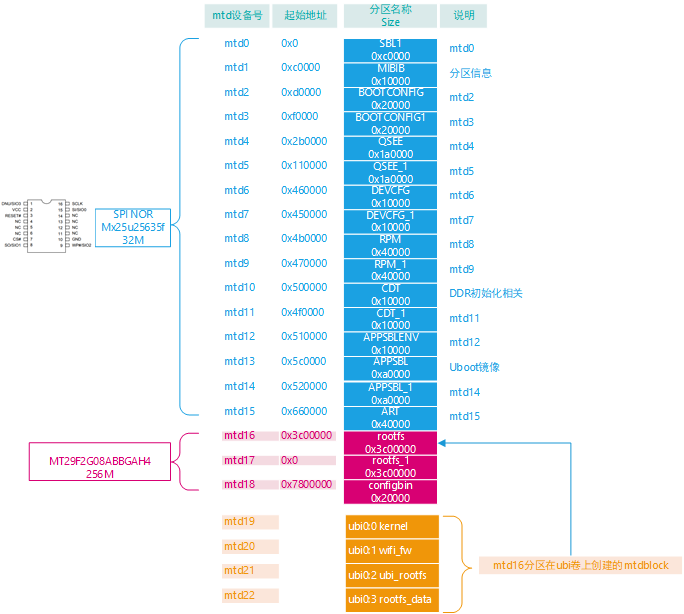

注：MX25U256 特性如下：

- 页大小(page)：256 byte  
- 扇区大小(sector)：4K 也就是16个页   最小擦除单位也是一个扇区大小4k
- 块大小(block)：
  - 32k 也就是8个扇区
  - 64k 也就是16个扇区
- 总共32M 也就是512个块 
-  支持整片擦除 、4k扇区擦除、 32K块擦除 和64K块擦除
- 支持页编程
- 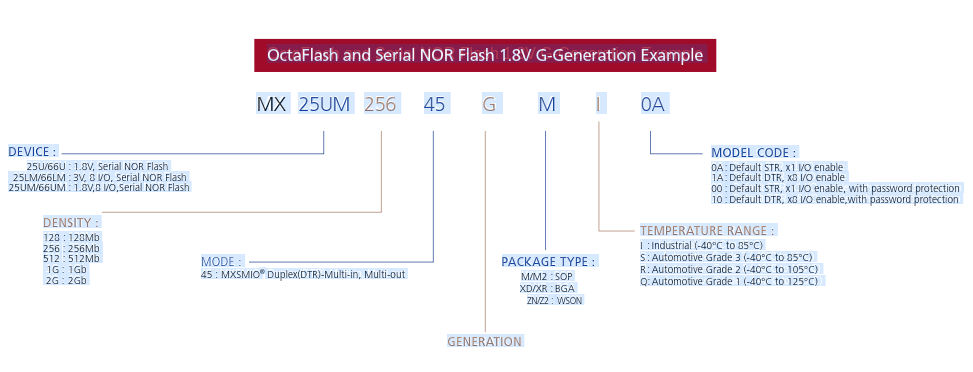

注：镁光 MT29F2G08ABBEAH4-ITX 特性如下 特性如下：

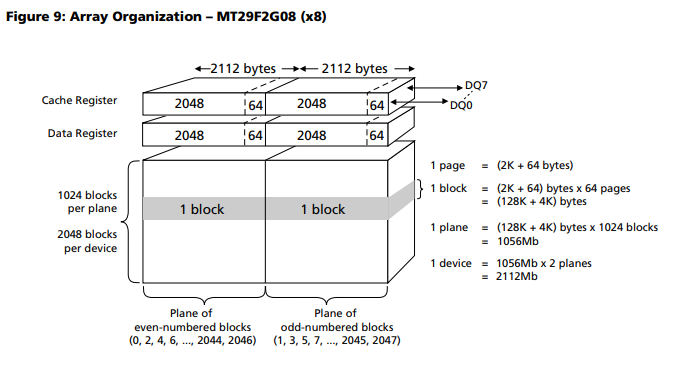

- 页大小(page)：2k 读写操作的基本单位
- 块大小(block)：128k 也就是64个页  最小擦除单位
- 总共2048*128k = 256M大小  一共2048个块


## 脚本分析

1. 执行`prepareSingleImage.py`脚本

   ```
   ./ipq/prepareSingleImage.py --arch ipq6018 --in ./ipq --gencdt --genbootconf --genpart --genmbn
   ```

   功能分析

   - 准备材料

     ```python
     if bootImgDir != "":
     			copy_images("BOOT", bootImgDir)
     		if tzImgDir != "":
     			copy_images("TZ", tzImgDir)
     		if nhssImgDir != "":
     			copy_images("NHSS" + mode, nhssImgDir)
     		if rpmImgDir != "":
     			copy_images("RPM", rpmImgDir)
     		if wififwImgDir != "":
     			copy_images("WIFIFW", wififwImgDir)
     ```

     

   - 先執行`gen_cdt()`

     ```bash
     # 注意：memory默认取值为 prepareSingleImage.py 的--memcry参数  缺省情况下：默认是"default" 只能是256或者512 否则就失败
     gen_cdt_bin.py -c <chipcode>/common/build/ipq/ipq6018/config.xml -o ./ipq/ -m  memory
     ```

     下面分析`gen_cdt_bin.py`

     ```bash
     # 解析<chipcode>/common/build/ipq/ipq6018/config.xml文件 根据 memory配置
     # 重写<chipcode>/common/build/ipq/ipq6018/cdt/256M32_DDR3.xml
     
     #然后遍历<chipcode>/common/build/ipq/ipq6018/machid_xml所有文件执行
     <chipcode>/common/build/ipq/scripts/cdt_generator.py <chipcode>/common/build/ipq/ipq6018/machid_xml/AP-CP01-C1_256M32_DDR3.xml cdt-AP-CP01-C1_256M32_DDR3.bin
     
     因为是遍历 
     所以这里会生成
     cdt-AP-CP01-C1_256M32_DDR3.bin
     cdt-AP-CP01-C2_256M32_DDR3.bin
     cdt-AP-CP01-C3_256M32_DDR3.bin
     等等
     ```

     上面的步骤在打包日志信息上也能看到

     ```bash
     ./ipq/prepareSingleImage.py --arch ipq6018 --in ./ipq --gencdt --genbootconf --genpart --genmbn
     
     cdt_generator.py 227 INFO: Filename: '/home/xym/works/03.qsdk_oem/common/build/ipq/ipq6018/machid_xml/AP-CP02-C1_256M32_DDR4.xml'
     Created 'cdt-AP-CP02-C1_256M32_DDR4.bin'
     
     
     cdt_generator.py 227 INFO: Filename: '/home/xym/works/03.qsdk_oem/common/build/ipq/ipq6018/machid_xml/AP-CP01-C4_256M32_DDR3.xml'
     Created 'cdt-AP-CP01-C4_256M32_DDR3.bin'
     
     cdt_generator.py 227 INFO: Filename: '/home/xym/works/03.qsdk_oem/common/build/ipq/ipq6018/machid_xml/DB-CP01_256M32_DDR3.xml'
     Created 'cdt-DB-CP01_256M32_DDR3.bin'
     
     cdt_generator.py 227 INFO: Filename: '/home/xym/works/03.qsdk_oem/common/build/ipq/ipq6018/machid_xml/AP-CP01-C3_256M32_DDR3.xml'
     Created 'cdt-AP-CP01-C3_256M32_DDR3.bin'
     
     cdt_generator.py 227 INFO: Filename: '/home/xym/works/03.qsdk_oem/common/build/ipq/ipq6018/machid_xml/CP-EMU_256M32_DDR3.xml'
     Created 'cdt-CP-EMU_256M32_DDR3.bin'
     
     
     cdt_generator.py 227 INFO: Filename: '/home/xym/works/03.qsdk_oem/common/build/ipq/ipq6018/machid_xml/AP-CP01-C1_256M32_DDR3.xml'
     Created 'cdt-AP-CP01-C1_256M32_DDR3.bin'
     
     INFO: Filename: '/home/xym/works/03.qsdk_oem/common/build/ipq/ipq6018/machid_xml/DB-CP02_1024M32_DDR4.xml'
     Created 'cdt-DB-CP02_1024M32_DDR4.bin'
     
     cdt_generator.py 227 INFO: Filename: '/home/xym/works/03.qsdk_oem/common/build/ipq/ipq6018/machid_xml/AP-CP03-C1_256M16_DDR3.xml'
     Created 'cdt-AP-CP03-C1_256M16_DDR3.bin'
     
     
     cdt_generator.py 227 INFO: Filename: '/home/xym/works/03.qsdk_oem/common/build/ipq/ipq6018/machid_xml/AP-CP01-C2_256M32_DDR3.xml'
     Created 'cdt-AP-CP01-C2_256M32_DDR3.bin'
     
     总结
     上面生成：
     cdt-AP-CP02-C1_256M32_DDR4.bin
     cdt-AP-CP01-C4_256M32_DDR3.bin
     cdt-DB-CP01_256M32_DDR3.bin
     cdt-AP-CP01-C3_256M32_DDR3.bin
     cdt-CP-EMU_256M32_DDR3.bin
     cdt-AP-CP01-C1_256M32_DDR3.bin
     cdt-DB-CP02_1024M32_DDR4.bin
     cdt-AP-CP03-C1_256M16_DDR3.bin
     cdt-AP-CP01-C2_256M32_DDR3.bin
     ```

   - 接着执行`gen_bootconfig()`

     ```
     gen_bootconfig_bin.py -c <chipcode>/common/build/ipq/ipq6018/config.xml -o ./ipq
     ```

     下面分析`gen_bootconfig_bin.py`

     ```bash
     # 解析<chipcode>/common/build/ipq/ipq6018/config.xml 根据里面的 NAND_PARAMETER 参数
     
     <chipcode>/common/build/ipq/scripts/nand_mbn_generator.py <chipcode>/common/build/ipq/ipq6018/bootconfig/bootconfig.xml nand_raw_bootconfig.bin
     也就是生成
     nand_raw_bootconfig.bin 
     
     然后执行
     #rawpart_path ：<chipcode>/common/build/ipq/nand_raw_bootconfig
     # nand_bootconfig ：<chipcode>/common/build/ipq/nand_raw_bootconfig.bin 
     <chipcode>/common/build/ipq/bootconfig_tool -s nand_pagesize -p  nand_pages_per_block -i rawpart_path -o nand_bootconfig
     最终生成 <chipcode>/common/build/ipq/nand_raw_bootconfig.bin 
     ```

     打包日志也能看到输出信息

     ```bash
     norplusnand
             Nor page size: 256, pages/block: 256, total blocks: 256
             Partition info: /home/xym/works/03.qsdk_oem/common/build/ipq/ipq6018/flash_partition/norplusnand-partition.xml
             Creating user partition ...User partition created
             Creating system partition
     ...System partition created
             Nor page size: 256, pages/block: 256, total blocks: 256
             Partition info: /home/xym/works/03.qsdk_oem/common/build/ipq/ipq6018/flash_partition/norplusnand-partition.xml
             Creating user partition ...User partition created
             Creating system partition
     ...System partition created
             Nor page size: 256, pages/block: 256, total blocks: 256
             Partition info: /home/xym/works/03.qsdk_oem/common/build/ipq/ipq6018/flash_partition/norplusnand-4k-partition.xml
             Creating user partition ...User partition created
             Creating system partition
     ...System partition created
             Nor page size: 256, pages/block: 256, total blocks: 256
             Partition info: /home/xym/works/03.qsdk_oem/common/build/ipq/ipq6018/flash_partition/norplusnand-4k-partition.xml
             Creating user partition ...User partition created
             Creating system partition
     ...System partition created
     ```

     

   - 接下來執行gen_part()

     ```bash
     gen_flash_partition_bin.py -c <chipcode>/common/build/ipq/ipq6018/config.xml -f flash_type -o./ipq
     ```

     ```bash
     
     # -c 配置路徑  <chipcode>/common/build/ipq/ipq6018/config.xml
     # -o 生成的bin文件输出路径<chipcode>/common/build/ipq/norplusnand-system-partition-ipq6018.bin
     # -f 存储类型 nor、tiny-nor、nand、norplusnand、emmc、norplusemmc、tiny-nor-debug
     gen_flash_partition.py -c <chipcode>/common/build/ipq/ipq6018/config.xml -o <chipcode>/common/build/ipq/norplusnand-system-partition-ipq6018.bin -f norplusnand
     
     # <partition.xml> :<chipcode>/common/build/ipq/ipq6018/flash_partition/norplusnand-partition.xml 
     #生成的bin文件输出路径<chipcode>/common/build/ipq/norplusnand-system-partition-ipq6018.bin
     
     python nand_mbn_generator.py <chipcode>/common/build/ipq/ipq6018/flash_partition/norplusnand-partition.xml <chipcode>/common/build/ipq/norplusnand-system-partition-ipq6018.bin
     
     
     
     # -s <nor_page_size>
     # -p <nor_pages_per_block>
     # -b <nor_total_block_count>
     # -x <nand_page_size>
     # -y <nand_pages_per_block>
     # -z <nand_total_block>
     # -c 1
     # -u <user partition file>  即<chipcode>/common/build/ipq/ipq6018/flash_partition/norplusnand-partition.xml 
     # -o <output_system_partition> 即 <chipcode>/common/build/ipq/norplusnand-system-partition-ipq6018.bin
     
     
     partition_tool -s <nor_page_size> -p <nor_pages_per_block> -b 
     <nor_total_block_count> -x <nand_page_size> -y <nand_pages_per_block> -z 
     <nand_total_block> -c 1 -u <user partition file> -o <output_system_partition>
     
     # 最终生成的就是
     # <chipcode>/common/build/ipq/norplusnand-system-partition-ipq6018.bin
     
     
     
     ```

     

   - 下面執行gen_bootldr  这里没有用到 先不分析

   - 下面执行gen_mbn()

     ```
     elftombn.py -f ./ipq/openwrt-ipq6018-u-boot.elf -o ./ipq/openwtt-ipq6018-u-boot.mbn -v 6
     
     功能就是在uboot前加一堆的头部信息 
     ```

     

   - 

     

2. `python /home/xym/works/03.qsdk_oem/./apss_proc/out/meta-scripts/pack_hk.py`

   ```bash
   
   python /home/xym/works/03.qsdk_oem/./apss_proc/out/meta-scripts/pack_hk.py 
   --arch ipq6018 
   --fltype nand 
   --srcPath ./ipq 
   --inImage ./ipq 
   --outImage ./bin
   
   FIT description: Flashing nand 800 20000
   Created:         Mon Aug  8 15:02:29 2022
    Image 0 (script)
     Description:  flash.scr
    Image 1 (sbl1-7656825e10cf17312545f8b52d94205b6eaac2d1)
     Description:  xbl_nand.elf.padded
    Image 2 (mibib-3c2e7176e80a90454c325425fcfb853c9aa3bfa8)
     Description:  nand-system-partition-ipq6018.bin
    Image 3 (bootconfig-f1050e638265203cd2a74f220c37aeaa88edfc7e)
     Description:  bootconfig.bin
    Image 4 (bootconfig1-f1050e638265203cd2a74f220c37aeaa88edfc7e)
     Description:  bootconfig.bin
    Image 5 (tz-7fb7fc3700e39853414a46c5956c80067bd3af08)
     Description:  tz.mbn.padded
    Image 6 (devcfg-6b7479a141ff6e98f3a688383da353b19493bb6a)
     Description:  devcfg.mbn.padded
    Image 7 (rpm-74a70576db432ff372e2a04708088a33347aa910)
     Description:  rpm.mbn.padded
    Image 8 (ddr-AP-CP01-C1_256M32_DDR3-7af74781f6f54650ba9d46278976be3c3251ec73)
     Description:  cdt-AP-CP01-C1_256M32_DDR3.bin.padded
    Image 9 (ddr-AP-CP01-C2_256M32_DDR3-a2e152fee9332a84cf08b4165eb6e192212c4fd3)
     Description:  cdt-AP-CP01-C2_256M32_DDR3.bin.padded
    Image 10 (ddr-AP-CP01-C3_256M32_DDR3-98bafca6d1f45749b69c1e85c2e1c6b712bb06f4)
     Description:  cdt-AP-CP01-C3_256M32_DDR3.bin.padded
    Image 11 (ddr-AP-CP01-C4_256M32_DDR3-8f9fa722877b8ed5fb076dccd45edaaeed101cfb)
     Description:  cdt-AP-CP01-C4_256M32_DDR3.bin.padded
    Image 12 (ddr-AP-CP02-C1_256M32_DDR4-daceb352794a1eec793dfb90ea834deee833b800)
     Description:  cdt-AP-CP02-C1_256M32_DDR4.bin.padded
    Image 13 (ddr-AP-CP03-C1_256M16_DDR3-bd77335a1767981aa0a33fdc731eadc9cfb8a2d3)
     Description:  cdt-AP-CP03-C1_256M16_DDR3.bin.padded
    Image 14 (ddr-DB-CP01_256M32_DDR3-3b924f4df2038aa2013729b4bd512a0f6cd60418)
     Description:  cdt-DB-CP01_256M32_DDR3.bin.padded
    Image 15 (ddr-DB-CP02_1024M32_DDR4-83d3360def025dfb6398a30918da55c07f7efa35)
     Description:  cdt-DB-CP02_1024M32_DDR4.bin.padded
    Image 16 (ddr-CP-EMU_256M32_DDR3-6f4f696eb07d0d7732a965c1313a15d7095fc0b7)
     Description:  cdt-CP-EMU_256M32_DDR3.bin.padded
    Image 17 (u-boot-92820e908aedf960c13e47a3b5656d24c901db7a)
     Description:  openwrt-ipq6018-u-boot.mbn.padded
    Image 18 (ubi-11b222af1220a55fa0028279c31f3cf5f430e279)
     Description:  openwrt-ipq-ipq60xx-ubi-root.img
    
   
   
   
   
   
   FIT description: Flashing nand 1000 40000
   Created:         Mon Aug  8 15:02:30 2022
    Image 0 (script)
     Description:  flash.scr
    Image 1 (sbl1-7656825e10cf17312545f8b52d94205b6eaac2d1)
     Description:  xbl_nand.elf.padded
    Image 2 (mibib-5fa12ab5572f05adee223a9efed7d0d72c00d9f5)
     Description:  nand-system-partition-ipq6018-m4096-p256KiB.bin
    Image 3 (bootconfig-f1050e638265203cd2a74f220c37aeaa88edfc7e)
     Description:  bootconfig.bin
    Image 4 (bootconfig1-f1050e638265203cd2a74f220c37aeaa88edfc7e)
     Description:  bootconfig.bin
    Image 5 (tz-7fb7fc3700e39853414a46c5956c80067bd3af08)
     Description:  tz.mbn.padded
    Image 6 (devcfg-6b7479a141ff6e98f3a688383da353b19493bb6a)
     Description:  devcfg.mbn.padded
    Image 7 (rpm-74a70576db432ff372e2a04708088a33347aa910)
     Description:  rpm.mbn.padded
    Image 8 (ddr-AP-CP01-C1_256M32_DDR3-7af74781f6f54650ba9d46278976be3c3251ec73)
     Description:  cdt-AP-CP01-C1_256M32_DDR3.bin.padded
    Image 9 (ddr-AP-CP01-C2_256M32_DDR3-a2e152fee9332a84cf08b4165eb6e192212c4fd3)
     Description:  cdt-AP-CP01-C2_256M32_DDR3.bin.padded
    Image 10 (ddr-AP-CP01-C3_256M32_DDR3-98bafca6d1f45749b69c1e85c2e1c6b712bb06f4)
     Description:  cdt-AP-CP01-C3_256M32_DDR3.bin.padded
    Image 11 (ddr-AP-CP01-C4_256M32_DDR3-8f9fa722877b8ed5fb076dccd45edaaeed101cfb)
     Description:  cdt-AP-CP01-C4_256M32_DDR3.bin.padded
    Image 12 (ddr-AP-CP02-C1_256M32_DDR4-daceb352794a1eec793dfb90ea834deee833b800)
     Description:  cdt-AP-CP02-C1_256M32_DDR4.bin.padded
    Image 13 (ddr-AP-CP03-C1_256M16_DDR3-bd77335a1767981aa0a33fdc731eadc9cfb8a2d3)
     Description:  cdt-AP-CP03-C1_256M16_DDR3.bin.padded
    Image 14 (ddr-DB-CP01_256M32_DDR3-3b924f4df2038aa2013729b4bd512a0f6cd60418)
     Description:  cdt-DB-CP01_256M32_DDR3.bin.padded
    Image 15 (ddr-DB-CP02_1024M32_DDR4-83d3360def025dfb6398a30918da55c07f7efa35)
     Description:  cdt-DB-CP02_1024M32_DDR4.bin.padded
    Image 16 (ddr-CP-EMU_256M32_DDR3-6f4f696eb07d0d7732a965c1313a15d7095fc0b7)
     Description:  cdt-CP-EMU_256M32_DDR3.bin.padded
    Image 17 (u-boot-92820e908aedf960c13e47a3b5656d24c901db7a)
     Description:  openwrt-ipq6018-u-boot.mbn.padded
    Image 18 (ubi-0da373cd3b9749774962defe1e859cd23f5da923)
     Description:  openwrt-ipq-ipq60xx-ubi-root-m4096-p256KiB.img
   
   
   
   下一步
   python /home/xym/works/03.qsdk_oem/.//apss_proc/out/meta-scripts/pack_hk.py 
   --arch ipq6018 
   --fltype nand 
   --srcPath ./ipq 
   --inImage ./ipq 
   --outImage ./bin 
   --image_type hlos   和上面不一样的地方
   
   FIT description: Flashing nand 800 20000
    Image 0 (script)
     Description:  flash.scr
    Image 1 (ubi-11b222af1220a55fa0028279c31f3cf5f430e279)
     Description:  openwrt-ipq-ipq60xx-ubi-root.img
   
   
   
   FIT description: Flashing nand 1000 40000
    Image 0 (script)
     Description:  flash.scr
    Image 1 (ubi-0da373cd3b9749774962defe1e859cd23f5da923)
     Description:  openwrt-ipq-ipq60xx-ubi-root-m4096-p256KiB.img
     
     
     
   重复上面的所有步骤
   生成
   norplusnand 
   emmc
   norplusemmc
   nor
   ```

   

3. 

## 其它

1. uboot看门狗

   ```c
   // qsdk\build_dir\host\u-boot-2014.10\arch\powerpc\lib\board.c
   #if defined(CONFIG_WATCHDOG)
   int init_func_watchdog_init(void)
   {
   #if defined(CONFIG_MPC85xx)
   	init_85xx_watchdog();
   #endif
   	puts("       Watchdog enabled\n");
   	WATCHDOG_RESET();
   	return 0;
   }
   ```

   

2. uboot `flash`和`flasherase`命令

   ```
   // qsdk\qca\src\u-boot-2016\common\cmd_flashwrite.c
   U_BOOT_CMD(
   	flash,       4,      0,      do_flash,
   	"flash part_name \n"
   	"\tflash part_name load_addr file_size \n",
   	"flash the image at load_addr, given file_size in hex\n"
   );
   
   U_BOOT_CMD(
   	flasherase,       4,      0,      do_flash,
   	"flerase part_name \n",
   	"erases on flash the given partition \n"
   );
   
   ```

   ```
   flash 0:WIFIFW   # 一个mtd分区
   flash wifi_fw    # ubi的卷
   ```

   

3. uboot的imxtract命令

   ```
   U_BOOT_CMD(
   	imxtract, 4, 1, do_imgextract,
   	"extract a part of a multi-image", imgextract_help_text
   );
   
   ```

   

4. 