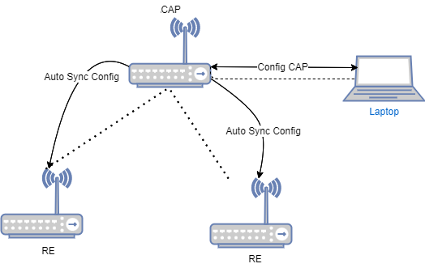
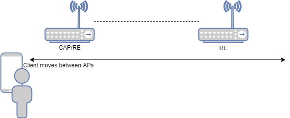
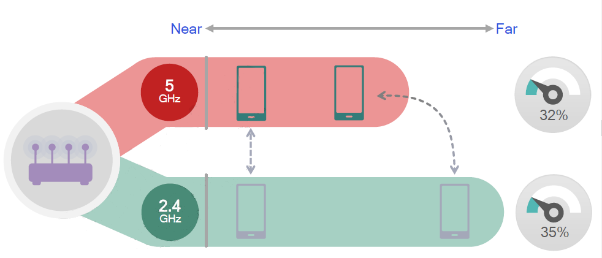
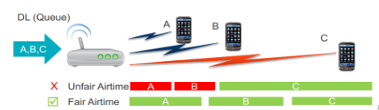
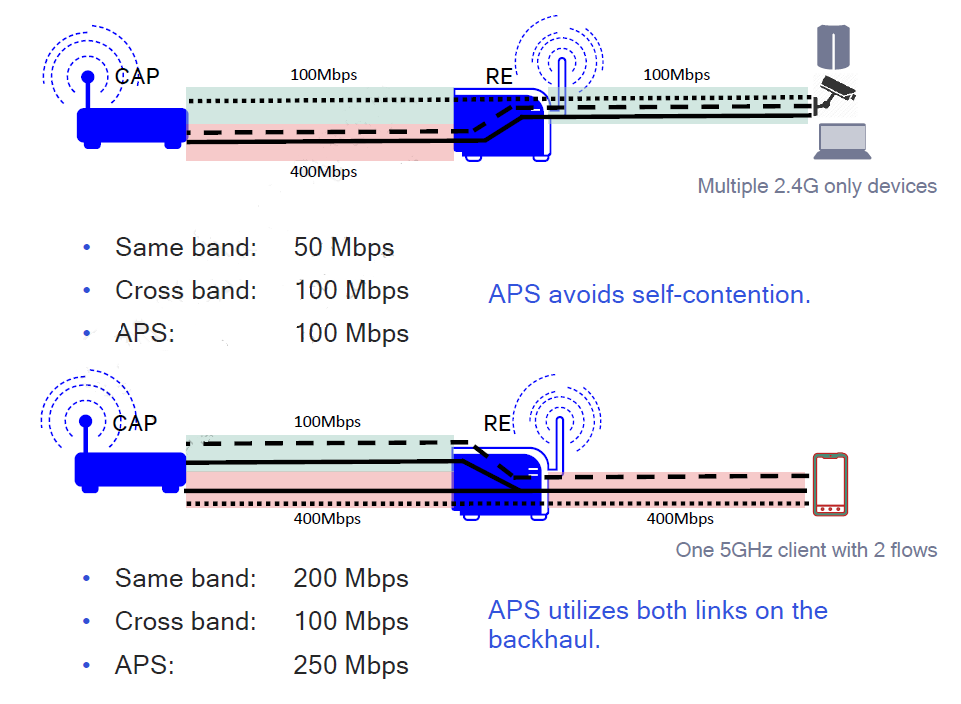
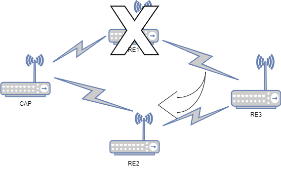
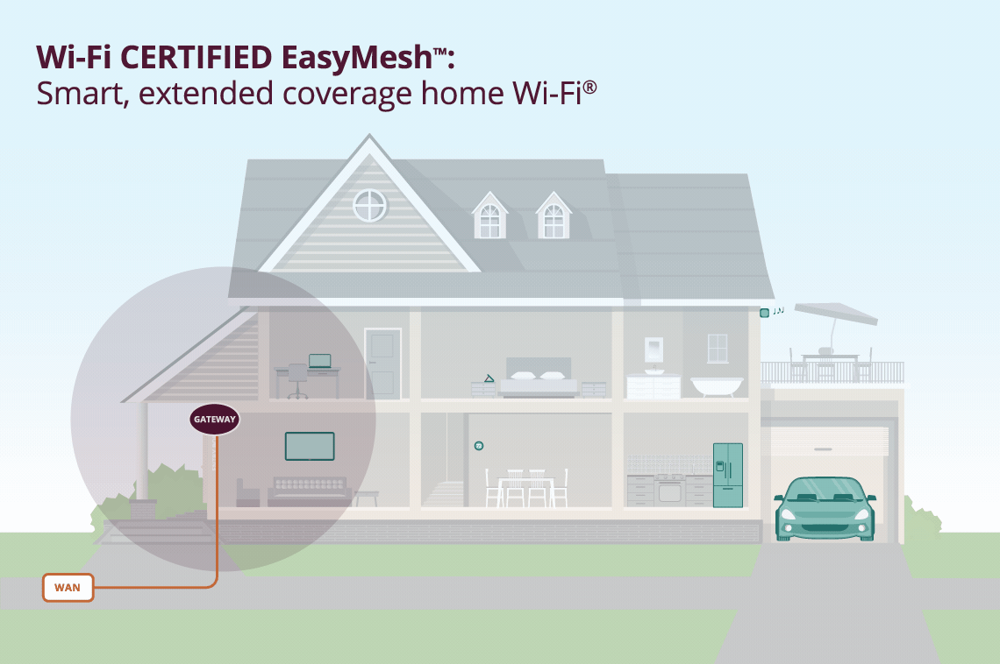
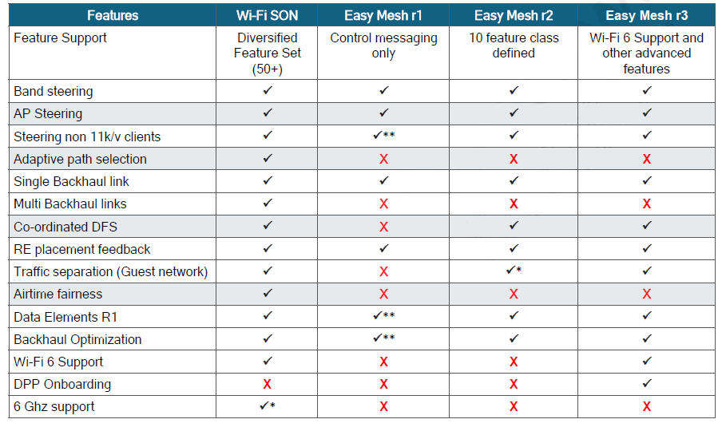
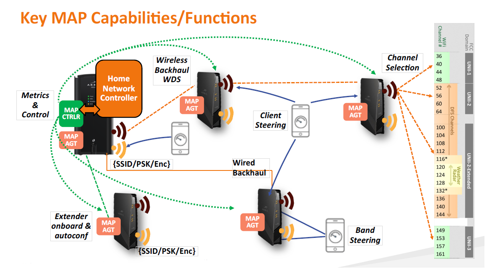

# 高通Wi-Fi Son 和EasyMesh

## Wi-Fi Son

Wi-Fi SON 是Wi-Fi Self Organizing Network的简称，他是高通专有的Mesh解決方案，可以简单的設定以及轻松地组建一個Wi-Fi网絡。Wi-Fi SON 可以自我设置、自我管理、自我诊断。

### 自我设置

在完成CAP网络设置之后，新的RE加入到Wi-Fi网络当中，不需要再对RE进行设置。Wi-Fi SON会自动将CAP配置同步到网路中的所有RE。使用者只需要設置一次CAP，就能设置好整個网络。

### 自我管理

Wi-Fi SON 內建多种自我管理技术，无缝漫游、Band Steering、Air Time Fairness、Multiple backhaul、APS，有效管理STA的连接，确保整个网络的负载平衡，达到最佳的效能。

#### 无缝漫游

Wi-Fi SON网络可以触发客戶端在 AP 之間无缝漫遊。客戶端在AP之间漫游的时候，不会感觉到传输中断。就像是蜂巢式电话网络一样，在基站之间漫游不会造成通话中断，得以在家庭网络中实现。

#### Band Steering 频谱导航

Wi-Fi SON可以根信号的强弱、通道的负载来引导客户端连接到2.4G或者5G。

当一个ap同时支持2.4G和5G双频时，当距离近时，优先连接5G，尽可能的使用11ac协议，使得空间利用率更高，当距离远时，由于2.4G的连接距离比较远，可以使客户端迁移到2.4G，保证无线可以连接。

如果5G频率上的客户端很多，可以将部分客户端迁移到2.4G上，以保证合理利用频谱资源，主要取决于CCA的繁忙程度。

#### Air Time Fairness 接入时间公平

由于ieee802.11协议采用基于CSMA/CA的多址随机信道接入控制机制。所以会出现客户端之间对信道的带宽占空比不同。高通wifi-son技术可以通过设置每个客户端的接入占用比，从而保证每个客户端可以均衡的利用带宽。

#### 多种回程链路

Wi-Fi SON的backhaul可以支持Wi-Fi 2.4G、5G以及PLC同时运行，可以确保回程故障安全。在multiple backhaul的前提之下，自适应路径选择功能，得以做到负载聚合跟负载均衡，数据传输量会有所提升。

由示意图可以看出，Wi-Fi SON利用多个回程链路的运作来选择最适路径，在有多个client在使用网络的时候Same band与APS的比250:350；总频宽的表现增加了近40%

### 自我诊断

Wi-Fi SON的网络拓展，是以CAP为根的树狀拓展。当一个新的节点上电时，它会连接到最佳上行节点。一旦发现上行节点损坏，就会侦测到失去连接，然後启动另外一个上行节点的连接来自动回复网络。

总结：Wi-Fi SON是一个在CAP简单配置设定之后，多节点（REs）利用简单的方式Onboarding，即可以将CAP配置同步给所有的RE，可轻易地扩展；支持多回程链路与自动回复提供稳定的多节点网络。load balance，APS，band steering，roaming则共同提供高效能的无线网络体验

## EasyMesh

Wi-Fi EasyMesh安装和使用都很简便。网络设置和设备入网仅需最低限度的用户干预。网络连接一旦建立，网络就进行自我监控，以确保优化的性能。Wi-Fi EasyMesh利用Wi-Fi CERTIFIED Agile Multiband™提供的机制，将设备引导到能为其提供最佳Wi-Fi服务的AP上。Wi-Fi EasyMesh网络还可基于变化的条件修改网络结构，以提供一致的体验。

Wi-Fi EasyMesh为住宅和办公Wi-Fi网络提供以下益处：

1. 扩大网络容量：以Wi-Fi 6模式运行时，同时支持更多服务和更高的真实输送量；
2. 灵活设计：通过以最佳方式放置接入点，无需导线连接，就可扩大覆盖范围；
3. 易于设置：通过Wi-Fi Easy Connect技术，利用QR码，提供无缝、安全的设备入网和配置；
4. 网络智慧性：自组织和自优化网络收集高级诊断信息，方便服务提供者通过Wi-Fi Data Elements提供支持，并响应网络条件变化，以最大限度提高性能；
5. 有效的服务优先级：能够在需要时优先处理低延迟应用，而且引导设备漫游到最佳连接并避免干扰；
6. 可扩展性：易于在需要的地方增加接入点，即使接入点设备来自不同厂商也一样。

人们在家中越来越依靠Wi-Fi实现设备互连、提供数据流传送服务，这就需要更加智慧的、覆盖范围更大和覆盖一致的Wi-Fi网络。Wi-Fi EasyMesh产品提供的网络覆盖范围全面，能够以最低限度的用户干预智慧地管理资源，可同时惠及消费者和服务提供者。Wi-Fi EasyMesh技术是高度可扩展的，使使用者能够在需要的地点简便地增加无线AP。Wi-Fi EasyMesh网络以Wi-Fi CERTIFIED的承诺为基础，容许在更多可交互操作的、不同品牌的设备中进行选择。

简言之，EasyMesh就是WFA认证的Mesh解决方案。他的基本构想是与Wi-Fi SON相同的，提供一个多节点，简单设定以及高品质的无线网络环境

## Wi-Fi SON 和Easymesh比较

由比较表可以看得出来，随着EasyMesh的推广与发展，到了R3的阶段，在功能面上已经与Wi-Fi SON相差无几，加上EasyMesh的通用性的优势，未来应该会逐步取代Wi-Fi SON的。现阶段来说，Wi-Fi SON仍保有APS与Multi backhaul link这两大优势，可以提供比EasyMesh更好的故障安全，负载聚合跟负载均衡。

整体来说，无论是Wi-Fi SON还是EasyMesh，都具备一些主要的功能。Onboarding & autoconf、Metrics & Control、Wireless Backhaul、Client Steering、Band Steering、Wired Backhaul、Channel Selection。给使用者一个简单、高品质的无线网络环境。

