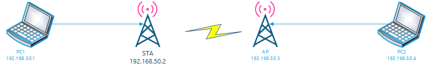

# QSDK常用命令

## Host端Shell脚本直接在设备端执行方法



如上图所示的链路关系

1. PC1上的脚本在STA端执行或者PC1上脚本在AP端执行方法

   - 在编写PC1端编写脚本格式如下（ps：假如脚本名字：`script.sh`）：

     ```bash
     #!/bin/bash
     #指示需要在哪台设备执行
     SCRIPT_DEV_IP=192.168.50.1
     
     #自定义需要执行的命令
     function scan()
     {
         wpa_cli -p /var/run/wpa_supplicant-$1 -i $1 scan
     }
     function scan_res()
     {
         wpa_cli -p /var/run/wpa_supplicant-$1 -i $1 scan_res
     }
     
     
     function main()
     {
     	case $1 in
     		"scan")
                 ssh root@$SCRIPT_DEV_IP  "$(typeset -f);scan $2"
                fi
     			
     		;;
     		"scan_res")
                 ssh root@$SCRIPT_DEV_IP  "$(typeset -f);scan_res $2"
     		;;
     		*)
     			echo -e "args is error"
     		;;
     	esac
     }
     
     main $@
     ```

     

   - 在PC1端执行下面的命令即可

     ```bash
     #举例说明1:执行扫描ap命令
     ./script.sh scan ath2
     
     #举例说明2:执行查询上次扫描结果命令
     ./script.sh scan_res ath2
     ```

## 常用的命令

1. 设置单通道

   ```bash
   wifitool ath2 custom_chan_list -n -band 2 1 64
   #2 band
   #1 几个频段
   #64 频段
```
   
2. 列出当前sta连接ap

   ```bash
   root@OpenWrt:/# wlanconfig ath0 list ap
   SSID            BSSID              CHAN RATE  S:N   INT CAPS
   xymAP           8c:1f:64:cc:b0:50   64   54M 45:0   100 EPsR RSN VEN VEN WME VEN VEN
   ```

3. 列出当前ap连接的sta

   ```bash
   root@OpenWrt:/# wlanconfig ath0 list sta
   ADDR               AID CHAN TXRATE RXRATE RSSI MINRSSI MAXRSSI IDLE  TXSEQ  RXSEQ  CAPS XCAPS ACAPS     ERP    STATE MAXRATE(DOT11) HTCAPS   VHTCAPS ASSOCTIME    IEs   MODE RXNSS TXNSS                   PSMODE
   8c:1f:64:cc:b0:40    1   64   6M    229M  -66     -67     -66  144      0   65535   EPs  ETWt NULL    0          b         286800             APM           1gTRs 00:31:49     RSN WME IEEE80211_MODE_11AXA_HE20  4 4   0
   
    RSSI is combined over chains in dBm
    Minimum Tx Power               : 0
    Maximum Tx Power               : 0
    HT Capability                  : Yes
    VHT Capability                 : Yes
    MU capable                     : No
    SNR                            : 28
    Operating band                 :    5GHz
    Current Operating class        : 118
    Supported Operating classes    : 115  118  124  121  125  116  119  122  126  126  117  120  123  127  127  128  129  130
    Supported Rates                : 12  18  24  36  48  72  96  108
    Max STA phymode                : IEEE80211_MODE_11AXA_HE20
   
   ```

4.  查看sta 连接状态

   ```bash
   root@OpenWrt:/# iw dev ath2 link
   Not connected. # 说明没有连接ap
   
   
   root@OpenWrt:/# iw dev ath2 link
   Connected to 8c:1f:64:cc:b0:60 (on ath2)
           SSID: xymAP #说明连接的ap名字
           freq: 5320
   
   ```

   

5. 列出当前信道和可用信道

   ```bash
   root@OpenWrt:/# iwlist ath0 channel
   ath0      25 channels in total; available frequencies :
             Channel 36 : 5.18 GHz
             Channel 40 : 5.2 GHz
             Channel 44 : 5.22 GHz
             Channel 48 : 5.24 GHz
             Channel 52 : 5.26 GHz
             Channel 56 : 5.28 GHz
             Channel 60 : 5.3 GHz
             Channel 64 : 5.32 GHz
             Channel 100 : 5.5 GHz
             Channel 104 : 5.52 GHz
             Channel 108 : 5.54 GHz
             Channel 112 : 5.56 GHz
             Channel 116 : 5.58 GHz
             Channel 120 : 5.6 GHz
             Channel 124 : 5.62 GHz
             Channel 128 : 5.64 GHz
             Channel 132 : 5.66 GHz
             Channel 136 : 5.68 GHz
             Channel 140 : 5.7 GHz
             Channel 144 : 5.72 GHz
             Channel 149 : 5.745 GHz
             Channel 153 : 5.765 GHz
             Channel 157 : 5.785 GHz
             Channel 161 : 5.805 GHz
             Channel 165 : 5.825 GHz
             Current Frequency:5.18 GHz (Channel 36)
   
   ```

6. 显示当前带宽功率和通道

   ```
   root@OpenWrt:/# iw ath2 info
   Interface ath2
           ifindex 21
           wdev 0x200000002
           addr 8c:1f:64:cc:b0:40
           ssid xymAP
           type managed
           wiphy 2
           channel 64 (5320 MHz), width: 20 MHz, center1: 5320 MHz
           txpower 24.00 dBm
   ```

   

7. AP Level层面统计信息

   ```bash
   root@OpenWrt:/# apstats -a -i ath2
   apstats: Warning - Ignoring Interface Name input for AP Level.
   AP Level Stats:
   
   WLAN Stats:
   Tx Data Packets                 = 3727
   Tx Data Bytes                   = 771671
   Rx Data Packets                 = 2436
   Rx Data Bytes                   = 227283
   Tx Unicast Data Packets         = 3727
   Tx Multi/Broadcast Data Packets = 0
   Resource Utilization (0-255)    = <DISABLED>
   Average Tx Rate (kbps)          = <NO STA>
   Average Rx Rate (kbps)          = <NO STA>
   Rx PHY errors                   = 12
   Rx CRC errors                   = 0
   Rx MIC errors                   = 0
   Rx Decryption errors            = 0
   Rx errors                       = 0
   Tx failures                     = 0
   Tx Dropped                      = 0
   Throughput (kbps)               = <DISABLED>
   Total PER (%)                   = 0
   PER over configured period (%)  = <DISABLED>
   ```

8. VAP Level层面的统计信息

   ```bash
   root@OpenWrt:/#  apstats -v -i ath2
   VAP Level Stats: ath2 (under radio wifi2)
   Tx Data Packets                 = 3727
   Tx Data Bytes                   = 771671
   Tx Offer Data Packets           = 3770
   Tx Offer Data Bytes             = 776377
   Tx Data Payload Bytes           = 719493
   Tx Eapol Packets                = 0
   Rx Data Packets                 = 2434
   Rx Data Bytes                   = 227177
   Rx Data Payload Bytes           = 193101
   Tx Data Packets per AC:
    Best effort                    = 7432
    Background                     = 0
    Video                          = 0
    Voice                          = 84
   Rx Data Packets per AC:
    Best effort                    = 4524
    Background                     = 0
    Video                          = 0
    Voice                          = 390
   Tx Unicast Data Packets         = 3727
   Rx Unicast Data Packets         = 2297
   Tx Multi/Broadcast Data Packets = 0
   Rx Multi/Broadcast Data Packets = 137
   Last Packet Error Rate(PER)     = 0
   Average Tx Rate (kbps)          = <NO STA>
   Average Rx Rate (kbps)          = <NO STA>
   Tx multicast Data Packets       = 0
   Tx Broadcast Data Packets       = 0
   Tx Broadcast Data Bytes         = 0
   Rx multicast Data Packets       = 137
   Rx Broadcast Data Packets       = 0
   Packets Dropped                 = 0
   Packets Errored                 = 0
   Rx errors                       = 0
   Rx Dropped                      = 0
   Tx failures                     = 0
   Tx Dropped                      = 0
   Tx Mgmt Failures                = 0
   Host Discard                    = 0
   Rx MIC Errors                   = 0
   Last Tx rate for unicast Packets        = 154900
   Last Tx rate for unicast Packets(mcs)   = 6
   Last Tx rate for multicast Packets      = 0
   Last Tx rate for multicast Packets(mcs) = 0
   Total number of offchan TX mgmt frames = 0
   Total number of offchan TX data frames = 0
   Number of failed offchan TX frames = 0
   Total beacons sent to fw in SWBA intr = 0
   Retries                         = 1324
   Tx Mgmt Packets                 = 35
   Rx Mgmt Packets                 = 28
   Connections refuse Radio limit  = 0
   Connections refuse Vap limit    = 0
   802.11 Auth Attempts            = 8
   802.11 Auth Success             = 8
   MLME Authorize Attempts         = 0
   MLME Authorize Success          = 8
   Peer delete req                 = 7
   Peer delete resp                = 7
   Peer delete all req             = 0
   Peer delete all resp            = 0
   Excessive retries per AC:
    Best effort                    = 0
    Background                     = 0
    Video                          = 0
    Voice                          = 0
   Beacon success                  = 0
   Beacon failed                   = 0
   Probe request drops             = 0
   OOB probe requests              = 0
   Wildcard probe requests drops   = 0
   FILS enable                     = 0
   FILS frames sent                = 0
   FILS frames sent fail           = 0
   6GHz stats:
    unsolicited probe response success = 0
    unsolicited probe response failed = 0
    20TU probe response status     = 0
    20TU probe response interval   = 0
   Non-Tx Profile rollback count when ema_ext enabled = 0
   IE Overflow count for Tx/Non-Tx VAP Beacon resource overflow = 0
   
   ```

   

9. radio Level统计信息

   ```bash
   root@OpenWrt:/# apstats -r -i wifi2
   Radio Level Stats: wifi2
   Tx Data Packets                 = 3727
   Tx Data Bytes                   = 771671
   Rx Data Packets                 = 2436
   Rx Data Bytes                   = 227283
   Tx Unicast Data Packets         = 3727
   Tx Multi/Broadcast Data Packets = 0
   Tx Data Packets per AC:
    Best effort                    = 7432
    Background                     = 0
    Video                          = 0
    Voice                          = 84
   Rx Data Packets per AC:
    Best effort                    = 4524
    Background                     = 0
    Video                          = 0
    Voice                          = 390
   Channel Utilization (0-255)     = <DISABLED>
   Tx Beacon Frames                = 0
   Tx Mgmt Frames                  = 35
   Rx Mgmt Frames                  = 28
   Rx Mgmt Frames dropped(RSSI too low) = 0
   Tx Ctl Frames                   = 0
   Rx Ctl Frames                   = 0
   Rx RSSI                         = 57
   Rx PHY errors                   = 12
   Rx CRC errors                   = 0
   Rx MIC errors                   = 0
   Rx Decryption errors            = 0
   Rx errors                       = 0
   Tx failures                     = 0
   Tx Dropped                      = 0
   Connections refuse Radio limit  = 0
   Connections refuse Vap limit    = 0
   802.11 Auth Attempts            = 8
   802.11 Auth Success             = 8
   MLME Authorize Attempts         = 0
   MLME Authorize Success          = 8
   Self BSS chan util              = 0
   OBSS chan util                  = 0
   lithium_cycle_counts:
   lithium_cycle_cnt: Chan NF (BDF averaged NF_dBm) = -91
   lithium_cycle_cnt: Tx Frame Cnt = 1356584
   lithium_cycle_cnt: Rx Frame Cnt = 2611648728
   lithium_cycle_cnt: Rx Clear Cnt = 2748593055
   lithium_cycle_cnt: Cycle Cnt    = 3923166492
   lithium_cycle_cnt: Phy Err Cnt  = 12
   lithium_cycle_cnt: Chan Tx Pwr  = 48
   Current profile periodicity     = <DISABLED>
   Number of Active Vaps           = 0
   TX Vap ID                       = <DISABLED>
   Throughput (kbps)               = <DISABLED>
   PER over configured period (%)  = <DISABLED>
   Total PER (%)                   = 0
   Co-located RNR stats:
    Created vap:                   = 0
    Active vap:                    = 0
    RNR count:                     = 0
    6GHz SoC status:               = 0
   
   ```

   

10. 在AP端显示连接的STA的信息

   ```bash
   root@OpenWrt:/# apstats -s -m 8C:1F:64:CC:B0:40
   Node Level Stats: 8c:1f:64:cc:b0:40 (under VAP ath0)
   Tx Data Packets                 = 0
   Tx Data Bytes                   = 0
   Tx Success Data Packets         = 0
   Tx Success Data Bytes           = 0
   Tx Data Packets per AC:
    Best effort                    = 0
    Background                     = 0
    Video                          = 0
    Voice                          = 0
   Rx Data Packets per AC:
    Best effort                    = 5
    Background                     = 1
    Video                          = 0
    Voice                          = 0
   Tx Success Unicast Data Packets = 0
   TX MCS Stats
   OFDM 48 Mbps: 0
   OFDM 24 Mbps: 0
   OFDM 12 Mbps: 0
   OFDM 6 Mbps : 0
   OFDM 54 Mbps: 0
   OFDM 36 Mbps: 0
   OFDM 18 Mbps: 0
   OFDM 9 Mbps : 0
   CCK 11 Mbps Long  : 0
   CCK 5.5 Mbps Long : 0
   CCK 2 Mbps Long   : 0
   CCK 1 Mbps Long   : 0
   CCK 11 Mbps Short : 0
   CCK 5.5 Mbps Short: 0
   CCK 2 Mbps Short  : 0
   HT MCS 0 (BPSK 1/2)  : 0
   HT MCS 1 (QPSK 1/2)  : 0
   HT MCS 2 (QPSK 3/4)  : 0
   HT MCS 3 (16-QAM 1/2): 0
   HT MCS 4 (16-QAM 3/4): 0
   HT MCS 5 (64-QAM 2/3): 0
   HT MCS 6 (64-QAM 3/4): 0
   HT MCS 7 (64-QAM 5/6): 0
   VHT MCS 0 (BPSK 1/2)     : 0
   VHT MCS 1 (QPSK 1/2)     : 0
   VHT MCS 2 (QPSK 3/4)     : 0
   VHT MCS 3 (16-QAM 1/2)   : 0
   VHT MCS 4 (16-QAM 3/4)   : 0
   VHT MCS 5 (64-QAM 2/3)   : 0
   VHT MCS 6 (64-QAM 3/4)   : 0
   VHT MCS 7 (64-QAM 5/6)   : 0
   VHT MCS 8 (256-QAM 3/4)  : 0
   VHT MCS 9 (256-QAM 5/6)  : 0
   VHT MCS 10 (1024-QAM 3/4): 0
   VHT MCS 11 (1024-QAM 5/6): 0
   HE MCS 0 (BPSK 1/2)     : 0
   HE MCS 1 (QPSK 1/2)     : 0
   HE MCS 2 (QPSK 3/4)     : 0
   HE MCS 3 (16-QAM 1/2)   : 0
   HE MCS 4 (16-QAM 3/4)   : 0
   HE MCS 5 (64-QAM 2/3)   : 0
   HE MCS 6 (64-QAM 3/4)   : 0
   HE MCS 7 (64-QAM 5/6)   : 0
   HE MCS 8 (256-QAM 3/4)  : 0
   HE MCS 9 (256-QAM 5/6)  : 0
   HE MCS 10 (1024-QAM 3/4): 0
   HE MCS 11 (1024-QAM 5/6): 0
   HE MCS 12 (4096-QAM 3/4): 0
   HE MCS 13 (4096-QAM 5/6): 0
   RX MCS Stats
   OFDM 48 Mbps: 0
   OFDM 24 Mbps: 0
   OFDM 12 Mbps: 0
   OFDM 6 Mbps : 0
   OFDM 54 Mbps: 0
   OFDM 36 Mbps: 0
   OFDM 18 Mbps: 0
   OFDM 9 Mbps : 0
   CCK 11 Mbps Long  : 0
   CCK 5.5 Mbps Long : 0
   CCK 2 Mbps Long   : 0
   CCK 1 Mbps Long   : 0
   CCK 11 Mbps Short : 0
   CCK 5.5 Mbps Short: 0
   CCK 2 Mbps Short  : 0
   HT MCS 0 (BPSK 1/2)  : 0
   HT MCS 1 (QPSK 1/2)  : 0
   HT MCS 2 (QPSK 3/4)  : 0
   HT MCS 3 (16-QAM 1/2): 0
   HT MCS 4 (16-QAM 3/4): 0
   HT MCS 5 (64-QAM 2/3): 0
   HT MCS 6 (64-QAM 3/4): 0
   HT MCS 7 (64-QAM 5/6): 0
   VHT MCS 0 (BPSK 1/2)     : 0
   VHT MCS 1 (QPSK 1/2)     : 0
   VHT MCS 2 (QPSK 3/4)     : 0
   VHT MCS 3 (16-QAM 1/2)   : 0
   VHT MCS 4 (16-QAM 3/4)   : 0
   VHT MCS 5 (64-QAM 2/3)   : 0
   VHT MCS 6 (64-QAM 3/4)   : 0
   VHT MCS 7 (64-QAM 5/6)   : 0
   VHT MCS 8 (256-QAM 3/4)  : 0
   VHT MCS 9 (256-QAM 5/6)  : 0
   VHT MCS 10 (1024-QAM 3/4): 0
   VHT MCS 11 (1024-QAM 5/6): 0
   HE MCS 0 (BPSK 1/2)     : 1
   HE MCS 1 (QPSK 1/2)     : 0
   HE MCS 2 (QPSK 3/4)     : 0
   HE MCS 3 (16-QAM 1/2)   : 0
   HE MCS 4 (16-QAM 3/4)   : 0
   HE MCS 5 (64-QAM 2/3)   : 0
   HE MCS 6 (64-QAM 3/4)   : 5
   HE MCS 7 (64-QAM 5/6)   : 0
   HE MCS 8 (256-QAM 3/4)  : 0
   HE MCS 9 (256-QAM 5/6)  : 0
   HE MCS 10 (1024-QAM 3/4): 0
   HE MCS 11 (1024-QAM 5/6): 0
   HE MCS 12 (4096-QAM 3/4): 0
   HE MCS 13 (4096-QAM 5/6): 0
   TX OFDMA Stats
   RU_26: 0
   RU_52: 0
   RU_106: 0
   RU_242: 0
   RU_484: 0
   RU_996: 0
   Tx Success Unicast Data Bytes   = 0
   Tx Success Multicast Data Packets = 0
   Tx Success Multicast Data Bytes = 0
   Tx Success Broadcast Data Packets = 0
   Tx Success Broadcast Data Bytes = 0
   Last Packet Error Rate (PER)    = 0
   Rx Data Packets                 = 5
   Rx Data Bytes                   = 729
   Rx Unicast   Data Packets       = 0
   Rx Unicast   Data Bytes         = 0
   Rx Multicast Data Packets       = 5
   Rx Multicast Data Bytes         = 729
   Average Tx Rate (kbps)          = 6000
   Average Rx Rate (kbps)          = 154900
   Last tx rate                    = 0
   Last rx rate                    = 154900
   Last mgmt rx rate               = 48000
   Rx MIC Errors                   = 0
   Rx Decryption errors            = 0
   Rx errors                       = 0
   Packets Queued                  = 0
   Tx failed                       = 0
   Host Discard                    = 0
   Tx Mgmt Packets                 = 3
   Rx Mgmt Packets                 = 2
   Rx mpdu count                   = 0
   Rx ppdu count                   = 0
   Rx retry count                  = 1
   MSDU: Tx failed retry count     = 0
   MSDU: Tx retry count            = 0
   MSDU: Tx multiple retry count   = 0
   Avg ppdu Tx rate(kbps)          = 0
   Avg ppdu Rx rate(kbps)          = 0
   Tx Dropped(valid for offload driver)     = 0
   Rx RSSI                         = 28
   Rx MGMT RSSI                    = 29
   Excessive retries per AC:
    Best effort                    = 0
    Background                     = 0
    Video                          = 0
    Voice                          = 0
   Ack RSSI chain 1                = 0
   Ack RSSI chain 2                = 0
   Ack RSSI chain 3                = 0
   Ack RSSI chain 4                = 0
   Band Width                      = 20
   stbc                            tx(1) rx(1)
   chainmask (NSS)                 tx(4) rx(4)
   Tx packets for last one second  = 0
   Tx bytes for last one second    = 0
   Rx packets for last one second  = 0
   Rx bytes for last one second    = 0
   TWT event type                  = 0
   TWT flow ID                     = 0
   Broadcast TWT                   = 0
   TWT Trigger                     = 0
   TWT Announcement                = 0
   TWT Dialog ID                   = 0
   TWT Wake duration (us)          = 0
   TWT Wake interval (us)          = 0
   TWT SP offset (us)              = 0
   Arithmetic exception
   
   ```

   

11. tx相关

    ```bash
    root@OpenWrt:/# wifistats wifi0 9
    HTT_TX_PDEV_RATE_STATS_TLV:
    mac_id = 0
    tx_ldpc = 6528
    ac_mu_mimo_tx_ldpc = 0
    ax_mu_mimo_tx_ldpc = 0
    ofdma_tx_ldpc = 0
    rts_cnt = 281
    rts_success = 279
    ack_rssi = 96
    tx_11ax_su_ext = 0
    Legacy CCK Rates: 1 Mbps: 0, 2 Mbps: 0, 5.5 Mbps: 0, 11 Mbps: 0
    Legacy OFDM Rates: 6 Mbps: 15706624, 9 Mbps: 0, 12 Mbps: 0, 18 Mbps: 0
                       24 Mbps: 0, 36 Mbps: 0, 48 Mbps: 287824, 54 Mbps: 0
    tx_mcs =  0:0, 1:0, 2:0, 3:0, 4:0, 5:0, 6:110, 7:290, 8:2494, 9:3111, 10:523, 11:0, 12:0, 13:0,
    ac_mu_mimo_tx_mcs =  0:0, 1:0, 2:0, 3:0, 4:0, 5:0, 6:0, 7:0, 8:0, 9:0, 10:0, 11:0, 12:0, 13:0,
    ax_mu_mimo_tx_mcs =  0:0, 1:0, 2:0, 3:0, 4:0, 5:0, 6:0, 7:0, 8:0, 9:0, 10:0, 11:0, 12:0, 13:0,
    ofdma_tx_mcs =  0:0, 1:0, 2:0, 3:0, 4:0, 5:0, 6:0, 7:0, 8:0, 9:0, 10:0, 11:0, 12:0, 13:0,
    tx_nss =  1:0, 2:6528, 3:0, 4:0, 5:0, 6:0, 7:0, 8:0,
    ac_mu_mimo_tx_nss =  1:0, 2:0, 3:0, 4:0, 5:0, 6:0, 7:0, 8:0,
    ax_mu_mimo_tx_nss =  1:0, 2:0, 3:0, 4:0, 5:0, 6:0, 7:0, 8:0,
    ofdma_tx_nss =  1:0, 2:0, 3:0, 4:0, 5:0, 6:0, 7:0, 8:0,
    tx_bw =  0:6528, 1:0, 2:0, 3:0,
    ac_mu_mimo_tx_bw =  0:0, 1:0, 2:0, 3:0,
    ax_mu_mimo_tx_bw =  0:0, 1:0, 2:0, 3:0,
    ofdma_tx_bw =  0:0, 1:0, 2:0, 3:0,
    tx_stbc =  0:0, 1:0, 2:0, 3:0, 4:0, 5:0, 6:0, 7:0, 8:0, 9:0, 10:0, 11:0, 12:0, 13:0,
    tx_pream =  0:15994448, 1:0, 2:0, 3:0, 4:6530, 5:0, 6:0,
    HE LTF: 1x: 0, 2x: 6528, 4x: 0
    tx_gi[0] =  0:0, 1:0, 2:0, 3:0, 4:0, 5:0, 6:110, 7:290, 8:2494, 9:3111, 10:523, 11:0, 12:0, 13:0,
    tx_gi[1] =  0:0, 1:0, 2:0, 3:0, 4:0, 5:0, 6:0, 7:0, 8:0, 9:0, 10:0, 11:0, 12:0, 13:0,
    tx_gi[2] =  0:0, 1:0, 2:0, 3:0, 4:0, 5:0, 6:0, 7:0, 8:0, 9:0, 10:0, 11:0, 12:0, 13:0,
    tx_gi[3] =  0:0, 1:0, 2:0, 3:0, 4:0, 5:0, 6:0, 7:0, 8:0, 9:0, 10:0, 11:0, 12:0, 13:0,
    ac_mu_mimo_tx_gi[0] =  0:0, 1:0, 2:0, 3:0, 4:0, 5:0, 6:0, 7:0, 8:0, 9:0, 10:0, 11:0,
    ac_mu_mimo_tx_gi[1] =  0:0, 1:0, 2:0, 3:0, 4:0, 5:0, 6:0, 7:0, 8:0, 9:0, 10:0, 11:0,
    ac_mu_mimo_tx_gi[2] =  0:0, 1:0, 2:0, 3:0, 4:0, 5:0, 6:0, 7:0, 8:0, 9:0, 10:0, 11:0,
    ac_mu_mimo_tx_gi[3] =  0:0, 1:0, 2:0, 3:0, 4:0, 5:0, 6:0, 7:0, 8:0, 9:0, 10:0, 11:0,
    ax_mu_mimo_tx_gi[0] =  0:0, 1:0, 2:0, 3:0, 4:0, 5:0, 6:0, 7:0, 8:0, 9:0, 10:0, 11:0, 12:0, 13:0,
    ax_mu_mimo_tx_gi[1] =  0:0, 1:0, 2:0, 3:0, 4:0, 5:0, 6:0, 7:0, 8:0, 9:0, 10:0, 11:0, 12:0, 13:0,
    ax_mu_mimo_tx_gi[2] =  0:0, 1:0, 2:0, 3:0, 4:0, 5:0, 6:0, 7:0, 8:0, 9:0, 10:0, 11:0, 12:0, 13:0,
    ax_mu_mimo_tx_gi[3] =  0:0, 1:0, 2:0, 3:0, 4:0, 5:0, 6:0, 7:0, 8:0, 9:0, 10:0, 11:0, 12:0, 13:0,
    ofdma_tx_gi[0] =  0:0, 1:0, 2:0, 3:0, 4:0, 5:0, 6:0, 7:0, 8:0, 9:0, 10:0, 11:0, 12:0, 13:0,
    ofdma_tx_gi[1] =  0:0, 1:0, 2:0, 3:0, 4:0, 5:0, 6:0, 7:0, 8:0, 9:0, 10:0, 11:0, 12:0, 13:0,
    ofdma_tx_gi[2] =  0:0, 1:0, 2:0, 3:0, 4:0, 5:0, 6:0, 7:0, 8:0, 9:0, 10:0, 11:0, 12:0, 13:0,
    ofdma_tx_gi[3] =  0:0, 1:0, 2:0, 3:0, 4:0, 5:0, 6:0, 7:0, 8:0, 9:0, 10:0, 11:0, 12:0, 13:0,
    tx_dcm =  0:0, 1:0, 2:0, 3:0, 4:0,
    11ax_trigger_type =  0:0, 1:0, 2:0, 3:0, 4:0, 5:0,
    ```

    

12. rx相关

    ```
    root@OpenWrt:/# wifistats wifi0 10
    HTT_RX_PDEV_RATE_STATS_TLV:
    mac_id = 0
    nsts = 0
    rx_ldpc = 4163
    rts_cnt = 0
    rssi_mgmt = 29
    rssi_data = 27
    rssi_comb = 46
    rssi_in_dbm = -67
    rx_mcs =  0:5, 1:0, 2:0, 3:0, 4:0, 5:0, 6:21, 7:19, 8:372, 9:2929, 10:805, 11:17,
    rx_nss =  1:5, 2:4163, 3:0, 4:0, 5:0, 6:0, 7:0, 8:0,
    rx_dcm =  0:0, 1:0, 2:0, 3:0, 4:0,
    rx_stbc =  0:0, 1:0, 2:0, 3:0, 4:0, 5:0, 6:0, 7:0, 8:0, 9:0, 10:0, 11:0,
    rx_bw =  0:15926080, 1:0, 2:0, 3:0,
    rx_evm_nss_count = 1
    rx_evm_pilot_count = 4
    pilot_evm_dB[0] =  0:18, 1:14, 2:15, 3:17, 4:0, 5:0, 6:0, 7:0, 8:0, 9:0, 10:0, 11:0, 12:0, 13:0, 14:0, 15:0,
    pilot_evm_dB[1] =  0:0, 1:0, 2:0, 3:0, 4:0, 5:0, 6:0, 7:0, 8:0, 9:0, 10:0, 11:0, 12:0, 13:0, 14:0, 15:0,
    pilot_evm_dB[2] =  0:0, 1:0, 2:0, 3:0, 4:0, 5:0, 6:0, 7:0, 8:0, 9:0, 10:0, 11:0, 12:0, 13:0, 14:0, 15:0,
    pilot_evm_dB[3] =  0:0, 1:0, 2:0, 3:0, 4:0, 5:0, 6:0, 7:0, 8:0, 9:0, 10:0, 11:0, 12:0, 13:0, 14:0, 15:0,
    pilot_evm_dB[4] =  0:0, 1:0, 2:0, 3:0, 4:0, 5:0, 6:0, 7:0, 8:0, 9:0, 10:0, 11:0, 12:0, 13:0, 14:0, 15:0,
    pilot_evm_dB[5] =  0:0, 1:0, 2:0, 3:0, 4:0, 5:0, 6:0, 7:0, 8:0, 9:0, 10:0, 11:0, 12:0, 13:0, 14:0, 15:0,
    pilot_evm_dB[6] =  0:0, 1:0, 2:0, 3:0, 4:0, 5:0, 6:0, 7:0, 8:0, 9:0, 10:0, 11:0, 12:0, 13:0, 14:0, 15:0,
    pilot_evm_dB[7] =  0:0, 1:0, 2:0, 3:0, 4:0, 5:0, 6:0, 7:0, 8:0, 9:0, 10:0, 11:0, 12:0, 13:0, 14:0, 15:0,
    pilot_evm_dB_mean =  0:16, 1:0, 2:0, 3:0, 4:0, 5:0, 6:0, 7:0,
    rssi_chain[0] =  0:45, 1:128, 2:128, 3:128,
    rssi_chain[1] =  0:36, 1:128, 2:128, 3:128,
    rssi_chain[2] =  0:128, 1:128, 2:128, 3:128,
    rssi_chain[3] =  0:128, 1:128, 2:128, 3:128,
    rssi_chain[4] =  0:128, 1:128, 2:128, 3:128,
    rssi_chain[5] =  0:128, 1:128, 2:128, 3:128,
    rssi_chain[6] =  0:128, 1:128, 2:128, 3:128,
    rssi_chain[7] =  0:128, 1:128, 2:128, 3:128,
    rx_gi[0] =  0:0, 1:0, 2:0, 3:0, 4:0, 5:0, 6:21, 7:19, 8:372, 9:2929, 10:805, 11:17,
    rx_gi[1] =  0:0, 1:0, 2:0, 3:0, 4:0, 5:0, 6:0, 7:0, 8:0, 9:0, 10:0, 11:0,
    rx_gi[2] =  0:0, 1:0, 2:0, 3:0, 4:0, 5:0, 6:0, 7:0, 8:0, 9:0, 10:0, 11:0,
    rx_gi[3] =  0:5, 1:0, 2:0, 3:0, 4:0, 5:0, 6:0, 7:0, 8:0, 9:0, 10:0, 11:0,
    rx_pream =  0:15921912, 1:0, 2:0, 3:0, 4:4168, 5:0, 6:0,
    rx_11ax_su_ext = 0
    rx_11ac_mumimo = 0
    rx_11ax_mumimo = 0
    rx_11ax_ofdma = 0
    txbf = 4163
    rx_su_ndpa = 3649
    rx_11ax_su_txbf_mcs =  0:0, 1:0, 2:0, 3:0, 4:0, 5:0, 6:21, 7:19, 8:372, 9:2929, 10:805, 11:17,
    rx_mu_ndpa = 53
    rx_11ax_mu_txbf_mcs =  0:0, 1:0, 2:0, 3:0, 4:0, 5:0, 6:0, 7:0, 8:0, 9:0, 10:0, 11:0,
    rx_br_poll = 0
    rx_legacy_cck_rate =  0:0, 1:0, 2:0, 3:0,
    rx_legacy_ofdm_rate =  0:15921584, 1:10, 2:14, 3:8, 4:217, 5:11, 6:4, 7:64,
    rx_active_dur_us_low = 544843
    rx_active_dur_us_high = 0
    rx_11ax_ul_ofdma = 5
    ul_ofdma_rx_mcs =  0:0, 1:0, 2:0, 3:0, 4:0, 5:0, 6:0, 7:0, 8:0, 9:0, 10:0, 11:0,
    ul_ofdma_rx_gi[0] =  0:0, 1:0, 2:0, 3:0, 4:0, 5:0, 6:0, 7:0, 8:0, 9:0, 10:0, 11:0,
    ul_ofdma_rx_gi[1] =  0:0, 1:0, 2:0, 3:0, 4:0, 5:0, 6:0, 7:0, 8:0, 9:0, 10:0, 11:0,
    ul_ofdma_rx_gi[2] =  0:0, 1:0, 2:0, 3:0, 4:0, 5:0, 6:0, 7:0, 8:0, 9:0, 10:0, 11:0,
    ul_ofdma_rx_gi[3] =  0:0, 1:0, 2:0, 3:0, 4:0, 5:0, 6:0, 7:0, 8:0, 9:0, 10:0, 11:0,
    ul_ofdma_rx_nss =  1:0, 2:0, 3:0, 4:0, 5:0, 6:0, 7:0, 8:0,
    ul_ofdma_rx_bw =  0:0, 1:0, 2:0, 3:0,
    ul_ofdma_rx_stbc = 0
    ul_ofdma_rx_ldpc = 0
    rx_ulofdma_non_data_ppdu =  0:0, 1:0, 2:0, 3:0, 4:0, 5:0, 6:0, 7:0,
    rx_ulofdma_data_ppdu =  0:0, 1:0, 2:0, 3:0, 4:0, 5:0, 6:0, 7:0,
    rx_ulofdma_mpdu_ok =  0:0, 1:0, 2:0, 3:0, 4:0, 5:0, 6:0, 7:0,
    rx_ulofdma_mpdu_fail =  0:0, 1:0, 2:0, 3:0, 4:0, 5:0, 6:0, 7:0,
    rx_ulmumimo_non_data_ppdu =  0:0, 1:0, 2:0, 3:0, 4:0, 5:0, 6:0, 7:0,
    rx_ulmumimo_data_ppdu =  0:0, 1:0, 2:0, 3:0, 4:0, 5:0, 6:0, 7:0,
    rx_ulmumimo_mpdu_ok =  0:0, 1:0, 2:0, 3:0, 4:0, 5:0, 6:0, 7:0,
    rx_ulmumimo_mpdu_fail =  0:0, 1:0, 2:0, 3:0, 4:0, 5:0, 6:0, 7:0,
    rx_ul_fd_rssi: nss[0] =  0:0, 1:0, 2:0, 3:0, 4:0, 5:0, 6:0, 7:0,
    rx_ul_fd_rssi: nss[1] =  0:0, 1:0, 2:0, 3:0, 4:0, 5:0, 6:0, 7:0,
    rx_ul_fd_rssi: nss[2] =  0:0, 1:0, 2:0, 3:0, 4:0, 5:0, 6:0, 7:0,
    rx_ul_fd_rssi: nss[3] =  0:0, 1:0, 2:0, 3:0, 4:0, 5:0, 6:0, 7:0,
    rx_ul_fd_rssi: nss[4] =  0:0, 1:0, 2:0, 3:0, 4:0, 5:0, 6:0, 7:0,
    rx_ul_fd_rssi: nss[5] =  0:0, 1:0, 2:0, 3:0, 4:0, 5:0, 6:0, 7:0,
    rx_ul_fd_rssi: nss[6] =  0:0, 1:0, 2:0, 3:0, 4:0, 5:0, 6:0, 7:0,
    rx_ul_fd_rssi: nss[7] =  0:0, 1:0, 2:0, 3:0, 4:0, 5:0, 6:0, 7:0,
    per_chain_rssi_pkt_type = 0
    rx_per_chain_rssi_in_dbm[0] =  0:-50, 1:0, 2:0, 3:0,
    rx_per_chain_rssi_in_dbm[1] =  0:-58, 1:0, 2:0, 3:0,
    rx_per_chain_rssi_in_dbm[2] =  0:-128, 1:-128, 2:-128, 3:-128,
    rx_per_chain_rssi_in_dbm[3] =  0:-128, 1:-128, 2:-128, 3:-128,
    rx_per_chain_rssi_in_dbm[4] =  0:-128, 1:-128, 2:-128, 3:-128,
    rx_per_chain_rssi_in_dbm[5] =  0:-128, 1:-128, 2:-128, 3:-128,
    rx_per_chain_rssi_in_dbm[6] =  0:-128, 1:-128, 2:-128, 3:-128,
    rx_per_chain_rssi_in_dbm[7] =  0:-128, 1:-128, 2:-128, 3:-128,
    rx_11ax_dl_ofdma_mcs =  0:0, 1:0, 2:0, 3:0, 4:0, 5:0, 6:0, 7:0, 8:0, 9:0, 10:0, 11:0,
    rx_11ax_dl_ofdma_ru =  0:0, 1:0, 2:0, 3:0, 4:0, 5:0,
    rx_ulofdma_non_data_nusers =  0:0, 1:0, 2:0, 3:0, 4:0, 5:0, 6:0, 7:0,
    rx_ulofdma_data_nusers =  0:0, 1:0, 2:0, 3:0, 4:0, 5:0, 6:0, 7:0,
    
    ```

    

13. 

    

