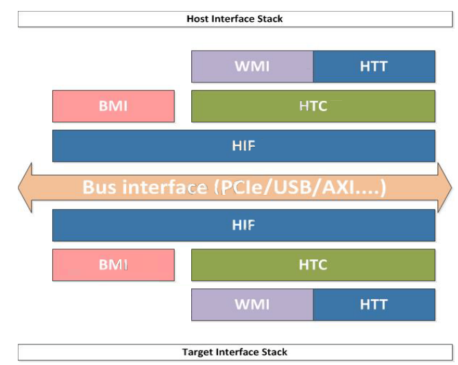

# qsdk WLAN驱动框架

## WLAN驱动中各个内核模块的作用

- asf.ko – 基本框架模块
- qdf.ko – 基本框架模块
- ath_spectral.ko – 支持Spectral
- ath_dfs.ko – 支持DFS
- umac.ko – 通用802.11协议管理
- ath_hal.ko – Direct-Attach硬件虚拟层
- ath_rate_atheros.ko – 支持Direct-Attach速率控制
- hst_tx99.ko – 支持Direct-Attach Tx99
- ath_dev.ko – Direct-Attach LMAC层
- qca_da.ko – 支持Direct-Attach驱动
- qca_ol.ko – 支持Offload驱动
- smart_antenna.ko – 支持Smart Antenna
- ath_pktlog.ko – 支持Direct-Attach Packet日志

## WLAN驱动模块适用范围

### 通用驱动模块
通用WLAN驱动模块用于Direct-Attach和Off-load芯片组，下面的模块都是必须的

- asf.ko
- qdf.ko
- ath_dfs.ko
- ath_spectral.ko
- umac.ko

### Direct-Attach驱动模块

以下这些模块只在Direct-Attach芯片组适用：

- ath_hal.ko

- ath_rate_atheros.ko

- hst_tx99.ko

- ath_dev.ko

- qca_da.ko

  

> 这些模块可以在umac.ko安装后使用。qca_da.ko集成了内核PCI子系统接口。
>
> 加载qca_da.ko后，才能识别Direct-Attach芯片组。

### Offload specific 驱动模块

- qca_ol.ko用于支持Offload芯片组

>其在umac.ko安装后使用。加载qca_ol.ko后，才能识别Offload芯片组。qca_ol.ko同时还支持NSS Wifi-Offload功能。

## 硬件抽象层(HAL)
硬件抽象层(HAL)是驱动和硬件芯片之间的连接部分。如果有多个芯片同时使用，例如双AP的形态，则每个芯片都会创建一个HAL实例与之对应，因此采用这样的设计，能使高通Atheros芯片和其他厂商的产品，在软件上能更容易的适配到一起。 HAL的代码可以分为两个大块

1. 通用HAL接口，为上层提供API与HAL交互；
2. 面向指定芯片的HAL模块，主要是支持具体的硬件。

目前高通Atheros芯片的HAL，主要有三个分支：AR5212, AR5416, 和AR9300。详述如下：

- 模块 AR5212

  本模块支持802.11b/g/a模式的legacy设备。通常，这些设备具有各自独立的PHY芯片组来与MAC芯片适配，所以对这些不同的PHY芯片组的支持也包含在本模块中。

- AR5416

  本模块支持第一、二、三代IEEE 802.11n芯片组，这其中包括：第一代AR5416芯片组（用于具有11n处理能力的PHY芯片），第二代AR91xx和第三代92xx系列芯片组（集成PHY和MAC到一个单一芯片中）。同时，本模块也支持1×1 AR958x芯片组。

- AR9300

  本模块支持AR93xx/AR958x系列芯片组。这些芯片组采用了先进的射频设计、新的MAC队列接口、并支持3空间流的MIMO操作。

> 注意：qsdk11.4 不是上面三个芯片组

抽象出来的HAL转接层，是尽可能的，面向不同的操作系统（OS）和不同系列的芯片时，进行代码复用。因此必须从HAL模块内部去调用这些函数，就显得尤为重要；

同时HAL内部也不应该使用一些链接性质的代码，因此这里使用`ah_hal_printf`函数来代替printk函数，用`HDPRINTF`宏代替`DPRINTF`宏。

## 底端MAC层 (LMAC)

LMAC层包含Atheros设备对象(ATH)。ATH层负责管理硬件的输入队列数据流，同时也管理着底层的协议，比如Block ACK（BA）处理。

之所以设计LMAC层，是因为有Atheros硬件架构需要适配，而UMAC则更接近802.11协议的实现。 LMAC主要提供以下功能，并由UMAC和OSIF层控制：

- 整合了legacy和11n芯片组的传输、接收路径，包括缓冲区和队列的处理。

- 速率控制、DFS、频段扫描。

- 高级11n MAC特性如帧聚合（frame aggregation）、缩短帧间间隙（RIFS）、多路收发节电技术（MIMO power save）等。

- 802.11网络节能和设备电源状态（D0-D3）管理。

- Beacon帧的生成和时间同步（TSF）管理。

- 支持无线唤醒（Wake-On-Wireless）。

- RfKill、自定义LED和GPIO算法。

- 提供支持IQUE, 无线声传（VoW）, 智能天线（Smart Antenna）,传输波束成形技术（TxBF）等功能的开关。

  

## 上端MAC层 (UMAC)

Upper MAC重要实现802.11协议的处理，并为OS接口层提供API。其主要功能有以下几点：

- AP状态机

- 连接状态机和节点管理

- MAC子层管理实体（MLME）服务 一些基本功能比如：扫描（scanning），加密（encryption），电源管理（power management），域管理（regulatory domain），资源管理（resource management）等。

- 与许多协议相关的特定功能如：P2P，通道直接链路建立（TDLS），WMM-AC，无线资源管理（RRM）等。

- 支持一些集中控制式的工作模式如WDS和EXTAP等。

- 提供支持访问控制列表（ACL），自选信道（ACS），IQUE，无线声传（VoW），智能天线（Smart Antenna），传输波束成形技术（TxBF）等功能的开关。

  

## 系统接口层 (OSIF)

系统接口层是系统适配的模块，为WLAN驱动提供网络协议栈接口和应用向的接口。这一层使用UMAC提供的API来完成其提供的功能。每个系统都应该适配自己的接口层。

## 高通驱动架构层(QDF)

这部分代码，提供了一整套驱动相关的接口，方便适配不同的操作系统。这是一个抽象层，由驱动调用，提供诸如创建timer、tasklet等功能。这个抽象层可以灵活的修改去适配不同的操作系统。本文档使用的操作系统是Linux 2.6。 任何硬件相关的和系统相关的，不属于OSIF层的内容，应当放到这一层（QDF）。另外，如果扩展了一些新的接口，也要确保这些函数包含在QDF层的文件中。

## Atheros服务架构层 (ASF)

这一部分的代码，提供了一些列基本服务相关的接口，方便对不同操作系统的适配。这一层提供了一些基本服务的接口，如内存相关接口、debug相关接口等。这个抽象层可以灵活的修改去适配不同的操作系统。本文档使用的操作系统是Linux 2.6。

## WLAN应用层（WLAN Application）

- Wireless LAN应用层运行在用户空间，其包括以下内容

  - Wireless工具：用于WLAN驱动的配置

  - apcfg：AP平台的配置文件

  - hostapd：AP模式下的802.1X/WPA/WPA2/EAP鉴权，以及WPS。

  - wpa_supplicant：STA模式下的802.1X/WPA/WPA2/EAP鉴权，以及WPS。

  - radartool：radar检测的测试/调试工具。

  - Spectral守护进程。

  - spectraltool：配置/调试spectral扫描的工具。

  - athssd：一个用于导出Spectral扫描和分析结果的工具，还可以输出干扰信息。

  - pktlog：采集WLAN MAC收发包的debug信息。

    

## 统一WLAN软件架构（Unified Software WLAN Architecture）

主要是在AP和STA模式下，对高吞吐量（VHT）场景的软件结构，有一个更详细的介绍。这些统一提出的栈一样的分层，支持所有的QCA软件结构，不论用户采用何种方式集成他的AP软件系统（direct attach模式或者Full/Partial offload模式）。

Offload模式分层（Offload stack）如下图： 

- OS接口层（OS Interface）：为WLAN驱动提供网络栈和应用向的接口。
- WSI层：WLAN Service API，由UMAC封装，供OSIF层调用（避免直接访问UMAC的数据结构）。
- UMAC层：多数802.11协议在这一层实现（AP状态机，连接状态机，MLME服务） 目标UMAC：处理低级别的MAC功能。管理数据流（Tx和Rx）到硬件的输入队列中，buffer管理，速率控制，Aggregation，MIMO节能。
- WAL层：对不同MAC的高级别的功能的抽象
- HAL层：硬件抽象层，实现底层的硬件功能，如创建descriptor，创建加密key，创建channel等。
  

## Unified UMAC支持项

- 新的结构基于间接化的函数指针的动态链接，同时支持direct attach和offload解决方案。
- 在direct attach方案中，使用的是旧有的IF_LMAC函数指针。而在offload结构中，使用的是OL_WMI函数指针。
- UMAC封装的功能（函数）可以根据需要进行开启或关闭，不论在主机端运行还是在目标端运行。
  基于当前这种模块化的架构，新的offload WMI层可以很容易的继承进去。

## 11AC offload host-target interface

Host与target之间通过这些已经划分好的各个软件接口层，协作通信。本章节介绍的就是这些软件接口层

Host接口层 (HIF) 这一层对host和target之前的总线接口进行抽象，并提供了一套二者可以互相通信的机制。

## Bootloader消息接口层(BMI)

在初始化过程中，host可以使用Bootloader消息接口层(BMI)提供的一些功能，比如获取target的版本信息；从target的内存中上传（或读取）一些代码和数据；读/写target寄存器；运行target上指定地址的程序等。BMI层可以下载指定的应用程序、测试程序还有补丁到代码和数据中，有时候也会设置一些target应用程序中的全局变量。

## Host Target通信层 (HTC):

HTC层用于WMI和HTT二者进行发送、接收一些控制类/数据类消息，这些消息的源头的目的是target和host系统的11ac设备之间的纽带部分。

## 无线消息接口层(WMI)

Host与target之间的控制通路由WMI接口来完成。一些预先定义好的WMI消息，用于host WLAN与target WLAN之间交互。

## Host Target传输层(HTT)

Host与target之间的数据通路由WMI接口来完成。一些预先定义好的HTT消息，用于host WLAN与target WLAN之间交互。