# 高通QSDK Qos章节翻译

## 15.7 Qos 802.11章节

采用高通公司802.11x技术的（SoC）包括Wi-Fi子系统、网络子系统（NSS）和CPU子系统。它还包含三个数据平面可以转发流量和完成分组服务质量（QoS）。

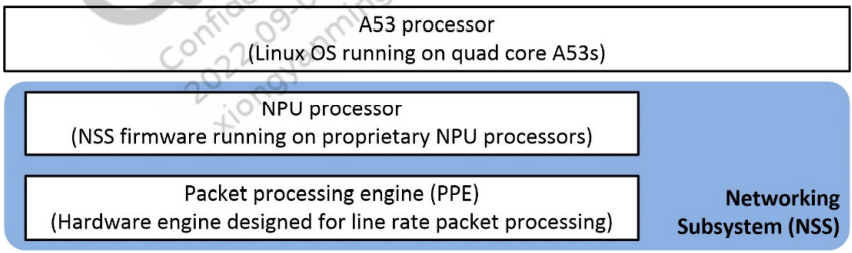

IPQ807x/IPQ807xA/IPQ817x and IPQ60xx/IPQ50xx/QCN90xx/QCN602x +  IPQ807xA/IPQ60xx/IPQ50xx has three layers of data plane

- A hardware packet processing engine (PPE)：硬件包处理引擎
- A software packet processing engine (NPU) ：软件包处理引擎
- The operating system：操作系统

**出口和入口Qos (Egress and ingress QoS)**

这个章节介绍Qos在Nss层面的一些说明

- 出口 Qos 队列和调度规则，总是在Interface 发送前完成

- 入口QoS的数据包分类规则按照入口的线性速率进行分类，以确保高优先级数据包不会被丢弃，

  当系统承受压力下降时

### 15.7.1 Linux sk_buff

在Linux系统中，`sk_buff`结构代表流经kernel的数据包，在该结构中有个关于NSS Qos的关键字段`skb->priority`。字段介绍如下

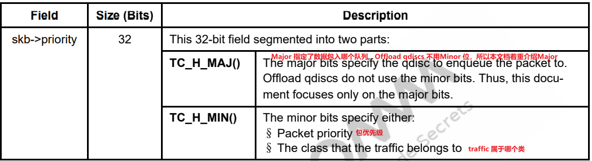

### 15.7.2 NSS 驱动(qca-nss-drv)

NSS驱动（qca-nss-drv）通过内部提供的api为NSS服务。内核可加载模块在系统启动的时自动加载，并通过消息和APIs调用去设置NSS Qos offload。用户不需要直接用这些APIs或者消息，该功能用标准的qdisc实现抽象，在linux系统中类似于一个代理，可以去设置Qos。

### 15.7.3 iptables

Linux中的iptables机制用来处理 packets(报文)和connections(链接):

- Conntrack将数据包与连接相关联，从而可以更深入地理解所检查的数据包
- Netfilter将挂接到内核的数据包流中的位置，以监视数据包

Netfilter可以匹配数据包头的字段，对数据包进行分类。它还提供了多个targets类型，用来设置Qos的匹配。QoS最有用的targets类型是CLASSIFY，它根据数据包字f skb->priority匹配对应的数据包。

###  15.7.4 Egress QoS

#### 15.7.4.1 Linux qdisc and traffic control (tc) kernel framework

Linux控制框架由一个用户空间iproute2 tc命令行界面和几个提供的队列规程（qdisc）组成。qdisc内核模块可以对数据包执行不同类型的QoS算法。这些模块注册到Linux框架，该框架允许它们公开Netlink API以进行设置、拆卸和配置。以多种方式配置qdisc；最标准的方法是在运行时使用tc在接口上创建、销毁和更改qdisc配置。

#### 15.7.4.2 NSS qdisc (qca-nss-qdisc）

内核模块`qca-nss-qdisc`NSS驱动，支持的所有QoS算法。它和标准Linux qdisc一样，以相同的方式注册到Linux QoS框架。当被调用时，它通过与NSS驱动程序交互来设置QoS子系统。因为tc是与qdiscs对话的标准工具，所以它被高通修改，并支持NSS qdiscs（高通自定义的队列算法）。配置命令步骤如下：

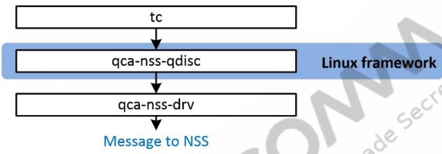

#### 15.7.4.3  NSS offload qdiscs: NPU vs. PPE

在NSS中，qdisc表示NSS中运行的QoS算法，不被NPU或PPE编码。当qca-nss-qdisc收到创建一个 offload qdisc的命令时，它执行流程如下：

- 首先尝试在PPE硬件中创建它（因为它是最快的）
- 如果没有可用的PPE硬件资源，它将尝试在NSS-FW中创建它
- 如果 in either data plane中没有可用的资源，则命令返回失败

该过程简化了用户的QoS配置，因为它抽象了the two data planes。但是，未来的版本将允许用户根据配置创建qdisc。

**qca-nss-qdisc algorithms**：下面列举了一些队列的算法支持情况：


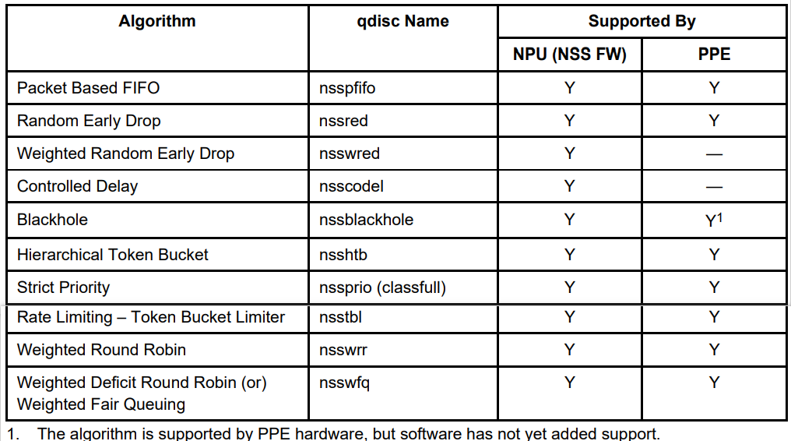

**注意：在IPQ807x/IPQ807xA/IPQ817x上使用QoS offload功能的约束**

- 每种offload qdisc类型数量是有限的。NSS子系统内决定了这一限制。
- 桥接口支持上的QoS offload 仅限于单个桥接口。
- Hybrid QoS（允许QoS树部分在PPE中，部分在软件中的功能）仅在Ethernet interfaces受支持，而在bridge interface接口上不受支持。
- NSS offload qdisc无法连接到在Linux中运行的接口，并且在NSS中没有表示。一个例子是在主机模式下运行的Wi-Fi驱动程序。对于此类用例，请使用标准的Linux qdisc。


#### 15.7.4.4 Configure egress QoS

##### Configure QoS using tc：用tc命令配置tc

使用tc命令行工具设置、删除或配置出口(egress)QoS算法在network interfaces上。本节举例说明使用tc配置出口QoS的示例。
**注**：这些示例命令是标准tc命令，并非高通技术公司软件专用。唯一的区别是使用的qdisc名称是NSS offload qdisc，而不是标准的Linux qdisc。

##### Set up rate limiting ：设置上限速率限制

这个例子设置eth0 接口 速率上限用NSS offload qdisc。

```bash
tc qdisc add dev eth0 root handle 1: nsstbl rate 1Mbit burst 30K
tc qdisc add dev eth0 parent 1: handle 10: nsspfifo limit 100 set_default
```

这些命令创建了Qos hierarchy 用来限制速率，在eth0接口上：

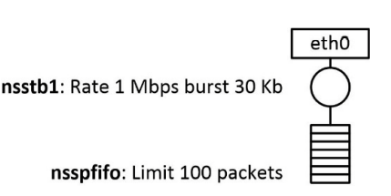

第一个命令解释如下：

- 在eth0上增加一个nsstbl类型的qdisc
- 设置根队列句柄handle为 `1:`    注：设置handle的格式为`<qdisc_id>:<class>`
- 因为nsstbl是一个qdisc，并不是一个class，先忽略class portion of the handle
- 设置rate和burst 整形流经eth0的packets

每个Qos hierarchy必须以leaf node结尾，第二个命令解释如下：

- 使用nsspfifo队列规则 应用到nsstbl队列上
- 在父句柄`1:`上创建nsspfifo类型的队列 `10:0`，未匹配的数据默认走`set_default`

##### Reconfigure qdisc parameters

如果想改变配置，请使用tc的change命令：

下面这个例子改变nsstbl 速率从1Mbps 为 10Mbps

```bash
tc qdisc change dev eth0 root handle 1: nsstbl rate 10Mbit burst 30K
```

用`stats`命令读当前的配置，检测修改是否生效。

##### Display the configuration and statistics of a QoS hierarchy 

```bash
tc -s qdisc show dev <if-name>
tc -s class show dev <if-name>
```

例子

```
tc -s qdisc show dev eth0
```

下面的命令输出显示**nsstbl**的配置和状态。

```
qdisc nsstbl 1: root refcnt 2 buffer/maxburst 30Kb rate 1Mbit
 Sent 196 bytes 2 pkt (dropped 0, overlimits 0 requeues 0)
 backlog 0b 0p requeues 0
qdisc nsspfifo 10: parent 1: limit 100p set_default
 Sent 196 bytes 2 pkt (dropped 0, overlimits 0 requeues 0)
 backlog 0b 0p requeues 0
```

##### Delete (tear down) a QoS hierarchy

删除inetface上的Qos hierarchy 。

```bash
tc qdisc del dev <inetface name> root
```

##### QoS on Ethernet interfaces

PPE hardware drives 在IPQ60xx/IPQ50xx and QCN61xx + IPQ50xx/QCN90xx/QCN602x +  IPQ807xA/IPQ60xx/IPQ50xx/IPQ807x/IPQ807xA/IPQ817x Ethernet interfaces，这章节显示Qos在不同的data planes时traffic的流程。

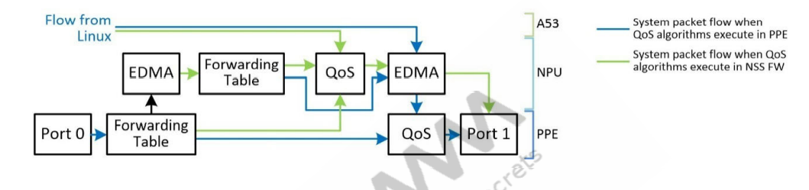

| 配置                     | 解释                                                         |
| ------------------------ | ------------------------------------------------------------ |
| QoS offloaded  in PPE    | 流经PPE的数据包可以直接发送出去，无需重定向（因此，它们可以达到线路速率）。通过NPU和Linux的流被传递到PPE QoS块，在通过出口端口传输之前，PPE QoS块对其进行整形 |
| QoS offloaded  in NSS-FW | 流经PPE的数据包被转移到NPU进行整形，然后重新注入PPE进行传输。NPU流正常通过，Linux流在进入PPE之前通过NSS-FW QoS。 |

##### QoS on a bridge interface

系统支持Qos在一个bridge interface。其配置方式与Ethernet  interfaces相同。然而bridge interface上的QoS存在某些限制：

■ 与以太网接口相比，桥接接口PPE支持的QoS级别数量少了一个。

Hybrid QoS（允许 QoS hierarchy一部分在PPE中执行，一部分在NSS-FW中执行）在bridge interface中不受支持，此特性仅限于 Ethernet  interfaces。

##### QoS on a Wi-Fi interface

| mode                          | 解释                                                         |
| ----------------------------- | ------------------------------------------------------------ |
| NSS offload and redirect mode | 如果wifi驱动是NSS offload或者redirect模式，系统支持在wifi接口上进行NSS offload qdisc 操作 |
| Host mode                     | 在host模式下，系统不支持在wifi接口使用NSS offload qdisc 操作，要使用标准的Linux qdisc |

#### 15.7.4.5 NSS QoS offload support

这个章节介绍Qos 算法 在可以offload的NSS上，介绍配置结构、tc命令示例、和qdiscs参数。

注意：下面标记*****的是必填字段，是 配置qdisc必须的

##### qdiscs supported in PPE and NPU

- NSSFIFO

  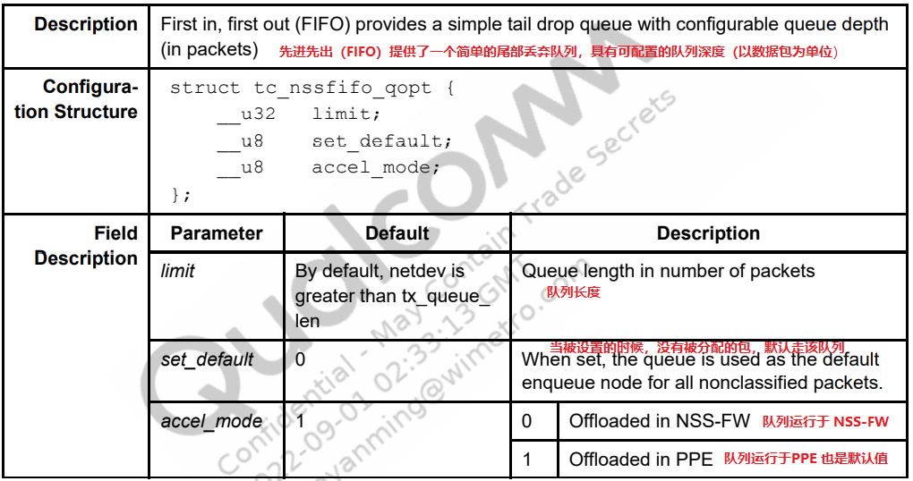

  tc命令示例：

  - 如果需要对未分类的报文进行排队，请设置队列长度为100 packets

    ```bash
    #在eth0上创建一个nsspfifo类型的根队列
    tc qdisc add dev eth0 root nsspfifo limit 100 set_default
    ```

  - 错误范例

    在接口eth0上，将队列长度设置为50个数据包和句柄（ID）`10:0`。此FIFO队列未设置为默认队列，并且由于此接口没有默认队列，因此数据包无法发出。

    ```bash
    tc qdisc add dev eth0 root handle 10: nsspfifo limit 50
    ```

  

- NSSRED

  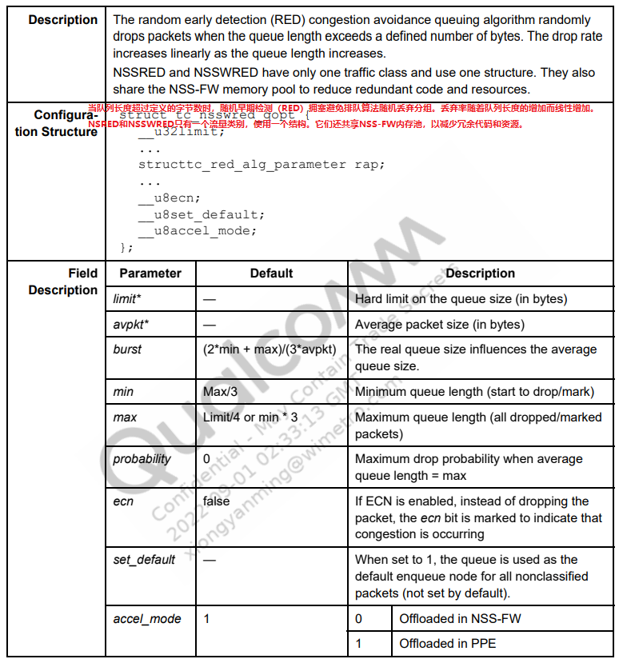

  tc命令示例

  - 在根队列`1：`上创建nssred类型队列`10：` ，在队列长度>30000字节时开始丢弃。
  -  将队列长度为80000字节时的最大丢弃概率设置为50%。
  - 将qdisc设置为默认的入队节点。

  ```bash
  tc qdisc add dev eth0 root handle 1: nsstbl rate 800Mbit burst 10k
  tc qdisc add dev eth0 parent 1: handle 10: nssred limit 40000 min 3000 max 8000 avpkt 1000 burst 55 probability 0.50 set_default
  ```

  

- NSSBLACKHOLE

  

  tc命令示例

  设置所有通过eth0的数据包丢弃

  ```
  tc qdisc add dev eth0 root nssblackhole set_default
  ```

  

- NSSHTB

  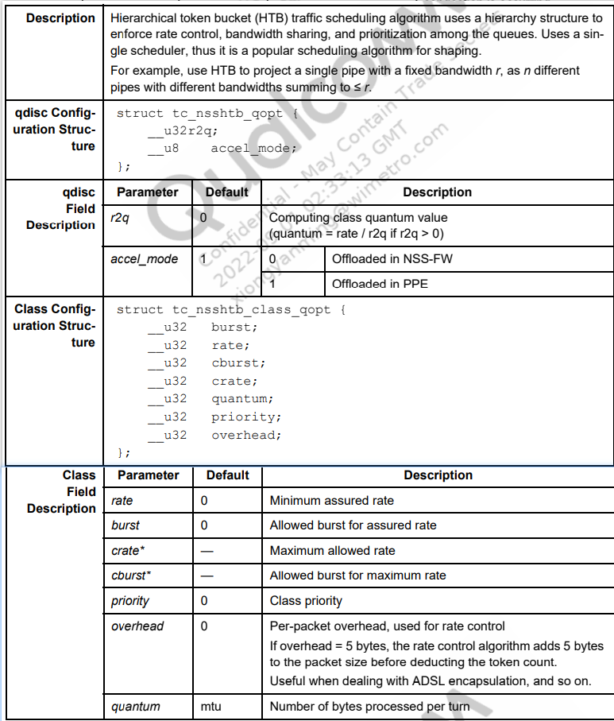

  **tc命令示例**

  下面例子是创建带有三个leaf nodes的NSSHTB树结构，每个又设置不同的参数

  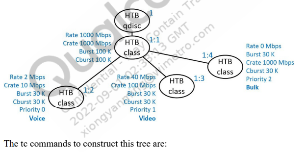

  ```bash
  # 在eth0上 创建根队列 1:0 使用 nsshtb r2q 值为20
  tc qdisc add dev eth0 root handle 1: nsshtb r2q 20
  
  #创建class 1:1 并控制可以通过此接口的全局流量速率
  tc class add dev eth0 parent 1: classid 1:1 nsshtb rate 1000Mbit crate 1000Mbit burst 100k cburst 100k
  
  #在class1:1下  创建三个不同的leaf node 分别 1:2 1:3 1:4 每个配置处理不同类型的流量
  tc class add dev eth0 parent 1:1 classid 1:2 nsshtb rate 2Mbit crate 2Mbit burst 30k cburst 30k priority 0 #voice
  
  tc class add dev eth0 parent 1:1 classid 1:3 nsshtb rate 40Mbit crate 100Mbit burst 30k cburst 30k priority 1 #video
  
  tc class add dev eth0 parent 1:1 classid 1:4 nsshtb rate 0Mbit crate 1000Mbps burst 30k cburst 30k priority 2 #bulk
  
  #在 class 1:2 上创建nsspfifo类型队列200    voice流量用 
  tc qdisc add dev eth0 parent 1:2 handle 200: nsspfifo limit 100
  #在 class 1:3 上创建nsspfifo类型队列300    video流量用 
  tc qdisc add dev eth0 parent 1:3 handle 300: nsspfifo limit 100
  #在 class 1:4 上创建nsspfifo类型队列400    bulk流量用  且未经分类的包默认也走该队列
  tc qdisc add dev eth0 parent 1:4 handle 400: nsspfifo limit 100 set_default
  
  ```

  

- NSSTBL

  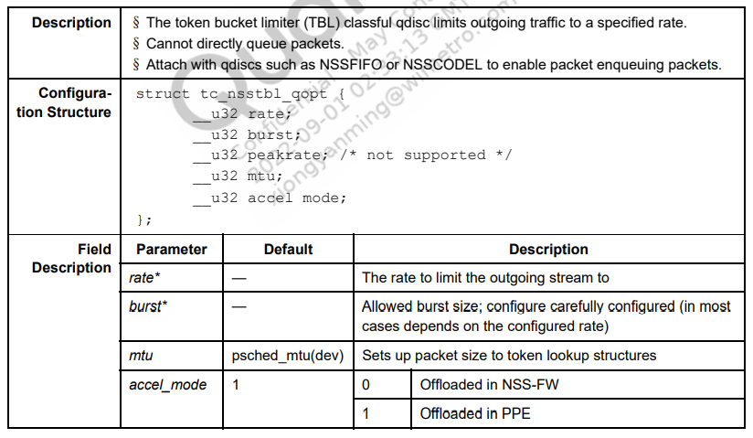

  TC 命令示例

  将接口eth0的发送速率限制为1MBps 最大突发为30kbytes 在根队列下 新增了一个新的子队列`10:` 队列规则为`nsspfifo`，且子队列限制为100个包。

  ```bash
  tc qdisc add dev eth0 root handle 1: nsstbl rate 1Mbit burst 30K
  tc qdisc add dev eth0 parent 1: handle 10: nsspfifo limit 100 set_default
  ```

  

- NSSPRIO

  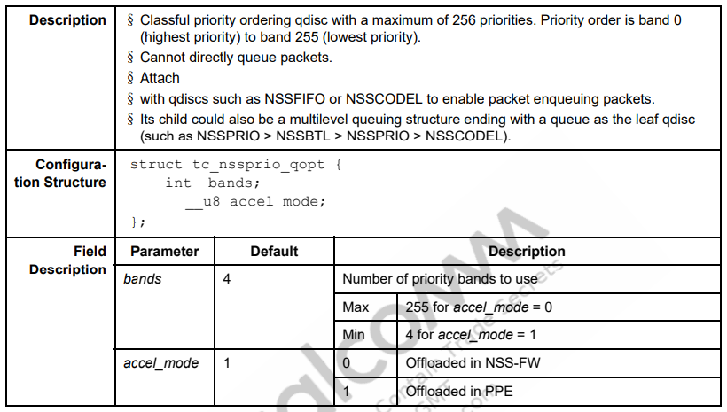

  **tc命令示例**

  这个例子设置br-lan口有三个优先级的band，然后将2个nsspfifo和一个nsscodel队列作为根队列的子节点（nsscodel节点为默认队列）。

  ```
  tc qdisc add dev br-lan root handle 1: nssprio bands 3
  tc qdisc add dev br-lan parent 1:0 handle 10: nsspfifo limit 100
  tc qdisc add dev br-lan parent 1:1 handle 11: nsspfifo limit 50
  tc qdisc add dev br-lan parent 1:2 handle 12: nsscodel limit 100 tar-get 100ms interval 10ms set_default
  ```

  

- NSSWRR

  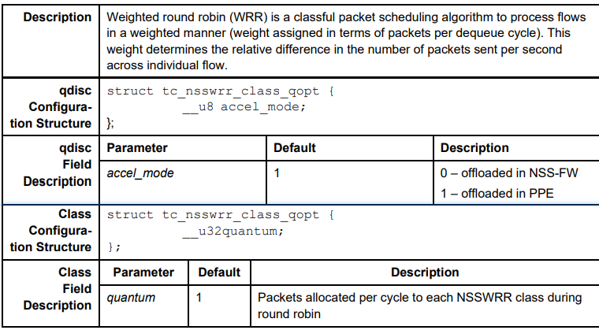

  **tc命令示例**

  为了在`100:0`和`200:0`队列间以`1:2`的比例共享流量，

  ```bash
  #根队列
  tc qdisc add dev eth0 root handle 1: nsstbl rate 500Mbit burst 30K mtu 1520
  #在根下创建一个nsswrr类型的队列 2: 
  tc qdisc add dev eth0 parent 1: handle 2: nsswrr
  
  #在2:下 创建两个class 2:1 和 2:2  且二者比例分配为10:20  即1:2
  tc class add dev eth0 parent 2: classid 2:1 nsswrr quantum 10
  tc class add dev eth0 parent 2: classid 2:2 nsswrr quantum 20
  
  #在class2:1下创建nsspfifo类型队列100: 限制100个包
  tc qdisc add dev eth0 parent 2:1 handle 100: nsspfifo limit 100
  #在class2:1下创建nsspfifo队列200: 限制100个包 且是默认队列
  tc qdisc add dev eth0 parent 2:2 handle 200: nsspfifo limit 100 set_default
  ```

  

- NSSWFQ

  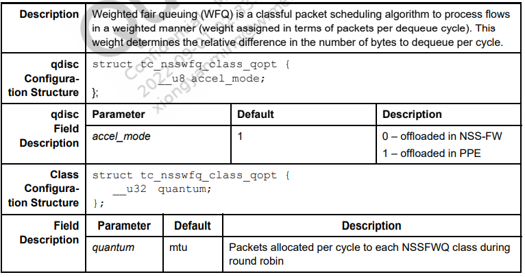

  **tc命令示例**

  要将NSSWFQ配置为在队列`100:0`和队列`200:0`之间以1:2的比例共享可用带宽，请使用子qdisc类型nsspfifo附加NSSWPQ类，队列限制为100个数据包。

  ```bash
  #根队列 1:0 类型为nsstbl
  tc qdisc add dev eth0 root handle 1: nsstbl rate 500Mbit burst 30K mtu 1520
  #根队列下创建 nsswfq类型的队列 2:0
  tc qdisc add dev eth0 parent 1: handle 2: nsswfq
  #在2:下 创建两个class 2:1 和 2:2  且二者比例分配为3000:6000  即1:2
  tc class add dev eth0 parent 2: classid 2:1 nsswfq quantum 3000
  tc class add dev eth0 parent 2: classid 2:2 nsswfq quantum 6000
  #在class2:1下创建nsspfifo类型队列100: 限制100个包
  tc qdisc add dev eth0 parent 2:1 handle 100: nsspfifo limit 100
  #在class2:1下创建nsspfifo队列200: 限制100个包 且是默认队列
  tc qdisc add dev eth0 parent 2:2 handle 200: nsspfifo limit 100 set_default
  ```

  qdiscs supported in NSS-FW only

- NSSCODEL

  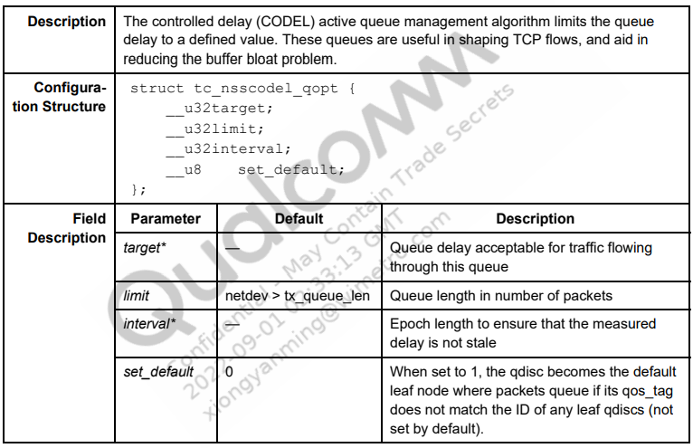

  **tc命令示例**

  将队列限制为100个数据包，队列延时为100ms 间隔为10ms 并将其设置在eth1上。

  ```bash
  tc qdisc add dev eth1 root nsscodel limit 100 target 100ms interval 10ms set_default
  #或者
  tc qdisc add dev eth1 root nsscodel limit 100 target 100000 interval 10000 set_default
  ```

  

- NSSWRED

  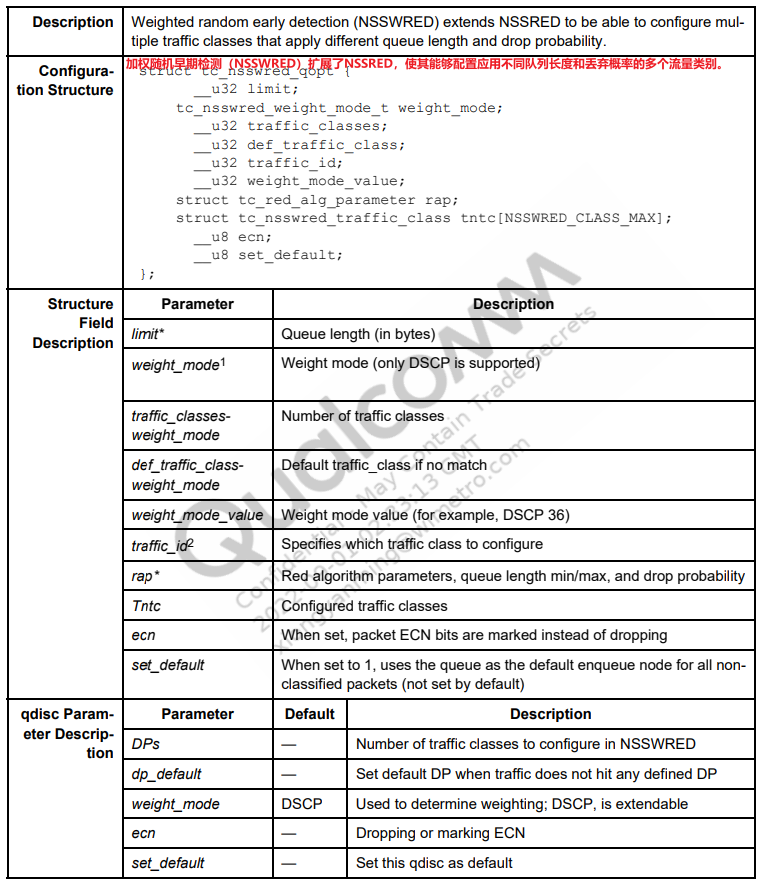

  **tc命令示例**

  1. 设置三个traffic classes 有相同的 min/max 队列长度，但有不同丢弃概率。

     -  DSCP value 30: max = 15000, min=45000, probability=0.00
     - DSCP value 40: max = 15000, min=45000, probability =0.4
     - DSCP value 46: max = 15000, min=45000 probability =0.99

     ```bash
     tc qdisc add dev eth0 root handle 1: nsstbl rate 600Mbit burst 30k
     tc qdisc add dev eth0 parent 1: handle 10: nsswred setup DPs 3 dp_default 1 set_default
     ```

     

  2. 设置每个traffic classes的参数

     ```bash
     tc qdisc change dev eth0 parent 1: handle 10: nsswred limit 150000 min 15000 max 30000 avpkt 1024 DP 1 dscp 36 probability 0.1
     
     tc qdisc change dev eth0 parent 1: handle 10: nsswred limit 100000 min 10000 max 20000 avpkt 1024 DP 2 dscp 40 probability 0.4
     
     tc qdisc change dev eth0 parent 1: handle 10: nsswred limit 50000 min 5000 max 10000 avpkt 1024 DP 3 dscp 44 probability 0.99
     ```

     

- todo

#### 15.7.4.6 Egress QoS resource limits

由于内存和成本的现在，NSS支持的算法有限，qdisc内核模块总是尝试在PPE中创建qdisc，然后在尝试在NSS-FW中创建，并获得尽可能的性能。

该表显示了NSS-FW和PPE两个data planes的支持各种类型的的节点数：

| 类型     | 说明                                                         |
| -------- | ------------------------------------------------------------ |
| shared   | 表中引用的数字为最大值。由于大多数offload qdisc共享公共资源，因此实际可用的数量因QoS层次结构不同而不同 |
| per_port | 大多数的PPE资源是按照per_port分配的                          |

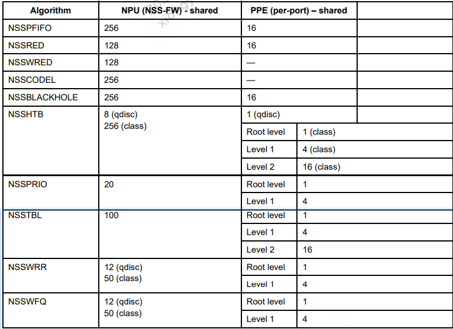

在PPE中，资源是分层分布的，每个级别的资源量决定了可offload 多少qdisc。该图以NSSHTB为例，显示了PPE中不同级别的分布情况：


如果qdisc配置在网桥接口（br-lan）上，而不是物理以太网接口（eth0、eth1）上，则PPE硬件仅支持root和level1（无level2）。上图用于以太网接口（Ethernet interface），下图用于网桥接口（bridge interface）。桥接接口没有level2，对于level1，bridge interface接口有16个节点，而Ethernet interface接口有4个节点。

如果您的QoS层次结构需要更多的深度，那么首先将NSSHTB qdisc配置为accel_mode=0。它在NSS-FW中配置QoS树，而NSS-FW没有对层次结构深度进行限制。此图显示了网桥接口PPE中不同级别的资源分布


#### 15.7.4.7 Classification

使用`iptables CLASSIFY` 规则，把流量引入到NSS offloaded 队列。

- 这个简单的用例是将DSCP值为46的包，优先于系统中其他的数据包

  ```bash
  iptables -t mangle -A FORWARD –m dscp --dscp 46 –o eth0 –j CLASSIFY --set-class 100:0
  iptables -t mangle -A OUTPUT –m dscp --dscp 46 –o eth0 –j CLASSIFY --set-class 100:0
  ```

  

- 这些tc命令设置了两个队列，`100:`和`200:`，其中`200:`作为默认队列，所有未分类的数据包都在其中排队。在此配置中，与队列`200:`相比，`100:`队列附加的优先级更高。与系统中的其他流相比，它确保以更高的优先级调度指向队列`100:`的流量（即，DSCP＝46的流）。

  ```bash
  tc qdisc add dev eth0 root handle 1: nssprio bands 2
  tc qdisc add dev eth0 parent 1:1 handle 10: nsstbl rate 10Mbit burst 30K
  tc qdisc add dev eth0 parent 1:2 handle 20: nsstbl rate 1000Mbit burst 30K
  tc qdisc add dev eth0 parent 10: handle 100: nsspfifo limit 100
  tc qdisc add dev eth0 parent 20: handle 200: nsspfifo limit 100 set_default
  ```

  

#### 15.7.4.8 Debugging

##### 通用的调试信息

| issue                           | 调试步骤                                                     |
| ------------------------------- | ------------------------------------------------------------ |
| 对于由于qos配置引入的稳定性问题 | 运行时去掉qos，先确保正常                                    |
| 对于在接口中丢弃数据包问题      | 确保队列被分配为默认队列，没有它，所有未分类的报文都将会丢弃 |
| 对于行为问题                    | 使用tc dump 保证参数正确                                     |

- dump qdisc的层级

  ```
  tc -s qdisc show dev <if-name>
  ```

  

- dump class 的层级

  ```
  tc -s class show dev <if-name>
  ```

  

- 要调试qdisc的创建 删除 和重新配置，打开动态打印

  ```bash
  echo "file nss_qdisc.c +p " > /sys/kernel/debug/dynamic_debug/control
  echo "file nss_<algorithm>.c +p " > /sys/kernel/debug/dynamic_debug/control 
  echo 8 > /proc/sys/kernel/printk
  ```

  


##### Common issues with bridge QoS

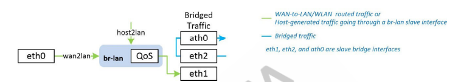

通常假设在 bridge interface接口上配置的QoS层次结构决定了桥接traffic。但是桥接traffic不通过 bridge interface接口上配置的QoS。

只有路由到bridge interface接口的流量才能通过网桥QoS层次结构。

通过网桥出口QoS的流量示例包括

- WAN-to-LAN / WLAN routed traffic 
- Host generated traffic going through one of br-lan slave interfaces

**Rate limit on bridge interface**

因为只有路由流量通过网桥QoS层次结构，所以必须为网桥设置的速率限制，必须等于WAN侧下行链路带宽。一个常见的错误是将该速率配置为等于网桥的所有接口速度之和。

**Correct configuration with rate and burst parameters**

确保child rate和突发之和burst parameters  小于等于 parent rate and burst parameters。

如果未正确配置，则QoS行为与预期不匹配。

下面是个错误的范例

parent burst限制不足以处理其所有子节点的 burst limits。此外， 所有child rates总和高于rate supported by the parent。

```bash
tc qdisc add dev eth0 root handle 1: nsshtb r2q 2000
tc class add dev eth0 parent 1: classid 1:1 nsshtb rate 500Mbit crate 500Mbit burst 30k crate 30k

#这里的400Mbit 有问题
tc class add dev eth0 parent 1:1 classid 1:2 nsshtb rate 400Mbit crate 500Mbit burst 30k crate 30k
#这里的400Mbit 有问题
tc class add dev eth0 parent 1:1 classid 1:3 nsshtb rate 400Mbit crate 500Mbit burst 30k crate 30k
tc class add dev eth0 parent 1:2 handle 200: nsspfifo limit 100
tc class add dev eth0 parent 1:3 handle 300: nsspfifo limit 100 set_default

```

下面是个正确的配置

```bash
tc qdisc add dev eth0 root handle 1: nsshtb r2q 2000
tc class add dev eth0 parent 1: classid 1:1 nsshtb rate 500Mbit crate 500Mbit burst 100k crate 100k
tc class add dev eth0 parent 1:1 classid 1:2 nsshtb rate 400Mbit crate 500Mbit burst 30k crate 30k
tc class add dev eth0 parent 1:1 classid 1:3 nsshtb rate 100Mbit crate 500Mbit burst 30k crate 30k
tc class add dev eth0 parent 1:2 handle 200: nsspfifo limit 100
tc class add dev eth0 parent 1:3 handle 300: nsspfifo limit 100 set_default
```

**Ensure that the bottleneck occurs at the QoS interface**

QoS  hierarchies 结构被配置为提供某种基本的保证，以保证对数据包如何丢弃以及哪个被赋予优先级。只有当瓶颈位于Qos层面的时候，这种保证才有效。

例如，如果订阅的WAN下行带宽为50 Mbps，则将网桥接口上的速率限制为略小于50 Mbps（例如48 Mbps）的值。如果将其设置为更高的值（如100 Mbps），则服务提供商路由器会发生掉线，因为这会导致由于下行链路速率的限制，下行链路业务的瓶颈。


在这种情况下数据包不在基于QoS优先级丢失。

### 15.7.5 Ingress QoS

网络系统的关键要求之一是对入口数据包进行分类和优先级排序（按线路速率），然后使用该信息在系统中的每个瓶颈处做出正确的丢弃决策。

在入口，PPE首先接收并处理所有以太网数据包。PPE中分类引擎所在的入口管道可以以10 Gbps（小数据包）的线路速率运行。因此，在到达任何瓶颈之前，所有通过线路的数据包都会被分类。此外，数据平面层之间的接口可以传递分组优先级，避免了重新分类的需要

##### 15.7.5.1  Bottlenecks

在流水线系统中，瓶颈往往发生在以不同速度运行的块之间。在高水平上，IPQ60xx/IPQ50xx和QCN61xx+IPQ50xx/QCN0xx/QCN602x+IPQ807xA/IPQ60xx/IPQ50xx/IPQ807x/IPQ807xMA/IPQ817x pipeline blocks为PPE、NPU和A53。因为它们以不同的速度运行，当数据包在不同的子系统移动的时候就会出现bottlenecks。

下图显示了pipeline blocks可能在rx和tx的bottlenecks

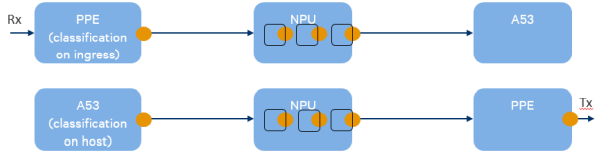

NPU固件是一个软件阶段的流水线，每个阶段都在自己的线程（小方框）中运行。这些软件管道阶段也往往存在数据包丢失的瓶颈。

**Prioritized queuing**

在每个瓶颈处最多可以启用四个级别的优先级，因此当数据包必须丢弃时，它将按优先级顺序丢弃。在默认配置中，在PPE到NPU接口和PPE Tx接口上启用优先级队列。默认情况下关闭的队列是NPU固件内部的队列。通过在qca-nss-drv模块参数中设置`pn_mq_en=1`来启用它们。

```bash
# 修改/etc/module.d/*-qca-nss-drv
qca-nss-drv pn_mq_en=1
```

##### 15.7.5.2 Classification

分类规则必须放在系统的两个位置：

- 进入PPE以按线路速率对所有传入数据包进行分类
- 在Linux中，对从主机生成或通过主机传输的数据包进行分类

###### Classifying in PPE

PPE有以下机制对入口的数据包进行分类：

■ 访问控制列表（ACL）是最常用的方法。编程此通用分类引擎以匹配各种数据包标头字段或用户定义的自定义字段。

可以对匹配执行许多操作，例如设置数据包优先级值。

■ PPE中的DSCP查找表。由于此表大小为64，用户可以根据需要匹配所有可能的DSCP值。当分类完全基于DSCP值时，此功能非常有用，因为它保存了可用于其他目的的ACL条目，并且编程更简单。

■ PCP查找表的操作与DSCP表相同，但与L2 PCP位匹配

有关这些表以及如何配置它们的更多信息，请参阅PPE和SSDK文档。

###### Classifying on host

host驱动程序考虑Rx和Tx上的Linux skb->priority。

- 在从NPU到主机的Rx上，主机NSS驱动程序将数据包优先级值从描述符复制到skb->priority中。
- 在从Linux到NPU的Tx上，主机NSS驱动程序确保skb->priority通过描述符传递给NSS固件

因此，用户必须确保主机数据包上的skb->priority设置为正确的值。各种各样的Linux工具允许用户设置该值，例如在iptables中使用--set类目标

```
iptables -t mangle -A FORWARD --destination 192.168.1.241 -j CLASSIFY --set-class 0:3
iptables -t mangle -A OUTPUT --destination 192.168.1.241 -j CLASSIFY --set-class 0:3
```

**注意**：转发时，Linux网络堆栈将基于skb->priority覆盖，从而导致来自PPE的优先级信息丢失。因此，用户必须

要么使用iptables规则对Linux转发的流量进行重新分类，要么禁用skb->priority，在Linux中使用以下方法覆盖：

```bash
echo 0 > /proc/sys/net/ipv4/ip_use_legacy_tos
```

###### Packet prioritysh

系统总共支持四个优先级，0是最低优先级，3是最高优先级

##### 15.7.5.3 Configuration details

通过qca-nss-rv.ko模块的模块参数启用入口优先级。必须重新启动系统才能禁用/启用此功能。

1. To enable ingress priority

   - 编辑/etc/module.d/*-qca-nss-drv 

     ```bash
     #编辑/etc/module.d/*-qca-nss-drv 
     qca-nss-drv pn_mq_en=1 
     ```

   - Reboot the system

2. To disable ingress priority

   - ```
     Remove pn_mq_en=1 from /etc/module.d/*-qca-nss-drv.
     ```

   -  Reboot the system.

   每个优先级队列的队列大小可通过qca-nss-drv.ko的模块参数进行配置。编辑：`/etc/module.d/*-qca-nss-drv`到：

   ```bash
   qca-nss-drv pn_mq_en=1 pn_qlimits=512,512,512,512
   ```

   仅当设置了pn_mq_en时，队列限制参数才有效。在此示例中，队列所有四个优先级队列的限制设置为512个数据包。


##### 15.7.5.4 Debugging

`/sys/kernel/debug/qca-nss-drv/stats`文件夹包含各种系统调试统计信息。

丢弃的数据包计数统计信息已被扩展，以显示每个优先级队列的数据包丢弃情况。

此示例输出用于NSS固件中的eth_rx节点：

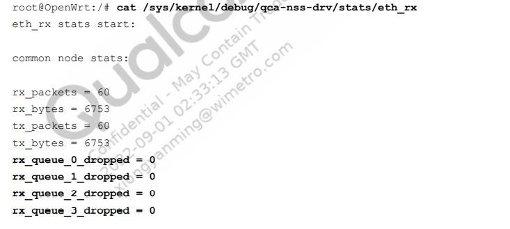


## 文档编号YA-768-6

### 8.4.1 Configuration for Inter BSS traffic separation

Inter BSS traffic separation can be achieved using Linux kernel firewall with iptables and ebtables  user-space utility program. 

1. 修改`/etc/config/network`

   Add eth0 (WAN interface)to lan interface list, and remove it from wan and wan6  interfaces

   ```bash
   #当下面为1的时候，skb中存在physin和physout的接口信息，此时iptables规则可以使用-m physdev --physdev-in 和-m physdev --physdev-out去匹配物理接口。
   #当下面为0的时候skb中没有physin和physout的接口信息，此时iptables规则无法使用-m physdev --physdev-in 和-m physdev --physdev-out去匹配物理接口
   
   sysctl -w net.bridge.bridge-nf-call-ip6tables=1
   sysctl -w net.bridge.bridge-nf-call-iptables=1
   ```

   

2. 修改/etc/config/firewall

    Remove ECM rule in firewall to forward all bridge packets

   ```bash
   #config include 'qcanssecm'
       # option type 'script'
       # option path '/etc/firewall.d/qca-nss-ecm'
       # option family 'any'
       # option reload '1'
   ```

   

3. 修改/etc/firewall.user

   Note: Modify ath11 to any other interface name based on the guest-VAP to isolate, in the below  commands.

   ```
   iptables -I FORWARD -m physdev --physdev-in ath2 ! --physdev-out eth1 --physdev-is-bridged -j DROP
   iptables -I FORWARD -m physdev ! --physdev-in eth1 --physdev-out ath2 --physdev-is-bridged -j DROP
   ```

   Note: These rules should be inserted using -I option as shown

4. 重启网络和防火墻

   ```
   /etc/init.d/network restart
   /etc/init.d/firewall restart
   ```

   

5. todo

### 22.8 Improved VoW performance with DSCP-to-priority mapping in NSS

在NSS中使用DSCP到优先级映射提高VoW性能。

在NSS中实现优化以提高VoW性能。本节描述了基于IP报头中的DSCP值跳过NSS中高优先级数据包加速的软件设计。

由于数据流的加速会导致数据流中少数数据包的数据包重新排序，因此在某些运行视频或语音流量的测试用例中，会导致数据包丢失。没有办法消除这种数据包重新排序，解决这个问题的唯一方法是跳过这些数据流的加速。

此增强功能引入了NSS驱动程序、NSS固件和ECM的更改。用户在procsys中创建映射表，并通过消息传递接口将其传递给NSS固件。


#### 22.8.1 NSS driver

NSS驱动程序是使用默认映射创建映射表并在运行时由用户更改的地方。Procsys用于存储表。该表将0-63之间的DSCP值映射到某些操作和优先级值。

ECM使用Action值来决定流量是否加速。NSS固件使用Priority来决定当发送到主机的数据包，是使用high limit队列还是normal队列。

- Action values

  ```
  enum nss_ipv4_dscp_map_actions {
      NSS_IPV4_DSCP_MAP_ACTION_ACCEL,
      NSS_IPV4_DSCP_MAP_ACTION_DONT_ACCEL,
      NSS_IPV4_DSCP_MAP_ACTION_MAX,
  };
  enum nss_ipv6_dscp_map_actions {
      NSS_IPV6_DSCP_MAP_ACTION_ACCEL,
      NSS_IPV6_DSCP_MAP_ACTION_DONT_ACCEL,
      NSS_IPV6_DSCP_MAP_ACTION_MAX,
  };
  ```

  

- Priority values

  ```
  0 – normal priority
  1 – high priority
  ```

表的格式如下:

```bash
DSCP Action Priority
0 		0 		1
1 		0 		1
... 	... 	...
38 		1 		0
... 	... 	...
46 		1 		1
... 	... 	...
63 		0 		1
```


IP标头的DSCP字段为6位，因此它可以获得高达63的值。action和priority的默认值分别为0和1，这意味着ACCEL和Best Effort。

这个表存储位置为

```bash
/proc/sys/dev/nss/ipv4cfg/ipv4_dscp_map #– for configuring IPv4 traffic
/proc/sys/dev/nss/ipv6cfg/ipv6_dscp_map #– for configuring IPv6 traffic
```

比如想要查看ipv4的表如下：

```bash
root@OpenWrt:/# cat /proc/sys/dev/nss/ipv4cfg/ipv4_dscp_map
priority: 0 0 0 0 0 0 0 0 0 0 0 0 0 0 0 0 0 0 0 0 0 0 0 0 0 0 0 0 0 0 0 0 0 0 0 0 0 0 0 0 0 0 0 0 0 0 0 0 0 0 0 0 0 0 0 0 0 0 0 0 0 0 0 0
action:   0 0 0 0 0 0 0 0 0 0 0 0 0 0 0 0 0 0 0 0 0 0 0 0 0 0 0 0 0 0 0 0 1 0 0 0 0 0 0 0 0 0 0 0 0 0 0 0 0 0 0 0 0 0 0 0 0 0 0 0 0 0 0 0
```

如果想要修改这些映射值

```bash
#<dscp>		:0~63
#<action>	:0:加速   1不加速
#<priority>	:0：Normal队列   1：High 也就是Best Effort队列
echo <dscp> <action> <priority> > /proc/sys/dev/nss/ipv4cfg/ipv4_dscp_map

# eg echo 46 1 1 > /proc/sys/dev/nss/ipv4cfg/ipv4_dscp_map
```

#### 22.8.2 NSS firmware

在NSS固件中，创建了一个名为pkg/dscp2pri的新软件包。这是一个助手包，pkg/ipv4_rx和pkg/ipv6_rx使用它来存储和检索DSCP到优先级的映射。带有映射的配置消息直接由pkg/ipv4_rx和pkg_ipv6_rx接收。在ipv4_rx包中，当流到达包并且连接查找未能找到该流的连接匹配项时，将IP标头中的DSCP值与该值的优先级映射进行比较，如果该值为非零，则通过具有HIGH_LIMIT阈值的异常路径转发流。因为检查是在慢速路径代码中完成的，所以UDP超快路径性能不会受到影响。目前，仅对UDP进行检查。它可以很容易地应用于其他协议。

#### 22.8.3 ECM

ECM根据表中的动作值跳过加速度。它没有使用优先级值。

在前端文件的IP处理函数中，在创建连接规则之前，将提取数据包的DSCP字段。从映射表中读取此DSCP的操作值。如果是“NSS_IPV4/6_DSCP_MAP_ACTION_DONT_ACCEL”，则代码只返回。数据包未加速。

目前，仅对UDP进行检查。它可以很容易地应用于其他协议。如果用户希望更改表中的默认映射并在设备的每次引导中查看这些值，则可以将默认echo命令放置在ECM的启动脚本中。这是表达这些价值观的最佳场所。有关设置示例，请参见以下行

```
# /etc/init.d/qca-nss-ecm 脚本修改如下
start() {
    load_ecm
    # If the acceleration engine is NSS, enable wifi redirect.
    [ -d /sys/kernel/debug/ecm/ecm_nss_ipv4 ] && {
        sysctl -w dev.nss.general.redirect=1
        
        #
        # echo <dscp> <action> <priority>
        # dscp: 0 t o63
        # action: 0 – 1 (0:Accel, 1:Do not accel)
        # priority: 0 – 1 (0:Normal, 1:High)
        #新增内容
        echo 38 1 0 > /proc/sys/dev/nss/ipv4cfg/ipv4_dscp_map
        echo 38 1 1 > /proc/sys/dev/nss/ipv6cfg/ipv6_dscp_map
        echo 46 1 0 > /proc/sys/dev/nss/ipv4cfg/ipv4_dscp_map
        echo 46 1 1 > /proc/sys/dev/nss/ipv6cfg/ipv6_dscp_map
    }
    support_bridge && {
        echo 'net.bridge.bridge-nf-call-ip6tables=1' >>
        /etc/sysctl.d/qca-nss-ecm.conf
        echo 'net.bridge.bridge-nf-call-iptables=1' >>
        /etc/sysctl.d/qca-nss-ecm.conf
    }
}
```


#### 22.9.5 wifitool commands for distributed VoW

要启用VoW配置和FW VoW统计信息的收集，请输入以下UCI命令。这是运行shell脚本以查看VoW统计信息的先决条件

```bash
uci set wireless.qcawifi=qcawifi
uci set wireless.qcawifi.carrier_vow_config=1
uci set wireless.qcawifi.fw_vow_stats_enable=1
```


## 文档编号YA-768-5

### 8.18.1 Select acceleration engine using UCI command

选择加速引擎，用UCI的配置：`/etc/config/ecm`

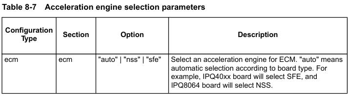

shell脚本`/etc/init.d/qca-nss-ecm`读取ecm UCI配置，并将`acceleration_engine` UCI选项转换为`front_end_selection`内核模块参数。用户可以更改前面的UCI配置，然后运行`/etc/init.d/qca-nss-ecm restart`命令为ecm选择不同的加速引擎。

### 8.18.2 Select acceleration engine automatically

要使ECM能够根据电路板类型选择加速引擎，请执行以下操作：

1. 使用以下UCI配置配置DUT：

   ```bash
   ecm.global=ecm
   ecm.global.acceration_engine='auto'
   ```

2. 通过输入以下命令重新启动ECM：

   ```
   /etc/init.d/qca-nss-ecm restart
   ```

   

3. 检查目录`/sys/kernel/debug/ecm`：

   - IPQ8064平台（如“AP148”、“AP161”）中必须有两个子目录`ecm_nss_ipv4`和`ecm_ss_ipv6`。这意味着选择了NSS加速引擎。
   - IPQ40xx平台（如“DK01”、“DK04”）中必须有两个子目录`ecm_sfe_ipv4`和`ecm_sfe_ipv6`。这意味着选择了SFE加速引擎。

4. 运行TCP或者UDP数据从LAN到WAN，并确保通过加速引擎加速流量。

   - 对于SFE，使用`sfe_dump`命令确认SFE加速了流量。

   - 对于NSS，检查CPU负载以确认NSS加速了流量。

     在IPQ8064平台中，如“AP148”、“AP161”，必须选择NSS。因此，必须靠NSS加速流控。

     在IPQ40xx平台（如“DK01”、“DK04”）中，必须选择SFE。因此，必须靠SFE加速流控。


### 8.18.3 Select NSS acceleration engine explicitly

明确选择NSS加速引擎，使用下面的命令

1. 配置 DUT 

   ```
   ecm.global=ecm
   ecm.global.acceleration_engine='nss'
   ```

   

2. 重启ECM

   ```
   /etc/init.d/qca-nss-ecm restart
   ```

   

3. 检查目录`/sys/kernel/debug/ecm`

   - IPQ8064平台（如“AP148”、“AP161”）中必须有两个子目录“`ecm_nss_ipv4`”和“`ecm_nss_ipv6`”。这意味着选择了NSS加速引擎。
   - IPQ40xx平台（如“DK01”、“DK04”）中不能有目录“`/sys/kernel/debug/ecm`”。这意味着IPQ40xx平台不支持NSS加速引擎

4. 运行TCP或者UDP数据从LAN到WAN，确保加速引擎为NSS加速

   - 加速引擎。检查CPU负载以确认NSS加速了流量。在IPQ8064平台中，如“AP148”、“AP161”，必须选择NSS。因此加速引擎为NSS。
   - 在IPQ40xx平台（如“DK01”、“DK04”）中，ECM无法加载。因此，必须靠SFE加速流控。

   

### 8.18.4 Select SFE acceleration engine explicitly

明确选择SFE加速引擎，使用下面的命令

1. 配置 DUT 

   ```
   ecm.global=ecm
   ecm.global.acceleration_engine='sfe'
   ```

   

2. 重启ECM

   ```
   /etc/init.d/qca-nss-ecm restart
   ```

   

3. 检查目录`/sys/kernel/debug/ecm`

   - 必须有两个子目录“`ecm_sfe_ipv4`”和“`ecm_sfe_ipv6`”。这意味着选择了SFE加速引擎。
   - SFE是一个纯软件加速引擎。IPQ8064和IPQ40xx平台都支持它。这意味着SFE加速引擎始终能够运行

4. 运行TCP或者UDP数据从LAN到WAN，确保加速引擎为SFE加速

   - 加速发动机。使用命令`sfe_dump`确认sfe加速了流量。
   - 在IPQ8064和IPQ40xx平台中，必须选择SFE。因此，SFE必须加速交通。

### 8.18.5 Select NSS acceleration engine in IPQ40xx platform

1. 配置 DUT 

   ```
   ecm.global=ecm
   ecm.global.acceleration_engine='nss'
   ```

2. 重启ECM

   ```
   /etc/init.d/qca-nss-ecm restart
   ```

3. 检查目录`/sys/kernel/debug/ecm`

   - IPQ40xx平台（如“DK01”、“DK04”）中不得存在“/sys/kernel/debug/ecm”目录。这意味着IPQ40xx平台不支持NSS加速引擎

4. 运行TCP或者UDP数据从LAN到WAN，并确保流量不会加速。

   检查CPU负载以确认流量未加速。在IPQ40xx平台（如“DK01”、“DK04”）中，ECM必须无法加载。因此，流量不得加速。

   扯淡半天 不能用就不能用，搞的这么啰嗦，写文档的拉出去枪毙100回。

   

### 8.18.6 Select unknown acceleration engine

选择未知的加速引擎如下：

1. 配置 DUT 

   ```
   ecm.global=ecm
   ecm.global.acceleration_engine='xxx'
   ```

   

2. 重启ECM

   ```
   /etc/init.d/qca-nss-ecm restart
   ```

   

3. 检查目录`/sys/kernel/debug/ecm`

   ```
   /sys/kernel/debug/ecm 目录不能存在，因为加速引擎未知。
   ```

   

4. 运行TCP或者UDP数据从LAN到WAN，并确保流量不会加速，例如检查cpu负载，确保流量为加速，

   ecm肯定加载失败，这个时候没有加速引擎


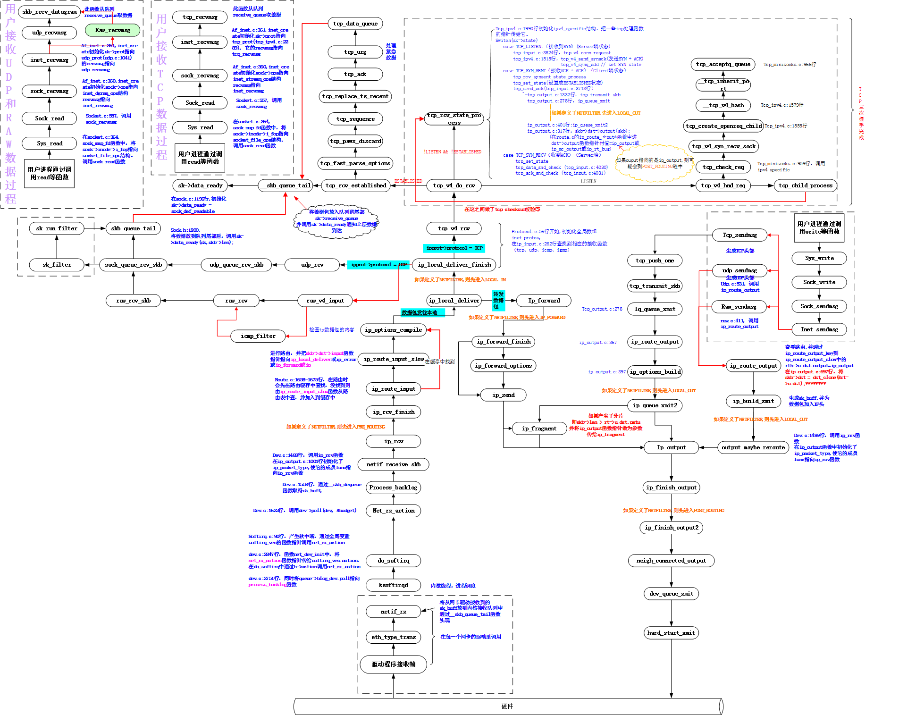


## 高通QSDK 使能qos

linux bridge 是虚拟的二层转发设备，而 iptables conntrack 是在三层上，所以如果直接访问同一网桥内的地址(ip 同一网段)，就会直接走二层转发，不经过 iptables  conntrack

可以用下面的命令查看是否开启桥接模式下的三层转发

```bash
cat /proc/sys/net/bridge/bridge-nf-call-iptables
# 0 说明没有到三层的 iptables  conntrack 直接二层了
# 1 说明到三层的 iptables  conntrack 
```

由于高通的ECM模块管理着硬件加速的方式NSS或者SFE，所以下面的操作是关闭这些加速模块。使得数据包能够经过iptables，实现Qos流量控制。

1. 关闭nss加速

   - 普通版本

     - 第一种方法：推荐使用

       ```bash
       # nss_wifi_olcfg 一共3个bit 分别对应着3个wifi 接口
       uci set wireless.qcawifi=qcawifi
       uci set wireless.qcawifi.nss_wifi_olcfg=0
       uci commit
       wifi load
       ```

       

     - 第二种方法

       ```bash
       insmod qca_ol.ko nss_wifi_olcfg=0
       ```

   - Enterprise profile版本

     - 第一种方法：推荐使用

       ```bash
       # nss_wifi_nxthop_cfg 一共3个bit 分别对应着3个wifi 接口
       uci set wireless.qcawifi=qcawifi
       uci set wireless.qcawifi.nss_wifi_nxthop_cfg =0
       uci commit
       wifi load  
       ```

     - 第二种方法

       ```
       insmod qca_ol.ko nss_wifi_nxthop_cfg=0
       ```

   注意：如何查看是否关闭nss加速成功

   ```bash
   root@OpenWrt:/# dmesg | grep "nss config"
   [   49.638887] wlan: [1401:I:ANY] osif_nss_wifi_soc_setup: nss register id -1 nss config 0 Target Type 19
   [   52.487147] wlan: [1401:I:ANY] osif_nss_wifi_soc_setup: nss register id -1 nss config 0 Target Type 1a
   
   # 可以看到nss config 0 这里为0 说明关闭状态
   
   ```

   如果开启了nss加速，可以使用下面的命令查看各个rx tx队列的统计信息

   ```bash
   # 此命令显示每个设备和每个无线接口的Tx/Rx和硬件队列统计信息
   cat /sys/kernel/debug/qca-nss-drv/stats/wifili
   ```

   

2. 关闭ECM模块

   ```bash
   /etc/init.d/qca-nss-ecm stop
   ```

   

3. 使能桥接模式下3层 

   ```bash
   echo "net.bridge.bridge-nf-call-iptables=1" >> /etc/sysctl.conf
   echo "net.bridge.bridge-nf-call-ip6tables=1" >> /etc/sysctl.conf
    
   sysctl -p /etc/sysctl.conf
   ```

   

### 调试Debug

- linux conntrack

  ```
  $ conntrack -L
   
  tcp 6 119 SYN_SENT src=10.224.1.34 dst=10.233.53.172 sport=56916 dport=8080 [UNREPLIED] src=10.224.1.56 dst=10.224.1.34 sport=8080 dport=56916 mark=0 use=1
  ```

  

- tcpdump

- 常用的内核参数说明

  - `net.bridge.bridge-nf-call-arptables`：是否在arptables的FORWARD中过滤网桥的ARP包
  - `net.bridge.bridge-nf-call-ip6tables`：是否在ip6tables链中过滤IPv6包
  - `net.bridge.bridge-nf-call-iptables`：是否在iptables链中过滤IPv4包
  - `net.bridge.bridge-nf-filter-vlan-tagged`：是否在iptables/arptables中过滤打了vlan标签的包


