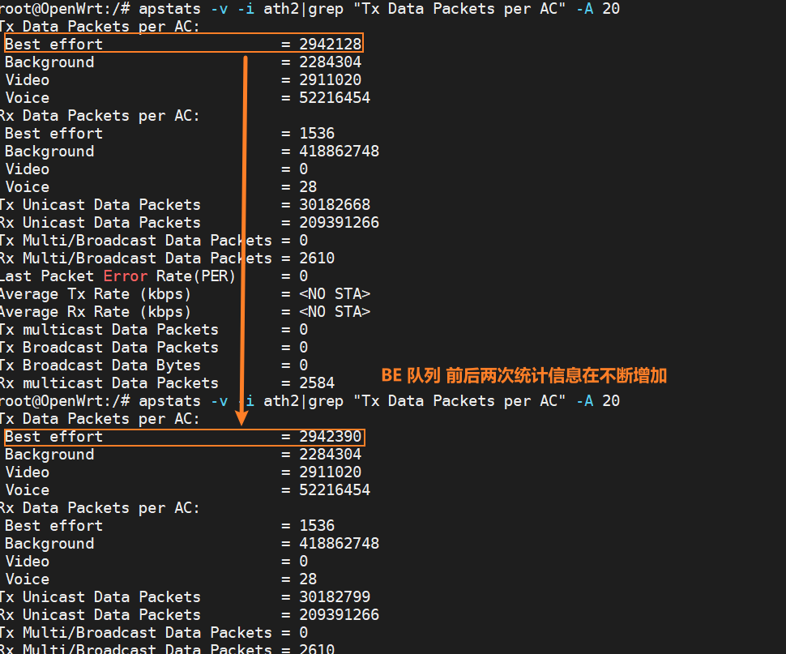

# 高通QSdk Qos开启与测试

## 设置相关无线网络

1. 关闭nss加速

   ```bash
   uci set wireless.qcawifi=qcawifi
   uci set wireless.qcawifi.nss_wifi_olcfg=0
   uci commit
   wifi load
   ```

   nss加速关闭是否成功，使用下面的命令查看，如果最后有`nss config 0`的字段，说明关闭成功

   ```bash
   root@OpenWrt:/# dmesg | grep "nss config"
   [   49.638887] wlan: [1401:I:ANY] osif_nss_wifi_soc_setup: nss register id -1 nss config 0 Target Type 19
   [   52.487147] wlan: [1401:I:ANY] osif_nss_wifi_soc_setup: nss register id -1 nss config 0 Target Type 1a
   
   # 可以看到nss config 0 这里为0 说明关闭状态
   ```

   

   **注意**：Enterprise profile版本和普通版本不一样，Enterprise profile版本设置方式这里不做描述。

2. 关闭ECM模块

   ```bash
   /etc/init.d/qca-nss-ecm stop
   ```

   

3. 使能无线桥接模式下数据流量走三层协议

   ```bash
   echo "net.bridge.bridge-nf-call-iptables=1" >> /etc/sysctl.conf
   echo "net.bridge.bridge-nf-call-ip6tables=1" >> /etc/sysctl.conf
    
   sysctl -p /etc/sysctl.conf
   ```

注意，加速开不开在360M流量负载下，测试结果显示二则CPU利用率如下：


## 验证试验

- STA 到AP端

  网络拓扑结构如下：

  

  - iperf 发包

    PC1端设置如下

    ```bash
    iperf -c 192.168.50.140  -u -i1 -t9999 -p5001 -b200m
    ```

    PC2端设置如下

    ```bash
    iperf -s  -u -i1 -t9999
    ```

  - STA修改防火墙

    ```
    iptables -t mangle -I FORWARD   -d 192.168.50.140 -j DSCP --set-dscp 18
    # 18-》2-》BK队列 
    ```

    修改完后在web端可以看到规则如下，并且Traffic 流量不断增加，说明iptables匹配成功了。

    

  - 在STA终端输入下面的命令查看，STA端802.11e队列的统计信息

    ```bash
    apstats -v -i ath2|grep "Tx Data Packets per AC" -A 20   # VAP 层面统计信息
    # 或者
    apstats -r -i wifi2|grep "Tx Data Packets per AC" -A 20  # RADIO 层面统计信息
    
    ```

    - 可以看到Background统计信息不断增加。

      

    - 同理修改dscp为28 可以看到Best effort 统计信息不断增加

      

    - 同理修改dscp为36 可以看到Video 统计信息不断增加

      

    - 同理修改dscp为48 可以看到Voice统计信息不断增加

      

  

- AP到STA端，灵活调整发包方向和查看统计信息就行。


