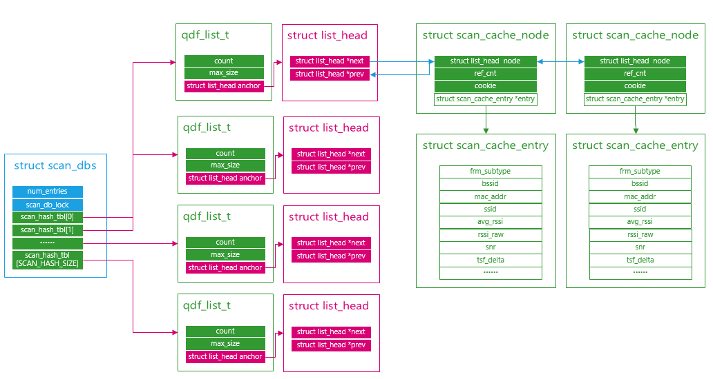
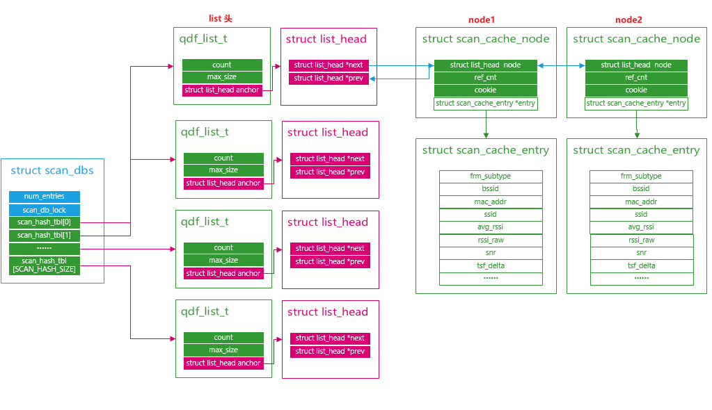
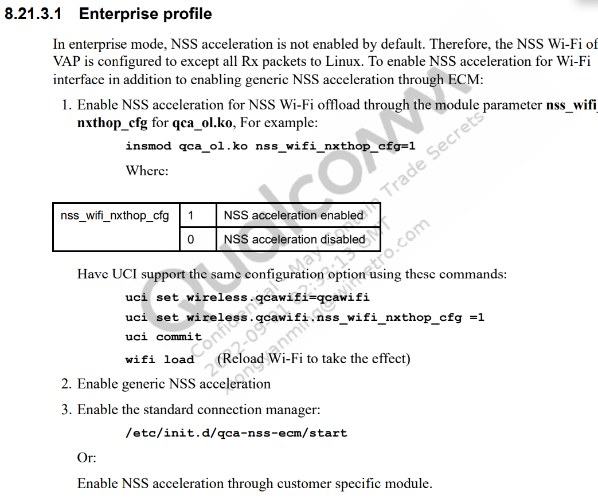
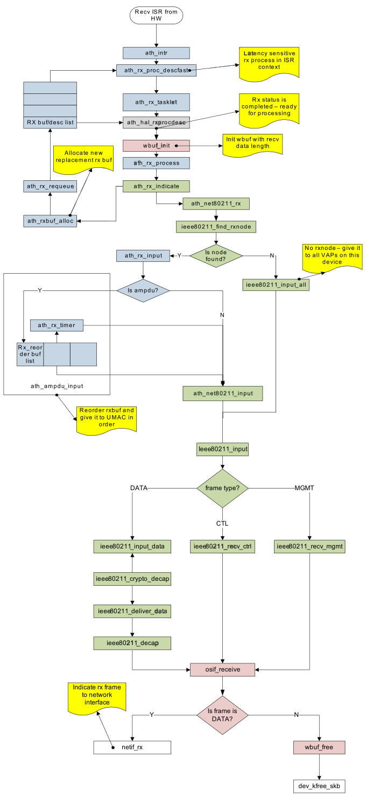

# 高通QSDK 驱动层扫描结果管理


```c
struct list_head {
	struct list_head *next, *prev;
};
typedef struct list_head __qdf_list_node_t;
typedef __qdf_list_node_t qdf_list_node_t;
typedef __qdf_list_t qdf_list_t;

typedef struct qdf_list_s {
	__qdf_list_node_t anchor;
	uint32_t count;
	uint32_t max_size;
} __qdf_list_t;

struct scan_dbs {
	uint32_t num_entries;
	qdf_spinlock_t scan_db_lock;
	qdf_list_t scan_hash_tbl[SCAN_HASH_SIZE];
};

struct scan_cache_node {
	qdf_list_node_t node;
	qdf_atomic_t ref_cnt;
	uint32_t cookie;
	struct scan_cache_entry *entry;
};


// 这里面存放扫描结果信息
struct scan_cache_entry {
	uint8_t frm_subtype;
	struct qdf_mac_addr bssid;
	struct qdf_mac_addr mac_addr;
	struct wlan_ssid ssid;
	bool is_hidden_ssid;
	uint8_t security_type;
	uint16_t seq_num;
	enum wlan_phymode phy_mode;
	int32_t avg_rssi;
	int8_t rssi_raw;
	uint8_t snr;
	uint32_t avg_snr;
	uint16_t bcn_int;
	union wlan_capability cap_info;
	union {
		uint8_t data[8];
		uint64_t tsf;
	} tsf_info;
	uint8_t erp;
	uint8_t dtim_period;
	uint8_t air_time_fraction;
	uint8_t qbss_chan_load;
	uint8_t nss;
	bool is_p2p;
	bool adaptive_11r_ap;
	qdf_time_t scan_entry_time;
	qdf_time_t rssi_timestamp;
	qdf_time_t hidden_ssid_timestamp;
	struct scan_mbssid_info mbssid_info;
	struct reduced_neighbor_report rnr;
	struct channel_info channel;
	bool channel_mismatch;
	struct mlme_info mlme_info;
	uint32_t tsf_delta;
	uint32_t bss_score;
	struct security_info neg_sec_info;
	uint8_t per_chain_rssi[WLAN_MGMT_TXRX_HOST_MAX_ANTENNA];
	uint64_t boottime_ns;
	uint32_t rrm_parent_tsf;
	struct element_info alt_wcn_ie;
	struct ie_list ie_list;
	struct element_info raw_frame;
	/*
	 * This is added temporarily for 6GHz channel to freq conversion
	 * to get pdev wherever it requores to convert frequency to
	 * channel as regulatory apis requires pdev as argument
	 */
	uint8_t pdev_id;
};
```

最终形成如下的**hash list**结构，其中hash索引为mac地址得到




想要访问节点信息的方式如下

1. 直接访问

   通过链表头`scan_db->scan_hash_tbl[i].anchor` 去找下个有效的链表，然后根据链表反算`struct scan_cache_node`

   ```c
   int i;
   struct scan_cache_node *cur_node = NULL;
   struct list_head *head;
   struct list_head *cur_list;
   
   for (i = 0 ; i < SCAN_HASH_SIZE; i++) {
   	head = &scan_db->scan_hash_tbl[i].anchor;
   	cur_list =  head->next;
   
   	while (cur_list) {
   		if(cur_list==head) break;
   		cur_node = qdf_container_of(cur_list,struct scan_cache_node, node);
   		if(cur_node->entry){
   			WIM_LOG_DEBUG("hash %d addr %p  ref %d ssid "QDF_MAC_ADDR_FMT"",i,cur_node,cur_node->ref_cnt ,QDF_MAC_ADDR_REF(cur_node->entry->mac_addr.bytes));
   		}
   		cur_list = cur_list->next; 
   	}
   }
   ```

   

2. 调用`scm_get_next_valid_node`

   通过链表头，先找`struct scan_cache_node` 里面的`struct list_head` ,然后根据`struct list_head`通过`qdf_container_of`函数 得到链表所在结构体`struct scan_cache_node`的地址，这样就得到了`struct scan_cache_node`  ，其实和第一种方式一样，只不过这里使用系统提供的api函数`scm_get_next_valid_node`

   ```c
   int i;
   struct scan_cache_node *cur_node = NULL;
   struct list_head *cur_list;
   for (i = 0 ; i < SCAN_HASH_SIZE; i++) {
       if(scan_db->scan_hash_tbl[i].count){
           // 先找 struct list_head
           cur_list = scm_get_next_valid_node(&scan_db->scan_hash_tbl[i],NULL);
           while (cur_list) {
               //在根据struct list_head 得到 struct scan_cache_node
               cur_node = qdf_container_of(cur_list,struct scan_cache_node, node);
               if(cur_node->entry){
                   WIM_LOG_DEBUG("hash %d addr %p  ref %d ssid "QDF_MAC_ADDR_FMT"",i,cur_node,cur_node->ref_cnt ,QDF_MAC_ADDR_REF(cur_node->entry->mac_addr.bytes));
           }
           	cur_list 
                   = scm_get_next_valid_node(&scan_db->scan_hash_tbl[i],cur_list);  
           }
       }
   }
   ```

   

3. 通过`scm_get_next_node`接口

   利用封装好的接口，直接遍历`struct scan_cache_node`

   ```c
   int i;
   struct scan_cache_node *cur_node = NULL;
   struct scan_cache_node *next_node = NULL;
   for (i = 0 ; i < SCAN_HASH_SIZE; i++) {
       // 这里直接得到 struct scan_cache_node
   	cur_node = scm_get_next_node(scan_db,&scan_db->scan_hash_tbl[i], NULL);
   	while (cur_node) {
   		WIM_LOG_DEBUG("hash %d addr %p  ref %d ssid "QDF_MAC_ADDR_FMT"",i,cur_node,cur_node->ref_cnt ,QDF_MAC_ADDR_REF(scan_node->entry->mac_addr.bytes));
   		next_node = scm_get_next_node(scan_db,&scan_db->scan_hash_tbl[i], cur_node);
   		cur_node = next_node;
   		next_node = NULL;
   	}
   }
   ```

   

## 链表管理

### 基本链表qdf_list_t

1. `qdf_list_peek_next`

   - 源码

     ```c
     /* 
      * 描述：获取当前节点node的下个节点，存放在node2中
      * 参数：
      * list :为 node 所在的链表头
      * node :要查找的node节点
      * node2 ：存放查找结果，node的下个节点
      */
     QDF_STATUS qdf_list_peek_next(qdf_list_t *list,
     			      qdf_list_node_t *node,
     			      qdf_list_node_t **node2)
     {
     	if (!list || !node || !node2)
     		return QDF_STATUS_E_FAULT;
     
     	if (list_empty(&list->anchor))
     		return QDF_STATUS_E_EMPTY;
     
     	if (node->next == &list->anchor)
     		return QDF_STATUS_E_EMPTY;
     
     	*node2 = node->next;
     
     	return QDF_STATUS_SUCCESS;
     }
     ```

   - 使用范例：

      ```c
      qdf_list_peek_next(&scan_dbs->anchor, cur_node, &next_node);
      //如下图所示
      //如果 cur_node  指向 node1  调用函数后
      //那么 netx_node 指向 node2
      ```

      

2. `qdf_list_peek_front`
   
   - 源码
     
     ```c
     /* 
      * 描述：获取链表头的下个节点，存放在node2中
      * 参数：
      * list :为链表头
      * node2 ：存放查找结果，node的下个节点
      */ 
     QDF_STATUS qdf_list_peek_front(qdf_list_t *list, qdf_list_node_t **node2)
     {
     	struct list_head *listptr;
     
     	if (list_empty(&list->anchor))
     		return QDF_STATUS_E_EMPTY;
     
     	listptr = list->anchor.next;
     	*node2 = listptr;
     
     	return QDF_STATUS_SUCCESS;
     }
     ```
     
   - 使用范例：
   
     ```c
      qdf_list_peek_front(&scan_dbs->anchor, &next_node);
      //如下图所示
      //传入的是链表头scan_dbs->anchor
      //得到的next_node 指向node1
     ```
   
        
   
3. 基础的list管理还有如下函数

### scm链表

1. `scm_get_next_valid_node`

   - 源码

     ```c
     /* 
      * 描述：如果 cur_node 为空，  则遍历整个 list 下的所有节点，
      *      如果 cur_node 不为空，则从cur_node开始遍历剩下的节点 
      *      找到一个scan_node->cookie == SCAN_NODE_ACTIVE_COOKIE的节点 返回节点地址
      * 参数：
      * list : 为链表头
      * node ：cur_node 空:遍历整个链表  非空：从cur_node开始遍历
      */ 
     static qdf_list_node_t *scm_get_next_valid_node(qdf_list_t *list,qdf_list_node_t *cur_node)
     {
     	qdf_list_node_t *next_node = NULL;
     	qdf_list_node_t *temp_node = NULL;
     	struct scan_cache_node *scan_node;
     	// 1.获取下个节点
     	if (cur_node)
     		qdf_list_peek_next(list, cur_node, &next_node);
     	else
     		qdf_list_peek_front(list, &next_node);
     
     	while (next_node) {
             // 2.通过next_node节点地址根据qdf_container_of函数获取
             // 节点所在的结构体的地址 即 scan_node
     		scan_node = qdf_container_of(next_node,
     			struct scan_cache_node, node);
             //3.判断是否是自己想要的，如果是 直接返回当前节点，如果不是就继续往下找下个节点
     		if (scan_node->cookie == SCAN_NODE_ACTIVE_COOKIE)
     			return next_node;
     		/*
     		 * If node is not valid check for next entry
     		 * to get next valid node.
     		 */
     		qdf_list_peek_next(list, next_node, &temp_node);
     		next_node = temp_node;
     		temp_node = NULL;
     	}
     
     	return next_node;
     }
     ```

     

   - 使用举例

     ```c
     scm_get_next_valid_node(&scan_dbs->anchor, cur_node)
     // cur_node == NULL 时候，从头遍历找到node1 判断scan_node->cookie == SCAN_NODE_ACTIVE_COOKIE 如果相等，则返回node1 否则 继续往下找node2 ，再次判断，直到找到一个满足条件的 node 返回
     ```

     

2. `scm_get_next_node`

   - 源码

     ```c
     /* 
      * 描述：获取下个节点所在结构体的地址，即 struct scan_cache_node 类型的
      * 参数：
      * scan_dbs：扫描数据库
      * list : 为链表头
      * node ：cur_node 空:遍历整个链表  非空：从cur_node开始遍历
      */ 
     static struct scan_cache_node *scm_get_next_node(struct scan_dbs *scan_db,qdf_list_t *list, struct scan_cache_node *cur_node)
     {
     	struct scan_cache_node *next_node = NULL;
     	qdf_list_node_t *next_list = NULL;
     
     	qdf_spin_lock_bh(&scan_db->scan_db_lock);
     	if (cur_node) {
     		next_list = scm_get_next_valid_node(list, &cur_node->node);
     		/* Decrement the ref count of the previous node */
             // 如果ref-- 然后如果减完时候==0 会把cur_node从链表上移除
     		scm_scan_entry_put_ref(scan_db,
     			cur_node, false);
     	} else {
     		next_list = scm_get_next_valid_node(list, NULL);
     	}
     	/* Increase the ref count of the obtained node */
     	if (next_list) {
             // 根据节点next_list 得到它所在结构体的地址 即 next_node 
     		next_node = qdf_container_of(next_list,
     			struct scan_cache_node, node);
             // 这里会把ref++
     		scm_scan_entry_get_ref(next_node);
     	}
     	qdf_spin_unlock_bh(&scan_db->scan_db_lock);
     
     	return next_node;
     }
     ```

     

   - 举例

     ```c
     static
     struct scan_cache_node *scm_get_conn_node(struct scan_dbs *scan_db)
     {
     	int i;
     	struct scan_cache_node *cur_node = NULL;
     	struct scan_cache_node *next_node = NULL;
     
     	for (i = 0 ; i < SCAN_HASH_SIZE; i++) {
             // 遍历scan_db->scan_hash_tbl[i]链表下的所有节点
     		cur_node = scm_get_next_node(scan_db,
     			&scan_db->scan_hash_tbl[i], NULL);
     		while (cur_node) {
     			if (scm_bss_is_connected(cur_node->entry))
     				return cur_node;
     			next_node = scm_get_next_node(scan_db,
     				&scan_db->scan_hash_tbl[i], cur_node);
     			cur_node = next_node;
     			next_node = NULL;
     		}
     	}
     
     	return NULL;
     }
     ```

     

3. `scm_add_scan_node`

   - 源码

     ```c
     static void scm_add_scan_node(struct scan_dbs *scan_db,struct scan_cache_node *scan_node,struct scan_cache_node *dup_node)
     {
     	uint8_t hash_idx;
     	hash_idx =SCAN_GET_HASH(scan_node->entry->bssid.bytes);
     	if (!dup_node)
     		qdf_list_insert_back(&scan_db->scan_hash_tbl[hash_idx],
     				     &scan_node->node);
     	else
     		qdf_list_insert_before(&scan_db->scan_hash_tbl[hash_idx],
     				       &scan_node->node, &dup_node->node);
     
     	scan_db->num_entries++;
     }
     ```

     

   - 举例

4. 


## 调用层次分析

1. 当 wifi 的OL模块驱动insmod的时候 调用上面的函数

   ```c
   static int __init qca_ol_mod_init(void)
   {
   
   	wlan_global_lmac_if_set_txops_registration_cb(WLAN_DEV_OL, target_if_register_tx_ops);
       {
          // 等价于 wlan_global_lmac_if_tx_ops_register[WLAN_DEV_OL] = target_if_register_tx_ops;
          wlan_global_lmac_if_tx_ops_register[dev_type] = handler;
       }
   	
       wlan_lmac_if_set_umac_txops_registration_cb(olif_register_umac_tx_ops);
       {
          //等价于 wlan_lmac_if_umac_tx_ops_register = olif_register_umac_tx_ops
          wlan_lmac_if_umac_tx_ops_register = handler; 
       }
}
   ```

   相当于对全局变量赋值
   
   - `wlan_global_lmac_if_tx_ops_register[WLAN_DEV_OL] = target_if_register_tx_ops`
   - `wlan_lmac_if_umac_tx_ops_register = olif_register_umac_tx_ops`
   
   这连个全局变量后面会用，这里先介绍下。
   
   
   
2. 接下来看OL模块加载

   ahb 或者 PCIE 总线在probe时候调用 `__ol_ath_attach`

   ```c
   int ol_ath_ahb_probe(struct platform_device *pdev, const struct platform_device_id *id)
   {
       ret = __ol_ath_attach(hif_context, &ol_cfg, aps_osdev, qdf_dev);
   }
   int ol_ath_pci_probe(struct pci_dev *pcidev, const struct pci_device_id *id)
   {
   	ret = __ol_ath_attach(hif_context, &ol_cfg, aps_osdev, qdf_dev);
   }
   ```

   在 `__ol_ath_attach` 里面调用 `wlan_global_lmac_if_open` 函数

   ```c
   
   int __ol_ath_attach(void *hif_hdl, struct ol_attach_t *ol_cfg, osdev_t osdev, qdf_device_t qdf_dev)
   {
       wlan_global_lmac_if_open(psoc));
       ol_ath_soc_attach(soc, &ol_wlan_reg_params,ol_ath_linux_update_fw_config_cb);
   }	
   ```

   下面看下 `wlan_global_lmac_if_open` 函数

   ```c
   QDF_STATUS wlan_global_lmac_if_open(struct wlan_objmgr_psoc *psoc)
   {
   	WLAN_DEV_TYPE dev_type;
   
   	struct wlan_lmac_if_tx_ops *tx_ops;
   	struct wlan_lmac_if_rx_ops *rx_ops;
   
   	if (!psoc) {
   		qdf_err("psoc is NULL");
   		return QDF_STATUS_E_INVAL;
   	}
   
   	tx_ops = qdf_mem_malloc(sizeof(*tx_ops));
   
   
   	rx_ops = qdf_mem_malloc(sizeof(*rx_ops));
   
   
   	wlan_psoc_set_lmac_if_txops(psoc, tx_ops);
   	wlan_psoc_set_lmac_if_rxops(psoc, rx_ops);
   
   	dev_type = psoc->soc_nif.phy_type;
   
   	wlan_global_lmac_if_tx_ops_register[dev_typec](tx_ops);
   	
   	/* Function call to register rx-ops handlers */
   	wlan_global_lmac_if_rx_ops_register(rx_ops);
   
   }
   ```

   在上面的函数中调用`wlan_global_lmac_if_tx_ops_register[dev_typec](tx_ops)`，前面已经介绍该函数指针的指向，即实际调用`target_if_register_tx_ops(tx_ops)`

   

3. 接着分析`wlan_global_lmac_if_rx_ops_register(rx_ops)`函数

   ```c
   wlan_global_lmac_if_rx_ops_register(struct wlan_lmac_if_rx_ops *rx_ops)
   {
   	/*
   	 * Component specific public api's to be called to register
   	 * respective callbacks
   	 * Ex: rx_ops->fp = function;
   	 */
   
   	/* Registeration for UMAC componets */
   	wlan_lmac_if_umac_rx_ops_register(rx_ops);
   
   
   	return QDF_STATUS_SUCCESS;
   }
   ```

   在调用`wlan_lmac_if_umac_rx_ops_register`的时候，如下，会注册几个handler

   ```c
   wlan_lmac_if_umac_rx_ops_register(struct wlan_lmac_if_rx_ops *rx_ops)
   {
   	/* mgmt txrx rx ops */
   	mgmt_txrx_rx_ops = &rx_ops->mgmt_txrx_rx_ops;
   
   	mgmt_txrx_rx_ops->mgmt_tx_completion_handler =
   			tgt_mgmt_txrx_tx_completion_handler;
   	mgmt_txrx_rx_ops->mgmt_rx_frame_handler =
   			tgt_mgmt_txrx_rx_frame_handler;
   	mgmt_txrx_rx_ops->mgmt_txrx_get_nbuf_from_desc_id =
   			tgt_mgmt_txrx_get_nbuf_from_desc_id;
   	mgmt_txrx_rx_ops->mgmt_txrx_get_peer_from_desc_id =
   			tgt_mgmt_txrx_get_peer_from_desc_id;
   	mgmt_txrx_rx_ops->mgmt_txrx_get_vdev_id_from_desc_id =
   			tgt_mgmt_txrx_get_vdev_id_from_desc_id;
   	mgmt_txrx_rx_ops->mgmt_txrx_get_free_desc_pool_count =
   			tgt_mgmt_txrx_get_free_desc_pool_count;
   }
   ```

   我们重点关注

   ```c
   mgmt_txrx_rx_ops->mgmt_rx_frame_handler = tgt_mgmt_txrx_rx_frame_handler;
   ```
   - 调用`mgmt_txrx_rx_ops->mgmt_rx_frame_handler`地方

     ```c
     static int
     ol_ath_mgmt_rx_event_handler(ol_scn_t sc, u_int8_t *data, u_int32_t datalen)
     {
         ol_ath_mgmt_handler(pdev, scn, wbuf, wh, rx_event, false);
         {
            mgmt_txrx_rx_handler(psoc, wbuf, &rx_event);
             {
              	struct wlan_lmac_if_mgmt_txrx_rx_ops *mgmt_rx_ops;
                 mgmt_rx_ops = wlan_lmac_if_get_mgmt_txrx_rx_ops(psoc);
                 // 这里调用
                 if (mgmt_rx_ops && mgmt_rx_ops->mgmt_rx_frame_handler)
                     return mgmt_rx_ops->mgmt_rx_frame_handler(psoc, nbuf, params);   
             }
         }
     }
      
     
     ```

     那么`ol_ath_mgmt_rx_event_handler`什么时候调用？往下分析：

     ```c
     // 注册 ol_ath_mgmt_rx_event_handler 地方
     void
     ol_ath_mgmt_soc_attach(ol_ath_soc_softc_t *soc)
     {
         wmi_unified_t wmi_handle;
     
         wmi_handle = lmac_get_wmi_unified_hdl(soc->psoc_obj);
         /* Register WMI event handlers */
         wmi_unified_register_event_handler(wmi_handle, wmi_mgmt_rx_event_id,
                 ol_ath_mgmt_rx_event_handler, WMI_RX_UMAC_CTX);
         // 实际赋值给 wmi_handle->event_handler[idx]=ol_ath_mgmt_rx_event_handler
     }
     // 调用 ol_ath_mgmt_rx_event_handler 地方
     void __wmi_control_rx(struct wmi_unified *wmi_handle, wmi_buf_t evt_buf)
     {
         // 实际调用 ol_ath_mgmt_rx_event_handler
         wmi_handle->event_handler[idx] (wmi_handle->scn_handle,
     				wmi_cmd_struct_ptr, len);
     }
     
     ```

     谁调用了`__wmi_control_rx`

     - 调用`__wmi_control_rx`的地方

       ```
       static void wmi_rx_event_work(void *arg)
       static void wmi_rx_diag_event_work(void *arg)
       {
       	buf = qdf_nbuf_queue_remove(&wmi->diag_event_queue);
       	
       	__wmi_control_rx(wmi, buf);
       }
       ```

       系统把wmi_rx_event_work注册到工作队列，

       ```c
       static QDF_STATUS wmi_initialize_worker_context(struct wmi_unified *wmi_handle)
       {
       	//注册到工作队列
       	qdf_create_work(0, &wmi_handle->rx_event_work,
       			wmi_rx_event_work, wmi_handle);
       	qdf_create_work(0, &wmi_handle->rx_diag_event_work,
       			wmi_rx_diag_event_work, wmi_handle);
       }
       ```

       在下面的接口进行工作队列的调度

       ```c
       static void wmi_control_rx(void *ctx, HTC_PACKET *htc_packet)
       {
          wmi_process_control_rx(wmi_handle, evt_buf); 
           {
               wmi_process_fw_event_worker_thread_ctx(wmi_handle, evt_buf);
               {
       
                   qdf_spin_lock_bh(&wmi_handle->eventq_lock);
                   qdf_nbuf_queue_add(&wmi_handle->event_queue, evt_buf);
                   qdf_spin_unlock_bh(&wmi_handle->eventq_lock);
                   // 加入工作队列，系统会自动调用
                   qdf_queue_work(0, wmi_handle->wmi_rx_work_queue,
                           &wmi_handle->rx_event_work);
       
                   return;
               }
           }
       }
       ```

       

     - `wmi_control_rx`这个函数暂时不分析，和htc模块有关系

   - 分析`tgt_mgmt_txrx_rx_frame_handler`

     ```c
     QDF_STATUS tgt_mgmt_txrx_rx_frame_handler(
     			struct wlan_objmgr_psoc *psoc,
     			qdf_nbuf_t buf,
     			struct mgmt_rx_event_params *mgmt_rx_params)
     {
     	rx_handler->rx_cb(psoc, peer, copy_buf,
     					mgmt_rx_params, frm_type);
     }
     ```

     这里的`rx_cb`是谁呢？

     ```c
     int __ol_ath_attach(void *hif_hdl, struct ol_attach_t *ol_cfg, osdev_t osdev, qdf_device_t qdf_dev)
     {
     ol_ath_soc_attach(soc,&ol_wlan_reg_params,ol_ath_linux_update_fw_config_cb);
         {
              ret = dispatcher_psoc_enable(soc->psoc_obj);
             {
                 ucfg_scan_psoc_enable(psoc)
                 {
                     ucfg_scan_register_unregister_bcn_cb(psoc, true);
                     {
                         struct mgmt_txrx_mgmt_frame_cb_info cb_info[2];
     
                         cb_info[0].frm_type = MGMT_PROBE_RESP;
                         cb_info[0].mgmt_rx_cb = tgt_scan_bcn_probe_rx_callback;
                         cb_info[1].frm_type = MGMT_BEACON;
                         cb_info[1].mgmt_rx_cb = tgt_scan_bcn_probe_rx_callback;
                         wlan_mgmt_txrx_register_rx_cb(psoc,WLAN_UMAC_COMP_SCAN, cb_info, 2)
                         {
                             wlan_mgmt_txrx_create_rx_handler(mgmt_txrx_psoc_ctx,
                             frm_cb_info[i].mgmt_rx_cb, comp_id,
                             frm_cb_info[i].frm_type)
                             {
                                rx_handler->rx_cb = mgmt_rx_cb;
                                // 综上 rx_handler->rx_cb = tgt_scan_bcn_probe_rx_callback
                             }    
                         }    
                     }
                 }
             }
         }
     }
     ```

     

4. 接下来分析`tgt_scan_bcn_probe_rx_callback`

   ```c
   QDF_STATUS tgt_scan_bcn_probe_rx_callback(struct wlan_objmgr_psoc *psoc,
   	struct wlan_objmgr_peer *peer, qdf_nbuf_t buf,
   	struct mgmt_rx_event_params *rx_param,
   	enum mgmt_frame_type frm_type)
   {
   	msg.bodyptr = bcn;
   	msg.callback = scm_handle_bcn_probe;
   	msg.flush_callback = scm_bcn_probe_flush_callback;
       // 通过调度器调度
       scheduler_post_message(QDF_MODULE_ID_SCAN,
   					QDF_MODULE_ID_SCAN,
   					QDF_MODULE_ID_SCAN, &msg)
   }
   ```

   

5. 接下来分析`scm_handle_bcn_probe`函数

   ```c
   QDF_STATUS scm_handle_bcn_probe(struct scheduler_msg *msg)
   {
   	if (!msg) {
   		scm_err("msg is NULL");
   		return QDF_STATUS_E_NULL_VALUE;
   	}
   
   	return __scm_handle_bcn_probe(msg->bodyptr);
   }
   ```

   接下来分析`__scm_handle_bcn_probe`函数

   ```c
   QDF_STATUS __scm_handle_bcn_probe(struct scan_bcn_probe_event *bcn)
   {
   	struct wlan_objmgr_psoc *psoc;
   	struct wlan_objmgr_pdev *pdev = NULL;
   	struct scan_cache_entry *scan_entry;
   	struct wlan_scan_obj *scan_obj;
   	qdf_list_t *scan_list = NULL;
   	QDF_STATUS status = QDF_STATUS_SUCCESS;
   	uint32_t list_count, i;
   	qdf_list_node_t *next_node = NULL;
   	struct scan_cache_node *scan_node;
   	struct wlan_frame_hdr *hdr = NULL;
   
   	if (!bcn) {
   		scm_err("bcn is NULL");
   		return QDF_STATUS_E_INVAL;
   	}
   	if (!bcn->rx_data) {
   		scm_err("rx_data iS NULL");
   		status = QDF_STATUS_E_INVAL;
   		goto free_nbuf;
   	}
   	if (!bcn->buf) {
   		scm_err("buf is NULL");
   		status = QDF_STATUS_E_INVAL;
   		goto free_nbuf;
   	}
   
   	hdr = (struct wlan_frame_hdr *)qdf_nbuf_data(bcn->buf);
   	psoc = bcn->psoc;
   	pdev = wlan_objmgr_get_pdev_by_id(psoc,
   			   bcn->rx_data->pdev_id, WLAN_SCAN_ID);
   	if (!pdev) {
   		scm_err("pdev is NULL");
   		status = QDF_STATUS_E_INVAL;
   		goto free_nbuf;
   	}
   	scan_obj = wlan_psoc_get_scan_obj(psoc);
   	if (!scan_obj) {
   		scm_err("scan_obj is NULL");
   		status = QDF_STATUS_E_INVAL;
   		goto free_nbuf;
   	}
   
   	if (qdf_nbuf_len(bcn->buf) <=
   	   (sizeof(struct wlan_frame_hdr) +
   	   offsetof(struct wlan_bcn_frame, ie))) {
   		scm_debug("invalid beacon/probe length");
   		status = QDF_STATUS_E_INVAL;
   		goto free_nbuf;
   	}
   
   	if (bcn->frm_type == MGMT_SUBTYPE_BEACON &&
   	    wlan_reg_is_dfs_for_freq(pdev, bcn->rx_data->chan_freq)) {
   		util_scan_add_hidden_ssid(pdev, bcn->buf);
   	}
   	// 解析beacon帧 scan_list是个临时的list 用完到最后释放了
   	scan_list =
   		 util_scan_unpack_beacon_frame(pdev, qdf_nbuf_data(bcn->buf),
   			qdf_nbuf_len(bcn->buf), bcn->frm_type,
   			bcn->rx_data);
   	if (!scan_list || qdf_list_empty(scan_list)) {
   		scm_debug("failed to unpack %d frame BSSID: "QDF_MAC_ADDR_FMT,
   			  bcn->frm_type, QDF_MAC_ADDR_REF(hdr->i_addr3));
   		status = QDF_STATUS_E_INVAL;
   		goto free_nbuf;
   	}
   	// 把scan_list 下面的节点一个一个取出来，然后过滤下，剩下的调用 scm_add_update_entry 增加到对应的hash节点 理论上只有1个 
   	list_count = qdf_list_size(scan_list);
   	for (i = 0; i < list_count; i++) {
   		status = qdf_list_remove_front(scan_list, &next_node);
   		if (QDF_IS_STATUS_ERROR(status) || !next_node) {
   			scm_debug("list remove failure i:%d, lsize:%d, BSSID: "QDF_MAC_ADDR_FMT,
   				  i, list_count, QDF_MAC_ADDR_REF(hdr->i_addr3));
   			status = QDF_STATUS_E_INVAL;
   			goto free_nbuf;
   		}
   
   		scan_node = qdf_container_of(next_node,
   			struct scan_cache_node, node);
   
   		scan_entry = scan_node->entry;
   
   		if (scan_obj->drop_bcn_on_chan_mismatch &&
   		    scan_entry->channel_mismatch) {
   			scm_nofl_debug("Drop frame for chan mismatch "QDF_MAC_ADDR_FMT" Seq Num: %d freq %d RSSI %d",
   				       QDF_MAC_ADDR_REF(scan_entry->bssid.bytes),
   				       scan_entry->seq_num,
   				       scan_entry->channel.chan_freq,
   				       scan_entry->rssi_raw);
   			util_scan_free_cache_entry(scan_entry);
   			qdf_mem_free(scan_node);
   			continue;
   		}
   		/* Do not add invalid channel entry as kernel will reject it */
   		if (scan_obj->drop_bcn_on_invalid_freq &&
   		    wlan_reg_is_disable_for_freq(pdev,
   					scan_entry->channel.chan_freq)) {
   			scm_nofl_debug("Drop frame for invalid freq %d: "QDF_MAC_ADDR_FMT" Seq Num: %d RSSI %d",
   				       scan_entry->channel.chan_freq,
   				       QDF_MAC_ADDR_REF(scan_entry->bssid.bytes),
   				       scan_entry->seq_num,
   				       scan_entry->rssi_raw);
   			util_scan_free_cache_entry(scan_entry);
   			qdf_mem_free(scan_node);
   			continue;
   		}
   		if (scan_obj->cb.update_beacon)
   			scan_obj->cb.update_beacon(pdev, scan_entry);
   		// 这里增加一个新的扫描节点
   		status = scm_add_update_entry(psoc, pdev, scan_entry);
   		if (QDF_IS_STATUS_ERROR(status)) {
   			scm_debug("failed to add entry for BSSID: "QDF_MAC_ADDR_FMT" Seq Num: %d",
   				  QDF_MAC_ADDR_REF(scan_entry->bssid.bytes),
   				  scan_entry->seq_num);
   			util_scan_free_cache_entry(scan_entry);
   			qdf_mem_free(scan_node);
   			continue;
   		}
   
   		qdf_mem_free(scan_node);
   	}
   
   free_nbuf:
   	if (scan_list)
   		qdf_mem_free(scan_list);
   	if (bcn->psoc)
   		wlan_objmgr_psoc_release_ref(bcn->psoc, WLAN_SCAN_ID);
   	if (pdev)
   		wlan_objmgr_pdev_release_ref(pdev, WLAN_SCAN_ID);
   	if (bcn->rx_data)
   		qdf_mem_free(bcn->rx_data);
   	if (bcn->buf)
   		qdf_nbuf_free(bcn->buf);
   	qdf_mem_free(bcn);
   
   	return status;
   }
   ```

   

6. 增加一个node分析

   ```c
   static QDF_STATUS scm_add_update_entry(struct wlan_objmgr_psoc *psoc,struct wlan_objmgr_pdev *pdev, struct scan_cache_entry *scan_params)
   {
   	struct scan_cache_node *dup_node = NULL;
   	struct scan_cache_node *scan_node = NULL;
   	bool is_dup_found = false;
   	QDF_STATUS status;
   	struct scan_dbs *scan_db;
   	struct wlan_scan_obj *scan_obj;
   	uint8_t security_type;
   
   	// 找到 scan_db 指针
   	scan_db = wlan_pdev_get_scan_db(psoc, pdev);
    
   	scan_obj = wlan_psoc_get_scan_obj(psoc);
   	if (!scan_obj) {
   		scm_err("scan_obj is NULL");
   		return QDF_STATUS_E_INVAL;
   	}
   
   //	if (scan_params->frm_subtype ==
   //	   MGMT_SUBTYPE_PROBE_RESP &&
   //	   !scan_params->ie_list.ssid)
   //		scm_debug("Probe resp doesn't contain SSID");
   
   
   //	if (scan_params->ie_list.csa ||
   //	   scan_params->ie_list.xcsa ||
   //	   scan_params->ie_list.cswrp)
   //		scm_debug("CSA IE present for BSSID: "QDF_MAC_ADDR_FMT,
   //			  QDF_MAC_ADDR_REF(scan_params->bssid.bytes));
   
   	// 处理重复的选项  找到后 把找到的以前的节点的部分内容 赋值到 新的扫描参数里面 scan_params 里面 且
   	// dup_node 指向以前的那个
   	is_dup_found = scm_find_duplicate(pdev, scan_obj, scan_db, scan_params,
   					  &dup_node);
   
   	security_type = scan_params->security_type;
   //	scm_nofl_debug("Received %s: "QDF_MAC_ADDR_FMT" \"%.*s\" freq %d rssi %d tsf_delta %u seq %d snr %d phy %d hidden %d mismatch %d %s%s%s%s pdev %d boot_time %llu ns",
   //		       (scan_params->frm_subtype == MGMT_SUBTYPE_PROBE_RESP) ?
   //		       "prb rsp" : "bcn",
   //		       QDF_MAC_ADDR_REF(scan_params->bssid.bytes),
   //		       scan_params->ssid.length, scan_params->ssid.ssid,
   //		       scan_params->channel.chan_freq, scan_params->rssi_raw,
   //		       scan_params->tsf_delta, scan_params->seq_num,
   //		       scan_params->snr, scan_params->phy_mode,
   //		       scan_params->is_hidden_ssid,
   //		       scan_params->channel_mismatch,
   //		       security_type & SCAN_SECURITY_TYPE_WPA ? "[WPA]" : "",
   //		       security_type & SCAN_SECURITY_TYPE_RSN ? "[RSN]" : "",
   //		       security_type & SCAN_SECURITY_TYPE_WAPI ? "[WAPI]" : "",
   //		       security_type & SCAN_SECURITY_TYPE_WEP ? "[WEP]" : "",
   //		       wlan_objmgr_pdev_get_pdev_id(pdev),
   //		       scan_params->boottime_ns);
   
   
   	if (scan_obj->cb.inform_beacon)
   		scan_obj->cb.inform_beacon(pdev, scan_params); // 实际调用 wlan_cfg80211_inform_bss_frame
   
   	if (scan_db->num_entries >= MAX_SCAN_CACHE_SIZE) {
   		status = scm_flush_oldest_entry(scan_db);
   		if (QDF_IS_STATUS_ERROR(status)) {
   			/* release ref taken for dup node */
   			if (is_dup_found)
   				scm_scan_entry_put_ref(scan_db, dup_node, true);
   			return status;
   		}
   	}
   
   	scan_node = qdf_mem_malloc(sizeof(*scan_node));
   	if (!scan_node) {
   		/* release ref taken for dup node */
   		if (is_dup_found)
   			scm_scan_entry_put_ref(scan_db, dup_node, true);
   		return QDF_STATUS_E_NOMEM;
   	}
   
   	scan_node->entry = scan_params;
   	qdf_spin_lock_bh(&scan_db->scan_db_lock);
   	scm_add_scan_node(scan_db, scan_node, dup_node);
   
   	if (is_dup_found) {
   		/* release ref taken for dup node and delete it */
   		scm_scan_entry_del(scan_db, dup_node);
   		scm_scan_entry_put_ref(scan_db, dup_node, false);
   	}
   	qdf_spin_unlock_bh(&scan_db->scan_db_lock);
   
   	return QDF_STATUS_SUCCESS;
   }
   ```

   查重函数

   ```c
   static bool scm_find_duplicate(struct wlan_objmgr_pdev *pdev,
   		   struct wlan_scan_obj *scan_obj,
   		   struct scan_dbs *scan_db,
   		   struct scan_cache_entry *entry,
   		   struct scan_cache_node **dup_node)
   {
   	uint8_t hash_idx;
   	struct scan_cache_node *cur_node;
   	struct scan_cache_node *next_node = NULL;
   
   	hash_idx = SCAN_GET_HASH(entry->bssid.bytes);
   
   	cur_node = scm_get_next_node(scan_db,
   				     &scan_db->scan_hash_tbl[hash_idx],
   				     NULL);
   	// 遍历索引为hash_idx的hash表里面的所有node 找到重复项 赋值给 dup_node
   	while (cur_node) {
   		if (util_is_scan_entry_match(entry,cur_node->entry)) {
   			// 找到后 把找到的以前节点的部分内容 和新的扫描参数里面 entry 里面的内容进行融合，就是根据判断条件，相互赋值，融合融合，有些数据需要用新的结果，有些需要用旧的结果
   			scm_copy_info_from_dup_entry(pdev, scan_obj, scan_db,entry, cur_node);
   			*dup_node = cur_node;
   			return true;
   		}
   		next_node = scm_get_next_node(scan_db,
   			 &scan_db->scan_hash_tbl[hash_idx], cur_node);
   		cur_node = next_node;
   		next_node = NULL;
   	}
   
   	return false;
   }
   ```

   刷新函数

   ```c
   static QDF_STATUS scm_flush_oldest_entry(struct scan_dbs *scan_db)
   {
   	int i;
   	struct scan_cache_node *oldest_node = NULL;
   	struct scan_cache_node *cur_node;
   
   	for (i = 0 ; i < SCAN_HASH_SIZE; i++) {
   		/* Get the first valid node for the hash */
   		cur_node = scm_get_next_node(scan_db,&scan_db->scan_hash_tbl[i],NULL);
   		 /* Iterate scan db and flush out oldest node
   		  * take ref_cnt for oldest_node
   		  */
   
   		while (cur_node) {
   			if (!oldest_node ||
   			   (util_scan_entry_age(oldest_node->entry) <
   			    util_scan_entry_age(cur_node->entry))) {
   				if (oldest_node)
   					scm_scan_entry_put_ref(scan_db,
   							       oldest_node,
   							       true);
   				qdf_spin_lock_bh(&scan_db->scan_db_lock);
   				oldest_node = cur_node;
   				scm_scan_entry_get_ref(oldest_node);
   				qdf_spin_unlock_bh(&scan_db->scan_db_lock);
   			}
   
   			cur_node = scm_get_next_node(scan_db,
   					&scan_db->scan_hash_tbl[i],
   					cur_node);
   		};
   	}
   
   	if (oldest_node) {
   		scm_debug("Flush oldest BSSID: "QDF_MAC_ADDR_FMT" with age %lu ms",
   			  QDF_MAC_ADDR_REF(oldest_node->entry->bssid.bytes),
   			  util_scan_entry_age(oldest_node->entry));
   		/* Release ref_cnt taken for oldest_node and delete it */
   		qdf_spin_lock_bh(&scan_db->scan_db_lock);
   		scm_scan_entry_del(scan_db, oldest_node);
   		scm_scan_entry_put_ref(scan_db, oldest_node, false);
   		qdf_spin_unlock_bh(&scan_db->scan_db_lock);
   	}
   
   	return QDF_STATUS_SUCCESS;
   }
   ```

7. todo


## 分析错误

### 重要结构体

```c
struct mlme_ext_ops glbl_ops_ext = {
	.mlme_pdev_ext_hdl_create = mlme_pdev_ext_obj_create,
	.mlme_pdev_ext_hdl_destroy = mlme_pdev_ext_obj_destroy,
	.mlme_vdev_ext_hdl_create = mlme_vdev_ext_obj_create,
	.mlme_vdev_ext_hdl_post_create = mlme_vdev_ext_obj_post_create,
	.mlme_vdev_ext_hdl_destroy = mlme_vdev_ext_obj_destroy,
	.mlme_vdev_start_fw_send = mlme_ext_vap_start,
	.mlme_vdev_stop_fw_send = mlme_ext_vap_stop,
	.mlme_vdev_down_fw_send = mlme_ext_vap_down,
	.mlme_multivdev_restart_fw_send =
				mlme_vdev_multivdev_restart_fw_send_cb,
	.mlme_multi_vdev_restart_resp =
				mlme_multi_vdev_restart_resp_cb,
	.mlme_vdev_enqueue_exp_cmd = NULL,
	.mlme_cm_ext_connect_start_ind_cb = wlan_mlme_cm_connect_start,
	.mlme_cm_ext_bss_select_ind_cb = wlan_mlme_cm_connect_active,
	.mlme_cm_ext_bss_peer_create_req_cb = wlan_mlme_cm_ext_bss_peer_create_req,
	.mlme_cm_ext_connect_req_cb = wlan_mlme_cm_join_start,
	.mlme_cm_ext_connect_complete_ind_cb = wlan_mlme_cm_connect_complete,
	.mlme_cm_ext_disconnect_start_ind_cb = wlan_mlme_cm_disconnect_start,
	.mlme_cm_ext_disconnect_req_cb = wlan_mlme_cm_disconnect_active,
	.mlme_cm_ext_bss_peer_delete_req_cb = wlan_mlme_cm_bss_peer_delete_req,
	.mlme_cm_ext_disconnect_complete_ind_cb = wlan_mlme_cm_disconnect_complete,
	.mlme_cm_ext_vdev_down_req_cb = wlan_mlme_cm_vdev_down,
	.mlme_cm_ext_roam_start_ind_cb = NULL,
	.mlme_cm_ext_reassoc_req_cb = wlan_mlme_cm_reassoc_join_start,
	.mlme_cm_ext_hdl_create_cb = wlan_mlme_cm_ext_hdl_create,
	.mlme_cm_ext_hdl_destroy_cb = wlan_mlme_cm_ext_hdl_destroy,
};
```

```c
struct cnx_mgr {
	struct wlan_objmgr_vdev *vdev;
													
}                               
```

```c                                
struct wlan_objmgr_vdev {
	qdf_list_node_t vdev_node;
	struct wlan_objmgr_vdev_mlme vdev_mlme;
	struct wlan_objmgr_vdev_objmgr vdev_objmgr;
	struct wlan_objmgr_vdev_nif vdev_nif;
	void *vdev_comp_priv_obj[WLAN_UMAC_MAX_COMPONENTS];
	QDF_STATUS obj_status[WLAN_UMAC_MAX_COMPONENTS];
	WLAN_OBJ_STATE obj_state;
	qdf_spinlock_t vdev_lock;
};
```

```c
struct wlan_objmgr_vdev_objmgr {
	uint8_t vdev_id;
	uint8_t print_cnt;
	struct wlan_objmgr_peer *self_peer;
	struct wlan_objmgr_peer *bss_peer;
	qdf_list_t wlan_peer_list;
	struct wlan_objmgr_pdev *wlan_pdev;
	uint16_t wlan_peer_count;
	uint16_t max_peer_count;
	uint32_t c_flags;
	qdf_atomic_t ref_cnt;
	qdf_atomic_t ref_id_dbg[WLAN_REF_ID_MAX];
#ifdef WLAN_OBJMGR_REF_ID_TRACE
	struct wlan_objmgr_trace trace;
#endif
};

```

```c
struct wlan_objmgr_pdev {
	struct wlan_chan_list *current_chan_list;
	struct wlan_objmgr_pdev_nif  pdev_nif;
	struct wlan_objmgr_pdev_objmgr pdev_objmgr;
	struct wlan_objmgr_pdev_mlme   pdev_mlme;
	void *pdev_comp_priv_obj[WLAN_UMAC_MAX_COMPONENTS];
	QDF_STATUS obj_status[WLAN_UMAC_MAX_COMPONENTS];
	WLAN_OBJ_STATE obj_state;
	target_pdev_info_t *tgt_if_handle;
	qdf_spinlock_t pdev_lock;
};
```


```c
struct wlan_sm_state_info cm_sm_info[] = {
	{
		(uint8_t)WLAN_CM_SS_PREAUTH,
		(uint8_t)WLAN_CM_S_ROAMING,
		(uint8_t)WLAN_SM_ENGINE_STATE_NONE,
		false,
		"PREAUTH",
		cm_subst_preauth_entry,
		cm_subst_preauth_exit,
		cm_subst_preauth_event
	},
}
```

### 函数分析


```c

bool cm_subst_preauth_event(void *ctx, uint16_t event,
			    uint16_t data_len, void *data)
{
	struct cnx_mgr *cm_ctx = ctx;
	bool event_handled = true;

	switch (event) {
	case WLAN_CM_SM_EV_CONNECT_REQ:
	case WLAN_CM_SM_EV_DISCONNECT_REQ:
		event_handled =
			cm_handle_connect_disconnect_in_roam(cm_ctx, event,
							     data_len, data);
		break;
	case WLAN_CM_SM_EV_ROAM_START:
		/* set preauth to true when we enter preauth state */
		cm_ctx->preauth_in_progress = true;
		cm_host_roam_start_req(cm_ctx, data);
		break;
	case WLAN_CM_SM_EV_START_REASSOC:
	break;
	}

}
QDF_STATUS cm_host_roam_start_req(struct cnx_mgr *cm_ctx,
				  struct cm_req *cm_req)
{
	QDF_STATUS status;
	struct wlan_objmgr_pdev *pdev;
	enum wlan_cm_connect_fail_reason reason = CM_GENERIC_FAILURE;

	// 这里调用 mlme_cm_ext_roam_start_ind_cb 是空 所以没啥用
	mlme_cm_roam_start_ind(cm_ctx->vdev, &cm_req->roam_req.req);

	// return cm_ctx->vdev->vdev_objmgr.wlan_pdev;
	pdev = wlan_vdev_get_pdev(cm_ctx->vdev); 
 
	status = cm_roam_get_candidates(pdev, cm_ctx, &cm_req->roam_req);
	if (QDF_IS_STATUS_ERROR(status)) {
		reason = CM_NO_CANDIDATE_FOUND;
		goto roam_err;
	}

	status = cm_host_roam_start(cm_ctx, cm_req);
	if (QDF_IS_STATUS_SUCCESS(status))
		return status;

roam_err:
	return cm_host_roam_start_fail(cm_ctx, cm_req, reason);
}


static QDF_STATUS cm_roam_get_candidates(struct wlan_objmgr_pdev *pdev,
					 struct cnx_mgr *cm_ctx,
					 struct cm_roam_req *cm_req)
{
	struct scan_filter *filter;
	uint32_t num_bss = 0;
	enum QDF_OPMODE op_mode;
	qdf_list_t *candidate_list;
	uint8_t vdev_id = wlan_vdev_get_id(cm_ctx->vdev);
	qdf_list_node_t *cur_node = NULL;
	bool security_valid_for_6ghz = true;

	filter = qdf_mem_malloc(sizeof(*filter));
	if (!filter)
		return QDF_STATUS_E_NOMEM;

	cm_connect_prepare_scan_filter_for_roam(pdev, cm_ctx, cm_req, filter,
						security_valid_for_6ghz);
	// 报错的地方 num_bss=0
	candidate_list = wlan_scan_get_result(pdev, filter);
	if (candidate_list) {
		num_bss = qdf_list_size(candidate_list);
		mlme_debug(CM_PREFIX_FMT "num_entries found %d",
			   CM_PREFIX_REF(vdev_id, cm_req->cm_id), num_bss);
	}

	op_mode = wlan_vdev_mlme_get_opmode(cm_ctx->vdev);
	if (num_bss && op_mode == QDF_STA_MODE)
		cm_calculate_scores(cm_ctx, pdev, filter, candidate_list);

	qdf_mem_free(filter);

	if (!candidate_list || !qdf_list_size(candidate_list)) {
		if (candidate_list)
			wlan_scan_purge_results(candidate_list);

		mlme_info(CM_PREFIX_FMT "no valid candidate found, num_bss %d",
			  CM_PREFIX_REF(vdev_id, cm_req->cm_id), num_bss);
		cm_req->candidate_list = NULL;
		return QDF_STATUS_E_EMPTY;
	}

	qdf_list_peek_front(candidate_list, &cur_node);
	cm_req->candidate_list = candidate_list;
	cm_req->cur_candidate = qdf_container_of(cur_node,
						 struct scan_cache_node,
						 node);
	return QDF_STATUS_SUCCESS;
}


qdf_list_t *scm_get_scan_result(struct wlan_objmgr_pdev *pdev,
	struct scan_filter *filter)
{
	struct wlan_objmgr_psoc *psoc;
	struct scan_dbs *scan_db;
	qdf_list_t *tmp_list;

	psoc = wlan_pdev_get_psoc(pdev);

	scan_db = wlan_pdev_get_scan_db(psoc, pdev);

	tmp_list = qdf_mem_malloc_atomic(sizeof(*tmp_list));
	qdf_list_create(tmp_list,MAX_SCAN_CACHE_SIZE);
	
	// 老化 node
	scm_age_out_entries(psoc, scan_db);
	// 赋值 剩下的 node到 tmp_list
	scm_get_results(psoc, scan_db, filter, tmp_list);

	return tmp_list;
}


void scm_age_out_entries(struct wlan_objmgr_psoc *psoc,
	struct scan_dbs *scan_db)
{
	int i;
	struct scan_cache_node *cur_node = NULL;
	struct scan_cache_node *next_node = NULL;
	struct scan_cache_node *conn_node = NULL;
	struct scan_default_params *def_param;

	def_param = wlan_scan_psoc_get_def_params(psoc);
	// 得到连接的node
	conn_node = scm_get_conn_node(scan_db);
	// 遍历所有hash表里面的所有node 即每个mac下的扫描信息
	for (i = 0 ; i < SCAN_HASH_SIZE; i++) {
		cur_node = scm_get_next_node(scan_db,&scan_db->scan_hash_tbl[i], NULL);
		while (cur_node) {
			if (!conn_node||
			    memcmp(conn_node->entry->mbssid_info.trans_bssid,cur_node->entry->mbssid_info.trans_bssid,QDF_MAC_ADDR_SIZE)
			   ){
				/* 
				 * 还没连接上 或者连接上了 但是其他的节点的扫描信息 都会进行老化处理
			     */
				scm_check_and_age_out(scan_db, cur_node,
					def_param->scan_cache_aging_time);
			}
			next_node = scm_get_next_node(scan_db,&scan_db->scan_hash_tbl[i], cur_node);
			cur_node = next_node;
			next_node = NULL;
		}
	}

	if (conn_node)
		scm_scan_entry_put_ref(scan_db, conn_node, true);
		{
			/* Decrement ref count, free scan_node, if ref count == 0 */
			// 当连接上了，且ref count为0的时候 把 连接上的 node 给删除
			// 暂时不知为何这么做
			if (qdf_atomic_dec_and_test(&scan_node->ref_cnt))
				scm_del_scan_node_from_db(scan_db, scan_node);
		}
}


static void scm_get_results(struct wlan_objmgr_psoc *psoc,
	struct scan_dbs *scan_db, struct scan_filter *filter,
	qdf_list_t *scan_list)
{
	int i, count;
	struct scan_cache_node *cur_node;
	struct scan_cache_node *next_node = NULL;
	
	//遍历所有的hash下的node 过滤后把 node 存放到 scan_list 里面
	for (i = 0 ; i < SCAN_HASH_SIZE; i++) {
		cur_node = scm_get_next_node(scan_db,&scan_db->scan_hash_tbl[i], NULL);
		count = qdf_list_size(&scan_db->scan_hash_tbl[i]);
		if (!count)
			continue;
		while (cur_node) {
			// 下面会重点分析该函数
			scm_scan_apply_filter_get_entry(psoc,cur_node->entry, filter, scan_list);
			next_node = scm_get_next_node(scan_db,&scan_db->scan_hash_tbl[i], cur_node);
			cur_node = next_node;
		}
	}
}

static QDF_STATUS
scm_scan_apply_filter_get_entry(struct wlan_objmgr_psoc *psoc,
	struct scan_cache_entry *db_entry,
	struct scan_filter *filter,
	qdf_list_t *scan_list)
{
	struct scan_cache_node *scan_node = NULL;
	struct security_info security = {0};
	bool match;

	if (!filter)
		match = true;
	else
		match = scm_filter_match(psoc, db_entry,
					filter, &security);

	if (!match)
		return QDF_STATUS_SUCCESS;

	// 分配一个 struct scan_cache_node 结构体大小空间
	scan_node = qdf_mem_malloc_atomic(sizeof(*scan_node));

	// 拷贝db_entry 到 刚新分配scan_node->entry指向的空间中 
	scan_node->entry = util_scan_copy_cache_entry(db_entry);

	if (!scan_node->entry) {
		qdf_mem_free(scan_node);
		return QDF_STATUS_E_NOMEM;
	}

	qdf_mem_copy(&scan_node->entry->neg_sec_info,&security, sizeof(scan_node->entry->neg_sec_info));

	// 然后把 scan_node 挂在  scan_list这个链表上
	qdf_list_insert_front(scan_list, &scan_node->node);

	return QDF_STATUS_SUCCESS;
}
```


## 调试笔记

### 如何查看老化前后驱动层扫描结果

```c
// 从数据库里面查找是否有指定的 mac 
// 1：找到
// 0:没有找到
 
static int _wim_driver_scan_res_sync_find_mac(struct scan_dbs *scan_db,uint8_t *mac)
{
 
	struct scan_cache_node *cur_node = NULL;
	struct list_head *head;
	struct list_head *cur_list;

	uint8_t hash_idx;
	hash_idx =SCAN_GET_HASH(mac);

	head = &scan_db->scan_hash_tbl[hash_idx].anchor;
	cur_list =  head->next;
	while (cur_list) {
		if(cur_list==head) break;
		cur_node = qdf_container_of(cur_list,struct scan_cache_node, node);
		if(cur_node->entry){
			if(memcmp(cur_node->entry->mac_addr.bytes,(void*)mac,QDF_MAC_ADDR_SIZE)==0){
				//WIM_LOG_DEBUG("[xym debug]after hash %d addr %p  ref %d ssid "QDF_MAC_ADDR_FMT"",hash_idx,cur_node,cur_node->ref_cnt ,QDF_MAC_ADDR_REF(cur_node->entry->mac_addr.bytes));
				return 1;
			}
		}
		cur_list = cur_list->next; 
	}
 
	return 0;
}

```


```c
qdf_list_t *scm_get_scan_result(struct wlan_objmgr_pdev *pdev,
	struct scan_filter *filter)
{
	struct wlan_objmgr_psoc *psoc;
	struct scan_dbs *scan_db;
	qdf_list_t *tmp_list;


	if (!pdev) {
		scm_err("pdev is NULL");
		return NULL;
	}

	psoc = wlan_pdev_get_psoc(pdev);
	if (!psoc) {
		scm_err("psoc is NULL");
		return NULL;
	}

	scan_db = wlan_pdev_get_scan_db(psoc, pdev);
	if (!scan_db) {
		scm_err("scan_db is NULL");
		return NULL;
	}

	tmp_list = qdf_mem_malloc_atomic(sizeof(*tmp_list));
	if (!tmp_list) {
		scm_err("failed tp allocate scan_result");
		return NULL;
	}
	qdf_list_create(tmp_list,
			MAX_SCAN_CACHE_SIZE);


#if _WIM_DRIVER_SCAN_SYNC_EN
	// 老化前 查看2卡的的扫描结果
	if(psoc==g_umac_glb_obj->psoc[1]){
		WIM_LOG_DEBUG("[xym debug]brfor %d %d ", _wim_driver_scan_res_sync_find_mac(scan_db,ap1_mac_addr),_wim_driver_scan_res_sync_find_mac(scan_db,ap2_mac_addr) );
	}
#endif	
 	//  老化
	scm_age_out_entries(psoc, scan_db);
#if _WIM_DRIVER_SCAN_SYNC_EN
	// 老化后 查看2卡的的扫描结果
	if(psoc==g_umac_glb_obj->psoc[1]){
		WIM_LOG_DEBUG("[xym debug]after %d %d ", _wim_driver_scan_res_sync_find_mac(scan_db,ap1_mac_addr),_wim_driver_scan_res_sync_find_mac(scan_db,ap2_mac_addr) );
	}
#endif
	scm_get_results(psoc, scan_db, filter, tmp_list);

	return tmp_list;
}
```

## NSS模块




