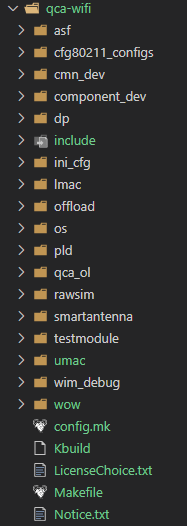

# 高通QSDK qcawifi驱动编译框架

## 目录结构

qca-wifi软件包存放路径如下:

```
$(TOPDIR)/package/feeds/qca/qca-wifi
```

目录组织如下图所示：


而源码路径为`$(TOPDIR)/qca/src/qca-wifi`，如下图所示：



综上：`$(TOPDIR)/package/feeds/qca/qca-wifi`目录（暂且叫做**软件包路径**）下软件包只是OpenWrt的软件架构需要，里面存放OpenWrt编译需要的目录框架，而源码真正存放的路径为`$(TOPDIR)/qca/src/qca-wifi`，暂且叫做**源码路径**。

在编译的时候，软件包下面的OpenWrt会根据**软件包路径**下的Makefile规则，把**源码路径**拷贝到`build_dir/target-arm_cortex-a7_musl-1.1.16_eabi/linux-ipq_ipq60xx/qca-wifi-g431c69b42e38-dirty-unified-profile/qca-wifi-g431c69b42e38-dirty`目录下进行编译，编译完成后会根据**软件包路径**下面Makefile规则，把编译生成的文件拷贝到指定的文件系统的路径下。


## 编译过程

查看`$(TOPDIR)/package/feeds/qca/qca-wifi/Makefile`文件如下:

```
define Build/Compile
	# 去编译目录执行 src_prepare 和 all_build 编译
	$(MAKE) -C $(PKG_BUILD_DIR) src_prepare all_build
endef
```

- 下面查看`$(TOPDIR)/qca/src/qca-wifi/Makefie`的`src_prepare`目标，代码如下

  ```
  src_prepare:
  	src_prepare:
  	$(warning "CONFIG_WIFI_TARGET_WIFI_2_0=$(WIFI_TARGET_2_0)")
  	$(warning "CONFIG_WIFI_TARGET_WIFI_3_0=$(WIFI_TARGET_3_0)")
  	$(warning "FW_HDR_INCLUDE_PATH=$(FW_HDR_INCLUDE_PATH)")
  ifeq ($(WIFI_TARGET_3_0),1)
  #moving of header files is a temporary fix, should be removed once dependencies are resolved
  	rm -f $(FW_HDR_INCLUDE_PATH)/fw/a_osapi.h
  	rm -f $(FW_HDR_INCLUDE_PATH)/fw/athendpack.h
  	cp -af $(FW_HDR_INCLUDE_PATH)/fw/* $(CURR_DIR)/offload/include/
  	cp -af $(FW_HDR_INCLUDE_PATH)/hw/* $(CURR_DIR)/offload/include/
  ifneq ($(ENABLE_6018_HEADER),1)
  	cp -af $(FW_COMMON_INCLUDE_PATH)/qca8074/* $(CURR_DIR)/offload/include/qca8074/
  else
  	cp -af $(FW_COMMON_INCLUDE_PATH)/qca6018/ $(CURR_DIR)/offload/include/.
  endif
  	rm -f $(CURR_DIR)/offload/include/wlan_tgt_def_config.h
  	rm -f $(CURR_DIR)/offload/include/wlan_tgt_def_config_hl.h
  else
  	cp -af $(FW_INCLUDE_PATH)/* $(CURR_DIR)/offload/include/
  endif
  
  
  ifeq ($(WIFI_TARGET_3_0),1)
  	mkdir -p $(CURR_DIR)/offload/include/fwcommon
  	cp -af $(CURR_DIR)/offload/include/wmi.h $(CURR_DIR)/offload/include/fwcommon/
  	rm -f $(CURR_DIR)/offload/include/wmi.h
  	cp -af $(CURR_DIR)/offload/include/wmi_services.h $(CURR_DIR)/offload/include/fwcommon/
  	rm -f $(CURR_DIR)/offload/include/wmi_services.h
  	cp -af $(CURR_DIR)/offload/include/wmi_unified.h $(CURR_DIR)/offload/include/fwcommon/
  	rm -f $(CURR_DIR)/offload/include/wmi_unified.h
  	cp -af $(CURR_DIR)/offload/include/wmix.h $(CURR_DIR)/offload/include/fwcommon/
  	rm -f $(CURR_DIR)/offload/include/wmix.h
  	cp -af $(CURR_DIR)/offload/include/wmi_tlv_defs.h $(CURR_DIR)/offload/include/fwcommon/
  	rm -f $(CURR_DIR)/offload/include/wmi_tlv_defs.h
  	cp -af $(CURR_DIR)/offload/include/wmi_tlv_helper.h $(CURR_DIR)/offload/include/fwcommon/
  	rm -f $(CURR_DIR)/offload/include/wmi_tlv_helper.h
  	cp -af $(CURR_DIR)/offload/include/wmi_version.h $(CURR_DIR)/offload/include/fwcommon/
  	rm -f $(CURR_DIR)/offload/include/wmi_version.h
  	cp -af $(CURR_DIR)/offload/include/wlan_defs.h $(CURR_DIR)/offload/include/fwcommon/
  	cp -af $(CURR_DIR)/offload/include/dbglog.h $(CURR_DIR)/offload/include/fwcommon/
  	rm -f $(CURR_DIR)/offload/include/dbglog.h
  	cp -af $(CURR_DIR)/offload/include/dbglog_id.h $(CURR_DIR)/offload/include/fwcommon/
  	rm -f $(CURR_DIR)/offload/include/dbglog_id.h
  	cp -af $(CURR_DIR)/offload/include/htt.h $(CURR_DIR)/offload/include/fwcommon/
  	rm -f $(CURR_DIR)/offload/include/htt.h
  m
  	#cp -af $(CURR_DIR)/hal/linux/KbuildQDF cmn_dev/qdf/Kbuild
  endif
  
  ```

  

- all_build目标如下

  ```
  all_build: env_prepare driver_build tools_build
  ```

  而env_prepare、driver_build、tools_build目标如下

  - env_prepare：准备工作，不解释

    ```
    env_prepare:
    	@echo "============================PREPARING==========================="
    	@echo $(QCAWLAN_MAKEOPTS)
    	mkdir -p $(CURR_DIR)/root/usr/www/cgi-bin
    	mkdir -p $(CURR_DIR)/root/sbin
    ```

    

  - driver_build：这里会跑到`qca/src/qca-wifi/os/linux`路径下编译

    ```
    driver_build:
    	@echo "===========================BUILDING DRIVER================================="
    	($(foreach var,$(strip $(QCAWLAN_MAKEOPTS)),export $(var);) \
    		$(MAKEARCH) -C $(CURR_DIR)/os/linux TARGET=$(HAL_TARGET))
    ```

    下面分析`qca/src/qca-wifi/os/linux/Makefile`

    ```
    all: compare
    	echo $(INCS)
    ifneq ($(BUILD_X86),y)
    	rm -f $(TMP_FILE)
    ifeq ($(strip ${QCA_PARTNER_MAKE_F_SUPPORT}),1)
    	cd $(DEPTH)/cmn_dev/qdf/ && make -f Kbuild
    	cd $(DEPTH)/asf/ && make -f Kbuild
    	cd $(DEPTH)/lmac/ath_pktlog && make -f Kbuild
    	cd $(DEPTH)/cmn_dev/spectral && make -f Kbuild
            cd $(DEPTH)/cmn_dev/qdf/ && make -f Kbuild
    	cd $(DEPTH)/umac && make -f Kbuild
    	cd $(DEPTH)/qca_ol && make -f Kbuild
    ```

    分析这段代码可以看出，例如umac，执行`cd $(DEPTH)/umac && make -f Kbuild`

    下面举例分析`umac/Kbuild`

    ```
    all: umac.ko
    
    umac.mod.o: umac.mod.c
    	${CC} -c -o $@ ${EXTRA_CFLAGS} ${MOD_CFLAGS} $<
    
    umac.o: ${umac-objs}
    	$(LD) -m elf32btsmip -r -o umac.o $(umac-objs)
    	$(KERNELPATH)/scripts/mod/modpost umac.o
    
    umac.ko: umac.o umac.mod.o
    	$(LD) $(LDOPTS) -o umac.ko umac.o umac.mod.o
    
    %.o: %.c
    	${CC} -c -o $@ ${EXTRA_CFLAGS} $<
    ```

    到此结束，即可编译umac.ko

  - tools_build：一些工具，跑到`qca/src/qca-wifi/os/linux/tools`下面编译

    ```
    tools_build:
    	@echo "===========================BUILDING TOOLS================================="
    	($(foreach var,$(strip $(QCAWLAN_MAKEOPTS)),export $(var);) \
    	    $(MAKEARCH) -C $(CURR_DIR)/os/linux/tools \
    	    QCACFLAGS="$(TARGET_CFLAGS) -Wall -Wno-error"  \
    	    QCALDFLAGS="-Wl,--gc-sections $(TARGET_LDFLAGS) -Wall -Wno-error" \
    	        INSTALL_ROOT=$(CURR_DIR)/root ath_tools wlanconfig)
    ```

    下面分析`qca/src/qca-wifi/os/linux/tools/Makefile`

    ```
    athdebug: athdebug.c
    	${CC} -o athdebug ${CFLAGS} ${LDFLAGS} athdebug.c
    wifitool: wifitool.c $(QCA_TOOLS_LIB)
    ifeq ($(UMAC_SUPPORT_CFG80211), 1)
    	${CC} -o wifitool ${CFLAGS} ${LDFLAGS} ${TARGET_CFLAGS} -pthread -ldl wifitool.c libqca_tools.so -lqca_nl80211_wrapper ${TARGET_LDFLAGS}
    else
    	${CC} -o wifitool ${CFLAGS} ${LDFLAGS} -pthread wifitool.c qcatools_lib.c ${Bx86_LIB}
    endif
    ```

    

  - 

  

综上所示：驱动和工具都被编译了！

## 自己的日志系统

新增文件如下:


- wim_debug.c

  ```c
  #include "ieee80211_mlme_priv.h"
  #include "ieee80211_wds.h"
  #include <ieee80211_admctl.h>
  #include "osif_private.h"
  #include <ol_if_athvar.h>
  #include <wlan_dfs_ioctl.h>
  #include "ieee80211_mlme_dfs_dispatcher.h"
  
  #include <wlan_cmn.h>
  #include <wlan_objmgr_cmn.h>
  #include <wlan_objmgr_global_obj.h>
  #include <wlan_objmgr_psoc_obj.h>
  #include <wlan_objmgr_pdev_obj.h>
  #include <wlan_objmgr_vdev_obj.h>
  #include <wlan_objmgr_peer_obj.h>
  #include "wlan_mgmt_txrx_utils_api.h"
  #include <wlan_son_pub.h>
  #include "wlan_crypto_global_def.h"
  #include "wlan_crypto_global_api.h"
  
  #include <qdf_mc_timer.h>
  
  #include "wim_debug.h"
  /* xym add */
   
  long long  g_wim_debug_time_start;
  long long  g_wim_debug_time_last;
  
  
   
  
  #if WIM_DEBUG_CACE_EN
  /***********************************************************************************************************/
  
  
  #define LOG_MSG_QUEUE_MAX_ITEM 512
  
  typedef struct				/* LOG_MSG */
  {
  	char 	  fmt[128];			/* pointer to format string */
  	uint32_t  index;
  }log_msg_item_t;
  
  
  typedef struct log_msg_queue {
  	uint16_t uiHead;   //队头指针
  	uint16_t uiTral;   //队尾指针，若队尾不为空，则指向队尾元素的下一个位置
  	uint16_t uiMaxSize;
  	uint32_t ulIndex;
  	log_msg_item_t item[LOG_MSG_QUEUE_MAX_ITEM];
  
  }log_msg_queue_t;
  
  extern int log_msg_queue_de(log_msg_queue_t *Q, log_msg_item_t **e);
  extern log_msg_queue_t g_log_msg_queue;
  
  /***********************************************************************************************************/
  
  void log_msg_queue_init(log_msg_queue_t *Q)
  {
  	Q->uiMaxSize = LOG_MSG_QUEUE_MAX_ITEM;
  	Q->uiHead = Q->uiTral = 0;       //队空
  }
  
  //入队
  int log_msg_queue_en(log_msg_queue_t *Q, log_msg_item_t *e)
  {
  	if ((Q->uiTral + 1) % Q->uiMaxSize == Q->uiHead) return 1; //队满，无法添加
  	memcpy(&Q->item[Q->uiTral], e, sizeof(log_msg_item_t));//插入元素
  	Q->uiTral = (Q->uiTral + 1) % Q->uiMaxSize; //队尾指针+1
  	return 0;
  }
  
  //出队
  int log_msg_queue_de(log_msg_queue_t *Q, log_msg_item_t **e)
  {
  	if (Q->uiHead == Q->uiTral) return 1; //队空，无法删除
  	*e = &Q->item[Q->uiHead];
  	Q->uiHead = (Q->uiHead + 1) % Q->uiMaxSize;  //队头指针+1
  	return 0;
  }
  
  //清队
  void log_msg_queue_clear(log_msg_queue_t *Q)
  {
  	Q->uiHead = Q->uiTral = 0;
  	memset((void*)Q->item, 0, Q->uiMaxSize * sizeof(log_msg_item_t));
  }
  
  //返回队列长度
  uint16_t log_msg_queue_len(log_msg_queue_t *Q)
  {
  	return (Q->uiTral - Q->uiHead + Q->uiMaxSize) % Q->uiMaxSize;
  }
  
  
  
  log_msg_queue_t g_log_msg_queue = {
  	0,
  	0,
  	LOG_MSG_QUEUE_MAX_ITEM,
  	0,
  };
  
  
  
  
  #endif
  
  
  long long wim_get_reltime_ns(void)
  {
  	long long time_tmp = qdf_get_monotonic_boottime_ns();
      return time_tmp;
  }
  long long wim_get_reltime_ms(void)
  {
  	qdf_time_t time_tmp = qdf_get_time_of_the_day_ms();
      return (long long)time_tmp;
  }
   
  void wim_log_msg(const char* fmt,...)
  {
  #if (WIM_DEBUG_CACE_EN==0)
      va_list args;
      char buf[512] = {0};
  
      va_start(args, fmt);
      vsprintf(buf, fmt, args);
      va_end(args);
  
      printk("%s\n",buf);
  
  
  #else
  
  	log_msg_item_t msg;
      va_list args;
  
  	g_log_msg_queue.ulIndex++;
  
      va_start(args, fmt);
      vsprintf(msg.fmt, fmt, args);
      va_end(args);
  
      msg.index = g_log_msg_queue.ulIndex;
      log_msg_queue_en(&g_log_msg_queue, &msg);
  #endif
  
  }
  
  
  
  
  void wim_log_print(void)
  {
  	log_msg_item_t *item;
  	while(1){
  		if(log_msg_queue_de(&g_log_msg_queue,&item)){
  			break;
  		}
  		
  		printk("%d-%s\n",item->index,item->fmt);
  
  	}
  	
  }
  ```

  

- wim_debug.h

  ```c
  #ifndef _WIM_DEBUG_H
  #define _WIM_DEBUG_H
  
  #define __WIM_DEBUG_EN__
  
  #ifdef __WIM_DEBUG_EN__
  
  #define WIM_DEBUG_CACE_EN 1
  #if (WIM_DEBUG_CACE_EN==1)
      void wim_log_print(void);
  #endif
  extern long long  g_wim_debug_time_start;
  extern long long  g_wim_debug_time_last;
  
  extern void  wim_log_msg(const char* fmt,...);
  extern long long wim_get_reltime_ns(void);
  extern long long wim_get_reltime_ms(void);
  
  #define WIM_COLOR_END                       "\033[0m"
  #define WIM_INFO_COLOR                      "\033[36m"
  #define WIM_DEBUG_COLOR                     "\033[35m"
  #define WIM_WARNING_COLOR                   "\033[33m"
  #define WIM_ERROR_COLOR                     "\033[31m"
  
  typedef enum
  {
      //打印错误
      WIM_LOG_LEVEL_ERROR,
      //打印警告
      WIM_LOG_LEVEL_WARNING,
      //打印信息
      WIM_LOG_LEVEL_INFO,
      //打印调试信息
      WIM_LOG_LEVEL_DEBUG,
  
  }log_level_enum_t;
  
  
  
  
  #define WIM_LOG_LEVEL WIM_LOG_LEVEL_DEBUG
  
  
  #define WIM_PRINT wim_log_msg
  
  #define WIM_LOG_DEBUG(fmt,...)       do{\
                                              if (WIM_LOG_LEVEL >= WIM_LOG_LEVEL_DEBUG)\
                                              {\
                                                g_wim_debug_time_start = wim_get_reltime_ms();\
                                                WIM_PRINT(WIM_DEBUG_COLOR"[D %lu-%s-%d]:"fmt""WIM_COLOR_END,(uint32_t)g_wim_debug_time_start,__func__,__LINE__,##__VA_ARGS__);\
                                              }\
                                          }while(0)
  
  #define WIM_LOG_INFO(fmt,...)        do{\
                                              if (WIM_LOG_LEVEL >= WIM_LOG_LEVEL_INFO)\
                                              {\
                                                g_wim_debug_time_start = wim_get_reltime_ms();\
                                                WIM_PRINT(WIM_INFO_COLOR"[I %lu-%s-%d]:"fmt""WIM_COLOR_END,(uint32_t)g_wim_debug_time_start,__func__,__LINE__,##__VA_ARGS__);\
                                              }\
                                          }while(0)
  
  
  #define WIM_LOG_WARNING(fmt,...)     do{\
                                              if (WIM_LOG_LEVEL >= WIM_LOG_LEVEL_WARNING)\
                                              {\
                                                g_wim_debug_time_start = wim_get_reltime_ms();\
                                                WIM_PRINT(WIM_WARNING_COLOR"[W %lu-%s-%d difftime:%d]:"fmt""WIM_COLOR_END,(uint32_t)g_wim_debug_time_start,__func__,__LINE__,(int)(g_wim_debug_time_start-g_wim_debug_time_last),##__VA_ARGS__);\
                                                g_wim_debug_time_last  = wim_get_reltime_ms();\
                                              }\
                                          }while(0)
  
  #define WIM_LOG_ERROR(fmt,...)       do{\
                                              if (WIM_LOG_LEVEL >= WIM_LOG_LEVEL_ERROR)\
                                              {\
                                                g_wim_debug_time_start = wim_get_reltime_ms();\
                                                WIM_PRINT(WIM_ERROR_COLOR"[E %lu-%s-%d difftime:%d]:"fmt""WIM_COLOR_END,(uint32_t)g_wim_debug_time_start,__func__,__LINE__,(int)(g_wim_debug_time_start-g_wim_debug_time_last),##__VA_ARGS__);\
                                                g_wim_debug_time_last  = wim_get_reltime_ms();\
                                                wim_log_print();\
                                              }\
                                          }while(0)
  
  #else
  #define WIM_LOG_INFO(fmt,...)            do { } while (0)
  #define WIM_LOG_DEBUG(fmt,...)           do { } while (0)
  #define WIM_LOG_WARNING(fmt,...)         do { } while (0)
  #define WIM_LOG_ERROR(fmt,...)           do { } while (0)
  
  #endif
  
  
  
  
  
  
  
  
  
  
  
  
  
  
  
  
  
  
  
  #endif
  ```

  

请修改对应目录下的Kbuild文件，新增.h个.c文件 例如`qca/src/qca-wifi/umac/Kbuild`修改如下


