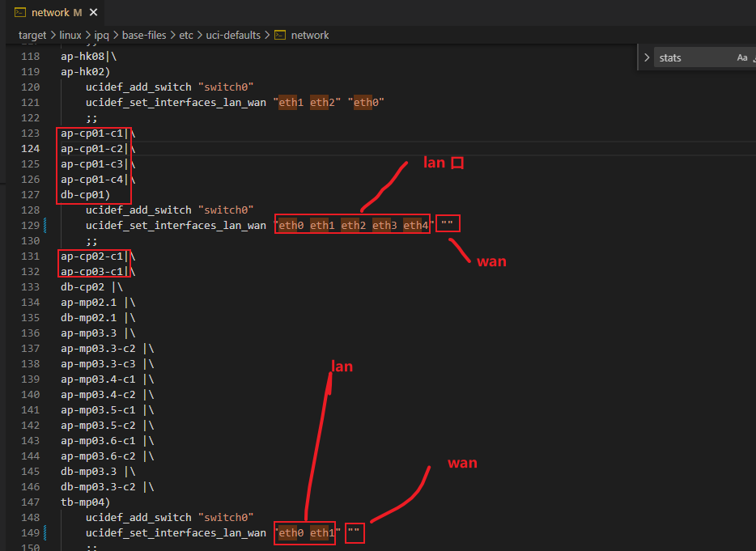

# 高通QSDK 设置默认参数

## 如何设置默认的时区和时间同步

修改`package/base-files/files/etc/config/system`文件内容如下

```bash
config system
	option hostname 'OpenWrt'
    option log_size '64'
    option zonename 'Asia/Shanghai'
    option timezone 'CST-8'
	option log_size	64

config timeserver ntp
	list server	0.openwrt.pool.ntp.org
	list server	1.openwrt.pool.ntp.org
	list server	2.openwrt.pool.ntp.org
	list server	3.openwrt.pool.ntp.org
	option enabled 1
	option enable_server 0
```

## 如何设置默认的无线参数

修改`qca/feeds/qca/net/qca-wifi/files/qcawificfg80211.sh`文件内容如下

```bash
cat <<EOF
config wifi-device  wifi$devidx
	option type	qcawificfg80211
	option channel	auto
	option macaddr	$(cat /sys/class/net/${dev}/address)
	option hwmode	11${mode_11}
	# REMOVE THIS LINE TO ENABLE WIFI:
	option disabled 0

config wifi-iface
	option device	wifi$devidx #这里命名加了索引号
	option network	lan
	option mode	ap
	option ssid	wim_$(cat /sys/class/net/${dev}/address)_$devidx #这里的ssid加了mac地址和索引号
	option encryption none

EOF
```

## 如何修改默认有线网卡br-lan和wan口

理论上修改`package/base-files/files/etc/config/network`文件即可，但是被某些脚本给覆盖了，脚本如下：

修改`target/linux/ipq/base-files/etc/uci-defaults/network`文件



## 如何修改有线网卡的默认mac地址

理论上修改`package/base-files/files/etc/config/network`文件：新增`option macaddr`

```bash
config interface 'loopback'
        option ifname 'lo'
        option proto 'static'
        option ipaddr '127.0.0.1'
        option netmask '255.0.0.0'

config globals 'globals'
        option ula_prefix 'auto'

config switch
        option name 'switch0'

config interface 'lan'
        option ifname 'eth0 eth1 eth2 eth3 eth4'
        option force_link '1'
        option type 'bridge'
        option proto 'static'
        option ipaddr '192.168.50.1'
        option netmask '255.255.255.0'
        option ip6assign '60'
        option multicast_querier '0'
        option igmp_snooping '0'
        option ieee1905managed '1'
        option macaddr "56:99:F6:D7:99:4C"   # 修改br-lan的mac地址

config interface 'wan'
        option proto 'dhcp'

config interface 'wan6'
        option proto 'dhcpv6'
```


## 如何查看板子类型

```bash
cat /tmp/sysinfo/board_name
```

## 如何查看系统的编译时间

```bash
cat /proc/version
```

## 如何使能enable_ol_stats 1


## 如何修改系统的默认登录密码

1. 修改配置文件为`package/network/services/dropbear/files/dropbear.config`内容如下：

   ```bash
   config dropbear
   	option PasswordAuth 'on'
   	option RootPasswordAuth 'on'
   	option Port         '22'
   #	option BannerFile   '/etc/banner'
   ```

2. 用网页把密码改了，然后提交

   

3. 查看板子上的`/etc/shadow文件`，复制root那一行的内容

   ```bash
   root:$1$dsPwbSvk$8Lw30jMnX8ClB6.H3Eh5j1:19535:0:99999:7:::          # 复制該行内容
   daemon:*:0:0:99999:7:::
   ftp:*:0:0:99999:7:::
   network:*:0:0:99999:7:::
   nobody:*:0:0:99999:7:::
   dnsmasq:x:0:0:99999:7:::
   lldp:x:0:0:99999:7:::
   
   ```

   

4. 修改源码`package/base-files/files/etc/shadow`文件中root那一行的内容，为第3步复制的内容即可

   黏贴前

   ```bash
   root::0:0:99999:7:::
   daemon:*:0:0:99999:7:::
   ftp:*:0:0:99999:7:::
   network:*:0:0:99999:7:::
   nobody:*:0:0:99999:7:::
   ```

   黏贴后

   ```bash
   root:$1$dsPwbSvk$8Lw30jMnX8ClB6.H3Eh5j1:19535:0:99999:7:::
   daemon:*:0:0:99999:7:::
   ftp:*:0:0:99999:7:::
   network:*:0:0:99999:7:::
   nobody:*:0:0:99999:7:::
   ```

## 如何修改开机logo

修改文件`package/base-files/files/etc/banner`

```bash
     MM           NM                    MMMMMMM          M       M
   $MMMMM        MMMMM                MMMMMMMMMMM      MMM     MMM
  MMMMMMMM     MM MMMMM.              MMMMM:MMMMMM:   MMMM   MMMMM
MMMM= MMMMMM  MMM   MMMM       MMMMM   MMMM  MMMMMM   MMMM  MMMMM'
MMMM=  MMMMM MMMM    MM       MMMMM    MMMM    MMMM   MMMMNMMMMM
MMMM=   MMMM  MMMMM          MMMMM     MMMM    MMMM   MMMMMMMM
MMMM=   MMMM   MMMMMM       MMMMM      MMMM    MMMM   MMMMMMMMM
MMMM=   MMMM     MMMMM,    NMMMMMMMM   MMMM    MMMM   MMMMMMMMMMM
MMMM=   MMMM      MMMMMM   MMMMMMMM    MMMM    MMMM   MMMM  MMMMMM
MMMM=   MMMM   MM    MMMM    MMMM      MMMM    MMMM   MMMM    MMMM
MMMM$ ,MMMMM  MMMMM  MMMM    MMM       MMMM   MMMMM   MMMM    MMMM
  MMMMMMM:      MMMMMMM     M         MMMMMMMMMMMM  MMMMMMM MMMMMMM
    MMMMMM       MMMMN     M           MMMMMMMMM      MMMM    MMMM
     MMMM          M                    MMMMMMM        M       M
       M
---------------------------------------------------------------
  For those about to rock... (%C, %R)
---------------------------------------------------------------
```

## 如何修改主机名字

修改`package/base-files/files/etc/config/system`文件内容如下：

```bash
config system
	option hostname 'wim' 				# 修改主机名字地方
    option log_size '64'
    option zonename 'Asia/Shanghai'
    option timezone 'CST-8'
	option log_size	64

config timeserver ntp
	list server	0.openwrt.pool.ntp.org
	list server	1.openwrt.pool.ntp.org
	list server	2.openwrt.pool.ntp.org
	list server	3.openwrt.pool.ntp.org
	option enabled 1
	option enable_server 0

```


