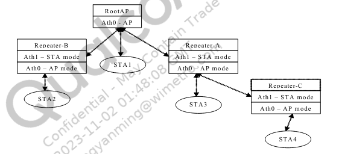
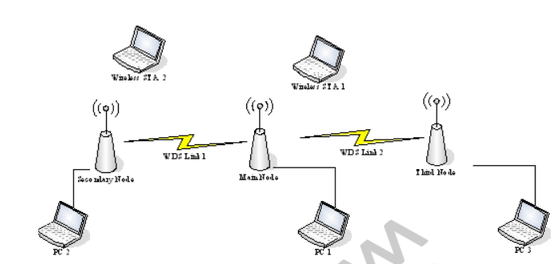
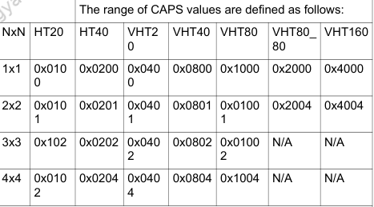

#	NAWDS

## 简介

基本概念

- NAWDS:Non-Association WDS （无关联wds），与基于关联的WDS相比，NAWDS链路的建立不需要经过802.11关联过程。

- NAWDS AP：NAWDS AP是启用了NAWDS功能的AP，支持WDS 4地址通信。根据是否发送信标，NAWDS AP可以是NAWDS Repeater 或NAWDS Bridge

- NAWDS Repeater

  NAWDS中继器发送信标并支持IEEE802.11关联过程，允许STA连接到它。关联/连接到中继器的STA和PC可以通过NAWDS链路到达对端NAWDS AP中的其他STA/PC

- NAWDS Bridge

  NAWDS网桥不发送信标。连接到网桥的PC可以通过NAWDS链路到达对等NAWDS AP中的其他STA/PC

- Static NAWDS Repeater/Bridge

  静态NAWDS AP不具有学习功能。用户必须手动将对等NAWDS AP的MAC地址添加到其NAWDS MAC表中， 如果NAWDS AP的MAC地址不在NAWDS MAC表中，则静态NAWDS AP将从该特定NAWDS AP丢弃数据包。

- Learning NAWDS Repeater/Bridge

  学习型NAWDS AP具有学习功能。每当它从对等NAWDS AP接收到数据包时，它就会了解对等AP的MAC地址，并将该地址添加到其NAWDS MAC表中，以便它可以通过NAWDS链路与特定AP进一步通信。

现有的wds解决方案是基于构建wds树来转发数据，并且需要设备间关联协议。原始的wds设计如图所示：



NAWDS更像是一个平面结构，NAWDS节点都直接与一个或多个对端的NAWDS AP进行通信。

- 用户可以为每个NAWDS AP配置对端NAWDS AP的MAC地址；
- 或者启用学习功能以允许NAWDS AP在从对端AP获取数据包时自动添加对端NAWDS APMAC地址到自己的NAWDS列表中。

NAWDS关系图如下：



**注意**：针对NAWDS，有些限制如下：

1. 必须有个static的节点，其他的节点可以使用静态配置或者主动学习的模式，加入自己的NAWDS节点列表中；
2. 在任意两个NAWDS节点之间，帧必须使用四个地址才能正确转发。
3. 网络中的所有NAWDS节点必须具有相同的加密设置。目前仅支持Open/WEP模式
4. 由于没有关联过程，对等NAWDS AP的caps必须提前配置


## 设置

### 配置模式

```bash

#说明：设置模式0-4 
#x取值范围：
#			Repeater 		Bridge
#		（send beacons） （Not send beacons）
#staic		    1               2
#learning       3               4
# 禁能 ：0
wlanconfig ath2 nawds mode x

```

根据是否发送beacons分为

- Repeater模式：不会发beacons帧，附近sta无法连接该ap
- Bridge 模式：会发beacons帧，附近sta可以正常连接该ap

### 配置caps能力

如果一个NAWDS Ap工作在学习模式下，它不知道对端NAWDS节点的能力如何，所以这里要用defcaps参数来设置

```bash
wlanconfig athX nawds defcaps caps
```

caps取值如下：

- bits：0-7  代表nss

  ```bash
  #define NAWDS_REPEATER_CAP_DS 0x01   #NSS 2x2
  #define NAWDS_REPEATER_CAP_TS 0x02   #NSS 3x2
  #define NAWDS_REPEATER_CAP_4S 0x04   #NSS 4x4
  ```

- Bits 8 - 15 CHWIDHT/HTMODE

  ```bash
  #define NAWDS_REPEATER_CAP_HT20 0x0100
  #define NAWDS_REPEATER_CAP_HT2040 0x0200
  ```

  VHT Capability

  ```bash
  #define NAWDS_REPEATER_CAP_11ACVHT20 0x0400
  #define NAWDS_REPEATER_CAP_11ACVHT40 0x0800
  #define NAWDS_REPEATER_CAP_11ACVHT80 0x1000
  #define NAWDS_REPEATER_CAP_11ACVHT80_80 0x2000
  #define NAWDS_REPEATER_CAP_11ACVHT160 0x4000
  ```

- Bits 16 - 23 TX BF

  ```bash
  #define NAWDS_REPEATER_CAP_TXBF 0x010000
  ```

- Bits 24 - 31 HE Capability 

  ```bash
  #define NAWDS_REPEATER_CAP_11AXAHE20 0x01000000
  #define NAWDS_REPEATER_CAP_11AXGHE20 0x02000000
  #define NAWDS_REPEATER_CAP_11AXAHE40 0x04000000
  #define NAWDS_REPEATER_CAP_11AXGHE40 0x08000000
  #define NAWDS_REPEATER_CAP_11AXAHE80 0x10000000
  #define NAWDS_REPEATER_CAP_11AXAHE160 0x20000000
  #define NAWDS_REPEATER_CAP_11AXAHE80_80 0x40000000
  ```

总结下来就是：caps取值如下图所示：N/A是不支持的




### 指定一个特定的mac地址和能力的节点到NAWDS 列表中

```bash
#增加 一个特定 nawds ap 用 mac_addr caps
#caps的取值范围如上面介绍：
wlanconfig athN nawds add-repeater mac_addr caps

```

### 从NAWDS列表删除一个ap

```bash
#删除指定mac 的 nawds ap 
wlanconfig athN nawds del-repeater mac_addr
```

### 列出当前NAWDS列表

```bash
#列出当前NAWDS 配置
wlanconfig athN nawds list
```

### NAWDS列表覆盖功能

```bash
#value 0: 当NAWDS表已满时，将不再向该表添加MAC地址
#      1:当NAWDS MAC表中的条目空间用完时（通过配置过多的NAWDS AP或通过使用学习功能学习过多的AP），
#        启用该位，将删除已死亡NAWDS AP占用的MAC地址，覆盖原有条目
wlanconfig athN nawds override value
```

### 使能wds总开关

```bash
# 使能 wds
cfg80211tool ath0 wds 1
```


## 举例说明

- ROOTAP 

  - ath0 mac 地址配置： 00:0f:ff:01:40:11
  - ath2 mac 地址配置：00:0f:ff:01:40:12
  - IP配置：192.168.50.12

  ```bash
  cfg80211tool ath0 wds 1
  wlanconfig ath0 nawds mode 2  #静态桥接模式
  
  cfg80211tool ath2wds 1
  wlanconfig ath2 nawds mode 2  #静态桥接模式
  ```

  

- NODEAP1

  - ath2 mac 地址配置： 00:0f:ff:01:40:13

  ```bash
  cfg80211tool ath2 wds 1
  wlanconfig ath2 nawds mode 2  #静态桥接模式
  
  #nawds列表为ROOTAP的ath0网卡
  wlanconfig ath2 nawds add-repeater 00:0f:ff:01:40:11  0x1004  #80M 4X4
  ```

  

- NODEAP2

  - ath2 mac 地址配置： 00:0f:ff:01:40:14

  ```bash
  cfg80211tool ath2  wds 1
  wlanconfig ath2  nawds mode 2  #静态桥接模式
  
  #nawds列表为ROOTAP的ath2网卡
  wlanconfig ath2  nawds add-repeater 00:0f:ff:01:40:12  0x1004  #80M 4X4
  ```

- 测试

  在ROOTAP上执行下面的命令

  ```bash
  #使得ROOTAP的 ath0 卡 nawds 到 NODEAP1 同时删除掉 ath2 连接的 NODEAP2
  wlanconfig ath0 nawds add-repeater 00:0f:ff:01:40:13 0x1000 && wlanconfig ath2 nawds del-repeater 00:0f:ff:01:40:14 
  
  #使得ROOTAP的 ath2 卡 nawds 到 NODEAP2 同时删除掉 ath0 连接的 NODEAP1
  wlanconfig ath2 nawds add-repeater 00:0f:ff:01:40:14 0x1000 && wlanconfig ath0 nawds del-repeater 00:0f:ff:01:40:13
  ```

  

