# QSDK 12.2移植

## 下载

1. 解压`qca-networking-2022-spf-12-2_qca_oem.gz`

   ```bash
   mkdir qsdk12.2
   tar -xvf qca-networking-2022-spf-12-2_qca_oem.gz -C qsdk12.2
   ```

2. 刪除掉多余

   ```bash
   rm -rf IPQ5018.ILQ.12.* IPQ9574.ILQ.12.* IPQ8074.ILQ.12.* IPQ5322.ILQ.* TZ.WNS.4.0 TZ.WNS.5.3 TZ.BF.4.0.8 BOOT.BF.* BOOT.XF.0.3.1* BTFW.MAPLE.* TMEL.WNS.* WLAN.WBE*
   
   cp -rf */* .
   ```

   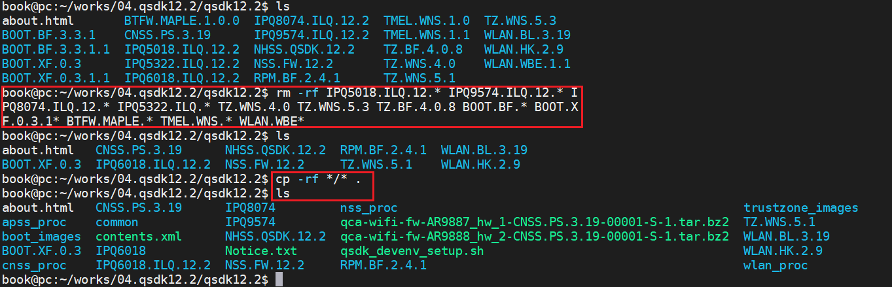

3. repo

   ```bash
   repo init -u https://git.codelinaro.org/clo/qsdk/releases/manifest/qstak -b release -m AU_LINUX_QSDK_NHSS.QSDK.12.2.R4_TARGET_ALL.12.2.04.2049.023.xml
   ```

   如果上面的命令出现错误请执行下面的命令：

   ```bash
   repo init -u https://git.codelinaro.org/clo/qsdk/releases/manifest/qstak -b release -m AU_LINUX_QSDK_NHSS.QSDK.12.2.R4_TARGET_ALL.12.2.04.2049.023.xml --repo-url=https://git.codelinaro.org/clo/la/tools/repo.git --repo-branch=qc-stable --no-clone-bundle
   
   repo sync -j8 --no-tags -qc
   ```


## 源码修改

#### Uboot

1. 配置修改

   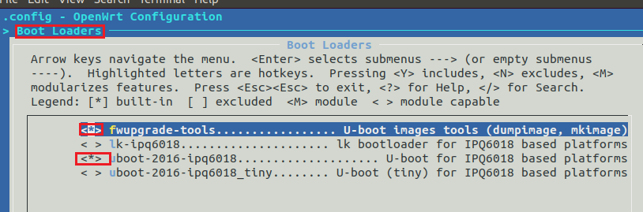

2. 修改PROMTP

   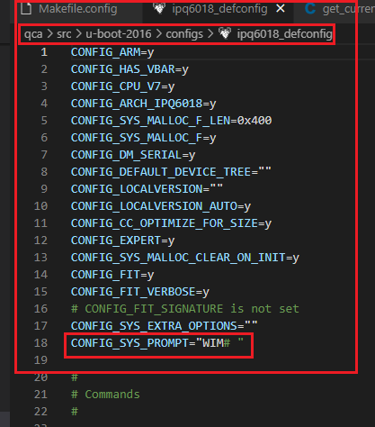

3. 修改dts，适配网卡

   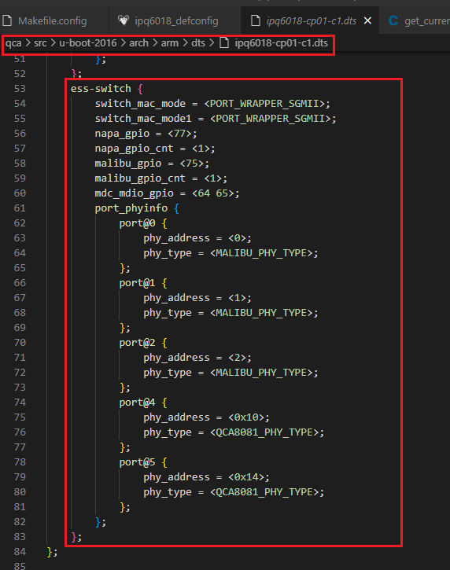

4. 新增硬件看门狗配置

   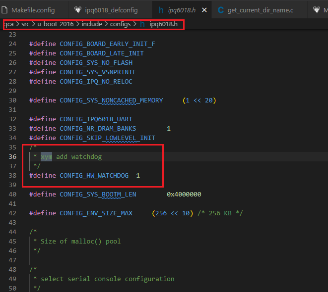

5. 新增硬件看门狗驱动

   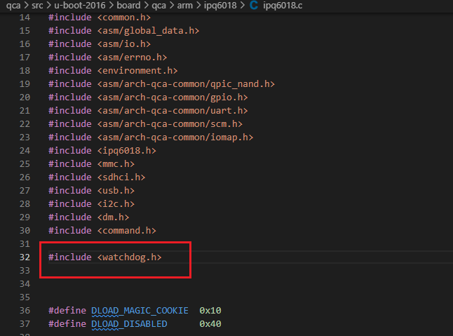

   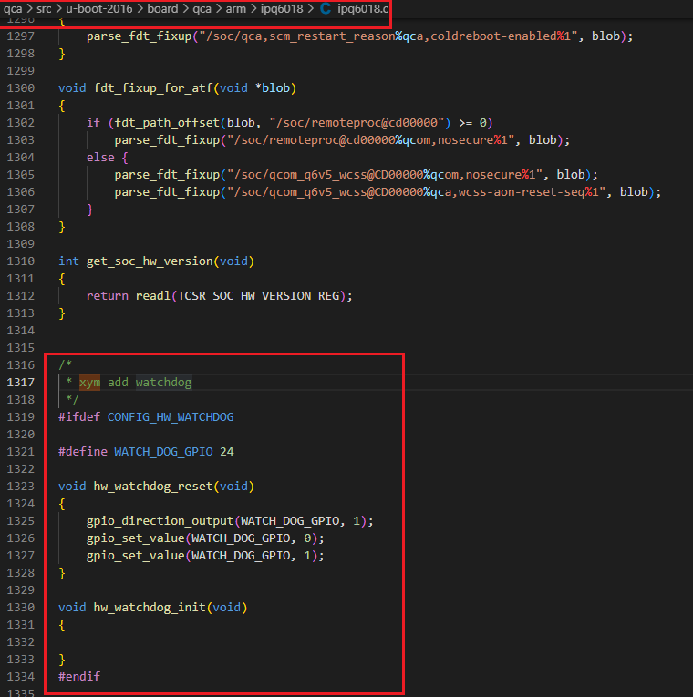

6. todo


#### Kernel

1. 新增iwinfo软件包

   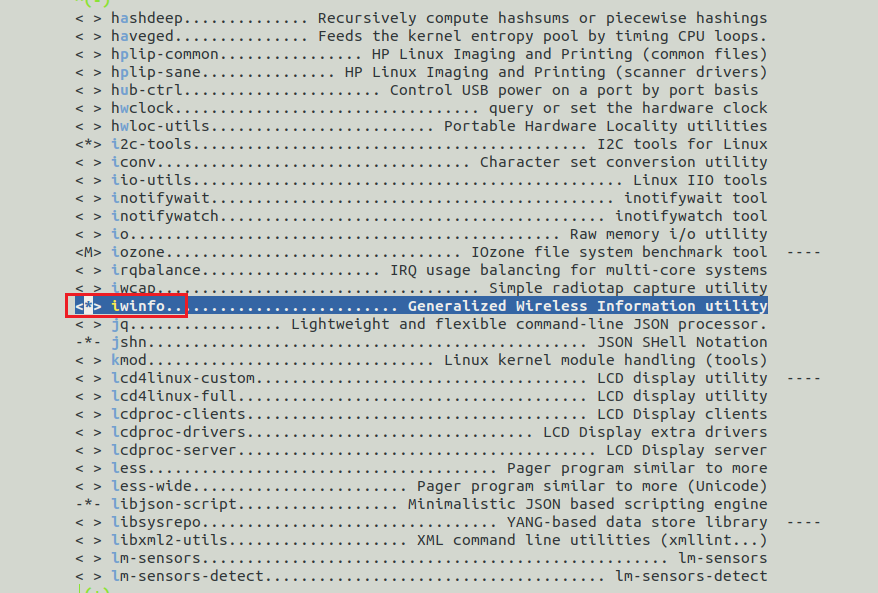

2. 在文件`qca/src/linux-5.4/arch/arm64/boot/dts/qcom/ipq6018-cp01-c3.dts`中新增以下代码

   ```c
   
   /*
    *  xym add
    */
   &tlmm {
   	wdt_pins: wdt_pins {
   		pins = "gpio24";
   		function = "gpio";
   		drive-strength = <8>;
   		bias-pull-down;
   	};
   };
   
   
   &soc {
   	mdio: mdio@90000 {
   		pinctrl-0 = <&mdio_pins>;
   		pinctrl-names = "default";
   		phy-reset-gpio = <&tlmm 77 0>;
   		status = "ok";
   		phy0: ethernet-phy@0 {
   			reg = <0x10>;
   		};
   		phy1: ethernet-phy@1 {
   			reg = <0x14>;
   		};
   	};
   
   	dp1 {
   		device_type = "network";
   		compatible = "qcom,nss-dp";
   		qcom,id = <4>;
   		reg = <0x3a001600 0x200>;
   		qcom,mactype = <0>;
   		local-mac-address = [000000000000];
   		qcom,link-poll = <1>;
   		qcom,phy-mdio-addr = <16>;
   		phy-mode = "sgmii";
   	};
   
   	dp2 {
   		device_type = "network";
   		compatible = "qcom,nss-dp";
   		qcom,id = <5>;
   		reg = <0x3a001800 0x200>;
   		qcom,mactype = <0>;
   		local-mac-address = [000000000000];
   		qcom,link-poll = <1>;
   		qcom,phy-mdio-addr = <20>;
   		phy-mode = "sgmii";
   	};
   
   	ess-switch@3a000000 {
   		switch_cpu_bmp = <0x1>;  /* cpu port bitmap */
   		switch_lan_bmp = <0x10>; /* lan port bitmap */
   		switch_wan_bmp = <0x20>; /* wan port bitmap */
   		switch_inner_bmp = <0xc0>; /*inner port bitmap*/
   		switch_mac_mode = <0xf>; /* mac mode for uniphy instance0*/
   		switch_mac_mode1 = <0xf>; /* mac mode for uniphy instance1*/
   		switch_mac_mode2 = <0xff>; /* mac mode for uniphy instance2*/
   		qcom,port_phyinfo {
   			port@4 {
   				port_id = <4>;
   				phy_address = <0x10>;
   				port_mac_sel = "QGMAC_PORT";
   			};
   			port@5 {
   				port_id = <5>;
   				phy_address = <0x14>;
   				port_mac_sel = "QGMAC_PORT";
   			};
   		};
   	};
   
   	nss-macsec0 {
   		compatible = "qcom,nss-macsec";
   		phy_addr = <0x10>;
   		phy_access_mode = <0>;
   		mdiobus = <&mdio>;
   	};
   	nss-macsec1 {
   		compatible = "qcom,nss-macsec";
   		phy_addr = <0x14>;
   		phy_access_mode = <0>;
   		mdiobus = <&mdio>;
   	};
   	watchdog: watchdog {
   		/* 看门狗 */
   		compatible = "linux,wdt-gpio";
   		pinctrl-0 = <&wdt_pins>;
   		pinctrl-names = "default";
   		gpios = <&tlmm 24 GPIO_ACTIVE_LOW>;
   		hw_algo = "toggle";
   		hw_margin_ms = <1600>;
   		always-running = "true";
   	};
   };
   
   
   ```

   如下图所示：

   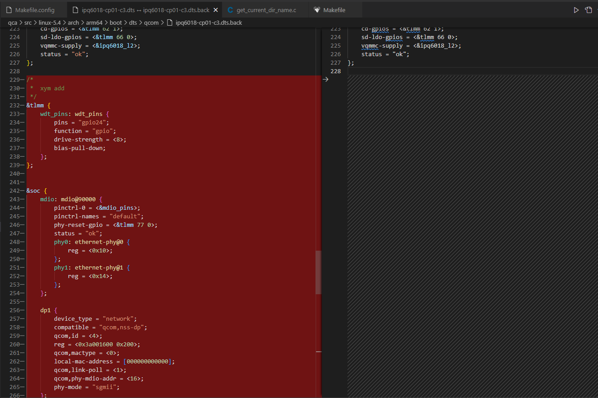

3. 修改内核配置

   - 修改心跳

     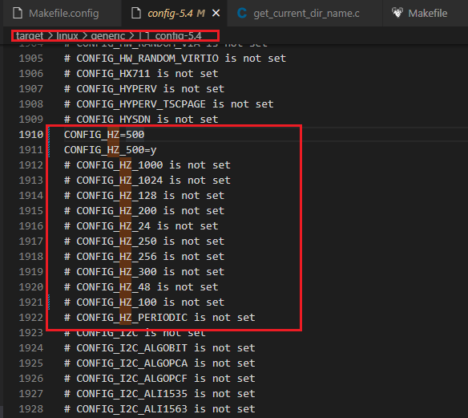

   - 新增内核看门狗

     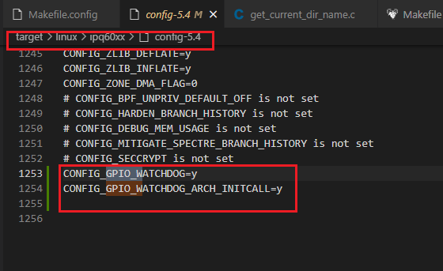

   

4. todo

## 编译

### 手动编译

参见【QCA_NETWORKING_2022.SPF.12.2 CS U1 Release Notes.pdf】文档，我编写了编译脚本，可以直接执行

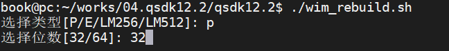

### 脚本编译

**注意**：该方式，有问题，请不要轻易尝试

```bash
cd common/build
python meta_generation_script.py -c r12.2.r3_00009.0 -s IPQ6018.ILQ.12.2 -p P -b 32 -d HYFI,WHC,EZMESH_SRC,EZMESH_BIN,EZMESH_ALG -m EZMESH_FULL–- path /home/book/works/04.qsdk12.2/
```

注意：脚本格式如下：

```bash
#格式如下：
python meta_generation_script.py -c [Chipcode_tag] -s [SP] -p [Profile] -b 
[32/64] -d [Distro_list] -m [MESH]–-path $BUILD_WS
```

参数如下：

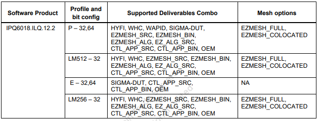打包

## 打包

参见【QCA_NETWORKING_2022.SPF.12.2 CS U1 Release Notes.pdf】文档，我编写了打包脚本，可以直接执行

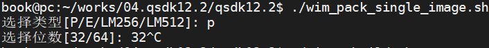

### 生成固件解析

flash布局如下：

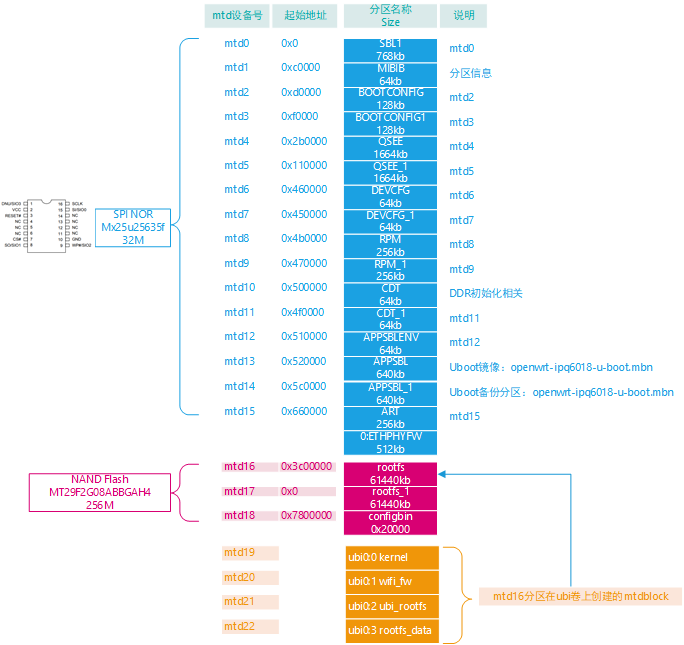


1. `norplusnand-ipq6018-single.img`镜像分析

   ```
   book@pc:~/works/04.qsdk12.2/qsdk12.2/common/build/bin$ dumpimage -l norplusnand-ipq6018-single.img
   FIT description: Flashing nor 100 10000
   Created:         Fri Dec  8 14:11:35 2023
    Image 0 (script)
     Description:  flash.scr
     Created:      Fri Dec  8 14:11:35 2023
     Type:         Script
     Compression:  uncompressed
     Data Size:    22605 Bytes = 22.08 KiB = 0.02 MiB
     Hash algo:    crc32
     Hash value:   25a05ae0
    Image 1 (sbl1-2249111d25f08aa2014faed6fc66e35e084f6654)
     Description:  xbl.elf
     Created:      Fri Dec  8 14:11:35 2023
     Type:         Firmware
     Compression:  uncompressed
     Data Size:    540672 Bytes = 528.00 KiB = 0.52 MiB
     Architecture: ARM
     OS:           Unknown OS
     Load Address: unavailable
     Hash algo:    crc32
     Hash value:   661cc018
    Image 2 (mibib-1b8580e2213813c4cc9c572b137ae51c7298a8b8)
     Description:  norplusnand-system-partition-ipq6018.bin
     Created:      Fri Dec  8 14:11:35 2023
     Type:         Firmware
     Compression:  uncompressed
     Data Size:    65536 Bytes = 64.00 KiB = 0.06 MiB
     Architecture: ARM
     OS:           Unknown OS
     Load Address: unavailable
     Hash algo:    crc32
     Hash value:   4c70a2ed
    Image 3 (bootconfig-f1050e638265203cd2a74f220c37aeaa88edfc7e)
     Description:  bootconfig.bin
     Created:      Fri Dec  8 14:11:35 2023
     Type:         Firmware
     Compression:  uncompressed
     Data Size:    131072 Bytes = 128.00 KiB = 0.12 MiB
     Architecture: ARM
     OS:           Unknown OS
     Load Address: unavailable
     Hash algo:    crc32
     Hash value:   938e98a3
    Image 4 (bootconfig1-f1050e638265203cd2a74f220c37aeaa88edfc7e)
     Description:  bootconfig.bin
     Created:      Fri Dec  8 14:11:35 2023
     Type:         Firmware
     Compression:  uncompressed
     Data Size:    131072 Bytes = 128.00 KiB = 0.12 MiB
     Architecture: ARM
     OS:           Unknown OS
     Load Address: unavailable
     Hash algo:    crc32
     Hash value:   938e98a3
    Image 5 (tz-5371ff12800ec75037875b90289bbafe482dee9f)
     Description:  tz.mbn
     Created:      Fri Dec  8 14:11:35 2023
     Type:         Firmware
     Compression:  uncompressed
     Data Size:    1456832 Bytes = 1422.69 KiB = 1.39 MiB
     Architecture: ARM
     OS:           Unknown OS
     Load Address: unavailable
     Hash algo:    crc32
     Hash value:   9f52cb39
    Image 6 (devcfg-8666c73196e28125dc783776af0206b2c4b86a6b)
     Description:  devcfg.mbn
     Created:      Fri Dec  8 14:11:35 2023
     Type:         Firmware
     Compression:  uncompressed
     Data Size:    45442 Bytes = 44.38 KiB = 0.04 MiB
     Architecture: ARM
     OS:           Unknown OS
     Load Address: unavailable
     Hash algo:    crc32
     Hash value:   f812587b
    Image 7 (rpm-f7ae6c6e3b03b2c11b4d154cf0db219dafdb96e3)
     Description:  rpm.mbn
     Created:      Fri Dec  8 14:11:35 2023
     Type:         Firmware
     Compression:  uncompressed
     Data Size:    108164 Bytes = 105.63 KiB = 0.10 MiB
     Architecture: ARM
     OS:           Unknown OS
     Load Address: unavailable
     Hash algo:    crc32
     Hash value:   03018662
    Image 8 (ddr-AP-CP01-C1_256M32_DDR3-dd3f3176bae709f007b3434b24d5fe6b656a0910)
     Description:  cdt-AP-CP01-C1_256M32_DDR3.bin
     Created:      Fri Dec  8 14:11:35 2023
     Type:         Firmware
     Compression:  uncompressed
     Data Size:    548 Bytes = 0.54 KiB = 0.00 MiB
     Architecture: ARM
     OS:           Unknown OS
     Load Address: unavailable
     Hash algo:    crc32
     Hash value:   980a1526
    Image 9 (ddr-AP-CP01-C2_256M32_DDR3-6c2b6a39daaf4e35f2a4f6e99f2653c61727ea8c)
     Description:  cdt-AP-CP01-C2_256M32_DDR3.bin
     Created:      Fri Dec  8 14:11:35 2023
     Type:         Firmware
     Compression:  uncompressed
     Data Size:    548 Bytes = 0.54 KiB = 0.00 MiB
     Architecture: ARM
     OS:           Unknown OS
     Load Address: unavailable
     Hash algo:    crc32
     Hash value:   fbdb1bbe
    Image 10 (ddr-AP-CP01-C3_256M32_DDR3-b55a7872427a187378912d68f1cd21fd39acae3a)
     Description:  cdt-AP-CP01-C3_256M32_DDR3.bin
     Created:      Fri Dec  8 14:11:35 2023
     Type:         Firmware
     Compression:  uncompressed
     Data Size:    548 Bytes = 0.54 KiB = 0.00 MiB
     Architecture: ARM
     OS:           Unknown OS
     Load Address: unavailable
     Hash algo:    crc32
     Hash value:   5fa80816
    Image 11 (ddr-AP-CP01-C4_256M32_DDR3-a3d2d497503e9e606767bfdd48944c34aaa6dadf)
     Description:  cdt-AP-CP01-C4_256M32_DDR3.bin
     Created:      Fri Dec  8 14:11:35 2023
     Type:         Firmware
     Compression:  uncompressed
     Data Size:    548 Bytes = 0.54 KiB = 0.00 MiB
     Architecture: ARM
     OS:           Unknown OS
     Load Address: unavailable
     Hash algo:    crc32
     Hash value:   b6e778e4
    Image 12 (ddr-AP-CP01-C5_256M32_DDR3-d91d116a59e2edc8aacf228cc4c10d85fe19dc1e)
     Description:  cdt-AP-CP01-C5_256M32_DDR3.bin
     Created:      Fri Dec  8 14:11:35 2023
     Type:         Firmware
     Compression:  uncompressed
     Data Size:    548 Bytes = 0.54 KiB = 0.00 MiB
     Architecture: ARM
     OS:           Unknown OS
     Load Address: unavailable
     Hash algo:    crc32
     Hash value:   cc3f2907
    Image 13 (ddr-AP-CP02-C1_256M32_DDR4-6248f064233e7d9162241a385fe3dff878de701f)
     Description:  cdt-AP-CP02-C1_256M32_DDR4.bin
     Created:      Fri Dec  8 14:11:35 2023
     Type:         Firmware
     Compression:  uncompressed
     Data Size:    548 Bytes = 0.54 KiB = 0.00 MiB
     Architecture: ARM
     OS:           Unknown OS
     Load Address: unavailable
     Hash algo:    crc32
     Hash value:   b97c0932
    Image 14 (ddr-AP-CP03-C1_256M16_DDR3-fdf5fd14236b44732017ae2117a6e5dfde94808f)
     Description:  cdt-AP-CP03-C1_256M16_DDR3.bin
     Created:      Fri Dec  8 14:11:35 2023
     Type:         Firmware
     Compression:  uncompressed
     Data Size:    548 Bytes = 0.54 KiB = 0.00 MiB
     Architecture: ARM
     OS:           Unknown OS
     Load Address: unavailable
     Hash algo:    crc32
     Hash value:   18868aad
    Image 15 (ddr-DB-CP01_256M32_DDR3-eb15d1a82024a703b2016806bcac079864014fbf)
     Description:  cdt-DB-CP01_256M32_DDR3.bin
     Created:      Fri Dec  8 14:11:35 2023
     Type:         Firmware
     Compression:  uncompressed
     Data Size:    548 Bytes = 0.54 KiB = 0.00 MiB
     Architecture: ARM
     OS:           Unknown OS
     Load Address: unavailable
     Hash algo:    crc32
     Hash value:   96e2b520
    Image 16 (ddr-DB-CP02_1024M32_DDR4-a05021a9be1974fbc52d6ecae5011cf12484c0a1)
     Description:  cdt-DB-CP02_1024M32_DDR4.bin
     Created:      Fri Dec  8 14:11:35 2023
     Type:         Firmware
     Compression:  uncompressed
     Data Size:    548 Bytes = 0.54 KiB = 0.00 MiB
     Architecture: ARM
     OS:           Unknown OS
     Load Address: unavailable
     Hash algo:    crc32
     Hash value:   a11ec7c5
    Image 17 (ddr-CP-EMU_256M32_DDR3-675993015fed1bf5a6a21cc410e22263fb9cd9f2)
     Description:  cdt-CP-EMU_256M32_DDR3.bin
     Created:      Fri Dec  8 14:11:35 2023
     Type:         Firmware
     Compression:  uncompressed
     Data Size:    548 Bytes = 0.54 KiB = 0.00 MiB
     Architecture: ARM
     OS:           Unknown OS
     Load Address: unavailable
     Hash algo:    crc32
     Hash value:   2b7d771b
    Image 18 (u-boot-5ed2e0a3d5935e809588d1f80dcea2110fe518de)
     Description:  openwrt-ipq6018-u-boot.mbn
     Created:      Fri Dec  8 14:11:35 2023
     Type:         Firmware
     Compression:  uncompressed
     Data Size:    617752 Bytes = 603.27 KiB = 0.59 MiB
     Architecture: ARM
     OS:           Unknown OS
     Load Address: unavailable
     Hash algo:    crc32
     Hash value:   3bcc91ff
    Image 19 (ubi-a48a92a793dcb6b9a9fec1dd65143f06a2b68fb7)
     Description:  openwrt-ipq60xx-ipq60xx_32-ubi-root.img
     Created:      Fri Dec  8 14:11:35 2023
     Type:         Firmware
     Compression:  uncompressed
     Data Size:    30408704 Bytes = 29696.00 KiB = 29.00 MiB
     Architecture: ARM
     OS:           Unknown OS
     Load Address: unavailable
     Hash algo:    crc32
     Hash value:   a705826d
   
   ```

   如上代码所示：可以看出`norplusnand-ipq6018-single.img`镜像组成如下：

   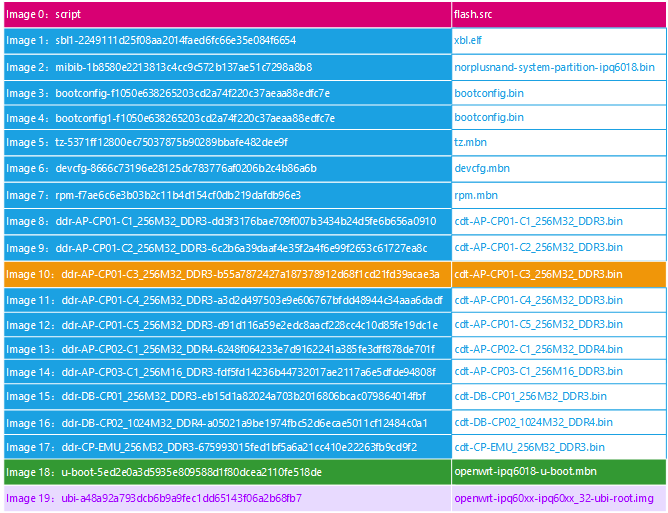

   针对image0中的`flash.src`是在打包的时候生成，文件内容如下：

   ```bash
   sf probe
   
   imgaddr=0x44000000
   
   echo \\c'Flashing sbl1:                                         '#xbl.elf
   imxtract $imgaddr sbl1-2249111d25f08aa2014faed6fc66e35e084f6654
   sf erase 0x00000000 +0x000c0000
   sf write $fileaddr 0x00000000 0x00084000
   echo '[ done ]'
   
   
   echo \\c'Flashing mibib:                                        '#norplusnand-system-partition-ipq6018.bin
   imxtract $imgaddr mibib-1b8580e2213813c4cc9c572b137ae51c7298a8b8
   sf erase 0x000c0000 +0x00010000
   sf write $fileaddr 0x000c0000 0x00010000
   echo '[ done ]'
   
   
   
   echo \\c'Flashing bootconfig:                                   '#bootconfig.bin
   imxtract $imgaddr bootconfig-f1050e638265203cd2a74f220c37aeaa88edfc7e		
   sf erase 0x000d0000 +0x00020000
   sf write $fileaddr 0x000d0000 0x00020000
   echo '[ done ]'
   
   
   
   echo \\c'Flashing bootconfig1:                                  '#bootconfig.bin
   imxtract $imgaddr bootconfig1-f1050e638265203cd2a74f220c37aeaa88edfc7e
   sf erase 0x000f0000 +0x00020000
   sf write $fileaddr 0x000f0000 0x00020000
   echo '[ done ]'
   
   
   echo \\c'Flashing tz:                                           '#tz.mbn
   imxtract $imgaddr tz-5371ff12800ec75037875b90289bbafe482dee9f
   sf erase 0x00110000 +0x001a0000
   sf write $fileaddr 0x00110000 0x00163ac0
   echo '[ done ]'
   
   
   echo \\c'Flashing devcfg:                                       '#devcfg.mbn
   imxtract $imgaddr devcfg-8666c73196e28125dc783776af0206b2c4b86a6b
   sf erase 0x00450000 +0x00010000
   sf write $fileaddr 0x00450000 0x0000b182
   echo '[ done ]'
   
   
   echo \\c'Flashing rpm:                                          '#rpm.mbn
   imxtract $imgaddr rpm-f7ae6c6e3b03b2c11b4d154cf0db219dafdb96e3
   sf erase 0x00470000 +0x00040000
   sf write $fileaddr 0x00470000 0x0001a684
   echo '[ done ]'
   
   
   
   echo \\c'Flashing ddr-AP-CP01-C3_256M32_DDR3:                   '#cdt-AP-CP01-C3_256M32_DDR3.bin
   imxtract $imgaddr ddr-AP-CP01-C3_256M32_DDR3-b55a7872427a187378912d68f1cd21fd39acae3a
   sf erase 0x004f0000 +0x00010000
   sf write $fileaddr 0x004f0000 0x00000224
   echo '[ done ]'
   
   echo \\c'Flashing u-boot:                                       '#openwrt-ipq6018-u-boot.mbn
   imxtract $imgaddr u-boot-5ed2e0a3d5935e809588d1f80dcea2110fe518de
   sf erase 0x00520000 +0x000a0000
   sf write $fileaddr 0x00520000 0x000969a0
   echo '[ done ]'
   
   
   echo \\c'Flashing ubi:                                          '#openwrt-ipq60xx-ipq60xx_32-ubi-root.img
   imxtract $imgaddr ubi-a48a92a793dcb6b9a9fec1dd65143f06a2b68fb7
   nand device 0 && nand erase 0x00000000 0x03c00000
   nand write $fileaddr 0x00000000 0x01cc0000
   echo '[ done ]'
   ```

   从代码中可以知道，该`flash.src`作用就是在uboot阶段通过`imxtract`命令，把`norplusnand-ipq6018-single.img`镜像中的文件解压出来，然后根据norflash的命令sf或者nand命令 把文件写入设备中。

   故而我们在uboot阶段可以使用下面的命令烧录uboot和内核

   - 烧录uboot 

     烧录到APPSBL分区

     ```bash
     tftpb 0x44000000 norplusnand-ipq6018-single.img
     imgaddr=0x44000000
     
     imxtract $imgaddr u-boot-5ed2e0a3d5935e809588d1f80dcea2110fe518de
     sf erase 0x00520000 +0x000a0000
     sf write $fileaddr 0x00520000 0x000969a0
     
     ```

     

   - 烧录rootfs_1分区

     ```bash
     tftpb 0x44000000 norplusnand-ipq6018-single.img
     imgaddr=0x44000000
     
     imxtract $imgaddr ubi-a48a92a793dcb6b9a9fec1dd65143f06a2b68fb7
     nand device 0 && nand erase 0x00000000 0x03c00000
     nand write $fileaddr 0x00000000 0x01cc0000
     ```

   - 注意上面提到了各个分区地址，所以这里烧录哪个分区 完全有地址决定。

2. `norplusnand-ipq6018-apps.img`文件说明

   ```
   book@pc:~/works/04.qsdk12.2/qsdk12.2/common/build/bin$ dumpimage -l norplusnand-ipq6018-apps.img
   FIT description: Flashing nor 100 10000
   Created:         Fri Dec  8 14:11:36 2023
    Image 0 (script)
     Description:  flash.scr
     Created:      Fri Dec  8 14:11:36 2023
     Type:         Script
     Compression:  uncompressed
     Data Size:    1987 Bytes = 1.94 KiB = 0.00 MiB
     Hash algo:    crc32
     Hash value:   c781812f
    Image 1 (ubi-a48a92a793dcb6b9a9fec1dd65143f06a2b68fb7)
     Description:  openwrt-ipq60xx-ipq60xx_32-ubi-root.img
     Created:      Fri Dec  8 14:11:36 2023
     Type:         Firmware
     Compression:  uncompressed
     Data Size:    30408704 Bytes = 29696.00 KiB = 29.00 MiB
     Architecture: ARM
     OS:           Unknown OS
     Load Address: unavailable
     Hash algo:    crc32
     Hash value:   f7769d35
   
   ```

   根据上面的代码可以看出 `norplusnand-ipq6018-apps.img`文件组成如下图所示：

   

   同理，根据上面的介绍 也可以单独在uboot阶段，下载`norplusnand-ipq6018-apps.img`文件到内存，然后解压文件，烧录rootfs分区或者rootfs_1分区

3. 在uboot阶段还可以使用uboot自带的命令，烧录rootfs分区，如下：

   ```bash
   tftpb 0x44000000 openwrt-ipq60xx-ipq60xx_32-ubi-root.img 
   flash rootfs
   #或者執行
   flash rootfs_1
   ```

   


## 下载

### uboot 阶段升级

**注意：**由于qsdk12.2编译器和源码版本和先前的11.4版本不一样，故而只有12.2的uboot可以启动该版本的内核，所以要升级，肯定是uboot和内核一起升级。

#### uboot升级

```bash
tftpboot 0x44000000 openwrt-ipq6018-u-boot.mbn
sf probe
sf erase 0x5c0000 0x000A0000
sf write $fileaddr 0x5c0000 $filesize
sf erase 0x520000 0x000A0000
sf write $fileaddr 0x520000 $filesize
```

**注意：**切记千万不要重启，继续下面的rootfs升级，

#### rootfs升级

```bash
tftpb 0x44000000 openwrt-ipq60xx-ipq60xx_32-ubi-root.img
flash rootfs
flash rootfs_1
```

升级完后，就可以正常使用了，以后可以在uboot阶段只升级rootfs，或者在内核阶段使用网页升级`norplusnand-ipq6018-apps.img`，效果是一样的，uboot无需在升级了。

**注意：**千万不要升级`norplusnand-ipq6018-single.img`，因为设备我们没有1G DDR参数，single里面包含ddr分区，升级该分区会导致ddr初始化失败，uboot启动失败，变砖。

### 内核阶段升级

不推荐该方法：该方法是使用网页升级的时候，执行的脚本，抠出来的命令，直接通过mtd分区写入镜像的方式完成。mtd分区如下：

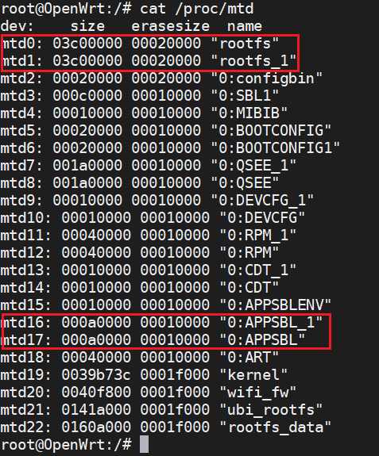

#### uboot升级

```bash
#首先拷贝openwrt-ipq6018-u-boot.mbn文件到设备的/tmp目录下：然后执行下面的mtd命令
dd if=/tmp/openwrt-ipq6018-u-boot.mbn bs=1 conv=sync | mtd -e "/dev/mtd16" write - "/dev/mtd16"

dd if=/tmp/openwrt-ipq6018-u-boot.mbn bs=1 conv=sync | mtd -e "/dev/mtd17" write - "/dev/mtd17"
```


#### 内核升级

```bash
# 首先拷贝openwrt-ipq60xx-ipq60xx_32-ubi-root.img文件到/tmp 目录下然后执行下面的mtd命令

```

### 网页升级

目前由于ddr分区初始化问题，只能烧录`norplusnand-ipq6018-apps.img`文件，不能直接烧录signle文件。

## 高级配置


## 编译可能出现问题

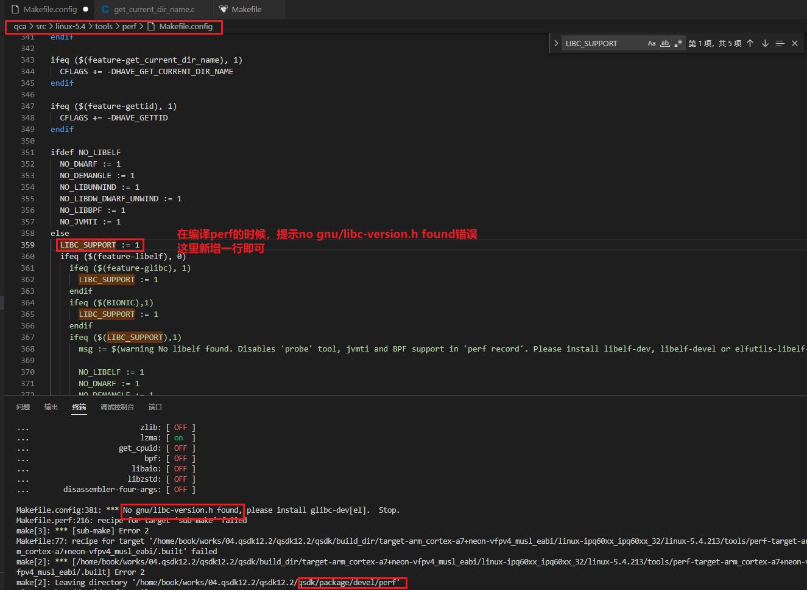

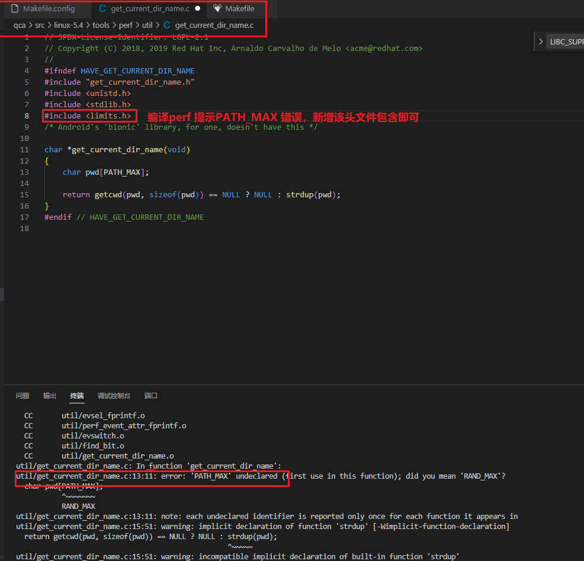


## 关于MachineID