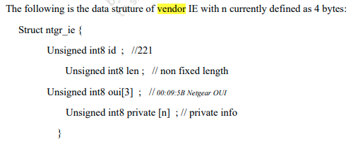

# 高通QSDK 添加vendor ie的方法

## 概述

无线子系统支持add、remove和update   Vendor IE，在Bencon、ProbeReq、ProbeResp、 AssocReq和 AssocResp 无线帧中使用。无线底层驱动必须提供这些功能的API和CLI工具。

主要的结构体如下：



## 基本命令

```bash
 wlanconfig athX vendorie add len <oui+pcap_data in bytes> oui <eg:xxxxxx> pcap_data <eg:xxxxxxxx> ftype_map <eg:xx>
  wlanconfig athX vendorie update len <oui+pcap_data in bytes> oui <eg:xxxxxx> pcap_data <eg:xxxxxxxx> ftype_map <eg:xx>
  wlanconfig athX vendorie remove len <oui+pcap_data in bytes> oui <eg:xxxxxx> pcap_data <eg:xx> # xx 为0xff 清除所有类型，否则为其他类型
  wlanconfig athX vendorie list 
  wlanconfig athX vendorie list len <oui in bytes> oui <eg:xxxxxx>
  wlanconfig athX addie ftype <frame type> len < data len> data <data>
                    #      ftype: 0/2/4('0'-Beacon,'2'-Probe Resp,'4'-Assoc Resp)
                    #       len: Data length(IE length + 2)
                    #       data: Data(in hex) 
```

下面介绍CLI工具wlanconfig 对该功能的支持。

- 增加：`wlanconfig athX vendorie add len <oui+pcap_data 字节和> oui  <57494d> pcap_data  <11223344> ftype_map <12>`

  使用范例：

  ```bash
  wlanconfig ath2 vendorie add 7  oui  57494d pcap_data 11223344  ftype_map 12
  ```

  参数解释如下：

  - `len`：oui+pcap_data的长度和，最大128字节，比如上面一共7个字节（oui 3字节+pcap_data 4字节）

  - `oui`：格式如下：例如WIM三个字符串的十六进制为0x57(W)、0x49(I)、0x4d(M)，那么oui的值为57494d   注意：目前oui只支持3个字节长度，由于上面结构体大小决定。

  - `pcap_data`：自己想增加的数据，格式如下11223344 均为十六进制

  - `ftype_map`：帧类型： 十六进制

    - 12：beacon & assoc  res

    - 05：probe request & assoc res

    - **注意**：该值映射关系如下：参见代码：`qca/src/qca-wifi/umac/include/ieee80211_mlme_app_ie.h`  设置的ftype_map会和下面的宏做&操作，只要置位，就会选中该帧，加入该ie

      ```c
      #define IEEE80211_VENDORIE_INCLUDE_IN_BEACON            0x10
      #define IEEE80211_VENDORIE_INCLUDE_IN_ASSOC_REQ     0x01
      #define IEEE80211_VENDORIE_INCLUDE_IN_ASSOC_RES     0x02
      #define IEEE80211_VENDORIE_INCLUDE_IN_PROBE_REQ     0x04
      #define IEEE80211_VENDORIE_INCLUDE_IN_PROBE_RES     0x08
      ```

      

  空口抓包如下：

  

- 更新：`wlanconfig athX vendorie update len <oui+pcap_data 字节和> oui  <57494d> pcap_data  <11223344> ftype_map <12>`

  例如：

  ```bash
  wlanconfig ath2 vendorie update len 9  oui  57494d pcap_data 112233445566  ftype_map 12
  ```

  

- 列出：`wlanconfig athX vendorie list`

  ```bash
  root@OpenWrt:~# wlanconfig ath2 vendorie list
  
   sizeof vendorie: 16
  
  ----------------------------------------
  Listing vendor IEs matching the following OUI type
  Vendor IE info Ioctl CMD id     : 33
  Total length = 110
  
  Frame type                      :  1
  ID                              : 30
  Length                          : 36
  OUI                             : 010000
  Private capibility_data         : 0f ac 04 04 00 00 0f ac 0a 00 0f ac 09 00 0f ac 04 00 0f ac 08 02 00 00 0f ac 02 00 0f ac 04 0c 00
  
  Frame type                      :  1
  ID                              : 36
  Length                          : 3
  OUI                             : 378000
  Private capibility_data         :
  
  Frame type                      :  1
  ID                              : dd
  Length                          : 7
  OUI                             : 57494d
  Private capibility_data         : 11 22 33 44
  
  Frame type                      :  2
  ID                              : 30
  Length                          : 36
  OUI                             : 010000
  Private capibility_data         : 0f ac 04 04 00 00 0f ac 0a 00 0f ac 09 00 0f ac 04 00 0f ac 08 02 00 00 0f ac 02 00 0f ac 04 0c 00
  
  Frame type                      :  2
  ID                              : 36
  Length                          : 3
  OUI                             : 378000
  Private capibility_data         :
  
  Frame type                      :  4
  ID                              : dd
  Length                          : 7
  OUI                             : 57494d
  Private capibility_data         : 11 22 33 44
  ----------------------------------------
  ```

  

- 删除：`wlanconfig athX vendorie remove 4 <oui+pcap_data in bytes> oui <eg:xxxxxx> pcap_data <eg:xx>`

  **注意：**这里最后 pcap_data <eg:xx>为一个字节数据，0xff 为所有类型，或者其他类型

## 代码分析

```c
//wlanconfig   ath2    vendorie remove   len     <oui+pcap_data in bytes> oui     <eg:xxxxxx> pcap_data  <eg:xx>
//                       argv[1]   argv[2]    argv[3] argv[4]   argv[5]                                     argv[6] argv[7]       argv[8]          argv[9]

int main(int argc, char *argv[])
{
    ifname = argv[1];
    cmd = argv[2];
    if(streq(cmd, "vendorie")) {
        handle_command = handle_command_vendorie;
    }
    handle_command(argc, argv, ifname, &sock_ctx);  // 这里实际调用的是handle_command_vendorie，下面分析该函数
}

int handle_command_vendorie (int argc, char *argv[], const char *ifname,struct socket_context *sock_ctx)
{

    if (argc == ARG_COUNT_VENDOR_IE_REMOVE && streq(argv[3], "remove")) {
        if (streq(argv[4], "len") && streq(argv[6], "oui") && streq(argv[8], "pcap_data")){
            return handle_vendorie (sock_ctx, ifname, IEEE80211_WLANCONFIG_VENDOR_IE_REMOVE,atoi(argv[5]), argv[7], argv[9], NULL);
            // 下面分析该函数handle_vendorie
        }  
    }
}

static int handle_vendorie(struct socket_context *sock_ctx, const char *ifname,
    IEEE80211_WLANCONFIG_CMDTYPE cmdtype, 
    int len,               			 			//---------------------atoi(argv[5] = <oui+pcap_data in bytes>
    char *in_oui,           			//---------------------argv[7]      = <eg:xxxxxx>
    char *in_cap_info,     	 	 //---------------------argv[9]      = <eg:xx>
    char *in_ftype_map)      //---------------------NULL
{

     u_int8_t ie_buf[MAX_VENDOR_BUF_LEN + 12];
    struct ieee80211_wlanconfig_vendorie *vie = (struct ieee80211_wlanconfig_vendorie *) &ie_buf;

    // 这里有个细节，如果是remove命令，len必须为4
     if (cmdtype == IEEE80211_WLANCONFIG_VENDOR_IE_LIST || cmdtype == IEEE80211_WLANCONFIG_VENDOR_IE_REMOVE) {
        if (len != 4 && len != 3 && len != 0){
            printf(" Invalid length ...Expected length is 3 or 0 for list command and 4 for remove command\n");
            return -1;
        }
        if(len != 0)
        {
            if (strlen(in_oui) != VENDORIE_OUI_LEN*2) {
                printf("Invalid OUI , OUI expected always 3 byte, format: xxxxxx)\n");
                return -1;
            }
            strlcpy(oui, in_oui, ((VENDORIE_OUI_LEN * 2) + 1));
            if (char2hex(oui) != 0) {
                printf("Invalid OUI Hex String , Correct Len & OUI field \n");
                return -1;
            }
        }
    }


    if(cmdtype == IEEE80211_WLANCONFIG_VENDOR_IE_REMOVE)
    {
        //从这里也可以看出，len必须为4
        if (len != 4) {
            printf(" Invalid length ...Expected length is 4\n");
            return -1;
        }
        // 从这里看出len - VENDORIE_OUI_LEN) *2 = （4-3）*2= 2 = in_cap_info
        // 所以 in_cap_info必须为2个字节，strlen(in_cap_info)=2  刚好，因为argv[9]是一个字节的字符串，还有结尾符号 /0
        // in_cap_info取值怎么取呢？下面介绍
        if (strlen(in_cap_info) != (len - VENDORIE_OUI_LEN) *2) {
            printf("Invalid len , capability len =%d not matching with total len=%d (bytes) , format: xxxxxxxx)\n", (uint32_t)strlen(in_cap_info),len);
            return -1;
        }

        cap_info = malloc((len - VENDORIE_OUI_LEN) *2 + 1);

        strlcpy(cap_info, in_cap_info, (((len - VENDORIE_OUI_LEN) * 2) + 1));

        if (char2hex(cap_info) != 0) {
            printf("Invalid capability Hex String , Correct Len & Cap_Info field \n");
            return -1;
        }
    }


    switch (cmdtype) {

        case IEEE80211_WLANCONFIG_VENDOR_IE_REMOVE:
            vie->ie.id = IEEE80211_ELEMID_VENDOR;
            memcpy(vie->ie.oui, oui,VENDORIE_OUI_LEN);
            memcpy(vie->ie.cap_info, cap_info, (len - VENDORIE_OUI_LEN));
            vie->ie.len = len;
            vie->tot_len = len + 12;
            break;
    }
    // 上面的vie 即ie_buf 填充完毕，发送到底层驱动, 底层驱动会调用wlan_cfg80211_set_wificonfiguration函数处理，下面分析该函数
    ie_len = send_command(sock_ctx, ifname, &ie_buf, vie->tot_len,NULL, QCA_NL80211_VENDOR_SUBCMD_VENDORIE, IEEE80211_IOCTL_CONFIG_GENERIC);

    // 日志
    if (cmdtype == IEEE80211_WLANCONFIG_VENDOR_IE_REMOVE)
    {
        printf("\n----------------------------------------\n");
        printf("Removing following vendor IEs matching OUI type and subtype\n");
        printf("Vendor IE info Ioctl CMD id     : %d \n",cmdtype);
        printf("ID                              : %02x\n", vie->ie.id);
        printf("OUI                             : %02x%02x%02x\n", vie->ie.oui[0],vie->ie.oui[1],vie->ie.oui[2]);
        
        //这里也可以看出，cap_info[0]==0xff 或者其他的 subtypes类型值 
        // 故而pcap_data <eg:xx> 中的 xx  为0xff 或者其他的 单字节的 subtypes
        if(vie->ie.cap_info[0] == 0xff)
        {
            printf("Subtype                         : all subtypes");
        }
        else
        {
            printf("Subtype                         : %02x",vie->ie.cap_info[0]);
        }
        printf("\n----------------------------------------\n");
    }

}

static int wlan_cfg80211_set_wificonfiguration(struct wiphy *wiphy,
        struct wireless_dev *wdev,
        const void *data,
        int data_len)
 {
    #if ATH_SUPPORT_DYNAMIC_VENDOR_IE
      switch(generic_params.command) {
            case QCA_NL80211_VENDOR_SUBCMD_VENDORIE:
                return_value = wlan_cfg80211_vendorie_params(wiphy, wdev, generic_params.data, generic_params.data_len);
                {
						// 下面分析该函数wlan_cfg80211_vendorie_params

                }
                break;
      }
    #endif


 }   

 int wlan_cfg80211_vendorie_params(struct wiphy *wiphy,
        struct wireless_dev *wdev,
        const void *data,
        int data_len)
{
    ret = ieee80211_ucfg_vendorie(vap, vie); // 下面分析该函数

}    

ieee80211_ucfg_vendorie(wlan_if_t vap, struct ieee80211_wlanconfig_vendorie *vie)
{
	int error;
	switch (vie->cmdtype) {
		case IEEE80211_WLANCONFIG_VENDOR_IE_ADD:
			error = wlan_set_vendorie(vap, IEEE80211_VENDOR_IE_PARAM_ADD, vie); //
			break;

		case IEEE80211_WLANCONFIG_VENDOR_IE_UPDATE:
			error = wlan_set_vendorie(vap, IEEE80211_VENDOR_IE_PARAM_UPDATE, vie);
			break;

		case IEEE80211_WLANCONFIG_VENDOR_IE_REMOVE:
			error = wlan_set_vendorie(vap, IEEE80211_VENDOR_IE_PARAM_REMOVE, vie);//下面分析该函数
			break;

		default:
			error = -ENXIO;
	}
	return error;
}

int wlan_set_vendorie(wlan_if_t vaphandle, enum ieee80211_vendor_ie_param param, void *vendor_ie)
{
    switch(param) {
     case IEEE80211_VENDOR_IE_PARAM_REMOVE:
             if(vap->vie_handle != NULL) {
                if (ieee80211vap_get_opmode(vap) == IEEE80211_M_HOSTAP)
                {
                    wlan_mlme_app_ie_delete(vap->vie_handle, IEEE80211_FRAME_TYPE_BEACON, (u_int8_t*) &vie->ie);
                    wlan_mlme_app_ie_delete(vap->vie_handle, IEEE80211_FRAME_TYPE_ASSOCRESP, (u_int8_t*) &vie->ie);
                    wlan_mlme_app_ie_delete(vap->vie_handle, IEEE80211_FRAME_TYPE_PROBERESP, (u_int8_t*) &vie->ie);
                }
                if (ieee80211vap_get_opmode(vap) == IEEE80211_M_STA)
                {
                    wlan_mlme_app_ie_delete(vap->vie_handle, IEEE80211_FRAME_TYPE_ASSOCREQ, (u_int8_t*) &vie->ie);
                    wlan_mlme_app_ie_delete(vap->vie_handle, IEEE80211_FRAME_TYPE_PROBEREQ, (u_int8_t*) &vie->ie);
                }
             } else {
                qdf_nofl_info("Vendor IE is NUll , please add using wlanconfig command \n");
             }
            break;
    }

} 
```

