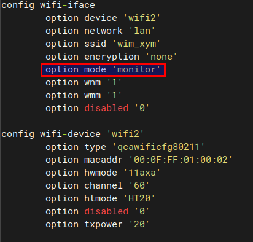
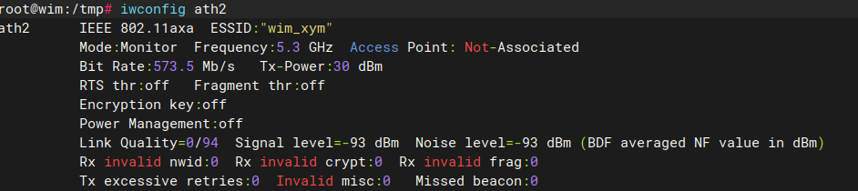
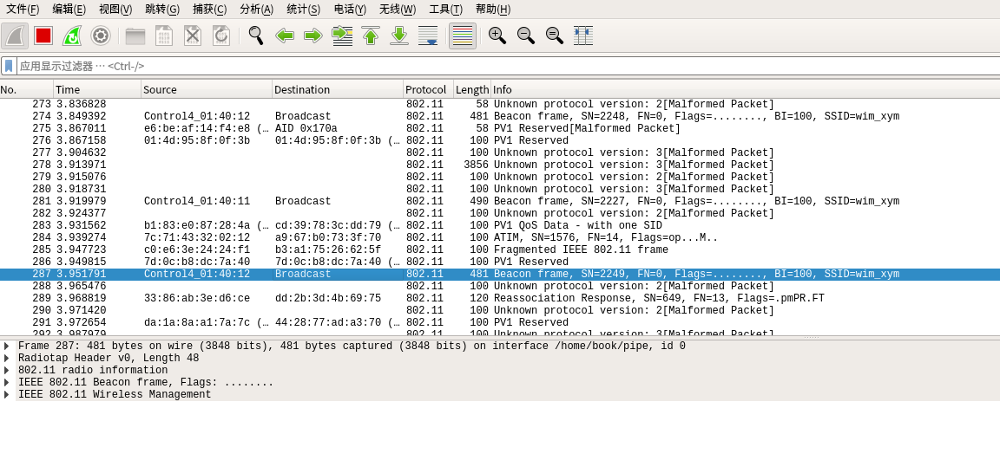

# 高通 QSDK wireshark远程抓空口包

## 在抓包设备上操作

### 设置设备网卡为monitor模式

使用uci命令：

```bash
uci set wireless.@wireless.@wifi-iface[2].mode=monitor
uci commit
wifi down
wifi up
```



**验证**：在设备上使用`tcpdump -i ath2 -s 0 `命令看看能不能抓到空口包，看下Mode是否为**Monitor**



## 在ubuntu上操作

### 在ubuntu 上创建管道

在home目录下创建管道

```bash
mkfifo ~/pipe  #如果已经存在 使用 rm ~/pipe命令删除掉即可
#或者
rm ~/pipe ; mkfifo -m 777 ~/pipe ; exec 3<> ~/pipe
#exec 3 是设置文件id
# <> 可读可写
```

### 在ubuntu上远程tcpdump 并且重定向输出到pipe上

```bash
ssh root@192.168.1.1 "tcpdump -i ath2 -s 0 -U -w -" > ~/pipe
```

- `ssh root@192.168.1.1`  ：远程设备的ip地址，使用ssh登录上去

- `tcpdump -i ath2 -s 0 -U -w -`

  - `-i ath2` ：用来用来抓包的网口(必须开启monitor模式)：

  - `-s 0`：指定抓包大小， 0的话 不限制大小

  - `-U`  ：使用-w选项写文件

    使得当tcpdump在使用-w 选项时, 其文件写入与包的保存同步， 即：当每个数据包被保存时，它将及时被写入文件中，而不是等文件的输出缓冲已满时才真正写入此文件)

    **注意**：  -U 标志在老版本的libcap库(nt: tcpdump 所依赖的报文捕获库)上不起作用, 因为其中缺乏pcap_cump_flush()函数.

- `~/pipe`： ubuntu上刚刚创建的管道，重定向到本地ubuntu上的管道~/pipe里面

### 在ubuntu上另外一个终端开启wireshark 指定抓包接口为~/pipe

```bash
sudo wireshark -k -i ~/pipe
```

可以看到抓到的包如下：

