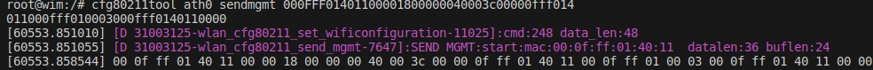
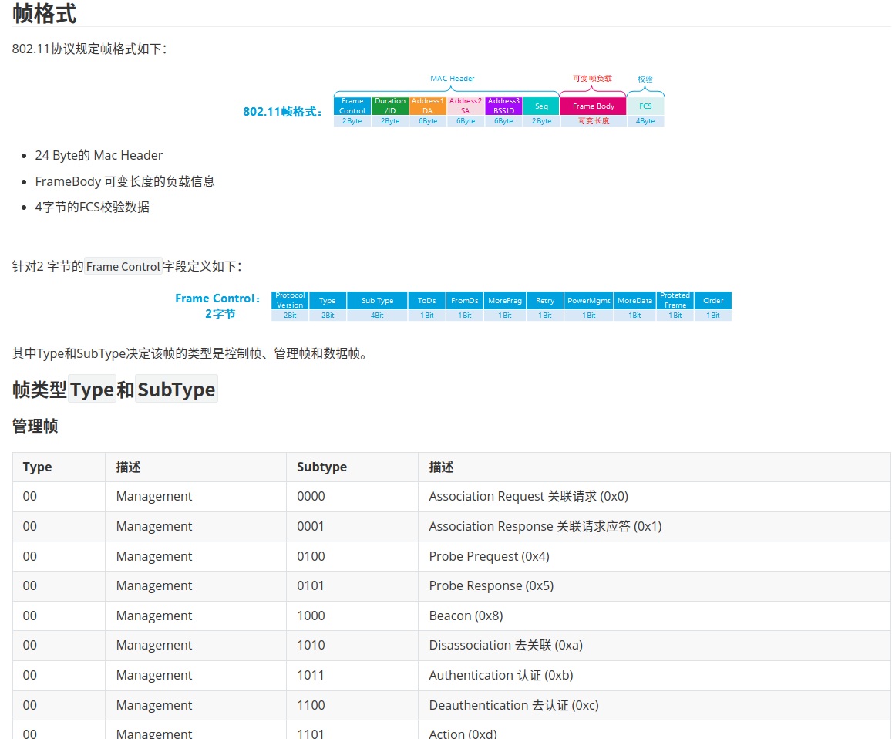
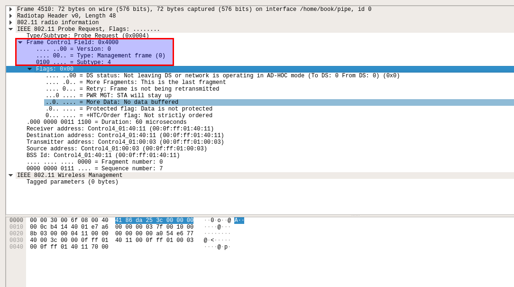
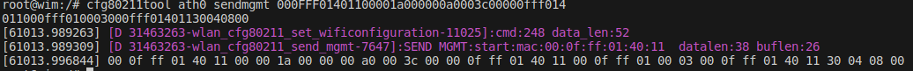
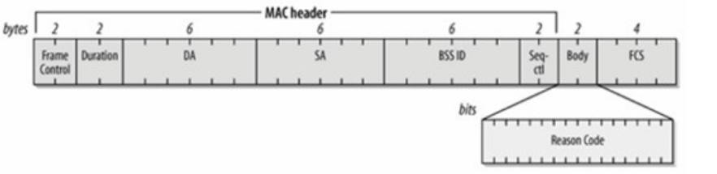
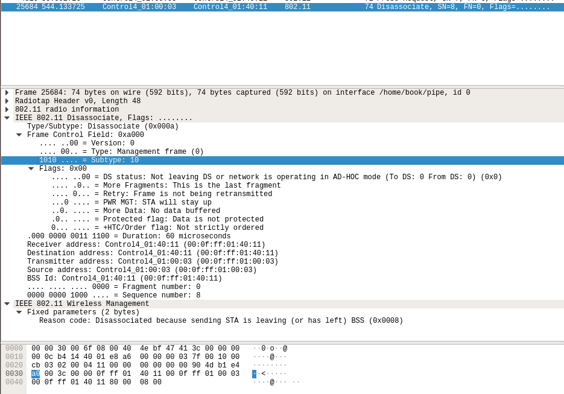
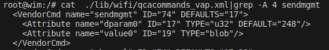

# 高通QSDK 应用层发送控制帧

## 实践

1. 使用cfg80211tool工具发送probe req帧

   ```bash
   cfg80211tool ath0 sendmgmt 000FFF01401100001800000040003c00000fff014011000fff010003000fff0140110000
   ```

   

   参数解释说明：

   - 000FFF0140110000：目的mac地址00:0F:FF:01:40:11  至于后面那0000 为4字节对齐操

   - 18000000：0x18 数据长度24字节  写成这样是 4字节对齐 且大小端模式考虑，24字节内容是从18000000后面开始计数长度，

   - 以上字节是cfg80211tool工具规定的，以便驱动解析，后面是802.11的头，这里发送24字节，我们直发送802.11 mac Header部分

     

   - 4000：Frame Control   这里0x4000  对应 对应probe Requset，具体看下面的抓包

   - 3c00：Duration

   - 000fff014011：Address1  目的地址

   - 000fff010003：Address2 源地址

   - 000fff014011：Address3 目的地址

   - 0000：seq 该字段无所谓

   

2. 验证

   

3. 使用cfg80211tool工具发送Disassociate帧

   ```bash
   cfg80211tool ath0 sendmgmt 000FFF01401100001a000000a0003c00000fff014011000fff010003000fff01401130040800
   ```

   

   参数解释：

   - 000FFF0140110000：目的mac地址00:0F:FF:01:40:11  至于后面那0000 为4字节对齐操

   - 1a000000：0x1a 数据长度26字节  写成这样是 4字节对齐 且大小端模式考虑，26字节内容是从1a000000后面开始计数长度，

   - 以上字节是cfg80211tool工具规定的，以便驱动解析，后面是802.11的头，这里发送26字节，802.11 mac Header 24字节+ wireless Management 2字节，即下图中的Reason Code ，当然从抓包中也可以看到这两个字节

     

   - a000：Frame Control   这里0xa000  对应 对应Disassociate ，具体看下面的抓包

   - 3c00：Duration

   - 000fff014011：Address1  目的地址

   - 000fff010003：Address2 源地址

   - 000fff014011：Address3 目的地址

   - 0000：seq 该字段无所谓

   - 0800 :Reason code 

4. 抓包

   


## 代码解析

参见[高通QSDK nl80211框架](./50.高通QSDK nl80211框架.md#cfg80211tool)文章的cfg80211tool章节介绍，熟悉cfg80211tool工具原理

修改xml文件如下：新增sendmgmt节点



sendmgmt命令会发送nl消息调用驱动层的

```c
const struct wiphy_vendor_command wlan_cfg80211_vendor_commands[] = {
    {
        .info.vendor_id = QCA_NL80211_VENDOR_ID,
        .info.subcmd = QCA_NL80211_VENDOR_SUBCMD_SET_WIFI_CONFIGURATION,   // 该值为74
        .flags = WIPHY_VENDOR_CMD_NEED_WDEV |
            WIPHY_VENDOR_CMD_NEED_NETDEV,
        .doit = wlan_cfg80211_set_wificonfiguration  // 调用该函数
    },
    };
```

```c
static int wlan_cfg80211_set_wificonfiguration(struct wiphy *wiphy,
        struct wireless_dev *wdev,
        const void *data,
        int data_len)
{
     struct wlan_cfg8011_genric_params generic_params;
    // 解析cfg80211tool 传递过来的参数，存放到generic_params里面
    //以上面发送的probe req 为例说明
    //cfg80211tool ath0 sendmgmt 000FFF0140110000 18000000 4000 3c00 000fff014011 000fff010003  000fff014011  0000
	extract_generic_command_params(wiphy, data, data_len, &generic_params);
 	//generic_params->command = 248 存放xml中dparam0 值
    //generic_params->data 指向sendmgmt后面的这段数据000FFF0140110000 18000000 4000 3c00 000fff014011 000fff010003  000fff014011  0000
    //generic_params->data_len 是该数据段的长度
	 switch(generic_params.command) {
	         case QCA_NL80211_VENDORSUBCMD_SEND_MGMT:
            	return_value = wlan_cfg80211_send_mgmt(wiphy, wdev, &generic_params); // 下面分析该函数
            break;
	 }
}
```

```c
static int wlan_cfg80211_send_mgmt(struct wiphy *wiphy,
        struct wireless_dev *wdev,
        struct wlan_cfg8011_genric_params *params)
{
    int ret = 0;
    struct ieee80211req_mgmtbuf *mgmt_frm;
    struct cfg80211_context *cfg_ctx = NULL;
    struct ieee80211com *ic = NULL;
    wlan_if_t vap = NULL;
    int cmd_type;
    void *cmd;
    uint32_t *data = (u_int32_t *) params->data;
    int i;


    cfg_ctx = (struct cfg80211_context *)wiphy_priv(wiphy);
    ic = cfg_ctx->ic;

    cmd = extract_command(ic, wdev, &cmd_type);
    if (cmd_type == VAP_CMD) {
        vap = (wlan_if_t)cmd;
    } else {
        qdf_err(" %s Command on invalid interface \n", __func__);
        return -EINVAL;
    }
    // 把000FFF0140110000 18000000 4000 3c00 000fff014011 000fff010003  000fff014011  0000 数据转换为ieee80211req_mgmtbuf类型的数据
    /*
      *  struct ieee80211req_mgmtbuf {
      * 		u_int8_t  macaddr[IEEE80211_ADDR_LEN]; 			// 目的地址，虽然这里定义6字节，但是考虑到字节对齐，我们传递进来还是4字节对齐的000FFF0140110000
       * 		u_int32_t buflen;															   // buf长度，这里定义为4字节，故而可以解释上面 0x18  在传递的时候是18000000
      * 		 u_int8_t  buf[];                                                                  // buf[] = 4000 3c00 000fff014011 000fff010003  000fff014011  0000
      *   };
      */
    mgmt_frm = (struct ieee80211req_mgmtbuf *) params->data;
/*
    WIM_LOG_DEBUG("SEND MGMT:start:mac:%s  datalen:%d buflen:%d",ether_sprintf(mgmt_frm->macaddr),params->data_len,mgmt_frm->buflen);
    for(i=0;i<params->data_len;i++){
        printk("%02x ",((uint8_t*)params->data)[i]);
    }
    printk("\n");
*/
    if(mgmt_frm->buflen >= 37 && mgmt_frm->buf[24] == 0xff) {
        qdf_err(" %s unknown action frame\n", __func__);
        return -EINVAL;
    }

    /* if the macaddr requested is for broadcast then search for
       all connected sta and send the mgmt packet */
    if(vap) {
        // 如果是广播的话，就跑到这里，我们上面传递的不是广播
        if(IEEE80211_IS_BROADCAST(mgmt_frm->macaddr)) {
            ret = wlan_iterate_station_list(vap, wlan_cfg80211_sta_send_mgmt, mgmt_frm);
        }
        else {
            //故而走该分支，从这里可以看出，驱动是如何把数据解析为结构体 用的
            ret = wlan_send_mgmt(vap, mgmt_frm->macaddr, mgmt_frm->buf, mgmt_frm->buflen);
            // 下面就是wlan_send_mgmt函数的问题了 ，这里不在分析
        }
    } else {
        qdf_err("%s: Invalid vap \n", __func__);
        return -EINVAL;
    }

    /* wlan_iterate_station_list returns the number of sta connected,
       so return error only if the return value is less than zero */
    if (ret < 0) {
        return ret;
    } else {
        return 0;
    }
}

```

